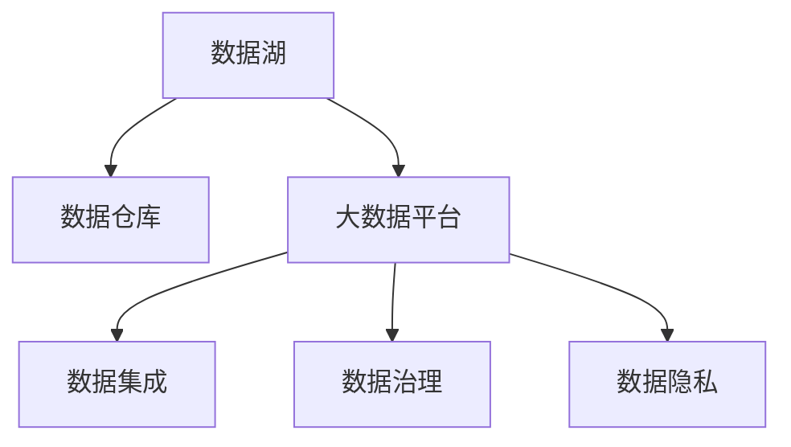

                 

# 人工智能创业数据管理的成功秘诀

在人工智能（AI）创业领域，数据管理无疑是成功的关键因素之一。随着AI技术的不断进步，数据的重要性愈发凸显，如何有效地管理和利用数据，成为企业能否在激烈竞争中脱颖而出的重要考量。本文将系统阐述人工智能创业数据管理的成功秘诀，涵盖数据采集、存储、处理、分析和应用等各个环节，帮助创业者构建数据驱动的智能系统，实现业务创新和转型升级。

## 1. 背景介绍

### 1.1 问题由来

近年来，人工智能技术迅猛发展，其在医疗、金融、教育、零售等多个领域的应用已经初见成效。然而，在AI创业的过程中，数据管理往往成为企业发展的瓶颈。数据质量的参差不齐、数据孤岛现象的普遍存在、数据隐私和安全问题等，都是AI创业企业在数据管理中必须面对的挑战。如何构建一个高效、安全、可扩展的数据管理系统，成为AI创业者不得不解决的重要问题。

### 1.2 问题核心关键点

数据管理在AI创业中扮演着至关重要的角色。其核心关键点包括：

- **数据质量**：数据的准确性、完整性、一致性是确保模型训练和推理准确性的基础。
- **数据安全**：保护数据隐私，防止数据泄露和滥用。
- **数据集成**：打破数据孤岛，实现数据之间的互联互通。
- **数据治理**：制定数据标准，规范数据使用，确保数据可靠性和合规性。
- **数据生命周期管理**：从数据采集到数据销毁，全程管理数据。

## 2. 核心概念与联系

### 2.1 核心概念概述

为更好地理解AI创业数据管理的核心概念，本节将介绍几个密切相关的核心概念：

- **数据湖(Data Lake)**：大规模、分布式的存储系统，用于存储各种类型和格式的数据，支持快速查询和分析。
- **数据仓库(Data Warehouse)**：用于存储和管理结构化数据，支持复杂查询和报表生成，适用于传统关系型数据库。
- **大数据平台(Big Data Platform)**：集成了数据湖和数据仓库，支持实时数据流处理、批处理和数据湖查询，提供全栈数据管理能力。
- **数据治理(Data Governance)**：确保数据的质量、安全和合规，包括数据标准、数据质量管理、元数据管理等。
- **数据集成(Data Integration)**：将分散的数据源集成到一个平台，支持数据的流动和共享。
- **数据隐私(Data Privacy)**：保护个人隐私，防止数据滥用和泄露，符合法律法规要求。

这些核心概念之间的逻辑关系可以通过以下Mermaid流程图来展示：



这个流程图展示了几大核心概念之间的联系：

1. 数据湖是数据管理的基础设施，用于存储各种类型的数据。
2. 数据仓库用于结构化数据的存储和管理，支持复杂查询和报表。
3. 大数据平台整合了数据湖和数据仓库，支持全栈数据管理。
4. 数据治理确保数据的质量、安全和合规。
5. 数据集成实现数据的流动和共享。
6. 数据隐私保护个人隐私，符合法律法规要求。

## 3. 核心算法原理 & 具体操作步骤

### 3.1 算法原理概述

AI创业的数据管理，本质上是一个多步骤的复杂过程，涉及数据的采集、存储、处理、分析和应用等环节。其核心算法原理主要包括：

- **数据清洗**：通过算法和规则，去除数据中的噪声和异常值，保证数据质量。
- **数据集成**：将分散的数据源通过算法进行整合，实现数据的一致性和连通性。
- **数据治理**：通过算法实现数据的标准化、分类和标记，确保数据的一致性和可管理性。
- **数据分析**：运用机器学习算法，对数据进行挖掘和分析，提取有价值的信息和知识。
- **数据应用**：通过算法和模型，将数据转化为决策支持和业务创新的依据。

### 3.2 算法步骤详解

AI创业的数据管理，主要包括以下几个关键步骤：

**Step 1: 数据采集与存储**

- **选择数据源**：根据业务需求，确定需要采集的数据源，包括内部系统、第三方接口、传感器等。
- **数据采集**：使用ETL工具或API接口，将数据从源系统导入数据湖或数据仓库。
- **数据存储**：将采集的数据存储在数据湖或数据仓库中，确保数据安全性和可访问性。

**Step 2: 数据清洗与预处理**

- **数据清洗**：通过算法和规则，去除重复、缺失、错误的数据，提高数据质量。
- **数据预处理**：对数据进行标准化、归一化、转换等预处理操作，为后续分析做好准备。

**Step 3: 数据集成与转换**

- **数据集成**：将来自不同数据源的数据整合到一个平台，实现数据的统一管理和使用。
- **数据转换**：将数据从一种格式转换为另一种格式，支持不同数据源之间的互操作性。

**Step 4: 数据治理与质量管理**

- **数据标准制定**：制定统一的数据标准和规范，确保数据的格式和质量一致。
- **数据质量管理**：通过算法对数据质量进行监控和评估，及时发现和解决数据问题。
- **元数据管理**：管理和维护数据的元数据信息，支持数据的全生命周期管理。

**Step 5: 数据分析与挖掘**

- **数据挖掘**：使用机器学习算法，从数据中发现模式、规律和关联，提取有价值的信息。
- **数据可视化**：将分析结果通过图表、报表等形式展示，帮助业务人员理解数据。

**Step 6: 数据应用与业务决策**

- **模型训练与优化**：使用数据训练机器学习模型，优化模型性能。
- **业务决策支持**：将分析结果转化为决策支持和业务创新，驱动业务增长。

### 3.3 算法优缺点

AI创业的数据管理算法，具有以下优点：

- **自动化与效率提升**：通过算法实现数据的自动化处理和分析，提升数据管理的效率。
- **数据质量保障**：算法可以自动检测和处理数据中的问题，提高数据质量。
- **灵活性**：算法可以根据业务需求进行调整和优化，支持多样化的数据处理和分析任务。

同时，该算法也存在以下缺点：

- **算法复杂度**：算法需要复杂的设计和实现，对数据科学家的要求较高。
- **数据隐私问题**：算法在处理大规模数据时，需要特别注意数据隐私和安全问题。
- **高成本**：实现数据管理算法需要投入大量的人力和物力，成本较高。

### 3.4 算法应用领域

AI创业的数据管理算法，广泛应用于各个领域，包括但不限于：

- **医疗健康**：通过分析患者数据，支持疾病诊断和治疗方案优化。
- **金融服务**：利用客户交易数据，进行风险评估和欺诈检测。
- **零售电商**：分析消费者行为数据，进行个性化推荐和需求预测。
- **智能制造**：通过设备数据，优化生产流程和质量控制。
- **智慧城市**：集成城市运行数据，支持城市管理和应急响应。

## 4. 数学模型和公式 & 详细讲解 & 举例说明

### 4.1 数学模型构建

为了更好地理解AI创业数据管理的数学模型，本节将介绍几个重要的数学模型：

- **数据清洗模型**：用于去除数据中的噪声和异常值，保证数据质量。
- **数据集成模型**：用于将分散的数据源整合到一个平台，实现数据的一致性和连通性。
- **数据治理模型**：用于制定数据标准，规范数据使用，确保数据可靠性和合规性。
- **数据分析模型**：用于挖掘数据中的模式和关联，提取有价值的信息。

### 4.2 公式推导过程

以下是几个重要模型的公式推导过程：

**数据清洗模型**：假设原始数据集为 $D=\{(x_i,y_i)\}_{i=1}^N$，其中 $x_i$ 为输入，$y_i$ 为标签。清洗后的数据集为 $\tilde{D}=\{(\tilde{x}_i,\tilde{y}_i)\}_{i=1}^N$，其中 $\tilde{x}_i$ 为清洗后的输入。数据清洗的目标是找到映射函数 $f(x)$，使得 $\tilde{x}_i=f(x_i)$。常见的清洗算法包括去重、填补缺失值、异常值检测等。

**数据集成模型**：假设有两个数据源 $A=\{(x_i^a,y_i^a)\}_{i=1}^M$ 和 $B=\{(x_i^b,y_i^b)\}_{i=1}^N$，集成后的数据集为 $D=\{(x_i,y_i)\}_{i=1}^{M+N}$，其中 $x_i$ 为集成后的输入，$y_i$ 为集成后的标签。常见的集成算法包括基于规则的集成、基于模型的集成、联邦学习等。

**数据治理模型**：假设原始数据集为 $D=\{(x_i,y_i)\}_{i=1}^N$，治理后的数据集为 $\tilde{D}=\{(\tilde{x}_i,\tilde{y}_i)\}_{i=1}^N$，其中 $\tilde{x}_i$ 为治理后的输入。数据治理的目标是制定数据标准和规范，确保数据的一致性和可管理性。常见的治理算法包括数据分类、数据标记、数据标准化等。

**数据分析模型**：假设原始数据集为 $D=\{(x_i,y_i)\}_{i=1}^N$，分析后的结果为 $\hat{y}$。数据分析的目标是使用机器学习算法，从数据中发现模式和关联，提取有价值的信息。常见的分析算法包括回归分析、分类分析、聚类分析等。

### 4.3 案例分析与讲解

以下通过几个案例，分析数据管理算法的具体应用：

**案例1：医疗健康**

某医院希望通过分析患者数据，优化疾病诊断和治疗方案。首先，数据湖收集了来自不同系统的患者数据，包括电子病历、影像数据、实验室结果等。然后，数据清洗模型对数据进行去重、填补缺失值、异常值检测等操作，保证了数据的质量。接下来，数据集成模型将来自不同系统的数据整合到一个平台，支持统一管理和使用。最后，数据分析模型使用机器学习算法，从数据中发现模式和关联，提取有价值的信息，支持疾病诊断和治疗方案优化。

**案例2：金融服务**

某银行希望通过分析客户交易数据，进行风险评估和欺诈检测。首先，数据湖收集了客户的交易数据，包括交易金额、时间、地点等。然后，数据清洗模型对数据进行去重、填补缺失值、异常值检测等操作，保证了数据的质量。接下来，数据集成模型将来自不同系统的数据整合到一个平台，支持统一管理和使用。最后，数据分析模型使用机器学习算法，从数据中发现模式和关联，提取有价值的信息，支持风险评估和欺诈检测。

**案例3：零售电商**

某电商公司希望通过分析消费者行为数据，进行个性化推荐和需求预测。首先，数据湖收集了消费者行为数据，包括浏览记录、购买记录、评价记录等。然后，数据清洗模型对数据进行去重、填补缺失值、异常值检测等操作，保证了数据的质量。接下来，数据集成模型将来自不同系统的数据整合到一个平台，支持统一管理和使用。最后，数据分析模型使用机器学习算法，从数据中发现模式和关联，提取有价值的信息，支持个性化推荐和需求预测。

## 5. 项目实践：代码实例和详细解释说明

### 5.1 开发环境搭建

在进行数据管理项目实践前，我们需要准备好开发环境。以下是使用Python进行Apache Spark开发的工程环境配置流程：

1. 安装Apache Spark：从官网下载并安装Spark，用于处理大规模数据。
2. 安装PySpark：安装Spark的Python API，用于在Python中处理数据。
3. 安装必要的库：安装Pandas、NumPy、Scikit-Learn等常用库，用于数据处理和分析。

完成上述步骤后，即可在Spark环境中开始数据管理项目实践。

### 5.2 源代码详细实现

下面我们以数据清洗为例，给出使用Spark和PySpark进行数据清洗的代码实现。

首先，定义数据清洗函数：

```python
from pyspark.sql import SparkSession
from pyspark.sql.functions import col, when, array_agg, string_join

spark = SparkSession.builder.appName("Data Cleaning").getOrCreate()

def clean_data(data):
    # 去除重复数据
    cleaned_data = data.dropDuplicates()
    
    # 填补缺失值
    cleaned_data = cleaned_data.fillna(value=0)
    
    # 异常值检测
    cleaned_data = cleaned_data[(cleaned_data['value'] >= 0) & (cleaned_data['value'] <= 100)]
    
    return cleaned_data

# 加载数据
data = spark.read.format("csv").option("header", "true").load("data.csv")

# 执行数据清洗
cleaned_data = clean_data(data)

# 输出清洗后的数据
cleaned_data.show()
```

然后，定义数据集成函数：

```python
from pyspark.sql.functions import concat

def integrate_data(data):
    # 数据集成
    integrated_data = data1.join(data2, "id")
    
    return integrated_data

# 加载数据
data1 = spark.read.format("csv").option("header", "true").load("data1.csv")
data2 = spark.read.format("csv").option("header", "true").load("data2.csv")

# 执行数据集成
integrated_data = integrate_data(data1, data2)

# 输出集成后的数据
integrated_data.show()
```

最后，定义数据治理函数：

```python
from pyspark.sql.functions import col, concat

def govern_data(data):
    # 数据标准化
    governed_data = data.select(col("id"), col("value").cast("double"))
    
    return governed_data

# 加载数据
data = spark.read.format("csv").option("header", "true").load("data.csv")

# 执行数据治理
governed_data = govern_data(data)

# 输出治理后的数据
governed_data.show()
```

以上就是使用Spark和PySpark进行数据清洗、数据集成和数据治理的完整代码实现。可以看到，Spark和PySpark提供了强大的数据处理和分析能力，使得数据管理的代码实现变得简洁高效。

### 5.3 代码解读与分析

让我们再详细解读一下关键代码的实现细节：

**clean_data函数**：
- 使用Spark DataFrame API，对数据进行去重、填补缺失值和异常值检测。
- 通过`dropDuplicates()`去除重复数据。
- 通过`fillna()`填补缺失值。
- 通过`[(value >= 0) & (value <= 100)]`筛选异常值。

**integrate_data函数**：
- 使用Spark DataFrame API，对数据进行数据集成。
- 通过`join()`方法将来自不同系统的数据整合到一个平台。

**govern_data函数**：
- 使用Spark DataFrame API，对数据进行数据治理。
- 通过`select()`方法对数据进行标准化和转换。

**数据处理**：
- 使用`read`方法从CSV文件中加载数据。
- 使用`show()`方法输出数据。

**数据输出**：
- 通过`show()`方法输出处理后的数据。

可以看到，Spark和PySpark提供了强大的数据处理和分析能力，使得数据管理的代码实现变得简洁高效。

## 6. 实际应用场景

### 6.1 智能制造

在智能制造领域，数据管理算法可以应用于设备监控、生产调度和质量控制等方面，提高生产效率和产品质量。例如，某制造企业通过集成来自生产设备的传感器数据，进行实时监控和预测性维护，减少了设备故障率，提高了生产线的稳定性和效率。

### 6.2 智慧城市

在智慧城市治理中，数据管理算法可以应用于交通管理、环境监测和应急响应等方面，提升城市管理的自动化和智能化水平。例如，某智慧城市通过集成来自不同系统（如交通监控、气象站、公共服务）的数据，进行综合分析和决策支持，优化城市交通、提升公共服务水平。

### 6.3 零售电商

在零售电商领域，数据管理算法可以应用于消费者行为分析、库存管理和个性化推荐等方面，提升销售业绩和客户满意度。例如，某电商公司通过集成来自网站访问记录、购物记录和评价记录的数据，进行消费者行为分析，实现个性化推荐和需求预测，提高了销售额和客户满意度。

### 6.4 未来应用展望

随着AI技术的发展，数据管理算法将在更多领域得到应用，为各行各业带来变革性影响。未来，数据管理算法将与更多前沿技术结合，如区块链、边缘计算、联邦学习等，形成更全面、智能的数据管理系统。

## 7. 工具和资源推荐

### 7.1 学习资源推荐

为了帮助开发者系统掌握AI创业数据管理的理论基础和实践技巧，这里推荐一些优质的学习资源：

1. 《Apache Spark从入门到精通》系列博文：由Apache Spark社区专家撰写，深入浅出地介绍了Spark的基本概念、核心功能及应用场景。
2. 《Python数据科学手册》：由数据科学家Wes McKinney撰写，全面介绍了Python在数据处理和分析中的应用。
3. 《数据治理：原则、实践与挑战》书籍：系统介绍了数据治理的理论和实践，帮助读者构建高效的数据治理体系。
4. Kaggle数据科学竞赛：通过参与Kaggle比赛，实践数据处理和分析技巧，提升数据科学能力。
5. Coursera数据科学课程：由斯坦福大学、MIT等名校开设的在线课程，涵盖数据科学基础和高级应用。

通过对这些资源的学习实践，相信你一定能够快速掌握AI创业数据管理的精髓，并用于解决实际的业务问题。

### 7.2 开发工具推荐

高效的开发离不开优秀的工具支持。以下是几款用于AI创业数据管理开发的常用工具：

1. Apache Spark：用于处理大规模数据，支持分布式计算和流处理。
2. PySpark：Python接口，方便在Python中进行数据处理和分析。
3. Hadoop：用于存储和管理大规模数据，支持分布式计算。
4. MySQL/PostgreSQL：关系型数据库，支持结构化数据的存储和管理。
5. Apache Hive：基于Hadoop的数据仓库，支持数据查询和报表生成。

合理利用这些工具，可以显著提升数据管理的开发效率，加快创新迭代的步伐。

### 7.3 相关论文推荐

数据管理技术的发展源于学界的持续研究。以下是几篇奠基性的相关论文，推荐阅读：

1. The Big Data Challenge（大数据挑战）：提出大规模数据管理的问题和挑战，探讨了数据湖和大数据平台的架构设计。
2. Data治理框架（Data Governance Framework）：提出了数据治理的标准和规范，支持数据的可靠性、一致性和安全性。
3. 数据隐私保护（Data Privacy Protection）：研究了数据隐私保护的技术和策略，确保数据的使用合规和安全。
4. 数据集成与转换（Data Integration and Transformation）：探讨了数据集成和转换的技术和算法，支持数据的流动和共享。

这些论文代表了大数据管理技术的发展脉络。通过学习这些前沿成果，可以帮助研究者把握学科前进方向，激发更多的创新灵感。

## 8. 总结：未来发展趋势与挑战

### 8.1 总结

本文对AI创业数据管理的成功秘诀进行了全面系统的介绍。首先阐述了数据管理在AI创业中的重要性和核心关键点，明确了数据质量、数据安全、数据集成、数据治理和数据应用等方面的重要性。其次，从原理到实践，详细讲解了数据清洗、数据集成、数据治理和数据分析的算法原理和具体操作步骤，给出了数据管理项目开发的完整代码实例。同时，本文还广泛探讨了数据管理算法在智能制造、智慧城市、零售电商等多个行业领域的应用前景，展示了数据管理范式的巨大潜力。此外，本文精选了数据管理技术的各类学习资源，力求为读者提供全方位的技术指引。

通过本文的系统梳理，可以看到，数据管理在AI创业中的重要地位，为AI技术的落地应用提供了坚实的基础。未来，伴随大数据技术、AI算法和数据治理的持续演进，数据管理技术必将迎来新的突破，为AI创业企业提供更加强大的技术支撑。

### 8.2 未来发展趋势

展望未来，AI创业的数据管理技术将呈现以下几个发展趋势：

1. **自动化与智能化**：随着人工智能技术的不断进步，数据管理将越来越多地采用自动化和智能化的手段，提高数据处理的效率和准确性。
2. **实时化与流处理**：数据管理将更加注重实时化处理，支持数据流的实时分析和处理，满足业务实时性的要求。
3. **多源数据融合**：未来的数据管理将越来越多地集成和融合来自不同数据源的数据，实现数据的全面整合和利用。
4. **数据隐私保护**：随着数据隐私和安全问题的日益突出，数据管理将更加注重隐私保护，确保数据使用的合规和安全。
5. **元数据管理**：元数据管理将成为数据管理的重要组成部分，支持数据的溯源、版本控制和质量监控。
6. **数据驱动决策**：数据管理将成为企业决策的重要依据，支持业务决策和战略规划。

以上趋势凸显了数据管理技术的广阔前景。这些方向的探索发展，必将进一步提升数据管理的效率和能力，为AI创业企业提供更加全面、高效的数据支持。

### 8.3 面临的挑战

尽管AI创业的数据管理技术已经取得了瞩目成就，但在迈向更加智能化、普适化应用的过程中，它仍面临着诸多挑战：

1. **数据质量问题**：数据质量的参差不齐，是数据管理面临的最大挑战之一。如何提高数据质量，确保数据的准确性和一致性，将是长期需要解决的问题。
2. **数据孤岛现象**：数据孤岛现象普遍存在，不同系统之间的数据难以整合。如何打破数据孤岛，实现数据的互联互通，是数据管理的难点。
3. **数据隐私问题**：数据隐私和安全问题，是数据管理的重要关注点。如何保护个人隐私，防止数据泄露和滥用，需要更多技术和法规的支持。
4. **资源瓶颈**：大规模数据的管理和处理，需要大量的计算资源和存储空间。如何优化数据管理的资源使用，提高数据处理的效率，将是未来技术发展的重点。
5. **数据治理复杂性**：数据治理涉及数据的标准化、分类、标记等方面，工作复杂度较高。如何简化数据治理流程，提高数据治理效率，是数据管理的重要挑战。

### 8.4 研究展望

面对数据管理面临的挑战，未来的研究需要在以下几个方面寻求新的突破：

1. **数据质量自动化**：开发自动化数据清洗和预处理工具，提高数据处理效率和准确性。
2. **数据集成架构**：研究和探索高效的数据集成架构，支持数据的流动和共享。
3. **数据隐私保护技术**：开发新的数据隐私保护技术，确保数据使用的合规和安全。
4. **数据治理平台**：构建统一的数据治理平台，支持数据的标准化、分类和标记。
5. **数据驱动决策支持**：研究和开发基于数据的决策支持系统，提高业务决策的准确性和科学性。

这些研究方向的探索，必将引领数据管理技术迈向更高的台阶，为AI创业企业提供更加全面、高效的数据支持。面向未来，数据管理技术还需要与其他前沿技术进行更深入的融合，如区块链、边缘计算、联邦学习等，多路径协同发力，共同推动数据管理的进步。只有勇于创新、敢于突破，才能不断拓展数据管理的边界，让数据管理技术更好地服务于AI创业企业的业务创新和转型升级。

## 9. 附录：常见问题与解答

**Q1：数据管理在AI创业中的重要性是什么？**

A: 数据管理在AI创业中具有至关重要的作用。数据的质量、安全、集成、治理和应用，直接决定了AI模型的性能和可靠性。优质的数据是AI创业成功的关键因素之一，可以显著提升模型的准确性和鲁棒性，支持业务决策和创新。

**Q2：数据管理面临的主要挑战有哪些？**

A: 数据管理面临的主要挑战包括数据质量问题、数据孤岛现象、数据隐私问题、资源瓶颈和数据治理复杂性等。如何提高数据质量，打破数据孤岛，保护数据隐私，优化资源使用，简化数据治理流程，是数据管理的重要研究方向。

**Q3：数据管理如何与AI技术结合？**

A: 数据管理与AI技术结合，主要体现在以下几个方面：
1. 数据清洗和预处理：通过数据清洗和预处理，提高数据质量，为AI模型的训练和推理提供高质量的数据输入。
2. 数据集成和转换：通过数据集成和转换，实现数据的流动和共享，支持AI模型的多源数据融合。
3. 数据治理和质量管理：通过数据治理和质量管理，确保数据的一致性和合规性，支持AI模型的可靠性和安全性。
4. 数据分析和知识提取：通过数据分析和知识提取，发现数据中的模式和关联，支持AI模型的决策支持和业务创新。

**Q4：数据管理的未来发展方向是什么？**

A: 数据管理的未来发展方向包括自动化与智能化、实时化与流处理、多源数据融合、数据隐私保护、元数据管理、数据驱动决策等。通过自动化和智能化的手段，提高数据处理的效率和准确性；通过实时化处理，满足业务实时性的要求；通过多源数据融合，实现数据的全面整合和利用；通过数据隐私保护，确保数据使用的合规和安全；通过元数据管理，支持数据的溯源、版本控制和质量监控；通过数据驱动决策，提高业务决策的准确性和科学性。

这些方向的研究和发展，将进一步提升数据管理的效率和能力，为AI创业企业提供更加全面、高效的数据支持。

---

作者：禅与计算机程序设计艺术 / Zen and the Art of Computer Programming

