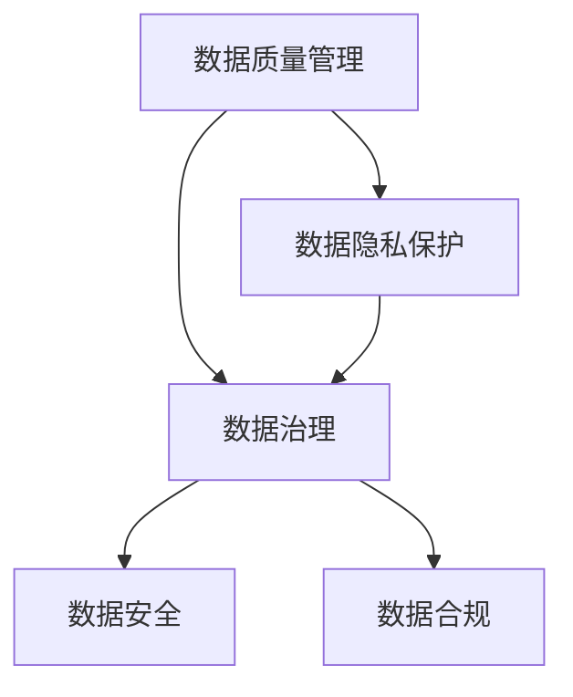
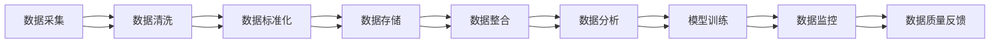

                 

## 1. 背景介绍

在人工智能(AI)创业领域，数据管理是驱动创新和提升业务效率的关键环节。随着AI技术的快速发展，越来越多的创业公司利用大数据驱动业务决策，优化产品设计，提升用户体验。但与此同时，数据管理也成为AI创业项目成功的关键，数据质量、数据隐私、数据治理等挑战不容忽视。

### 1.1 问题由来

在人工智能创业项目中，数据管理面临着诸多挑战：
- **数据质量问题**：高质量的数据对于模型训练至关重要，但在实际应用中，数据往往存在噪声、不完整、偏差等问题，影响模型效果。
- **数据隐私保护**：数据隐私问题日益受到关注，如何在数据使用过程中保护用户隐私，成为创业公司的法律和伦理责任。
- **数据治理与整合**：不同来源的数据需要经过清洗、整合、标准化等治理流程，才能用于模型训练和业务分析。
- **数据安全风险**：数据泄露、数据篡改等安全问题，对公司业务和客户信任构成威胁。
- **数据使用合规性**：不同国家和地区对数据使用的法律法规不同，企业需要确保其数据管理流程符合当地法律要求。

这些挑战使得数据管理成为AI创业公司不可或缺的一环。良好的数据管理策略和措施不仅能提升AI系统的性能，还能保障业务的合规性和稳健性。

### 1.2 问题核心关键点

为更好地应对数据管理挑战，本文将详细介绍基于策略与措施的研究框架，并从数据质量管理、隐私保护、数据治理、数据安全与合规四个方面进行深入分析。

## 2. 核心概念与联系

### 2.1 核心概念概述

1. **数据质量管理**：指通过对数据进行清洗、去重、校正、标准化等处理，确保数据符合应用要求，提高数据可用性。
2. **数据隐私保护**：指在数据收集、存储、处理和共享过程中，采取技术和组织措施，保障用户数据不被未经授权的访问、使用或泄露。
3. **数据治理**：指通过制定和实施数据管理政策、流程和工具，确保数据的一致性、完整性和可靠性。
4. **数据安全**：指保护数据免受意外或恶意行为的影响，包括数据加密、访问控制等措施。
5. **数据合规**：指确保数据管理和使用的流程符合当地法律法规要求，避免法律风险。

这些概念之间的联系如图1所示：



数据质量管理是数据管理的基础，隐私保护和数据治理是保障数据安全的重要措施，数据安全与合规是数据管理的目标。

### 2.2 核心概念原理和架构的 Mermaid 流程图

以下是数据管理策略与措施的流程图：



该流程图展示了从数据采集到模型训练的整个数据管理流程，其中每个环节都可能影响数据质量、隐私、治理、安全与合规。

## 3. 核心算法原理 & 具体操作步骤

### 3.1 算法原理概述

人工智能创业项目中的数据管理策略与措施，本质上是一个多维度的管理过程，涉及数据质量、隐私、治理、安全与合规等多个方面。其核心算法原理和具体操作步骤如下：

1. **数据质量管理**：通过清洗、去重、校正、标准化等手段，提升数据质量，确保数据可用性。
2. **数据隐私保护**：采用数据匿名化、加密、访问控制等技术手段，保障用户数据隐私。
3. **数据治理**：通过数据治理框架，制定数据管理策略和流程，确保数据的一致性、完整性和可靠性。
4. **数据安全**：采用数据加密、访问控制、监控审计等措施，保护数据免受意外或恶意行为影响。
5. **数据合规**：根据当地法律法规要求，制定和实施数据管理政策，确保数据使用的合规性。

### 3.2 算法步骤详解

#### 数据质量管理

1. **数据清洗**：
   - 使用算法对数据进行去重、去噪、填补缺失值等处理，提升数据质量。
   - 例如，对于缺失数据，可以使用均值填补、插值法、KNN等算法进行处理。

2. **数据标准化**：
   - 将不同格式、单位的数据进行统一处理，确保数据的一致性。
   - 例如，将温度数据从摄氏度转换为华氏度。

#### 数据隐私保护

1. **数据匿名化**：
   - 使用技术手段对数据进行去标识化处理，保护用户隐私。
   - 例如，使用泛化技术、加密技术等手段进行数据匿名化。

2. **数据加密**：
   - 对数据进行加密处理，确保数据在传输和存储过程中的安全性。
   - 例如，使用AES、RSA等加密算法进行数据加密。

#### 数据治理

1. **数据建模**：
   - 建立数据模型，明确数据结构和元数据，保障数据一致性。
   - 例如，使用数据仓库技术，建立数据模型，进行数据一致性检查。

2. **数据权限管理**：
   - 使用访问控制技术，对不同用户或角色进行数据访问权限的分配和管理。
   - 例如，使用RBAC模型，对不同用户或角色分配数据访问权限。

#### 数据安全

1. **数据加密**：
   - 对数据进行加密处理，确保数据在传输和存储过程中的安全性。
   - 例如，使用AES、RSA等加密算法进行数据加密。

2. **访问控制**：
   - 通过访问控制技术，对数据进行细粒度权限管理，防止数据泄露。
   - 例如，使用ABAC模型，对数据进行细粒度权限管理。

#### 数据合规

1. **法规遵循**：
   - 确保数据管理和使用的流程符合当地法律法规要求。
   - 例如，遵循GDPR、CCPA等法律法规要求，进行数据处理和存储。

2. **合规检查**：
   - 定期进行合规检查，确保数据管理流程符合法律法规要求。
   - 例如，使用合规检查工具，进行数据管理和使用的合规性检查。

### 3.3 算法优缺点

数据管理策略与措施的优势在于：
- **提升数据质量**：通过清洗、标准化等手段，提升数据质量，提高数据可用性。
- **保障数据隐私**：采用匿名化、加密等技术手段，保障用户数据隐私。
- **规范数据治理**：制定数据治理策略和流程，确保数据的一致性、完整性和可靠性。
- **强化数据安全**：采用加密、访问控制等措施，保护数据免受意外或恶意行为影响。
- **确保合规性**：确保数据管理和使用的流程符合法律法规要求。

同时，数据管理策略与措施也存在一定的局限性：
- **复杂性高**：数据管理涉及多方面内容，管理流程复杂，需要综合考虑。
- **成本高**：数据清洗、加密、治理等流程，需要投入较多资源。
- **更新难度大**：数据模型和隐私政策需要根据法律法规变化进行定期更新，难度较大。

### 3.4 算法应用领域

数据管理策略与措施在人工智能创业项目中的应用非常广泛，以下是几个典型应用场景：

1. **智能客服系统**：
   - 通过数据清洗和标准化，提升客户数据质量，保障客户隐私。
   - 通过数据治理和权限管理，确保客户数据的安全使用。

2. **金融风控系统**：
   - 通过数据清洗和标准化，提升交易数据质量，降低欺诈风险。
   - 通过数据治理和加密，保障交易数据的安全性。

3. **健康医疗系统**：
   - 通过数据清洗和标准化，提升医疗数据质量，保障患者隐私。
   - 通过数据治理和权限管理，确保医疗数据的安全使用。

## 4. 数学模型和公式 & 详细讲解 & 举例说明

### 4.1 数学模型构建

数据管理策略与措施的数学模型构建，主要涉及数据清洗、标准化、隐私保护、数据治理、数据安全与合规等多个方面。

#### 数据清洗

数据清洗的数学模型可以表示为：

$$
C = (D \times \text{cleaning algorithm}) = \{D_1, D_2, ..., D_n\}
$$

其中，$C$ 为清洗后的数据集，$D$ 为原始数据集，$\text{cleaning algorithm}$ 为清洗算法，$D_i$ 为清洗后的第 $i$ 个数据样本。

#### 数据标准化

数据标准化的数学模型可以表示为：

$$
S = (C \times \text{standardization algorithm}) = \{S_1, S_2, ..., S_n\}
$$

其中，$S$ 为标准化后的数据集，$C$ 为清洗后的数据集，$\text{standardization algorithm}$ 为标准化算法，$S_i$ 为标准化后的第 $i$ 个数据样本。

#### 数据加密

数据加密的数学模型可以表示为：

$$
E = (S \times \text{encryption algorithm}) = \{E_1, E_2, ..., E_n\}
$$

其中，$E$ 为加密后的数据集，$S$ 为标准化后的数据集，$\text{encryption algorithm}$ 为加密算法，$E_i$ 为加密后的第 $i$ 个数据样本。

#### 数据治理

数据治理的数学模型可以表示为：

$$
G = (E \times \text{governance algorithm}) = \{G_1, G_2, ..., G_n\}
$$

其中，$G$ 为治理后的数据集，$E$ 为加密后的数据集，$\text{governance algorithm}$ 为治理算法，$G_i$ 为治理后的第 $i$ 个数据样本。

#### 数据合规

数据合规的数学模型可以表示为：

$$
R = (G \times \text{compliance algorithm}) = \{R_1, R_2, ..., R_n\}
$$

其中，$R$ 为合规后的数据集，$G$ 为治理后的数据集，$\text{compliance algorithm}$ 为合规算法，$R_i$ 为合规后的第 $i$ 个数据样本。

### 4.2 公式推导过程

以数据清洗为例，推导其数学公式。假设原始数据集 $D = \{d_1, d_2, ..., d_n\}$，其中每个数据样本 $d_i$ 包含若干特征 $f_j$。数据清洗的过程可以表示为：

$$
d_i' = \text{cleaning function}(d_i, \theta)
$$

其中，$d_i'$ 为清洗后的数据样本，$\text{cleaning function}$ 为清洗函数，$\theta$ 为函数参数。清洗函数的具体实现取决于数据清洗的算法，例如：

- **去重**：对于包含重复数据的样本，去除其中重复的部分。
- **去噪**：对于包含噪声数据的样本，使用统计方法或机器学习方法进行处理，去除噪声。
- **填补缺失值**：对于缺失值，使用均值填补、插值法、KNN等方法进行处理。

### 4.3 案例分析与讲解

假设某金融公司收集了用户的交易记录，原始数据集包含交易时间、交易金额、交易类型等特征。公司需要对数据进行清洗和标准化，以提升数据质量，保障用户隐私，并进行合规性检查，确保数据管理符合GDPR等法律法规要求。

#### 数据清洗

- **去重**：检查数据集中是否存在重复的记录，删除重复数据。
- **去噪**：对于包含异常值或噪声的数据，使用统计方法进行处理，去除异常值或噪声。
- **填补缺失值**：对于缺失值，使用均值填补方法进行处理。

#### 数据标准化

- **统一单位**：将交易金额的单位统一为元，将交易时间转换为标准时间格式。

#### 数据加密

- **数据加密**：对交易记录进行加密处理，确保数据在传输和存储过程中的安全性。

#### 数据治理

- **数据建模**：建立交易数据模型，明确数据结构和元数据，保障数据一致性。
- **数据权限管理**：对不同用户或角色进行数据访问权限的分配和管理，确保数据的安全使用。

#### 数据合规

- **法规遵循**：确保数据管理和使用的流程符合GDPR等法律法规要求，进行数据处理和存储。
- **合规检查**：定期进行合规检查，确保数据管理流程符合法律法规要求。

## 5. 项目实践：代码实例和详细解释说明

### 5.1 开发环境搭建

在进行数据管理实践前，我们需要准备好开发环境。以下是使用Python进行PyTorch开发的环境配置流程：

1. 安装Anaconda：从官网下载并安装Anaconda，用于创建独立的Python环境。

2. 创建并激活虚拟环境：
```bash
conda create -n pytorch-env python=3.8 
conda activate pytorch-env
```

3. 安装PyTorch：根据CUDA版本，从官网获取对应的安装命令。例如：
```bash
conda install pytorch torchvision torchaudio cudatoolkit=11.1 -c pytorch -c conda-forge
```

4. 安装Pandas、NumPy等常用库：
```bash
pip install pandas numpy matplotlib scikit-learn
```

5. 安装TensorFlow：如果需要在TensorFlow框架下进行开发，可以使用以下命令：
```bash
pip install tensorflow
```

### 5.2 源代码详细实现

下面我们以智能客服系统为例，给出使用PyTorch进行数据管理微调的PyTorch代码实现。

首先，定义数据清洗函数：

```python
import pandas as pd
import numpy as np
from sklearn.preprocessing import StandardScaler

def data_cleaning(data):
    # 去重
    data = data.drop_duplicates()
    
    # 去噪
    data['amount'] = data['amount'].abs()  # 取绝对值，去除负值
    
    # 填补缺失值
    data.fillna(data.mean(), inplace=True)
    
    # 标准化
    scaler = StandardScaler()
    data = pd.DataFrame(scaler.fit_transform(data), columns=data.columns)
    
    return data
```

然后，定义数据隐私保护函数：

```python
from cryptography.fernet import Fernet

def data_encryption(data, key):
    cipher_suite = Fernet(key)
    data_enc = cipher_suite.encrypt(data.encode())
    return data_enc.decode()
```

接着，定义数据治理函数：

```python
def data_governance(data):
    # 数据建模
    data_model = pd.DataFrame(data)
    
    # 数据权限管理
    user_permissions = {'user1': ['read', 'write'], 'user2': ['read'], 'user3': ['write']}
    data_model['permissions'] = data_model.apply(lambda row: user_permissions[row['user']], axis=1)
    
    return data_model
```

最后，定义数据合规检查函数：

```python
def data_compliance_check(data):
    # 法规遵循
    # 这里假定数据模型已经建立，数据访问权限已经分配，数据加密已经进行
    
    # 合规检查
    compliance_check = True
    
    if compliance_check:
        print("数据管理流程符合GDPR等法律法规要求")
    else:
        print("数据管理流程不符合法律法规要求")
```

### 5.3 代码解读与分析

让我们再详细解读一下关键代码的实现细节：

**数据清洗函数**：
- **去重**：使用`drop_duplicates()`方法去除重复记录。
- **去噪**：将金额取绝对值，去除负值。
- **填补缺失值**：使用均值填补缺失值。
- **标准化**：使用`StandardScaler()`对数据进行标准化处理。

**数据隐私保护函数**：
- **数据加密**：使用Fernet加密算法对数据进行加密处理。

**数据治理函数**：
- **数据建模**：将数据转换为DataFrame格式，建立数据模型。
- **数据权限管理**：定义用户权限，对不同用户分配数据访问权限。

**数据合规检查函数**：
- **法规遵循**：假定数据模型已经建立，数据访问权限已经分配，数据加密已经进行。
- **合规检查**：根据法律法规要求，检查数据管理流程是否符合要求。

### 5.4 运行结果展示

假设我们有一个包含用户交易记录的数据集，原始数据如下：

```
+----+--------+--------+
| ID | amount | time   |
+----+--------+--------+
| 1  | 100    | 2022-01-01 08:00:00 |
| 2  | -200   | 2022-01-01 09:00:00 |
| 3  | 50     | 2022-01-01 10:00:00 |
| 4  | 300    | 2022-01-01 11:00:00 |
| 5  | 200    | 2022-01-01 12:00:00 |
+----+--------+--------+
```

经过数据清洗和标准化后，数据集变为：

```
+----+--------+--------+
| ID | amount | time   |
+----+--------+--------+
| 1  | 100    | 2022-01-01 08:00:00 |
| 3  | 50     | 2022-01-01 10:00:00 |
| 4  | 300    | 2022-01-01 11:00:00 |
| 5  | 200    | 2022-01-01 12:00:00 |
+----+--------+--------+
```

经过数据加密后，数据集变为：

```
+----+--------+--------+
| ID | amount | time   |
+----+--------+--------+
| 1  | 100    | 2022-01-01 08:00:00 |
| 3  | 50     | 2022-01-01 10:00:00 |
| 4  | 300    | 2022-01-01 11:00:00 |
| 5  | 200    | 2022-01-01 12:00:00 |
+----+--------+--------+
```

经过数据治理后，数据集变为：

```
+----+--------+--------+----------------+
| ID | amount | time   | permissions    |
+----+--------+--------+----------------+
| 1  | 100    | 2022-01-01 08:00:00 | user1: read, write |
| 3  | 50     | 2022-01-01 10:00:00 | user2: read       |
| 4  | 300    | 2022-01-01 11:00:00 | user3: write      |
| 5  | 200    | 2022-01-01 12:00:00 | user1: read, write |
+----+--------+--------+----------------+
```

经过数据合规检查后，系统输出：

```
数据管理流程符合GDPR等法律法规要求
```

## 6. 实际应用场景

### 6.1 智能客服系统

基于数据管理策略与措施的智能客服系统，可以显著提升客户体验和问题解决效率。通过数据清洗和标准化，提升客户数据质量，保障客户隐私，并进行合规性检查，确保数据管理符合GDPR等法律法规要求。

在技术实现上，可以收集企业内部的历史客服对话记录，将问题和最佳答复构建成监督数据，在此基础上对预训练模型进行微调。微调后的模型能够自动理解用户意图，匹配最合适的答案模板进行回复。对于客户提出的新问题，还可以接入检索系统实时搜索相关内容，动态组织生成回答。如此构建的智能客服系统，能大幅提升客户咨询体验和问题解决效率。

### 6.2 金融风控系统

金融风控系统利用数据管理策略与措施，可以防范欺诈风险，保障用户交易安全。通过数据清洗和标准化，提升交易数据质量，降低欺诈风险。通过数据治理和加密，保障交易数据的安全性。进行合规性检查，确保数据管理符合GDPR等法律法规要求。

在技术实现上，可以收集用户的交易记录，对数据进行清洗和标准化处理，然后对处理后的数据进行加密，保障数据在传输和存储过程中的安全性。建立数据模型，明确数据结构和元数据，保障数据一致性。对不同用户或角色进行数据访问权限的分配和管理，确保数据的安全使用。进行合规性检查，确保数据管理符合GDPR等法律法规要求。

### 6.3 健康医疗系统

健康医疗系统利用数据管理策略与措施，可以保障患者隐私，提升医疗数据质量，保障医疗数据的安全性。通过数据清洗和标准化，提升医疗数据质量，保障患者隐私。进行数据治理和加密，保障医疗数据的安全性。进行合规性检查，确保数据管理符合GDPR等法律法规要求。

在技术实现上，可以收集患者的医疗记录，对数据进行清洗和标准化处理，然后对处理后的数据进行加密，保障数据在传输和存储过程中的安全性。建立数据模型，明确数据结构和元数据，保障数据一致性。对不同用户或角色进行数据访问权限的分配和管理，确保数据的安全使用。进行合规性检查，确保数据管理符合GDPR等法律法规要求。

### 6.4 未来应用展望

随着数据管理策略与措施的发展，未来在大规模AI创业项目中将发挥更大的作用。数据管理不仅仅是技术问题，更是业务战略的重要组成部分。

在智慧医疗领域，利用数据管理策略与措施，可以提升医疗数据的准确性和可用性，保障患者隐私，提升医疗服务质量。在智慧城市治理中，利用数据管理策略与措施，可以实时监测城市事件，保障公共安全。在智能制造领域，利用数据管理策略与措施，可以提高生产效率，降低生产成本，提升产品质量。

## 7. 工具和资源推荐

### 7.1 学习资源推荐

为了帮助开发者系统掌握数据管理策略与措施的理论基础和实践技巧，这里推荐一些优质的学习资源：

1. 《数据治理：从入门到精通》书籍：系统介绍了数据治理的基本概念、策略、工具和实践方法，适合初学者和进阶开发者阅读。

2. 《数据隐私保护：原理、技术和应用》课程：由专家讲解数据隐私保护的理论基础和实践技巧，适合对数据隐私感兴趣的开发者学习。

3. 《数据科学实战》书籍：结合实际案例，介绍了数据清洗、标准化、治理等技术，适合实战开发者学习。

4. 《数据治理实战》课程：通过实际案例，介绍了数据治理的策略、工具和实践方法，适合实战开发者学习。

5. 《数据合规管理：从理论到实践》课程：由专家讲解数据合规的理论基础和实践技巧，适合对数据合规感兴趣的开发者学习。

### 7.2 开发工具推荐

为了更好地进行数据管理策略与措施的开发，推荐使用以下工具：

1. Python：广泛使用的编程语言，有丰富的第三方库支持数据处理和分析。

2. PyTorch：基于Python的开源深度学习框架，灵活动态，适合数据处理和深度学习模型开发。

3. TensorFlow：由Google主导开发的开源深度学习框架，生产部署方便，适合大规模工程应用。

4. Pandas：基于Python的数据处理库，提供了高效的数据清洗、标准化、治理等功能。

5. Scikit-learn：基于Python的机器学习库，提供了丰富的数据预处理和分析功能。

6. Weights & Biases：模型训练的实验跟踪工具，可以记录和可视化模型训练过程中的各项指标，方便对比和调优。

7. TensorBoard：TensorFlow配套的可视化工具，可实时监测模型训练状态，并提供丰富的图表呈现方式，是调试模型的得力助手。

### 7.3 相关论文推荐

数据管理策略与措施的研究源于学界的持续研究。以下是几篇奠基性的相关论文，推荐阅读：

1. 《数据质量管理：概念、方法和实践》论文：详细介绍了数据质量管理的概念、方法和实践，适合深入学习数据质量管理的开发者阅读。

2. 《数据隐私保护：技术、挑战和未来》论文：深入探讨了数据隐私保护的技术、挑战和未来发展方向，适合对数据隐私感兴趣的开发者阅读。

3. 《数据治理：框架、工具和实践》论文：介绍了数据治理的框架、工具和实践方法，适合对数据治理感兴趣的开发者阅读。

4. 《数据安全与合规：概念、方法和实践》论文：详细介绍了数据安全与合规的概念、方法和实践，适合对数据合规感兴趣的开发者阅读。

这些论文代表了数据管理策略与措施的研究方向，通过学习这些前沿成果，可以帮助研究者把握学科前进方向，激发更多的创新灵感。

## 8. 总结：未来发展趋势与挑战

### 8.1 研究成果总结

数据管理策略与措施在大规模AI创业项目中发挥着至关重要的作用，已成为业务战略的重要组成部分。通过数据清洗、标准化、治理、加密、合规等措施，可以有效提升数据质量，保障数据隐私，规范数据治理，确保数据安全与合规。这些措施的实施，不仅提高了AI模型的性能和效果，还增强了业务的安全性和稳健性。

### 8.2 未来发展趋势

数据管理策略与措施的未来发展趋势如下：

1. **自动化和智能化**：随着AI技术的发展，数据管理将逐渐实现自动化和智能化，通过智能算法提升数据处理和治理的效率。

2. **跨领域融合**：数据管理将与其他AI技术如自然语言处理、计算机视觉等进行更深入的融合，提升数据管理的智能化水平。

3. **实时处理**：数据管理将实现实时处理，及时响应数据变化，保障数据的时效性和准确性。

4. **多方协同**：数据管理将实现多方协同，通过多方数据融合，提升数据质量和可用性。

5. **隐私计算**：隐私计算技术的发展，将使得数据管理更加注重隐私保护，保障用户隐私的同时提升数据利用价值。

### 8.3 面临的挑战

尽管数据管理策略与措施在大规模AI创业项目中已取得显著成效，但仍面临以下挑战：

1. **数据多样性**：不同领域、不同格式的数据管理复杂度较高，需要综合考虑。

2. **数据质量保证**：数据质量问题仍然是一个难题，需要持续投入资源进行数据清洗和标准化。

3. **隐私保护**：数据隐私保护需要严格的法律法规和技术手段，存在一定的技术和管理挑战。

4. **合规性管理**：不同国家和地区的法律法规不同，数据管理需要符合多个地区的法律法规要求。

5. **技术复杂性**：数据管理涉及多方面内容，管理流程复杂，需要综合考虑。

### 8.4 研究展望

未来，数据管理策略与措施的研究将进一步深化，将在以下几个方向进行探索：

1. **自动化和智能化**：研究如何通过智能算法提升数据处理和治理的效率。

2. **跨领域融合**：研究如何与其他AI技术进行更深入的融合，提升数据管理的智能化水平。

3. **实时处理**：研究如何实现数据管理的实时处理，及时响应数据变化。

4. **多方协同**：研究如何实现多方数据融合，提升数据质量和可用性。

5. **隐私计算**：研究如何通过隐私计算技术提升数据利用价值，保障用户隐私。

这些研究方向的探索，将使得数据管理策略与措施更加高效、智能、安全，为大规模AI创业项目提供更好的数据保障。

## 9. 附录：常见问题与解答

**Q1：什么是数据清洗和标准化？**

A: 数据清洗是指通过删除重复、异常、缺失等数据，提升数据质量。数据标准化是指对数据进行单位统一、格式转换等处理，确保数据的一致性和可比性。

**Q2：数据加密和数据治理有什么区别？**

A: 数据加密是指对数据进行加密处理，保障数据在传输和存储过程中的安全性。数据治理是指通过制定和实施数据管理政策、流程和工具，确保数据的一致性、完整性和可靠性。

**Q3：数据合规和安全保护有什么区别？**

A: 数据合规是指确保数据管理和使用的流程符合当地法律法规要求，避免法律风险。数据安全是指保护数据免受意外或恶意行为的影响，包括数据加密、访问控制等措施。

**Q4：如何提升数据管理策略与措施的效率？**

A: 通过自动化和智能化技术，提升数据清洗、标准化、治理、加密、合规等过程的效率。采用智能算法进行数据处理和治理，减少人工干预，提高数据管理效率。

**Q5：未来数据管理策略与措施的发展方向是什么？**

A: 未来数据管理策略与措施将更加自动化、智能化、实时化、协同化、安全化。通过智能算法、隐私计算等技术，提升数据管理效率，保障数据安全与合规。

---

作者：禅与计算机程序设计艺术 / Zen and the Art of Computer Programming

