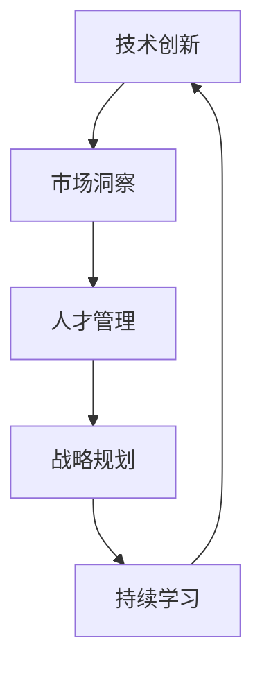

                 

# 人工智能创业：保持技术前沿的策略

> 关键词：人工智能创业, 技术前沿, 创新, 战略规划, 持续学习, 人才管理, 市场洞察, 数据驱动

## 1. 背景介绍

### 1.1 问题由来

随着人工智能(AI)技术的飞速发展，越来越多的初创公司将AI技术应用于各行各业。这些AI公司需要持续保持技术前沿，以应对日益激烈的市场竞争。保持技术前沿的策略，不仅包括技术研发，还包括市场洞察、人才管理、战略规划等多方面的考量。本文将系统介绍AI创业公司如何通过技术、市场、人才和数据等维度，保持技术前沿。

### 1.2 问题核心关键点

保持技术前沿的核心在于不断创新和持续学习，同时在市场洞察、人才管理、战略规划等方面进行全面布局。这些关键点相互关联，共同支撑企业的长期发展。

## 2. 核心概念与联系

### 2.1 核心概念概述

为更好地理解AI创业公司如何保持技术前沿，本节将介绍几个核心概念及其相互关系：

- **技术创新**：指企业在技术研发上持续投入，推出具有竞争力的新产品或新服务。
- **市场洞察**：指企业对市场需求和趋势的敏锐感知和快速反应能力。
- **人才管理**：指企业如何吸引、培养和保留顶尖人才，构建强大的研发团队。
- **战略规划**：指企业如何制定长期发展计划，确定技术发展方向和优先级。
- **持续学习**：指企业通过技术积累和经验总结，不断提高自身能力，跟上技术发展的步伐。

这些核心概念之间的逻辑关系可以通过以下Mermaid流程图来展示：



这个流程图展示了一个AI创业公司保持技术前沿的循环路径：

1. 通过技术创新产生新的产品或服务。
2. 市场洞察指导公司如何利用这些创新。
3. 人才管理确保公司拥有足够的研发人员来实施这些创新。
4. 战略规划确定公司发展的优先级和方向。
5. 持续学习不断提升公司的技术能力，从而支撑未来的创新。

## 3. 核心算法原理 & 具体操作步骤
### 3.1 算法原理概述

AI创业公司保持技术前沿的核心算法是**持续学习算法**。持续学习算法使得公司能够根据最新的市场数据和技术进展，不断更新和优化其产品或服务。

形式化地，假设公司初始的模型为 $M_{\theta}$，其中 $\theta$ 为模型参数。根据市场数据 $D$ 和最新技术 $T$，持续学习算法定义为：

$$
\theta_{\text{new}} = \mathop{\arg\min}_{\theta} \mathcal{L}(M_{\theta}, D, T)
$$

其中 $\mathcal{L}$ 为损失函数，衡量模型在新数据和技术下的表现。持续学习的目标是最小化损失函数，使得模型在新环境下能够高效运行。

### 3.2 算法步骤详解

基于持续学习算法，AI创业公司保持技术前沿的步骤包括：

**Step 1: 数据收集与处理**
- 收集最新的市场数据 $D$，如用户反馈、竞争对手动态等。
- 收集最新的技术 $T$，如学术论文、专利等。
- 使用数据清洗和预处理技术，确保数据的准确性和完整性。

**Step 2: 模型更新**
- 根据最新数据 $D$ 和最新技术 $T$，训练新的模型 $M_{\theta_{\text{new}}}$。
- 将新模型 $M_{\theta_{\text{new}}}$ 的参数 $\theta_{\text{new}}$ 更新到原始模型 $M_{\theta}$ 中。
- 重复上述过程，保持模型与最新市场和技术同步。

**Step 3: 评估与优化**
- 在新市场数据 $D_{\text{new}}$ 上评估模型性能。
- 根据评估结果，调整模型参数和训练策略。
- 定期进行模型迭代，不断优化模型性能。

### 3.3 算法优缺点

持续学习算法具有以下优点：
1. 能够快速适应市场变化，保持技术领先。
2. 能够动态优化模型参数，提升模型性能。
3. 能够整合最新技术，加速技术创新。

同时，该算法也存在一定的局限性：
1. 数据收集和处理成本高。需要投入大量资源收集和处理市场数据和技术信息。
2. 模型更新频率高。频繁的模型更新可能带来系统不稳定的问题。
3. 算法复杂度高。需要设计复杂的评估和优化机制，增加技术门槛。

尽管存在这些局限性，但就目前而言，持续学习算法仍是AI创业公司保持技术前沿的主要手段。未来相关研究的重点在于如何降低数据收集和处理的成本，提高模型更新的稳定性，同时兼顾算法复杂性等因素。

### 3.4 算法应用领域

持续学习算法在AI创业公司的各个业务领域都有广泛的应用，例如：

- **产品研发**：持续学习算法能够根据市场反馈和用户需求，不断优化产品功能和性能。
- **市场策略**：持续学习算法能够分析竞争对手动态和市场需求变化，调整市场策略。
- **技术创新**：持续学习算法能够整合最新技术进展，推动技术突破和创新。
- **人才管理**：持续学习算法能够分析员工表现和职业发展需求，提供个性化培训和职业发展路径。

这些核心概念共同构成了AI创业公司的技术前沿策略，帮助其在激烈的市场竞争中脱颖而出。

## 4. 数学模型和公式 & 详细讲解 & 举例说明

### 4.1 数学模型构建

本节将使用数学语言对持续学习算法进行更加严格的刻画。

假设公司初始的模型为 $M_{\theta}$，其中 $\theta$ 为模型参数。市场数据为 $D=\{(x_i,y_i)\}_{i=1}^N$，技术进展为 $T=\{t_j\}_{j=1}^M$，其中 $x_i$ 为市场数据，$y_i$ 为市场标签，$t_j$ 为技术进展内容。

定义模型 $M_{\theta}$ 在市场数据 $x_i$ 上的损失函数为 $\ell(M_{\theta}(x_i),y_i)$，则在数据集 $D$ 上的经验风险为：

$$
\mathcal{L}(M_{\theta}, D) = \frac{1}{N}\sum_{i=1}^N \ell(M_{\theta}(x_i),y_i)
$$

定义模型 $M_{\theta}$ 在技术进展 $t_j$ 上的损失函数为 $\ell_t(M_{\theta},t_j)$，则在技术集 $T$ 上的经验风险为：

$$
\mathcal{L}_t(M_{\theta}, T) = \frac{1}{M}\sum_{j=1}^M \ell_t(M_{\theta},t_j)
$$

持续学习算法的目标是最小化这两个损失函数的加权和：

$$
\theta_{\text{new}} = \mathop{\arg\min}_{\theta} \alpha \mathcal{L}(M_{\theta}, D) + (1-\alpha) \mathcal{L}_t(M_{\theta}, T)
$$

其中 $\alpha$ 为市场数据和新技术的权重，可根据实际情况进行调整。

### 4.2 公式推导过程

以下我们以持续学习算法为例，推导其具体公式和计算步骤。

假设模型 $M_{\theta}$ 在市场数据 $x_i$ 上的预测为 $M_{\theta}(x_i)$，与真实标签 $y_i$ 的误差为 $\delta_i = y_i - M_{\theta}(x_i)$。

市场数据的损失函数为：

$$
\mathcal{L}(M_{\theta}, D) = \frac{1}{N}\sum_{i=1}^N \ell(\delta_i)
$$

假设技术进展 $t_j$ 对模型 $M_{\theta}$ 的影响为 $\Delta_t$，则技术进展的损失函数为：

$$
\mathcal{L}_t(M_{\theta}, T) = \frac{1}{M}\sum_{j=1}^M \ell_t(\Delta_t)
$$

因此，持续学习算法的损失函数为：

$$
\mathcal{L}_{\text{total}}(M_{\theta}, D, T) = \alpha \mathcal{L}(M_{\theta}, D) + (1-\alpha) \mathcal{L}_t(M_{\theta}, T)
$$

通过优化上述损失函数，即可实现持续学习算法的更新。

### 4.3 案例分析与讲解

假设某AI创业公司开发了一款智能推荐系统，基于用户行为数据和最新技术进展进行推荐。

**案例背景**：
公司收集了大量用户浏览和点击数据，通过持续学习算法不断优化推荐模型。同时，公司关注最新的深度学习技术进展，引入最新的推荐算法和技术模型，进一步提升推荐效果。

**案例步骤**：
1. 数据收集与处理：从网站和App中收集用户行为数据，进行数据清洗和预处理。
2. 模型训练与更新：使用持续学习算法，根据用户行为数据不断优化推荐模型。
3. 技术引入与整合：关注最新的深度学习技术进展，如GNN、Attention等，将其整合到推荐模型中。
4. 评估与优化：在新的用户行为数据和推荐技术上评估模型性能，调整模型参数和训练策略。

通过以上步骤，公司能够保持推荐系统的技术前沿，满足用户不断变化的需求，提升推荐效果。

## 5. 项目实践：代码实例和详细解释说明
### 5.1 开发环境搭建

在进行持续学习实践前，我们需要准备好开发环境。以下是使用Python进行TensorFlow开发的环境配置流程：

1. 安装Anaconda：从官网下载并安装Anaconda，用于创建独立的Python环境。

2. 创建并激活虚拟环境：
```bash
conda create -n tf-env python=3.8 
conda activate tf-env
```

3. 安装TensorFlow：根据CUDA版本，从官网获取对应的安装命令。例如：
```bash
conda install tensorflow-gpu=2.5 -c conda-forge
```

4. 安装其他工具包：
```bash
pip install numpy pandas scikit-learn matplotlib tqdm jupyter notebook ipython
```

完成上述步骤后，即可在`tf-env`环境中开始持续学习实践。

### 5.2 源代码详细实现

这里我们以推荐系统为例，给出使用TensorFlow进行持续学习算法的PyTorch代码实现。

首先，定义推荐系统的数据处理函数：

```python
import tensorflow as tf
from tensorflow.keras.preprocessing.sequence import pad_sequences
from sklearn.model_selection import train_test_split

def preprocess_data(data, seq_length):
    X = []
    y = []
    for user, items in data:
        X.append([item[0] for item in items])
        y.append([item[1] for item in items])
    X = pad_sequences(X, maxlen=seq_length)
    y = tf.keras.utils.to_categorical(y, num_classes=num_classes)
    return X, y
```

然后，定义模型和优化器：

```python
from tensorflow.keras import Sequential
from tensorflow.keras.layers import Embedding, LSTM, Dense, Dropout

model = Sequential([
    Embedding(vocab_size, embedding_dim, input_length=max_seq_length),
    LSTM(lstm_units),
    Dropout(0.2),
    Dense(num_classes, activation='softmax')
])

optimizer = tf.keras.optimizers.Adam(lr=0.001)
```

接着，定义训练和评估函数：

```python
from tensorflow.keras.callbacks import EarlyStopping

def train_model(X_train, y_train, X_test, y_test, epochs, batch_size):
    model.compile(optimizer=optimizer, loss='categorical_crossentropy', metrics=['accuracy'])
    model.fit(X_train, y_train, batch_size=batch_size, epochs=epochs, validation_data=(X_test, y_test), callbacks=[EarlyStopping(patience=5)])
    
def evaluate_model(X_test, y_test):
    model.evaluate(X_test, y_test, verbose=0)
```

最后，启动持续学习流程并在新的数据上评估：

```python
epochs = 10
batch_size = 32

for epoch in range(epochs):
    X_train, y_train, X_val, y_val = train_test_split(X, y, test_size=0.2, random_state=42)
    train_model(X_train, y_train, X_val, y_val, epochs=1, batch_size=batch_size)
    evaluate_model(X_val, y_val)
    
# 在新的数据上评估模型
X_new, y_new = preprocess_data(new_data, seq_length)
evaluate_model(X_new, y_new)
```

以上就是使用TensorFlow进行持续学习算法开发和应用的完整代码实现。可以看到，TensorFlow提供了丰富的API和工具，使得持续学习算法的设计和实现变得简单高效。

### 5.3 代码解读与分析

让我们再详细解读一下关键代码的实现细节：

**preprocess_data函数**：
- 函数用于将原始数据转化为TensorFlow可用的格式。
- 将用户行为序列转化为向量形式，并使用pad_sequences进行填充。
- 将标签进行one-hot编码，转换为TensorFlow可接受的格式。

**train_model函数**：
- 函数用于训练和评估模型。
- 在每个epoch内，使用EarlyStopping回调机制，一旦模型性能不再提升，立即停止训练。
- 在每个epoch结束后，对验证集进行评估，根据评估结果决定是否停止训练。

**evaluate_model函数**：
- 函数用于对模型进行评估。
- 在测试集上评估模型性能，输出模型的准确率。

**持续学习流程**：
- 循环训练和评估模型，使用新的数据不断更新模型参数。
- 通过EarlyStopping避免过度拟合，保证模型性能稳定。
- 在新的数据上评估模型性能，确保模型始终处于技术前沿。

可以看到，TensorFlow和Keras使得持续学习算法的实现变得简单易懂，开发者可以更专注于算法的优化和调整。

## 6. 实际应用场景
### 6.1 推荐系统

持续学习算法在推荐系统中有着广泛的应用。传统的推荐系统往往依赖固定的模型和特征，无法及时适应用户需求的变化。持续学习算法能够根据最新的用户行为数据和推荐技术，动态调整推荐模型，提升推荐效果。

在实践中，推荐系统可以不断收集用户的新行为数据，如浏览记录、点击行为等，使用持续学习算法更新推荐模型。同时，可以引入最新的推荐算法和技术模型，如GNN、Attention等，进一步优化推荐效果。

### 6.2 智能客服

持续学习算法在智能客服中也有着重要的应用。智能客服系统需要根据用户的问题不断调整回答策略，以提升用户体验。

在实践中，智能客服系统可以收集用户与系统交互的记录，使用持续学习算法更新回答策略。同时，可以引入最新的自然语言处理技术和算法，提升系统的回答准确率和覆盖范围。

### 6.3 金融风险管理

持续学习算法在金融风险管理中也有着广泛的应用。金融市场变化多端，传统的风险管理模型往往难以适应市场动态。

在实践中，金融机构可以收集市场的最新动态，如舆情信息、交易数据等，使用持续学习算法更新风险管理模型。同时，可以引入最新的金融技术和算法，提升风险管理的准确性和效率。

### 6.4 未来应用展望

随着持续学习算法的发展，未来其在AI创业公司中的应用将会更加广泛，为各行各业带来深刻的变革。

在智慧城市中，持续学习算法可以用于交通流量预测、环境监测、公共安全管理等领域，提升城市管理的智能化水平。

在医疗健康领域，持续学习算法可以用于疾病预测、个性化治疗、医疗资源分配等领域，提升医疗服务的精准性和效率。

在教育培训领域，持续学习算法可以用于学习内容推荐、学习效果评估、个性化教学等领域，提升教育培训的效果和质量。

## 7. 工具和资源推荐
### 7.1 学习资源推荐

为了帮助开发者系统掌握持续学习算法的理论基础和实践技巧，这里推荐一些优质的学习资源：

1. 《TensorFlow从原理到实践》系列博文：由TensorFlow技术专家撰写，深入浅出地介绍了TensorFlow原理、应用和最佳实践。

2. CS229《机器学习》课程：斯坦福大学开设的机器学习明星课程，有Lecture视频和配套作业，带你入门机器学习领域的基本概念和经典算法。

3. 《Deep Learning》书籍：Ian Goodfellow等著作，全面介绍了深度学习的理论基础和实践技巧，涵盖推荐系统、智能客服、金融风险管理等多个领域。

4. Kaggle：数据科学竞赛平台，提供丰富的推荐系统、智能客服、金融风险管理等领域的实际案例，帮助你通过实践提升技能。

5. GitHub：代码托管平台，提供大量推荐系统、智能客服、金融风险管理等领域的开源项目和代码库，供你学习和参考。

通过对这些资源的学习实践，相信你一定能够快速掌握持续学习算法的精髓，并用于解决实际的AI应用问题。

### 7.2 开发工具推荐

高效的开发离不开优秀的工具支持。以下是几款用于持续学习开发的常用工具：

1. TensorFlow：由Google主导开发的开源深度学习框架，生产部署方便，适合大规模工程应用。提供了丰富的API和工具，使得持续学习算法的实现变得简单高效。

2. Keras：基于TensorFlow的高层次API，简单易用，支持多种深度学习模型和算法。

3. Jupyter Notebook：交互式编程环境，支持Python、R等语言，适合进行实验和开发。

4. PyTorch：基于Python的开源深度学习框架，灵活动态的计算图，适合快速迭代研究。支持持续学习算法的设计和实现。

5. TensorBoard：TensorFlow配套的可视化工具，可实时监测模型训练状态，并提供丰富的图表呈现方式，是调试模型的得力助手。

6. Weights & Biases：模型训练的实验跟踪工具，可以记录和可视化模型训练过程中的各项指标，方便对比和调优。

合理利用这些工具，可以显著提升持续学习算法的开发效率，加快创新迭代的步伐。

### 7.3 相关论文推荐

持续学习算法的发展源于学界的持续研究。以下是几篇奠基性的相关论文，推荐阅读：

1. Online Sequential Learning and Algorithms (OSLA)：提出在线序列学习算法，能够动态更新模型参数，适应新数据和新技术的变化。

2. Continual Learning: A Survey:提出持续学习的概念和方法，综述了当前的研究进展和技术挑战。

3. Practical Meta-Learning for Continual Learning:提出元学习算法，能够从少量样本中学习新任务的适应性，提升持续学习的效率和效果。

4. Meta-Learning with Continual Optimal Transport:提出元学习算法，能够在不同任务间进行知识迁移，提升持续学习的泛化能力。

5. Neural Network Pruning via Deep Low-Rank Decomposition:提出网络剪枝算法，能够压缩模型参数，提升持续学习的计算效率。

这些论文代表了大规模持续学习算法的最新研究动态，通过学习这些前沿成果，可以帮助研究者把握学科前进方向，激发更多的创新灵感。

## 8. 总结：未来发展趋势与挑战

### 8.1 总结

本文对AI创业公司如何保持技术前沿进行了全面系统的介绍。首先阐述了持续学习算法的基本原理和实现步骤，明确了技术创新、市场洞察、人才管理和战略规划等关键因素对保持技术前沿的重要性。其次，从原理到实践，详细讲解了持续学习算法在推荐系统、智能客服、金融风险管理等多个领域的实际应用，展示了持续学习算法的广泛潜力。此外，本文还精选了持续学习算法的各类学习资源，力求为读者提供全方位的技术指引。

通过本文的系统梳理，可以看到，持续学习算法是大规模AI创业公司保持技术前沿的重要手段。通过不断学习和优化模型，AI公司能够动态适应市场变化，持续提供高质量的产品和服务，在激烈的市场竞争中脱颖而出。

### 8.2 未来发展趋势

展望未来，持续学习算法将呈现以下几个发展趋势：

1. 数据驱动增强。数据是持续学习算法的核心，未来将通过大数据、云计算等技术，进一步提高数据收集和处理能力，推动算法性能提升。

2. 跨领域协同。跨领域协同学习能够整合不同领域的知识和经验，提升持续学习算法的泛化能力和应用范围。

3. 算法创新。未来将涌现更多新颖的持续学习算法，如元学习、对抗学习、生成对抗网络等，进一步提升算法的复杂度和有效性。

4. 模型压缩。模型压缩技术能够减小模型参数和计算资源需求，提升持续学习的计算效率和实用性。

5. 实时性增强。未来将开发更多实时性强的持续学习算法，支持在线学习和大规模数据流处理。

6. 普适性提升。未来将开发更多普适性强的持续学习算法，支持不同规模和类型的企业应用。

这些趋势凸显了持续学习算法的广阔前景，将推动AI技术在更多领域得到广泛应用。

### 8.3 面临的挑战

尽管持续学习算法已经取得了瞩目成就，但在迈向更加智能化、普适化应用的过程中，它仍面临着诸多挑战：

1. 数据收集和处理成本高。需要投入大量资源收集和处理市场数据和技术信息，增加了公司的运营成本。

2. 算法复杂度高。持续学习算法的设计和实现需要深厚的数学和编程功底，增加了技术门槛。

3. 计算资源需求大。大规模持续学习算法需要大量的计算资源，增加了公司的硬件投入。

4. 实时性问题。持续学习算法需要实时处理大量数据，可能面临计算瓶颈和系统不稳定问题。

5. 模型可解释性不足。持续学习算法通常被视为"黑盒"系统，难以解释其内部工作机制和决策逻辑，增加了应用风险。

6. 安全性问题。持续学习算法可能学习到有害的信息，需要通过数据过滤和算法设计，确保输出的安全性。

正视持续学习面临的这些挑战，积极应对并寻求突破，将是大规模AI创业公司保持技术前沿的必由之路。相信随着学界和产业界的共同努力，这些挑战终将一一被克服，持续学习算法必将在构建智能系统的进程中扮演越来越重要的角色。

### 8.4 研究展望

面对持续学习算法所面临的种种挑战，未来的研究需要在以下几个方面寻求新的突破：

1. 探索多源数据融合。探索从不同来源和类型的数据中提取知识和经验，提升持续学习算法的融合能力和泛化能力。

2. 研究自动化模型优化。开发自动化模型优化工具，利用数据驱动的调参策略，提升持续学习算法的效率和效果。

3. 引入对抗样本学习。引入对抗样本学习技术，增强持续学习算法的鲁棒性和安全性。

4. 结合因果分析和博弈论。将因果分析和博弈论工具引入持续学习算法，增强模型的决策能力和系统稳定性。

5. 纳入伦理道德约束。在模型训练目标中引入伦理导向的评估指标，过滤和惩罚有害的输出倾向，确保模型的道德和社会责任。

这些研究方向的探索，必将引领持续学习算法迈向更高的台阶，为构建智能系统提供更加全面和可靠的技术支持。面向未来，持续学习算法还需要与其他人工智能技术进行更深入的融合，如知识表示、因果推理、强化学习等，多路径协同发力，共同推动AI技术的进步和应用。只有勇于创新、敢于突破，才能不断拓展持续学习算法的边界，让智能技术更好地造福人类社会。

## 9. 附录：常见问题与解答

**Q1：持续学习算法是否适用于所有AI应用？**

A: 持续学习算法在大多数AI应用中都能取得不错的效果，特别是对于需要动态适应数据变化的应用场景。但对于一些静态和固定的任务，如传统数据分析等，持续学习算法可能并不适用。

**Q2：持续学习算法如何应对大规模数据？**

A: 大规模数据是持续学习算法的核心，但也需要设计高效的算法和数据处理技术。可以通过数据采样、分布式计算、多层次数据融合等技术，提升持续学习算法的效率和效果。

**Q3：持续学习算法在实时应用中是否稳定？**

A: 实时应用需要高效且稳定的持续学习算法，否则可能面临计算瓶颈和系统不稳定问题。可以通过模型压缩、分布式计算、缓存优化等技术，提升持续学习算法的实时性和稳定性。

**Q4：如何评估持续学习算法的性能？**

A: 评估持续学习算法的性能需要考虑模型精度、计算效率、实时性等多个因素。通常使用准确率、F1-score、计算时间等指标进行评估，根据具体应用场景选择最合适的评估指标。

**Q5：如何提升持续学习算法的泛化能力？**

A: 提升持续学习算法的泛化能力需要从多个方面入手，如数据多样性、模型复杂度、模型结构等。可以通过跨领域数据融合、多层次模型设计、对抗样本学习等技术，提升持续学习算法的泛化能力和鲁棒性。

---

作者：禅与计算机程序设计艺术 / Zen and the Art of Computer Programming

