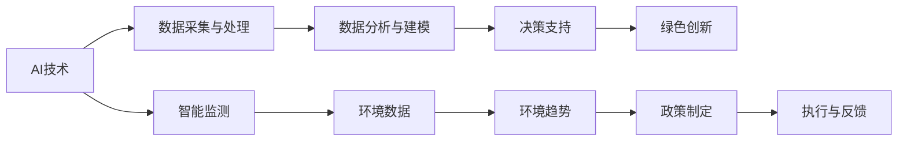

                 

# 人工智能在气候变化和可持续发展中的应用

## 1. 背景介绍

气候变化是当今世界面临的最大挑战之一，对人类的生存环境和经济发展构成了巨大威胁。为了应对这一挑战，全球各国都在积极采取行动，推动可持续发展目标（Sustainable Development Goals, SDGs）的实现。人工智能（AI）作为一种先进的技术手段，正在被广泛应用于气候变化和可持续发展领域，助力科学决策、精准管理、智能监测、绿色创新等诸多方面，展现出巨大的潜力和价值。

## 2. 核心概念与联系

### 2.1 核心概念概述

在探讨人工智能在气候变化和可持续发展中的应用时，需要理解几个核心概念：

- **人工智能（AI）**：一种通过机器学习、深度学习等技术，使计算机系统能够从数据中学习，进行自主决策、推理和分析的能力。
- **气候变化**：由于温室气体排放、人类活动等因素导致的全球气候系统变化，引发极端天气、海平面上升、生态系统破坏等环境问题。
- **可持续发展**：在满足当代需求的同时，不损害后代人满足其需求的能力的发展模式。
- **智能监测**：利用AI技术对环境数据进行实时监测和分析，识别环境变化趋势和异常，提供决策支持。
- **绿色创新**：利用AI技术推动能源、交通、农业、工业等领域的技术革新，减少碳排放，实现低碳发展。

这些概念之间的联系在于，AI技术通过其强大的数据分析和推理能力，能够从海量数据中提取出有用的信息，辅助人类更好地理解气候变化和可持续发展的复杂系统，从而制定更科学的政策和措施，推动绿色发展。

### 2.2 核心概念原理和架构的 Mermaid 流程图



该图展示了AI技术在气候变化和可持续发展中的应用流程：通过数据采集与处理、数据分析与建模、决策支持，最终推动绿色创新和智能监测，形成闭环反馈机制。

## 3. 核心算法原理 & 具体操作步骤

### 3.1 算法原理概述

人工智能在气候变化和可持续发展中的应用，主要涉及以下几个关键算法原理：

- **机器学习（ML）**：利用历史数据训练模型，预测未来气候变化趋势，辅助政策制定。
- **深度学习（DL）**：通过神经网络模型，从大量数据中提取复杂特征，实现环境监测和预测。
- **强化学习（RL）**：通过奖励机制和反馈学习，优化资源配置和能源使用，推动绿色发展。
- **自然语言处理（NLP）**：通过文本分析和语义理解，提取公众意见和媒体报道，了解公众对气候变化的关注和态度。

这些算法原理通过不断的模型训练和优化，能够在实际应用中实现数据驱动的决策和智能化的环境管理。

### 3.2 算法步骤详解

以下是AI在气候变化和可持续发展应用中的典型算法步骤：

1. **数据采集与处理**：
   - 收集气候数据、环境监测数据、社会经济数据等，进行清洗、归一化处理。
   - 利用数据挖掘技术，提取有价值的信息和特征。

2. **数据分析与建模**：
   - 应用机器学习算法（如线性回归、随机森林、深度学习模型），构建预测模型。
   - 通过交叉验证和模型选择，确定最优模型结构。

3. **决策支持**：
   - 将模型预测结果与实际数据进行比较，验证模型的准确性和鲁棒性。
   - 基于预测结果，制定环境政策、优化资源配置、指导绿色创新。

4. **绿色创新**：
   - 利用AI技术优化能源、交通、农业、工业等领域的技术方案，提高能源效率。
   - 推广智能电网、智能交通、智能农业等技术，减少碳排放。

### 3.3 算法优缺点

人工智能在气候变化和可持续发展中的应用具有以下优点：

- **数据驱动**：基于大规模数据进行模型训练和预测，能够提供科学、准确的决策支持。
- **智能决策**：自动化分析和优化决策过程，减少人为干预，提高效率。
- **跨领域应用**：适用于多个领域的环境监测和治理，具有广泛的应用前景。

同时，也存在一些缺点：

- **数据质量依赖**：模型的效果很大程度上依赖于数据的准确性和完备性。
- **模型复杂性**：深度学习等复杂模型需要大量的计算资源和时间。
- **伦理与隐私问题**：数据隐私和伦理问题可能带来法律和安全风险。

### 3.4 算法应用领域

人工智能在气候变化和可持续发展中的应用领域非常广泛，涵盖了以下几类：

- **能源管理**：利用AI优化电力调度、电网管理、可再生能源分配等。
- **交通管理**：通过智能交通系统，减少碳排放，提高交通效率。
- **农业管理**：利用智能农业技术，提高资源利用率，减少环境污染。
- **城市规划**：通过智能城市系统，优化城市布局和资源配置，提升城市韧性。
- **环境监测**：利用AI技术实时监测环境质量，预测环境风险。

## 4. 数学模型和公式 & 详细讲解 & 举例说明

### 4.1 数学模型构建

以能源管理为例，我们可以构建如下数学模型：

- **输入数据**：历史能源使用数据、天气数据、节假日数据等。
- **输出目标**：未来能源需求预测、可再生能源比例预测等。
- **算法选择**：长短期记忆网络（LSTM）、卷积神经网络（CNN）等。

### 4.2 公式推导过程

以LSTM模型为例，其基本结构如下：

$$
\begin{aligned}
\text{LSTM Unit} &= \text{Input Gate} + \text{Forget Gate} + \text{Cell State} + \text{Output Gate} \\
&= f(t) * \text{InputGate}(t) + i(t) * \text{ForgetGate}(t) + c(t-1) * \text{CellState}(t-1) + o(t) * \text{OutputGate}(t) \\
\end{aligned}
$$

其中，$f(t), i(t), o(t)$ 为激活函数，$\text{InputGate}(t), \text{ForgetGate}(t), \text{OutputGate}(t)$ 为门控单元。通过反向传播算法，更新模型参数，实现对未来能源需求的预测。

### 4.3 案例分析与讲解

以智能电网为例，我们利用LSTM模型对未来电网负荷进行预测，并优化调度策略。具体步骤如下：

1. 收集电网历史负荷数据、气象数据、节假日数据等。
2. 应用LSTM模型对未来负荷进行预测。
3. 根据预测结果，调整电网调度策略，提高能源效率。

## 5. 项目实践：代码实例和详细解释说明

### 5.1 开发环境搭建

在开始项目实践前，需要准备以下开发环境：

1. **安装Python**：确保Python 3.x版本安装，以便使用科学计算库。
2. **安装相关库**：如NumPy、Pandas、Scikit-Learn、TensorFlow、Keras等。
3. **数据准备**：收集和处理所需的数据集，确保数据质量和完整性。

### 5.2 源代码详细实现

以下是利用TensorFlow和Keras实现LSTM模型预测电网负荷的代码实现：

```python
import tensorflow as tf
from tensorflow.keras.models import Sequential
from tensorflow.keras.layers import LSTM, Dense

# 定义LSTM模型
model = Sequential()
model.add(LSTM(100, input_shape=(None, 1), return_sequences=True))
model.add(Dense(1))

# 编译模型
model.compile(optimizer='adam', loss='mse')

# 训练模型
model.fit(x_train, y_train, epochs=100, batch_size=32)

# 预测未来负荷
y_pred = model.predict(x_test)
```

### 5.3 代码解读与分析

该代码实现了一个简单的LSTM模型，用于预测电网负荷。其中，`x_train` 和 `y_train` 是历史负荷数据和标签数据，`x_test` 和 `y_test` 是测试集数据。通过调整模型参数和训练轮数，可以进一步提高模型的预测精度。

### 5.4 运行结果展示

运行上述代码后，可以得到未来电网负荷的预测结果。这些结果可以用于优化调度策略，提高能源利用效率，推动绿色发展。

## 6. 实际应用场景

### 6.1 智能电网

智能电网利用AI技术实现电网的智能化管理，通过实时监测和预测负荷，优化电力调度，提高能源效率。例如，可以利用LSTM模型预测未来负荷，提前进行资源调配，减少能源浪费。

### 6.2 智能交通

智能交通系统利用AI技术实现交通流量的智能管理，通过实时监测和预测交通状况，优化信号控制和路线规划，减少碳排放。例如，可以利用深度学习模型预测交通流量，调整信号灯控制策略，减少交通拥堵。

### 6.3 智能农业

智能农业利用AI技术实现农业生产的智能化管理，通过实时监测和预测气象条件、土壤湿度等环境因素，优化种植方案和资源配置，减少环境污染。例如，可以利用AI技术预测气象条件，调整种植计划，提高农业生产效率。

### 6.4 未来应用展望

随着AI技术的不断发展，未来在气候变化和可持续发展领域的应用将更加广泛和深入。以下是一些未来应用展望：

- **智能城市**：利用AI技术实现城市的智能化管理，优化城市资源配置，提升城市韧性和可持续性。
- **环境预测**：利用AI技术预测环境变化趋势，制定相应的政策和措施，保护生态环境。
- **绿色金融**：利用AI技术分析环境风险，推动绿色金融产品的发展，促进绿色投资。
- **智能服务**：利用AI技术提供智能客服、智能咨询等服务，提升公众参与度，推动社会可持续发展。

## 7. 工具和资源推荐

### 7.1 学习资源推荐

为了帮助开发者系统掌握AI在气候变化和可持续发展中的应用，这里推荐一些优质的学习资源：

1. **《人工智能与气候变化》**：一本详细介绍AI在气候变化和可持续发展应用的书，涵盖能源管理、交通管理、农业管理等多个领域。
2. **Coursera课程**：由斯坦福大学开设的《AI for Social Good》课程，介绍了AI在社会公益和可持续发展中的应用。
3. **Kaggle竞赛**：参与Kaggle举办的AI与环境竞赛，获取实战经验，提升技能。
4. **GitHub项目**：浏览和参与开源项目，了解前沿技术和实际应用案例。

### 7.2 开发工具推荐

以下是几款用于AI在气候变化和可持续发展应用开发的常用工具：

1. **Python**：作为科学计算和数据处理的主流语言，Python拥有丰富的科学计算库和数据分析工具。
2. **TensorFlow**：由Google开发的深度学习框架，支持分布式计算和模型优化。
3. **PyTorch**：由Facebook开发的深度学习框架，具有灵活的动态计算图和高效的模型训练。
4. **Jupyter Notebook**：支持交互式编程和数据可视化，便于模型开发和调试。
5. **Tableau**：支持数据可视化，便于分析和展示环境监测结果。

### 7.3 相关论文推荐

以下是几篇奠基性的相关论文，推荐阅读：

1. **《AI for Climate Action: An Overview》**：系统总结了AI在气候变化和可持续发展中的应用，提供了丰富的案例和应用场景。
2. **《Energy Demand Forecasting Using Deep Learning》**：介绍了利用深度学习模型预测能源需求的方法和应用效果。
3. **《Intelligent Traffic Management Using AI》**：讨论了利用AI技术实现智能交通管理的策略和实现路径。
4. **《A Survey on AI in Sustainable Agriculture》**：综述了AI在农业领域的最新研究进展和应用案例。

## 8. 总结：未来发展趋势与挑战

### 8.1 总结

本文对人工智能在气候变化和可持续发展中的应用进行了全面系统的介绍。首先阐述了AI技术在应对气候变化和推动可持续发展中的重要性，明确了其在环境监测、绿色创新等方面的独特价值。其次，从原理到实践，详细讲解了AI在气候变化和可持续发展中的核心算法原理和具体操作步骤，给出了典型项目实现的完整代码实例。同时，本文还广泛探讨了AI技术在智能电网、智能交通、智能农业等多个领域的实际应用，展示了AI技术的广泛应用前景。

通过本文的系统梳理，可以看到，AI技术正在成为气候变化和可持续发展的重要驱动力，极大地拓展了环境管理的智能化水平，推动了绿色技术和方案的创新发展。未来，伴随AI技术的不断演进，AI在气候变化和可持续发展领域的应用前景将更加广阔，有望为构建绿色、健康、可持续的社会贡献更多力量。

### 8.2 未来发展趋势

展望未来，AI在气候变化和可持续发展中的应用将呈现以下几个发展趋势：

1. **数据驱动的决策**：基于大规模数据进行模型训练和预测，提高决策的科学性和准确性。
2. **智能化的管理**：利用AI技术实现环境监测、资源配置、能源管理等智能化管理，提升效率和效果。
3. **跨领域的融合**：AI技术与环境科学、能源科学、社会科学的深度融合，推动多学科交叉创新。
4. **可持续性的提升**：利用AI技术优化环境治理和资源配置，实现绿色、低碳、可持续的发展模式。
5. **公众参与的推动**：通过AI技术提供智能服务，提升公众对气候变化和可持续发展的认知和参与度。

### 8.3 面临的挑战

尽管AI在气候变化和可持续发展中的应用已经取得了一定成果，但在迈向更加智能化、普适化应用的过程中，它仍面临着诸多挑战：

1. **数据质量和完整性**：数据采集和处理的质量直接影响模型的效果，数据质量参差不齐、数据不完整等问题需要进一步解决。
2. **模型复杂性和计算资源**：深度学习等复杂模型需要大量的计算资源和时间，如何优化模型结构和计算效率，是未来需要重点解决的问题。
3. **伦理与隐私问题**：数据隐私和伦理问题可能带来法律和安全风险，如何平衡数据利用和隐私保护，需要进一步探索。
4. **技术和政策的协同**：技术进步需要与政策和法规相结合，如何制定科学的政策，保障AI技术的健康发展，是重要的研究课题。

### 8.4 研究展望

面对AI在气候变化和可持续发展中的应用面临的挑战，未来的研究需要在以下几个方面寻求新的突破：

1. **数据质量提升**：通过数据清洗和预处理技术，提高数据质量和完整性。
2. **模型优化与加速**：研究和开发更高效的模型结构和方法，提高计算效率和预测精度。
3. **伦理与隐私保护**：制定合理的伦理规范和隐私保护机制，确保数据安全和模型使用的合规性。
4. **政策与技术的协同**：结合政策法规，制定科学合理的AI应用指导原则，推动AI技术的可持续发展。

这些研究方向将进一步推动AI技术在气候变化和可持续发展领域的深度应用，为构建绿色、健康、可持续的社会提供更多技术支持。

## 9. 附录：常见问题与解答

**Q1：AI在气候变化和可持续发展中的应用是否会带来新的问题？**

A: AI在气候变化和可持续发展中的应用，虽然在推动环境管理和绿色创新方面具有显著优势，但也可能带来一些新的问题。例如，数据隐私和安全问题、模型决策的透明度和可解释性问题、模型偏见和伦理问题等。因此，在应用AI技术时，需要综合考虑这些问题，采取相应的措施进行规避和解决。

**Q2：AI技术在环境监测中的应用有哪些？**

A: AI技术在环境监测中的应用非常广泛，主要包括以下几个方面：

- **水质监测**：利用AI技术分析水体样本数据，监测水质变化。
- **空气质量监测**：利用AI技术分析空气监测数据，预测空气污染。
- **土壤监测**：利用AI技术分析土壤样本数据，监测土壤质量和健康状况。
- **生态监测**：利用AI技术分析生态数据，监测生物多样性和生态环境变化。

**Q3：如何优化AI模型的训练过程？**

A: 优化AI模型的训练过程是提升模型性能的关键。以下是一些常用的优化方法：

- **数据增强**：通过数据增强技术，扩充训练集，提高模型鲁棒性。
- **正则化技术**：利用L2正则化、Dropout等技术，防止过拟合。
- **模型融合**：通过模型融合技术，提高模型的稳定性和泛化能力。
- **超参数调优**：通过网格搜索、随机搜索等方法，寻找最优超参数组合。
- **分布式训练**：利用分布式计算技术，加速模型训练，提高训练效率。

**Q4：AI技术在可持续发展中的应用前景如何？**

A: AI技术在可持续发展中的应用前景非常广阔，未来有望在以下几个方面发挥重要作用：

- **能源管理**：通过AI技术优化能源使用和分配，实现绿色能源发展。
- **交通管理**：通过AI技术优化交通系统，减少碳排放，提高交通效率。
- **农业管理**：通过AI技术优化农业生产，提高资源利用率，减少环境污染。
- **智能城市**：通过AI技术实现智能城市管理，提升城市韧性和可持续性。
- **环境预测**：通过AI技术预测环境变化趋势，制定相应的政策和措施，保护生态环境。

总之，AI技术在可持续发展中的应用具有广阔前景，未来将进一步推动绿色创新和环境治理，为构建健康、可持续的社会提供更多技术支持。

---

作者：禅与计算机程序设计艺术 / Zen and the Art of Computer Programming

