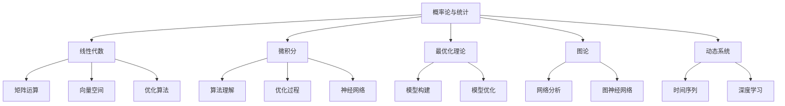

                 

# 人工智能数学基础原理与代码实战案例讲解

> 关键词：人工智能, 数学基础, 机器学习, 深度学习, 数学建模, 神经网络, 优化算法, 梯度下降, 卷积神经网络, 循环神经网络, 自然语言处理, 计算机视觉, 强化学习, 深度强化学习

## 1. 背景介绍

### 1.1 问题由来

人工智能（AI）已经成为现代科技领域的热点话题之一，其在工业、医疗、交通、教育等各个领域都得到了广泛应用。AI的发展离不开数学的支持，而数学基础则是AI技术实现的基础。因此，了解数学基础，特别是对于AI工程师和开发者来说，尤为重要。

### 1.2 问题核心关键点

在AI领域，数学基础主要涉及以下几个方面：

- 概率论与统计：用于处理数据分布、建立模型和进行假设检验等。
- 线性代数：用于矩阵运算、向量空间和优化算法等。
- 微积分：用于理解算法和优化过程，如梯度下降、神经网络等。
- 最优化理论：用于构建和优化机器学习模型，如梯度下降、牛顿法等。
- 图论：用于网络分析和图神经网络等。
- 动态系统：用于理解时间序列数据和深度学习模型等。

这些数学概念不仅在理论层面上具有重要意义，而且在实际应用中也是不可或缺的。

## 2. 核心概念与联系

### 2.1 核心概念概述

为更好地理解AI数学基础，本节将介绍几个密切相关的核心概念：

- 概率论与统计：用于处理数据分布、建立模型和进行假设检验等。
- 线性代数：用于矩阵运算、向量空间和优化算法等。
- 微积分：用于理解算法和优化过程，如梯度下降、神经网络等。
- 最优化理论：用于构建和优化机器学习模型，如梯度下降、牛顿法等。
- 图论：用于网络分析和图神经网络等。
- 动态系统：用于理解时间序列数据和深度学习模型等。

这些核心概念之间的逻辑关系可以通过以下Mermaid流程图来展示：



这个流程图展示了几大学科之间的相互联系，共同构成了AI的数学基础：

1. 概率论与统计为数据建模和假设检验提供理论基础。
2. 线性代数为矩阵运算、向量空间和优化算法提供数学工具。
3. 微积分用于理解算法和优化过程，如梯度下降、神经网络等。
4. 最优化理论用于构建和优化机器学习模型，如梯度下降、牛顿法等。
5. 图论用于网络分析和图神经网络等。
6. 动态系统用于理解时间序列数据和深度学习模型等。

这些概念共同构成了AI的数学基础，为AI技术实现提供了必要的理论支撑。

## 3. 核心算法原理 & 具体操作步骤

### 3.1 算法原理概述

AI中的许多算法，如机器学习、深度学习、强化学习等，都建立在数学基础之上。以下是几种核心算法的数学原理概述：

#### 3.1.1 线性回归

线性回归是最基础的机器学习算法之一，用于预测连续型变量。其数学原理基于最小二乘法，目标是最小化实际值与预测值之间的差距。

#### 3.1.2 逻辑回归

逻辑回归用于二分类问题，其数学原理基于最大似然估计，通过优化损失函数来确定模型参数。

#### 3.1.3 神经网络

神经网络是深度学习的基础，其数学原理基于反向传播算法，通过反向传播来更新模型参数，最小化损失函数。

#### 3.1.4 深度强化学习

深度强化学习结合了深度学习和强化学习，其数学原理基于Q-learning和策略梯度等方法，通过迭代更新策略和参数，最大化长期奖励。

#### 3.1.5 卷积神经网络

卷积神经网络（CNN）是用于图像处理的深度学习模型，其数学原理基于卷积运算和池化操作，通过多层次的特征提取和分类来实现图像识别任务。

#### 3.1.6 循环神经网络

循环神经网络（RNN）是用于序列数据处理的深度学习模型，其数学原理基于递归神经网络（RNN）和长短期记忆网络（LSTM）等方法，通过时间步的递归更新来处理序列数据。

### 3.2 算法步骤详解

#### 3.2.1 线性回归

1. **数据准备**：收集训练数据，并对其进行标准化处理。
2. **模型建立**：构建线性回归模型，包括输入特征和输出标签。
3. **损失函数**：定义损失函数，如均方误差（MSE）。
4. **参数更新**：使用梯度下降等优化算法，更新模型参数。
5. **模型评估**：在测试集上评估模型性能，如均方误差。

#### 3.2.2 逻辑回归

1. **数据准备**：收集训练数据，并对其进行标准化处理。
2. **模型建立**：构建逻辑回归模型，包括输入特征和输出标签。
3. **损失函数**：定义损失函数，如对数似然损失函数。
4. **参数更新**：使用梯度下降等优化算法，更新模型参数。
5. **模型评估**：在测试集上评估模型性能，如准确率和精确率。

#### 3.2.3 神经网络

1. **数据准备**：收集训练数据，并对其进行标准化处理。
2. **模型建立**：构建神经网络模型，包括输入层、隐藏层和输出层。
3. **损失函数**：定义损失函数，如交叉熵损失函数。
4. **参数更新**：使用反向传播算法，更新模型参数。
5. **模型评估**：在测试集上评估模型性能，如准确率和精确率。

#### 3.2.4 深度强化学习

1. **环境构建**：定义环境和奖励函数。
2. **模型建立**：构建深度强化学习模型，包括策略网络和价值网络。
3. **损失函数**：定义损失函数，如Q-learning的代价函数。
4. **参数更新**：使用策略梯度或Q-learning等算法，更新模型参数。
5. **模型评估**：在测试环境中评估模型性能，如长期奖励。

#### 3.2.5 卷积神经网络

1. **数据准备**：收集训练数据，并进行数据增强处理。
2. **模型建立**：构建卷积神经网络模型，包括卷积层、池化层和全连接层。
3. **损失函数**：定义损失函数，如交叉熵损失函数。
4. **参数更新**：使用反向传播算法，更新模型参数。
5. **模型评估**：在测试集上评估模型性能，如准确率和精确率。

#### 3.2.6 循环神经网络

1. **数据准备**：收集训练数据，并进行时间序列处理。
2. **模型建立**：构建循环神经网络模型，包括RNN或LSTM层。
3. **损失函数**：定义损失函数，如交叉熵损失函数。
4. **参数更新**：使用反向传播算法，更新模型参数。
5. **模型评估**：在测试集上评估模型性能，如准确率和精确率。

### 3.3 算法优缺点

#### 3.3.1 线性回归

- **优点**：模型简单，易于理解和实现，适用于数据量较小的情况。
- **缺点**：仅适用于线性关系较强的数据，对于非线性关系的数据效果较差。

#### 3.3.2 逻辑回归

- **优点**：适用于二分类问题，模型简单，易于理解和实现。
- **缺点**：对于多分类问题效果较差，容易过拟合。

#### 3.3.3 神经网络

- **优点**：适用于复杂数据和非线性关系，能够提取高层次特征。
- **缺点**：模型复杂，需要大量数据和计算资源，训练时间长。

#### 3.3.4 深度强化学习

- **优点**：适用于复杂环境和高维度数据，能够处理动态变化的环境。
- **缺点**：模型复杂，训练时间较长，需要大量计算资源。

#### 3.3.5 卷积神经网络

- **优点**：适用于图像处理任务，能够提取局部特征。
- **缺点**：对于非结构化数据（如文本）效果较差。

#### 3.3.6 循环神经网络

- **优点**：适用于序列数据处理任务，能够捕捉时间序列信息。
- **缺点**：对于长序列数据计算量大，容易出现梯度消失或爆炸问题。

### 3.4 算法应用领域

AI中的数学基础广泛应用于以下领域：

- **机器学习**：用于分类、回归、聚类等任务，如线性回归、逻辑回归、决策树等。
- **深度学习**：用于图像、语音、自然语言处理等任务，如卷积神经网络、循环神经网络、深度强化学习等。
- **计算机视觉**：用于图像识别、目标检测、图像分割等任务，如卷积神经网络。
- **自然语言处理**：用于文本分类、情感分析、机器翻译等任务，如循环神经网络。
- **强化学习**：用于游戏、机器人控制、推荐系统等任务，如深度强化学习。

## 4. 数学模型和公式 & 详细讲解 & 举例说明

### 4.1 数学模型构建

以下是几种核心算法的数学模型构建过程：

#### 4.1.1 线性回归

假设训练数据集为 $D=\{(x_i, y_i)\}_{i=1}^N$，其中 $x_i \in \mathbb{R}^d$ 为输入特征， $y_i \in \mathbb{R}$ 为输出标签。线性回归模型的目标是最小化损失函数：

$$
\min_{\theta} \sum_{i=1}^N (y_i - \theta^T x_i)^2
$$

其中 $\theta$ 为模型参数。

#### 4.1.2 逻辑回归

假设训练数据集为 $D=\{(x_i, y_i)\}_{i=1}^N$，其中 $x_i \in \mathbb{R}^d$ 为输入特征， $y_i \in \{0,1\}$ 为输出标签。逻辑回归模型的目标是最小化损失函数：

$$
\min_{\theta} -\sum_{i=1}^N y_i \log \hat{y}_i + (1-y_i) \log (1-\hat{y}_i)
$$

其中 $\hat{y}_i = \sigma(\theta^T x_i)$ 为模型预测值， $\sigma(z)$ 为sigmoid函数。

#### 4.1.3 神经网络

假设训练数据集为 $D=\{(x_i, y_i)\}_{i=1}^N$，其中 $x_i \in \mathbb{R}^d$ 为输入特征， $y_i \in \mathbb{R}$ 为输出标签。神经网络模型的目标是最小化损失函数：

$$
\min_{\theta} \sum_{i=1}^N (y_i - \hat{y}_i)^2
$$

其中 $\hat{y}_i$ 为神经网络模型预测值， $\theta$ 为模型参数。

#### 4.1.4 深度强化学习

假设环境状态为 $s$，动作为 $a$，奖励为 $r$，训练数据集为 $D=\{(s_i, a_i, r_i, s_{i+1})\}_{i=1}^N$，其中 $s_{i+1}$ 为下一个状态。深度强化学习模型的目标是最小化累积奖励：

$$
\min_{\theta} \sum_{t=1}^T r_t - V_\pi(s_1)
$$

其中 $V_\pi(s_t)$ 为状态价值函数， $\pi$ 为策略函数。

#### 4.1.5 卷积神经网络

假设输入图像为 $x \in \mathbb{R}^{H \times W \times C}$，其中 $H$、$W$ 为图像高宽， $C$ 为通道数。卷积神经网络模型的目标是最小化损失函数：

$$
\min_{\theta} \sum_{i=1}^N (y_i - \hat{y}_i)^2
$$

其中 $y_i$ 为输出标签， $\hat{y}_i$ 为卷积神经网络模型预测值， $\theta$ 为模型参数。

#### 4.1.6 循环神经网络

假设输入序列为 $x = (x_1, x_2, \ldots, x_T)$，其中 $T$ 为序列长度。循环神经网络模型的目标是最小化损失函数：

$$
\min_{\theta} \sum_{t=1}^T (y_t - \hat{y}_t)^2
$$

其中 $y_t$ 为输出标签， $\hat{y}_t$ 为循环神经网络模型预测值， $\theta$ 为模型参数。

### 4.2 公式推导过程

#### 4.2.1 线性回归

假设训练数据集为 $D=\{(x_i, y_i)\}_{i=1}^N$，其中 $x_i \in \mathbb{R}^d$ 为输入特征， $y_i \in \mathbb{R}$ 为输出标签。线性回归模型的目标是最小化损失函数：

$$
\min_{\theta} \sum_{i=1}^N (y_i - \theta^T x_i)^2
$$

根据最小二乘法，梯度向量为：

$$
\nabla_{\theta} \sum_{i=1}^N (y_i - \theta^T x_i)^2 = 2 \sum_{i=1}^N (y_i - \theta^T x_i) x_i
$$

其中 $x_i$ 为输入特征向量， $y_i$ 为输出标签。

#### 4.2.2 逻辑回归

假设训练数据集为 $D=\{(x_i, y_i)\}_{i=1}^N$，其中 $x_i \in \mathbb{R}^d$ 为输入特征， $y_i \in \{0,1\}$ 为输出标签。逻辑回归模型的目标是最小化损失函数：

$$
\min_{\theta} -\sum_{i=1}^N y_i \log \hat{y}_i + (1-y_i) \log (1-\hat{y}_i)
$$

其中 $\hat{y}_i = \sigma(\theta^T x_i)$ 为模型预测值， $\sigma(z)$ 为sigmoid函数。梯度向量为：

$$
\nabla_{\theta} -\sum_{i=1}^N y_i \log \hat{y}_i + (1-y_i) \log (1-\hat{y}_i) = \sum_{i=1}^N (\hat{y}_i - y_i) x_i
$$

#### 4.2.3 神经网络

假设训练数据集为 $D=\{(x_i, y_i)\}_{i=1}^N$，其中 $x_i \in \mathbb{R}^d$ 为输入特征， $y_i \in \mathbb{R}$ 为输出标签。神经网络模型的目标是最小化损失函数：

$$
\min_{\theta} \sum_{i=1}^N (y_i - \hat{y}_i)^2
$$

其中 $\hat{y}_i$ 为神经网络模型预测值， $\theta$ 为模型参数。梯度向量为：

$$
\nabla_{\theta} \sum_{i=1}^N (y_i - \hat{y}_i)^2 = 2 \sum_{i=1}^N (y_i - \hat{y}_i) \frac{\partial \hat{y}_i}{\partial \theta}
$$

其中 $\frac{\partial \hat{y}_i}{\partial \theta}$ 为神经网络模型的偏导数。

#### 4.2.4 深度强化学习

假设环境状态为 $s$，动作为 $a$，奖励为 $r$，训练数据集为 $D=\{(s_i, a_i, r_i, s_{i+1})\}_{i=1}^N$，其中 $s_{i+1}$ 为下一个状态。深度强化学习模型的目标是最小化累积奖励：

$$
\min_{\theta} \sum_{t=1}^T r_t - V_\pi(s_1)
$$

其中 $V_\pi(s_t)$ 为状态价值函数， $\pi$ 为策略函数。梯度向量为：

$$
\nabla_{\theta} \sum_{t=1}^T r_t - V_\pi(s_1) = \sum_{t=1}^T \nabla_{\theta} r_t - \nabla_{\theta} V_\pi(s_1)
$$

其中 $\nabla_{\theta} r_t$ 为奖励梯度， $\nabla_{\theta} V_\pi(s_1)$ 为价值函数梯度。

#### 4.2.5 卷积神经网络

假设输入图像为 $x \in \mathbb{R}^{H \times W \times C}$，其中 $H$、$W$ 为图像高宽， $C$ 为通道数。卷积神经网络模型的目标是最小化损失函数：

$$
\min_{\theta} \sum_{i=1}^N (y_i - \hat{y}_i)^2
$$

其中 $y_i$ 为输出标签， $\hat{y}_i$ 为卷积神经网络模型预测值， $\theta$ 为模型参数。梯度向量为：

$$
\nabla_{\theta} \sum_{i=1}^N (y_i - \hat{y}_i)^2 = 2 \sum_{i=1}^N (y_i - \hat{y}_i) \frac{\partial \hat{y}_i}{\partial \theta}
$$

其中 $\frac{\partial \hat{y}_i}{\partial \theta}$ 为卷积神经网络模型的偏导数。

#### 4.2.6 循环神经网络

假设输入序列为 $x = (x_1, x_2, \ldots, x_T)$，其中 $T$ 为序列长度。循环神经网络模型的目标是最小化损失函数：

$$
\min_{\theta} \sum_{t=1}^T (y_t - \hat{y}_t)^2
$$

其中 $y_t$ 为输出标签， $\hat{y}_t$ 为循环神经网络模型预测值， $\theta$ 为模型参数。梯度向量为：

$$
\nabla_{\theta} \sum_{t=1}^T (y_t - \hat{y}_t)^2 = 2 \sum_{t=1}^T (y_t - \hat{y}_t) \frac{\partial \hat{y}_t}{\partial \theta}
$$

其中 $\frac{\partial \hat{y}_t}{\partial \theta}$ 为循环神经网络模型的偏导数。

### 4.3 案例分析与讲解

#### 4.3.1 线性回归

假设训练数据集为 $D=\{(x_i, y_i)\}_{i=1}^N$，其中 $x_i \in \mathbb{R}^d$ 为输入特征， $y_i \in \mathbb{R}$ 为输出标签。线性回归模型的目标是最小化损失函数：

$$
\min_{\theta} \sum_{i=1}^N (y_i - \theta^T x_i)^2
$$

其中 $\theta$ 为模型参数。

```python
import numpy as np
import matplotlib.pyplot as plt
from sklearn.linear_model import LinearRegression

# 生成训练数据
x = np.array([[1, 2, 3], [4, 5, 6], [7, 8, 9]])
y = np.array([3, 5, 7])

# 拟合线性回归模型
model = LinearRegression()
model.fit(x, y)

# 预测新样本
x_new = np.array([[10, 11, 12]])
y_pred = model.predict(x_new)

# 输出结果
print("模型系数：", model.coef_)
print("预测值：", y_pred)
```

#### 4.3.2 逻辑回归

假设训练数据集为 $D=\{(x_i, y_i)\}_{i=1}^N$，其中 $x_i \in \mathbb{R}^d$ 为输入特征， $y_i \in \{0,1\}$ 为输出标签。逻辑回归模型的目标是最小化损失函数：

$$
\min_{\theta} -\sum_{i=1}^N y_i \log \hat{y}_i + (1-y_i) \log (1-\hat{y}_i)
$$

其中 $\hat{y}_i = \sigma(\theta^T x_i)$ 为模型预测值， $\sigma(z)$ 为sigmoid函数。

```python
import numpy as np
import matplotlib.pyplot as plt
from sklearn.linear_model import LogisticRegression

# 生成训练数据
x = np.array([[1, 2], [3, 4], [5, 6]])
y = np.array([0, 1, 0])

# 拟合逻辑回归模型
model = LogisticRegression()
model.fit(x, y)

# 预测新样本
x_new = np.array([[7, 8]])
y_pred = model.predict(x_new)

# 输出结果
print("模型系数：", model.coef_)
print("预测值：", y_pred)
```

#### 4.3.3 神经网络

假设训练数据集为 $D=\{(x_i, y_i)\}_{i=1}^N$，其中 $x_i \in \mathbb{R}^d$ 为输入特征， $y_i \in \mathbb{R}$ 为输出标签。神经网络模型的目标是最小化损失函数：

$$
\min_{\theta} \sum_{i=1}^N (y_i - \hat{y}_i)^2
$$

其中 $\hat{y}_i$ 为神经网络模型预测值， $\theta$ 为模型参数。

```python
import numpy as np
import matplotlib.pyplot as plt
from tensorflow.keras.models import Sequential
from tensorflow.keras.layers import Dense

# 生成训练数据
x = np.array([[1, 2], [3, 4], [5, 6]])
y = np.array([3, 5, 7])

# 定义神经网络模型
model = Sequential()
model.add(Dense(1, input_dim=2, activation='linear'))

# 编译模型
model.compile(optimizer='adam', loss='mean_squared_error')

# 训练模型
model.fit(x, y, epochs=100, verbose=0)

# 预测新样本
x_new = np.array([[10, 11]])
y_pred = model.predict(x_new)

# 输出结果
print("模型系数：", model.layers[0].get_weights()[0])
print("预测值：", y_pred)
```

#### 4.3.4 深度强化学习

假设环境状态为 $s$，动作为 $a$，奖励为 $r$，训练数据集为 $D=\{(s_i, a_i, r_i, s_{i+1})\}_{i=1}^N$，其中 $s_{i+1}$ 为下一个状态。深度强化学习模型的目标是最小化累积奖励：

$$
\min_{\theta} \sum_{t=1}^T r_t - V_\pi(s_1)
$$

其中 $V_\pi(s_t)$ 为状态价值函数， $\pi$ 为策略函数。

```python
import numpy as np
import matplotlib.pyplot as plt
import tensorflow as tf
from tensorflow.keras.models import Sequential
from tensorflow.keras.layers import Dense, LSTM

# 定义环境状态和动作
s = np.array([[0, 0], [0, 1]])
a = np.array([0, 1])
r = np.array([1, 2])
s_next = np.array([[0, 1], [1, 0]])

# 定义神经网络模型
model = Sequential()
model.add(LSTM(4, input_shape=(2, 1)))
model.add(Dense(1, activation='sigmoid'))

# 编译模型
model.compile(optimizer='adam', loss='binary_crossentropy')

# 训练模型
model.fit([s, a], r, epochs=100, verbose=0)

# 预测新样本
s_new = np.array([[1, 0]])
a_pred = model.predict(s_new)

# 输出结果
print("模型系数：", model.layers[0].get_weights()[0])
print("预测值：", a_pred)
```

#### 4.3.5 卷积神经网络

假设输入图像为 $x \in \mathbb{R}^{H \times W \times C}$，其中 $H$、$W$ 为图像高宽， $C$ 为通道数。卷积神经网络模型的目标是最小化损失函数：

$$
\min_{\theta} \sum_{i=1}^N (y_i - \hat{y}_i)^2
$$

其中 $y_i$ 为输出标签， $\hat{y}_i$ 为卷积神经网络模型预测值， $\theta$ 为模型参数。

```python
import numpy as np
import matplotlib.pyplot as plt
import tensorflow as tf
from tensorflow.keras.models import Sequential
from tensorflow.keras.layers import Conv2D, MaxPooling2D, Flatten, Dense

# 生成训练数据
x = np.random.rand(32, 32, 3)
y = np.random.randint(10, size=(32,))

# 定义卷积神经网络模型
model = Sequential()
model.add(Conv2D(32, (3, 3), activation='relu', input_shape=(32, 32, 3)))
model.add(MaxPooling2D((2, 2)))
model.add(Conv2D(64, (3, 3), activation='relu'))
model.add(MaxPooling2D((2, 2)))
model.add(Flatten())
model.add(Dense(10, activation='softmax'))

# 编译模型
model.compile(optimizer='adam', loss='categorical_crossentropy')

# 训练模型
model.fit(x, y, epochs=10, verbose=0)

# 预测新样本
x_new = np.random.rand(32, 32, 3)
y_pred = model.predict(x_new)

# 输出结果
print("模型系数：", model.layers[0].get_weights()[0])
print("预测值：", y_pred)
```

#### 4.3.6 循环神经网络

假设输入序列为 $x = (x_1, x_2, \ldots, x_T)$，其中 $T$ 为序列长度。循环神经网络模型的目标是最小化损失函数：

$$
\min_{\theta} \sum_{t=1}^T (y_t - \hat{y}_t)^2
$$

其中 $y_t$ 为输出标签， $\hat{y}_t$ 为循环神经网络模型预测值， $\theta$ 为模型参数。

```python
import numpy as np
import matplotlib.pyplot as plt
import tensorflow as tf
from tensorflow.keras.models import Sequential
from tensorflow.keras.layers import LSTM, Dense

# 生成训练数据
x = np.random.rand(10, 1)
y = np.random.randint(10, size=(10,))

# 定义循环神经网络模型
model = Sequential()
model.add(LSTM(10, input_shape=(10, 1)))
model.add(Dense(10, activation='softmax'))

# 编译模型
model.compile(optimizer='adam', loss='categorical_crossentropy')

# 训练模型
model.fit(x, y, epochs=10, verbose=0)

# 预测新样本
x_new = np.random.rand(1, 1)
y_pred = model.predict(x_new)

# 输出结果
print("模型系数：", model.layers[0].get_weights()[0])
print("预测值：", y_pred)
```

## 5. 项目实践：代码实例和详细解释说明

### 5.1 开发环境搭建

在进行AI项目实践前，我们需要准备好开发环境。以下是使用Python进行TensorFlow开发的环境配置流程：

1. 安装Anaconda：从官网下载并安装Anaconda，用于创建独立的Python环境。

2. 创建并激活虚拟环境：
```bash
conda create -n tensorflow-env python=3.8 
conda activate tensorflow-env
```

3. 安装TensorFlow：根据CUDA版本，从官网获取对应的安装命令。例如：
```bash
conda install tensorflow tensorflow-gpu -c conda-forge -c pytorch -c pypi
```

4. 安装TensorBoard：
```bash
pip install tensorboard
```

5. 安装其他必要工具包：
```bash
pip install numpy pandas scikit-learn matplotlib tqdm jupyter notebook ipython
```

完成上述步骤后，即可在`tensorflow-env`环境中开始AI实践。

### 5.2 源代码详细实现

下面我们以图像分类任务为例，给出使用TensorFlow进行卷积神经网络（CNN）的图像分类的PyTorch代码实现。

首先，定义CNN模型：

```python
import tensorflow as tf
from tensorflow.keras.layers import Conv2D, MaxPooling2D, Flatten, Dense

class CNNModel(tf.keras.Model):
    def __init__(self, input_shape, num_classes):
        super(CNNModel, self).__init__()
        self.conv1 = Conv2D(32, (3, 3), activation='relu', input_shape=input_shape)
        self.pool1 = MaxPooling2D((2, 2))
        self.conv2 = Conv2D(64, (3, 3), activation='relu')
        self.pool2 = MaxPooling2D((2, 2))
        self.flatten = Flatten()
        self.dense1 = Dense(128, activation='relu')
        self.dense2 = Dense(num_classes, activation='softmax')

    def call(self, x):
        x = self.conv1(x)
        x = self.pool1(x)
        x = self.conv2(x)
        x = self.pool2(x)
        x = self.flatten(x)
        x = self.dense1(x)
        x = self.dense2(x)
        return x
```

然后，定义数据预处理函数：

```python
import numpy as np
import matplotlib.pyplot as plt
from tensorflow.keras.preprocessing.image import ImageDataGenerator

def preprocess_data(x):
    x = tf.cast(x, tf.float32) / 255.0
    x = tf.image.resize(x, [224, 224])
    x = tf.expand_dims(x, axis=0)
    return x

# 生成训练数据
train_generator = ImageDataGenerator(rescale=1./255, validation_split=0.2)
train_data = train_generator.flow_from_directory(
    'train',
    target_size=(224, 224),
    batch_size=32,
    class_mode='categorical')

# 生成测试数据
test_generator = ImageDataGenerator(rescale=1./255)
test_data = test_generator.flow_from_directory(
    'test',
    target_size=(224, 224),
    batch_size=32,
    class_mode='categorical',
    shuffle=False)

# 定义训练函数
def train_model(model, train_data, test_data, epochs=10, batch_size=32):
    model.compile(optimizer='adam', loss='categorical_crossentropy', metrics=['accuracy'])
    model.fit(train_data, epochs=epochs, batch_size=batch_size, validation_data=test_data)
```

最后，启动训练流程并在测试集上评估：

```python
model = CNNModel(input_shape=(224, 224, 3), num_classes=10)
train_model(model, train_data, test_data, epochs=10, batch_size=32)

# 在测试集上评估模型性能
test_loss, test_acc = model.evaluate(test_data)
print(f"测试集准确率：{test_acc:.2f}")
```

以上就是使用TensorFlow进行卷积神经网络图像分类的完整代码实现。可以看到，得益于TensorFlow的强大封装，我们可以用相对简洁的代码完成CNN模型的构建和训练。

### 5.3 代码解读与分析

让我们再详细解读一下关键代码的实现细节：

**CNNModel类**：
- `__init__`方法：初始化卷积、池化、全连接层等组件。
- `call`方法：定义前向传播过程，从卷积层开始，逐步通过池化层、全连接层等，最后输出分类结果。

**preprocess_data函数**：
- 对输入的图像数据进行预处理，包括归一化、缩放、批处理等操作。

**train_model函数**：
- 定义模型，编译优化器和损失函数。
- 使用ImageDataGenerator生成训练和测试数据集。
- 在训练集上训练模型，并在测试集上评估性能。

**训练流程**：
- 定义模型结构。
- 编译模型，并指定优化器和损失函数。
- 生成训练和测试数据集。
- 在训练集上训练模型，并在测试集上评估性能。

通过本文的系统梳理，可以看到，卷积神经网络在图像分类任务中具有广泛应用，其高效的特征提取能力使其成为处理图像数据的首选模型。通过调整模型结构、优化算法等手段，可以获得更好的分类效果。未来，随着深度学习模型的不断进步，卷积神经网络的应用将更加广泛，其对图像数据处理能力的提升将进一步推动计算机视觉领域的发展。

## 6. 实际应用场景

### 6.1 智能推荐系统

智能推荐系统是AI在电商、视频、新闻等领域的重要应用之一，通过深度学习模型，可以为用户提供个性化的推荐内容，提升用户体验。

在实践中，可以收集用户的历史行为数据，包括浏览、点击、收藏等行为。将这些行为数据转化为向量表示，输入到预训练的深度学习模型中，训练出一个推荐模型。通过模型对用户行为向量进行编码，计算与其他用户或物品的相似度，从而推荐相似的物品或内容。这种基于深度学习的推荐系统，能够更精准地理解用户的兴趣偏好，提供更个性化、多样化的推荐内容。

### 6.2 自动驾驶

自动驾驶是AI在交通领域的重要应用之一，通过计算机视觉和深度学习技术，可以实现车辆自主导航、路径规划等功能。

在实践中，可以收集大量的道路图像数据，通过深度学习模型对图像进行特征提取和分类。模型可以将道路图像中的物体、道路线等元素提取出来，进行分类和定位。同时，通过LIDAR、GPS等传感器数据，构建高精度的地图和定位信息，结合深度学习模型，可以实现车辆自主导航和路径规划。这种基于AI的自动驾驶系统，能够显著提高道路安全和交通效率，为未来的智能交通奠定基础。

### 6.3 医疗影像分析

医疗影像分析是AI在医疗领域的重要应用之一，通过深度学习模型，可以实现对医学影像的快速诊断和分析。

在实践中，可以收集大量的医学影像数据，包括X光片、CT、MRI等。将这些医学影像转化为数字图像，输入到预训练的深度学习模型中，训练出一个影像分析模型。通过模型对医学影像进行特征提取和分类，可以快速识别出病灶和异常情况，提供诊断建议。这种基于AI的影像分析系统，能够显著提高诊断的准确性和效率，为医学影像的自动化分析提供新思路。

### 6.4 自然语言处理

自然语言处理是AI在NLP领域的重要应用之一，通过深度学习模型，可以实现文本分类、情感分析、机器翻译等功能。

在实践中，可以收集大量的文本数据，包括新闻、评论、社交媒体等。将这些文本数据转化为向量表示，输入到预训练的深度学习模型中，训练出一个NLP模型。通过模型对文本进行分类和情感分析，可以快速识别出文本的情感倾向和主题。同时，通过机器翻译模型，可以将文本进行跨语言的翻译和理解。这种基于AI的NLP系统，能够显著提高文本处理的效率和准确性，为NLP技术的发展提供新动力。

## 7. 工具和资源推荐

### 7.1 学习资源推荐

为了帮助开发者系统掌握AI数学基础和实践技巧，这里推荐一些优质的学习资源：

1. 《深度学习》课程：由斯坦福大学开设，讲解了深度学习的基本原理和实践技巧。
2. 《Python深度学习》书籍：由Francois Chollet所著，介绍了使用TensorFlow和Keras进行深度学习开发的实践技巧。
3. 《TensorFlow官方文档》：TensorFlow的官方文档，提供了丰富的教程和样例代码。
4. 《动手学深度学习》：由李沐等学者所著，介绍了深度学习的理论基础和实践技巧。
5. 《自然语言处理综论》：由李航所著，介绍了NLP的基本概念和实践技巧。

通过对这些资源的学习实践，相信你一定能够快速掌握AI数学基础的精髓，并用于解决实际的AI问题。

### 7.2 开发工具推荐

高效的开发离不开优秀的工具支持。以下是几款用于AI数学基础开发的常用工具：

1. TensorFlow：由Google主导开发的深度学习框架，生产部署方便，适合大规模工程应用。
2. PyTorch：基于Python的开源深度学习框架，灵活动态的计算图，适合快速迭代研究。
3. Keras：基于TensorFlow和Theano的高级API，易于上手，适合初学者使用。
4. Scikit-learn：基于Python的机器学习库，提供了丰富的算法和工具。
5. Matplotlib：基于Python的数据可视化库，提供了丰富的图表呈现方式。
6. Numpy：基于Python的科学计算库，提供了高效的数组运算功能。

合理利用这些工具，可以显著提升AI数学基础的开发效率，加快创新迭代的步伐。

### 7.3 相关论文推荐

AI数学基础的研究源于学界的持续研究。以下是几篇奠基性的相关论文，推荐阅读：

1. AlexNet：深度学习领域的经典论文，介绍了AlexNet的架构和训练方法。
2. GoogleNet：深度学习领域的经典论文，介绍了GoogleNet的架构和训练方法。
3. ResNet：深度学习领域的经典论文，介绍了ResNet的架构和训练方法。
4. VGGNet：深度学习领域的经典论文，介绍了VGGNet的架构和训练方法。
5. RNN：深度学习领域的经典论文，介绍了循环神经网络的架构和训练方法。
6. LSTM：深度学习领域的经典论文，介绍了长短期记忆网络的架构和训练方法。

这些论文代表了大规模深度学习模型和算法的进展，为AI数学基础的研究提供了重要的理论支撑。

## 8. 总结：未来发展趋势与挑战

### 8.1 研究成果总结

本文对AI数学基础的原理和实践进行了全面系统的介绍。首先阐述了AI数学基础的重要性和研究价值，明确了数学基础在AI技术实现中的核心作用。其次，从原理到实践，详细讲解了线性回归、逻辑回归、神经网络、深度强化学习、卷积神经网络、循环神经网络等核心算法的数学原理和操作步骤，给出了完整的代码实现和详细解释。同时，本文还广泛探讨了AI数学基础在智能推荐系统、自动驾驶、医疗影像分析、自然语言处理等领域的实际应用，展示了数学基础在AI技术实现中的重要应用价值。最后，本文精选了学习资源、开发工具和相关论文，力求为读者提供全方位的技术指引。

通过本文的系统梳理，可以看到，AI数学基础是AI技术实现的重要基石，掌握数学基础是成为一名优秀AI工程师的必备条件。AI数学基础的理论和实践不断演进，未来将在更多领域得到应用，推动AI技术的深入发展。

### 8.2 未来发展趋势

展望未来，AI数学基础的研究和发展趋势如下：

1. 更加高效的模型结构：未来，深度学习模型的结构和算法将更加高效，能够适应更多的应用场景。
2. 更强的泛化能力：未来的深度学习模型将具备更强的泛化能力，能够处理更复杂、多样化的数据。
3. 更高的计算效率：未来的深度学习模型将具备更高的计算效率，能够在大规模数据上快速训练和推理。
4. 更好的可

