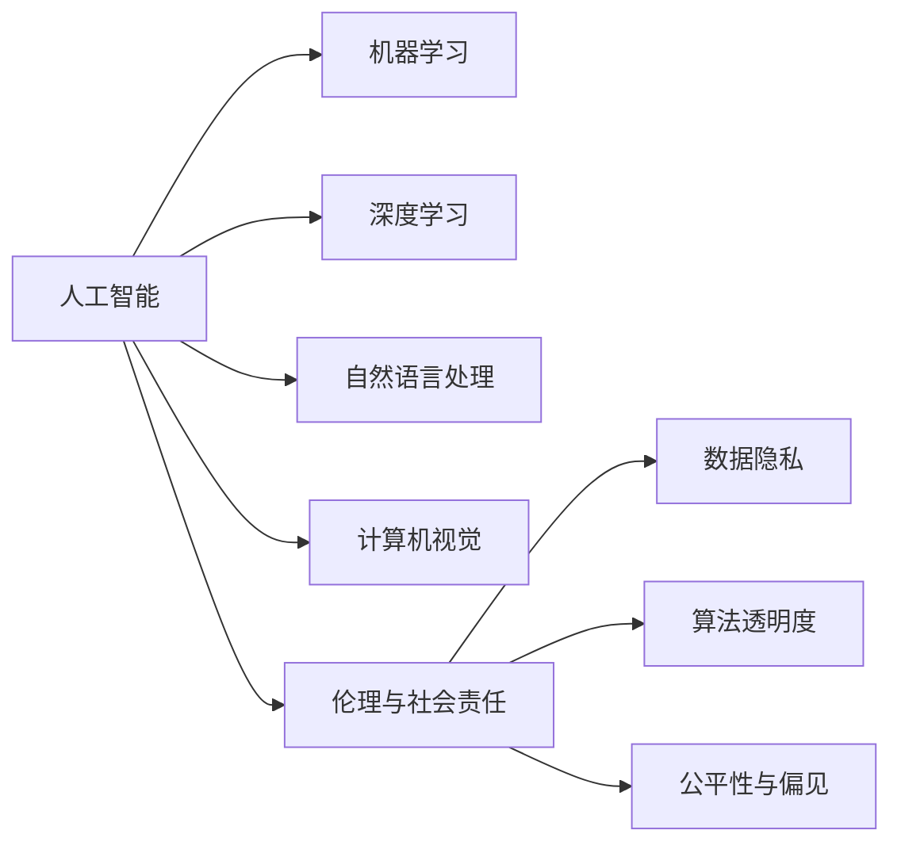

                 

# 人工智能：社会影响与思考

## 1. 背景介绍

人工智能(Artificial Intelligence, AI)技术的迅猛发展，正深刻地改变着人类社会的各个方面。从智能客服到自动驾驶，从医疗诊断到金融预测，AI技术渗透到了生活的方方面面。然而，AI的广泛应用也带来了诸多挑战和伦理问题。本文旨在探讨AI对社会的影响，并提出相应的思考与对策，以期推动AI技术向更加健康、普惠的方向发展。

## 2. 核心概念与联系

### 2.1 核心概念概述

为了更深入地理解AI的社会影响，本节将介绍几个关键概念：

- **人工智能(AI)**：指利用计算机模拟人类智能，进行感知、学习、推理、决策等智能行为的技术。AI技术包括机器学习、深度学习、自然语言处理、计算机视觉等多个分支。

- **机器学习(ML)**：指通过数据驱动的算法，使计算机具备学习能力，能够从数据中提取模式，实现预测、分类、聚类等任务。机器学习是AI的核心技术之一。

- **深度学习(Deep Learning, DL)**：一种特殊的机器学习范式，通过多层神经网络结构，实现对数据特征的自动学习和抽象表示。深度学习在图像识别、语音识别等领域取得了突破性进展。

- **自然语言处理(Natural Language Processing, NLP)**：指利用计算机处理和理解人类语言的技术，包括文本分类、情感分析、机器翻译等任务。NLP是AI的重要分支，为AI与人交互提供了基础。

- **计算机视觉(Computer Vision, CV)**：指让计算机具备“看”的能力，能够通过图像或视频数据进行目标检测、图像分割、物体识别等任务。计算机视觉在自动驾驶、安防监控等领域有广泛应用。

- **伦理与社会责任**：指在AI技术应用中，如何平衡技术发展与人类伦理道德，确保AI技术造福全人类，避免技术滥用带来的负面影响。

这些概念之间的关系可以通过以下Mermaid流程图来展示：



这个流程图展示了人工智能的多个分支技术及其与社会伦理的联系：

1. 机器学习、深度学习、自然语言处理、计算机视觉等技术构成了人工智能的核心。
2. 伦理与社会责任是贯穿AI应用始终的重要考量。
3. 数据隐私、算法透明度、公平性与偏见等问题，均需要在AI技术应用中加以解决和防范。

## 3. 核心算法原理 & 具体操作步骤

### 3.1 算法原理概述

AI技术的基本原理可以概括为数据驱动的模型学习与优化。AI模型通过大量标注数据进行训练，学习输入与输出之间的映射关系。训练过程中，模型通过前向传播计算预测结果，通过损失函数评估预测误差，再通过反向传播更新模型参数，不断优化预测准确率。这一过程可以总结为以下三个核心步骤：

1. **数据准备**：收集、清洗、标注数据，构建训练集、验证集、测试集。
2. **模型训练**：选择合适的网络结构，设计合适的损失函数，使用优化算法如梯度下降进行模型训练。
3. **模型评估与优化**：在验证集上评估模型性能，根据评估结果进行参数调整，防止过拟合。

### 3.2 算法步骤详解

以下是AI技术在实际应用中的具体操作步骤：

1. **数据准备**：
    - **数据收集**：从公开数据集、第三方API、传感器等多种渠道收集数据。
    - **数据清洗**：去除噪声、缺失值，处理异常值。
    - **数据标注**：对数据进行标注，如分类、标注、实体识别等。

2. **模型训练**：
    - **网络设计**：选择合适的神经网络结构，如卷积神经网络(CNN)、循环神经网络(RNN)、Transformer等。
    - **损失函数设计**：根据任务类型选择合适的损失函数，如交叉熵、均方误差等。
    - **优化算法选择**：常用的优化算法包括梯度下降、Adam、Adagrad等，选择合适的方法进行模型优化。

3. **模型评估与优化**：
    - **性能评估**：在验证集上评估模型性能，如准确率、召回率、F1-score等。
    - **超参数调整**：根据评估结果调整模型超参数，如学习率、批大小、正则化强度等。
    - **模型优化**：使用正则化技术、数据增强、模型压缩等方法，提升模型性能和资源利用率。

### 3.3 算法优缺点

AI技术在快速推进社会进步的同时，也存在一些局限性：

- **优点**：
  - **高效率**：AI技术能够快速处理大量数据，自动化处理繁琐任务。
  - **高精度**：在特定任务上，AI模型的性能往往超过人类。
  - **普适性强**：AI技术可以应用于医疗、金融、制造等多个领域，提高各行业的效率。

- **缺点**：
  - **数据依赖**：AI模型的性能依赖于数据质量，数据偏差可能导致模型偏见。
  - **黑盒问题**：许多AI模型如深度学习缺乏可解释性，难以理解其决策过程。
  - **资源消耗大**：训练和推理AI模型需要大量计算资源，对硬件要求高。
  - **伦理风险**：AI技术的滥用可能导致隐私泄露、就业失业等问题。

### 3.4 算法应用领域

AI技术已经广泛应用于多个领域，以下是几个典型应用：

1. **医疗健康**：AI技术在医疗影像分析、疾病诊断、个性化医疗等方面取得了显著成果，提高了医疗服务的效率和质量。
2. **金融服务**：AI在金融风控、信用评估、智能投顾等领域发挥了重要作用，提升了金融服务的智能化水平。
3. **制造业**：AI在智能制造、供应链优化、质量控制等方面实现了自动化和智能化，提升了制造业的效率和竞争力。
4. **交通运输**：AI在自动驾驶、智能交通管理、物流优化等领域的应用，提高了交通系统的运行效率和安全性。
5. **教育领域**：AI在个性化学习、作业批改、智能推荐等方面，为教育提供了新思路，提升了教学效果。

## 4. 数学模型和公式 & 详细讲解

### 4.1 数学模型构建

AI模型的构建通常包括以下几个步骤：

1. **输入层**：接收原始数据，如图片、文本、音频等。
2. **隐藏层**：通过多个神经元对数据进行特征提取和抽象。
3. **输出层**：根据任务类型进行相应的预测，如分类、回归、生成等。

以一个简单的二分类任务为例，数学模型可以表示为：

$$
y = f(x; \theta)
$$

其中，$x$ 表示输入数据，$y$ 表示模型预测结果，$f(\cdot)$ 表示模型函数，$\theta$ 表示模型参数。

### 4.2 公式推导过程

以一个简单的神经网络为例，其前向传播和反向传播过程如下：

1. **前向传播**：将输入数据 $x$ 通过隐藏层，得到中间特征 $h$：

$$
h = \sigma(Wx + b)
$$

其中，$W$ 和 $b$ 为隐藏层的权重和偏置，$\sigma(\cdot)$ 为激活函数。

2. **输出层**：将中间特征 $h$ 通过输出层，得到预测结果 $y$：

$$
y = \sigma(W'h + b')
$$

3. **损失函数**：常用的损失函数如交叉熵损失，可以表示为：

$$
L(y, \hat{y}) = -\frac{1}{N} \sum_{i=1}^N y_i \log \hat{y}_i
$$

其中，$y$ 为真实标签，$\hat{y}$ 为模型预测结果。

4. **反向传播**：通过计算梯度，更新模型参数 $\theta$：

$$
\frac{\partial L}{\partial \theta} = \frac{\partial L}{\partial W'} \frac{\partial W'}{\partial h} \frac{\partial h}{\partial x} + \frac{\partial L}{\partial b'} \frac{\partial b'}{\partial h} \frac{\partial h}{\partial x}
$$

其中，$\frac{\partial L}{\partial W'}$ 和 $\frac{\partial L}{\partial b'}$ 为损失函数对隐藏层参数的梯度。

### 4.3 案例分析与讲解

以一个简单的图像分类任务为例，使用卷积神经网络(CNN)进行模型构建和训练。

- **数据准备**：收集并标注一组图像数据集，如MNIST手写数字数据集。
- **模型设计**：选择CNN结构，设计多个卷积层、池化层和全连接层。
- **损失函数选择**：选择交叉熵损失函数。
- **模型训练**：使用随机梯度下降(SGD)算法进行模型训练，不断调整参数 $\theta$。

## 5. 项目实践：代码实例和详细解释说明

### 5.1 开发环境搭建

- **安装Python**：确保系统已安装Python 3.x版本。
- **安装相关库**：使用pip安装TensorFlow、Keras、Pillow等库。
- **配置环境变量**：配置Python路径、库路径等环境变量。

### 5.2 源代码详细实现

以下是一个简单的卷积神经网络(CNN)代码实现，用于图像分类任务：

```python
import tensorflow as tf
from tensorflow.keras import layers, models

# 定义模型结构
model = models.Sequential([
    layers.Conv2D(32, (3, 3), activation='relu', input_shape=(28, 28, 1)),
    layers.MaxPooling2D((2, 2)),
    layers.Conv2D(64, (3, 3), activation='relu'),
    layers.MaxPooling2D((2, 2)),
    layers.Flatten(),
    layers.Dense(64, activation='relu'),
    layers.Dense(10)
])

# 编译模型
model.compile(optimizer='adam',
              loss=tf.keras.losses.SparseCategoricalCrossentropy(from_logits=True),
              metrics=['accuracy'])

# 训练模型
model.fit(train_images, train_labels, epochs=5, 
          validation_data=(test_images, test_labels))
```

### 5.3 代码解读与分析

**代码解读**：
- **Sequential**：定义序列模型，依次添加各层。
- **Conv2D**：定义卷积层，参数为卷积核大小、数量、激活函数。
- **MaxPooling2D**：定义池化层，参数为池化核大小。
- **Flatten**：将高维数据展平为低维数据。
- **Dense**：定义全连接层，参数为节点数量、激活函数。
- **compile**：编译模型，设置优化器、损失函数、评估指标。
- **fit**：训练模型，输入训练数据、标签、轮数、验证数据。

**代码分析**：
- **网络结构**：卷积层和池化层构成特征提取器，全连接层进行分类预测。
- **优化器选择**：使用Adam优化器，提升训练速度和精度。
- **损失函数选择**：使用交叉熵损失，衡量预测结果与真实标签之间的差异。

## 6. 实际应用场景

### 6.1 智能客服

智能客服系统通过AI技术，实现24小时不间断服务，快速响应客户咨询，提升了客户体验。例如，使用基于深度学习模型，对历史客服对话进行训练，能够自动理解客户意图，匹配最合适的回答模板，提高客服效率和满意度。

### 6.2 医疗诊断

AI在医疗影像分析、疾病诊断等方面，通过深度学习模型对医学影像进行分类和分割，辅助医生进行诊断和治疗。例如，使用卷积神经网络对肺部CT图像进行病变检测，提高了肺癌筛查的准确性和效率。

### 6.3 金融预测

AI在金融领域应用广泛，如信用评分、风险预测、智能投顾等。例如，使用深度学习模型对股票市场进行预测，能够提供更准确的市场分析和投资建议。

## 7. 工具和资源推荐

### 7.1 学习资源推荐

为了系统掌握AI技术，建议学习以下资源：

- **吴恩达机器学习课程**：斯坦福大学开设的机器学习经典课程，涵盖从基础到进阶的机器学习知识。
- **《深度学习》教材**：由Goodfellow等人所著，是深度学习的经典教材，系统介绍了深度学习理论和实践。
- **TensorFlow官方文档**：官方文档提供了详细的API和教程，适合深入学习TensorFlow框架。
- **Kaggle竞赛平台**：Kaggle提供丰富的数据集和竞赛，适合实践和交流。

### 7.2 开发工具推荐

- **TensorFlow**：Google开发的深度学习框架，支持分布式计算，适合大规模训练和推理。
- **PyTorch**：Facebook开发的深度学习框架，灵活易用，适合研究和实验。
- **Keras**：基于TensorFlow和Theano的高层API，简单易用，适合快速开发原型。
- **Pillow**：Python图像处理库，支持图像读取、处理、保存等操作。

### 7.3 相关论文推荐

- **ImageNet Classification with Deep Convolutional Neural Networks**：AlexNet论文，提出了卷积神经网络，开创了深度学习的新纪元。
- **Deep Learning**：Ian Goodfellow等人所著，系统介绍了深度学习的理论和实践。
- **AlphaGo Zero**：AlphaGo论文，展示了深度强化学习在围棋领域的突破性应用。

## 8. 总结：未来发展趋势与挑战

### 8.1 研究成果总结

AI技术在各领域应用广泛，取得了显著成果。然而，随着技术发展，AI技术也面临诸多挑战和伦理问题。

### 8.2 未来发展趋势

未来AI技术的发展将呈现以下趋势：

1. **模型规模持续增大**：大规模预训练模型能够更好地处理复杂任务，提升模型性能。
2. **多模态融合**：AI技术将进一步整合视觉、语音、文本等多模态数据，提升对现实世界的理解和建模能力。
3. **自监督学习**：自监督学习可以避免对大量标注数据的依赖，推动AI技术的普及和应用。
4. **公平性与透明性**：AI技术在应用过程中需要关注公平性和透明性，避免偏见和歧视。

### 8.3 面临的挑战

AI技术面临的挑战包括：

1. **数据隐私**：AI技术需要大量数据进行训练，如何保护用户隐私成为一个重要问题。
2. **算法透明性**：许多AI模型缺乏可解释性，难以理解其决策过程。
3. **模型偏见**：AI模型可能会继承数据中的偏见，导致不公正的决策。
4. **资源消耗大**：训练和推理AI模型需要大量计算资源，对硬件要求高。
5. **伦理风险**：AI技术的滥用可能导致隐私泄露、就业失业等问题。

### 8.4 研究展望

未来的AI研究需要在以下几个方面取得突破：

1. **数据隐私保护**：研究高效的数据隐私保护技术，如差分隐私、联邦学习等。
2. **模型透明性**：开发可解释的AI模型，增强模型的透明性和可理解性。
3. **公平性与公正性**：研究公平性优化算法，消除模型中的偏见和歧视。
4. **资源高效利用**：开发高效模型压缩和优化技术，减少资源消耗。
5. **伦理与社会责任**：建立AI技术的伦理规范和社会责任体系，保障技术应用的安全性。

## 9. 附录：常见问题与解答

**Q1：如何提高AI模型的训练效率？**

A: 提高AI模型的训练效率可以从以下几个方面入手：
1. **数据增强**：通过数据增强技术，扩充训练集，提升模型的泛化能力。
2. **模型压缩**：采用模型压缩技术，如剪枝、量化、蒸馏等，减小模型大小，提高计算效率。
3. **并行计算**：使用分布式计算和并行计算技术，提升训练速度。

**Q2：如何确保AI模型的公平性？**

A: 确保AI模型的公平性可以从以下几个方面入手：
1. **数据多样性**：确保训练数据的多样性，避免数据偏差。
2. **公平性优化**：在模型训练过程中，加入公平性约束，如平衡损失函数、偏见纠正等。
3. **模型评估**：在模型评估过程中，加入公平性指标，如误差率、召回率等。

**Q3：如何保护AI模型的隐私？**

A: 保护AI模型的隐私可以从以下几个方面入手：
1. **差分隐私**：在数据处理和模型训练过程中，加入差分隐私技术，保护用户隐私。
2. **联邦学习**：采用联邦学习技术，分散数据存储，保护用户数据隐私。
3. **模型加密**：使用模型加密技术，保护模型的隐私。

**Q4：如何确保AI模型的可解释性？**

A: 确保AI模型的可解释性可以从以下几个方面入手：
1. **模型简化**：采用模型简化技术，如剪枝、蒸馏等，减小模型复杂度。
2. **可解释性技术**：使用可解释性技术，如可视化、特征重要性分析等，增强模型的透明性。
3. **多模型集成**：使用多模型集成技术，提升模型的透明性和可理解性。

---

作者：禅与计算机程序设计艺术 / Zen and the Art of Computer Programming

