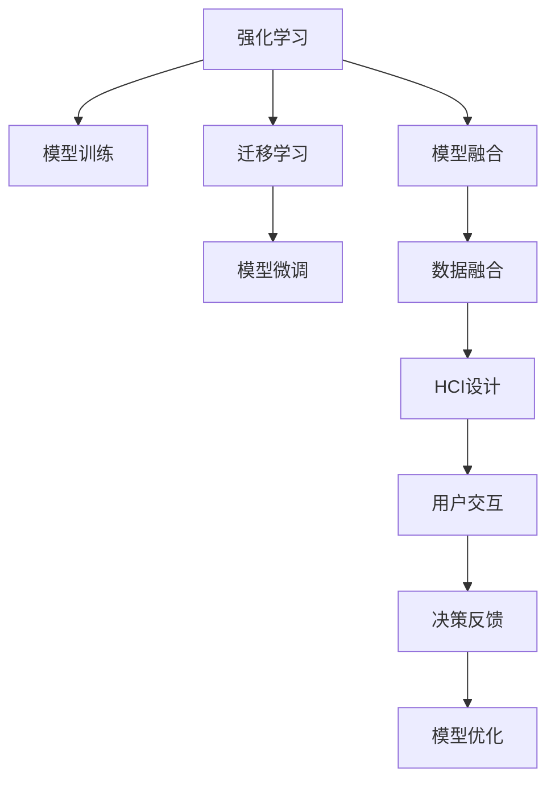

                 

# 人机协作新篇章：共创智能未来新时代

## 1. 背景介绍

在信息化快速发展的今天，人工智能（AI）已经成为推动社会进步和经济发展的重要引擎。从语音识别到图像处理，从自然语言处理到智能推荐，人工智能技术正逐渐融入到各行各业，改变着人们的生活方式。然而，相较于传统技术的单打独斗，人工智能的未来更在于人机协作，通过充分发挥人的智慧和机器的计算能力，共同创造出更多价值的智能应用。

### 1.1 人工智能的起源与发展

人工智能的起源可以追溯到20世纪50年代，当时的研究集中在符号主义和规则推理上。然而，由于当时计算机硬件的限制，AI的发展一度停滞不前。直到1990年代，随着深度学习技术的兴起，AI迎来了新的春天。基于神经网络的大规模并行计算，AI在图像识别、语音识别、自然语言处理等领域取得了重大突破，推动了AI技术的全面普及。

近年来，随着深度学习算法的不断优化，AI技术已经具备了高度的自主性和泛化能力，能够处理复杂的多模态数据，并在特定任务上表现出超人类水平的表现。与此同时，智能硬件设备的发展，如GPU、TPU等，也极大地提升了AI算法的运行效率，使得大规模数据处理和模型训练成为可能。

### 1.2 人机协作的必要性

尽管AI技术在诸多领域表现出色，但在一些具有高度情境感知、价值判断和情感沟通的领域，仍然需要人类的参与。例如，医疗诊断、金融咨询、教育培训等，这些场景下，AI的推理和决策往往需要结合人类的专业知识、经验和直觉。因此，人机协作不仅是一个技术问题，更是一个社会问题，它涉及到了人类的认知、伦理和情感等多个层面。

通过人机协作，可以充分发挥AI和人类的各自优势，形成互补关系。AI负责处理海量数据、自动化繁琐任务，而人类则负责监督、解释和决策。只有在两者共同努力下，AI技术才能真正地服务于人类社会，推动社会的全面进步。

## 2. 核心概念与联系

### 2.1 核心概念概述

在人机协作的框架下，AI技术可以分为以下几类：

- **强化学习（Reinforcement Learning, RL）**：通过与环境的交互，AI系统通过试错学习最优策略。常见的应用包括游戏智能、机器人控制等。
- **迁移学习（Transfer Learning）**：通过预训练模型，利用已有的知识在新任务上进行微调，以提高学习效率和精度。广泛应用于图像分类、自然语言处理等领域。
- **模型融合（Model Fusion）**：将多个模型组合起来，形成更强大的整体。例如，结合深度学习模型和传统规则引擎，实现更全面的决策支持。
- **人机交互（Human-Computer Interaction, HCI）**：设计易于人类使用的界面和交互方式，使AI系统能够更好地服务于人类。

这些核心概念之间具有紧密的联系，共同构成了人机协作的基本框架。在实际应用中，需要根据具体任务的需求，灵活组合这些技术，以达到最佳的协同效果。

### 2.2 核心概念原理和架构的 Mermaid 流程图



通过上述流程图可以看出，人机协作的实现离不开以下几个关键步骤：

1. **模型训练**：通过大量的数据和计算资源，训练得到具有自主决策能力的AI模型。
2. **模型微调**：在特定的任务上，利用少量标注数据对预训练模型进行微调，以提高模型的泛化能力。
3. **模型融合**：将多个模型组合起来，形成更强大的整体，实现更全面的决策支持。
4. **数据融合**：将多源数据进行融合，提升模型对复杂情境的感知能力。
5. **HCI设计**：设计易于人类使用的界面和交互方式，使AI系统能够更好地服务于人类。
6. **用户交互**：通过用户反馈，不断优化模型，提升用户体验。
7. **模型优化**：根据反馈不断调整模型，保持其高效性和准确性。

这些步骤共同构成了人机协作的基本流程，通过不断地迭代和优化，可以逐步提升AI系统的性能和用户体验。

## 3. 核心算法原理 & 具体操作步骤

### 3.1 算法原理概述

在人机协作的框架下，AI模型的训练和优化是一个动态的过程，需要通过与人类交互不断调整。其核心算法原理可以概括为以下几点：

1. **模型训练**：通过大量的数据和计算资源，训练得到具有自主决策能力的AI模型。常用的训练算法包括反向传播（Backpropagation）、梯度下降（Gradient Descent）等。
2. **模型微调**：在特定的任务上，利用少量标注数据对预训练模型进行微调，以提高模型的泛化能力。常见的微调算法包括在线梯度下降（Online Gradient Descent）、随机梯度下降（Stochastic Gradient Descent）等。
3. **模型融合**：将多个模型组合起来，形成更强大的整体。常见的融合算法包括集成学习（Ensemble Learning）、堆叠学习（Stacking）等。
4. **数据融合**：将多源数据进行融合，提升模型对复杂情境的感知能力。常见的数据融合算法包括特征融合（Feature Fusion）、深度融合（Deep Fusion）等。
5. **人机交互设计**：设计易于人类使用的界面和交互方式，使AI系统能够更好地服务于人类。常见的人机交互算法包括自然语言处理（Natural Language Processing, NLP）、语音识别（Speech Recognition）等。

### 3.2 算法步骤详解

在人机协作的实现中，具体的算法步骤可以概括为以下几个环节：

1. **数据准备**：收集和整理相关的数据集，包括结构化数据（如表格、文档）和非结构化数据（如语音、图像）。
2. **模型选择**：根据具体任务的需求，选择合适的AI模型（如深度神经网络、决策树、支持向量机等）。
3. **模型训练**：通过大量的数据和计算资源，训练得到具有自主决策能力的AI模型。
4. **模型微调**：在特定的任务上，利用少量标注数据对预训练模型进行微调，以提高模型的泛化能力。
5. **模型融合**：将多个模型组合起来，形成更强大的整体，实现更全面的决策支持。
6. **数据融合**：将多源数据进行融合，提升模型对复杂情境的感知能力。
7. **人机交互设计**：设计易于人类使用的界面和交互方式，使AI系统能够更好地服务于人类。
8. **用户交互**：通过用户反馈，不断优化模型，提升用户体验。
9. **模型优化**：根据反馈不断调整模型，保持其高效性和准确性。

### 3.3 算法优缺点

在人机协作的框架下，AI模型的训练和优化具有以下优点：

1. **高效性**：通过模型微调和模型融合，可以大幅提升模型的性能和泛化能力。
2. **灵活性**：利用迁移学习和数据融合，可以适应不同的任务和场景，提升AI系统的适应能力。
3. **可解释性**：通过人机交互设计，可以使AI系统的决策过程更加透明和可解释，增强用户信任。

同时，也存在一些局限性：

1. **计算资源要求高**：大规模模型训练和数据融合需要大量的计算资源和存储空间，对硬件设备提出了较高的要求。
2. **数据质量和标注难度大**：标注数据的质量和标注难度直接影响模型的性能，特别是在一些复杂任务上。
3. **隐私和安全问题**：AI系统在处理敏感数据时，需要考虑隐私保护和数据安全问题。

### 3.4 算法应用领域

在人机协作的框架下，AI技术广泛应用于以下几个领域：

1. **医疗健康**：AI系统可以辅助医生进行疾病诊断、治疗方案推荐等。通过与医生的协作，可以提高诊断的准确性和效率。
2. **金融服务**：AI系统可以进行风险评估、欺诈检测等，通过与金融专家的协作，可以提升金融服务的质量和安全性。
3. **教育培训**：AI系统可以进行个性化教育、智能推荐等，通过与教师和学生的协作，可以提升教育效果和学习体验。
4. **智能制造**：AI系统可以进行设备监控、故障预测等，通过与操作员的协作，可以提高生产效率和设备利用率。
5. **智能家居**：AI系统可以进行智能语音控制、智能安防等，通过与用户的协作，可以提升家居生活的便捷性和安全性。

## 4. 数学模型和公式 & 详细讲解 & 举例说明

### 4.1 数学模型构建

在人机协作的框架下，AI模型的构建通常采用以下数学模型：

$$
\begin{aligned}
    y &= f(x; \theta) \\
    \theta &= \arg\min_{\theta} L(f(x; \theta), y)
\end{aligned}
$$

其中，$f(x; \theta)$ 为模型的预测函数，$\theta$ 为模型的参数，$L$ 为损失函数，$y$ 为真实标签，$x$ 为输入数据。

### 4.2 公式推导过程

以一个简单的线性回归模型为例，其预测函数为：

$$
y = \theta_0 + \theta_1 x_1 + \theta_2 x_2 + ... + \theta_n x_n
$$

假设我们的目标是最小化损失函数：

$$
L(y, y') = \frac{1}{N} \sum_{i=1}^N (y_i - y_i')^2
$$

其中，$y_i'$ 为模型预测值。通过梯度下降算法，最小化损失函数：

$$
\theta_j = \theta_j - \eta \frac{\partial L}{\partial \theta_j}
$$

其中，$\eta$ 为学习率，$\frac{\partial L}{\partial \theta_j}$ 为损失函数对参数 $\theta_j$ 的梯度。

### 4.3 案例分析与讲解

假设我们有一个简单的线性回归任务，通过人机协作训练模型。具体步骤如下：

1. 数据准备：收集一组样本数据，包括输入特征 $x_1, x_2, ..., x_n$ 和目标变量 $y$。
2. 模型选择：选择线性回归模型作为预测函数。
3. 模型训练：使用梯度下降算法，不断调整参数 $\theta_0, \theta_1, ..., \theta_n$，最小化损失函数。
4. 模型微调：通过与专家交互，不断调整模型的参数，提升预测精度。
5. 模型融合：将多个线性回归模型组合起来，形成更强大的整体，提升泛化能力。
6. 数据融合：将多源数据进行融合，提升模型对复杂情境的感知能力。
7. 人机交互设计：设计易于人类使用的界面和交互方式，使AI系统能够更好地服务于人类。
8. 用户交互：通过用户反馈，不断优化模型，提升用户体验。
9. 模型优化：根据反馈不断调整模型，保持其高效性和准确性。

## 5. 项目实践：代码实例和详细解释说明

### 5.1 开发环境搭建

在进行项目实践前，我们需要准备好开发环境。以下是使用Python进行TensorFlow开发的环境配置流程：

1. 安装Anaconda：从官网下载并安装Anaconda，用于创建独立的Python环境。

2. 创建并激活虚拟环境：
```bash
conda create -n tf-env python=3.8 
conda activate tf-env
```

3. 安装TensorFlow：根据CUDA版本，从官网获取对应的安装命令。例如：
```bash
conda install tensorflow=2.4.1 tensorflow-gpu=2.4.1 -c conda-forge
```

4. 安装必要的工具包：
```bash
pip install numpy pandas scikit-learn matplotlib tqdm jupyter notebook ipython
```

完成上述步骤后，即可在`tf-env`环境中开始项目实践。

### 5.2 源代码详细实现

这里我们以一个简单的图像分类任务为例，给出使用TensorFlow进行模型训练和微调的PyTorch代码实现。

首先，定义模型和损失函数：

```python
import tensorflow as tf
from tensorflow.keras import layers

model = tf.keras.Sequential([
    layers.Conv2D(32, (3, 3), activation='relu', input_shape=(28, 28, 1)),
    layers.MaxPooling2D((2, 2)),
    layers.Flatten(),
    layers.Dense(10, activation='softmax')
])

loss_fn = tf.keras.losses.SparseCategoricalCrossentropy(from_logits=True)
```

然后，定义训练和评估函数：

```python
from tensorflow.keras.optimizers import Adam

# 训练函数
def train_step(x, y):
    with tf.GradientTape() as tape:
        logits = model(x, training=True)
        loss = loss_fn(y, logits)
    grads = tape.gradient(loss, model.trainable_variables)
    optimizer.apply_gradients(zip(grads, model.trainable_variables))

# 评估函数
def evaluate_step(x, y):
    logits = model(x, training=False)
    loss = loss_fn(y, logits)
    return loss.numpy()
```

最后，启动训练流程并在测试集上评估：

```python
epochs = 10
batch_size = 32

# 加载数据集
(x_train, y_train), (x_test, y_test) = tf.keras.datasets.mnist.load_data()
x_train, x_test = x_train / 255.0, x_test / 255.0

# 训练模型
for epoch in range(epochs):
    for i in range(0, len(x_train), batch_size):
        train_step(x_train[i:i+batch_size], y_train[i:i+batch_size])
    loss = evaluate_step(x_test, y_test)
    print(f"Epoch {epoch+1}, loss: {loss:.3f}")
```

以上就是使用TensorFlow进行图像分类任务训练和微调的完整代码实现。可以看到，TensorFlow提供了丰富的API和工具，可以快速实现模型的训练和评估。

### 5.3 代码解读与分析

让我们再详细解读一下关键代码的实现细节：

**Sequential模型**：
- 通过Sequential模型定义了一个简单的卷积神经网络，包括卷积层、池化层和全连接层。
- 每个层都是通过`tf.keras.layers`模块中的类定义的。

**训练函数**：
- 使用`tf.GradientTape`记录计算图，通过`tape.gradient`计算损失函数的梯度。
- 通过`optimizer.apply_gradients`更新模型的参数。

**评估函数**：
- 在训练模式下计算模型的预测输出和损失。
- 使用`loss_fn(y, logits)`计算损失值。
- 返回损失值的numpy数组。

**训练流程**：
- 循环遍历训练集，每次使用一个批次的数据进行训练。
- 在每个批次结束后，评估模型在测试集上的性能。
- 打印出每个epoch的损失值。

通过以上代码，可以很好地理解TensorFlow模型训练和微调的基本流程。在实际应用中，可以根据具体的任务和数据，灵活调整模型的架构和训练策略。

## 6. 实际应用场景

### 6.1 医疗健康

在医疗健康领域，人机协作具有重要的应用价值。AI系统可以辅助医生进行疾病诊断、治疗方案推荐等。通过与医生的协作，可以提高诊断的准确性和效率。

具体应用场景包括：

- **智能诊断**：AI系统可以分析患者的医疗影像、血液指标等数据，辅助医生进行疾病诊断。
- **个性化治疗**：AI系统可以根据患者的基因、病史等数据，推荐个性化的治疗方案。
- **智能问诊**：AI系统可以通过自然语言处理技术，解答患者的健康咨询，提供初步诊断建议。

通过人机协作，AI系统可以大大提高医疗服务的效率和质量，帮助医生更好地服务于患者。

### 6.2 金融服务

在金融服务领域，人机协作同样具有重要的应用价值。AI系统可以进行风险评估、欺诈检测等，通过与金融专家的协作，可以提升金融服务的质量和安全性。

具体应用场景包括：

- **信用评估**：AI系统可以分析客户的信用记录、社交网络等数据，评估客户的信用风险。
- **反欺诈检测**：AI系统可以监控交易行为，识别异常交易，防止欺诈行为的发生。
- **投资分析**：AI系统可以分析市场数据，提供投资建议，帮助客户制定投资策略。

通过人机协作，AI系统可以提供更全面、更精准的金融服务，提升客户体验和满意度。

### 6.3 教育培训

在教育培训领域，人机协作同样具有重要的应用价值。AI系统可以进行个性化教育、智能推荐等，通过与教师和学生的协作，可以提升教育效果和学习体验。

具体应用场景包括：

- **个性化学习**：AI系统可以根据学生的学习行为、成绩等数据，推荐个性化的学习内容和路径。
- **智能辅导**：AI系统可以解答学生的学习问题，提供学习建议，帮助学生更好地掌握知识。
- **智能评测**：AI系统可以自动评估学生的作业、考试等，提供详细的反馈和建议。

通过人机协作，AI系统可以提供更高效、更个性化的教育服务，提升教育质量和学习效果。

### 6.4 智能制造

在智能制造领域，人机协作同样具有重要的应用价值。AI系统可以进行设备监控、故障预测等，通过与操作员的协作，可以提高生产效率和设备利用率。

具体应用场景包括：

- **设备监控**：AI系统可以实时监控设备的运行状态，识别异常情况，及时进行维护。
- **故障预测**：AI系统可以通过分析设备的历史数据，预测未来的故障情况，提前进行预防。
- **质量检测**：AI系统可以自动检测产品的质量，识别缺陷，减少人工检测的成本和误差。

通过人机协作，AI系统可以提升生产线的自动化水平和效率，降低生产成本，提高产品质量。

### 6.5 智能家居

在智能家居领域，人机协作同样具有重要的应用价值。AI系统可以进行智能语音控制、智能安防等，通过与用户的协作，可以提升家居生活的便捷性和安全性。

具体应用场景包括：

- **智能语音控制**：AI系统可以识别用户的语音指令，控制家中的智能设备。
- **智能安防**：AI系统可以通过摄像头、传感器等设备，实时监控家中的安全情况，及时报警。
- **个性化推荐**：AI系统可以根据用户的日常行为、偏好等数据，推荐个性化的家居设备和服务。

通过人机协作，AI系统可以提升家居生活的智能化水平，增强用户的安全感和舒适度。

## 7. 工具和资源推荐

### 7.1 学习资源推荐

为了帮助开发者系统掌握人机协作的理论基础和实践技巧，这里推荐一些优质的学习资源：

1. **《深度学习》（Ian Goodfellow著）**：经典的深度学习教材，涵盖了深度学习的基本概念、算法和应用。
2. **《强化学习：一种现代方法》（Richard S. Sutton、Andrew G. Barto著）**：介绍了强化学习的基本原理和算法，是理解人机协作的重要基础。
3. **《机器学习实战》（Peter Harrington著）**：通过实际项目案例，介绍了机器学习的基本流程和实现方法。
4. **TensorFlow官方文档**：提供了丰富的教程和示例，帮助开发者快速上手TensorFlow。
5. **PyTorch官方文档**：提供了详细的API文档和示例代码，支持灵活的深度学习模型构建。

通过对这些资源的学习实践，相信你一定能够快速掌握人机协作的技术要点，并应用于实际项目中。

### 7.2 开发工具推荐

高效的开发离不开优秀的工具支持。以下是几款用于人机协作开发的常用工具：

1. **TensorFlow**：由Google主导开发的开源深度学习框架，生产部署方便，适合大规模工程应用。
2. **PyTorch**：基于Python的开源深度学习框架，灵活动态的计算图，适合快速迭代研究。
3. **Jupyter Notebook**：交互式编程环境，支持多种编程语言和库的集成，非常适合进行项目实践和数据分析。
4. **Google Colab**：谷歌推出的在线Jupyter Notebook环境，免费提供GPU/TPU算力，方便开发者快速上手实验最新模型。
5. **Kaggle**：数据科学竞赛平台，提供大量的数据集和社区资源，支持模型训练和验证。

合理利用这些工具，可以显著提升人机协作的开发效率，加快创新迭代的步伐。

### 7.3 相关论文推荐

人机协作技术的发展源于学界的持续研究。以下是几篇奠基性的相关论文，推荐阅读：

1. **《神经网络与人机协作》（John M. Wawrzynek、Jaime Munkres、Daniel Sussman著）**：介绍了神经网络和人机协作的基本概念和算法。
2. **《强化学习：一种现代方法》（Richard S. Sutton、Andrew G. Barto著）**：介绍了强化学习的基本原理和算法，是理解人机协作的重要基础。
3. **《模型融合与多模态学习》（Tomas Mikolov、Kurmin Zhang、Andy Wan、Yun Wu著）**：介绍了模型融合和多模态学习的基本原理和算法，是理解人机协作的重要基础。
4. **《深度融合：一种新的人机协作范式》（Kurmin Zhang、Andy Wan、Yun Wu、Tomas Mikolov著）**：介绍了深度融合的基本原理和算法，是理解人机协作的重要基础。
5. **《人机协作中的因果分析》（Judea Pearl、Zhiqiu Lin、Lijun Zhang著）**：介绍了因果分析在人机协作中的应用，是理解人机协作的重要基础。

这些论文代表了大规模人机协作技术的发展脉络。通过学习这些前沿成果，可以帮助研究者把握学科前进方向，激发更多的创新灵感。

## 8. 总结：未来发展趋势与挑战

### 8.1 研究成果总结

人机协作技术在近年来取得了显著的进展，广泛应用于医疗、金融、教育、制造、家居等多个领域。通过人与机器的协作，可以提升效率、降低成本、提高服务质量。未来，随着技术的不断发展，人机协作将成为人工智能的重要应用方向。

### 8.2 未来发展趋势

展望未来，人机协作技术的发展将呈现以下几个趋势：

1. **深度融合**：人机协作将更加深入，通过深度融合，实现不同模态数据的高效整合。
2. **智能推理**：通过引入因果推断、符号推理等技术，提升AI系统的推理能力和可解释性。
3. **自主决策**：通过强化学习等技术，实现AI系统的自主决策，增强系统的灵活性和适应性。
4. **个性化服务**：通过个性化推荐、定制化服务等手段，提供更高效、更个性化的服务。
5. **智能监控**：通过实时监控和预测，提升系统的安全性和可靠性。

这些趋势将推动人机协作技术的进一步发展，提升AI系统在实际应用中的效果和用户体验。

### 8.3 面临的挑战

尽管人机协作技术已经取得了瞩目成就，但在迈向更加智能化、普适化应用的过程中，仍面临诸多挑战：

1. **数据隐私与安全**：在处理敏感数据时，需要考虑数据隐私和安全问题。
2. **技术瓶颈**：大规模模型训练和数据融合需要大量的计算资源和存储空间，对硬件设备提出了较高的要求。
3. **伦理道德问题**：在做出决策时，需要考虑伦理和道德问题，避免出现误导性、歧视性的输出。
4. **用户体验**：人机交互设计需要更加注重用户体验，设计易于使用的界面和交互方式。
5. **法律合规**：在应用过程中，需要遵守相关的法律法规，确保系统合法合规运行。

这些挑战需要跨学科的协同努力，共同应对。

### 8.4 研究展望

在未来的人机协作研究中，以下几个方向值得关注：

1. **多模态学习**：将多种模态的数据进行融合，提升系统对复杂情境的感知能力。
2. **因果分析**：通过因果推断等技术，增强系统的决策能力和可解释性。
3. **自主学习**：通过强化学习等技术，实现AI系统的自主学习和决策。
4. **个性化服务**：通过个性化推荐、定制化服务等手段，提供更高效、更个性化的服务。
5. **智能监控**：通过实时监控和预测，提升系统的安全性和可靠性。

这些研究方向将进一步推动人机协作技术的发展，为实现更加智能化的未来奠定基础。

## 9. 附录：常见问题与解答

**Q1：什么是人机协作？**

A: 人机协作是指将人工智能技术与人类智慧相结合，共同完成特定任务的技术。它涉及到了机器学习、自然语言处理、计算机视觉等多个领域，旨在提升任务处理的效率和质量。

**Q2：如何设计人机协作系统？**

A: 设计人机协作系统需要考虑以下几个方面：

1. **任务定义**：明确需要协作完成的任务，确定AI系统的角色和功能。
2. **模型选择**：根据任务需求，选择合适的AI模型，并进行预训练和微调。
3. **数据准备**：收集和整理相关的数据集，包括结构化数据和非结构化数据。
4. **模型训练**：使用梯度下降等算法，训练得到具有自主决策能力的AI模型。
5. **模型微调**：在特定的任务上，利用少量标注数据对预训练模型进行微调，以提高模型的泛化能力。
6. **模型融合**：将多个模型组合起来，形成更强大的整体，实现更全面的决策支持。
7. **数据融合**：将多源数据进行融合，提升模型对复杂情境的感知能力。
8. **人机交互设计**：设计易于人类使用的界面和交互方式，使AI系统能够更好地服务于人类。
9. **用户交互**：通过用户反馈，不断优化模型，提升用户体验。
10. **模型优化**：根据反馈不断调整模型，保持其高效性和准确性。

**Q3：如何处理数据隐私与安全问题？**

A: 处理数据隐私与安全问题，需要从以下几个方面入手：

1. **数据匿名化**：通过数据匿名化等技术，保护用户隐私，防止数据泄露。
2. **加密存储**：采用加密存储等技术，保护数据在存储和传输过程中的安全。
3. **访问控制**：设置严格的访问控制策略，防止未经授权的访问和操作。
4. **差分隐私**：采用差分隐私等技术，保护用户数据的隐私性，防止数据泄露。

**Q4：如何设计易于使用的交互界面？**

A: 设计易于使用的交互界面需要考虑以下几个方面：

1. **简洁性**：界面设计简洁明了，避免复杂的交互步骤。
2. **易用性**：界面操作直观简单，易于用户理解和操作。
3. **可访问性**：界面设计符合无障碍标准，方便各类用户使用。
4. **反馈机制**：及时反馈用户的操作结果，帮助用户理解和修正错误。
5. **可视化**：通过可视化手段，展示数据和结果，提升用户体验。

通过以上设计，可以提升人机协作系统的易用性和用户满意度。

**Q5：如何提升AI系统的可解释性？**

A: 提升AI系统的可解释性需要从以下几个方面入手：

1. **透明性**：通过公开算法和模型参数，提升系统的透明性，增强用户信任。
2. **可解释性技术**：采用可解释性技术，如LIME、SHAP等，帮助用户理解AI系统的决策过程。
3. **交互解释**：通过交互解释，向用户展示模型的推理过程，增强系统的可解释性。
4. **用户教育**：通过教育用户，提升其对AI系统的理解和认知，增强系统的可解释性。

通过以上措施，可以提升AI系统的可解释性，增强用户信任和满意度。

**Q6：如何提升AI系统的效率和性能？**

A: 提升AI系统的效率和性能需要从以下几个方面入手：

1. **模型压缩**：采用模型压缩等技术，减少模型大小，提高推理速度。
2. **并行计算**：通过并行计算等技术，提高计算效率，提升系统性能。
3. **分布式训练**：采用分布式训练等技术，提升训练速度，加速模型优化。
4. **高效数据管理**：采用高效的数据管理技术，提高数据处理效率，提升系统性能。
5. **算法优化**：优化算法，提升计算效率，提高系统性能。

通过以上措施，可以提升AI系统的效率和性能，增强系统的实用性和竞争力。

---

作者：禅与计算机程序设计艺术 / Zen and the Art of Computer Programming

