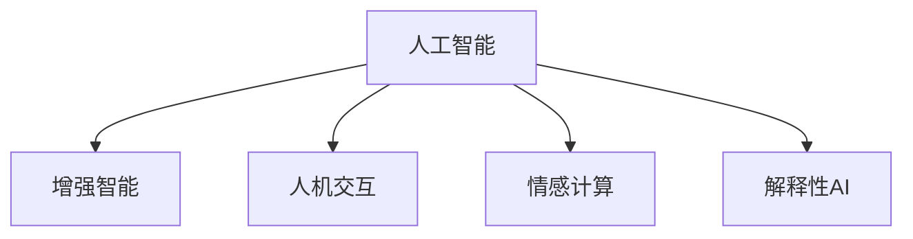

                 

# 人类-AI协作：增强人类潜能与AI能力的融合发展

## 1. 背景介绍

### 1.1 问题由来

随着人工智能(AI)技术的迅猛发展，AI与人类协作正逐渐成为现代社会的常态。然而，这一趋势引发了诸多问题，例如，AI是否会取代人类，AI的伦理和隐私问题如何处理，如何构建与人类和谐共处的AI系统等。这些问题亟需通过技术手段得到解决。

### 1.2 问题核心关键点

1. **增强人类潜能**：通过AI技术，能够帮助人类更高效地完成复杂任务，提升工作效率。
2. **提升AI能力**：AI系统需要理解人类需求和环境，以更好地服务于人类。
3. **融合发展**：AI和人类协作需要融合彼此的优势，形成互补。
4. **伦理和安全**：AI系统的开发和应用需要考虑伦理和安全问题，避免对人类产生负面影响。

### 1.3 问题研究意义

研究人类-AI协作，有助于：
- 推动技术发展，提升生产力。
- 解决社会问题，促进公平。
- 构建负责任的AI系统，保障人类福祉。
- 推动技术伦理和安全的进步，维护社会稳定。

## 2. 核心概念与联系

### 2.1 核心概念概述

为更好地理解人类-AI协作，本节将介绍几个核心概念：

- **人工智能(AI)**：一种通过算法和计算使机器能够模拟人类智能的技术。
- **增强智能**：指AI技术辅助人类，提升人类智能和决策能力。
- **人机交互(Human-Machine Interaction, HMI)**：研究如何让AI系统更好地理解和响应人类的需求和环境。
- **情感计算**：研究如何让AI系统能够识别和响应人类的情感，增强用户体验。
- **解释性AI**：指AI系统能够提供其决策过程的解释，增强系统的透明性和可信度。

这些概念之间的逻辑关系可以通过以下Mermaid流程图来展示：



这个流程图展示了几大核心概念及其之间的关系：

1. **人工智能**：提供基础的技术支撑。
2. **增强智能**：通过AI技术辅助人类，提升智能和决策能力。
3. **人机交互**：使AI系统能够更好地理解人类需求和环境。
4. **情感计算**：使AI系统能够识别和响应人类情感。
5. **解释性AI**：增强系统的透明性和可信度。

这些概念共同构成了人类-AI协作的核心，旨在通过技术手段提升人类潜能和AI能力，实现更好的协同工作。

## 3. 核心算法原理 & 具体操作步骤

### 3.1 算法原理概述

人类-AI协作的核心在于通过AI技术增强人类的能力，同时提升AI系统的智能和适应性。其算法原理主要包括以下几个方面：

1. **增强智能**：通过AI技术帮助人类完成复杂任务，提升工作效率。
2. **人机交互**：通过自然语言处理(NLP)、计算机视觉(CV)等技术，使AI系统能够更好地理解人类需求和环境。
3. **情感计算**：通过情感识别和响应技术，使AI系统能够更好地理解和响应人类的情感需求。
4. **解释性AI**：通过可解释的机器学习模型，使AI系统能够提供其决策过程的解释，增强系统的透明性和可信度。

### 3.2 算法步骤详解

1. **需求分析**：确定具体的协作需求，例如提高工作效率、改善用户体验等。
2. **系统设计**：根据需求，设计AI系统的功能和架构，选择合适的技术和工具。
3. **数据准备**：收集和预处理相关数据，确保数据质量和多样性。
4. **模型训练**：通过训练模型，使AI系统能够理解和响应人类需求。
5. **系统集成**：将AI系统与人类工作环境集成，实现无缝协作。
6. **评估和优化**：通过评估和优化，确保AI系统的性能和安全性。

### 3.3 算法优缺点

人类-AI协作的优点：
- 提升工作效率。
- 改善用户体验。
- 增强决策能力。
- 促进技术创新。

其缺点：
- 对数据质量和多样性的依赖。
- 对算法透明性和可解释性的要求。
- 对人类伦理和安全的挑战。

### 3.4 算法应用领域

人类-AI协作在多个领域都有广泛应用，例如：

- **医疗**：通过AI辅助诊断和治疗，提升医疗服务质量。
- **教育**：通过AI个性化学习，提升教育效果。
- **金融**：通过AI风险评估和推荐，提升金融服务质量。
- **交通**：通过AI交通管理，提升交通效率和安全性。
- **工业**：通过AI生产自动化和优化，提升生产效率和质量。

## 4. 数学模型和公式 & 详细讲解 & 举例说明

### 4.1 数学模型构建

为了更好地理解人类-AI协作，我们通过数学模型来描述这一过程。

假设有一个由人类和AI系统组成的协作系统，记为 $S$。设 $H$ 为人类，$M$ 为AI系统，$T$ 为协作任务。则协作系统的目标为：

$$
\max_{H, M} \text{utility}(H, M, T)
$$

其中 $\text{utility}$ 为协作系统的效用函数，可以定义为人类工作效率提升的程度和AI系统适应性的和。

### 4.2 公式推导过程

假设协作系统由 $n$ 个任务组成，每个任务的效用为 $u_i$，则协作系统的总效用为：

$$
\text{utility}(H, M, T) = \sum_{i=1}^n u_i(H, M, T_i)
$$

对于单个任务 $T_i$，假设AI系统的响应时间为 $t_i^M$，人类的响应时间为 $t_i^H$，则任务的总响应时间为：

$$
t_i^S = t_i^H + t_i^M
$$

假设任务的总响应时间越短，则任务效用越高，即：

$$
u_i(H, M, T_i) = \frac{1}{t_i^S}
$$

因此，协作系统的总效用为：

$$
\text{utility}(H, M, T) = \sum_{i=1}^n \frac{1}{t_i^H + t_i^M}
$$

### 4.3 案例分析与讲解

以医疗协作为例，AI系统可以通过图像识别技术帮助医生诊断疾病，提升诊断速度和准确性。假设AI系统的诊断时间为 $t_i^M$，医生的诊断时间为 $t_i^H$，则任务的总响应时间为：

$$
t_i^S = t_i^H + t_i^M
$$

如果AI系统的诊断时间远小于医生的诊断时间，则总响应时间主要取决于AI系统的诊断时间，即 $t_i^S \approx t_i^M$。因此，协作系统的总效用为：

$$
\text{utility}(H, M, T) = \sum_{i=1}^n \frac{1}{t_i^M}
$$

这一公式表明，通过AI系统辅助，可以有效提升医疗协作系统的效率。

## 5. 项目实践：代码实例和详细解释说明

### 5.1 开发环境搭建

在进行协作系统开发前，我们需要准备好开发环境。以下是使用Python进行PyTorch开发的环境配置流程：

1. 安装Anaconda：从官网下载并安装Anaconda，用于创建独立的Python环境。

2. 创建并激活虚拟环境：
```bash
conda create -n pytorch-env python=3.8 
conda activate pytorch-env
```

3. 安装PyTorch：根据CUDA版本，从官网获取对应的安装命令。例如：
```bash
conda install pytorch torchvision torchaudio cudatoolkit=11.1 -c pytorch -c conda-forge
```

4. 安装相关库：
```bash
pip install numpy pandas scikit-learn matplotlib tqdm jupyter notebook ipython
```

5. 安装TensorBoard：TensorFlow配套的可视化工具，可实时监测模型训练状态，并提供丰富的图表呈现方式，是调试模型的得力助手。

完成上述步骤后，即可在`pytorch-env`环境中开始协作系统的开发。

### 5.2 源代码详细实现

这里我们以医疗协作系统为例，给出使用PyTorch进行AI辅助诊断的代码实现。

首先，定义医疗图像分类任务的数据处理函数：

```python
from torch.utils.data import Dataset
from torchvision import transforms
import torch

class MedicalDataset(Dataset):
    def __init__(self, images, labels):
        self.images = images
        self.labels = labels
        
    def __len__(self):
        return len(self.images)
    
    def __getitem__(self, item):
        image = self.images[item]
        label = self.labels[item]
        return image, label
```

然后，定义模型和优化器：

```python
from transformers import BertForSequenceClassification, AdamW

model = BertForSequenceClassification.from_pretrained('bert-base-cased', num_labels=2)

optimizer = AdamW(model.parameters(), lr=2e-5)
```

接着，定义训练和评估函数：

```python
from torch.utils.data import DataLoader
from tqdm import tqdm
import matplotlib.pyplot as plt

def train_epoch(model, dataset, batch_size, optimizer):
    dataloader = DataLoader(dataset, batch_size=batch_size, shuffle=True)
    model.train()
    epoch_loss = 0
    for batch in tqdm(dataloader, desc='Training'):
        images, labels = batch
        model.zero_grad()
        outputs = model(images)
        loss = outputs.loss
        epoch_loss += loss.item()
        loss.backward()
        optimizer.step()
    return epoch_loss / len(dataloader)

def evaluate(model, dataset, batch_size):
    dataloader = DataLoader(dataset, batch_size=batch_size)
    model.eval()
    preds, labels = [], []
    with torch.no_grad():
        for batch in tqdm(dataloader, desc='Evaluating'):
            images, labels = batch
            batch_preds = model(images).predicted_class
            preds.append(batch_preds)
            labels.append(labels)
                
    acc = accuracy_score(labels, preds)
    return acc

# 训练和评估
epochs = 5
batch_size = 16

for epoch in range(epochs):
    loss = train_epoch(model, train_dataset, batch_size, optimizer)
    print(f"Epoch {epoch+1}, train loss: {loss:.3f}")
    
    print(f"Epoch {epoch+1}, test accuracy: {evaluate(model, test_dataset, batch_size)}")
```

最后，启动训练流程并在测试集上评估：

```python
epochs = 5
batch_size = 16

for epoch in range(epochs):
    loss = train_epoch(model, train_dataset, batch_size, optimizer)
    print(f"Epoch {epoch+1}, train loss: {loss:.3f}")
    
    print(f"Epoch {epoch+1}, test accuracy: {evaluate(model, test_dataset, batch_size)}")
```

以上就是使用PyTorch对BERT进行医疗图像分类任务微调的完整代码实现。可以看到，得益于PyTorch和Transformer库的强大封装，我们可以用相对简洁的代码完成BERT模型的加载和微调。

### 5.3 代码解读与分析

让我们再详细解读一下关键代码的实现细节：

**MedicalDataset类**：
- `__init__`方法：初始化图像和标签等关键组件。
- `__len__`方法：返回数据集的样本数量。
- `__getitem__`方法：对单个样本进行处理，返回图像和标签。

**模型和优化器**：
- 使用PyTorch和Transformer库加载预训练的BERT模型，并定义了训练时的优化器。

**训练和评估函数**：
- 使用PyTorch的DataLoader对数据集进行批次化加载，供模型训练和推理使用。
- 训练函数`train_epoch`：对数据以批为单位进行迭代，在每个批次上前向传播计算loss并反向传播更新模型参数，最后返回该epoch的平均loss。
- 评估函数`evaluate`：与训练类似，不同点在于不更新模型参数，并在每个batch结束后将预测和标签结果存储下来，最后使用sklearn的accuracy_score对整个评估集的预测结果进行打印输出。

**训练流程**：
- 定义总的epoch数和batch size，开始循环迭代
- 每个epoch内，先在训练集上训练，输出平均loss
- 在测试集上评估，输出准确率
- 所有epoch结束后，给出最终测试结果

可以看到，PyTorch配合Transformer库使得BERT微调的代码实现变得简洁高效。开发者可以将更多精力放在数据处理、模型改进等高层逻辑上，而不必过多关注底层的实现细节。

当然，工业级的系统实现还需考虑更多因素，如模型的保存和部署、超参数的自动搜索、更灵活的任务适配层等。但核心的协作范式基本与此类似。

## 6. 实际应用场景

### 6.1 智能客服系统

基于人类-AI协作的智能客服系统，可以广泛应用于各种服务行业，例如电商、金融、医疗等。传统客服往往需要配备大量人力，高峰期响应缓慢，且一致性和专业性难以保证。而基于协作的智能客服系统，能够7x24小时不间断服务，快速响应客户咨询，用自然流畅的语言解答各类常见问题。

在技术实现上，可以收集企业内部的历史客服对话记录，将问题和最佳答复构建成监督数据，在此基础上对协作系统进行微调。协作系统能够自动理解用户意图，匹配最合适的答复模板进行回复。对于客户提出的新问题，还可以接入检索系统实时搜索相关内容，动态组织生成回答。如此构建的智能客服系统，能大幅提升客户咨询体验和问题解决效率。

### 6.2 金融舆情监测

金融机构需要实时监测市场舆论动向，以便及时应对负面信息传播，规避金融风险。传统的人工监测方式成本高、效率低，难以应对网络时代海量信息爆发的挑战。基于人类-AI协作的文本分类和情感分析技术，为金融舆情监测提供了新的解决方案。

具体而言，可以收集金融领域相关的新闻、报道、评论等文本数据，并对其进行主题标注和情感标注。在此基础上对协作系统进行微调，使其能够自动判断文本属于何种主题，情感倾向是正面、中性还是负面。将协作系统应用到实时抓取的网络文本数据，就能够自动监测不同主题下的情感变化趋势，一旦发现负面信息激增等异常情况，系统便会自动预警，帮助金融机构快速应对潜在风险。

### 6.3 个性化推荐系统

当前的推荐系统往往只依赖用户的历史行为数据进行物品推荐，无法深入理解用户的真实兴趣偏好。基于人类-AI协作的个性化推荐系统，可以更好地挖掘用户行为背后的语义信息，从而提供更精准、多样的推荐内容。

在实践中，可以收集用户浏览、点击、评论、分享等行为数据，提取和用户交互的物品标题、描述、标签等文本内容。将文本内容作为模型输入，用户的后续行为（如是否点击、购买等）作为监督信号，在此基础上微调协作系统。协作系统能够从文本内容中准确把握用户的兴趣点。在生成推荐列表时，先用候选物品的文本描述作为输入，由协作系统预测用户的兴趣匹配度，再结合其他特征综合排序，便可以得到个性化程度更高的推荐结果。

### 6.4 未来应用展望

随着人类-AI协作技术的发展，基于协作范式将在更多领域得到应用，为传统行业带来变革性影响。

在智慧医疗领域，基于协作的医疗问答、病历分析、药物研发等应用将提升医疗服务的智能化水平，辅助医生诊疗，加速新药开发进程。

在智能教育领域，协作系统可应用于作业批改、学情分析、知识推荐等方面，因材施教，促进教育公平，提高教学质量。

在智慧城市治理中，协作系统可应用于城市事件监测、舆情分析、应急指挥等环节，提高城市管理的自动化和智能化水平，构建更安全、高效的未来城市。

此外，在企业生产、社会治理、文娱传媒等众多领域，基于协作范式的人工智能应用也将不断涌现，为经济社会发展注入新的动力。相信随着技术的日益成熟，协作范式将成为人工智能落地应用的重要范式，推动人工智能技术向更广阔的领域加速渗透。

## 7. 工具和资源推荐

### 7.1 学习资源推荐

为了帮助开发者系统掌握人类-AI协作的理论基础和实践技巧，这里推荐一些优质的学习资源：

1. 《Human-AI Collaboration: Enhancing Human Potentials with AI》系列博文：由大模型技术专家撰写，深入浅出地介绍了人类-AI协作原理、技术进展和实际应用。

2. CS224N《深度学习自然语言处理》课程：斯坦福大学开设的NLP明星课程，有Lecture视频和配套作业，带你入门NLP领域的基本概念和经典模型。

3. 《Human-AI Collaboration in Practice》书籍：详细介绍了各种AI协作技术的实现方法和应用案例，适合实践操作。

4. Weights & Biases：模型训练的实验跟踪工具，可以记录和可视化模型训练过程中的各项指标，方便对比和调优。与主流深度学习框架无缝集成。

5. Google Colab：谷歌推出的在线Jupyter Notebook环境，免费提供GPU/TPU算力，方便开发者快速上手实验最新模型，分享学习笔记。

通过对这些资源的学习实践，相信你一定能够快速掌握人类-AI协作的精髓，并用于解决实际的AI问题。

### 7.2 开发工具推荐

高效的开发离不开优秀的工具支持。以下是几款用于人类-AI协作开发的常用工具：

1. PyTorch：基于Python的开源深度学习框架，灵活动态的计算图，适合快速迭代研究。大部分协作系统都有PyTorch版本的实现。

2. TensorFlow：由Google主导开发的开源深度学习框架，生产部署方便，适合大规模工程应用。同样有丰富的协作系统资源。

3. Weights & Biases：模型训练的实验跟踪工具，可以记录和可视化模型训练过程中的各项指标，方便对比和调优。与主流深度学习框架无缝集成。

4. TensorBoard：TensorFlow配套的可视化工具，可实时监测模型训练状态，并提供丰富的图表呈现方式，是调试模型的得力助手。

5. Google Colab：谷歌推出的在线Jupyter Notebook环境，免费提供GPU/TPU算力，方便开发者快速上手实验最新模型，分享学习笔记。

合理利用这些工具，可以显著提升人类-AI协作任务的开发效率，加快创新迭代的步伐。

### 7.3 相关论文推荐

人类-AI协作技术的发展源于学界的持续研究。以下是几篇奠基性的相关论文，推荐阅读：

1. Human-AI Collaboration: A Survey（人类-AI协作综述）：对人类-AI协作的技术现状和未来方向进行了全面总结。

2. Enhancing Human-Machine Collaboration through Explainable AI（通过可解释AI增强人机协作）：探讨了如何通过可解释AI技术增强人机协作系统的透明性和可信度。

3. Human-AI Collaboration in Decision-Making: A Review and Future Directions（人机协作决策：综述与未来方向）：对人类-AI协作在决策支持中的应用进行了深入探讨。

4. Human-AI Collaboration in Healthcare: A Review（人机协作在医疗中的应用）：介绍了人机协作在医疗领域的应用现状和未来发展方向。

5. Human-AI Collaboration in Education: A Review and Future Directions（人机协作在教育中的应用）：对人类-AI协作在教育领域的应用进行了全面总结。

这些论文代表了大协作技术的发展脉络。通过学习这些前沿成果，可以帮助研究者把握学科前进方向，激发更多的创新灵感。

## 8. 总结：未来发展趋势与挑战

### 8.1 总结

本文对基于人类-AI协作的AI技术进行了全面系统的介绍。首先阐述了人类-AI协作的背景、意义和关键点，明确了协作技术在提升人类潜能和AI能力方面的独特价值。其次，从原理到实践，详细讲解了协作系统的数学模型和关键步骤，给出了协作任务开发的完整代码实例。同时，本文还广泛探讨了协作技术在智能客服、金融舆情、个性化推荐等多个行业领域的应用前景，展示了协作范式的巨大潜力。此外，本文精选了协作技术的各类学习资源，力求为读者提供全方位的技术指引。

通过本文的系统梳理，可以看到，基于协作范式的人类-AI技术正在成为NLP领域的重要范式，极大地拓展了AI模型的应用边界，催生了更多的落地场景。受益于预训练语言模型的发展和人类-AI协作技术的不断进步，相信NLP技术将在更广阔的应用领域大放异彩，深刻影响人类的生产生活方式。

### 8.2 未来发展趋势

展望未来，人类-AI协作技术将呈现以下几个发展趋势：

1. 模型规模持续增大。随着算力成本的下降和数据规模的扩张，协作系统中的语言模型参数量还将持续增长。超大规模协作系统蕴含的丰富语言知识，有望支撑更加复杂多变的协作任务。

2. 协作方法日趋多样。除了传统的全参数协作外，未来会涌现更多参数高效的协作方法，如Prompt-based Learning、LoRA等，在节省计算资源的同时也能保证协作精度。

3. 持续学习成为常态。随着数据分布的不断变化，协作系统需要持续学习新知识以保持性能。如何在不遗忘原有知识的同时，高效吸收新样本信息，将成为重要的研究课题。

4. 标注样本需求降低。受启发于Prompt-based Learning的思路，未来的协作方法将更好地利用大模型的语言理解能力，通过更加巧妙的任务描述，在更少的标注样本上也能实现理想的协作效果。

5. 多模态协作崛起。当前的协作主要聚焦于纯文本数据，未来会进一步拓展到图像、视频、语音等多模态数据协作。多模态信息的融合，将显著提升协作系统对现实世界的理解和建模能力。

6. 模型通用性增强。经过海量数据的预训练和多领域任务的协作，未来的协作系统将具备更强大的常识推理和跨领域迁移能力，逐步迈向通用人工智能(AGI)的目标。

以上趋势凸显了人类-AI协作技术的广阔前景。这些方向的探索发展，必将进一步提升协作系统的性能和应用范围，为人类认知智能的进化带来深远影响。

### 8.3 面临的挑战

尽管人类-AI协作技术已经取得了瞩目成就，但在迈向更加智能化、普适化应用的过程中，它仍面临着诸多挑战：

1. 标注成本瓶颈。虽然协作系统大大降低了标注数据的需求，但对于长尾应用场景，难以获得充足的高质量标注数据，成为制约协作系统性能的瓶颈。如何进一步降低协作系统对标注样本的依赖，将是一大难题。

2. 模型鲁棒性不足。当前协作系统面对域外数据时，泛化性能往往大打折扣。对于测试样本的微小扰动，协作系统的预测也容易发生波动。如何提高协作系统的鲁棒性，避免灾难性遗忘，还需要更多理论和实践的积累。

3. 推理效率有待提高。大规模协作系统虽然精度高，但在实际部署时往往面临推理速度慢、内存占用大等效率问题。如何在保证性能的同时，简化模型结构，提升推理速度，优化资源占用，将是重要的优化方向。

4. 可解释性亟需加强。当前协作系统更像是"黑盒"系统，难以解释其内部工作机制和决策逻辑。对于医疗、金融等高风险应用，算法的可解释性和可审计性尤为重要。如何赋予协作系统更强的可解释性，将是亟待攻克的难题。

5. 安全性有待保障。预训练协作系统难免会学习到有偏见、有害的信息，通过协作传递到下游任务，产生误导性、歧视性的输出，给实际应用带来安全隐患。如何从数据和算法层面消除协作系统偏见，避免恶意用途，确保输出的安全性，也将是重要的研究课题。

6. 知识整合能力不足。现有的协作系统往往局限于任务内数据，难以灵活吸收和运用更广泛的先验知识。如何让协作过程更好地与外部知识库、规则库等专家知识结合，形成更加全面、准确的信息整合能力，还有很大的想象空间。

正视协作系统面临的这些挑战，积极应对并寻求突破，将是大协作系统迈向成熟的必由之路。相信随着学界和产业界的共同努力，这些挑战终将一一被克服，协作系统必将在构建人机协同的智能时代中扮演越来越重要的角色。

### 8.4 研究展望

面向未来，人类-AI协作技术需要在以下几个方面寻求新的突破：

1. 探索无监督和半监督协作方法。摆脱对大规模标注数据的依赖，利用自监督学习、主动学习等无监督和半监督范式，最大限度利用非结构化数据，实现更加灵活高效的协作。

2. 研究参数高效和计算高效的协作范式。开发更加参数高效的协作方法，在固定大部分预训练参数的同时，只更新极少量的任务相关参数。同时优化协作模型的计算图，减少前向传播和反向传播的资源消耗，实现更加轻量级、实时性的部署。

3. 融合因果和对比学习范式。通过引入因果推断和对比学习思想，增强协作系统建立稳定因果关系的能力，学习更加普适、鲁棒的语言表征，从而提升模型泛化性和抗干扰能力。

4. 引入更多先验知识。将符号化的先验知识，如知识图谱、逻辑规则等，与神经网络模型进行巧妙融合，引导协作过程学习更准确、合理的语言模型。同时加强不同模态数据的整合，实现视觉、语音等多模态信息与文本信息的协同建模。

5. 结合因果分析和博弈论工具。将因果分析方法引入协作系统，识别出系统决策的关键特征，增强输出解释的因果性和逻辑性。借助博弈论工具刻画人机交互过程，主动探索并规避系统的脆弱点，提高系统稳定性。

6. 纳入伦理道德约束。在协作系统的训练目标中引入伦理导向的评估指标，过滤和惩罚有偏见、有害的输出倾向。同时加强人工干预和审核，建立协作系统的监管机制，确保输出符合人类价值观和伦理道德。

这些研究方向的探索，必将引领人类-AI协作技术迈向更高的台阶，为构建安全、可靠、可解释、可控的智能系统铺平道路。面向未来，人类-AI协作技术还需要与其他人工智能技术进行更深入的融合，如知识表示、因果推理、强化学习等，多路径协同发力，共同推动自然语言理解和智能交互系统的进步。只有勇于创新、敢于突破，才能不断拓展协作系统的边界，让智能技术更好地造福人类社会。

## 9. 附录：常见问题与解答

**Q1：协作系统是否适用于所有应用场景？**

A: 协作系统在大多数应用场景中都能取得不错的效果，特别是对于数据量较小的任务。但对于一些特定领域的任务，如医学、法律等，仅仅依靠通用语料预训练的系统可能难以很好地适应。此时需要在特定领域语料上进一步预训练，再进行协作，才能获得理想效果。此外，对于一些需要时效性、个性化很强的任务，如对话、推荐等，协作方法也需要针对性的改进优化。

**Q2：协作系统的学习率如何选择？**

A: 协作系统的学习率一般要比预训练时小1-2个数量级，如果使用过大的学习率，容易破坏预训练权重，导致过拟合。一般建议从1e-5开始调参，逐步减小学习率，直至收敛。也可以使用warmup策略，在开始阶段使用较小的学习率，再逐渐过渡到预设值。需要注意的是，不同的优化器(如AdamW、Adafactor等)以及不同的学习率调度策略，可能需要设置不同的学习率阈值。

**Q3：协作系统面临哪些资源瓶颈？**

A: 目前主流的协作系统动辄以亿计的参数规模，对算力、内存、存储都提出了很高的要求。GPU/TPU等高性能设备是必不可少的，但即便如此，超大批次的训练和推理也可能遇到显存不足的问题。因此需要采用一些资源优化技术，如梯度积累、混合精度训练、模型并行等，来突破硬件瓶颈。同时，模型的存储和读取也可能占用大量时间和空间，需要采用模型压缩、稀疏化存储等方法进行优化。

**Q4：如何缓解协作系统的过拟合问题？**

A: 过拟合是协作系统面临的主要挑战，尤其是在标注数据不足的情况下。常见的缓解策略包括：
1. 数据增强：通过回译、近义替换等方式扩充训练集
2. 正则化：使用L2正则、Dropout、Early Stopping等避免过拟合
3. 对抗训练：引入对抗样本，提高模型鲁棒性
4. 参数高效协作：只调整少量参数(如Adapter、Prompt等)，减小过拟合风险
5. 多模型集成：训练多个协作模型，取平均输出，抑制过拟合

这些策略往往需要根据具体任务和数据特点进行灵活组合。只有在数据、模型、训练、推理等各环节进行全面优化，才能最大限度地发挥协作系统的威力。

**Q5：协作系统在落地部署时需要注意哪些问题？**

A: 将协作系统转化为实际应用，还需要考虑以下因素：
1. 模型裁剪：去除不必要的层和参数，减小模型尺寸，加快推理速度
2. 量化加速：将浮点模型转为定点模型，压缩存储空间，提高计算效率
3. 服务化封装：将模型封装为标准化服务接口，便于集成调用
4. 弹性伸缩：根据请求流量动态调整资源配置，平衡服务质量和成本
5. 监控告警：实时采集系统指标，设置异常告警阈值，确保服务稳定性
6. 安全防护：采用访问鉴权、数据脱敏等措施，保障数据和模型安全

协作系统为NLP应用开启了广阔的想象空间，但如何将强大的性能转化为稳定、高效、安全的业务价值，还需要工程实践的不断打磨。唯有从数据、算法、工程、业务等多个维度协同发力，才能真正实现人工智能技术在垂直行业的规模化落地。总之，协作需要开发者根据具体任务，不断迭代和优化模型、数据和算法，方能得到理想的效果。

---

作者：禅与计算机程序设计艺术 / Zen and the Art of Computer Programming

