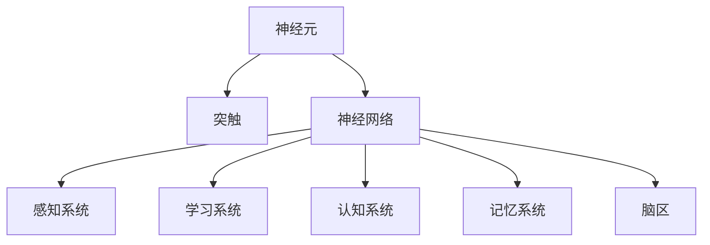

                 

# 人类大脑的综合处理能力

## 1. 背景介绍

### 1.1 问题由来
人类大脑是地球上最复杂的生物器官之一，具有卓越的感知、思考、学习和适应能力。其复杂性和高效性吸引了众多研究者的关注，而关于人类大脑的综合处理能力的探索，更是成为了认知科学和神经科学的重点研究领域。

### 1.2 问题核心关键点
人类大脑的综合处理能力主要体现在以下几个方面：

1. **信息处理速度**：大脑能够处理和分析海量数据，实现快速反应和决策。
2. **多感官整合**：大脑能够整合视觉、听觉、触觉等多感官信息，形成完整的感知体验。
3. **学习与记忆**：大脑能够从经验中学习并长期记忆，支持智能行为的持续发展。
4. **认知与决策**：大脑具有抽象推理、规划、决策等高级认知功能。
5. **神经网络结构**：大脑的神经元网络结构和连接方式，是实现其复杂功能的基础。

### 1.3 问题研究意义
研究人类大脑的综合处理能力，对于理解智能的本质、推动人工智能的发展、改善人类生活质量具有重要意义：

1. **揭示智能本质**：通过研究大脑的认知机制，可以为人工智能的智能设计提供借鉴。
2. **提升AI技术**：借鉴人类大脑的高效信息处理能力，优化AI模型的性能和效率。
3. **改善认知障碍**：理解大脑功能障碍的机制，为疾病诊断和治疗提供新思路。
4. **推动人工智能产业化**：提升人工智能的感知、学习、决策能力，加速其在各行业的应用。

## 2. 核心概念与联系

### 2.1 核心概念概述

为更好地理解人类大脑的综合处理能力，本节将介绍几个密切相关的核心概念：

- **神经元(Neuron)**：大脑的基本功能单元，负责接收、处理和传递信息。
- **突触(Synapse)**：神经元之间的连接点，信息传递的重要介质。
- **神经网络(Neural Network)**：多个神经元通过突触连接形成的复杂网络，是大脑信息处理的核心。
- **感知系统(Sensory System)**：包括视觉、听觉、触觉等系统，负责收集和初步处理外界信息。
- **学习系统(Learning System)**：通过经验更新神经元连接权重，实现信息记忆和模式识别。
- **认知系统(Cognitive System)**：负责高级认知任务，如推理、规划、决策等。
- **记忆系统(Memory System)**：存储和检索长期记忆，支持认知任务的执行。
- **脑区(Brain Area)**：大脑中不同的功能区域，如视觉皮层、运动皮层、语言区等。

这些核心概念之间的逻辑关系可以通过以下Mermaid流程图来展示：



这个流程图展示了大脑核心概念及其之间的关系：

1. 神经元通过突触连接形成神经网络，是大脑信息处理的基本单元。
2. 神经网络通过感知系统收集外界信息，并传递到学习系统和认知系统。
3. 学习系统通过突触权重调整，实现信息记忆和模式识别。
4. 认知系统负责高级认知任务，如推理、规划、决策等。
5. 记忆系统存储和检索长期记忆，支持认知任务的执行。
6. 大脑中的不同脑区分别负责不同的功能模块。

这些概念共同构成了大脑的综合处理能力，使其能够在各种场景下高效地处理复杂信息。

## 3. 核心算法原理 & 具体操作步骤
### 3.1 算法原理概述

人类大脑的综合处理能力，本质上是通过高度并行化的神经网络结构，以及动态调整的神经元连接权重来实现的。其核心算法原理可以总结为以下几个方面：

1. **神经元激活与传递**：神经元接收输入信号，通过激活函数决定是否传递信息。
2. **突触权重调整**：学习系统通过反向传播算法，根据输入输出误差调整突触权重。
3. **多层次信息处理**：大脑通过多个层次的神经网络处理信息，从初级感知到高级认知，逐步抽象和综合。
4. **并行处理能力**：神经元之间的连接和激活是高度并行化的，使得大脑能够同时处理大量信息。
5. **分布式存储与处理**：不同脑区负责不同的功能模块，通过协同工作实现复杂处理任务。

### 3.2 算法步骤详解

基于以上原理，人类大脑的综合处理能力可以概括为以下步骤：

1. **信号输入**：感官系统将外界信息转化为电信号，传递到大脑的初级感知区。
2. **特征提取**：初级感知区对信号进行初步处理，提取基本特征。
3. **信息传递**：处理后的信号通过神经网络传递到更高层次的认知区。
4. **信息加工**：认知区对信息进行深度加工，形成高级认知和决策。
5. **长期记忆**：重要信息被存储到记忆系统，支持后续认知任务的执行。
6. **信息输出**：认知系统将决策结果转化为行为反应，输出到外界。

### 3.3 算法优缺点

人类大脑的综合处理能力具有以下优点：

1. **高效的信息处理**：高度并行化的神经网络结构和动态调整的权重，使得大脑能够快速处理大量信息。
2. **全面的感知能力**：多感官整合能力使得大脑能够形成完整的感知体验。
3. **持续的学习与适应**：学习系统和记忆系统的协同工作，使得大脑能够不断适应环境变化。
4. **高级的认知功能**：认知系统的抽象推理、规划、决策等能力，支持复杂的智能行为。
5. **高度的分布式处理**：不同脑区负责不同的功能模块，实现复杂的综合处理任务。

同时，该能力也存在一些局限性：

1. **能量消耗高**：神经元的高频激活和突触的频繁连接需要大量能量，易导致疲劳。
2. **处理速度有限**：尽管大脑能够快速处理信息，但仍然受到生理限制，处理速度有限。
3. **鲁棒性不足**：对损伤和干扰的敏感性较高，容易影响信息处理和认知功能。
4. **局限的输入输出**：感官系统和运动系统的输入输出范围有限，影响复杂场景下的信息处理。
5. **感知偏差**：感官系统可能存在感知偏差，影响信息准确性和处理效果。

尽管存在这些局限性，但人类大脑的综合处理能力仍然是生物界的巅峰之作，其高效性、全面性和复杂性令人叹为观止。

### 3.4 算法应用领域

人类大脑的综合处理能力在多个领域中得到了广泛应用，具体如下：

1. **感知与交互**：视觉皮层和听觉皮层负责处理视觉和听觉信息，支持人类的日常感知和交互。
2. **学习与记忆**：学习系统和记忆系统支持经验积累和长期记忆，使得人类能够不断学习新知识。
3. **认知与决策**：认知系统负责高级认知任务，如推理、规划、决策等，支持复杂行为执行。
4. **语言处理**：语言区负责语言理解和生成，使得人类能够进行复杂的交流和沟通。
5. **情感处理**：边缘系统和杏仁核负责情感调节，支持情绪管理和社会行为。
6. **运动控制**：运动皮层和基底神经节负责运动控制，支持精细的运动协调和执行。

## 4. 数学模型和公式 & 详细讲解 & 举例说明

### 4.1 数学模型构建

本节将使用数学语言对人类大脑的综合处理能力进行更加严格的刻画。

记神经元 $i$ 的激活函数为 $\sigma_i$，输入信号为 $\vec{x}$，突触权重为 $\vec{w}$，则神经元 $i$ 的输出信号 $y_i$ 可以表示为：

$$
y_i = \sigma_i(\vec{w} \cdot \vec{x})
$$

其中 $\sigma_i$ 为激活函数，如Sigmoid、ReLU等。神经元之间的连接权重 $\vec{w}$ 可以通过反向传播算法进行动态调整。

### 4.2 公式推导过程

以下我们以神经网络模型为例，推导其计算公式。

假设神经网络包含 $L$ 个层次，其中 $l$ 层有 $n_l$ 个神经元，输入为 $n_0$ 维的向量 $\vec{x}$，输出为 $n_L$ 维的向量 $\vec{y}$。神经网络的前向传播过程可以表示为：

$$
\vec{y} = \sigma_L(\vec{w}_L \cdot \sigma_{L-1}(\vec{w}_{L-1} \cdot \sigma_{L-2}(\vec{w}_{L-2} \cdot \vec{x})))
$$

其中 $\vec{w}_l$ 表示 $l$ 层的突触权重矩阵，$\sigma_l$ 表示 $l$ 层的激活函数。

神经网络的反向传播算法，用于根据输出误差调整突触权重，可以表示为：

$$
\frac{\partial \mathcal{L}}{\partial \vec{w}_l} = \frac{\partial \mathcal{L}}{\partial \vec{y}} \cdot \frac{\partial \vec{y}}{\partial \vec{w}_l} = \frac{\partial \mathcal{L}}{\partial \vec{y}} \cdot \vec{y} \cdot (\frac{\partial \sigma_l}{\partial \vec{w}_l})
$$

其中 $\mathcal{L}$ 为损失函数，$\frac{\partial \sigma_l}{\partial \vec{w}_l}$ 为激活函数对突触权重的偏导数，可以通过链式法则计算得到。

### 4.3 案例分析与讲解

以视觉皮层为例，分析其信息处理过程。

1. **信号输入**：视觉皮层的初级视觉区（V1）接收来自视网膜的电信号，将其转化为神经元激活信号。
2. **特征提取**：初级视觉区对信号进行初步处理，提取基本的视觉特征，如边缘、角点等。
3. **信息传递**：处理后的信号通过神经网络传递到更高层次的认知区，如V2、V4等。
4. **信息加工**：认知区对信息进行深度加工，形成高级视觉特征，如纹理、颜色等。
5. **长期记忆**：重要信息被存储到记忆系统，支持后续认知任务的执行。
6. **信息输出**：认知系统将视觉信息转化为行为反应，如识别物体、判断方向等。

通过这些步骤，视觉皮层实现了对视觉信息的全面感知和高级处理，支持人类的视觉识别和行为决策。

## 5. 项目实践：代码实例和详细解释说明

### 5.1 开发环境搭建

在进行神经网络项目实践前，我们需要准备好开发环境。以下是使用Python进行PyTorch开发的环境配置流程：

1. 安装Anaconda：从官网下载并安装Anaconda，用于创建独立的Python环境。

2. 创建并激活虚拟环境：
```bash
conda create -n pytorch-env python=3.8 
conda activate pytorch-env
```

3. 安装PyTorch：根据CUDA版本，从官网获取对应的安装命令。例如：
```bash
conda install pytorch torchvision torchaudio cudatoolkit=11.1 -c pytorch -c conda-forge
```

4. 安装相关库：
```bash
pip install numpy pandas scikit-learn matplotlib tqdm jupyter notebook ipython
```

完成上述步骤后，即可在`pytorch-env`环境中开始神经网络项目开发。

### 5.2 源代码详细实现

这里我们以一个简单的神经网络模型为例，展示其代码实现过程。

首先，定义神经网络模型类：

```python
import torch
import torch.nn as nn
import torch.nn.functional as F

class NeuralNetwork(nn.Module):
    def __init__(self):
        super(NeuralNetwork, self).__init__()
        self.fc1 = nn.Linear(784, 128)
        self.fc2 = nn.Linear(128, 64)
        self.fc3 = nn.Linear(64, 10)
        
    def forward(self, x):
        x = F.relu(self.fc1(x))
        x = F.relu(self.fc2(x))
        x = self.fc3(x)
        return x
```

然后，定义训练和评估函数：

```python
from torch.utils.data import DataLoader
from torchvision.datasets import MNIST
from torchvision.transforms import ToTensor

# 加载MNIST数据集
train_dataset = MNIST(root='./data', train=True, transform=ToTensor(), download=True)
test_dataset = MNIST(root='./data', train=False, transform=ToTensor(), download=True)

# 创建DataLoader
train_loader = DataLoader(train_dataset, batch_size=64, shuffle=True)
test_loader = DataLoader(test_dataset, batch_size=64, shuffle=False)

# 定义损失函数和优化器
criterion = nn.CrossEntropyLoss()
optimizer = torch.optim.Adam(model.parameters(), lr=0.001)

# 定义训练函数
def train(model, train_loader, criterion, optimizer, epochs):
    for epoch in range(epochs):
        for batch_idx, (data, target) in enumerate(train_loader):
            optimizer.zero_grad()
            output = model(data)
            loss = criterion(output, target)
            loss.backward()
            optimizer.step()
            
        print(f'Epoch {epoch+1}, loss: {loss.item()}')

# 定义评估函数
def evaluate(model, test_loader, criterion):
    correct = 0
    total = 0
    with torch.no_grad():
        for data, target in test_loader:
            output = model(data)
            _, predicted = torch.max(output.data, 1)
            total += target.size(0)
            correct += (predicted == target).sum().item()
            
    print(f'Accuracy: {100 * correct / total}%')

# 训练模型
model = NeuralNetwork()
train(model, train_loader, criterion, optimizer, epochs=10)
evaluate(model, test_loader, criterion)
```

以上就是使用PyTorch构建神经网络模型的完整代码实现。可以看到，由于PyTorch的灵活性和易用性，构建和训练神经网络模型变得非常简单。

### 5.3 代码解读与分析

让我们再详细解读一下关键代码的实现细节：

**NeuralNetwork类**：
- `__init__`方法：初始化神经网络结构，包含三个全连接层。
- `forward`方法：定义神经网络的前向传播过程，通过ReLU激活函数和线性层进行逐层处理。

**训练函数**：
- `train`函数：对训练集数据进行迭代训练，使用Adam优化器进行参数更新，计算并输出损失值。

**评估函数**：
- `evaluate`函数：对测试集数据进行迭代评估，计算模型的准确率。

**训练流程**：
- 定义总迭代次数`epochs`和批次大小`batch_size`，启动模型训练循环。
- 在每个epoch中，遍历训练集数据，进行前向传播和反向传播，更新模型参数。
- 在训练结束后，调用评估函数，输出测试集上的准确率。

可以看到，神经网络模型的代码实现非常简洁高效，利用PyTorch的封装能力，开发者可以更快地进行模型迭代和调试。

当然，工业级的系统实现还需考虑更多因素，如模型的保存和部署、超参数的自动搜索、更灵活的网络结构设计等。但核心的神经网络建模和训练流程，基本与此类似。

## 6. 实际应用场景
### 6.1 智能机器人

基于神经网络的智能机器人系统，可以实现复杂的环境感知和行为决策。通过多传感器的输入，智能机器人能够进行目标检测、路径规划、运动控制等任务。

在技术实现上，可以构建深度神经网络模型，通过摄像头、激光雷达等传感器采集环境信息，经过特征提取和处理，传递到神经网络进行决策，最终生成控制命令。通过微调和训练，使得智能机器人能够适应复杂多变的场景，实现高效的导航和交互。

### 6.2 自动驾驶

自动驾驶系统需要实现对道路环境的精确感知和决策，以确保行车安全和高效。基于神经网络的自动驾驶系统，可以通过摄像头、雷达、激光雷达等传感器获取周围环境信息，并进行实时处理和决策。

在技术实现上，可以构建多模态感知网络，通过视觉、雷达、激光雷达等多种传感器输入，实现多传感器信息融合，生成高精度的环境地图。通过训练神经网络模型，实现对车道线、交通标志、行人的精确检测和行为预测，生成最优的行车决策，支持自动驾驶系统的安全稳定运行。

### 6.3 医疗影像分析

医疗影像分析是神经网络在医疗领域的重要应用之一。通过训练神经网络模型，可以实现对CT、MRI等影像数据的自动分析和诊断，支持医生的诊断和治疗。

在技术实现上，可以构建卷积神经网络模型，对医学影像进行特征提取和分类。通过大量的标注数据进行训练，使得模型能够学习到影像中重要的特征和模式，实现对肿瘤、病灶等关键区域的定位和分析。在实际应用中，医生可以通过输入医学影像，得到神经网络自动生成的诊断结果，提高诊断效率和准确性。

### 6.4 自然语言处理

神经网络在自然语言处理领域也得到了广泛应用，如机器翻译、文本分类、情感分析等。通过训练神经网络模型，可以实现对自然语言的高效处理和理解，支持智能语音助手、智能客服等应用。

在技术实现上，可以构建基于Transformer的神经网络模型，对输入文本进行编码和解码。通过大量的标注数据进行训练，使得模型能够学习到语言中的语法和语义规则，实现对自然语言的准确理解和生成。在实际应用中，通过构建多任务学习模型，可以实现跨任务的迁移学习和多模态信息融合，提升模型的通用性和鲁棒性。

## 7. 工具和资源推荐
### 7.1 学习资源推荐

为了帮助开发者系统掌握神经网络的理论基础和实践技巧，这里推荐一些优质的学习资源：

1. 《深度学习》系列书籍：由著名深度学习专家Ian Goodfellow、Yoshua Bengio、Aaron Courville合著，全面介绍了深度学习的理论基础和实践技巧。

2. CS231n《卷积神经网络》课程：斯坦福大学开设的计算机视觉课程，详细讲解了卷积神经网络的原理和应用。

3. Deep Learning Specialization：由深度学习领域的权威人士Andrew Ng教授开设的在线课程，涵盖深度学习的基础理论和实践应用。

4. Udacity的深度学习纳米学位：提供从基础到高级的深度学习课程，包括神经网络、卷积神经网络、循环神经网络等。

5. Google TensorFlow官方文档：TensorFlow的官方文档，提供了丰富的教程和样例代码，适合快速上手深度学习框架。

6. PyTorch官方文档：PyTorch的官方文档，提供了详细的API说明和样例代码，适合使用PyTorch进行深度学习开发。

通过对这些资源的学习实践，相信你一定能够快速掌握神经网络的理论基础和实践技巧，并用于解决实际的机器学习问题。

### 7.2 开发工具推荐

高效的开发离不开优秀的工具支持。以下是几款用于神经网络开发的常用工具：

1. PyTorch：基于Python的开源深度学习框架，灵活的动态图设计，适合快速迭代研究。

2. TensorFlow：由Google主导开发的开源深度学习框架，生产部署方便，适合大规模工程应用。

3. Keras：高级神经网络API，封装了TensorFlow、Theano等底层框架，适合快速开发和实验。

4. Jupyter Notebook：交互式编程环境，适合进行数据分析、模型训练和可视化。

5. Visual Studio Code：轻量级的IDE，支持Python等编程语言，提供丰富的插件和扩展。

6. Git和GitHub：版本控制和代码托管平台，支持多人协作开发和代码共享。

合理利用这些工具，可以显著提升神经网络开发的效率，加快创新迭代的步伐。

### 7.3 相关论文推荐

神经网络的研究源于学界的持续研究。以下是几篇奠基性的相关论文，推荐阅读：

1. Deep Blue Book《深度学习》：Ian Goodfellow、Yoshua Bengio、Aaron Courville合著，全面介绍了深度学习的理论基础和实践技巧。

2. AlexNet：Hinton等人提出的深度卷积神经网络，在2012年ImageNet图像识别比赛中取得突破性成绩，标志着深度学习时代的到来。

3. ResNet：He等人提出的残差网络，通过残差连接解决了深度神经网络的退化问题，使得更深的网络结构成为可能。

4. LSTM：Hochreiter和Schmidhuber提出的长短期记忆网络，通过门控机制实现了对时间序列数据的建模，支持序列预测和分类任务。

5. Transformer：Vaswani等人提出的自注意力机制，实现了对自然语言的准确理解和生成，推动了自然语言处理领域的发展。

6. GAN：Goodfellow等人提出的生成对抗网络，通过对抗训练实现了对真实数据的逼真生成，在图像生成、语音合成等领域取得了重要进展。

这些论文代表了大神经网络的研究脉络。通过学习这些前沿成果，可以帮助研究者把握学科前进方向，激发更多的创新灵感。

## 8. 总结：未来发展趋势与挑战

### 8.1 总结

本文对人类大脑的综合处理能力进行了全面系统的介绍。首先阐述了神经元、突触、神经网络等核心概念，明确了神经网络的信息处理机制。其次，从原理到实践，详细讲解了神经网络的计算公式和训练流程，给出了神经网络项目开发的完整代码实例。同时，本文还广泛探讨了神经网络在智能机器人、自动驾驶、医疗影像分析、自然语言处理等多个领域的应用前景，展示了神经网络范式的巨大潜力。此外，本文精选了神经网络学习的各类资源，力求为读者提供全方位的技术指引。

通过本文的系统梳理，可以看到，神经网络在信息处理、感知、决策等方面具有卓越的能力，是实现人工智能的核心技术之一。其高效的并行计算能力和动态权重调整机制，使其能够适应复杂的任务需求。未来，伴随神经网络技术的不断演进，其在各领域的深度融合和应用将为人类社会的进步带来深远影响。

### 8.2 未来发展趋势

展望未来，神经网络技术将呈现以下几个发展趋势：

1. **模型规模持续增大**：随着算力成本的下降和数据规模的扩张，神经网络模型的参数量还将持续增长。超大规模神经网络将实现更广泛的数据整合和知识迁移。

2. **深度学习范式的多样化**：未来将涌现更多深度学习范式，如自监督学习、生成对抗网络、神经网络进化等，拓展神经网络的模型结构和训练方法。

3. **多模态信息融合**：神经网络将更多地融合多模态信息，如视觉、听觉、触觉等，实现全面的感知和理解。

4. **分布式计算**：神经网络将更多地采用分布式计算方式，提升模型的训练和推理速度，支持大规模数据处理。

5. **迁移学习和零样本学习**：神经网络将更多地采用迁移学习和零样本学习方法，实现模型的跨领域迁移和快速适应。

6. **解释性和可解释性**：神经网络将更多地注重模型的可解释性和透明性，支持人类对模型的理解和使用。

以上趋势凸显了神经网络技术的广阔前景。这些方向的探索发展，必将进一步提升神经网络模型的性能和应用范围，为构建更强大、更智能的AI系统铺平道路。

### 8.3 面临的挑战

尽管神经网络技术已经取得了瞩目成就，但在迈向更加智能化、普适化应用的过程中，它仍面临诸多挑战：

1. **模型复杂度高**：神经网络模型的参数量庞大，训练和推理过程复杂，易出现梯度消失和过拟合等问题。

2. **数据依赖性高**：神经网络需要大量标注数据进行训练，标注成本高且数据分布有限，影响模型的泛化能力。

3. **计算资源消耗大**：神经网络的计算复杂度高，训练和推理过程需要高性能计算资源，硬件成本高昂。

4. **模型鲁棒性不足**：神经网络对输入数据的变化敏感，易受到噪声和干扰的影响，导致模型性能下降。

5. **可解释性差**：神经网络往往被视为"黑盒"模型，难以解释其决策过程和输出结果，影响模型的可信任度和应用场景。

6. **数据隐私和安全**：神经网络处理大量数据，数据隐私和安全问题亟待解决，避免数据泄露和滥用。

正视神经网络面临的这些挑战，积极应对并寻求突破，将是神经网络技术不断进步的关键。相信随着学界和产业界的共同努力，这些挑战终将一一被克服，神经网络技术必将迎来更加辉煌的未来。

### 8.4 研究展望

面对神经网络技术面临的挑战，未来的研究需要在以下几个方面寻求新的突破：

1. **模型压缩与优化**：开发更加高效和轻量级的神经网络模型，减少计算资源消耗，提升模型的实时性。

2. **自监督学习**：利用无监督学习任务，减少对标注数据的依赖，实现更加灵活高效的神经网络训练。

3. **神经网络进化**：研究神经网络的进化机制，实现模型的动态生成和演化，增强模型的自适应能力和鲁棒性。

4. **多模态信息融合**：融合视觉、听觉、触觉等多模态信息，实现全面的感知和理解，支持复杂的智能行为。

5. **解释性和可解释性**：开发可解释性神经网络，增强模型的透明性和解释能力，支持人类对模型的理解和调试。

6. **数据隐私和安全**：研究数据隐私保护技术，支持神经网络的公平、透明和可信任应用。

这些研究方向的探索，必将引领神经网络技术迈向更高的台阶，为构建安全、可靠、可解释、可控的智能系统铺平道路。面向未来，神经网络技术还需要与其他人工智能技术进行更深入的融合，如知识表示、因果推理、强化学习等，多路径协同发力，共同推动人工智能技术的进步。只有勇于创新、敢于突破，才能不断拓展神经网络模型的边界，让智能技术更好地造福人类社会。

## 9. 附录：常见问题与解答

**Q1：神经网络中的激活函数有哪些？**

A: 神经网络中的激活函数包括Sigmoid、ReLU、Tanh等，其中ReLU是目前最常用的激活函数。Sigmoid函数具有平滑的输出特性，但梯度消失问题严重。ReLU函数具有非线性特性，能够更好地处理数据分布。Tanh函数具有中心化的输出特性，但存在梯度消失问题。

**Q2：如何避免神经网络的过拟合问题？**

A: 神经网络中的过拟合问题可以通过以下方法缓解：
1. 数据增强：通过旋转、裁剪、翻转等方式扩充训练集。
2. 正则化：使用L2正则、Dropout等方法，防止模型复杂度过高。
3. 早停机制：设置早停阈值，及时停止训练，避免过拟合。
4. 批标准化：使用批标准化技术，稳定模型的训练过程。
5. 模型简化：减少模型的复杂度，避免过度拟合。

**Q3：神经网络的训练过程中，如何选择合适的网络结构？**

A: 神经网络的结构选择取决于具体的任务需求和数据特征。常用的神经网络结构包括全连接网络、卷积神经网络、循环神经网络等。对于图像处理任务，卷积神经网络表现优异；对于序列数据处理任务，循环神经网络和Transformer网络表现较好。在实际应用中，可以通过实验和比较，选择最适合的网络结构。

**Q4：神经网络中的梯度消失和梯度爆炸问题如何缓解？**

A: 神经网络中的梯度消失和梯度爆炸问题可以通过以下方法缓解：
1. 梯度裁剪：限制梯度的大小，防止梯度爆炸。
2. 梯度累积：使用梯度累积技术，减小梯度消失问题。
3. 残差连接：通过残差连接技术，加速梯度传播。
4. 梯度衰减：使用梯度衰减技术，防止梯度爆炸。
5. 学习率调整：通过调整学习率，防止梯度消失和梯度爆炸。

**Q5：神经网络中的迁移学习如何实现？**

A: 神经网络中的迁移学习可以通过以下步骤实现：
1. 在预训练任务上训练一个基模型，如ImageNet分类任务。
2. 选择与新任务相似的任务，进行微调训练，如在COCO数据集上微调ImageNet预训练的模型。
3. 在新任务上进行评估，根据性能调整微调参数，实现新任务的适应。
4. 在新任务上继续微调训练，提升模型的泛化能力。

通过这些步骤，神经网络可以实现跨领域的迁移学习和知识迁移，提升模型在新任务上的表现。

---

作者：禅与计算机程序设计艺术 / Zen and the Art of Computer Programming

