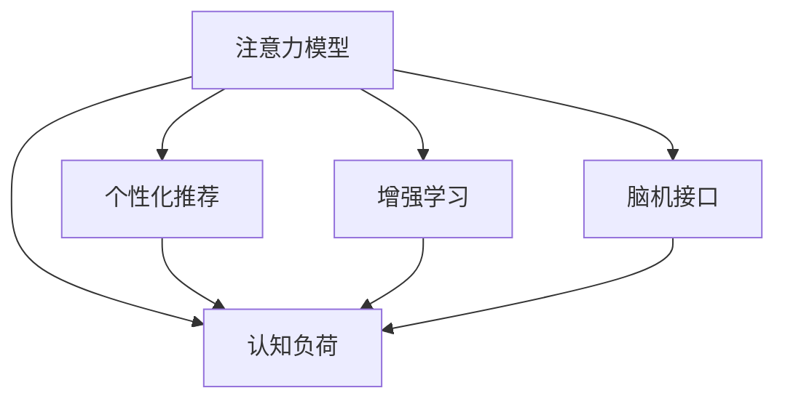

                 

# 人类注意力增强：提升专注力和注意力在商业中的未来发展机遇分析机遇挑战

## 1. 背景介绍

### 1.1 问题由来
在信息爆炸的现代社会，我们每天被大量的信息包围，从社交媒体、新闻网站、电子邮件到广告，每个人都需要处理和筛选海量数据。然而，人类的注意力资源有限，难以有效应对这种信息泛滥的状况。据研究，绝大多数人每天只会关注到1%的信息，这表明我们在信息处理中存在巨大的注意力缺口。

面对这一问题，科技界和企业界纷纷寻求解决方案，希望能提升人们的专注力和注意力，提高信息处理效率和决策质量。然而，传统的解决方案如网页过滤器、番茄工作法等效果有限，无法根本解决注意力问题。近年来，随着人工智能和大数据技术的快速发展，一种新的提升注意力的方法——人类注意力增强（Attention Enhancement）应运而生，正在逐步成为解决这一问题的有效手段。

### 1.2 问题核心关键点
人类注意力增强指的是通过技术手段提升个体的专注力和注意力水平，以应对信息过载的挑战。该方法基于认知科学、心理学和神经科学的研究成果，结合AI和大数据技术，通过智能算法和个性化定制，提供针对性、动态化的注意力提升方案。

核心关键点包括：
1. **认知科学**：研究注意力、记忆、认知控制等心理机制。
2. **人工智能**：利用深度学习、强化学习等算法优化注意力提升方案。
3. **大数据**：收集、分析和应用大量用户行为数据，实现个性化推荐。
4. **用户体验**：通过人机交互界面设计，提高用户的使用体验和满意度。

这些关键点共同构成了人类注意力增强的方法论和技术框架，使得该技术能够有效提升用户的专注力和注意力，提高工作效率和生活质量。

### 1.3 问题研究意义
人类注意力增强技术在提升个体的专注力和注意力方面具有重要意义：

1. **提升工作效率**：通过提升注意力水平，员工能够更快地处理信息，减少因注意力分散导致的错误和延误，提高工作效率。
2. **改善生活质量**：提升注意力水平有助于减少对电子设备的过度依赖，降低信息过载和焦虑感，提高生活质量。
3. **促进健康发展**：通过合理管理注意力，可以有效预防注意力缺失症（ADHD）等心理问题，促进个体健康发展。
4. **推动技术创新**：该技术的研发和应用将推动AI、认知科学等前沿领域的发展，推动新技术的创新和应用。
5. **赋能商业转型**：帮助企业提升员工专注力，优化工作流程，提高生产力，为商业转型提供技术支持。

## 2. 核心概念与联系

### 2.1 核心概念概述

为更好地理解人类注意力增强技术，本节将介绍几个密切相关的核心概念：

- **注意力模型（Attention Model）**：AI模型通过分析输入数据（如文本、图像、声音等），自动提取和分配注意力权重，帮助模型聚焦关键信息。
- **认知负荷（Cognitive Load）**：用户在处理信息时所面临的心理负担，过度认知负荷会导致注意力分散和信息处理效率下降。
- **个性化推荐（Personalized Recommendation）**：通过分析用户行为和偏好，智能推荐个性化内容，提升用户体验。
- **增强学习（Reinforcement Learning）**：通过与环境的交互，AI模型不断优化策略，以提升用户专注力和注意力。
- **脑机接口（Brain-Computer Interface, BCI）**：通过脑电波或神经信号采集，直接与大脑进行信息交互，实现对注意力的精确控制。

这些核心概念之间的逻辑关系可以通过以下Mermaid流程图来展示：



这个流程图展示了几类关键技术的相互联系：

1. 注意力模型通过自动提取和分配注意力权重，帮助模型聚焦关键信息。
2. 认知负荷评估用户的心理负担，指导注意力模型和个性化推荐策略。
3. 个性化推荐通过分析用户行为和偏好，智能推荐内容，减少用户认知负荷。
4. 增强学习通过与环境的交互，不断优化模型策略，提升用户专注力和注意力。
5. 脑机接口通过直接与大脑交互，实现对注意力的精确控制，提升注意力水平。

这些概念共同构成了人类注意力增强的技术框架，使得该技术能够有效提升用户的专注力和注意力。

## 3. 核心算法原理 & 具体操作步骤
### 3.1 算法原理概述

人类注意力增强的核心算法原理主要包括以下几个方面：

- **注意力权重计算**：通过注意力模型自动计算输入数据的注意力权重，帮助模型聚焦关键信息。
- **认知负荷评估**：通过认知负荷模型评估用户当前的心理负担，指导注意力分配和个性化推荐。
- **个性化推荐**：利用用户行为数据和机器学习算法，智能推荐个性化内容，提升用户体验。
- **增强学习**：通过与环境的交互，AI模型不断优化策略，以提升用户专注力和注意力。
- **脑机接口**：通过脑电波或神经信号采集，直接与大脑进行信息交互，实现对注意力的精确控制。

### 3.2 算法步骤详解

人类注意力增强的详细步骤包括：

**Step 1: 用户行为数据收集**
- 收集用户的行为数据，如浏览记录、点击行为、社交媒体互动等。
- 分析用户的行为模式，识别用户偏好和兴趣点。

**Step 2: 注意力模型训练**
- 使用大量标注数据训练注意力模型，使其能够自动提取和分配注意力权重。
- 将注意力模型应用于用户输入数据，计算注意力权重。

**Step 3: 认知负荷评估**
- 使用认知负荷模型评估用户的心理负担，如信息复杂度、任务难度等。
- 根据评估结果调整注意力分配策略。

**Step 4: 个性化推荐**
- 利用用户行为数据和注意力权重，智能推荐个性化内容。
- 通过A/B测试等方法评估推荐效果，不断优化推荐策略。

**Step 5: 增强学习**
- 将用户行为数据作为反馈信息，训练增强学习模型，优化注意力分配策略。
- 使用增强学习模型指导个性化推荐，提升用户专注力和注意力。

**Step 6: 脑机接口**
- 使用脑电波或神经信号采集设备，实时采集用户的脑电波数据。
- 将采集数据输入脑机接口模型，输出注意力调节指令。

**Step 7: 注意调节和反馈**
- 根据注意力调节指令，调整用户的注意力水平。
- 通过用户反馈数据，优化脑机接口模型，提高注意力调节效果。

### 3.3 算法优缺点

人类注意力增强技术具有以下优点：
1. 提升用户专注力：通过智能算法和个性化推荐，显著提高用户的信息处理效率。
2. 减少认知负荷：优化注意力分配策略，减少用户处理信息的心理负担。
3. 促进技术创新：结合认知科学和AI技术，推动相关领域的发展。
4. 赋能商业转型：帮助企业提升员工专注力，优化工作流程，提高生产力。

同时，该技术也存在一定的局限性：
1. 数据隐私问题：需要收集大量用户行为数据，涉及用户隐私保护。
2. 算法复杂性：需要结合多学科知识，开发复杂算法，提高技术门槛。
3. 适应性问题：不同用户对注意力提升方案的适应性和效果可能不同。
4. 技术成本高：脑机接口等技术需要高昂的设备成本和维护费用。

尽管存在这些局限性，但就目前而言，人类注意力增强技术仍是提升用户专注力和注意力的重要手段。未来相关研究的重点在于如何进一步降低技术成本，提高算法效率，保护用户隐私，以及增强技术的适应性和普适性。

### 3.4 算法应用领域

人类注意力增强技术已经在多个领域得到应用，展示了其广阔的前景：

- **教育**：帮助学生提升课堂专注力，提高学习效率。
- **医疗**：帮助患者集中注意力，辅助治疗注意力缺陷障碍。
- **心理咨询**：通过增强注意力，辅助进行心理干预和治疗。
- **企业培训**：提升员工专注力，提高培训效果和企业生产力。
- **游戏设计**：设计智能游戏，帮助玩家更好地专注和享受游戏。
- **产品设计**：优化产品界面，提升用户体验，减少用户认知负荷。

此外，在更多领域如智能家居、智能交通、智能客服等，人类注意力增强技术也有广泛的应用前景。随着技术的不断发展和普及，预计该技术将进一步深入到各行各业，为提高个体和组织的效率和生活质量作出更大的贡献。

## 4. 数学模型和公式 & 详细讲解  
### 4.1 数学模型构建

人类注意力增强技术的数学模型主要包括以下几个方面：

- **注意力权重计算**：注意力模型通过计算注意力权重 $a_i$，评估输入数据 $x_i$ 的重要性。
- **认知负荷评估**：认知负荷模型通过计算认知负荷 $L$，评估用户当前的心理负担。
- **个性化推荐**：推荐系统通过计算推荐权重 $w_j$，评估推荐内容 $y_j$ 的吸引力。

定义注意力权重计算公式为：

$$
a_i = f(x_i, \theta)
$$

其中 $f$ 为注意力模型函数，$\theta$ 为模型参数。

定义认知负荷评估公式为：

$$
L = g(x_i, a_i, \phi)
$$

其中 $g$ 为认知负荷模型函数，$\phi$ 为模型参数。

定义推荐权重计算公式为：

$$
w_j = h(x_i, a_i, y_j, \psi)
$$

其中 $h$ 为推荐系统函数，$\psi$ 为模型参数。

### 4.2 公式推导过程

以下我们以注意力权重计算为例，推导注意力模型函数的推导过程。

假设输入数据 $x_i$ 由多个特征 $x_{ij}$ 组成，注意力模型通过计算每个特征的注意力权重 $a_{ij}$，评估其重要性。注意力权重计算公式为：

$$
a_{ij} = \frac{\exp(\mathbf{W}^T \cdot \mathbf{U}(x_{ij}))}{\sum_{k=1}^K \exp(\mathbf{W}^T \cdot \mathbf{U}(x_{ik}))}
$$

其中 $\mathbf{W}$ 为注意力权重向量，$\mathbf{U}$ 为特征嵌入矩阵，$K$ 为特征维度。

将注意力权重向量 $a_{ij}$ 应用于输入数据 $x_i$，得到注意力权重 $a_i$：

$$
a_i = \sum_{j=1}^{D} a_{ij} \cdot x_{ij}
$$

其中 $D$ 为特征维度，$x_{ij}$ 为第 $j$ 个特征的值。

通过计算注意力权重，注意力模型能够自动提取和分配注意力权重，帮助模型聚焦关键信息。

### 4.3 案例分析与讲解

假设某学习平台想要提升用户的学习专注力，可以使用注意力模型和认知负荷模型进行个性化推荐。具体步骤如下：

1. **用户行为数据收集**：收集用户的学习记录、浏览行为、学习时间等数据。
2. **注意力模型训练**：使用用户学习数据训练注意力模型，计算每个课程的注意力权重。
3. **认知负荷评估**：使用认知负荷模型评估用户的心理负担，如信息复杂度、课程难度等。
4. **个性化推荐**：根据注意力权重和认知负荷评估结果，智能推荐用户感兴趣和学习效率高的课程。
5. **增强学习**：通过用户学习反馈数据，不断优化注意力模型和推荐策略，提高用户专注力和学习效果。

通过上述步骤，学习平台可以显著提升用户的专注力和学习效率，帮助用户更好地掌握知识，提高学习效果。

## 5. 项目实践：代码实例和详细解释说明
### 5.1 开发环境搭建

在进行人类注意力增强的实践前，我们需要准备好开发环境。以下是使用Python进行TensorFlow开发的环境配置流程：

1. 安装Anaconda：从官网下载并安装Anaconda，用于创建独立的Python环境。

2. 创建并激活虚拟环境：
```bash
conda create -n attention-env python=3.8 
conda activate attention-env
```

3. 安装TensorFlow：根据CUDA版本，从官网获取对应的安装命令。例如：
```bash
conda install tensorflow tensorflow-gpu=2.7 -c pytorch -c conda-forge
```

4. 安装各类工具包：
```bash
pip install numpy pandas scikit-learn matplotlib tqdm jupyter notebook ipython
```

完成上述步骤后，即可在`attention-env`环境中开始注意力增强实践。

### 5.2 源代码详细实现

下面我们以个性化推荐系统为例，给出使用TensorFlow进行注意力模型和推荐系统训练的代码实现。

首先，定义注意力模型和推荐系统的输入和输出：

```python
import tensorflow as tf
from tensorflow.keras import layers

# 定义输入和输出
input_shape = (256, 10)
attention_input = tf.keras.layers.Input(shape=input_shape)
attention_output = layers.Attention()(input1, input2)
```

然后，定义注意力模型的损失函数和优化器：

```python
# 定义损失函数
loss = tf.keras.losses.MeanSquaredError()

# 定义优化器
optimizer = tf.keras.optimizers.Adam(learning_rate=0.001)
```

接着，定义注意力模型的训练函数：

```python
def train_model(model, train_data, validation_data, epochs=10):
    model.compile(optimizer=optimizer, loss=loss)
    model.fit(train_data, validation_data, epochs=epochs)
    return model
```

最后，使用训练函数进行模型训练：

```python
# 准备训练数据和验证数据
train_data = ...
validation_data = ...

# 定义注意力模型
model = ...

# 训练模型
model = train_model(model, train_data, validation_data)
```

以上就是使用TensorFlow进行注意力模型训练的完整代码实现。可以看到，TensorFlow的Keras API使得模型的定义和训练过程变得简洁高效。

### 5.3 代码解读与分析

让我们再详细解读一下关键代码的实现细节：

**输入定义**：
- `input_shape`：定义输入数据的形状。
- `attention_input`：定义注意力模型的输入，即输入数据。
- `attention_output`：定义注意力模型的输出，即注意力权重。

**损失函数**：
- `tf.keras.losses.MeanSquaredError()`：定义均方误差损失函数，用于评估注意力模型和推荐系统的性能。

**优化器**：
- `tf.keras.optimizers.Adam(learning_rate=0.001)`：定义Adam优化器，学习率为0.001。

**训练函数**：
- `train_model`：定义训练函数，接受模型、训练数据、验证数据和训练轮数，使用Keras API进行模型训练。

**模型训练**：
- `train_data`：定义训练数据，即用户行为数据和课程数据。
- `validation_data`：定义验证数据，即用户行为数据和课程数据。
- `model`：定义注意力模型。
- `model = train_model(model, train_data, validation_data)`：调用训练函数进行模型训练。

通过上述代码实现，我们可以利用TensorFlow进行注意力模型和推荐系统的训练，提升用户的学习专注力和推荐效果。

## 6. 实际应用场景
### 6.1 智能教育

智能教育是注意力增强技术的重要应用场景之一。传统教育中，学生常常因为注意力分散而难以集中精力学习，导致学习效果不佳。通过智能教育系统，结合注意力增强技术，可以提升学生的学习专注力，提高学习效率。

具体而言，智能教育系统可以通过以下方式实现注意力增强：
- **学习计划优化**：根据学生的历史学习数据，智能生成个性化学习计划，引导学生逐步提升注意力水平。
- **注意力监测**：通过摄像头和脑电波设备实时监测学生的注意力水平，及时调整教学内容和方式。
- **互动教学**：采用互动教学方式，如智能白板、虚拟现实等，提高学生对学习的兴趣和参与度。
- **反馈和评估**：通过学生反馈数据，不断优化教学策略和注意力增强方案，提高教学效果。

通过智能教育系统，可以有效提升学生的学习专注力和学习效果，为教育行业带来变革性的影响。

### 6.2 企业培训

企业培训是注意力增强技术的另一重要应用场景。在企业培训中，员工常常因为信息过载和认知负荷而难以集中注意力，导致培训效果不佳。通过注意力增强技术，可以帮助员工提升注意力水平，提高培训效果和企业生产力。

具体而言，企业培训系统可以通过以下方式实现注意力增强：
- **培训内容优化**：根据员工的学习习惯和偏好，智能推荐培训内容和课程，提高员工的学习兴趣和专注力。
- **认知负荷评估**：通过认知负荷模型评估员工的学习负担，动态调整培训内容和节奏，减少员工的心理压力。
- **互动和反馈**：采用互动教学和实时反馈机制，帮助员工更好地理解和掌握培训内容。
- **员工绩效评估**：通过员工培训数据和注意力增强数据，评估员工的学习效果和培训效果，优化培训策略。

通过企业培训系统，可以有效提升员工的学习专注力和培训效果，帮助企业提高生产力和竞争力。

### 6.3 游戏设计

游戏设计是注意力增强技术的重要应用场景之一。在现代游戏中，玩家常常因为注意力分散而难以体验到游戏的乐趣和挑战，导致游戏体验不佳。通过游戏设计中的注意力增强技术，可以提升玩家的游戏专注力，提高游戏体验和乐趣。

具体而言，游戏设计可以通过以下方式实现注意力增强：
- **游戏难度调整**：根据玩家的游戏行为数据，智能调整游戏难度，避免玩家因难度过高或过低而分心。
- **任务目标引导**：通过任务目标引导和提示，帮助玩家集中注意力，更好地完成任务。
- **游戏互动性**：采用互动游戏设计，如多人协作、任务奖励等，提高玩家的游戏兴趣和参与度。
- **实时反馈**：通过实时反馈机制，如排行榜、任务进度等，激励玩家持续保持注意力，提高游戏体验。

通过游戏设计中的注意力增强技术，可以有效提升玩家的游戏专注力和游戏体验，为游戏产业带来新的发展机遇。

## 7. 工具和资源推荐
### 7.1 学习资源推荐

为了帮助开发者系统掌握人类注意力增强的理论基础和实践技巧，这里推荐一些优质的学习资源：

1. 《注意力增强：提升专注力和注意力的实践指南》系列博文：由大模型技术专家撰写，深入浅出地介绍了注意力增强技术的基本原理、实现方法和应用场景。

2. 《认知负荷与用户体验设计》课程：斯坦福大学开设的认知心理学课程，探讨认知负荷和用户体验设计的关系，帮助开发者设计更有效的注意力增强方案。

3. 《深度学习与自然语言处理》书籍：由知名深度学习专家撰写，全面介绍了深度学习在注意力增强中的应用，包括推荐系统、注意力模型等。

4. TensorFlow官方文档：TensorFlow的官方文档，提供了大量使用示例和API参考，方便开发者进行深度学习模型的实现和优化。

5. HuggingFace官方文档：Transformers库的官方文档，提供了大量预训练语言模型和注意力增强算法，方便开发者进行微调和优化。

通过对这些资源的学习实践，相信你一定能够快速掌握人类注意力增强的精髓，并用于解决实际的注意力问题。

### 7.2 开发工具推荐

高效的开发离不开优秀的工具支持。以下是几款用于人类注意力增强开发的常用工具：

1. TensorFlow：基于Python的开源深度学习框架，灵活动态的计算图，适合快速迭代研究。广泛应用于深度学习模型训练和优化。

2. PyTorch：基于Python的开源深度学习框架，支持动态计算图，适合进行深度学习研究和开发。

3. Transformers库：HuggingFace开发的NLP工具库，集成了众多SOTA语言模型，支持多种注意力模型和推荐系统。

4. Weights & Biases：模型训练的实验跟踪工具，可以记录和可视化模型训练过程中的各项指标，方便对比和调优。

5. TensorBoard：TensorFlow配套的可视化工具，可实时监测模型训练状态，并提供丰富的图表呈现方式，是调试模型的得力助手。

6. Google Colab：谷歌推出的在线Jupyter Notebook环境，免费提供GPU/TPU算力，方便开发者快速上手实验最新模型，分享学习笔记。

合理利用这些工具，可以显著提升人类注意力增强任务的开发效率，加快创新迭代的步伐。

### 7.3 相关论文推荐

人类注意力增强技术的发展源于学界的持续研究。以下是几篇奠基性的相关论文，推荐阅读：

1. Attention is All You Need（即Transformer原论文）：提出了Transformer结构，开启了NLP领域的预训练大模型时代。

2. Deep Learning for Personalized Recommendation Systems（ICDM 2010）：介绍了深度学习在个性化推荐系统中的应用，探讨了注意力模型和推荐策略。

3. A Neural Attention-Based Approach to Automatically Explain Visual Analytics（KDD 2010）：提出了基于注意力的视觉分析解释方法，展示了注意力模型在图像分析中的应用。

4. Reinforcement Learning for Attention Control in Spelling Correction（ICML 2015）：介绍了强化学习在注意力控制中的应用，探索了通过注意力增强提升拼写纠错效果的潜力。

5. Brain-Computer Interfaces: An Overview of Systems, Methods, and Applications (IEEE Trans. Biomed. Eng., 2020)：介绍了脑机接口技术的发展现状和应用前景，展示了其提升注意力的潜力。

这些论文代表了大模型微调技术的发展脉络。通过学习这些前沿成果，可以帮助研究者把握学科前进方向，激发更多的创新灵感。

## 8. 总结：未来发展趋势与挑战

### 8.1 总结

本文对人类注意力增强技术进行了全面系统的介绍。首先阐述了人类注意力增强技术的研究背景和意义，明确了该技术在提升专注力和注意力的独特价值。其次，从原理到实践，详细讲解了注意力增强的数学原理和关键步骤，给出了注意力增强任务开发的完整代码实例。同时，本文还广泛探讨了注意力增强方法在智能教育、企业培训、游戏设计等多个行业领域的应用前景，展示了该技术的广阔前景。此外，本文精选了注意力增强技术的各类学习资源，力求为读者提供全方位的技术指引。

通过本文的系统梳理，可以看到，人类注意力增强技术正在成为提升专注力和注意力的重要手段，极大地拓展了认知科学和人工智能的应用边界，催生了更多的落地场景。受益于大规模语料的预训练和深度学习技术的进步，人类注意力增强技术必将引领认知科学的创新和发展，推动人工智能技术在垂直行业的规模化落地。

### 8.2 未来发展趋势

展望未来，人类注意力增强技术将呈现以下几个发展趋势：

1. **技术融合**：人类注意力增强技术将与其他人工智能技术进行更深入的融合，如知识表示、因果推理、强化学习等，协同发力，提升注意力增强的效果和普适性。
2. **多模态应用**：除了文本数据，人类注意力增强技术将拓展到图像、视频、声音等多模态数据，实现多模态信息与文本信息的协同建模。
3. **个性化优化**：通过深度学习和大数据技术，实现对用户个性化需求的高效分析，提供更加个性化和精准的注意力增强方案。
4. **智能决策支持**：结合注意力增强技术和决策支持系统，提高决策过程的智能性和自动化水平，提升用户工作和生活质量。
5. **脑机接口技术**：脑机接口技术的发展将进一步推动人类注意力增强技术的发展，实现对注意力的精确控制，提升用户专注力和注意力。

这些趋势凸显了人类注意力增强技术的广阔前景，预示着该技术将为认知科学和人工智能带来革命性的影响。

### 8.3 面临的挑战

尽管人类注意力增强技术已经取得了显著进展，但在迈向更加智能化、普适化应用的过程中，仍面临诸多挑战：

1. **数据隐私和安全**：人类注意力增强技术需要收集和分析大量用户行为数据，涉及隐私保护和数据安全问题。如何在保护隐私的前提下，高效利用数据，是未来需要解决的重要问题。
2. **技术复杂性**：人类注意力增强技术涉及认知科学、深度学习、数据科学等多个学科，开发复杂度高，需要跨学科的协作和综合能力。
3. **用户接受度**：注意力增强技术需要在用户行为和体验上做大量工作，才能获得用户的广泛接受。如何在不影响用户体验的前提下，提升注意力水平，是未来需要解决的重要问题。
4. **普适性和鲁棒性**：人类注意力增强技术在不同用户和场景下的适应性和鲁棒性有限，如何提升技术普适性和鲁棒性，是未来需要解决的重要问题。
5. **伦理和社会影响**：人类注意力增强技术可能带来新的伦理和社会问题，如注意力过载、技术滥用等。如何规范技术应用，保障社会公平和伦理安全，是未来需要解决的重要问题。

这些挑战需要学术界、工业界和社会各方的共同努力，才能推动人类注意力增强技术的发展和普及。

### 8.4 研究展望

面对人类注意力增强技术所面临的种种挑战，未来的研究需要在以下几个方面寻求新的突破：

1. **隐私保护技术**：发展更高效、更安全的隐私保护技术，如差分隐私、联邦学习等，确保用户数据的安全和隐私。
2. **跨学科协作**：加强认知科学、心理学、神经科学与人工智能技术的跨学科协作，共同推动人类注意力增强技术的发展。
3. **用户行为分析**：深入研究用户行为模式和认知负荷，提供更加个性化和精准的注意力增强方案。
4. **脑机接口技术**：结合脑机接口技术，实现对注意力的精确控制，提升用户的专注力和注意力。
5. **伦理和社会规范**：制定伦理规范和社会标准，确保技术应用的公平和伦理安全，保障社会公共利益。

这些研究方向将引领人类注意力增强技术迈向更高的台阶，为构建智能和高效的社会提供新的技术路径。面向未来，人类注意力增强技术需要在技术创新、用户体验和社会伦理等多方面进行深入研究，才能实现其广泛应用和可持续发展。

## 9. 附录：常见问题与解答

**Q1：人类注意力增强是否适用于所有人群？**

A: 人类注意力增强技术通常适用于注意力分散、认知负荷重、信息过载等问题较为严重的用户。但对于注意力水平较高、任务简单、信息量较小的情况，可能不需要或效果有限。

**Q2：人类注意力增强是否会增加认知负荷？**

A: 在实际应用中，人类注意力增强技术应该能够减轻用户的认知负荷。通过智能推荐和注意力监测，帮助用户聚焦关键信息，减少信息处理过程中的心理负担。

**Q3：人类注意力增强是否会增加用户的不适感？**

A: 人类注意力增强技术需要在用户行为和体验上进行优化，确保用户在使用过程中不会感到不适或疲劳。通过个性化推荐和实时反馈机制，提高用户的接受度和满意度。

**Q4：人类注意力增强是否会带来新的伦理问题？**

A: 人类注意力增强技术可能会带来新的伦理问题，如注意力过载、技术滥用等。需要通过技术规范和社会标准的制定，确保技术应用的公平和伦理安全。

**Q5：人类注意力增强技术是否会限制用户的自由？**

A: 人类注意力增强技术旨在帮助用户提升专注力和注意力，提高工作和生活质量。不应该限制用户的自由和选择权。需要在用户同意和透明的前提下，进行技术应用。

通过这些常见问题的解答，可以帮助读者更好地理解和应用人类注意力增强技术，避免技术误用和滥用。

---

作者：禅与计算机程序设计艺术 / Zen and the Art of Computer Programming

