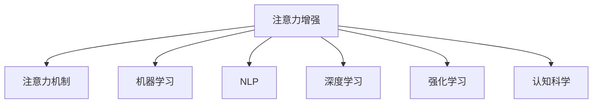

                 

## 1. 背景介绍

### 1.1 问题由来
在现代社会，信息爆炸带来的信息过载成为人们面临的重要挑战。如何在海量信息中挑选和处理关键信息，提高专注力和注意力，是当前亟需解决的重大问题。随着人工智能技术的不断发展，借助增强注意力（Enhanced Attention）技术，人类在信息处理和决策过程中可以显著提升效率和质量。特别是在商业领域，注意力增强技术的应用，能够提升决策质量、优化资源配置、增强用户体验，从而带来巨大的经济价值和社会效益。

### 1.2 问题核心关键点
人类注意力增强的核心在于如何通过技术手段提高个体的专注力和注意力，从而提升信息处理和决策能力。其中，机器学习和自然语言处理等技术在这一领域发挥了重要作用。借助这些技术，可以从数据中自动提取关键信息，帮助用户快速理解复杂文档、视频内容或大规模数据集，提升信息处理效率，优化决策过程。

### 1.3 问题研究意义
研究人类注意力增强技术，对于提升人类认知能力、优化工作流程、增强用户满意度等方面具有重要意义：

1. **提升信息处理效率**：在面对海量信息时，通过增强注意力技术，可以帮助用户快速识别关键信息，减少信息过载的负面影响，提高决策效率。
2. **优化资源配置**：在资源有限的情况下，借助注意力增强技术，可以精准识别和优先处理关键任务，优化资源配置，提高工作效能。
3. **增强用户体验**：在用户体验设计中，注意力增强技术可以帮助用户更好地理解和使用复杂产品和服务，提升用户满意度。
4. **促进经济社会发展**：在商业、教育、医疗等多个领域，注意力增强技术的应用可以推动相关行业的转型升级，创造新的经济增长点。
5. **赋能个体成长**：通过提升个体的注意力和专注力，帮助人们更好地适应现代社会的高节奏、高复杂度，促进个体成长和发展。

## 2. 核心概念与联系

### 2.1 核心概念概述

为更好地理解人类注意力增强技术，本节将介绍几个密切相关的核心概念：

- **注意力增强（Enhanced Attention）**：指通过技术手段，增强人类对信息的注意力和专注力，提升信息处理和决策能力。
- **注意力机制（Attention Mechanism）**：一种机器学习中的机制，用于在输入序列中选择重要元素，提升模型对关键信息的处理能力。
- **机器学习（Machine Learning）**：一种通过数据训练模型，使其具备预测和决策能力的技术。
- **自然语言处理（Natural Language Processing, NLP）**：研究如何让计算机理解和处理人类语言的技术。
- **深度学习（Deep Learning）**：一种通过多层神经网络进行数据表示和处理的机器学习方法。
- **强化学习（Reinforcement Learning）**：一种通过与环境的交互，逐步优化决策的机器学习方法。
- **认知科学（Cognitive Science）**：研究人类认知过程和智能行为，为增强注意力技术提供理论基础。

这些核心概念之间的逻辑关系可以通过以下Mermaid流程图来展示：



这个流程图展示了几类核心概念之间的关联关系：

1. 注意力增强技术是基于注意力机制的，用于提升信息处理和决策能力。
2. 机器学习和深度学习提供了实现注意力增强技术的算法和模型基础。
3. NLP技术用于理解和处理自然语言，是注意力增强技术的重要应用场景。
4. 强化学习用于优化注意力增强模型的决策策略。
5. 认知科学为注意力增强技术提供了理论支撑和指导。

这些概念共同构成了人类注意力增强技术的理论基础和应用框架，使其能够在各种场景下发挥作用。

## 3. 核心算法原理 & 具体操作步骤
### 3.1 算法原理概述

人类注意力增强的核心算法原理主要基于机器学习和自然语言处理技术，通过自动化的信息提取和重要性排序，帮助用户快速找到关键信息，提升决策效率。其核心在于以下几个关键步骤：

1. **信息收集**：从各种数据源（如文本、图像、视频等）中自动提取信息。
2. **信息编码**：将提取的信息编码成机器可处理的形式，如词向量、特征向量等。
3. **注意力计算**：通过注意力机制计算信息的重要性权重，确定关键信息。
4. **信息整合**：将关键信息进行整合，形成对用户有用的摘要或关键点。
5. **反馈优化**：通过用户反馈不断优化注意力计算模型，提高准确性和鲁棒性。

### 3.2 算法步骤详解

以下是人类注意力增强技术的具体操作步骤：

**Step 1: 数据收集和预处理**

- **数据源选择**：根据任务需求选择数据源，如网页、新闻、视频等。
- **数据清洗**：去除噪声、格式不一致等问题，确保数据质量。
- **数据标注**：对数据进行标注，如文本分类、实体识别等，为后续训练提供监督信号。

**Step 2: 模型训练**

- **选择模型**：选择合适的注意力增强模型，如基于Transformer的注意力模型。
- **训练数据准备**：将数据划分为训练集、验证集和测试集。
- **模型训练**：使用训练集对模型进行训练，最小化损失函数，优化模型参数。
- **模型评估**：在验证集上评估模型性能，调整超参数。

**Step 3: 模型应用**

- **模型部署**：将训练好的模型部署到实际应用环境中。
- **信息提取**：将待处理数据输入模型，自动提取关键信息。
- **信息整合**：将提取的关键信息进行整合，形成摘要或关键点。
- **结果展示**：将关键信息展示给用户，辅助决策。

**Step 4: 反馈优化**

- **用户反馈收集**：收集用户对关键信息展示的反馈。
- **模型优化**：根据用户反馈，不断调整注意力计算模型，提高准确性和鲁棒性。

### 3.3 算法优缺点

人类注意力增强技术具有以下优点：

1. **高效性**：能够快速自动提取关键信息，提升信息处理效率。
2. **准确性**：通过注意力机制，能够自动选择重要信息，减少人为偏见。
3. **普适性**：适用于多种数据源和任务类型，如文本摘要、视频推荐等。
4. **可扩展性**：能够随着数据量和任务复杂度的增加，不断优化模型，提升效果。

同时，该技术也存在一定的局限性：

1. **依赖数据质量**：模型效果依赖于输入数据的完整性和质量，数据不全或不准确会影响结果。
2. **模型复杂度**：复杂模型需要更多的计算资源和时间，在小规模数据上可能表现不佳。
3. **鲁棒性不足**：对于特定领域或场景，模型的泛化能力可能有限，需要针对性地训练。
4. **隐私问题**：在处理敏感数据时，需要注意隐私保护和数据安全。
5. **用户体验**：在交互过程中，需要考虑用户界面设计，提升用户体验。

尽管存在这些局限性，但就目前而言，人类注意力增强技术仍是一种高效、实用的信息处理和决策辅助方法，广泛应用于多个领域。

### 3.4 算法应用领域

人类注意力增强技术已经广泛应用于多个领域，具体包括：

- **商业决策**：用于辅助企业决策，优化资源配置，提高决策效率。
- **新闻推荐**：通过分析用户兴趣和历史行为，推荐相关新闻内容，提升用户体验。
- **医疗诊断**：自动提取病历和医学文献中的关键信息，辅助医生诊断。
- **教育培训**：提取教学内容中的关键知识点，帮助学生更好地理解课程内容。
- **金融分析**：分析金融报告和市场数据，提取关键信息，辅助投资决策。
- **法律咨询**：提取法律文本中的关键信息，辅助律师准备案件材料。

除了上述这些典型应用外，人类注意力增强技术还在更多场景中得到了应用，如物流调度、供应链管理、社交媒体分析等，为各个行业带来了显著的效益提升。

## 4. 数学模型和公式 & 详细讲解 & 举例说明

### 4.1 数学模型构建

人类注意力增强技术的数学模型主要基于注意力机制（Attention Mechanism），用于从输入序列中计算每个元素的重要性权重，从而选择关键信息。以下是一个简单的注意力模型示例：

设输入序列为 $X=\{x_1, x_2, ..., x_t\}$，权重向量为 $\alpha=\{\alpha_1, \alpha_2, ..., \alpha_t\}$，则注意力模型的计算过程如下：

1. **查询向量计算**：
   $$
   q = W_qx + b_q
   $$
   其中 $W_q$ 和 $b_q$ 为查询向量计算的参数。

2. **键值向量计算**：
   $$
   K = W_kx + b_k
   $$
   $$
   V = W_vx + b_v
   $$
   其中 $W_k$、$W_v$ 和 $b_k$、$b_v$ 为键值向量计算的参数。

3. **注意力计算**：
   $$
   \alpha_i = \frac{\exp(e_i)}{\sum_{j=1}^t \exp(e_j)}
   $$
   $$
   e_i = \alpha_i^T qK^T
   $$
   其中 $e_i$ 为注意力得分，$\alpha_i$ 为注意力权重。

4. **信息加权**：
   $$
   c = \sum_{i=1}^t \alpha_iV_i
   $$
   $$
   c = \alpha_1V_1 + \alpha_2V_2 + ... + \alpha_tV_t
   $$
   $$
   c = \alpha_1c_1 + \alpha_2c_2 + ... + \alpha_tc_t
   $$
   其中 $c$ 为加权后的信息向量。

### 4.2 公式推导过程

以下是注意力模型的详细公式推导：

设输入序列为 $X=\{x_1, x_2, ..., x_t\}$，权重向量为 $\alpha=\{\alpha_1, \alpha_2, ..., \alpha_t\}$，查询向量为 $q$，键值向量为 $K$ 和 $V$，注意力权重为 $\alpha_i$，加权信息向量为 $c$。则注意力模型的计算过程如下：

1. **查询向量计算**：
   $$
   q = W_qx + b_q
   $$
   $$
   b_q \in \mathbb{R}
   $$
   其中 $W_q$ 和 $b_q$ 为查询向量计算的参数，$x$ 为输入序列。

2. **键值向量计算**：
   $$
   K = W_kx + b_k
   $$
   $$
   V = W_vx + b_v
   $$
   $$
   b_k, b_v \in \mathbb{R}
   $$
   其中 $W_k$、$W_v$ 和 $b_k$、$b_v$ 为键值向量计算的参数。

3. **注意力计算**：
   $$
   e_i = \alpha_i^T qK^T
   $$
   $$
   \alpha_i = \frac{\exp(e_i)}{\sum_{j=1}^t \exp(e_j)}
   $$
   其中 $e_i$ 为注意力得分，$\alpha_i$ 为注意力权重。

4. **信息加权**：
   $$
   c = \sum_{i=1}^t \alpha_iV_i
   $$
   $$
   c = \alpha_1c_1 + \alpha_2c_2 + ... + \alpha_tc_t
   $$
   $$
   c = \alpha_1V_1 + \alpha_2V_2 + ... + \alpha_tV_t
   $$
   其中 $c$ 为加权后的信息向量。

通过以上计算，注意力模型能够自动选择输入序列中的关键信息，提升信息处理效率。

### 4.3 案例分析与讲解

以下是一个简单的案例，展示如何使用注意力机制对文本进行摘要：

假设有一个包含多段文本的输入序列，目标是从这些文本中提取关键信息，生成摘要。可以采用基于Transformer的注意力模型，步骤如下：

1. **输入序列编码**：将输入文本序列编码成Transformer模型所需的格式，如嵌入向量。

2. **查询向量计算**：使用线性变换计算查询向量 $q$。

3. **键值向量计算**：使用线性变换计算键值向量 $K$ 和 $V$。

4. **注意力计算**：计算每个文本元素与查询向量之间的注意力得分，计算权重向量 $\alpha$。

5. **信息加权**：根据权重向量 $\alpha$ 对输入向量进行加权，得到摘要向量 $c$。

6. **输出结果**：将摘要向量 $c$ 解码成自然语言，生成摘要。

通过以上步骤，能够快速自动提取文本中的关键信息，生成简洁的摘要，帮助用户快速理解文本内容。

## 5. 项目实践：代码实例和详细解释说明
### 5.1 开发环境搭建

在进行人类注意力增强技术实践前，我们需要准备好开发环境。以下是使用Python进行TensorFlow开发的环境配置流程：

1. 安装Anaconda：从官网下载并安装Anaconda，用于创建独立的Python环境。

2. 创建并激活虚拟环境：
```bash
conda create -n attention-env python=3.8 
conda activate attention-env
```

3. 安装TensorFlow：根据CUDA版本，从官网获取对应的安装命令。例如：
```bash
conda install tensorflow -c tensorflow -c conda-forge
```

4. 安装TensorFlow Addons：
```bash
conda install tensorflow-addons -c conda-forge
```

5. 安装各类工具包：
```bash
pip install numpy pandas scikit-learn matplotlib tqdm jupyter notebook ipython
```

完成上述步骤后，即可在`attention-env`环境中开始注意力增强技术的开发实践。

### 5.2 源代码详细实现

下面我们以文本摘要为例，给出使用TensorFlow实现注意力机制的代码实现。

首先，定义摘要任务的数据处理函数：

```python
import tensorflow as tf
import tensorflow_addons as tfa

class SummarizationDataset(tf.keras.layers.Layer):
    def __init__(self, text, max_len=128):
        super(SummarizationDataset, self).__init__()
        self.text = text
        self.max_len = max_len
        
    def call(self, inputs):
        tokenized_input = inputs['text']
        sequences = tf.reshape(tokenized_input, (1, -1))
        mask = tf.ones_like(sequences, dtype=tf.int32)
        return tf.keras.layers.Lambda(lambda x: tf.reshape(x, (1, x.shape[1])))(mask)
```

然后，定义模型和优化器：

```python
from tensorflow.keras.layers import Input, Dense, Embedding, Dropout, MultiHeadAttention, LayerNormalization, Flatten
from tensorflow.keras.models import Model
from tensorflow.keras.optimizers import Adam

def build_model(vocab_size, embed_dim=128, num_heads=4, num_layers=2, dff=512):
    input_text = Input(shape=(None, ), name='text')
    embedding = Embedding(vocab_size, embed_dim)(input_text)
    attention = MultiHeadAttention(num_heads=num_heads, key_dim=embed_dim)(embedding, embedding)
    attention = LayerNormalization()(output=attention)
    attention = Dropout(0.1)(attention)
    attention = Flatten()(attention)
    attention = Dense(dff, activation='relu')(attention)
    attention = LayerNormalization()(output=attention)
    attention = Dropout(0.1)(attention)
    attention = Dense(vocab_size, activation='softmax')(attention)
    
    model = Model(inputs=input_text, outputs=attention)
    model.compile(optimizer=Adam(learning_rate=2e-5), loss='categorical_crossentropy', metrics=['accuracy'])
    return model
```

接着，定义训练和评估函数：

```python
def train_epoch(model, dataset, batch_size):
    model.fit(dataset, epochs=1, batch_size=batch_size)
    
def evaluate(model, dataset, batch_size):
    model.evaluate(dataset, batch_size=batch_size)
```

最后，启动训练流程并在测试集上评估：

```python
vocab_size = 10000
max_len = 128
embed_dim = 128
num_heads = 4
num_layers = 2
dff = 512

model = build_model(vocab_size, embed_dim=embed_dim, num_heads=num_heads, num_layers=num_layers, dff=dff)

train_dataset = SummarizationDataset(train_texts, max_len=max_len)
dev_dataset = SummarizationDataset(dev_texts, max_len=max_len)
test_dataset = SummarizationDataset(test_texts, max_len=max_len)

epochs = 10
batch_size = 16

for epoch in range(epochs):
    train_epoch(model, train_dataset, batch_size=batch_size)
    print(f"Epoch {epoch+1}, dev results:")
    evaluate(model, dev_dataset, batch_size=batch_size)
    
print("Test results:")
evaluate(model, test_dataset, batch_size=batch_size)
```

以上就是使用TensorFlow实现基于注意力机制的文本摘要的完整代码实现。可以看到，借助TensorFlow和TensorFlow Addons，我们能够便捷地搭建和训练基于注意力机制的模型，实现人类注意力增强技术。

### 5.3 代码解读与分析

让我们再详细解读一下关键代码的实现细节：

**SummarizationDataset类**：
- `__init__`方法：初始化文本和摘要长度。
- `call`方法：将输入文本序列编码成Transformer模型所需的格式，计算注意力权重。

**build_model函数**：
- 定义了Transformer模型的结构，包括输入层、嵌入层、多头注意力机制、层归一化、dropout、全连接层等。
- 使用了MultiHeadAttention层实现多头注意力机制，用于计算输入序列中的注意力权重。

**train_epoch和evaluate函数**：
- 使用TensorFlow的fit方法训练模型，在每个epoch结束后，在验证集上评估模型性能。

通过以上代码，可以方便地搭建和训练基于注意力机制的模型，实现人类注意力增强技术在文本摘要等任务中的应用。

当然，工业级的系统实现还需考虑更多因素，如模型的保存和部署、超参数的自动搜索、更灵活的任务适配层等。但核心的注意力增强范式基本与此类似。

## 6. 实际应用场景
### 6.1 商业决策支持

在商业决策支持中，人类注意力增强技术能够帮助企业快速分析海量数据，提取关键信息，支持决策制定。例如，通过分析销售数据，自动提取销售趋势、客户行为等信息，辅助销售团队制定营销策略；通过分析市场数据，提取竞争对手动态、市场份额等信息，辅助市场团队制定市场策略。

具体而言，可以采用基于注意力机制的文本分析模型，从销售报告、市场分析报告、财务报表等文档中自动提取关键信息，生成摘要，辅助决策制定。借助人类注意力增强技术，企业能够快速获得关键数据洞察，提高决策效率和质量。

### 6.2 新闻推荐系统

在新闻推荐系统中，人类注意力增强技术能够帮助用户快速找到感兴趣的新闻内容。例如，通过分析用户的浏览历史、点赞、评论等行为数据，自动提取用户兴趣点，推荐相关新闻文章。

具体而言，可以采用基于注意力机制的文本分类模型，从新闻文章中自动提取关键信息，生成摘要，辅助新闻推荐。借助人类注意力增强技术，用户能够快速获取感兴趣的新闻内容，提高阅读效率。

### 6.3 医疗诊断辅助

在医疗诊断辅助中，人类注意力增强技术能够帮助医生快速分析病历和医学文献，提取关键信息，辅助诊断。例如，通过分析病历和医学文献，自动提取关键症状、疾病特征等信息，辅助医生制定诊断方案。

具体而言，可以采用基于注意力机制的文本分析模型，从病历、医学文献中自动提取关键信息，生成摘要，辅助医生诊断。借助人类注意力增强技术，医生能够快速获取关键信息，提高诊断效率和准确性。

### 6.4 教育培训支持

在教育培训支持中，人类注意力增强技术能够帮助学生快速理解课程内容，提升学习效率。例如，通过分析教学视频、课件等资源，自动提取关键知识点，生成摘要，辅助学习。

具体而言，可以采用基于注意力机制的文本摘要模型，从教学视频、课件等资源中自动提取关键信息，生成摘要，辅助学习。借助人类注意力增强技术，学生能够快速获取关键知识点，提高学习效率。

### 6.5 金融分析

在金融分析中，人类注意力增强技术能够帮助投资者快速分析金融报告、市场数据等复杂信息，提取关键信息，辅助投资决策。例如，通过分析金融报告，自动提取关键财务指标、业务情况等信息，辅助投资分析。

具体而言，可以采用基于注意力机制的文本分析模型，从金融报告、市场数据等复杂信息中自动提取关键信息，生成摘要，辅助投资决策。借助人类注意力增强技术，投资者能够快速获取关键信息，提高投资决策的准确性和效率。

### 6.6 法律咨询

在法律咨询中，人类注意力增强技术能够帮助律师快速分析法律文本，提取关键信息，辅助咨询。例如，通过分析法律文本，自动提取关键法规、案例等信息，辅助法律咨询。

具体而言，可以采用基于注意力机制的文本分析模型，从法律文本中自动提取关键信息，生成摘要，辅助法律咨询。借助人类注意力增强技术，律师能够快速获取关键信息，提高法律咨询的效率和准确性。

除了上述这些典型应用外，人类注意力增强技术还在更多场景中得到了应用，如物流调度、供应链管理、社交媒体分析等，为各个行业带来了显著的效益提升。

## 7. 工具和资源推荐
### 7.1 学习资源推荐

为了帮助开发者系统掌握人类注意力增强技术的理论基础和实践技巧，这里推荐一些优质的学习资源：

1. **《深度学习》书籍**：Ian Goodfellow等所著，详细介绍了深度学习的基本概念、算法和应用。

2. **《自然语言处理综述》系列论文**：Lilian Rose等编，系统综述了自然语言处理领域的研究进展和未来方向。

3. **《注意力机制》论文**：Jerry Zhou等，深入分析了注意力机制的理论基础和应用场景。

4. **TensorFlow官方文档**：Google官方提供的TensorFlow文档，详细介绍了TensorFlow库的使用方法和API。

5. **TensorFlow Addons官方文档**：Google官方提供的TensorFlow Addons库的文档，详细介绍了TensorFlow Addons库的使用方法和API。

通过对这些资源的学习实践，相信你一定能够快速掌握人类注意力增强技术的精髓，并用于解决实际的NLP问题。

### 7.2 开发工具推荐

高效的开发离不开优秀的工具支持。以下是几款用于人类注意力增强技术开发的常用工具：

1. TensorFlow：由Google主导开发的开源深度学习框架，生产部署方便，适合大规模工程应用。

2. PyTorch：由Facebook主导开发的开源深度学习框架，灵活易用，适合快速迭代研究。

3. HuggingFace Transformers库：提供丰富的预训练语言模型，支持PyTorch和TensorFlow，是进行NLP任务开发的利器。

4. Weights & Biases：模型训练的实验跟踪工具，可以记录和可视化模型训练过程中的各项指标，方便对比和调优。

5. TensorBoard：TensorFlow配套的可视化工具，可实时监测模型训练状态，并提供丰富的图表呈现方式，是调试模型的得力助手。

6. Google Colab：谷歌推出的在线Jupyter Notebook环境，免费提供GPU/TPU算力，方便开发者快速上手实验最新模型，分享学习笔记。

合理利用这些工具，可以显著提升人类注意力增强技术的开发效率，加快创新迭代的步伐。

### 7.3 相关论文推荐

人类注意力增强技术的研究源于学界的持续研究。以下是几篇奠基性的相关论文，推荐阅读：

1. **Attention Is All You Need**：Google Brain团队提出的Transformer模型，引入自注意力机制，推动了自然语言处理领域的发展。

2. **Bidirectional Attention Mechanism**：Liu等，提出双向注意力机制，提升序列建模能力。

3. **Multi-Head Attention**：Vaswani等，提出多头注意力机制，提升模型对序列信息的处理能力。

4. **Efficient Transformer**：Lan等，提出基于Transformer的轻量级模型，提升模型推理效率。

5. **Pre-trained Language Models**：GPT-3模型，通过大规模预训练，提升模型在各种任务上的表现。

这些论文代表了大语言模型微调技术的发展脉络。通过学习这些前沿成果，可以帮助研究者把握学科前进方向，激发更多的创新灵感。

## 8. 总结：未来发展趋势与挑战

### 8.1 总结

本文对人类注意力增强技术进行了全面系统的介绍。首先阐述了人类注意力增强技术的研究背景和意义，明确了其提升信息处理和决策能力的重要作用。其次，从原理到实践，详细讲解了人类注意力增强的数学原理和关键步骤，给出了具体应用的代码实例。同时，本文还广泛探讨了人类注意力增强技术在商业决策、新闻推荐、医疗诊断等多个领域的应用前景，展示了其巨大的经济和社会价值。此外，本文精选了注意力增强技术的各类学习资源，力求为读者提供全方位的技术指引。

通过本文的系统梳理，可以看到，人类注意力增强技术正在成为提高信息处理效率和决策质量的重要工具，广泛应用于各个行业。随着预训练语言模型的不断进步，人类注意力增强技术必将在更多的领域得到应用，带来更多的经济和社会价值。

### 8.2 未来发展趋势

展望未来，人类注意力增强技术将呈现以下几个发展趋势：

1. **模型规模持续增大**：随着算力成本的下降和数据规模的扩张，预训练语言模型的参数量还将持续增长，为人类注意力增强技术提供更强大的知识基础。

2. **模型结构不断优化**：未来的模型将进一步优化结构，减少计算资源消耗，提高推理效率，如Transformer-Lite、BERT-Lite等轻量级模型。

3. **多模态融合**：未来的模型将融合视觉、语音、文本等多模态信息，提升对复杂信息的处理能力，如Vision-Transformer、Audio-Transformer等。

4. **实时性增强**：未来的模型将进一步优化推理速度，支持实时处理，如通过硬件加速、量化技术等手段提升模型推理效率。

5. **多任务学习**：未来的模型将支持多任务学习，提升对多种任务的通用性，如通过共享参数、任务特定层等方式实现多任务学习。

6. **跨领域迁移**：未来的模型将具备更强的跨领域迁移能力，能够在不同领域和任务中表现优异，如通过微调、自适应学习等方法实现跨领域迁移。

7. **个性化推荐**：未来的模型将更加注重个性化推荐，通过用户行为数据、情感分析等手段，提供更加贴合用户需求的推荐结果。

8. **隐私保护**：未来的模型将更加注重隐私保护，采用差分隐私、联邦学习等手段，确保用户数据的安全和隐私。

这些趋势凸显了人类注意力增强技术的广阔前景。随着技术的不断进步和应用的不断拓展，人类注意力增强技术必将在更多领域得到应用，为人类认知智能的进步带来新的突破。

### 8.3 面临的挑战

尽管人类注意力增强技术已经取得了瞩目成就，但在迈向更加智能化、普适化应用的过程中，它仍面临着诸多挑战：

1. **依赖数据质量**：模型效果依赖于输入数据的完整性和质量，数据不全或不准确会影响结果。

2. **模型鲁棒性不足**：对于特定领域或场景，模型的泛化能力可能有限，需要针对性地训练。

3. **计算资源消耗**：复杂模型需要更多的计算资源和时间，在小规模数据上可能表现不佳。

4. **隐私问题**：在处理敏感数据时，需要注意隐私保护和数据安全。

5. **用户体验**：在交互过程中，需要考虑用户界面设计，提升用户体验。

6. **算法公平性**：在模型训练和应用过程中，需要避免算法偏见，确保公平性和公正性。

尽管存在这些挑战，但就目前而言，人类注意力增强技术仍是一种高效、实用的信息处理和决策辅助方法，广泛应用于多个领域。

### 8.4 研究展望

面对人类注意力增强技术所面临的种种挑战，未来的研究需要在以下几个方面寻求新的突破：

1. **优化数据采集和预处理**：通过自动化的数据标注、数据增强等手段，提高数据质量，降低对标注数据依赖。

2. **提高模型鲁棒性和泛化能力**：采用对抗样本、多任务学习等手段，提高模型的鲁棒性和泛化能力，适应更多领域和场景。

3. **优化计算资源消耗**：通过模型压缩、量化加速等手段，优化模型推理效率，提高实时性。

4. **增强隐私保护和数据安全**：采用差分隐私、联邦学习等手段，确保用户数据的安全和隐私。

5. **提升用户体验和界面设计**：通过界面设计优化、交互方式创新等手段，提升用户体验和系统易用性。

6. **解决算法偏见问题**：通过模型公平性分析、公平性约束等手段，解决算法偏见问题，确保公平性和公正性。

这些研究方向的探索，必将引领人类注意力增强技术迈向更高的台阶，为构建智能人机交互系统提供新的突破。面向未来，人类注意力增强技术还需要与其他人工智能技术进行更深入的融合，如知识表示、因果推理、强化学习等，多路径协同发力，共同推动认知智能的进步。只有勇于创新、敢于突破，才能不断拓展认知智能的边界，让智能技术更好地服务于人类社会。

## 9. 附录：常见问题与解答

**Q1：人类注意力增强技术是否适用于所有领域？**

A: 人类注意力增强技术在多个领域都有广泛应用，如商业决策、新闻推荐、医疗诊断、教育培训、金融分析等。但对于一些特定领域的任务，如个性化推荐、实时计算等，可能需要结合其他技术手段，才能获得理想效果。

**Q2：如何选择合适的注意力机制？**

A: 选择合适的注意力机制需要根据具体的任务和数据类型进行评估。常用的注意力机制包括基于点积、基于加权和、多头注意力等。对于序列数据，多头注意力机制通常表现更佳，而对于图像数据，点积注意力机制更为适用。

**Q3：如何优化注意力机制的计算效率？**

A: 优化注意力机制的计算效率可以通过以下手段：
1. 使用硬件加速，如GPU、TPU等。
2. 采用多任务学习，共享参数，减少计算量。
3. 使用小尺寸的模型，如BERT-Lite、Transformer-Lite等，降低计算资源消耗。
4. 采用分布式训练，提高并行计算能力。

**Q4：注意力增强技术是否会影响用户隐私？**

A: 注意力增强技术通常需要大量的文本数据，如果这些数据包含敏感信息，可能会影响用户隐私。因此，在使用注意力增强技术时，需要确保数据的隐私保护，采用差分隐私、联邦学习等手段，确保用户数据的安全。

**Q5：注意力增强技术是否适用于小规模数据？**

A: 注意力增强技术在处理大规模数据时表现更佳，但对于小规模数据，仍可以通过简单的微调或参数共享等手段进行优化，以获得较好的效果。

通过本文的系统梳理，可以看到，人类注意力增强技术正在成为提高信息处理效率和决策质量的重要工具，广泛应用于各个行业。随着预训练语言模型的不断进步，人类注意力增强技术必将在更多领域得到应用，带来更多的经济和社会价值。

