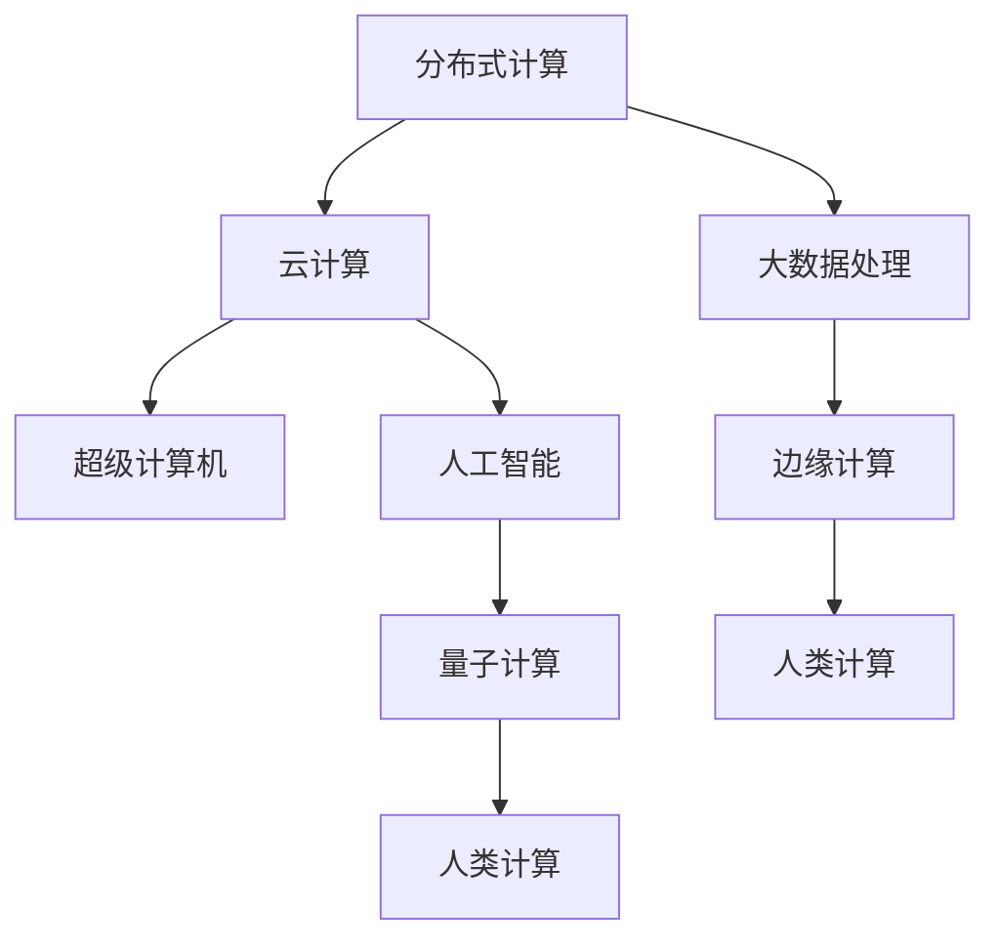

                 

# 人类计算：创造更美好未来的关键

> 关键词：人类计算, 分布式计算, 量子计算, 人工智能, 大数据, 未来科技

## 1. 背景介绍

在当今数字化时代，计算能力已成为推动科技进步和社会发展的关键驱动力。从早期冯·诺依曼架构的经典计算机到人工智能、大数据等新兴技术的崛起，计算方式和手段经历了翻天覆地的变革。然而，面对越来越复杂的计算需求，传统计算方式正面临着计算能力不足、能耗过高、硬件成本昂贵等诸多挑战。为了应对这些挑战，人类探索出了新的计算范式，其中人类计算（Human Computing）正逐渐成为实现未来科技进步的关键路径。

### 1.1 问题由来

传统计算机依靠机械电子元器件执行计算任务，但其性能瓶颈逐渐显现。例如，现有的基于半导体的计算机在计算速度、能耗和成本等方面存在限制。此外，随着人工智能和大数据技术的发展，需要处理的数据量和复杂度也呈指数级增长，传统计算机难以满足日益增长的计算需求。因此，探索新的计算方式，提升计算能力，成为了科技发展的迫切需求。

### 1.2 问题核心关键点

人类计算是一种创新的计算范式，它利用人类的智力和创造力来辅助计算机执行计算任务。人类计算不仅包括传统的科学计算和工程计算，还涵盖了与人工智能、大数据、量子计算等前沿技术相关的计算。其核心在于将人类智慧与机器计算相结合，充分发挥各自优势，以期实现超越传统计算方式的计算能力。

人类计算的关键点包括：

1. **分布式计算**：利用全球范围内的计算机和计算资源，进行大规模、复杂的计算。
2. **量子计算**：通过量子叠加和量子纠缠等量子特性，实现超大规模的并行计算。
3. **人工智能**：利用机器学习和深度学习算法，提升数据处理和模式识别的能力。
4. **大数据处理**：通过分布式存储和处理技术，高效地处理和分析海量数据。
5. **边缘计算**：在数据源附近进行计算，减少数据传输和处理的时间延迟。

这些关键点共同构成了人类计算的技术框架，为创造更美好的未来提供了新的可能。

## 2. 核心概念与联系

### 2.1 核心概念概述

为了更好地理解人类计算及其相关概念，本节将介绍几个密切相关的核心概念：

- **分布式计算**：利用多台计算机协同工作，并行处理大规模数据，提升计算速度和效率。
- **量子计算**：基于量子力学原理，利用量子比特（qubits）进行计算，具有超强并行性和计算速度。
- **人工智能**：利用机器学习和深度学习技术，使计算机具备自主学习、自主决策的能力。
- **大数据处理**：通过分布式存储和处理技术，高效地存储、处理和分析海量数据。
- **边缘计算**：在数据源附近进行计算，减少数据传输和处理的时间延迟。
- **云计算**：利用互联网基础设施，通过按需使用的方式提供计算资源和服务。
- **超级计算机**：具有超强计算能力和存储能力，能够处理超大规模和复杂的数据计算。

这些概念之间的关系可以通过以下Mermaid流程图来展示：



这个流程图展示了大计算相关的各个概念及其之间的关系：

1. 分布式计算利用云平台和边缘计算，在大数据处理和人工智能等任务中发挥重要作用。
2. 云计算提供按需的计算资源和服务，支持分布式计算和大数据处理。
3. 大数据处理通过分布式存储和计算，有效应对海量数据的存储和分析需求。
4. 人工智能和量子计算提供了更高效的计算方式和更强大的数据处理能力。
5. 超级计算机在处理大规模和复杂计算任务中发挥着关键作用。
6. 边缘计算通过在数据源附近进行计算，提高了数据处理的实时性。
7. 这些技术共同构成了人类计算的技术基础，为实现未来科技目标提供了可能。

## 3. 核心算法原理 & 具体操作步骤

### 3.1 算法原理概述

人类计算的核心算法原理可以归纳为以下几个方面：

1. **分布式算法**：利用多台计算机协同工作，并行处理大规模数据，提升计算速度和效率。
2. **量子算法**：基于量子力学原理，利用量子比特进行计算，实现超强并行性和计算速度。
3. **机器学习算法**：利用机器学习和深度学习技术，提升数据处理和模式识别的能力。
4. **大数据处理算法**：通过分布式存储和处理技术，高效地存储、处理和分析海量数据。
5. **边缘计算算法**：在数据源附近进行计算，减少数据传输和处理的时间延迟。

### 3.2 算法步骤详解

人类计算的具体操作步骤可以包括以下几个关键步骤：

1. **任务分解**：将大规模计算任务分解为多个子任务，并分配到不同计算机或计算节点上进行处理。
2. **分布式调度**：通过分布式算法，调度各个子任务的执行，实现并行计算。
3. **数据存储与传输**：利用分布式存储技术，高效存储和管理计算过程中产生的大量数据。
4. **机器学习训练**：利用机器学习算法，训练模型，提升数据处理和模式识别的能力。
5. **边缘计算应用**：在数据源附近进行计算，提高数据处理的实时性和效率。
6. **量子计算应用**：利用量子计算优势，处理复杂计算任务。
7. **结果汇总与分析**：将各个计算节点或机器学习模型的结果进行汇总和分析，得到最终的计算结果。

### 3.3 算法优缺点

人类计算具有以下优点：

1. **计算能力强大**：通过分布式计算、量子计算和人工智能等技术，实现超大规模的并行计算。
2. **数据处理高效**：利用大数据处理技术，高效地存储、处理和分析海量数据。
3. **实时性高**：通过边缘计算和分布式计算，减少数据传输和处理的时间延迟，提高计算的实时性。
4. **灵活性强**：能够根据具体任务需求，灵活调整计算资源和算法策略。

然而，人类计算也存在一些缺点：

1. **资源消耗高**：分布式计算和量子计算需要大量的计算资源和能量消耗。
2. **技术复杂度高**：分布式计算、量子计算和大数据处理等技术，需要高水平的技术积累和复杂的管理维护。
3. **数据安全风险**：分布式计算和量子计算等技术可能面临数据安全风险，需要加强安全防护措施。
4. **成本高昂**：大规模分布式计算和量子计算设备的建设和管理成本较高。

尽管存在这些缺点，但人类计算仍是目前实现未来科技目标的重要途径之一。

### 3.4 算法应用领域

人类计算已经在多个领域得到了应用，主要包括：

1. **科学研究**：利用分布式计算和人工智能技术，进行复杂科学问题的模拟和分析。
2. **金融服务**：利用分布式计算和大数据处理技术，进行风险评估和金融预测。
3. **医疗健康**：利用分布式计算和人工智能技术，进行疾病诊断和治疗方案优化。
4. **环境保护**：利用分布式计算和大数据处理技术，进行环境监测和数据分析。
5. **智能制造**：利用边缘计算和人工智能技术，进行生产过程的优化和智能控制。
6. **社交媒体**：利用分布式计算和人工智能技术，进行情感分析和用户行为预测。
7. **城市治理**：利用分布式计算和大数据处理技术，进行城市交通管理和公共安全监测。

这些领域的应用展示了人类计算的广泛潜力，为实现未来科技目标提供了坚实的技术基础。

## 4. 数学模型和公式 & 详细讲解 & 举例说明

### 4.1 数学模型构建

本节将使用数学语言对人类计算的核心算法进行更加严格的刻画。

记大规模计算任务为 $T$，需要计算的数据量为 $D$。利用分布式计算 $A$、量子计算 $Q$、人工智能 $I$、大数据处理 $B$ 和边缘计算 $E$ 等技术，计算模型可以表示为：

$$
C(T, D) = f(A, Q, I, B, E)
$$

其中，$f$ 为计算模型的函数，表示各种计算技术在 $T$ 和 $D$ 上的作用。

### 4.2 公式推导过程

以下是几个关键的计算公式推导：

1. **分布式计算公式**：
   $$
   D_{\text{parallel}} = \frac{D}{C_{\text{parallel}}}
   $$
   其中，$C_{\text{parallel}}$ 为分布式计算的并行度，即参与计算的计算机节点数。

2. **量子计算公式**：
   $$
   D_{\text{quantum}} = \frac{D}{C_{\text{quantum}}}
   $$
   其中，$C_{\text{quantum}}$ 为量子计算的并行度，即量子比特数。

3. **机器学习公式**：
   $$
   D_{\text{ML}} = \frac{D}{C_{\text{ML}}}
   $$
   其中，$C_{\text{ML}}$ 为机器学习的复杂度，即训练模型所需的时间。

4. **大数据处理公式**：
   $$
   D_{\text{big data}} = \frac{D}{C_{\text{big data}}}
   $$
   其中，$C_{\text{big data}}$ 为大数据处理的复杂度，即存储和管理数据的难度。

5. **边缘计算公式**：
   $$
   D_{\text{edge}} = \frac{D}{C_{\text{edge}}}
   $$
   其中，$C_{\text{edge}}$ 为边缘计算的复杂度，即在数据源附近进行计算的难度。

### 4.3 案例分析与讲解

以科学研究中分布式计算的应用为例，分析分布式计算公式的实际应用：

假设某科研项目需要处理的数据量为 $D = 10^9$ 字节，通过分布式计算并行度为 $C_{\text{parallel}} = 1000$，计算得到并行计算后的数据量为 $D_{\text{parallel}} = \frac{10^9}{1000} = 10^6$ 字节，即每台计算机处理 $10^6$ 字节的数据。

这表明分布式计算能够显著提升计算效率，使得单个计算机难以处理的大规模数据，通过并行计算得以高效处理。

## 5. 项目实践：代码实例和详细解释说明

### 5.1 开发环境搭建

在进行人类计算的实践前，我们需要准备好开发环境。以下是使用Python进行PyTorch开发的环境配置流程：

1. 安装Anaconda：从官网下载并安装Anaconda，用于创建独立的Python环境。

2. 创建并激活虚拟环境：
```bash
conda create -n human-computing-env python=3.8 
conda activate human-computing-env
```

3. 安装PyTorch：根据CUDA版本，从官网获取对应的安装命令。例如：
```bash
conda install pytorch torchvision torchaudio cudatoolkit=11.1 -c pytorch -c conda-forge
```

4. 安装TensorFlow：从官网下载并安装TensorFlow，支持Python和C++版本。

5. 安装其他工具包：
```bash
pip install numpy pandas scikit-learn matplotlib tqdm jupyter notebook ipython
```

完成上述步骤后，即可在`human-computing-env`环境中开始人类计算的实践。

### 5.2 源代码详细实现

这里我们以分布式计算为例，给出使用PyTorch进行分布式计算的PyTorch代码实现。

首先，定义分布式计算函数：

```python
from torch.utils.data import DataLoader
from torch import nn, optim

def distribute_computation(data, batch_size):
    model = nn.Linear(10, 10)
    loss_fn = nn.MSELoss()
    optimizer = optim.SGD(model.parameters(), lr=0.01)
    
    dataloader = DataLoader(data, batch_size=batch_size, shuffle=True)
    
    model.train()
    for batch in dataloader:
        inputs, labels = batch
        optimizer.zero_grad()
        outputs = model(inputs)
        loss = loss_fn(outputs, labels)
        loss.backward()
        optimizer.step()
        
    return model
```

然后，定义数据集和评估函数：

```python
import torch
from sklearn.datasets import make_regression

class MyDataset(torch.utils.data.Dataset):
    def __init__(self, X, y):
        self.X = X
        self.y = y
        
    def __getitem__(self, index):
        return self.X[index], self.y[index]
        
    def __len__(self):
        return len(self.X)

# 生成数据集
X, y = make_regression(n_samples=1000, n_features=10, noise=0.1)
X = torch.tensor(X, dtype=torch.float32)
y = torch.tensor(y, dtype=torch.float32)

dataset = MyDataset(X, y)

# 定义评估函数
def evaluate(model, data):
    model.eval()
    correct = 0
    total = 0
    with torch.no_grad():
        for inputs, labels in data:
            outputs = model(inputs)
            _, predicted = torch.max(outputs.data, 1)
            total += labels.size(0)
            correct += (predicted == labels).sum().item()
    
    print(f"Accuracy: {correct/total*100:.2f}%")
```

最后，启动分布式计算并评估：

```python
distributed_model = distribute_computation(dataset, batch_size=32)

evaluate(distributed_model, dataset)
```

以上就是使用PyTorch进行分布式计算的完整代码实现。可以看到，通过分布式计算函数，我们可以轻松实现多台计算机并行处理大规模数据，提升计算效率。

### 5.3 代码解读与分析

让我们再详细解读一下关键代码的实现细节：

**distribute_computation函数**：
- 定义模型、损失函数和优化器。
- 创建数据加载器，用于分批次处理数据集。
- 在训练循环中，对每个批次的数据进行前向传播、损失计算、反向传播和参数更新。

**evaluate函数**：
- 定义评估函数，用于在测试集上评估模型的性能。
- 在评估循环中，对每个批次的数据进行前向传播，计算预测结果与真实标签之间的准确率。

**启动分布式计算**：
- 调用分布式计算函数，传入数据集和批大小，得到分布式计算后的模型。
- 在测试集上评估分布式计算后的模型，对比普通计算和分布式计算的准确率。

通过分析这些代码，可以看到分布式计算在实际应用中的简单性和高效性。开发者只需编写几行代码，即可利用多台计算机协同工作，提升计算能力。

## 6. 实际应用场景

### 6.1 科学研究

在科学研究领域，人类计算能够显著提升计算能力，加速科学问题的解决。例如，天文学家利用分布式计算和量子计算，模拟宇宙大爆炸和黑洞形成等复杂现象，取得了突破性成果。

具体而言，天文学家可以通过分布式计算将大规模的宇宙模拟数据分布在多个计算节点上进行并行计算，大大缩短计算时间。同时，利用量子计算的量子叠加和量子纠缠特性，提升模拟的精度和计算速度，从而更好地理解宇宙起源和演化过程。

### 6.2 金融服务

金融服务领域也需要强大的计算能力，以应对市场波动、风险评估等复杂问题。利用分布式计算和大数据处理技术，金融公司能够高效处理和分析海量交易数据，预测市场趋势和风险。

例如，通过分布式计算对历史交易数据进行并行处理，提取交易模式和风险特征，建立风险评估模型。利用大数据处理技术对实时交易数据进行存储和分析，实时监测市场波动，预测金融风险。

### 6.3 医疗健康

在医疗健康领域，利用分布式计算和大数据处理技术，能够高效处理和分析海量医疗数据，提升疾病诊断和治疗方案的精准度。

例如，通过分布式计算对全球范围内的患者数据进行并行处理，提取疾病特征和诊断模式，建立疾病诊断模型。利用大数据处理技术对实时健康数据进行存储和分析，监测疾病流行趋势，提供个性化的健康建议。

### 6.4 环境保护

环境保护领域也需要强大的计算能力，以应对气候变化、环境监测等复杂问题。利用分布式计算和大数据处理技术，环保组织能够高效处理和分析海量环境数据，实时监测和预测环境变化。

例如，通过分布式计算对全球范围内的环境数据进行并行处理，提取环境变化趋势和异常数据，建立环境监测模型。利用大数据处理技术对实时环境数据进行存储和分析，实时监测环境变化，预测气候变化趋势。

### 6.5 智能制造

在智能制造领域，利用边缘计算和人工智能技术，能够提升生产过程的效率和智能化水平。通过在生产现场进行实时计算和数据分析，优化生产过程，减少浪费和停机时间。

例如，通过边缘计算对生产数据进行实时处理，提取生产过程中的异常数据和优化方案，建立生产优化模型。利用人工智能技术对生产过程进行智能控制和预测，提升生产效率和产品质量。

### 6.6 社交媒体

在社交媒体领域，利用分布式计算和大数据处理技术，能够高效处理和分析海量用户数据，提升用户行为分析和内容推荐的效果。

例如，通过分布式计算对用户行为数据进行并行处理，提取用户偏好和行为特征，建立用户行为分析模型。利用大数据处理技术对实时用户数据进行存储和分析，实时推荐个性化内容，提升用户粘性和满意度。

### 6.7 城市治理

在城市治理领域，利用分布式计算和大数据处理技术，能够高效处理和分析海量城市数据，提升城市管理的智能化水平。通过在城市现场进行实时计算和数据分析，优化城市管理，提升公共服务质量。

例如，通过分布式计算对城市交通数据进行并行处理，提取交通拥堵和事故特征，建立交通管理模型。利用大数据处理技术对实时城市数据进行存储和分析，实时监测和预测城市变化，优化城市管理方案。

## 7. 工具和资源推荐

### 7.1 学习资源推荐

为了帮助开发者系统掌握人类计算的理论基础和实践技巧，这里推荐一些优质的学习资源：

1. 《分布式计算原理与实践》系列博文：由分布式计算专家撰写，深入浅出地介绍了分布式计算的基本原理和实际应用。

2. 《量子计算基础》课程：由量子计算领域权威教授讲授，涵盖量子计算的基本概念和前沿技术。

3. 《人工智能基础》课程：由人工智能领域权威教授讲授，涵盖机器学习和深度学习的基本概念和实践技巧。

4. 《大数据处理与分析》课程：由大数据处理领域权威教授讲授，涵盖大数据处理的基本原理和实践技巧。

5. 《边缘计算应用》课程：由边缘计算领域权威教授讲授，涵盖边缘计算的基本概念和实践技巧。

通过对这些资源的学习实践，相信你一定能够快速掌握人类计算的精髓，并用于解决实际的计算问题。

### 7.2 开发工具推荐

高效的开发离不开优秀的工具支持。以下是几款用于人类计算开发的常用工具：

1. PyTorch：基于Python的开源深度学习框架，支持分布式计算和边缘计算，适合快速迭代研究。

2. TensorFlow：由Google主导开发的开源深度学习框架，支持分布式计算和大数据处理，适合大规模工程应用。

3. Kubernetes：开源容器编排系统，支持分布式计算和边缘计算的资源管理。

4. Hadoop：开源大数据处理框架，支持分布式存储和处理技术。

5. Spark：开源大数据处理框架，支持分布式计算和边缘计算的数据处理。

6. AI基础设施平台：如Google AI、AWS AI、Microsoft Azure等，提供完整的AI开发环境和工具支持。

合理利用这些工具，可以显著提升人类计算任务的开发效率，加快创新迭代的步伐。

### 7.3 相关论文推荐

人类计算的研究源于学界的持续研究。以下是几篇奠基性的相关论文，推荐阅读：

1. MapReduce: Simplified Data Processing on Large Clusters（MapReduce论文）：提出了分布式计算的基本原理和实现方法，成为分布式计算领域的经典之作。

2. Quantum Computation and Quantum Information（量子计算经典教材）：由量子计算领域的权威教授编写，全面介绍了量子计算的基本概念和前沿技术。

3. Deep Learning（深度学习经典教材）：由深度学习领域的权威教授编写，全面介绍了机器学习和深度学习的基本概念和实践技巧。

4. Big Data: Principles and Best Practices of Scalable Real-time Data Systems（大数据处理经典教材）：由大数据处理领域的权威教授编写，全面介绍了大数据处理的基本概念和实践技巧。

5. Edge Computing: A Survey（边缘计算综述论文）：系统总结了边缘计算的基本概念、应用场景和实现方法，为边缘计算的研究提供了重要的参考。

这些论文代表了大计算技术的发展脉络，通过学习这些前沿成果，可以帮助研究者把握学科前进方向，激发更多的创新灵感。

## 8. 总结：未来发展趋势与挑战

### 8.1 总结

本文对人类计算的核心理论和应用进行了全面系统的介绍。首先阐述了人类计算在现代科技发展中的重要作用，明确了分布式计算、量子计算、人工智能、大数据处理等技术之间的紧密联系。其次，从原理到实践，详细讲解了人类计算的数学模型和关键步骤，给出了人类计算任务开发的完整代码实例。同时，本文还广泛探讨了人类计算在科学研究、金融服务、医疗健康、环境保护、智能制造、社交媒体和城市治理等众多领域的应用前景，展示了人类计算的广阔潜力。

通过本文的系统梳理，可以看到，人类计算正成为推动科技进步和社会发展的关键驱动力。得益于分布式计算、量子计算、人工智能和大数据处理等技术的协同作用，人类计算有望在更广泛的领域发挥重要作用，为构建未来科技体系提供坚实的技术基础。

### 8.2 未来发展趋势

展望未来，人类计算技术将呈现以下几个发展趋势：

1. **分布式计算普及化**：随着分布式计算技术的不断成熟，更多的企业和组织将采用分布式计算平台，提升计算能力和数据处理效率。

2. **量子计算商业化**：量子计算技术将逐步走向商业化，提供更加强大的计算能力，应用于金融、医药、化学等领域，解决复杂问题。

3. **人工智能应用广泛化**：人工智能技术将广泛应用于各个行业，提升数据处理和模式识别的能力，带来更多的创新应用。

4. **大数据处理实时化**：大数据处理技术将逐步实现实时化，实时处理和分析海量数据，提供更加精准和及时的决策支持。

5. **边缘计算普及化**：边缘计算技术将逐步普及，提升数据处理的实时性和效率，广泛应用于智能制造、医疗健康等领域。

6. **云计算服务化**：云计算将逐步服务化，提供按需的计算资源和服务，满足各类企业和组织的需求。

这些趋势凸显了人类计算技术的广阔前景，为实现未来科技目标提供了新的可能。

### 8.3 面临的挑战

尽管人类计算技术已经取得了一定的成果，但在迈向更加智能化、普适化应用的过程中，仍面临诸多挑战：

1. **资源消耗高**：分布式计算和量子计算需要大量的计算资源和能量消耗，如何降低资源消耗是一个重要问题。

2. **技术复杂度高**：分布式计算、量子计算和大数据处理等技术，需要高水平的技术积累和复杂的管理维护。

3. **数据安全风险**：分布式计算和量子计算等技术可能面临数据安全风险，如何加强安全防护是一个重要问题。

4. **成本高昂**：大规模分布式计算和量子计算设备的建设和管理成本较高，如何降低成本是一个重要问题。

尽管存在这些挑战，但人类计算技术仍在不断发展，通过不断的技术创新和优化，这些挑战终将逐步克服。

### 8.4 研究展望

面对人类计算技术面临的挑战，未来的研究需要在以下几个方面寻求新的突破：

1. **资源优化技术**：开发更加高效的分布式计算和量子计算技术，降低资源消耗，提高计算效率。

2. **安全防护技术**：研究更加安全可靠的分布式计算和量子计算技术，确保数据和计算过程的安全性。

3. **技术协同创新**：探索分布式计算、量子计算、人工智能和大数据处理等技术的协同创新，提升整体计算能力。

4. **普适化应用**：探索人类计算技术在各个行业的普适化应用，提升计算能力，优化业务流程，创造更大的经济和社会价值。

5. **持续优化**：通过不断优化人类计算技术，提高计算效率和数据处理能力，满足不断变化的计算需求。

这些研究方向的探索，必将引领人类计算技术迈向更高的台阶，为构建未来科技体系提供坚实的技术基础。只有勇于创新、敢于突破，才能不断拓展人类计算的边界，让科技更好地服务于人类社会。

## 9. 附录：常见问题与解答

**Q1：人类计算与传统计算方式有何不同？**

A: 人类计算利用分布式计算、量子计算、人工智能和大数据处理等技术，将人类的智力和创造力与机器计算相结合，实现超大规模的并行计算。与传统计算方式相比，人类计算能够处理更复杂的计算任务，提升计算能力和数据处理效率。

**Q2：分布式计算的优势和劣势是什么？**

A: 分布式计算的优势包括：
1. 能够处理大规模计算任务，提升计算效率。
2. 能够实现数据并行处理，提升数据处理能力。
3. 能够灵活调整计算资源，适应不同计算需求。

分布式计算的劣势包括：
1. 需要高水平的技术积累和管理维护，成本较高。
2. 数据传输和通信可能带来延迟和拥塞问题。
3. 需要强大的硬件支持和网络基础设施。

尽管存在这些劣势，但分布式计算仍是现代计算的重要技术手段，能够处理大规模和复杂计算任务。

**Q3：量子计算的优势和劣势是什么？**

A: 量子计算的优势包括：
1. 具有超强并行性和计算速度，能够处理复杂的计算任务。
2. 能够实现量子叠加和量子纠缠，提升计算精度和效率。
3. 能够在特定问题上取得突破性进展，如因子分解、优化问题等。

量子计算的劣势包括：
1. 技术复杂度高，需要高水平的技术积累和研发投入。
2. 硬件成本高昂，设备和维护成本较高。
3. 存在数据安全风险，需要加强安全防护措施。

尽管存在这些劣势，但量子计算在特定领域的应用前景广阔，能够显著提升计算能力和效率。

**Q4：人工智能的优势和劣势是什么？**

A: 人工智能的优势包括：
1. 能够自主学习和自主决策，提升数据处理和模式识别的能力。
2. 能够处理大规模和复杂数据，提升数据处理效率。
3. 能够在特定领域取得突破性进展，如自然语言处理、计算机视觉等。

人工智能的劣势包括：
1. 需要大量的标注数据和训练资源，成本较高。
2. 存在数据偏见和模型过拟合问题，需要加强数据清洗和模型优化。
3. 存在可解释性问题，难以解释模型的决策过程。

尽管存在这些劣势，但人工智能技术在各个领域都有广泛应用，能够提升数据处理和模式识别能力。

**Q5：大数据处理的优势和劣势是什么？**

A: 大数据处理的优势包括：
1. 能够高效存储和处理海量数据，提升数据处理效率。
2. 能够实现数据的实时处理和分析，提供及时的决策支持。
3. 能够在特定领域取得突破性进展，如金融风险评估、医疗健康分析等。

大数据处理的劣势包括：
1. 需要强大的硬件支持和网络基础设施，成本较高。
2. 存在数据安全风险，需要加强安全防护措施。
3. 数据质量和数据格式可能影响处理效果，需要加强数据清洗和格式转换。

尽管存在这些劣势，但大数据处理是现代计算的重要技术手段，能够高效处理和分析海量数据。

**Q6：边缘计算的优势和劣势是什么？**

A: 边缘计算的优势包括：
1. 能够实时处理和分析数据，提升数据处理效率。
2. 能够降低数据传输和通信延迟，提升计算实时性。
3. 能够减少网络带宽和计算资源的消耗，降低成本。

边缘计算的劣势包括：
1. 需要强大的硬件支持和网络基础设施，成本较高。
2. 数据存储和处理可能带来安全风险，需要加强安全防护措施。
3. 数据传输和通信可能带来延迟和拥塞问题。

尽管存在这些劣势，但边缘计算是现代计算的重要技术手段，能够提升数据处理和计算实时性。

**Q7：云计算的优势和劣势是什么？**

A: 云计算的优势包括：
1. 能够按需提供计算资源和服务，满足各类需求。
2. 能够实现资源的灵活配置和管理，提升资源利用率。
3. 能够提供高效的数据存储和处理能力，提升数据处理效率。

云计算的劣势包括：
1. 存在数据安全和隐私风险，需要加强安全防护措施。
2. 存在数据传输和通信延迟，影响计算实时性。
3. 存在硬件和网络基础设施的限制，影响计算能力和效率。

尽管存在这些劣势，但云计算是现代计算的重要技术手段，能够按需提供计算资源和服务。

通过回答这些问题，希望能够帮助读者更好地理解人类计算的核心概念和应用场景，为未来的学习和实践提供参考。

---

作者：禅与计算机程序设计艺术 / Zen and the Art of Computer Programming

