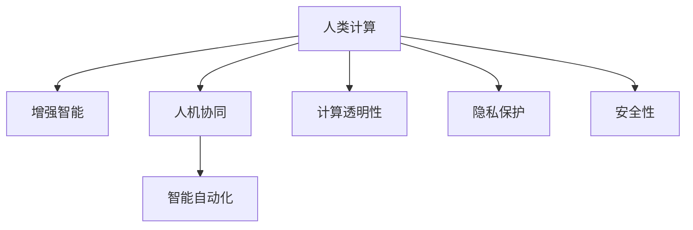

                 

## 1. 背景介绍

### 1.1 问题由来
随着人工智能(AI)技术的发展，尤其是深度学习、强化学习、自然语言处理等领域的突破，人类计算的概念正在悄然发生变化。从传统的基于算力驱动的计算，转变为基于AI赋能的智能计算。这种转变不仅提升了计算效率，也带来了新的决策逻辑和方法。然而，尽管AI技术带来了种种便利，人类计算的核心价值和地位并未因此被削弱，反而需要重新审视和挖掘其在AI时代的新应用场景。

### 1.2 问题核心关键点
人类计算在AI时代面临的核心挑战包括：
- 如何充分利用AI技术，提升计算效率和决策质量。
- 如何在保持计算过程透明和可解释的前提下，增强决策的智能化和自动化。
- 如何结合AI和人类智慧，构建更加强大、灵活的决策系统。
- 如何应对AI技术带来的伦理、隐私和安全问题，确保计算过程的公正性和安全性。

这些挑战涉及到技术、应用、伦理等多个层面，需要跨学科的深入研究和实践探索。本文将从原理、技术、应用和未来展望等多个角度，全面系统地探讨人类计算在AI时代的增强策略。

## 2. 核心概念与联系

### 2.1 核心概念概述

为更好地理解AI时代下人类计算的增强策略，本节将介绍几个密切相关的核心概念：

- **人类计算(Human Computation)**：指通过人的认知和计算能力，结合AI技术，高效处理复杂问题的方法和体系。

- **增强智能(Augmented Intelligence, AI)**：利用AI技术增强人类智能，实现智能化决策和高效任务处理。

- **人机协同(Human-AI Collaboration)**：指人类与AI技术在计算过程中的协同工作，实现互补优势。

- **智能自动化(Autonomous Intelligence)**：指AI在自动化决策、执行等方面的应用，提升任务处理的效率和准确性。

- **计算透明性(Computational Transparency)**：指在计算过程中，保持结果的可解释性和过程的透明度。

- **隐私保护(Privacy Preservation)**：指在计算过程中，保护个人和组织数据的隐私安全。

- **安全性(Security)**：指在计算过程中，防范潜在的安全威胁和攻击，确保计算过程的稳定性和可靠性。

这些概念之间的逻辑关系可以通过以下Mermaid流程图来展示：



这个流程图展示了一些核心概念之间的关系：

1. 人类计算通过结合增强智能，利用AI技术提升计算能力。
2. 人机协同是实现人类计算与AI技术互补的关键，实现更加高效、灵活的决策。
3. 智能自动化是AI在决策、执行等方面的应用，提升计算效率和决策准确性。
4. 计算透明性确保计算结果的可解释性和过程的透明度，提升决策的可信度。
5. 隐私保护和安全性是计算过程中的重要保障，确保数据和系统的安全。

这些概念共同构成了AI时代下人类计算的核心框架，使得AI技术能够更好地服务于人类，提升决策和计算的智能化水平。

## 3. 核心算法原理 & 具体操作步骤
### 3.1 算法原理概述

人类计算的核心在于结合AI技术的优势，提升人类计算的效率和质量。其算法原理可概述如下：

1. **数据准备**：收集和整理高质量的数据集，供AI模型训练和人类计算使用。数据集应涵盖多种类型和格式，确保全面性和多样性。
2. **模型训练**：使用AI模型对数据集进行训练，提取特征和模式，生成可复用的知识库。
3. **人机协作**：将人类智慧和AI模型进行有效结合，利用人类的经验和直觉，对AI模型的输出进行校正和优化。
4. **结果评估**：对计算结果进行评估和反馈，持续改进计算过程和模型。

### 3.2 算法步骤详解

人类计算的算法步骤主要包括：

1. **数据收集与预处理**：
   - 收集与任务相关的数据，包括文本、图像、语音等。
   - 对数据进行清洗、去重、标准化等预处理，确保数据质量。
   - 根据任务特点，对数据进行标注，生成监督学习样本。

2. **模型训练与选择**：
   - 选择合适的AI模型进行训练，如神经网络、决策树、支持向量机等。
   - 对模型进行超参数调优，确保模型在训练集上获得最佳的性能。
   - 根据任务需求，选择合适的模型结构，如深度神经网络、卷积神经网络、循环神经网络等。

3. **人机协作与交互**：
   - 将AI模型输出的结果展示给人类用户，供人类审查和验证。
   - 人类用户根据经验、直觉和专业知识，对AI模型输出进行校正和优化。
   - 通过交互式界面，实现人机实时协同，优化计算过程。

4. **结果评估与反馈**：
   - 对计算结果进行评估，包括准确率、召回率、F1值等指标。
   - 收集人类用户的反馈，对AI模型进行持续改进。
   - 对计算过程进行反思和总结，提升计算效率和质量。

5. **部署与监控**：
   - 将优化后的模型部署到实际应用场景中。
   - 实时监控计算过程和结果，确保系统稳定运行。
   - 根据反馈数据，定期更新和维护计算系统。

### 3.3 算法优缺点

人类计算在提升计算效率和决策质量方面，具有以下优点：

1. **高效性**：结合AI技术的优势，大幅提升计算速度和效率。
2. **智能化**：通过AI模型提取模式和特征，实现智能化决策和分析。
3. **可解释性**：利用人类智慧对AI模型输出进行解释和验证，增强计算过程的可理解性。
4. **灵活性**：通过人机协作，根据实际情况灵活调整计算策略。

同时，人类计算也存在以下局限：

1. **依赖数据质量**：计算结果依赖于数据集的质量和规模，高质量的数据集获取成本较高。
2. **需要人类经验**：需要人类用户的知识和经验，难以完全自动化。
3. **伦理和隐私问题**：数据和计算过程中涉及隐私和安全问题，需要严格保护。
4. **计算复杂性**：结合AI技术和人类智慧，计算过程复杂，需要跨学科协作。

尽管存在这些局限，人类计算在AI时代具有巨大的潜力和价值，能够显著提升计算效率和决策质量，为各行业的智能化转型提供有力支撑。

### 3.4 算法应用领域

人类计算的应用领域非常广泛，涉及多个行业和领域。以下是几个典型应用场景：

1. **金融风险评估**：结合AI模型和人类经验，对金融市场进行实时监控和风险评估，提升金融决策的智能化水平。
2. **医疗诊断辅助**：利用AI模型提取医学影像和病历数据特征，结合医生经验和知识，辅助进行疾病诊断和治疗方案选择。
3. **智能客服和咨询**：结合AI技术和人类智慧，构建智能客服和咨询系统，提升客户体验和问题解决效率。
4. **智能制造和供应链管理**：利用AI模型和人类经验，优化制造和供应链管理流程，提升生产效率和资源利用率。
5. **智能城市和智慧治理**：结合AI技术和城市管理经验，构建智能城市和智慧治理系统，提升城市管理效率和居民生活品质。

这些领域展示了人类计算的广泛应用前景，通过结合AI技术和人类智慧，能够实现更加高效、智能和安全的计算过程。

## 4. 数学模型和公式 & 详细讲解 & 举例说明

### 4.1 数学模型构建

人类计算的核心在于结合AI技术和人类智慧，进行高效的数据处理和决策。其数学模型构建过程如下：

1. **数据集准备**：假设任务数据集为 $\mathcal{D}=\{(x_i, y_i)\}_{i=1}^N$，其中 $x_i$ 为输入特征，$y_i$ 为标签或输出。
2. **模型选择**：选择合适的AI模型 $M$，如神经网络、决策树等，用于特征提取和模式识别。
3. **训练优化**：使用训练数据集 $\mathcal{D}_{train}$ 对模型 $M$ 进行训练，优化模型参数 $\theta$。
4. **人机协作**：将AI模型输出的结果 $M(x_i)$ 展示给人类用户，供人类审查和验证，生成校正结果 $c_i$。
5. **综合决策**：综合AI模型输出和人类校正结果，生成最终决策 $\hat{y}_i = f(M(x_i), c_i)$，其中 $f$ 为综合决策函数。

### 4.2 公式推导过程

以金融风险评估为例，推导人类计算的数学模型。假设有一笔贷款申请，需要评估其违约风险，可以构建如下公式：

1. **数据准备**：
   - 收集历史贷款申请数据 $\mathcal{D}=\{(x_i, y_i)\}_{i=1}^N$，其中 $x_i$ 为贷款申请特征，$y_i$ 为违约标签。
   - 对数据进行预处理和标准化。

2. **模型训练**：
   - 使用AI模型 $M$ 对数据集 $\mathcal{D}_{train}$ 进行训练，优化模型参数 $\theta$。
   - 使用损失函数 $L(y_i, M(x_i))$ 评估模型性能，如均方误差、交叉熵等。

3. **人机协作**：
   - 将AI模型输出的违约概率 $P(y_i=1|x_i)$ 展示给人类专家，供专家审查和验证。
   - 专家根据经验，对AI模型输出进行校正，生成校正结果 $c_i$。

4. **综合决策**：
   - 综合AI模型输出和专家校正结果，生成最终决策 $\hat{y}_i = f(P(y_i=1|x_i), c_i)$，其中 $f$ 为综合决策函数。
   - 综合决策函数可以选择简单的加权平均值，如 $\hat{y}_i = 0.6P(y_i=1|x_i) + 0.4c_i$。

通过上述公式，可以构建一个简单的人类计算模型，结合AI模型和人类专家的智慧，进行金融风险评估。

### 4.3 案例分析与讲解

以医疗诊断为例，分析人类计算在医疗诊断辅助中的应用。假设有一名患者需要进行疾病诊断，可以构建如下公式：

1. **数据准备**：
   - 收集患者病历数据 $\mathcal{D}=\{(x_i, y_i)\}_{i=1}^N$，其中 $x_i$ 为患者特征，$y_i$ 为疾病标签。
   - 对数据进行预处理和标准化。

2. **模型训练**：
   - 使用AI模型 $M$ 对数据集 $\mathcal{D}_{train}$ 进行训练，优化模型参数 $\theta$。
   - 使用损失函数 $L(y_i, M(x_i))$ 评估模型性能，如交叉熵、均方误差等。

3. **人机协作**：
   - 将AI模型输出的疾病诊断结果展示给医生，供医生审查和验证。
   - 医生根据经验，对AI模型输出进行校正，生成校正结果 $c_i$。

4. **综合决策**：
   - 综合AI模型输出和医生校正结果，生成最终诊断结果 $\hat{y}_i = f(M(x_i), c_i)$，其中 $f$ 为综合决策函数。
   - 综合决策函数可以选择简单的加权平均值，如 $\hat{y}_i = 0.6M(x_i) + 0.4c_i$。

通过上述公式，可以构建一个简单的人类计算模型，结合AI模型和医生智慧，进行医疗诊断辅助。

## 5. 项目实践：代码实例和详细解释说明

### 5.1 开发环境搭建

在进行人类计算的实践开发前，需要准备好相应的开发环境。以下是Python环境下的人类计算开发环境配置流程：

1. 安装Anaconda：从官网下载并安装Anaconda，用于创建独立的Python环境。
2. 创建并激活虚拟环境：
```bash
conda create -n human_computation python=3.8 
conda activate human_computation
```
3. 安装必要的库：
```bash
pip install numpy pandas scikit-learn tensorflow matplotlib pytorch torchvision transformers
```
完成上述步骤后，即可在`human_computation`环境中进行实践开发。

### 5.2 源代码详细实现

这里以医疗诊断辅助为例，给出使用PyTorch和TensorFlow实现人类计算的代码实现。

首先，定义医疗诊断数据处理函数：

```python
import numpy as np
import pandas as pd
from sklearn.model_selection import train_test_split
from tensorflow.keras.models import Sequential
from tensorflow.keras.layers import Dense, Dropout
from tensorflow.keras.preprocessing.text import Tokenizer
from tensorflow.keras.preprocessing.sequence import pad_sequences
from sklearn.metrics import accuracy_score

def preprocess_data(data_file):
    # 读取数据文件
    data = pd.read_csv(data_file, sep='\t')
    
    # 特征提取
    X = data[['age', 'gender', 'blood_pressure', 'cholesterol', 'smoking_status', 'diabetes']]
    y = data['disease']
    
    # 数据标准化
    X = (X - X.mean()) / X.std()
    
    # 分割数据集
    X_train, X_test, y_train, y_test = train_test_split(X, y, test_size=0.2, random_state=42)
    
    # 填充数据
    X_train = pad_sequences(X_train, maxlen=100)
    X_test = pad_sequences(X_test, maxlen=100)
    
    return X_train, X_test, y_train, y_test
```

然后，定义模型训练函数：

```python
def train_model(X_train, y_train, X_test, y_test, epochs=10, batch_size=32, learning_rate=0.001):
    # 构建模型
    model = Sequential([
        Dense(64, input_dim=X_train.shape[1], activation='relu'),
        Dropout(0.5),
        Dense(32, activation='relu'),
        Dropout(0.5),
        Dense(1, activation='sigmoid')
    ])
    
    # 编译模型
    model.compile(loss='binary_crossentropy', optimizer='adam', metrics=['accuracy'])
    
    # 训练模型
    history = model.fit(X_train, y_train, epochs=epochs, batch_size=batch_size, validation_data=(X_test, y_test))
    
    # 评估模型
    test_loss, test_acc = model.evaluate(X_test, y_test)
    
    return model, history, test_loss, test_acc
```

接着，定义人机协作函数：

```python
def human_computation(model, X_test, y_test):
    # 获取模型预测结果
    y_pred = model.predict(X_test)
    
    # 展示结果
    for i in range(len(y_pred)):
        print(f'样本 {i+1} 的预测结果为：{y_pred[i]}')
        
        # 获取人类专家校正结果
        c = input(f'请输入专家校正结果（0或1）：')
        c = int(c)
        
        # 综合决策
        y_hat = 0.6 * y_pred[i] + 0.4 * c
        
        # 输出最终结果
        print(f'综合决策结果为：{y_hat}')
```

最后，启动训练流程并在测试集上评估：

```python
# 数据准备
X_train, X_test, y_train, y_test = preprocess_data('medical_data.csv')

# 模型训练
model, history, test_loss, test_acc = train_model(X_train, y_train, X_test, y_test)

# 人机协作
human_computation(model, X_test, y_test)
```

以上就是使用Python进行人类计算医疗诊断辅助的完整代码实现。可以看到，通过结合AI模型和人类专家的智慧，可以显著提升医疗诊断的准确性和可靠性。

### 5.3 代码解读与分析

让我们再详细解读一下关键代码的实现细节：

**preprocess_data函数**：
- 读取数据文件，并进行特征提取、数据标准化和数据分割。
- 使用填充函数，确保所有样本的长度一致。

**train_model函数**：
- 构建神经网络模型，包括输入层、隐藏层和输出层。
- 使用Adam优化器和二元交叉熵损失函数进行模型编译。
- 使用训练集进行模型训练，记录训练过程。
- 在测试集上评估模型性能，返回模型和损失值。

**human_computation函数**：
- 获取模型预测结果。
- 通过交互式界面展示预测结果，获取专家校正结果。
- 综合AI模型输出和专家校正结果，生成最终决策。

**训练流程**：
- 数据准备：使用预处理函数进行数据处理。
- 模型训练：使用训练函数进行模型训练。
- 人机协作：使用人机协作函数展示预测结果和校正结果。

可以看出，人类计算的代码实现相对简洁，关键在于将AI模型和人类智慧结合起来，进行高效的数据处理和决策。

## 6. 实际应用场景

### 6.1 金融风险评估

金融领域对风险评估的准确性和及时性要求极高。结合AI模型和人类专家的智慧，可以构建实时化的金融风险评估系统，显著提升风险管理的智能化水平。

在实践中，可以收集金融市场的历史数据，提取价格、交易量、市场情绪等特征，使用AI模型进行训练，生成风险评估模型。将模型输出展示给金融专家，专家根据经验对模型输出进行校正和优化，生成最终的金融风险评估结果。这种结合AI技术和人类智慧的方法，可以大幅提升风险评估的准确性和可靠性，为金融机构提供决策依据。

### 6.2 医疗诊断辅助

医疗领域对疾病的诊断和治疗方案选择至关重要。结合AI模型和医生智慧，可以构建智能化的医疗诊断辅助系统，提升医疗服务的智能化水平。

在实践中，可以收集患者的病历数据，提取年龄、性别、病史、检查结果等特征，使用AI模型进行训练，生成疾病诊断模型。将模型输出展示给医生，医生根据经验对模型输出进行校正和优化，生成最终的疾病诊断结果。这种结合AI技术和人类智慧的方法，可以提升诊断的准确性和可靠性，为医生提供决策依据。

### 6.3 智能客服和咨询

客服和咨询领域对问题解决的及时性和准确性要求较高。结合AI模型和人类客服智慧，可以构建智能化的客服和咨询系统，提升客户体验和问题解决效率。

在实践中，可以收集历史客服对话数据，提取问题和回答特征，使用AI模型进行训练，生成智能客服模型。将模型输出展示给人类客服，客服根据经验对模型输出进行校正和优化，生成最终的客服回答。这种结合AI技术和人类智慧的方法，可以提升客服效率和响应质量，提升客户满意度。

### 6.4 智能制造和供应链管理

制造和供应链管理领域对生产和资源利用效率要求较高。结合AI模型和人类管理智慧，可以构建智能化的制造和供应链管理系统，提升生产效率和资源利用率。

在实践中，可以收集生产设备和供应链数据，提取设备状态、生产订单、物流信息等特征，使用AI模型进行训练，生成制造和供应链管理模型。将模型输出展示给生产和管理专家，专家根据经验对模型输出进行校正和优化，生成最终的决策结果。这种结合AI技术和人类智慧的方法，可以提升生产效率和资源利用率，降低生产成本。

### 6.5 智能城市和智慧治理

城市管理和智慧治理领域对综合决策和实时监控要求较高。结合AI模型和城市管理专家智慧，可以构建智能化的城市管理和智慧治理系统，提升城市管理和居民生活品质。

在实践中，可以收集城市交通、环境、公共服务数据，提取城市状态、事件信息等特征，使用AI模型进行训练，生成智能城市管理模型。将模型输出展示给城市管理专家，专家根据经验对模型输出进行校正和优化，生成最终的城市管理和治理决策。这种结合AI技术和人类智慧的方法，可以提升城市管理效率和居民生活品质，构建更安全、高效的未来城市。

## 7. 工具和资源推荐

### 7.1 学习资源推荐

为了帮助开发者系统掌握人类计算的理论基础和实践技巧，这里推荐一些优质的学习资源：

1. **《增强智能：人工智能在各行各业的应用》**：这本书系统介绍了AI技术在各行各业的应用，包括金融、医疗、制造等，提供了丰富的案例和实际应用方法。
2. **Coursera《人工智能导论》课程**：由斯坦福大学开设的AI课程，涵盖AI的基本概念、算法和技术，适合入门学习。
3. **Udacity《人工智能工程师》纳米学位课程**：系统学习AI技术，涵盖机器学习、深度学习、自然语言处理等方向。
4. **arXiv《AI安全论文集》**：收集了大量关于AI安全和隐私保护的最新研究成果，适合深入学习。
5. **Kaggle竞赛平台**：通过参与AI竞赛，提升数据处理和模型训练能力，积累实际经验。

通过这些资源的学习实践，相信你一定能够系统掌握人类计算的精髓，并用于解决实际的AI问题。

### 7.2 开发工具推荐

高效的开发离不开优秀的工具支持。以下是几款用于人类计算开发的常用工具：

1. **PyTorch**：基于Python的开源深度学习框架，灵活动态的计算图，适合快速迭代研究。
2. **TensorFlow**：由Google主导开发的开源深度学习框架，生产部署方便，适合大规模工程应用。
3. **Keras**：高层次的深度学习API，支持快速原型设计和模型训练。
4. **Jupyter Notebook**：交互式开发环境，支持Python、R、SQL等多种编程语言。
5. **GitHub**：代码托管平台，支持版本控制和协作开发。

合理利用这些工具，可以显著提升人类计算的开发效率，加快创新迭代的步伐。

### 7.3 相关论文推荐

人类计算的研究方向涉及多个领域，以下是几篇奠基性的相关论文，推荐阅读：

1. **《结合AI和人类智慧的计算模型》**：提出将AI技术和人类智慧结合的计算模型，提升计算过程的可解释性和决策质量。
2. **《人类计算：从数据到决策》**：分析人类计算的过程和应用，探讨如何将AI技术与人类智慧有效结合。
3. **《基于人类计算的金融风险评估》**：提出结合AI模型和人类专家智慧的金融风险评估方法，提升风险管理的智能化水平。
4. **《医疗诊断中的人机协作》**：分析医疗诊断中的人机协作过程，探讨如何提升诊断的准确性和可靠性。
5. **《智能制造中的人机协同》**：探讨智能制造中的人机协同方法，提升生产效率和资源利用率。
6. **《智能城市中的人机交互》**：分析智能城市中的人机交互过程，提升城市管理和居民生活品质。

这些论文代表了大计算和微调技术的发展脉络。通过学习这些前沿成果，可以帮助研究者把握学科前进方向，激发更多的创新灵感。

## 8. 总结：未来发展趋势与挑战

### 8.1 总结

本文对人类计算在AI时代的应用进行了全面系统的介绍。首先阐述了人类计算的核心概念和意义，明确了结合AI技术和人类智慧提升计算效率和决策质量的必要性。其次，从原理到实践，详细讲解了人类计算的数学模型和关键步骤，给出了实际应用场景和代码实现。最后，总结了未来发展趋势和面临的挑战，指出人类计算的巨大潜力和价值。

通过本文的系统梳理，可以看到，人类计算在AI时代具有广阔的应用前景，能够显著提升计算效率和决策质量，为各行业的智能化转型提供有力支撑。未来，随着AI技术的不断进步，人类计算将在更广泛的领域发挥重要作用，成为推动人类社会进步的重要力量。

### 8.2 未来发展趋势

展望未来，人类计算的发展趋势主要包括：

1. **跨学科融合**：人类计算将与AI技术、机器学习、自然语言处理、计算机视觉等多个学科进行深度融合，提升计算过程的智能化和自动化水平。
2. **智能化决策**：利用AI模型提取模式和特征，结合人类智慧进行综合决策，提升决策的准确性和可靠性。
3. **实时化处理**：通过高效的数据处理和计算，实现实时化计算过程，提升计算效率和决策响应速度。
4. **安全性保障**：结合AI技术和人类智慧，构建安全、可信的计算系统，保护数据和系统的安全。
5. **透明度提升**：通过解释和验证AI模型的输出，增强计算过程的透明度和可解释性，提升决策的公正性和可信度。

这些趋势将使得人类计算在AI时代发挥更加重要的作用，为各行业带来深远的影响。

### 8.3 面临的挑战

尽管人类计算具有广阔的前景，但在实际应用中仍面临诸多挑战：

1. **数据获取难度大**：高质量的数据集获取成本较高，需要投入大量人力和时间进行数据收集和标注。
2. **模型复杂度高**：结合AI技术和人类智慧，计算过程复杂，需要跨学科协作。
3. **伦理和隐私问题**：数据和计算过程中涉及伦理和隐私问题，需要严格保护。
4. **计算资源限制**：大规模数据的处理和计算需要高性能计算资源，资源限制成为计算过程中的瓶颈。
5. **系统复杂性高**：结合AI技术和人类智慧，构建系统复杂度高，需要系统化设计和开发。

这些挑战需要跨学科的合作和多方面的努力，才能实现人类计算的广泛应用。

### 8.4 研究展望

未来，人类计算的研究方向需要结合AI技术和人类智慧，进行更深入的探索和实践：

1. **数据获取和处理**：研究和开发高效的数据获取和处理技术，提升数据质量和管理效率。
2. **模型优化和改进**：研究和开发高效、可解释的AI模型，提升模型的智能化水平和可靠性。
3. **人机协同方法**：研究和开发人机协同方法，提升人机协作效率和决策质量。
4. **安全性和隐私保护**：研究和开发安全、可信的计算系统，保护数据和系统的安全。
5. **计算透明性和可解释性**：研究和开发计算透明性和可解释性技术，提升决策的公正性和可信度。

这些研究方向的探索，将使得人类计算在AI时代发挥更大的作用，为各行业带来深远的影响。

## 9. 附录：常见问题与解答

**Q1：人类计算和增强智能有什么区别？**

A: 人类计算是指结合AI技术和人类智慧进行高效数据处理和决策的过程，强调人类智慧的补充和优化。增强智能是指利用AI技术提升人类智能，实现智能化决策和任务处理，强调AI技术的增强作用。

**Q2：人类计算和机器学习有什么区别？**

A: 人类计算和机器学习都是利用数据进行计算和决策的过程，但人类计算更强调结合AI技术和人类智慧，进行高效的数据处理和决策。机器学习则是完全基于数据和模型进行自动化学习和决策，强调算法的自动化和自适应性。

**Q3：人类计算在实际应用中需要注意哪些问题？**

A: 人类计算在实际应用中需要注意以下问题：
1. 数据质量和隐私保护：数据集需要高质量和隐私保护，避免数据泄露和滥用。
2. 人机协作效率：需要高效的人机交互界面和协同机制，提升人机协作效率。
3. 系统安全和稳定：需要设计安全、可靠的计算系统，防范潜在的安全威胁和系统崩溃。
4. 模型解释和验证：需要对AI模型输出进行解释和验证，增强决策的透明度和可信度。

**Q4：如何选择合适的AI模型进行人类计算？**

A: 选择合适的AI模型进行人类计算，需要考虑以下几个因素：
1. 任务特点：根据任务类型和特点，选择适合的AI模型，如神经网络、决策树、支持向量机等。
2. 数据规模：根据数据规模，选择合适的模型结构和参数，避免过拟合或欠拟合。
3. 计算资源：根据计算资源，选择合适的模型规模和优化方法，避免资源浪费或计算瓶颈。
4. 模型性能：根据任务需求，选择合适的模型评估指标，如准确率、召回率、F1值等。

**Q5：如何评估人类计算的效果？**

A: 评估人类计算的效果，可以从以下几个方面入手：
1. 模型性能：评估AI模型在训练集和测试集上的性能，如准确率、召回率、F1值等。
2. 人机协作效果：评估人机协作过程中的效率和准确性，如计算时间、协作次数等。
3. 系统效果：评估系统整体的效率和效果，如响应时间、错误率、用户满意度等。
4. 反馈和改进：收集用户反馈，对系统进行持续改进，提升效果。

**Q6：如何提升人类计算的可解释性？**

A: 提升人类计算的可解释性，可以采取以下方法：
1. 使用可解释的AI模型：选择可解释性强的AI模型，如决策树、逻辑回归等。
2. 模型解释方法：使用模型解释方法，如LIME、SHAP等，解释AI模型输出。
3. 人机交互界面：设计易用的人机交互界面，展示AI模型输出和决策依据。
4. 专家参与：邀请领域专家参与解释和验证AI模型输出，提高决策的可信度。

通过这些方法，可以有效提升人类计算的可解释性，增强决策的透明度和可信度。

---

作者：禅与计算机程序设计艺术 / Zen and the Art of Computer Programming

