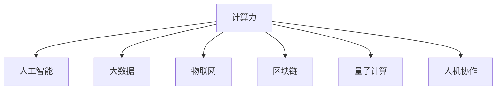

                 

# 人类计算：塑造未来的力量

## 1. 背景介绍

### 1.1 问题由来

人类计算的概念并非新兴事物，自人类社会诞生以来，计算便已深入我们的日常生活和工作。从早期的石制计数到如今的高级计算机，计算技术的进步在很大程度上推动了社会的发展。但直到20世纪下半叶，计算技术才真正开始成为塑造未来的关键力量。

### 1.2 问题核心关键点

当前，计算技术的发展已经到了一个新的历史阶段。计算机性能的指数级提升，使得计算不再是稀缺资源，而是成为推动各行各业发展的强大工具。特别是人工智能、大数据、物联网等领域的迅猛发展，计算技术的作用愈加凸显。

然而，计算技术的发展也带来了新的问题和挑战。如何在计算技术日益普及的同时，保证数据安全、隐私保护、算法透明性和社会责任，成为摆在面前的重要课题。

## 2. 核心概念与联系

### 2.1 核心概念概述

为更好地理解人类计算的原理和应用，本节将介绍几个密切相关的核心概念：

- 计算力(Computing Power)：指计算机在单位时间内执行特定任务的计算能力，通常用浮点运算次数(FLOPS)表示。计算力的提升是推动人类社会发展的关键因素之一。

- 人工智能(Artificial Intelligence, AI)：通过计算机模拟人类智能行为，实现智能化的决策和问题解决。AI的核心在于算法和数据，能够对复杂问题进行建模和求解。

- 大数据(Big Data)：指数据量庞大、结构复杂、来源多样化的数据集合。大数据分析技术能够揭示隐藏在数据背后的模式和趋势，推动科学决策和商业智能。

- 物联网(IoT)：指通过互联网连接各种设备和设施，实现信息的实时交换和共享。物联网技术为智能化的城市管理、工业制造、智慧医疗等应用提供了重要支持。

- 区块链(Blockchain)：一种分布式数据库技术，通过去中心化、不可篡改的方式保障数据安全。区块链在金融、供应链、医疗等领域有着广泛的应用前景。

- 量子计算(Quantum Computing)：利用量子位进行计算，能够解决传统计算机难以应对的复杂问题。量子计算在密码学、化学模拟、优化等领域展现出巨大的潜力。

- 人机协作(Human-Computer Collaboration)：指人类与计算机之间的互动和协作，实现互补优势，提升工作效率和创造力。

这些核心概念之间的逻辑关系可以通过以下Mermaid流程图来展示：



这个流程图展示了一些关键计算技术之间的关系：

1. 计算力是人工智能、大数据、物联网、区块链、量子计算等技术的基础。
2. 人工智能利用计算力进行算法训练和模型推理，实现智能决策。
3. 大数据分析需要对海量数据进行高效计算，计算力是实现大数据技术的关键。
4. 物联网需要实时传输和处理海量数据，计算力是其背后的支撑。
5. 区块链中的分布式共识和验证机制需要大量的计算资源。
6. 量子计算突破了传统计算的极限，可以解决更复杂的问题。
7. 人机协作需要计算技术作为支撑，实现信息的交互和融合。

这些概念共同构成了计算技术的宏伟蓝图，使其在各行各业中发挥着越来越重要的作用。通过理解这些核心概念，我们可以更好地把握计算技术的发展趋势和应用前景。

## 3. 核心算法原理 & 具体操作步骤
### 3.1 算法原理概述

人类计算的核心在于利用计算机的高效计算能力，对数据进行建模、分析和预测，从而实现智能决策和问题解决。在这一过程中，算法和数据是两个至关重要的因素。

一个典型的计算任务通常包括以下几个关键步骤：

1. 数据预处理：对原始数据进行清洗、转换和归一化，准备用于模型训练和推理。
2. 算法选择：根据任务特点选择合适的算法，如机器学习、深度学习、优化算法等。
3. 模型训练：在数据集上训练模型，调整模型参数，使其能够准确预测未知数据。
4. 模型评估：在验证集和测试集上评估模型性能，选择最优模型进行部署。
5. 模型推理：利用训练好的模型对新数据进行推理预测，输出结果。

### 3.2 算法步骤详解

一个典型的计算任务流程可以表示为以下步骤：

**Step 1: 数据预处理**
- 对原始数据进行清洗和去噪，去除缺失值、异常值和噪声。
- 对数据进行归一化或标准化，使其落在合适范围内。
- 将数据集划分为训练集、验证集和测试集，准备用于模型训练和评估。

**Step 2: 算法选择**
- 根据任务类型选择合适的算法，如回归、分类、聚类等。
- 在初步选择算法后，进一步根据数据特征和业务需求，优化算法参数。

**Step 3: 模型训练**
- 在训练集上对模型进行迭代训练，更新模型参数。
- 使用正则化技术（如L2正则、Dropout等）避免过拟合。
- 设置合适的学习率，优化器（如Adam、SGD等），进行模型参数更新。

**Step 4: 模型评估**
- 在验证集上评估模型性能，使用如准确率、召回率、F1值等指标。
- 根据评估结果选择最优模型，避免选择过拟合模型。

**Step 5: 模型推理**
- 利用训练好的模型对新数据进行推理预测，输出结果。
- 对推理结果进行后处理，例如阈值判断、去噪等。

### 3.3 算法优缺点

计算技术具有以下优点：
1. 高效准确：计算机能够快速处理海量数据，进行高精度计算。
2. 可扩展性强：通过分布式计算和并行计算，计算能力可以不断扩展。
3. 可复用性强：算法和模型可以在不同场景下进行复用和优化。
4. 灵活性高：能够快速应对复杂多变的问题，适应性强。

然而，计算技术也存在以下缺点：
1. 计算资源成本高：高性能计算设备（如GPU、TPU等）价格昂贵。
2. 数据隐私风险：大量数据存储和处理可能带来隐私泄露的风险。
3. 算法透明度不足：黑盒算法难以解释其内部决策过程。
4. 对人类监督依赖：计算技术需要人类设计算法、数据标注等监督工作。
5. 技术门槛高：计算技术涉及复杂算法和编程技能，需要较高技术水平。

尽管存在这些局限性，但就目前而言，计算技术仍然是推动社会发展的强大工具。未来相关研究的重点在于如何进一步降低计算成本，提高算法透明度和可解释性，确保数据隐私安全，并从技术和社会层面解决计算技术的挑战。

### 3.4 算法应用领域

计算技术在各行各业中都有着广泛的应用，例如：

- 科学研究：用于分子动力学模拟、气象预报、天文观测等，解决复杂科学问题。
- 工程制造：用于设计优化、质量控制、自动化生产等，提升制造效率和精度。
- 金融服务：用于风险评估、欺诈检测、智能投顾等，优化金融决策。
- 医疗健康：用于疾病诊断、医疗影像分析、基因组学等，提升医疗服务水平。
- 教育培训：用于智能推荐、学习分析、在线辅导等，个性化教育。
- 交通运输：用于交通流量预测、智能调度、无人驾驶等，优化交通系统。
- 智慧城市：用于城市管理、公共安全、环境保护等，提升城市运行效率。

除了上述这些经典应用外，计算技术还被创新性地应用于更多场景中，如可穿戴设备、智能家居、虚拟现实等，为人类生活带来新的体验和便利。随着计算技术的不断进步，相信其在更多领域中将会发挥更大的作用。

## 4. 数学模型和公式 & 详细讲解  
### 4.1 数学模型构建

本节将使用数学语言对计算技术的原理进行更加严格的刻画。

设原始数据集为 $D=\{(x_i, y_i)\}_{i=1}^N, x_i \in \mathcal{X}, y_i \in \mathcal{Y}$，其中 $\mathcal{X}$ 为输入空间，$\mathcal{Y}$ 为输出空间。假设选择线性回归算法进行建模，模型表示为 $f(x; \theta) = \theta^T x + b$，其中 $\theta \in \mathbb{R}^d$ 为模型参数，$b \in \mathbb{R}$ 为偏置项。

定义模型在数据集 $D$ 上的损失函数为：

$$
\mathcal{L}(\theta) = \frac{1}{N} \sum_{i=1}^N (y_i - f(x_i; \theta))^2
$$

其中 $(y_i - f(x_i; \theta))$ 表示模型预测与真实标签之间的差异。最小化损失函数即得到最优模型参数 $\theta^*$。

在实践中，我们通常使用梯度下降等优化算法（如SGD、Adam等）来近似求解上述最优化问题。设 $\eta$ 为学习率，则参数的更新公式为：

$$
\theta \leftarrow \theta - \eta \nabla_{\theta}\mathcal{L}(\theta)
$$

其中 $\nabla_{\theta}\mathcal{L}(\theta)$ 为损失函数对参数 $\theta$ 的梯度，可通过反向传播算法高效计算。

### 4.2 公式推导过程

以下我们以线性回归任务为例，推导损失函数及其梯度的计算公式。

假设模型 $f(x; \theta)$ 在输入 $x$ 上的输出为 $y=f(x; \theta) = \theta^T x + b$，其中 $\theta^T$ 为权重向量，$b$ 为偏置项。真实标签 $y \in \mathcal{Y}$。则损失函数定义为：

$$
\mathcal{L}(\theta) = \frac{1}{N} \sum_{i=1}^N (y_i - y)^2
$$

将其代入经验风险公式，得：

$$
\mathcal{L}(\theta) = \frac{1}{N} \sum_{i=1}^N (y_i - (\theta^T x_i + b))^2
$$

根据链式法则，损失函数对参数 $\theta_k$ 的梯度为：

$$
\frac{\partial \mathcal{L}(\theta)}{\partial \theta_k} = \frac{2}{N} \sum_{i=1}^N (y_i - (\theta^T x_i + b)) x_{i,k}
$$

其中 $x_{i,k}$ 表示输入向量 $x_i$ 中第 $k$ 个特征值。

在得到损失函数的梯度后，即可带入参数更新公式，完成模型的迭代优化。重复上述过程直至收敛，最终得到适应数据集的最优模型参数 $\theta^*$。

## 5. 项目实践：代码实例和详细解释说明
### 5.1 开发环境搭建

在进行计算任务开发前，我们需要准备好开发环境。以下是使用Python进行PyTorch开发的环境配置流程：

1. 安装Anaconda：从官网下载并安装Anaconda，用于创建独立的Python环境。

2. 创建并激活虚拟环境：
```bash
conda create -n pytorch-env python=3.8 
conda activate pytorch-env
```

3. 安装PyTorch：根据CUDA版本，从官网获取对应的安装命令。例如：
```bash
conda install pytorch torchvision torchaudio cudatoolkit=11.1 -c pytorch -c conda-forge
```

4. 安装各类工具包：
```bash
pip install numpy pandas scikit-learn matplotlib tqdm jupyter notebook ipython
```

完成上述步骤后，即可在`pytorch-env`环境中开始计算任务开发。

### 5.2 源代码详细实现

这里我们以线性回归任务为例，给出使用Transformers库进行计算任务开发的PyTorch代码实现。

首先，定义线性回归任务的数据处理函数：

```python
from torch.utils.data import Dataset
import numpy as np
import torch

class LinearRegressionDataset(Dataset):
    def __init__(self, X, y):
        self.X = X
        self.y = y
        
    def __len__(self):
        return len(self.X)
    
    def __getitem__(self, item):
        return torch.from_numpy(self.X[item]).float(), torch.from_numpy(self.y[item]).float()
```

然后，定义模型和优化器：

```python
from transformers import LinearRegressionModel, AdamW

model = LinearRegressionModel()

optimizer = AdamW(model.parameters(), lr=0.01)
```

接着，定义训练和评估函数：

```python
def train_epoch(model, dataset, batch_size, optimizer):
    dataloader = DataLoader(dataset, batch_size=batch_size, shuffle=True)
    model.train()
    epoch_loss = 0
    for batch in dataloader:
        inputs, labels = batch
        model.zero_grad()
        outputs = model(inputs)
        loss = outputs.mse_loss
        epoch_loss += loss.item()
        loss.backward()
        optimizer.step()
    return epoch_loss / len(dataloader)

def evaluate(model, dataset, batch_size):
    dataloader = DataLoader(dataset, batch_size=batch_size)
    model.eval()
    total_loss = 0
    for batch in dataloader:
        inputs, labels = batch
        outputs = model(inputs)
        loss = outputs.mse_loss
        total_loss += loss.item()
    return total_loss / len(dataloader)
```

最后，启动训练流程并在测试集上评估：

```python
epochs = 10
batch_size = 32

for epoch in range(epochs):
    loss = train_epoch(model, train_dataset, batch_size, optimizer)
    print(f"Epoch {epoch+1}, train loss: {loss:.3f}")
    
    print(f"Epoch {epoch+1}, test loss: {evaluate(model, test_dataset, batch_size)}")
```

以上就是使用PyTorch进行线性回归任务计算任务的完整代码实现。可以看到，得益于Transformers库的强大封装，我们可以用相对简洁的代码完成计算任务模型的开发。

### 5.3 代码解读与分析

让我们再详细解读一下关键代码的实现细节：

**LinearRegressionDataset类**：
- `__init__`方法：初始化训练数据和标签。
- `__len__`方法：返回数据集的样本数量。
- `__getitem__`方法：对单个样本进行处理，返回输入和标签。

**模型和优化器**：
- 使用LinearRegressionModel加载预训练的线性回归模型。
- 设置AdamW优化器及其参数，学习率为0.01。

**训练和评估函数**：
- 使用PyTorch的DataLoader对数据集进行批次化加载，供模型训练和推理使用。
- 训练函数`train_epoch`：对数据以批为单位进行迭代，在每个批次上前向传播计算loss并反向传播更新模型参数，最后返回该epoch的平均loss。
- 评估函数`evaluate`：与训练类似，不同点在于不更新模型参数，并在每个batch结束后将预测和标签结果存储下来，最后使用numpy的mse_loss函数计算均方误差。

**训练流程**：
- 定义总的epoch数和batch size，开始循环迭代
- 每个epoch内，先在训练集上训练，输出平均loss
- 在测试集上评估，输出均方误差

可以看到，PyTorch配合Transformers库使得计算任务模型的开发变得简洁高效。开发者可以将更多精力放在数据处理、模型改进等高层逻辑上，而不必过多关注底层的实现细节。

当然，工业级的系统实现还需考虑更多因素，如模型的保存和部署、超参数的自动搜索、更灵活的任务适配层等。但核心的计算任务模型开发流程基本与此类似。

## 6. 实际应用场景
### 6.1 科学研究

计算技术在科学研究中发挥着重要作用。例如，分子动力学模拟、气候模型、天文学数据处理等任务都需要大量计算资源。这些任务通常涉及复杂的算法和庞大的数据集，计算技术能够帮助科学家们高效地解决这些问题。

- **分子动力学模拟**：用于研究分子结构、反应机理等，模拟化学反应过程和生物分子行为。
- **气候模型**：用于预测气候变化、极端天气事件等，支持气象研究和社会决策。
- **天文学数据处理**：用于分析恒星光谱、星系结构等，支持天体物理研究。

通过计算技术，科学家们可以更快地进行数据处理和模型训练，加速科学研究的步伐。

### 6.2 金融服务

计算技术在金融服务中同样有着广泛的应用。例如，风险评估、欺诈检测、智能投顾等任务都需要大量计算资源。这些任务通常涉及复杂的算法和大规模数据集，计算技术能够帮助金融机构高效地进行风险管理和客户服务。

- **风险评估**：用于评估贷款、投资等金融产品的风险，通过计算模型预测违约概率。
- **欺诈检测**：用于检测金融交易中的异常行为，通过计算模型识别和预防欺诈行为。
- **智能投顾**：用于提供个性化投资建议，通过计算模型分析市场趋势和风险因素。

通过计算技术，金融机构可以更快地进行风险评估和欺诈检测，提升客户服务质量。

### 6.3 医疗健康

计算技术在医疗健康领域也有着广泛的应用。例如，疾病诊断、医疗影像分析、基因组学等任务都需要大量计算资源。这些任务通常涉及复杂的算法和大规模数据集，计算技术能够帮助医疗机构高效地进行疾病诊断和医疗研究。

- **疾病诊断**：用于分析患者的症状和病史，通过计算模型预测疾病类型和严重程度。
- **医疗影像分析**：用于分析医学影像数据，通过计算模型识别和定位病变区域。
- **基因组学**：用于分析基因数据，通过计算模型发现疾病相关的基因变异。

通过计算技术，医疗机构可以更快地进行疾病诊断和影像分析，提升医疗服务水平。

### 6.4 未来应用展望

随着计算技术的发展，未来其在各行各业中的应用前景将更加广阔。

- **智慧城市**：用于城市管理、公共安全、环境保护等，提升城市运行效率。
- **智慧农业**：用于农业数据监测、精准农业等，提高农业生产效率和质量。
- **智慧制造**：用于工业自动化、质量控制等，提升制造业的智能化水平。
- **智慧交通**：用于交通流量预测、智能调度等，优化交通系统。
- **智慧教育**：用于个性化教育、学习分析等，提升教育服务质量。

计算技术在各行各业中的深入应用，将带来巨大的社会效益和经济价值。未来，计算技术将进一步推动人类社会的全面进步。

## 7. 工具和资源推荐
### 7.1 学习资源推荐

为了帮助开发者系统掌握计算技术的理论基础和实践技巧，这里推荐一些优质的学习资源：

1. 《计算机科学导论》：由计算机科学界的权威专家编写，全面介绍了计算机科学的基础概念和前沿技术，是入门计算技术的必备书籍。

2. 《深度学习》：由深度学习领域的知名专家撰写，系统介绍了深度学习的原理和应用，涵盖神经网络、优化算法、计算图等核心内容。

3. 《机器学习实战》：通过实际案例和代码实现，帮助读者深入理解机器学习和计算技术的应用。

4. Kaggle数据集和竞赛：Kaggle是全球最大的数据科学竞赛平台，提供大量真实数据和挑战任务，是实践计算技术的绝佳场所。

5. Coursera和edX在线课程：全球顶尖大学和机构提供的在线课程，涵盖机器学习、计算机视觉、自然语言处理等多个领域，是系统学习计算技术的理想选择。

通过对这些资源的学习实践，相信你一定能够快速掌握计算技术的精髓，并用于解决实际的计算问题。

### 7.2 开发工具推荐

高效的开发离不开优秀的工具支持。以下是几款用于计算任务开发的常用工具：

1. PyTorch：基于Python的开源深度学习框架，灵活动态的计算图，适合快速迭代研究。

2. TensorFlow：由Google主导开发的开源深度学习框架，生产部署方便，适合大规模工程应用。

3. Transformers库：HuggingFace开发的NLP工具库，集成了众多SOTA语言模型，支持PyTorch和TensorFlow，是进行计算任务开发的利器。

4. Weights & Biases：模型训练的实验跟踪工具，可以记录和可视化模型训练过程中的各项指标，方便对比和调优。

5. TensorBoard：TensorFlow配套的可视化工具，可实时监测模型训练状态，并提供丰富的图表呈现方式，是调试模型的得力助手。

6. Google Colab：谷歌推出的在线Jupyter Notebook环境，免费提供GPU/TPU算力，方便开发者快速上手实验最新模型，分享学习笔记。

合理利用这些工具，可以显著提升计算任务的开发效率，加快创新迭代的步伐。

### 7.3 相关论文推荐

计算技术的发展源于学界的持续研究。以下是几篇奠基性的相关论文，推荐阅读：

1. 《Distributed Computing: Principles and Practice》：由ACM出版，系统介绍了分布式计算的核心原理和应用。

2. 《Parallel Computing: Architectures and Algorithms》：由IEEE出版，全面介绍了并行计算的核心原理和应用。

3. 《Artificial Intelligence: A Modern Approach》：由人工智能领域的知名专家撰写，系统介绍了人工智能的原理和应用，涵盖机器学习、深度学习、自然语言处理等多个领域。

4. 《Algorithms in Computer Science: An Introduction》：由计算机科学领域的权威专家编写，全面介绍了计算机科学的核心算法和数据结构。

5. 《Machine Learning Yearning》：由深度学习领域的知名专家撰写，系统介绍了机器学习的工程实践和调优技巧。

这些论文代表了大计算技术的发展脉络。通过学习这些前沿成果，可以帮助研究者把握学科前进方向，激发更多的创新灵感。

## 8. 总结：未来发展趋势与挑战

### 8.1 总结

本文对计算技术的原理和应用进行了全面系统的介绍。首先阐述了计算技术在各行各业中的重要性和应用，明确了计算技术在推动社会发展中的关键作用。其次，从原理到实践，详细讲解了计算任务的数学模型和关键步骤，给出了计算任务开发的完整代码实例。同时，本文还广泛探讨了计算技术在科学研究、金融服务、医疗健康等领域的应用前景，展示了计算技术的广阔前景。此外，本文精选了计算技术的各类学习资源，力求为读者提供全方位的技术指引。

通过本文的系统梳理，可以看到，计算技术正在成为推动社会发展的强大工具。计算技术在各行各业中发挥着越来越重要的作用，成为推动科学进步、经济发展和社会治理的关键力量。未来，随着计算技术的不断发展，其在更多领域中将会发挥更大的作用。

### 8.2 未来发展趋势

展望未来，计算技术的发展将呈现以下几个趋势：

1. 高性能计算设备不断进化：高性能计算设备（如GPU、TPU等）将持续升级，带来更高的计算能力和能效比。
2. 分布式计算技术成熟：分布式计算技术将进一步成熟，支持大规模、高并发的计算任务。
3. 量子计算取得突破：量子计算技术将取得突破性进展，解决传统计算难以应对的复杂问题。
4. 边缘计算普及：边缘计算技术将广泛普及，提升数据处理和计算的实时性。
5. 人工智能与计算技术深度融合：人工智能技术与计算技术将深度融合，推动智能决策和智能系统的发展。
6. 数据隐私与安全技术提升：数据隐私和安全技术将进一步提升，保护数据不被滥用。

以上趋势凸显了计算技术的广阔前景。这些方向的探索发展，必将进一步推动计算技术的进步，为社会各个领域的进步提供强大动力。

### 8.3 面临的挑战

尽管计算技术的发展取得了显著成就，但在迈向更加智能化、普适化应用的过程中，仍面临诸多挑战：

1. 数据隐私和安全风险：大量数据存储和处理可能带来隐私泄露的风险。如何保护数据安全，防止数据滥用，仍需进一步研究。
2. 计算资源成本高昂：高性能计算设备价格昂贵，成本较高，如何降低计算成本，提升计算效率，仍需进一步研究。
3. 算法透明度不足：黑盒算法难以解释其内部决策过程，如何提高算法透明度和可解释性，仍需进一步研究。
4. 技术门槛高：计算技术涉及复杂算法和编程技能，需要较高技术水平，如何降低技术门槛，提升普及度，仍需进一步研究。
5. 社会伦理和法律问题：计算技术的应用可能会带来一些伦理和法律问题，如算法偏见、决策透明性等，如何确保技术的公正性，仍需进一步研究。

尽管存在这些挑战，但随着计算技术的不断发展，相关问题的解决有望逐步实现。未来计算技术的研究重点在于如何更好地平衡技术进步与社会需求，确保计算技术的健康发展。

### 8.4 研究展望

面对计算技术面临的种种挑战，未来的研究需要在以下几个方面寻求新的突破：

1. 探索计算技术的普适化应用：如何使计算技术在更多领域中得到应用，提升各行各业的智能化水平。
2. 研究计算技术的安全性和隐私保护：如何确保计算技术的安全性和隐私保护，防止数据滥用和隐私泄露。
3. 开发计算技术的普适化框架：如何开发更加普适的计算技术框架，支持多种场景和应用的计算需求。
4. 提高计算技术的可解释性和透明度：如何提高计算技术的可解释性和透明度，增强算法的可信度和可接受性。
5. 结合社会需求进行计算技术创新：如何结合社会需求进行计算技术创新，提升计算技术的社会效益和经济价值。

这些研究方向的探索，必将引领计算技术迈向更高的台阶，为构建安全、可靠、可解释、可控的智能系统铺平道路。面向未来，计算技术还需要与其他人工智能技术进行更深入的融合，如知识表示、因果推理、强化学习等，多路径协同发力，共同推动智能决策和智能系统的进步。只有勇于创新、敢于突破，才能不断拓展计算技术的边界，让智能技术更好地造福人类社会。

## 9. 附录：常见问题与解答

**Q1：计算技术在科学研究中的应用有哪些？**

A: 计算技术在科学研究中有着广泛的应用，例如：

- 分子动力学模拟：用于研究分子结构、反应机理等，模拟化学反应过程和生物分子行为。
- 气候模型：用于预测气候变化、极端天气事件等，支持气象研究和社会决策。
- 天文学数据处理：用于分析恒星光谱、星系结构等，支持天体物理研究。

通过计算技术，科学家们可以更快地进行数据处理和模型训练，加速科学研究的步伐。

**Q2：计算技术在金融服务中的应用有哪些？**

A: 计算技术在金融服务中也有着广泛的应用，例如：

- 风险评估：用于评估贷款、投资等金融产品的风险，通过计算模型预测违约概率。
- 欺诈检测：用于检测金融交易中的异常行为，通过计算模型识别和预防欺诈行为。
- 智能投顾：用于提供个性化投资建议，通过计算模型分析市场趋势和风险因素。

通过计算技术，金融机构可以更快地进行风险评估和欺诈检测，提升客户服务质量。

**Q3：计算技术在医疗健康中的应用有哪些？**

A: 计算技术在医疗健康领域也有着广泛的应用，例如：

- 疾病诊断：用于分析患者的症状和病史，通过计算模型预测疾病类型和严重程度。
- 医疗影像分析：用于分析医学影像数据，通过计算模型识别和定位病变区域。
- 基因组学：用于分析基因数据，通过计算模型发现疾病相关的基因变异。

通过计算技术，医疗机构可以更快地进行疾病诊断和影像分析，提升医疗服务水平。

**Q4：计算技术在智慧城市中的应用有哪些？**

A: 计算技术在智慧城市中也有着广泛的应用，例如：

- 城市管理：用于城市交通、环境、公共安全等，提升城市运行效率。
- 智慧交通：用于交通流量预测、智能调度等，优化交通系统。
- 公共安全：用于视频监控、人脸识别等，提升城市安全水平。

通过计算技术，城市管理和服务将更加智能化，提升居民生活质量。

**Q5：计算技术在智慧农业中的应用有哪些？**

A: 计算技术在智慧农业中也有着广泛的应用，例如：

- 农业数据监测：用于实时监测农业数据，通过计算模型分析种植效果。
- 精准农业：用于精准施肥、灌溉等，提升农业生产效率和质量。
- 智能设备：用于智能农机、农具等，提升农业生产智能化水平。

通过计算技术，农业生产将更加智能化，提升农业生产效率和质量。

**Q6：计算技术在智慧制造中的应用有哪些？**

A: 计算技术在智慧制造中也有着广泛的应用，例如：

- 工业自动化：用于自动化生产、质量控制等，提升制造业的智能化水平。
- 数据分析：用于数据分析、预测等，优化生产过程。
- 智能设备：用于智能设备、机器人等，提升制造业的智能化水平。

通过计算技术，制造业将更加智能化，提升生产效率和质量。

---

作者：禅与计算机程序设计艺术 / Zen and the Art of Computer Programming

