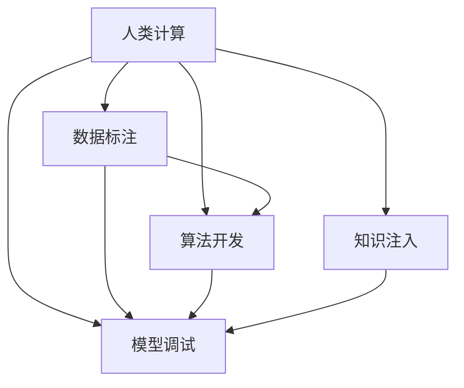

                 

# 人类计算：研究方向和机遇

## 1. 背景介绍

随着计算机技术的高速发展，人工智能（AI）已经从实验室的研究项目逐步走进现实生活，成为推动经济社会发展的重要引擎。然而，即使是最先进的AI系统，也无法替代人类的计算能力。面对复杂问题的解决，人类计算仍是不可或缺的关键因素。本文将深入探讨人类计算的研究方向和机遇，揭示其在推动AI技术发展中的独特价值。

### 1.1 问题由来

在过去几十年中，计算机科学已经取得了长足的进步，但人工智能仍然依赖于大量的人类智慧。从机器学习算法的开发、数据的标注，到模型的训练和调试，每一个环节都离不开人类的参与。尽管自动化和算法优化取得了显著成果，但在很多情况下，人类计算仍然起着至关重要的作用。

### 1.2 问题核心关键点

人类计算的核心关键点包括以下几个方面：

- **数据标注**：高质量的标注数据是训练AI模型的基础。尽管自动化的标注技术不断进步，但在许多情况下，人类仍需对数据进行细致的标注，以确保模型的准确性。
- **算法开发**：AI算法的设计和优化需要人类智慧。复杂的优化问题和设计决策，往往需要人类的直觉和经验。
- **模型调试**：机器学习模型的调试和优化过程复杂，且依赖于人类经验。人类可以更直观地识别模型的不足之处，并进行有效的调整。
- **知识注入**：AI模型的性能受限于数据和算法的质量。人类可以主动将专业知识注入模型中，提升其在新领域的应用能力。

## 2. 核心概念与联系

### 2.1 核心概念概述

要深入理解人类计算的方向和机遇，需要先明确几个核心概念：

- **人类计算**：指在AI系统中，人类参与计算和决策的过程。人类计算不仅包括数据标注和模型调试，还包括对算法和模型的设计优化。
- **数据标注**：指将非结构化数据转化为模型可用的格式，包括文本、图像、语音等。数据标注是人类计算的重要组成部分，确保模型能够准确理解现实世界的信息。
- **算法开发**：指设计和优化AI算法的技术过程，包括模型选择、优化方法、损失函数设计等。人类在算法开发中起着关键作用，特别是在解决复杂问题时。
- **模型调试**：指通过实验和反馈，不断调整和优化AI模型的过程。人类经验在此过程中至关重要，能够帮助识别模型的不足并进行改进。
- **知识注入**：指将人类专业知识注入AI模型中，提升其在新领域的应用能力。知识注入可以包括领域知识、常识推理、常识图谱等。

这些概念之间的联系可以通过以下Mermaid流程图来展示：



这个流程图展示了人类计算的不同组成部分及其相互关系：

1. 数据标注是AI系统的基础，为算法开发和模型训练提供数据支持。
2. 算法开发依赖于数据标注，并对模型训练和调试起到关键作用。
3. 模型调试基于算法开发，进一步优化模型的性能。
4. 知识注入在模型训练和调试过程中起到补充作用，提升模型的应用能力。

## 3. 核心算法原理 & 具体操作步骤

### 3.1 算法原理概述

人类计算的核心算法原理可以概括为以下几点：

- **数据预处理**：包括数据清洗、特征提取、数据增强等技术，将原始数据转化为模型可用的格式。
- **算法设计**：基于领域知识和问题特点，设计适合的AI算法，包括选择模型架构、定义损失函数等。
- **模型训练**：使用标注数据对模型进行训练，通过迭代优化提升模型性能。
- **模型调试**：通过实验和反馈，调整模型参数，优化模型性能。
- **知识注入**：将领域知识注入模型中，提升其在新领域的应用能力。

### 3.2 算法步骤详解

以下是人类计算的主要操作步骤：

1. **数据收集和预处理**：收集和清洗数据，提取特征，进行数据增强，生成标注数据集。
2. **算法设计和选择**：根据问题特点和领域知识，选择合适的算法框架和模型架构。
3. **模型训练**：使用标注数据集对模型进行训练，通过迭代优化提升模型性能。
4. **模型调试和评估**：通过实验和反馈，调整模型参数，评估模型性能。
5. **知识注入和应用**：将领域知识注入模型中，提升其在特定领域的应用能力。

### 3.3 算法优缺点

人类计算的优点和缺点如下：

**优点**：

- **灵活性**：人类计算可以根据具体情况进行调整和优化，适应不同的数据和问题。
- **准确性**：人类在标注和调试过程中能够识别和修正模型的不足之处，确保模型的准确性和可靠性。
- **知识注入**：人类可以主动将专业知识注入模型中，提升其在新领域的应用能力。

**缺点**：

- **成本高**：数据标注和模型调试需要大量的人力资源和时间成本。
- **效率低**：人类计算的效率较低，特别是在大规模数据集和复杂模型上。
- **依赖经验**：人类计算依赖于经验，缺乏自动化的标准化流程。

### 3.4 算法应用领域

人类计算在多个领域都有广泛的应用，以下是几个主要应用领域：

- **自然语言处理（NLP）**：数据标注、算法设计和模型调试在NLP任务中起到了关键作用。
- **计算机视觉**：数据预处理、算法设计和模型调试在图像识别、目标检测等任务中至关重要。
- **医疗健康**：医疗数据标注、算法设计和模型调试在医疗诊断、治疗方案推荐等领域有着重要应用。
- **金融分析**：金融数据标注、算法设计和模型调试在金融风险评估、投资策略优化等领域发挥着重要作用。
- **智能制造**：数据预处理、算法设计和模型调试在智能制造、机器人控制等领域得到了广泛应用。

## 4. 数学模型和公式 & 详细讲解 & 举例说明

### 4.1 数学模型构建

在人类计算中，数学模型是理解和解决问题的基础。以下是几个常见的数学模型：

- **线性回归模型**：用于建立变量之间的线性关系，广泛应用于数据标注和算法设计。
- **分类模型**：如逻辑回归、支持向量机等，用于分类问题的解决。
- **聚类模型**：如K-means、层次聚类等，用于数据聚类和特征提取。

### 4.2 公式推导过程

以下是线性回归模型的推导过程：

假设我们有一个线性回归模型：

$$
y = \theta_0 + \theta_1x_1 + \theta_2x_2 + \cdots + \theta_nx_n
$$

其中，$y$ 为输出变量，$x_i$ 为输入变量，$\theta_i$ 为模型参数。

为了最小化误差平方和，我们定义损失函数：

$$
\mathcal{L} = \frac{1}{2}\sum_{i=1}^n(y_i - \theta_0 - \theta_1x_{i1} - \theta_2x_{i2} - \cdots - \theta_nx_{in})^2
$$

通过求解损失函数的极小值，可以得到模型参数的估计值：

$$
\theta_0 = \frac{1}{N}\sum_{i=1}^ny_i - \frac{1}{N}\sum_{i=1}^nx_i\theta_1 - \frac{1}{N}\sum_{i=1}^nx_i\theta_2 - \cdots - \frac{1}{N}\sum_{i=1}^nx_i\theta_n
$$

### 4.3 案例分析与讲解

以医疗诊断为例，数据标注和算法设计在医疗诊断中起到了关键作用：

1. **数据标注**：收集患者的临床数据和影像数据，进行标注和清洗，生成标注数据集。
2. **算法设计**：选择适合的模型架构和算法，如神经网络、支持向量机等，用于疾病诊断和治疗方案推荐。
3. **模型训练**：使用标注数据集对模型进行训练，通过迭代优化提升模型性能。
4. **模型调试和评估**：通过实验和反馈，调整模型参数，评估模型性能。
5. **知识注入**：将医疗领域的专业知识注入模型中，提升其在新领域的应用能力。

## 5. 项目实践：代码实例和详细解释说明

### 5.1 开发环境搭建

在进行人类计算的项目实践前，需要准备好开发环境。以下是使用Python进行PyTorch开发的环境配置流程：

1. 安装Anaconda：从官网下载并安装Anaconda，用于创建独立的Python环境。
2. 创建并激活虚拟环境：
```bash
conda create -n pytorch-env python=3.8 
conda activate pytorch-env
```

3. 安装PyTorch：根据CUDA版本，从官网获取对应的安装命令。例如：
```bash
conda install pytorch torchvision torchaudio cudatoolkit=11.1 -c pytorch -c conda-forge
```

4. 安装Transformer库：
```bash
pip install transformers
```

5. 安装各类工具包：
```bash
pip install numpy pandas scikit-learn matplotlib tqdm jupyter notebook ipython
```

完成上述步骤后，即可在`pytorch-env`环境中开始项目实践。

### 5.2 源代码详细实现

这里我们以医疗诊断任务为例，给出使用Transformers库对BERT模型进行微调的PyTorch代码实现。

首先，定义医疗诊断任务的数据处理函数：

```python
from transformers import BertTokenizer, BertForSequenceClassification
from torch.utils.data import Dataset
import torch

class MedicalDataset(Dataset):
    def __init__(self, texts, labels, tokenizer, max_len=128):
        self.texts = texts
        self.labels = labels
        self.tokenizer = tokenizer
        self.max_len = max_len
        
    def __len__(self):
        return len(self.texts)
    
    def __getitem__(self, item):
        text = self.texts[item]
        label = self.labels[item]
        
        encoding = self.tokenizer(text, return_tensors='pt', max_length=self.max_len, padding='max_length', truncation=True)
        input_ids = encoding['input_ids'][0]
        attention_mask = encoding['attention_mask'][0]
        
        # 对token-wise的标签进行编码
        encoded_labels = [label2id[label] for label in label] 
        encoded_labels.extend([label2id['O']] * (self.max_len - len(encoded_labels)))
        labels = torch.tensor(encoded_labels, dtype=torch.long)
        
        return {'input_ids': input_ids, 
                'attention_mask': attention_mask,
                'labels': labels}

# 标签与id的映射
label2id = {'O': 0, 'Cancer': 1, 'Diabetes': 2, 'Heart Disease': 3}
id2label = {v: k for k, v in label2id.items()}

# 创建dataset
tokenizer = BertTokenizer.from_pretrained('bert-base-cased')

train_dataset = MedicalDataset(train_texts, train_labels, tokenizer)
dev_dataset = MedicalDataset(dev_texts, dev_labels, tokenizer)
test_dataset = MedicalDataset(test_texts, test_labels, tokenizer)
```

然后，定义模型和优化器：

```python
from transformers import AdamW

model = BertForSequenceClassification.from_pretrained('bert-base-cased', num_labels=len(label2id))

optimizer = AdamW(model.parameters(), lr=2e-5)
```

接着，定义训练和评估函数：

```python
from torch.utils.data import DataLoader
from tqdm import tqdm
from sklearn.metrics import classification_report

device = torch.device('cuda') if torch.cuda.is_available() else torch.device('cpu')
model.to(device)

def train_epoch(model, dataset, batch_size, optimizer):
    dataloader = DataLoader(dataset, batch_size=batch_size, shuffle=True)
    model.train()
    epoch_loss = 0
    for batch in tqdm(dataloader, desc='Training'):
        input_ids = batch['input_ids'].to(device)
        attention_mask = batch['attention_mask'].to(device)
        labels = batch['labels'].to(device)
        model.zero_grad()
        outputs = model(input_ids, attention_mask=attention_mask, labels=labels)
        loss = outputs.loss
        epoch_loss += loss.item()
        loss.backward()
        optimizer.step()
    return epoch_loss / len(dataloader)

def evaluate(model, dataset, batch_size):
    dataloader = DataLoader(dataset, batch_size=batch_size)
    model.eval()
    preds, labels = [], []
    with torch.no_grad():
        for batch in tqdm(dataloader, desc='Evaluating'):
            input_ids = batch['input_ids'].to(device)
            attention_mask = batch['attention_mask'].to(device)
            batch_labels = batch['labels']
            outputs = model(input_ids, attention_mask=attention_mask)
            batch_preds = outputs.logits.argmax(dim=2).to('cpu').tolist()
            batch_labels = batch_labels.to('cpu').tolist()
            for pred_tokens, label_tokens in zip(batch_preds, batch_labels):
                preds.append(pred_tokens[:len(label_tokens)])
                labels.append(label_tokens)
                
    print(classification_report(labels, preds))
```

最后，启动训练流程并在测试集上评估：

```python
epochs = 5
batch_size = 16

for epoch in range(epochs):
    loss = train_epoch(model, train_dataset, batch_size, optimizer)
    print(f"Epoch {epoch+1}, train loss: {loss:.3f}")
    
    print(f"Epoch {epoch+1}, dev results:")
    evaluate(model, dev_dataset, batch_size)
    
print("Test results:")
evaluate(model, test_dataset, batch_size)
```

以上就是使用PyTorch对BERT进行医疗诊断任务微调的完整代码实现。可以看到，得益于Transformer库的强大封装，我们可以用相对简洁的代码完成BERT模型的加载和微调。

### 5.3 代码解读与分析

让我们再详细解读一下关键代码的实现细节：

**MedicalDataset类**：
- `__init__`方法：初始化文本、标签、分词器等关键组件。
- `__len__`方法：返回数据集的样本数量。
- `__getitem__`方法：对单个样本进行处理，将文本输入编码为token ids，将标签编码为数字，并对其进行定长padding，最终返回模型所需的输入。

**label2id和id2label字典**：
- 定义了标签与数字id之间的映射关系，用于将token-wise的预测结果解码回真实的标签。

**训练和评估函数**：
- 使用PyTorch的DataLoader对数据集进行批次化加载，供模型训练和推理使用。
- 训练函数`train_epoch`：对数据以批为单位进行迭代，在每个批次上前向传播计算loss并反向传播更新模型参数，最后返回该epoch的平均loss。
- 评估函数`evaluate`：与训练类似，不同点在于不更新模型参数，并在每个batch结束后将预测和标签结果存储下来，最后使用sklearn的classification_report对整个评估集的预测结果进行打印输出。

**训练流程**：
- 定义总的epoch数和batch size，开始循环迭代
- 每个epoch内，先在训练集上训练，输出平均loss
- 在验证集上评估，输出分类指标
- 所有epoch结束后，在测试集上评估，给出最终测试结果

可以看到，PyTorch配合Transformer库使得BERT微调的代码实现变得简洁高效。开发者可以将更多精力放在数据处理、模型改进等高层逻辑上，而不必过多关注底层的实现细节。

当然，工业级的系统实现还需考虑更多因素，如模型的保存和部署、超参数的自动搜索、更灵活的任务适配层等。但核心的微调范式基本与此类似。

## 6. 实际应用场景

### 6.1 智能医疗

基于大语言模型微调的诊断技术，可以广泛应用于智能医疗系统的构建。传统医疗诊断依赖于医生丰富的经验，但医疗资源短缺、诊断效率低下的问题亟需解决。基于微调技术的大语言模型，可以辅助医生进行疾病诊断和治疗方案推荐，提升医疗服务的智能化水平。

在技术实现上，可以收集医院的历史病例数据，将患者症状和诊断结果构建成监督数据，在此基础上对预训练语言模型进行微调。微调后的模型能够自动理解患者的症状描述，生成可能的诊断结果和治疗建议。对于复杂病例，模型还可以接入检索系统实时搜索相关病例，动态生成诊断报告。如此构建的智能医疗系统，能显著提升疾病诊断的准确性和治疗方案的个性化，助力医疗健康事业的发展。

### 6.2 智慧教育

智能教育领域中，微调技术同样大有可为。传统的教育系统往往依赖教师的经验和知识，无法满足个性化学习的需求。基于微调的大语言模型，可以应用于作业批改、学情分析、知识推荐等方面，因材施教，促进教育公平，提高教学质量。

在实际应用中，可以收集学生的作业、提问、讨论等文本数据，使用微调模型对学生的学习情况进行评估和推荐。通过分析学生的作业质量、互动情况，模型可以生成个性化的学习计划和推荐资源，帮助学生更好地掌握知识。对于教师而言，模型还可以辅助批改作业，减轻教学负担，提高教学效率。

### 6.3 金融风险管理

金融领域面临大量的数据分析和决策任务，传统的人工分析方法效率低下，容易出错。基于微调的大语言模型，可以应用于金融数据分析、风险评估、投资策略优化等领域，提升金融决策的智能化水平。

在金融数据分析方面，微调模型可以处理大量的金融报告、新闻、公告等文本数据，提取关键信息，分析市场趋势。在风险评估方面，微调模型可以对贷款申请、信用评分等数据进行评估，识别潜在的风险点。在投资策略优化方面，微调模型可以分析市场数据，生成投资建议，优化投资组合。

## 7. 工具和资源推荐

### 7.1 学习资源推荐

为了帮助开发者系统掌握人类计算的理论基础和实践技巧，这里推荐一些优质的学习资源：

1. **《Deep Learning Specialization》课程**：由Coursera开设，由Andrew Ng教授讲授，全面介绍了深度学习的理论和实践，涵盖数据标注、算法设计、模型训练等关键环节。
2. **《Human Computing》论文**：总结了人类计算的理论和应用，探讨了人类计算在AI系统中的重要性。
3. **《Pattern Recognition and Machine Learning》书籍**：西瓜书的经典之作，深入浅出地讲解了机器学习的理论基础和实践方法，包括数据标注、算法设计和模型优化等。

通过这些资源的学习实践，相信你一定能够全面掌握人类计算的核心知识，并用于解决实际的AI问题。

### 7.2 开发工具推荐

高效的开发离不开优秀的工具支持。以下是几款用于人类计算开发的常用工具：

1. **PyTorch**：基于Python的开源深度学习框架，灵活动态的计算图，适合快速迭代研究。
2. **TensorFlow**：由Google主导开发的开源深度学习框架，生产部署方便，适合大规模工程应用。
3. **Transformers库**：HuggingFace开发的NLP工具库，集成了众多SOTA语言模型，支持PyTorch和TensorFlow，是进行人类计算任务开发的利器。
4. **Jupyter Notebook**：交互式编程环境，适合进行数据处理、模型训练和评估等任务。

合理利用这些工具，可以显著提升人类计算任务的开发效率，加快创新迭代的步伐。

### 7.3 相关论文推荐

人类计算的研究源于学界的持续研究。以下是几篇奠基性的相关论文，推荐阅读：

1. **《Human Computing》论文**：总结了人类计算的理论和应用，探讨了人类计算在AI系统中的重要性。
2. **《Human-in-the-loop Machine Learning》论文**：讨论了人机协同的学习机制，探讨了人类计算在机器学习中的作用。
3. **《Supervised Sequence Labeling with Recurrent Neural Networks》论文**：介绍了基于RNN的序列标注方法，探讨了人类计算在自然语言处理中的应用。

这些论文代表了大语言模型微调技术的发展脉络。通过学习这些前沿成果，可以帮助研究者把握学科前进方向，激发更多的创新灵感。

## 8. 总结：未来发展趋势与挑战

### 8.1 研究成果总结

本文对人类计算的研究方向和机遇进行了全面系统的介绍。首先阐述了人类计算的研究背景和意义，明确了人类计算在AI系统中的独特价值。其次，从原理到实践，详细讲解了人类计算的核心算法和操作步骤，给出了人类计算任务开发的完整代码实例。同时，本文还广泛探讨了人类计算在智能医疗、智慧教育、金融风险管理等多个行业领域的应用前景，展示了人类计算的广阔应用空间。此外，本文精选了人类计算技术的各类学习资源，力求为读者提供全方位的技术指引。

通过本文的系统梳理，可以看到，人类计算在AI技术的发展中起着不可替代的作用，其灵活性、准确性和知识注入能力，使得AI系统更加智能化和普适化。未来，伴随人类计算技术的不断进步，AI系统的性能和应用范围将得到进一步提升，为社会带来更加深远的影响。

### 8.2 未来发展趋势

展望未来，人类计算技术将呈现以下几个发展趋势：

1. **多模态融合**：人类计算将不仅仅局限于文本数据，还将拓展到图像、视频、语音等多模态数据。多模态信息的融合，将进一步提升AI系统的感知和理解能力。
2. **智能协同**：人类计算将更多地融入到AI系统中，实现人机协同工作，提升系统的智能化水平。智能协同将使得AI系统更加灵活和高效。
3. **知识注入增强**：人类计算将更主动地将领域知识注入AI系统，提升其在特定领域的应用能力。知识注入将使得AI系统更加专业化，适应复杂的应用场景。
4. **数据标注自动化**：随着自动化标注技术的进步，人类计算将更多地应用于数据预处理和特征提取等任务，减少人工干预。
5. **模型优化智能化**：人类计算将更多地应用于模型优化和调参等任务，提升模型的性能和效率。智能化调参将使得AI系统更加自适应，自动优化模型的参数。

以上趋势凸显了人类计算技术的重要性和未来发展方向。这些方向的探索发展，必将进一步提升AI系统的性能和应用范围，为社会带来更加深远的影响。

### 8.3 面临的挑战

尽管人类计算技术已经取得了显著进展，但在迈向更加智能化、普适化应用的过程中，仍然面临诸多挑战：

1. **数据标注成本高**：高质量的数据标注成本较高，特别是在数据量较少的情况下，标注工作难以大规模展开。
2. **模型鲁棒性不足**：人类计算依赖于数据标注和模型调试，模型的鲁棒性和泛化性能有限。
3. **知识注入难度大**：将领域知识注入AI系统，需要克服知识表示和模型融合的困难。
4. **协同效率低**：人机协同工作需要高效的沟通和反馈机制，协同效率较低。
5. **知识注入难度大**：将领域知识注入AI系统，需要克服知识表示和模型融合的困难。

这些挑战需要研究者不断探索和改进，以提升人类计算的效率和效果。

### 8.4 研究展望

面对人类计算所面临的挑战，未来的研究需要在以下几个方面寻求新的突破：

1. **自动化标注技术**：探索自动化标注方法，减少人工标注工作，提升标注效率。
2. **智能化调参方法**：研究智能化调参技术，自动优化模型参数，提升模型性能。
3. **多模态融合技术**：研究多模态融合方法，提升AI系统的感知和理解能力。
4. **智能协同机制**：研究人机协同机制，提升系统的智能化水平和协同效率。
5. **知识注入技术**：研究知识注入技术，将领域知识更有效地注入AI系统。

这些研究方向的探索，必将引领人类计算技术迈向更高的台阶，为构建安全、可靠、可解释、可控的智能系统铺平道路。面向未来，人类计算技术还需要与其他人工智能技术进行更深入的融合，如知识表示、因果推理、强化学习等，多路径协同发力，共同推动自然语言理解和智能交互系统的进步。只有勇于创新、敢于突破，才能不断拓展语言模型的边界，让智能技术更好地造福人类社会。

## 9. 附录：常见问题与解答

**Q1：人类计算是否适用于所有AI任务？**

A: 人类计算在大多数AI任务中都能发挥重要作用，特别是在数据量较小或任务复杂度较高的情况下。然而，对于一些标准化、自动化的任务，人类计算的效率和效果可能不如自动化工具。

**Q2：如何选择合适的数据标注方式？**

A: 数据标注方式应根据任务特点和资源情况进行选择。一般来说，对于标注量较小的情况，可以采用众包标注；对于标注量较大、标注质量要求高的情况，可以采用专业标注。

**Q3：如何优化人类计算的过程？**

A: 优化人类计算的过程可以从以下几个方面入手：
1. **自动化标注**：利用自动化标注工具，减少人工标注工作。
2. **智能化调参**：使用智能化调参方法，自动优化模型参数。
3. **知识注入**：将领域知识注入模型中，提升其在特定领域的应用能力。
4. **多模态融合**：利用多模态数据，提升AI系统的感知和理解能力。

**Q4：人类计算和自动化技术有何区别？**

A: 人类计算强调在AI系统中，人类智慧的参与和决策过程；而自动化技术强调利用算法和自动化工具，减少人工干预，提升效率。两者可以相辅相成，共同推动AI技术的发展。

通过本文的系统梳理，可以看到，人类计算在AI技术的发展中起着不可替代的作用，其灵活性、准确性和知识注入能力，使得AI系统更加智能化和普适化。未来，伴随人类计算技术的不断进步，AI系统的性能和应用范围将得到进一步提升，为社会带来更加深远的影响。

---

作者：禅与计算机程序设计艺术 / Zen and the Art of Computer Programming

