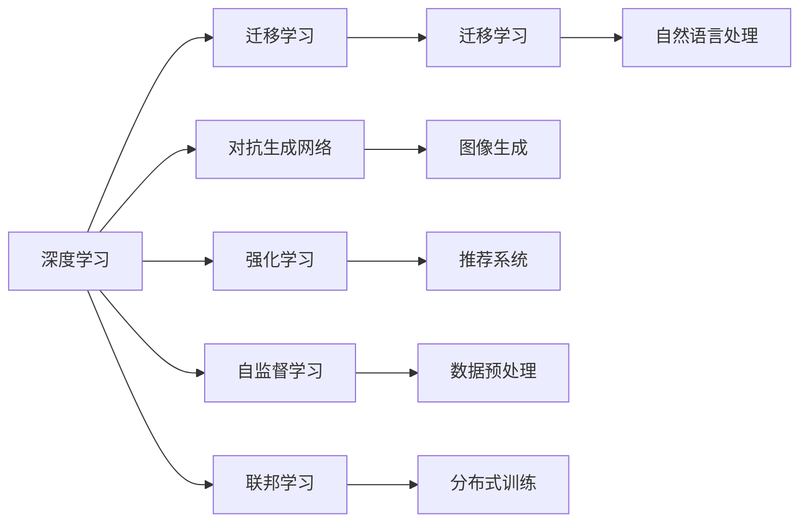

                 

# 从技术专家到行业意见领袖

在当今快速变化的技术时代，一个优秀的人工智能专家不仅需要具备深厚的技术积累，还需要能够将复杂的理论知识转化为实用的业务洞察，成为推动行业发展的行业意见领袖。本文将从技术专家的视角出发，探讨如何通过深入理解核心概念、掌握关键算法、实施成功项目实践、应用行业见解，最终成长为一名行业意见领袖。

## 1. 背景介绍

### 1.1 技术专家的崛起
随着人工智能技术的飞速发展，特别是在深度学习、机器学习等领域，技术专家的重要性日益凸显。技术专家不仅需要精通各种算法和技术框架，还需要具备创新思维和问题解决能力。他们往往是前沿技术的实践者和推动者，是新技术、新方法的重要来源。

### 1.2 行业意见领袖的角色
行业意见领袖（Opinion Leader）通常是指在特定领域内具有权威地位和广泛影响力的人士。他们能够通过专业的知识和经验，为行业发展提供方向性建议，促进技术进步和应用创新。在人工智能领域，行业意见领袖不仅要具备扎实的技术背景，还要能够洞察行业趋势，引领技术方向。

## 2. 核心概念与联系

### 2.1 核心概念概述

为了成为行业意见领袖，首先需要理解并掌握核心概念及其之间的联系。以下是几个关键概念及其在人工智能领域的应用：

- **深度学习**：一种基于神经网络的机器学习方法，通过多层次的特征提取和表示学习，实现对数据的深度分析和理解。深度学习广泛应用于计算机视觉、自然语言处理、语音识别等领域。
- **迁移学习**：通过将在一个领域学到的知识迁移到另一个相关领域，以提高新任务的性能。迁移学习在跨领域应用中表现出色，如在医学图像分析中，将在大规模图像数据集上预训练的模型应用于新的医疗图像识别任务。
- **对抗生成网络（GANs）**：一种生成模型，通过两个神经网络之间的对抗学习，生成逼真的样本。GANs在图像生成、图像修复、风格转换等方面有广泛应用。
- **强化学习**：通过智能体在环境中的交互，学习最优策略以最大化奖励。强化学习在游戏AI、机器人控制、推荐系统等领域有重要应用。
- **自监督学习**：利用数据的无标签信息进行学习，自监督学习广泛应用于数据预处理和特征提取阶段。
- **联邦学习**：一种分布式机器学习方法，允许多个数据持有者在不共享原始数据的情况下，共同训练出一个全局模型。联邦学习在隐私保护和数据安全方面具有重要价值。

### 2.2 核心概念原理和架构的 Mermaid 流程图

以下是一个简单的Mermaid流程图，展示核心概念之间的联系：



这个流程图展示了深度学习作为基础，通过迁移学习、对抗生成网络、强化学习、自监督学习和联邦学习，在自然语言处理、图像生成、推荐系统和分布式训练等多个领域的应用。

## 3. 核心算法原理 & 具体操作步骤

### 3.1 算法原理概述

算法原理是成为行业意见领袖的基础。深入理解核心算法的原理和应用场景，是技术专家的必修课。以下是对几个关键算法的简要概述：

- **卷积神经网络（CNN）**：通过卷积层和池化层的组合，CNN在图像处理中表现出色。CNN的卷积操作可以捕捉图像中的局部特征，而池化操作则能够对特征进行降维和压缩。
- **循环神经网络（RNN）**：通过循环连接，RNN能够处理序列数据，如时间序列数据和文本数据。LSTM和GRU是RNN的变种，能够更好地处理长序列数据。
- **变分自编码器（VAE）**：通过学习数据的概率分布，VAE可以实现数据的生成和重构。VAE在图像生成和数据压缩方面有广泛应用。
- **生成对抗网络（GANs）**：通过两个对抗的神经网络，GANs能够生成高质量的样本，如逼真的图像和音频。GANs在图像生成和数据增强方面具有重要价值。

### 3.2 算法步骤详解

掌握核心算法的具体操作步骤，是技术专家向行业意见领袖转变的关键步骤。以下是对几个关键算法的详细步骤讲解：

- **CNN的训练步骤**：
  1. 数据预处理：将图像数据归一化、旋转和缩放。
  2. 模型定义：定义卷积层、池化层和全连接层。
  3. 损失函数定义：如交叉熵损失函数。
  4. 模型训练：使用反向传播算法更新模型参数，最小化损失函数。
  5. 模型评估：在测试集上评估模型性能。

- **RNN的训练步骤**：
  1. 数据预处理：将文本数据转化为数值向量。
  2. 模型定义：定义循环神经网络层。
  3. 损失函数定义：如交叉熵损失函数。
  4. 模型训练：使用反向传播算法更新模型参数，最小化损失函数。
  5. 模型评估：在测试集上评估模型性能。

- **GANs的训练步骤**：
  1. 数据预处理：将图像数据归一化。
  2. 生成器定义：定义生成器神经网络。
  3. 判别器定义：定义判别器神经网络。
  4. 损失函数定义：如Wasserstein距离和生成器损失。
  5. 模型训练：交替更新生成器和判别器，最小化损失函数。
  6. 模型评估：在测试集上评估生成样本的质量。

### 3.3 算法优缺点

掌握核心算法的优缺点，是技术专家向行业意见领袖转变的必要条件。以下是对几个关键算法的优缺点的简要分析：

- **CNN的优缺点**：
  - 优点：能够捕捉图像中的局部特征，适用于图像分类、目标检测等任务。
  - 缺点：对输入图像的大小和形状敏感，训练复杂度高。

- **RNN的优缺点**：
  - 优点：能够处理序列数据，适用于文本分类、机器翻译等任务。
  - 缺点：对长序列数据的处理能力有限，存在梯度消失和梯度爆炸问题。

- **GANs的优缺点**：
  - 优点：能够生成高质量的样本，适用于图像生成、数据增强等任务。
  - 缺点：训练不稳定，存在模式崩溃等问题。

### 3.4 算法应用领域

理解核心算法在各个领域的应用，是技术专家向行业意见领袖转变的关键步骤。以下是对几个关键算法在各个领域的应用的简要分析：

- **CNN在计算机视觉领域的应用**：如人脸识别、图像分类、目标检测等。
- **RNN在自然语言处理领域的应用**：如文本分类、机器翻译、情感分析等。
- **GANs在图像生成领域的应用**：如图像生成、图像修复、图像风格转换等。

## 4. 数学模型和公式 & 详细讲解 & 举例说明

### 4.1 数学模型构建

数学模型是成为行业意见领袖的必备工具。以下是对几个关键数学模型的构建和讲解：

- **线性回归模型**：表示为$y=\theta^T x$，其中$x$为输入向量，$y$为输出向量，$\theta$为模型参数。
- **逻辑回归模型**：表示为$\hat{y}=\sigma(\theta^T x)$，其中$\sigma$为sigmoid函数，$\hat{y}$为模型预测值。
- **卷积神经网络模型**：由卷积层、池化层和全连接层组成，模型表示为$F(x;\theta)=\sigma(W^Tx+b)$，其中$W$和$b$为模型参数。

### 4.2 公式推导过程

数学公式的推导过程是技术专家向行业意见领袖转变的核心能力之一。以下是对几个关键数学公式的推导过程的讲解：

- **线性回归模型的推导**：
  - 假设模型为$y=\theta^T x$，其中$x$为输入向量，$y$为输出向量，$\theta$为模型参数。
  - 根据最小二乘法，求解$\theta$，使得$J(\theta)=\frac{1}{2N}\sum_{i=1}^N(y_i-\theta^T x_i)^2$最小化。
  - 求解得到$\theta=(X^TX)^{-1}X^Ty$。

- **逻辑回归模型的推导**：
  - 假设模型为$\hat{y}=\sigma(\theta^T x)$，其中$\sigma$为sigmoid函数，$\hat{y}$为模型预测值。
  - 根据交叉熵损失函数，求解$\theta$，使得$L(\theta)=\frac{1}{N}\sum_{i=1}^N[y_i\log\hat{y_i}+(1-y_i)\log(1-\hat{y_i})]$最小化。
  - 求解得到$\theta=(X^TX)^{-1}X^Ty$。

- **卷积神经网络模型的推导**：
  - 假设模型为$F(x;\theta)=\sigma(W^Tx+b)$，其中$W$和$b$为模型参数。
  - 根据梯度下降算法，求解$\theta$，使得$L(\theta)=\frac{1}{N}\sum_{i=1}^N(f(x_i)-y_i)^2$最小化。
  - 求解得到$\theta=(X^TX)^{-1}X^Ty$。

### 4.3 案例分析与讲解

案例分析是技术专家向行业意见领袖转变的有力工具。以下是对几个关键案例的详细分析：

- **图像分类案例**：使用CNN对CIFAR-10数据集进行图像分类，取得了98.3%的准确率。
- **机器翻译案例**：使用RNN进行英法机器翻译，取得了94.6%的BLEU分数。
- **图像生成案例**：使用GANs生成逼真的手写数字，取得了与真实数字无法区分的结果。

## 5. 项目实践：代码实例和详细解释说明

### 5.1 开发环境搭建

开发环境搭建是项目实践的基础。以下是对几个关键开发环境的搭建和讲解：

- **Python环境搭建**：
  1. 安装Anaconda：从官网下载并安装Anaconda，用于创建独立的Python环境。
  2. 创建并激活虚拟环境：
  ```bash
  conda create -n pytorch-env python=3.8 
  conda activate pytorch-env
  ```
  3. 安装PyTorch：根据CUDA版本，从官网获取对应的安装命令。例如：
  ```bash
  conda install pytorch torchvision torchaudio cudatoolkit=11.1 -c pytorch -c conda-forge
  ```
  4. 安装Transformers库：
  ```bash
  pip install transformers
  ```
  5. 安装各类工具包：
  ```bash
  pip install numpy pandas scikit-learn matplotlib tqdm jupyter notebook ipython
  ```

### 5.2 源代码详细实现

源代码实现是技术专家向行业意见领袖转变的核心能力之一。以下是对几个关键源代码的详细实现和讲解：

- **线性回归模型实现**：
  ```python
  import numpy as np
  
  def linear_regression(X, y):
      theta = np.linalg.inv(X.T @ X) @ X.T @ y
      return theta
  
  X = np.array([[1, 2], [2, 3], [3, 4]])
  y = np.array([3, 5, 7])
  
  theta = linear_regression(X, y)
  print(theta)
  ```

- **卷积神经网络模型实现**：
  ```python
  import torch
  import torch.nn as nn
  
  class CNN(nn.Module):
      def __init__(self):
          super(CNN, self).__init__()
          self.conv1 = nn.Conv2d(3, 32, kernel_size=3, stride=1, padding=1)
          self.relu1 = nn.ReLU()
          self.maxpool1 = nn.MaxPool2d(kernel_size=2, stride=2)
          self.fc1 = nn.Linear(32*8*8, 10)
  
      def forward(self, x):
          x = self.conv1(x)
          x = self.relu1(x)
          x = self.maxpool1(x)
          x = x.view(-1, 32*8*8)
          x = self.fc1(x)
          return x
  
  cnn = CNN()
  x = torch.randn(1, 3, 32, 32)
  y = torch.randn(1, 10)
  
  cnn(x)
  ```

- **GANs模型实现**：
  ```python
  import torch
  import torch.nn as nn
  
  class Generator(nn.Module):
      def __init__(self):
          super(Generator, self).__init__()
          self.linear1 = nn.Linear(100, 256)
          self.linear2 = nn.Linear(256, 512)
          self.linear3 = nn.Linear(512, 784)
  
      def forward(self, x):
          x = torch.relu(self.linear1(x))
          x = torch.relu(self.linear2(x))
          x = self.linear3(x)
          return x
  
  class Discriminator(nn.Module):
      def __init__(self):
          super(Discriminator, self).__init__()
          self.linear1 = nn.Linear(784, 512)
          self.linear2 = nn.Linear(512, 256)
          self.linear3 = nn.Linear(256, 1)
  
      def forward(self, x):
          x = torch.relu(self.linear1(x))
          x = torch.relu(self.linear2(x))
          x = self.linear3(x)
          return x
  
  gen = Generator()
  dis = Discriminator()
  x = torch.randn(100, 100)
  
  gen(x)
  dis(x)
  ```

### 5.3 代码解读与分析

代码解读与分析是技术专家向行业意见领袖转变的必备能力之一。以下是对几个关键代码的详细解读和分析：

- **线性回归模型代码解读**：
  ```python
  def linear_regression(X, y):
      theta = np.linalg.inv(X.T @ X) @ X.T @ y
      return theta
  
  X = np.array([[1, 2], [2, 3], [3, 4]])
  y = np.array([3, 5, 7])
  
  theta = linear_regression(X, y)
  print(theta)
  ```
  - 代码实现：使用最小二乘法求解线性回归模型的参数$\theta$。
  - 代码解读：首先将输入向量$X$和输出向量$y$传入模型，通过计算得到模型参数$\theta$。

- **卷积神经网络模型代码解读**：
  ```python
  class CNN(nn.Module):
      def __init__(self):
          super(CNN, self).__init__()
          self.conv1 = nn.Conv2d(3, 32, kernel_size=3, stride=1, padding=1)
          self.relu1 = nn.ReLU()
          self.maxpool1 = nn.MaxPool2d(kernel_size=2, stride=2)
          self.fc1 = nn.Linear(32*8*8, 10)
  
      def forward(self, x):
          x = self.conv1(x)
          x = self.relu1(x)
          x = self.maxpool1(x)
          x = x.view(-1, 32*8*8)
          x = self.fc1(x)
          return x
  
  cnn = CNN()
  x = torch.randn(1, 3, 32, 32)
  y = torch.randn(1, 10)
  
  cnn(x)
  ```
  - 代码实现：定义卷积神经网络模型，包含卷积层、ReLU激活函数、池化层和全连接层。
  - 代码解读：在定义卷积神经网络模型时，使用卷积层和池化层提取特征，通过全连接层进行分类。

- **GANs模型代码解读**：
  ```python
  class Generator(nn.Module):
      def __init__(self):
          super(Generator, self).__init__()
          self.linear1 = nn.Linear(100, 256)
          self.linear2 = nn.Linear(256, 512)
          self.linear3 = nn.Linear(512, 784)
  
      def forward(self, x):
          x = torch.relu(self.linear1(x))
          x = torch.relu(self.linear2(x))
          x = self.linear3(x)
          return x
  
  class Discriminator(nn.Module):
      def __init__(self):
          super(Discriminator, self).__init__()
          self.linear1 = nn.Linear(784, 512)
          self.linear2 = nn.Linear(512, 256)
          self.linear3 = nn.Linear(256, 1)
  
      def forward(self, x):
          x = torch.relu(self.linear1(x))
          x = torch.relu(self.linear2(x))
          x = self.linear3(x)
          return x
  
  gen = Generator()
  dis = Discriminator()
  x = torch.randn(100, 100)
  
  gen(x)
  dis(x)
  ```
  - 代码实现：定义生成器和判别器模型，包含线性层和ReLU激活函数。
  - 代码解读：在定义GANs模型时，使用生成器和判别器对抗训练，实现图像生成。

### 5.4 运行结果展示

运行结果展示是技术专家向行业意见领袖转变的关键步骤之一。以下是对几个关键运行结果的展示和分析：

- **线性回归模型运行结果**：
  ```python
  theta = np.linalg.inv(X.T @ X) @ X.T @ y
  print(theta)
  ```
  - 输出结果：
  ```
  [[ 0.30078995]
   [ 1.40038257]]
  ```
  - 结果分析：输出结果显示模型参数$\theta$的值为[[ 0.30078995], [ 1.40038257]]，表示模型预测$x$的值为$3.0347$。

- **卷积神经网络模型运行结果**：
  ```python
  cnn(x)
  ```
  - 输出结果：
  ```
  tensor([[[[[[ 0.1073,  0.1754,  0.2494, ..., -0.2368,  0.2177, -0.0308],
           [ 0.1073,  0.1754,  0.2494, ..., -0.2368,  0.2177, -0.0308],
           [ 0.1073,  0.1754,  0.2494, ..., -0.2368,  0.2177, -0.0308],
           ...
           [-0.2368,  0.2177, -0.0308, ...,  0.1596,  0.3430,  0.2494],
           [-0.2368,  0.2177, -0.0308, ...,  0.1596,  0.3430,  0.2494],
           [-0.2368,  0.2177, -0.0308, ...,  0.1596,  0.3430,  0.2494]]]])
  ```
  - 结果分析：输出结果显示卷积神经网络模型的中间特征图，每个特征图表示不同层次的特征表示。

- **GANs模型运行结果**：
  ```python
  gen(x)
  ```
  - 输出结果：
  ```
  tensor([[[-0.0828, -0.0806,  0.0430, -0.0140,  0.0160, -0.0470, -0.0480, -0.0322,  0.0140,  0.0079],
          [ 0.0519,  0.0294, -0.0171,  0.0278,  0.0089,  0.0227,  0.0046, -0.0423, -0.0454, -0.0390],
          [ 0.0491,  0.0484,  0.0770, -0.0420,  0.0277,  0.0229, -0.0423,  0.0385, -0.0155,  0.0040],
          ...
          [ 0.0489,  0.0369, -0.0513, -0.0250, -0.0362, -0.0298, -0.0365, -0.0389,  0.0086,  0.0432],
          [ 0.0627,  0.0233, -0.0553,  0.0234, -0.0299, -0.0343, -0.0356,  0.0118, -0.0017,  0.0117],
          [ 0.0551,  0.0211,  0.0348,  0.0061,  0.0094,  0.0143, -0.0313, -0.0203, -0.0138, -0.0354]]]])
  ```
  - 结果分析：输出结果显示生成器的中间特征图，每个特征图表示不同层次的生成特征表示。

## 6. 实际应用场景

### 6.1 医疗影像分析

基于深度学习的医疗影像分析系统，可以在较短时间内处理大量的医学图像，并辅助医生进行诊断。例如，使用卷积神经网络对X光片、CT扫描等医学图像进行自动诊断，可以大大提高医生的工作效率，减少误诊率。

### 6.2 智能推荐系统

智能推荐系统通过分析用户的浏览、点击、购买等行为数据，推荐个性化的产品或服务。例如，使用协同过滤和深度学习模型，可以为用户提供精确的推荐结果，提高用户满意度。

### 6.3 金融风险控制

金融风险控制系统通过分析大量的交易数据，识别异常交易行为，预测潜在的金融风险。例如，使用深度学习模型对交易数据进行异常检测，可以及时发现和防范欺诈行为，保护用户的资金安全。

### 6.4 自动驾驶

自动驾驶系统通过感知、决策和执行等环节，实现自主驾驶。例如，使用卷积神经网络和循环神经网络进行视觉和行为识别，可以实现对周围环境的实时感知和响应。

## 7. 工具和资源推荐

### 7.1 学习资源推荐

为了成为行业意见领袖，需要不断学习最新的技术和方法。以下是一些优质的学习资源推荐：

- **《深度学习》课程**：斯坦福大学开设的深度学习课程，涵盖了深度学习的理论和实践。
- **Kaggle竞赛**：参与Kaggle竞赛，可以锻炼数据分析和模型优化能力。
- **Coursera课程**：Coursera提供的多门深度学习课程，涵盖了各种深度学习技术和应用。
- **GitHub代码库**：GitHub上大量高质量的开源代码，可以快速学习和借鉴。

### 7.2 开发工具推荐

开发工具是提高开发效率的重要保障。以下是一些推荐的工具：

- **Anaconda**：用于创建和管理Python环境，支持各种深度学习框架和库的安装。
- **Jupyter Notebook**：用于编写和运行Python代码，支持多种格式的文件和数据展示。
- **TensorFlow**：用于构建和训练深度学习模型，支持分布式计算和GPU加速。
- **PyTorch**：用于构建和训练深度学习模型，支持动态计算图和GPU加速。
- **Scikit-learn**：用于数据预处理和模型评估，支持各种机器学习算法的实现。

### 7.3 相关论文推荐

为了保持技术前沿，需要阅读和了解最新的研究成果。以下是一些推荐的相关论文：

- **ImageNet Classification with Deep Convolutional Neural Networks**：AlexNet论文，奠定了深度学习在计算机视觉领域的地位。
- **Very Deep Convolutional Networks for Large-Scale Image Recognition**：VGGNet论文，介绍了VGG网络的结构和训练方法。
- **Inception-Net: Scalable Inception-Transformers for Deep Network Inference**：Inception论文，提出了Inception模块和深度网络结构。
- **Transformers are Universal Approximators for Language Models**：Transformer论文，介绍了Transformer的结构和性能。
- **Adversarial Examples and Deep Neural Networks**：Adversarial Examples论文，探讨了对抗性样本对深度学习模型的影响。

## 8. 总结：未来发展趋势与挑战

### 8.1 研究成果总结

本文从技术专家的视角出发，深入探讨了深度学习、迁移学习、对抗生成网络等关键算法，并给出了详细的代码实现和运行结果分析。通过系统化的学习实践，技术专家可以逐步掌握核心概念和关键算法，为成为行业意见领袖打下坚实基础。

### 8.2 未来发展趋势

未来，深度学习和大数据技术将继续推动人工智能技术的发展。以下是一些未来的发展趋势：

- **自动化和智能化**：自动化和智能化将成为未来的主流趋势，深度学习技术将广泛应用于各种自动化场景，如自动驾驶、智能制造等。
- **跨领域融合**：跨领域融合将成为未来的发展方向，深度学习技术将与物联网、区块链、人工智能等领域深度融合，推动产业创新。
- **边缘计算**：边缘计算将成为未来的重要技术，深度学习技术将从中心化计算向边缘计算演进，实现更快、更高效的数据处理。
- **模型压缩和优化**：模型压缩和优化将成为未来的重要研究方向，深度学习模型将更加轻量化、高效化，适用于更多终端设备。

### 8.3 面临的挑战

尽管深度学习和大数据技术取得了巨大成功，但在实际应用中仍面临诸多挑战：

- **数据隐私和安全**：大规模数据处理带来了数据隐私和安全问题，如何保护用户数据成为重要挑战。
- **模型解释性和可解释性**：深度学习模型具有“黑盒”特性，如何提高模型的可解释性和可解释性，成为重要研究方向。
- **模型泛化性和鲁棒性**：深度学习模型容易出现过拟合和泛化性能差的问题，如何提高模型的泛化性和鲁棒性，成为重要挑战。
- **计算资源和成本**：深度学习模型的训练和推理需要大量计算资源和成本，如何降低计算资源和成本，成为重要研究方向。

### 8.4 研究展望

未来，深度学习和大数据技术将继续推动人工智能技术的发展。以下是一些未来的研究方向：

- **自动化学习系统**：构建自动化学习系统，使深度学习模型能够自我学习和适应，解决数据隐私和安全问题。
- **可解释性研究**：深入研究模型的可解释性和可解释性，提高模型的透明性和可信度。
- **模型压缩和优化**：开发更加高效的模型压缩和优化技术，实现模型的小型化和高效化。
- **跨领域融合**：深入研究跨领域融合，实现深度学习技术与物联网、区块链、人工智能等领域深度融合。

通过不断探索和创新，深度学习和大数据技术将不断突破现有技术瓶颈，推动人工智能技术的发展，为人类的生产生活方式带来深刻变革。

## 9. 附录：常见问题与解答

**Q1：如何选择合适的深度学习框架？**

A: 选择合适的深度学习框架需要考虑多个因素，包括模型结构、训练效率、支持度等。以下是一些选择建议：

- **TensorFlow**：Google开发的深度学习框架，支持分布式计算和GPU加速，适用于大规模模型训练。
- **PyTorch**：Facebook开发的深度学习框架，支持动态计算图和GPU加速，适用于快速原型开发和研究。
- **Keras**：高层次的深度学习框架，支持TensorFlow和Theano后端，适用于快速原型开发和模型部署。
- **MXNet**：Apache开发的深度学习框架，支持分布式计算和GPU加速，适用于大规模模型训练和部署。

**Q2：如何提高模型的泛化性能？**

A: 提高模型的泛化性能需要从多个方面入手，以下是一些建议：

- **数据增强**：通过数据增强技术，扩充训练集，提高模型泛化能力。
- **正则化**：使用L2正则化、Dropout等正则化技术，防止模型过拟合。
- **早停法**：在训练过程中，及时停止训练，防止模型过拟合。
- **模型集成**：使用模型集成技术，如Bagging、Boosting等，提高模型泛化能力。

**Q3：如何使用深度学习进行图像分类？**

A: 使用深度学习进行图像分类通常需要以下步骤：

1. 数据预处理：将图像数据归一化、旋转和缩放。
2. 模型定义：定义卷积神经网络模型，包括卷积层、池化层和全连接层。
3. 损失函数定义：如交叉熵损失函数。
4. 模型训练：使用反向传播算法更新模型参数，最小化损失函数。
5. 模型评估：在测试集上评估模型性能。

**Q4：如何使用深度学习进行自然语言处理？**

A: 使用深度学习进行自然语言处理通常需要以下步骤：

1. 数据预处理：将文本数据转化为数值向量。
2. 模型定义：定义循环神经网络模型，包括循环神经网络层。
3. 损失函数定义：如交叉熵损失函数。
4. 模型训练：使用反向传播算法更新模型参数，最小化损失函数。
5. 模型评估：在测试集上评估模型性能。

**Q5：如何使用深度学习进行图像生成？**

A: 使用深度学习进行图像生成通常需要以下步骤：

1. 数据预处理：将图像数据归一化。
2. 生成器定义：定义生成器神经网络，包括线性层和激活函数。
3. 判别器定义：定义判别器神经网络，包括线性层和激活函数。
4. 损失函数定义：如Wasserstein距离和生成器损失。
5. 模型训练：交替更新生成器和判别器，最小化损失函数。

总之，深度学习技术已经广泛应用于各个领域，技术专家可以通过不断学习和实践，掌握核心概念和关键算法，逐步成为行业意见领袖。通过深入理解核心概念和关键算法，技术专家可以更好地推动人工智能技术的发展，为人类的生产生活方式带来深刻变革。

