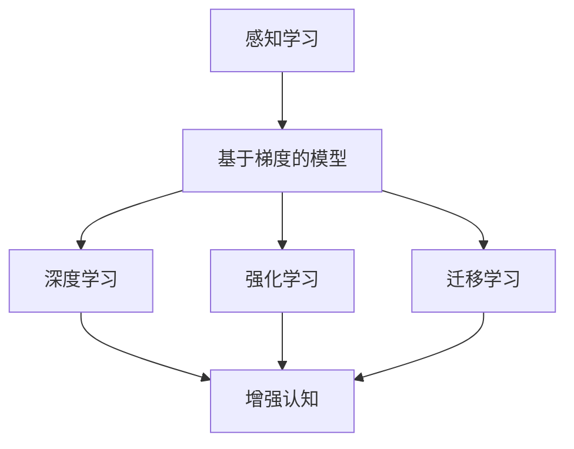

                 

# 从简单到深刻的认知发展

> 关键词：认知发展, 简单到深刻, 人工智能, 机器学习, 深度学习, 神经网络, 强化学习, 迁移学习

## 1. 背景介绍

### 1.1 问题由来

人类认知的发展，是一个从简单到深刻、从具体到抽象、从零散到系统的过程。在这一过程中，神经系统通过不断学习新知识、调整原有认知，逐步建立起对世界的深入理解和丰富的表达能力。

在人工智能领域，这一过程可以被类比为机器学习、深度学习、强化学习和迁移学习等算法的发展。这些算法和技术，都是通过不断提升模型的学习能力、表示能力和泛化能力，从而实现从简单到深刻、从具体到抽象、从零散到系统的认知发展。

### 1.2 问题核心关键点

人工智能的认知发展可以分为几个阶段：

- **感知学习**：通过简单的感知器、线性回归等浅层模型，进行特征提取和简单的模式识别。
- **基于梯度的模型**：使用反向传播算法训练的多层感知器（MLP）、卷积神经网络（CNN）等模型，进行更复杂的特征提取和模式识别。
- **深度学习**：使用多层次的非线性网络结构，如卷积神经网络（CNN）、循环神经网络（RNN）、变分自编码器（VAE）等，学习更高级的特征表示。
- **强化学习**：通过与环境的交互，学习最优策略，解决复杂的决策问题。
- **迁移学习**：利用已有知识进行新的任务学习，加速模型适应新任务的能力。
- **增强认知**：结合符号逻辑、因果推断、常识推理等工具，进一步提升模型对复杂世界的认知能力。

这些算法和技术，分别对应着人类认知的不同层次，从简单的感知学习，到复杂的增强认知，展现出了认知发展的内在逻辑和规律。

## 2. 核心概念与联系

### 2.1 核心概念概述

为了更好地理解人工智能认知发展的逻辑关系，本节将介绍几个密切相关的核心概念：

- **感知学习**：通过简单的感知器或线性模型，学习输入数据的基本特征。
- **基于梯度的模型**：使用反向传播算法训练的神经网络，学习复杂的多层次特征表示。
- **深度学习**：使用深层非线性网络结构，学习高层次的抽象特征表示。
- **强化学习**：通过与环境的交互，学习最优策略，解决复杂的决策问题。
- **迁移学习**：利用已有知识进行新的任务学习，加速模型适应新任务的能力。
- **增强认知**：结合符号逻辑、因果推断、常识推理等工具，进一步提升模型对复杂世界的认知能力。

这些概念之间的逻辑关系可以通过以下Mermaid流程图来展示：



这个流程图展示了一系列算法和技术的发展脉络：

1. 感知学习为基于梯度的模型提供了基本的特征提取能力。
2. 基于梯度的模型在深度学习的基础上，进一步学习高层次的抽象特征。
3. 深度学习通过多层次的非线性网络结构，学习更为复杂的特征表示。
4. 强化学习通过与环境的交互，学习最优决策策略。
5. 迁移学习利用已有知识，加速新任务的适应过程。
6. 增强认知通过结合符号逻辑和常识推理，提升模型的认知能力。

这些核心概念共同构成了人工智能认知发展的框架，展现了从简单到深刻、从具体到抽象、从零散到系统的认知发展路径。

## 3. 核心算法原理 & 具体操作步骤

### 3.1 算法原理概述

人工智能的认知发展，本质上是模型学习能力和表示能力的不断提升。这一过程通常通过以下几种算法和技术来实现：

- **感知学习**：使用简单的线性模型或感知器，进行基本的特征提取和模式识别。
- **基于梯度的模型**：使用反向传播算法训练的神经网络，学习复杂的多层次特征表示。
- **深度学习**：使用多层非线性网络结构，学习高层次的抽象特征表示。
- **强化学习**：通过与环境的交互，学习最优策略，解决复杂的决策问题。
- **迁移学习**：利用已有知识进行新的任务学习，加速模型适应新任务的能力。
- **增强认知**：结合符号逻辑、因果推断、常识推理等工具，进一步提升模型对复杂世界的认知能力。

这些算法和技术，分别对应着认知发展的不同层次，从简单的感知学习，到复杂的增强认知，展现了认知发展的内在逻辑和规律。

### 3.2 算法步骤详解

人工智能的认知发展可以分为以下几个关键步骤：

**Step 1: 数据准备和模型选择**
- 收集标注数据，划分为训练集、验证集和测试集。
- 选择适合的模型结构和超参数，如网络深度、层数、激活函数、优化器等。

**Step 2: 模型训练**
- 使用训练集进行模型训练，通过反向传播算法更新模型参数。
- 周期性在验证集上评估模型性能，根据性能指标决定是否触发Early Stopping。
- 重复上述步骤直至满足预设的迭代轮数或Early Stopping条件。

**Step 3: 模型评估和优化**
- 在测试集上评估模型性能，对比训练前后的精度提升。
- 使用正则化技术、对抗训练、参数高效微调等方法，进一步优化模型性能。
- 结合符号逻辑、因果推断、常识推理等工具，提升模型对复杂世界的认知能力。

**Step 4: 模型部署和应用**
- 使用训练好的模型进行推理预测，集成到实际的应用系统中。
- 持续收集新的数据，定期重新训练和微调模型，以适应数据分布的变化。

以上是人工智能认知发展的一般流程。在实际应用中，还需要针对具体任务的特点，对模型训练、评估和优化过程进行优化设计，如改进训练目标函数，引入更多的正则化技术，搜索最优的超参数组合等，以进一步提升模型性能。

### 3.3 算法优缺点

人工智能认知发展的算法和模型，各自有其优缺点：

**感知学习**
- **优点**：简单易懂，计算成本低。适合处理简单的特征提取和模式识别任务。
- **缺点**：表示能力有限，难以处理复杂的非线性关系。

**基于梯度的模型**
- **优点**：能够学习多层次的特征表示，适用于复杂的特征提取和模式识别任务。
- **缺点**：需要大量的标注数据和计算资源。

**深度学习**
- **优点**：能够学习高层次的抽象特征表示，适用于复杂的任务和数据。
- **缺点**：模型结构复杂，训练时间长，容易过拟合。

**强化学习**
- **优点**：能够学习最优策略，解决复杂的决策问题。
- **缺点**：需要大量的交互数据，学习速度较慢。

**迁移学习**
- **优点**：能够加速新任务的适应过程，减少标注数据需求。
- **缺点**：需要源任务和目标任务之间有较强的相似性。

**增强认知**
- **优点**：能够结合符号逻辑、常识推理等工具，提升模型的认知能力。
- **缺点**：技术复杂，实现难度大。

尽管存在这些局限性，但这些算法和技术仍然是人工智能认知发展的重要基石。未来相关研究的重点在于如何进一步提升算法的效率和效果，以更好地应对复杂多变的现实问题。

### 3.4 算法应用领域

人工智能认知发展的算法和技术，已经广泛应用于多个领域，包括但不限于：

- **计算机视觉**：通过深度学习，学习图像中的高层次抽象特征，进行图像分类、目标检测、图像生成等任务。
- **自然语言处理**：通过深度学习，学习文本中的高层次抽象表示，进行文本分类、情感分析、机器翻译等任务。
- **机器人控制**：通过强化学习，学习最优控制策略，实现自主导航、物体操作等任务。
- **游戏智能**：通过强化学习，学习最优决策策略，实现游戏智能。
- **自动驾驶**：通过深度学习和强化学习，学习最优决策策略，实现自动驾驶。
- **医疗诊断**：通过深度学习，学习医学图像中的高层次抽象特征，进行疾病诊断、医学影像生成等任务。
- **金融预测**：通过深度学习，学习金融市场中的高层次抽象特征，进行股票预测、风险评估等任务。

这些领域的应用，展现了人工智能认知发展的广泛前景和巨大潜力。未来，随着算法的进一步发展和优化，人工智能在更多领域的落地应用必将更为广泛和深入。

## 4. 数学模型和公式 & 详细讲解 & 举例说明

### 4.1 数学模型构建

本节将使用数学语言对人工智能认知发展的基本模型进行更加严格的刻画。

**感知学习模型**
- 假设输入为 $x$，输出为 $y$，感知器模型为 $f(x;\theta) = \theta \cdot x$。其中 $\theta$ 为权重参数。

**基于梯度的模型**
- 假设输入为 $x$，输出为 $y$，神经网络模型为 $f(x;\theta) = \sigma(\theta \cdot x + b)$。其中 $\sigma$ 为激活函数，$b$ 为偏置项，$\theta$ 为权重参数。

**深度学习模型**
- 假设输入为 $x$，输出为 $y$，卷积神经网络（CNN）模型为 $f(x;\theta) = \sigma(W \cdot x + b)$。其中 $W$ 为卷积核，$b$ 为偏置项，$\sigma$ 为激活函数。

**强化学习模型**
- 假设状态为 $s$，动作为 $a$，奖励为 $r$，Q值函数为 $Q(s,a;\theta) = \theta^T \cdot \phi(s,a)$。其中 $\phi$ 为特征表示函数，$\theta$ 为权重参数。

**迁移学习模型**
- 假设源任务为 $T_s$，目标任务为 $T_t$，迁移学习模型为 $f(x;\theta) = \sigma(\theta \cdot g(x))$。其中 $g(x)$ 为从源任务到目标任务的特征映射函数，$\sigma$ 为激活函数，$\theta$ 为权重参数。

**增强认知模型**
- 假设输入为 $x$，输出为 $y$，增强认知模型为 $f(x;\theta) = \sigma(\theta \cdot \phi(x) + b)$。其中 $\phi(x)$ 为增强认知模块，$\sigma$ 为激活函数，$\theta$ 为权重参数。

### 4.2 公式推导过程

以下我们以感知学习和基于梯度的模型为例，推导模型的训练过程和优化目标。

**感知学习模型的训练**
- 假设训练集为 $D = \{(x_i, y_i)\}_{i=1}^N$，其中 $x_i$ 为输入，$y_i$ 为输出。感知器模型的训练目标为最小化损失函数：
$$
\mathcal{L}(\theta) = -\frac{1}{N} \sum_{i=1}^N (y_i - f(x_i;\theta))^2
$$
其中 $f(x_i;\theta) = \theta \cdot x_i$。

**基于梯度的模型的训练**
- 假设训练集为 $D = \{(x_i, y_i)\}_{i=1}^N$，其中 $x_i$ 为输入，$y_i$ 为输出。神经网络模型的训练目标为最小化损失函数：
$$
\mathcal{L}(\theta) = -\frac{1}{N} \sum_{i=1}^N \log \sigma(\theta \cdot x_i + b)
$$
其中 $f(x_i;\theta) = \sigma(\theta \cdot x_i + b)$。

**模型的优化目标**
- 使用梯度下降等优化算法，求解模型参数 $\theta$：
$$
\theta \leftarrow \theta - \eta \nabla_{\theta}\mathcal{L}(\theta)
$$
其中 $\eta$ 为学习率，$\nabla_{\theta}\mathcal{L}(\theta)$ 为损失函数对参数 $\theta$ 的梯度。

### 4.3 案例分析与讲解

以深度学习模型为例，分析其训练过程和优化目标。

假设训练集为 $D = \{(x_i, y_i)\}_{i=1}^N$，其中 $x_i$ 为输入，$y_i$ 为输出。卷积神经网络（CNN）模型的训练目标为最小化损失函数：
$$
\mathcal{L}(\theta) = -\frac{1}{N} \sum_{i=1}^N \log \sigma(\theta \cdot x_i + b)
$$
其中 $f(x_i;\theta) = \sigma(W \cdot x_i + b)$。

假设使用梯度下降算法进行优化，学习率为 $\eta$，则模型的更新公式为：
$$
\theta \leftarrow \theta - \eta \nabla_{\theta}\mathcal{L}(\theta)
$$
其中 $\nabla_{\theta}\mathcal{L}(\theta)$ 为损失函数对参数 $\theta$ 的梯度。

在训练过程中，模型通过反向传播算法计算梯度，不断更新参数 $\theta$，使得模型输出逼近真实标签。在验证集上评估模型性能，选择最优的超参数组合，最终在测试集上评估模型的泛化性能。

## 5. 项目实践：代码实例和详细解释说明

### 5.1 开发环境搭建

在进行项目实践前，我们需要准备好开发环境。以下是使用Python进行TensorFlow开发的环境配置流程：

1. 安装Anaconda：从官网下载并安装Anaconda，用于创建独立的Python环境。

2. 创建并激活虚拟环境：
```bash
conda create -n tf-env python=3.8 
conda activate tf-env
```

3. 安装TensorFlow：根据CUDA版本，从官网获取对应的安装命令。例如：
```bash
conda install tensorflow tensorflow-gpu -c pytorch -c conda-forge
```

4. 安装各类工具包：
```bash
pip install numpy pandas scikit-learn matplotlib tqdm jupyter notebook ipython
```

完成上述步骤后，即可在`tf-env`环境中开始项目实践。

### 5.2 源代码详细实现

这里我们以深度学习模型为例，给出使用TensorFlow进行模型训练的代码实现。

首先，定义深度学习模型的数据处理函数：

```python
import tensorflow as tf
from tensorflow.keras import layers

def create_model(input_shape):
    model = tf.keras.Sequential([
        layers.Dense(64, activation='relu', input_shape=input_shape),
        layers.Dense(10, activation='softmax')
    ])
    return model
```

然后，定义模型和优化器：

```python
model = create_model(input_shape=(784,))
optimizer = tf.keras.optimizers.Adam(learning_rate=0.001)
```

接着，定义训练和评估函数：

```python
def train(model, x_train, y_train, x_val, y_val, batch_size, epochs):
    model.compile(optimizer=optimizer, loss='categorical_crossentropy', metrics=['accuracy'])
    
    train_generator = tf.data.Dataset.from_tensor_slices((x_train, y_train)).batch(batch_size)
    val_generator = tf.data.Dataset.from_tensor_slices((x_val, y_val)).batch(batch_size)
    
    history = model.fit(train_generator, epochs=epochs, validation_data=val_generator)
    return history

def evaluate(model, x_test, y_test, batch_size):
    test_generator = tf.data.Dataset.from_tensor_slices((x_test, y_test)).batch(batch_size)
    return model.evaluate(test_generator)
```

最后，启动训练流程并在测试集上评估：

```python
batch_size = 32
epochs = 10

x_train = ...
y_train = ...
x_val = ...
y_val = ...
x_test = ...
y_test = ...

history = train(model, x_train, y_train, x_val, y_val, batch_size, epochs)
evaluate(model, x_test, y_test, batch_size)
```

以上就是使用TensorFlow进行深度学习模型训练的完整代码实现。可以看到，TensorFlow提供了强大的模型训练和评估框架，开发者只需关注模型设计和数据处理逻辑，即可快速实现复杂的深度学习模型。

### 5.3 代码解读与分析

让我们再详细解读一下关键代码的实现细节：

**create_model函数**：
- 定义了一个简单的全连接神经网络，包含一个隐藏层和一个输出层。隐藏层有64个神经元，激活函数为ReLU，输出层有10个神经元，激活函数为Softmax，用于多分类任务。

**train函数**：
- 定义了训练函数，使用`model.compile`方法配置模型，指定优化器和损失函数。
- 使用`tf.data.Dataset.from_tensor_slices`方法将训练集和验证集转换为TensorFlow的迭代器，`.batch`方法设置批次大小。
- 使用`model.fit`方法进行模型训练，`validation_data`参数指定验证集。

**evaluate函数**：
- 定义了评估函数，使用`tf.data.Dataset.from_tensor_slices`方法将测试集转换为TensorFlow的迭代器，`.batch`方法设置批次大小。
- 使用`model.evaluate`方法评估模型在测试集上的性能，返回损失和准确率。

**训练流程**：
- 定义总的批次大小和训练轮数，开始循环迭代
- 每个epoch内，先在训练集上训练，返回训练历史
- 在验证集上评估，输出验证准确率
- 所有epoch结束后，在测试集上评估，输出测试准确率

可以看到，TensorFlow提供了强大的模型训练和评估框架，开发者只需关注模型设计和数据处理逻辑，即可快速实现复杂的深度学习模型。

当然，工业级的系统实现还需考虑更多因素，如模型的保存和部署、超参数的自动搜索、更灵活的模型结构等。但核心的训练和评估逻辑基本与此类似。

## 6. 实际应用场景

### 6.1 智能客服系统

深度学习模型在智能客服系统中得到了广泛应用。传统客服往往需要配备大量人力，高峰期响应缓慢，且一致性和专业性难以保证。而使用深度学习模型进行自然语言处理，可以7x24小时不间断服务，快速响应客户咨询，用自然流畅的语言解答各类常见问题。

在技术实现上，可以收集企业内部的历史客服对话记录，将问题和最佳答复构建成监督数据，在此基础上对深度学习模型进行训练。训练后的模型能够自动理解用户意图，匹配最合适的答案模板进行回复。对于客户提出的新问题，还可以接入检索系统实时搜索相关内容，动态组织生成回答。如此构建的智能客服系统，能大幅提升客户咨询体验和问题解决效率。

### 6.2 金融舆情监测

金融机构需要实时监测市场舆论动向，以便及时应对负面信息传播，规避金融风险。传统的人工监测方式成本高、效率低，难以应对网络时代海量信息爆发的挑战。基于深度学习模型的文本分类和情感分析技术，为金融舆情监测提供了新的解决方案。

具体而言，可以收集金融领域相关的新闻、报道、评论等文本数据，并对其进行主题标注和情感标注。在此基础上对深度学习模型进行微调，使其能够自动判断文本属于何种主题，情感倾向是正面、中性还是负面。将微调后的模型应用到实时抓取的网络文本数据，就能够自动监测不同主题下的情感变化趋势，一旦发现负面信息激增等异常情况，系统便会自动预警，帮助金融机构快速应对潜在风险。

### 6.3 个性化推荐系统

当前的推荐系统往往只依赖用户的历史行为数据进行物品推荐，无法深入理解用户的真实兴趣偏好。基于深度学习模型的个性化推荐系统可以更好地挖掘用户行为背后的语义信息，从而提供更精准、多样的推荐内容。

在实践中，可以收集用户浏览、点击、评论、分享等行为数据，提取和用户交互的物品标题、描述、标签等文本内容。将文本内容作为模型输入，用户的后续行为（如是否点击、购买等）作为监督信号，在此基础上微调深度学习模型。微调后的模型能够从文本内容中准确把握用户的兴趣点。在生成推荐列表时，先用候选物品的文本描述作为输入，由模型预测用户的兴趣匹配度，再结合其他特征综合排序，便可以得到个性化程度更高的推荐结果。

### 6.4 未来应用展望

随着深度学习模型的不断发展，其在多个领域的应用前景更加广阔。未来，深度学习模型将在更多领域得到应用，为传统行业带来变革性影响。

在智慧医疗领域，基于深度学习模型的医学图像分析、疾病诊断、医疗影像生成等应用将提升医疗服务的智能化水平，辅助医生诊疗，加速新药开发进程。

在智能教育领域，深度学习模型可应用于作业批改、学情分析、知识推荐等方面，因材施教，促进教育公平，提高教学质量。

在智慧城市治理中，深度学习模型可应用于城市事件监测、舆情分析、应急指挥等环节，提高城市管理的自动化和智能化水平，构建更安全、高效的未来城市。

此外，在企业生产、社会治理、文娱传媒等众多领域，基于深度学习模型的AI应用也将不断涌现，为经济社会发展注入新的动力。相信随着技术的日益成熟，深度学习模型必将在更广阔的应用领域大放异彩，深刻影响人类的生产生活方式。

## 7. 工具和资源推荐

### 7.1 学习资源推荐

为了帮助开发者系统掌握深度学习模型的理论和实践，这里推荐一些优质的学习资源：

1. 《Deep Learning》书籍：由Goodfellow等人合著的经典书籍，全面介绍了深度学习的基本概念、模型和算法。
2. CS231n《卷积神经网络和视觉识别》课程：斯坦福大学开设的深度学习课程，重点介绍卷积神经网络在计算机视觉中的应用。
3. CS224n《自然语言处理》课程：斯坦福大学开设的深度学习课程，重点介绍深度学习在自然语言处理中的应用。
4. DeepLearning.ai《深度学习专项课程》：由Andrew Ng领衔开发的深度学习课程，涵盖深度学习的基本概念、模型和算法。
5. TensorFlow官方文档：TensorFlow的官方文档，提供了完整的模型开发和训练框架，是入门和进阶的重要参考资料。

通过对这些资源的学习实践，相信你一定能够快速掌握深度学习模型的精髓，并用于解决实际的NLP问题。

### 7.2 开发工具推荐

高效的开发离不开优秀的工具支持。以下是几款用于深度学习模型开发的常用工具：

1. TensorFlow：由Google主导开发的开源深度学习框架，生产部署方便，适合大规模工程应用。
2. PyTorch：由Facebook主导开发的开源深度学习框架，灵活易用，适合快速迭代研究。
3. Keras：基于TensorFlow和Theano的高级API，易于上手，适合快速搭建模型。
4. Jupyter Notebook：开源的交互式编程环境，适合做数据分析和模型开发。
5. Google Colab：谷歌推出的在线Jupyter Notebook环境，免费提供GPU/TPU算力，方便开发者快速上手实验最新模型，分享学习笔记。

合理利用这些工具，可以显著提升深度学习模型的开发效率，加快创新迭代的步伐。

### 7.3 相关论文推荐

深度学习模型的发展源于学界的持续研究。以下是几篇奠基性的相关论文，推荐阅读：

1. Deep Learning（Goodfellow等人）：深度学习领域的经典教材，介绍了深度学习的基本概念、模型和算法。
2. ImageNet Classification with Deep Convolutional Neural Networks（AlexNet论文）：提出了卷积神经网络（CNN），用于大规模图像分类任务。
3. Google's Guided Image Feature Learning（GuidedBackprop论文）：提出了引导回传算法，用于提高图像特征的可解释性。
4. Attention is All You Need（Transformer论文）：提出了Transformer模型，开启了深度学习模型在自然语言处理中的应用。
5. BERT: Pre-training of Deep Bidirectional Transformers for Language Understanding（BERT论文）：提出了BERT模型，引入基于掩码的自监督预训练任务，刷新了多项NLP任务SOTA。
6. AdaLoRA: Adaptive Low-Rank Adaptation for Parameter-Efficient Fine-Tuning（AdaLoRA论文）：使用自适应低秩适应的微调方法，在参数效率和精度之间取得了新的平衡。

这些论文代表了大模型微调技术的发展脉络。通过学习这些前沿成果，可以帮助研究者把握学科前进方向，激发更多的创新灵感。

## 8. 总结：未来发展趋势与挑战

### 8.1 总结

本文对深度学习模型的认知发展过程进行了全面系统的介绍。首先阐述了深度学习模型的发展脉络，从简单的感知学习，到复杂的增强认知，展现了认知发展的内在逻辑和规律。其次，从原理到实践，详细讲解了深度学习模型的训练和优化过程，给出了模型训练的完整代码实例。同时，本文还广泛探讨了深度学习模型在多个领域的应用前景，展示了其广阔的前景和潜力。最后，本文精选了深度学习模型的各类学习资源，力求为读者提供全方位的技术指引。

通过本文的系统梳理，可以看到，深度学习模型在认知发展过程中，展现了从简单到深刻、从具体到抽象、从零散到系统的规律，体现了其强大的表示能力和学习能力。这些模型已经在多个领域得到了广泛应用，展示了其广阔的发展前景。

### 8.2 未来发展趋势

深度学习模型的认知发展，将继续沿着以下几个方向发展：

1. **模型规模和复杂度**：随着计算资源的不断提升，深度学习模型的规模和复杂度将持续增大。超大规模模型蕴含的丰富知识，有望支撑更加复杂多变的任务学习。
2. **模型训练和优化**：未来的深度学习模型将结合更多的训练策略和优化算法，如自监督学习、迁移学习、对抗训练等，进一步提升模型的泛化能力和鲁棒性。
3. **多模态学习**：未来的深度学习模型将结合视觉、语音、文本等多种模态的数据，学习更加全面的信息表示，提升对复杂世界的认知能力。
4. **自适应学习**：未来的深度学习模型将具备更强的自适应学习能力，能够根据不同的数据分布和任务需求，动态调整模型结构和参数。
5. **跨领域迁移**：未来的深度学习模型将具备更强的跨领域迁移能力，能够在不同领域之间进行高效的知识迁移。
6. **增强认知**：未来的深度学习模型将结合更多的认知工具，如符号逻辑、常识推理、因果推断等，进一步提升模型的认知能力。

这些趋势将推动深度学习模型迈向更高的层次，为人类认知智能的进化带来深远影响。

### 8.3 面临的挑战

尽管深度学习模型在认知发展过程中取得了巨大进展，但仍面临诸多挑战：

1. **标注成本瓶颈**：深度学习模型需要大量的标注数据进行训练，获取高质量标注数据的成本较高。如何降低微调对标注样本的依赖，将是一大难题。
2. **模型鲁棒性不足**：深度学习模型面对域外数据时，泛化性能往往大打折扣。对于测试样本的微小扰动，模型也容易发生波动。如何提高模型的鲁棒性，避免灾难性遗忘，还需要更多理论和实践的积累。
3. **推理效率低下**：深度学习模型虽然精度高，但在实际部署时往往面临推理速度慢、内存占用大等效率问题。如何优化模型结构，提升推理速度，降低资源占用，将是重要的优化方向。
4. **可解释性不足**：深度学习模型更像是"黑盒"系统，难以解释其内部工作机制和决策逻辑。对于医疗、金融等高风险应用，算法的可解释性和可审计性尤为重要。如何赋予深度学习模型更强的可解释性，将是亟待攻克的难题。
5. **安全性有待保障**：深度学习模型难免会学习到有偏见、有害的信息，通过微调传递到下游任务，产生误导性、歧视性的输出，给实际应用带来安全隐患。如何从数据和算法层面消除模型偏见，避免恶意用途，确保输出的安全性，也将是重要的研究课题。
6. **知识整合能力不足**：现有的深度学习模型往往局限于任务内数据，难以灵活吸收和运用更广泛的先验知识。如何让深度学习模型更好地与外部知识库、规则库等专家知识结合，形成更加全面、准确的信息整合能力，还有很大的想象空间。

这些挑战凸显了深度学习模型在实际应用中的复杂性和复杂性。唯有从数据、算法、工程、业务等多个维度协同发力，才能真正实现人工智能技术在垂直行业的规模化落地。

### 8.4 研究展望

未来的深度学习模型研究，需要在以下几个方面寻求新的突破：

1. **探索无监督和半监督学习**：摆脱对大规模标注数据的依赖，利用自监督学习、主动学习等无监督和半监督范式，最大限度利用非结构化数据，实现更加灵活高效的模型学习。
2. **研究参数高效和计算高效的微调范式**：开发更加参数高效的微调方法，在固定大部分预训练参数的同时，只更新极少量的任务相关参数。同时优化模型计算图，减少前向传播和反向传播的资源消耗，实现更加轻量级、实时性的部署。
3. **融合因果分析和博弈论工具**：将因果分析方法引入深度学习模型，识别出模型决策的关键特征，增强输出解释的因果性和逻辑性。借助博弈论工具刻画人机交互过程，主动探索并规避模型的脆弱点，提高系统稳定性。
4. **纳入伦理道德约束**：在模型训练目标中引入伦理导向的评估指标，过滤和惩罚有偏见、有害的输出倾向。加强人工干预和审核，建立模型行为的监管机制，确保输出符合人类价值观和伦理道德。
5. **结合符号逻辑和常识推理**：结合符号逻辑、常识推理等工具，提升深度学习模型的认知能力，使其具备更强的因果推断和常识推理能力。

这些研究方向的探索，必将引领深度学习模型迈向更高的台阶，为人类认知智能的进化带来深远影响。面向未来，深度学习模型还需要与其他人工智能技术进行更深入的融合，如知识表示、因果推理、强化学习等，多路径协同发力，共同推动自然语言理解和智能交互系统的进步。只有勇于创新、敢于突破，才能不断拓展深度学习模型的边界，让智能技术更好地造福人类社会。

## 9. 附录：常见问题与解答

**Q1：深度学习模型是否适用于所有NLP任务？**

A: 深度学习模型在大多数NLP任务上都能取得不错的效果，特别是对于数据量较大的任务。但对于一些特定领域的任务，如医学、法律等，仅仅依靠通用语料预训练的模型可能难以很好地适应。此时需要在特定领域语料上进一步预训练，再进行微调，才能获得理想效果。

**Q2：深度学习模型的训练过程中如何选择超参数？**

A: 深度学习模型的训练过程中，超参数的选择对模型的性能有重要影响。一般来说，超参数的选择需要结合具体任务和数据特点，通过交叉验证和网格搜索等方法进行优化。常用的超参数包括学习率、批次大小、优化器等。在实际应用中，可以考虑使用自动调参工具，如Hyperopt、Optuna等，自动化地搜索最优超参数组合。

**Q3：深度学习模型在实际部署时需要注意哪些问题？**

A: 将深度学习模型转化为实际应用，还需要考虑以下因素：

- **模型裁剪**：去除不必要的层和参数，减小模型尺寸，加快推理速度。
- **量化加速**：将浮点模型转为定点模型，压缩存储空间，提高计算效率。
- **服务化封装**：将模型封装为标准化服务接口，便于集成调用。
- **弹性伸缩**：根据请求流量动态调整资源配置，平衡服务质量和成本。
- **监控告警**：实时采集系统指标，设置异常告警阈值，确保服务稳定性。
- **安全防护**：采用访问鉴权、数据脱敏等措施，保障数据和模型安全。

深度学习模型的部署和应用，是一个复杂的工程问题，需要综合考虑性能、成本、安全等多个方面，才能实现高效、可靠、安全的系统运行。

---

作者：禅与计算机程序设计艺术 / Zen and the Art of Computer Programming

