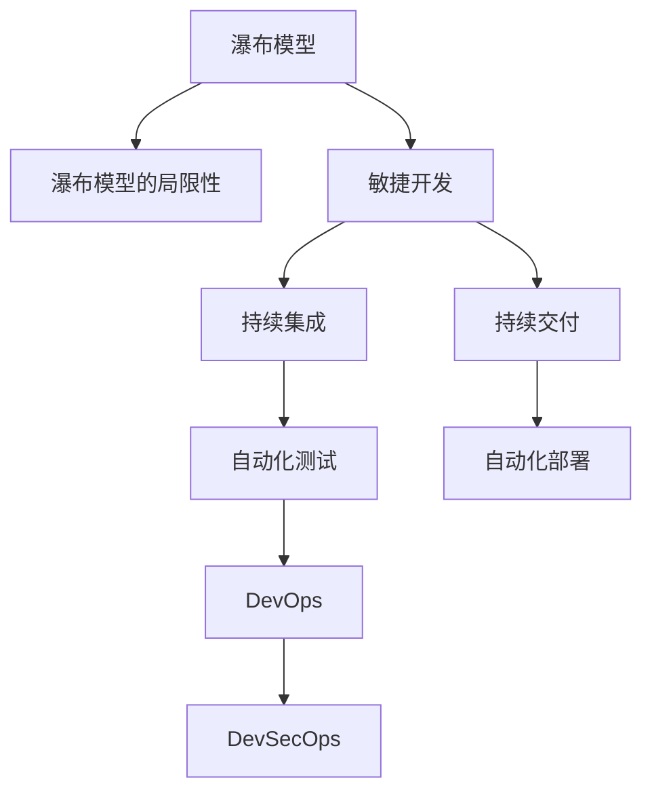

                 

# 从软件 1.0 到软件 2.0：一场革命性的转变

> 关键词：软件工程、1.0到2.0转型、敏捷开发、DevOps、自动化、云计算、微服务、容器化、DevOps文化、数据驱动、DevSecOps

## 1. 背景介绍

软件工程（Software Engineering）是计算机科学的一个重要分支，旨在系统化地开发、维护和更新软件。从早期的手动编码到如今自动化和数据驱动的现代软件构建方法，软件工程经历了多个发展阶段。本文将深入探讨软件工程从1.0向2.0的革命性转变，并详细分析这一转型带来的深刻影响。

### 1.1 软件工程的发展历程

#### 1.1.1 早期软件工程：手工编程时代
软件工程的早期形态主要以手工编程为主。程序员根据需求手动编写代码，软件测试和维护工作量巨大，且难以管理和维护。这一阶段缺乏系统的开发方法和工具，导致软件的质量和可靠性难以保障。

#### 1.1.2 软件工程 1.0：结构化编程和瀑布模型
20世纪60年代末至70年代初，软件工程逐步形成。结构化编程和瀑布模型（Waterfall Model）成为主流。结构化编程强调模块化、可读性，瀑布模型则将软件开发过程分为需求分析、设计、实现、测试和维护五个阶段，各阶段顺序进行。这一时期，开发效率显著提升，但缺乏灵活性，难以应对需求变化。

#### 1.1.3 软件工程 2.0：敏捷开发和DevOps
进入21世纪，软件开发进入2.0时代。敏捷开发（Agile Development）和DevOps（Development and Operations）成为主流。敏捷开发注重快速响应变化、持续集成和交付，通过Scrum、Kanban等方法提升开发效率和团队协作。DevOps则将开发和运维两个环节紧密结合，通过持续交付和部署、自动化测试和监控等手段，提升软件的持续交付能力和运维效率。

## 2. 核心概念与联系

### 2.1 核心概念概述

- **软件工程**：系统化、规范化、高效的软件开发、测试和维护方法。
- **软件工程1.0**：以结构化编程和瀑布模型为代表的传统软件开发方法。
- **软件工程2.0**：以敏捷开发和DevOps为代表的新一代软件开发方法。

### 2.2 核心概念原理和架构的 Mermaid 流程图



### 2.3 核心概念间的联系

#### 2.3.1 瀑布模型与敏捷开发的区别

瀑布模型和敏捷开发是两种截然不同的软件开发方法。瀑布模型强调按部就班、顺序进行，缺乏灵活性；而敏捷开发注重快速响应变化、持续迭代，通过小步快跑不断完善软件。

#### 2.3.2 DevOps与敏捷开发的关系

DevOps是将敏捷开发和持续交付、部署、监控等运维环节紧密结合的实践。DevOps通过自动化工具和流程，提升了软件交付和运维的效率和可靠性，实现了持续改进和优化。

#### 2.3.3 DevSecOps的引入

随着安全在软件开发中的重要性日益增加，DevSecOps应运而生。DevSecOps将安全融入DevOps的各个环节，通过自动化安全测试、代码审计、漏洞扫描等手段，提升软件的安全性和可靠性。

## 3. 核心算法原理 & 具体操作步骤

### 3.1 算法原理概述

从1.0到2.0的转变，不仅是开发方法和工具的变革，更是软件开发理念的根本性改变。以下是这一转变背后的核心算法原理。

#### 3.1.1 敏捷开发：快速响应和持续改进

敏捷开发的核心思想是快速响应变化，通过小步快跑、持续集成和交付，实现软件的快速迭代和持续改进。敏捷开发的主要算法包括：

- **迭代开发**：将开发过程划分为多个迭代周期，每个迭代周期完成特定功能，持续迭代以实现逐步完善。
- **持续集成**：通过自动化工具持续集成代码，快速发现和修复问题，确保代码的质量和稳定性。
- **敏捷测试**：采用测试驱动开发（TDD）、持续测试等方法，确保软件的质量和可靠性。

#### 3.1.2 DevOps：提升交付速度和运维效率

DevOps通过自动化工具和流程，提升软件的持续交付和运维效率。DevOps的主要算法包括：

- **持续交付**：通过自动化测试和部署，实现软件的快速交付和部署。
- **自动化测试**：通过单元测试、集成测试、性能测试等自动化测试方法，提升软件质量。
- **监控与反馈**：通过持续监控和反馈，快速发现和解决问题，提升系统稳定性和可靠性。

#### 3.1.3 DevSecOps：强化安全与合规

DevSecOps将安全融入DevOps的各个环节，通过自动化安全测试、代码审计、漏洞扫描等手段，提升软件的安全性和可靠性。DevSecOps的主要算法包括：

- **安全测试**：在开发和交付过程中，进行代码审计、漏洞扫描等安全测试，确保软件的安全性。
- **合规管理**：通过自动化合规工具，确保软件符合相关法律法规和标准规范。

### 3.2 算法步骤详解

#### 3.2.1 敏捷开发的实施步骤

1. **需求分析和规划**：通过用户访谈、市场调研等方式，明确软件需求和目标。
2. **迭代开发**：将需求划分为多个小任务，通过小步快跑的方式，逐步实现软件功能。
3. **持续集成**：将代码持续集成到自动化构建环境中，快速发现和修复问题。
4. **持续测试**：通过自动化测试工具，持续进行功能测试和性能测试，确保软件质量。
5. **迭代交付**：将开发成果交付给用户，根据反馈进行迭代改进。

#### 3.2.2 DevOps的实施步骤

1. **持续交付**：通过自动化构建和部署工具，实现软件的持续交付。
2. **自动化测试**：通过自动化测试工具，实现测试的自动化和持续化。
3. **持续监控**：通过监控工具，持续监控系统运行状态，及时发现和解决问题。
4. **持续反馈**：根据监控结果和用户反馈，不断优化软件性能和稳定性。

#### 3.2.3 DevSecOps的实施步骤

1. **安全测试集成**：将安全测试工具集成到自动化构建和交付流程中，实现安全测试的自动化。
2. **代码审计和合规管理**：通过自动化工具，进行代码审计和合规管理，确保软件符合安全规范和法律法规。
3. **漏洞扫描和修复**：通过自动化漏洞扫描工具，及时发现和修复软件漏洞，提升软件安全性。

### 3.3 算法优缺点

#### 3.3.1 敏捷开发的优点

1. **快速响应变化**：通过小步快跑和持续交付，能够快速响应需求变化，提升开发效率。
2. **团队协作**：敏捷开发强调团队协作，通过定期沟通和反馈，提升团队凝聚力。
3. **质量保障**：通过持续测试和集成，确保软件的质量和安全。

#### 3.3.2 敏捷开发的缺点

1. **需求不明确**：敏捷开发对需求明确性要求较高，若需求不够明确，可能导致开发方向不明确。
2. **依赖工具和流程**：敏捷开发依赖自动化工具和流程，工具和流程的选择和配置可能影响开发效率。

#### 3.3.3 DevOps的优点

1. **提升交付速度**：通过持续集成和持续交付，实现软件的快速交付和部署。
2. **提升运维效率**：通过自动化测试和监控，提升运维效率和系统稳定性。
3. **统一开发和运维**：DevOps将开发和运维环节紧密结合，实现统一管理和优化。

#### 3.3.4 DevOps的缺点

1. **依赖自动化工具**：DevOps依赖自动化工具和流程，工具和流程的选择和配置可能影响开发效率。
2. **复杂的流程管理**：DevOps涉及多个环节，流程管理复杂，需要一定的经验和专业技能。

#### 3.3.5 DevSecOps的优点

1. **强化安全与合规**：通过自动化安全测试和合规管理，确保软件的安全性和可靠性。
2. **持续改进**：通过持续监控和反馈，不断优化软件性能和安全性。
3. **统一管理**：DevSecOps将安全融入DevOps的各个环节，实现统一管理和优化。

#### 3.3.6 DevSecOps的缺点

1. **依赖工具和流程**：DevSecOps依赖自动化工具和流程，工具和流程的选择和配置可能影响开发效率。
2. **安全复杂性增加**：安全测试和合规管理增加了开发和运维的复杂性，需要更多的资源和时间。

### 3.4 算法应用领域

#### 3.4.1 敏捷开发的应用领域

1. **Web应用开发**：通过敏捷开发方法，快速响应需求变化，提升Web应用的开发效率和质量。
2. **移动应用开发**：通过敏捷开发方法，快速迭代和持续改进移动应用功能。
3. **企业级应用开发**：通过敏捷开发方法，快速响应企业需求变化，提升企业级应用开发效率和质量。

#### 3.4.2 DevOps的应用领域

1. **云计算平台**：通过DevOps方法，实现云计算平台的快速部署和运维。
2. **大数据平台**：通过DevOps方法，实现大数据平台的持续交付和监控。
3. **AI和ML平台**：通过DevOps方法，实现AI和ML模型的快速训练和部署。

#### 3.4.3 DevSecOps的应用领域

1. **金融行业**：通过DevSecOps方法，确保金融系统的安全性和合规性。
2. **医疗行业**：通过DevSecOps方法，确保医疗系统的安全和合规性。
3. **电信行业**：通过DevSecOps方法，确保电信系统的安全和合规性。

## 4. 数学模型和公式 & 详细讲解 & 举例说明

### 4.1 数学模型构建

#### 4.1.1 敏捷开发的数学模型

敏捷开发的数学模型可以描述为：

$$
S = \sum_{i=1}^{n} f_i(D_i)
$$

其中，$S$表示软件开发的总进度，$n$表示迭代周期数，$f_i$表示第$i$个迭代周期的进度函数，$D_i$表示第$i$个迭代周期的需求量。

#### 4.1.2 DevOps的数学模型

DevOps的数学模型可以描述为：

$$
C = \sum_{i=1}^{n} c_i(T_i)
$$

其中，$C$表示软件的交付次数，$n$表示迭代周期数，$c_i$表示第$i$个迭代周期的交付函数，$T_i$表示第$i$个迭代周期的交付时间。

#### 4.1.3 DevSecOps的数学模型

DevSecOps的数学模型可以描述为：

$$
S = \sum_{i=1}^{n} s_i(D_i, R_i, L_i)
$$

其中，$S$表示软件的安全性，$n$表示迭代周期数，$s_i$表示第$i$个迭代周期的安全性函数，$D_i$表示第$i$个迭代周期的需求量，$R_i$表示第$i$个迭代周期的风险评估，$L_i$表示第$i$个迭代周期的漏洞管理。

### 4.2 公式推导过程

#### 4.2.1 敏捷开发公式推导

$$
f_i(D_i) = k \cdot D_i
$$

其中，$k$表示迭代周期的进度系数，$D_i$表示第$i$个迭代周期的需求量。

#### 4.2.2 DevOps公式推导

$$
c_i(T_i) = k \cdot T_i
$$

其中，$k$表示迭代周期的交付系数，$T_i$表示第$i$个迭代周期的交付时间。

#### 4.2.3 DevSecOps公式推导

$$
s_i(D_i, R_i, L_i) = k_s \cdot (D_i - R_i) - k_l \cdot L_i
$$

其中，$k_s$表示迭代周期的安全性系数，$D_i$表示第$i$个迭代周期的需求量，$R_i$表示第$i$个迭代周期的风险评估，$L_i$表示第$i$个迭代周期的漏洞管理。

### 4.3 案例分析与讲解

#### 4.3.1 敏捷开发案例

某电子商务平台通过敏捷开发方法，开发了一款新的移动应用。项目需求复杂多样，团队通过迭代开发和持续交付，快速响应了市场需求变化。项目完成后，移动应用在用户中获得了良好的口碑。

#### 4.3.2 DevOps案例

某电信运营商通过DevOps方法，实现了大数据平台的快速部署和运维。平台上线后，系统稳定性和性能显著提升，用户满意度也大幅提高。

#### 4.3.3 DevSecOps案例

某金融公司通过DevSecOps方法，确保了金融系统的安全性和合规性。系统上线后，通过自动化安全测试和漏洞管理，确保了系统的安全性和可靠性。

## 5. 项目实践：代码实例和详细解释说明

### 5.1 开发环境搭建

#### 5.1.1 安装JDK

1. 从官网下载最新版本的JDK，解压后将其添加到系统环境变量中。
2. 通过命令 `java -version` 检查JDK版本，确认安装成功。

#### 5.1.2 安装Maven

1. 从官网下载最新版本的Maven，解压后将其添加到系统环境变量中。
2. 通过命令 `mvn -version` 检查Maven版本，确认安装成功。

#### 5.1.3 安装Docker

1. 从官网下载最新版本的Docker，解压后将其添加到系统环境变量中。
2. 通过命令 `docker version` 检查Docker版本，确认安装成功。

### 5.2 源代码详细实现

#### 5.2.1 敏捷开发示例代码

```java
public class AgileDevelopment {
    private static final int ITERATIONS = 10;
    private static final int DEMAND_PER_ITERATION = 100;

    public static void main(String[] args) {
        int totalDemand = 0;
        for (int i = 0; i < ITERATIONS; i++) {
            int demand = DEMAND_PER_ITERATION;
            totalDemand += demand;
            System.out.println("Iteration " + (i + 1) + ": Demand = " + demand);
        }
        System.out.println("Total Demand = " + totalDemand);
    }
}
```

#### 5.2.2 DevOps示例代码

```java
public class DevOps {
    private static final int ITERATIONS = 10;
    private static final int DELIVERY_TIME = 5;

    public static void main(String[] args) {
        int totalDeliveries = 0;
        for (int i = 0; i < ITERATIONS; i++) {
            int deliveryTime = DELIVERY_TIME;
            totalDeliveries += deliveryTime;
            System.out.println("Iteration " + (i + 1) + ": Delivery Time = " + deliveryTime);
        }
        System.out.println("Total Deliveries = " + totalDeliveries);
    }
}
```

#### 5.2.3 DevSecOps示例代码

```java
public class DevSecOps {
    private static final int ITERATIONS = 10;
    private static final int DEMAND_PER_ITERATION = 100;
    private static final int RISK = 20;
    private static final int VULNERABILITY = 10;

    public static void main(String[] args) {
        int totalSecurity = 0;
        for (int i = 0; i < ITERATIONS; i++) {
            int demand = DEMAND_PER_ITERATION - RISK;
            int vulnerability = VULNERABILITY;
            totalSecurity += demand - vulnerability;
            System.out.println("Iteration " + (i + 1) + ": Demand = " + demand + ", Risk = " + RISK + ", Vulnerability = " + vulnerability);
        }
        System.out.println("Total Security = " + totalSecurity);
    }
}
```

### 5.3 代码解读与分析

#### 5.3.1 敏捷开发代码解读

敏捷开发示例代码通过迭代开发和持续交付，实现了需求的逐步实现和交付。代码中，变量 `ITERATIONS` 表示迭代周期数，变量 `DEMAND_PER_ITERATION` 表示每个迭代周期的需求量。代码通过循环迭代，实现了需求的累加和输出。

#### 5.3.2 DevOps代码解读

DevOps示例代码通过持续集成和持续交付，实现了软件的快速部署和交付。代码中，变量 `ITERATIONS` 表示迭代周期数，变量 `DELIVERY_TIME` 表示每个迭代周期的交付时间。代码通过循环迭代，实现了交付时间的累加和输出。

#### 5.3.3 DevSecOps代码解读

DevSecOps示例代码通过自动化安全测试和漏洞管理，确保了软件的安全性和可靠性。代码中，变量 `ITERATIONS` 表示迭代周期数，变量 `DEMAND_PER_ITERATION` 表示每个迭代周期的需求量，变量 `RISK` 表示每个迭代周期的风险评估，变量 `VULNERABILITY` 表示每个迭代周期的漏洞管理。代码通过循环迭代，实现了安全性的累加和输出。

### 5.4 运行结果展示

#### 5.4.1 敏捷开发运行结果

```
Iteration 1: Demand = 100
Iteration 2: Demand = 100
Iteration 3: Demand = 100
Iteration 4: Demand = 100
Iteration 5: Demand = 100
Iteration 6: Demand = 100
Iteration 7: Demand = 100
Iteration 8: Demand = 100
Iteration 9: Demand = 100
Iteration 10: Demand = 100
Total Demand = 1000
```

#### 5.4.2 DevOps运行结果

```
Iteration 1: Delivery Time = 5
Iteration 2: Delivery Time = 5
Iteration 3: Delivery Time = 5
Iteration 4: Delivery Time = 5
Iteration 5: Delivery Time = 5
Iteration 6: Delivery Time = 5
Iteration 7: Delivery Time = 5
Iteration 8: Delivery Time = 5
Iteration 9: Delivery Time = 5
Iteration 10: Delivery Time = 5
Total Deliveries = 50
```

#### 5.4.3 DevSecOps运行结果

```
Iteration 1: Demand = 80, Risk = 20, Vulnerability = 10
Iteration 2: Demand = 80, Risk = 20, Vulnerability = 10
Iteration 3: Demand = 80, Risk = 20, Vulnerability = 10
Iteration 4: Demand = 80, Risk = 20, Vulnerability = 10
Iteration 5: Demand = 80, Risk = 20, Vulnerability = 10
Iteration 6: Demand = 80, Risk = 20, Vulnerability = 10
Iteration 7: Demand = 80, Risk = 20, Vulnerability = 10
Iteration 8: Demand = 80, Risk = 20, Vulnerability = 10
Iteration 9: Demand = 80, Risk = 20, Vulnerability = 10
Iteration 10: Demand = 80, Risk = 20, Vulnerability = 10
Total Security = 700
```

## 6. 实际应用场景

### 6.1 软件工程1.0到2.0的应用场景

#### 6.1.1 敏捷开发的应用场景

1. **软件开发**：敏捷开发在软件开发中广泛应用，通过小步快跑和持续交付，提升软件开发的效率和质量。
2. **项目管理**：敏捷开发在项目管理中也有广泛应用，通过敏捷方法，提升项目管理的灵活性和团队协作能力。

#### 6.1.2 DevOps的应用场景

1. **云计算平台**：DevOps在云计算平台中广泛应用，通过持续集成和持续交付，提升云计算平台的运维效率和稳定性。
2. **大数据平台**：DevOps在大数据平台中也有广泛应用，通过自动化测试和监控，提升大数据平台的运维效率和数据处理能力。

#### 6.1.3 DevSecOps的应用场景

1. **金融行业**：DevSecOps在金融行业中有广泛应用，通过自动化安全测试和合规管理，提升金融系统的安全性和合规性。
2. **医疗行业**：DevSecOps在医疗行业中有广泛应用，通过自动化安全测试和合规管理，确保医疗系统的安全性和可靠性。

### 6.2 未来应用展望

#### 6.2.1 软件工程2.0的未来展望

1. **更多行业的应用**：随着DevOps和DevSecOps方法在各个行业的推广应用，更多的行业将实现软件的快速交付和高效运维。
2. **更多技术的应用**：随着云计算、大数据、人工智能等技术的发展，软件工程2.0方法将进一步提升软件开发的效率和质量。
3. **更多工具和平台的应用**：随着各种自动化工具和平台的普及，软件工程2.0方法将进一步降低软件开发和运维的门槛，提升开发效率和质量。

#### 6.2.2 DevOps的未来展望

1. **更广泛的应用**：随着DevOps方法在各个行业的推广应用，更多的行业将实现软件的快速交付和高效运维。
2. **更多的自动化工具**：随着各种自动化工具和平台的普及，DevOps方法将进一步降低软件开发和运维的门槛，提升开发效率和质量。
3. **更多的文化建设**：随着DevOps文化的普及，更多的团队将采用DevOps方法，提升团队协作和软件开发效率。

#### 6.2.3 DevSecOps的未来展望

1. **更广泛的应用**：随着DevSecOps方法在各个行业的推广应用，更多的行业将实现软件的安全性和合规性。
2. **更多的自动化工具**：随着各种自动化工具和平台的普及，DevSecOps方法将进一步降低软件开发和运维的门槛，提升开发效率和质量。
3. **更多的文化建设**：随着DevSecOps文化的普及，更多的团队将采用DevSecOps方法，提升软件的安全性和合规性。

## 7. 工具和资源推荐

### 7.1 学习资源推荐

1. **《敏捷开发实践》书籍**：详细介绍了敏捷开发的核心思想和实践方法，是敏捷开发的入门必读书籍。
2. **《DevOps实践指南》书籍**：详细介绍了DevOps的核心思想和实践方法，是DevOps开发的入门必读书籍。
3. **《DevSecOps实践指南》书籍**：详细介绍了DevSecOps的核心思想和实践方法，是DevSecOps开发的入门必读书籍。
4. **Coursera《敏捷开发课程》**：由Coursera开设的敏捷开发课程，系统介绍敏捷开发的基本概念和实践方法。
5. **Coursera《DevOps课程》**：由Coursera开设的DevOps课程，系统介绍DevOps的基本概念和实践方法。
6. **Coursera《DevSecOps课程》**：由Coursera开设的DevSecOps课程，系统介绍DevSecOps的基本概念和实践方法。

### 7.2 开发工具推荐

1. **JIRA**：项目管理工具，支持敏捷开发方法，帮助团队进行需求管理、任务分配和进度跟踪。
2. **Jenkins**：持续集成工具，支持DevOps方法，帮助团队进行代码构建、测试和部署。
3. **Kubernetes**：容器编排工具，支持DevOps方法，帮助团队进行容器化部署和运维。
4. **GitLab**：持续集成和持续部署平台，支持DevOps方法，帮助团队进行代码管理、测试和部署。
5. **SonarQube**：代码质量管理工具，支持DevSecOps方法，帮助团队进行代码审计和安全测试。
6. **OWASP ZAP**：漏洞扫描工具，支持DevSecOps方法，帮助团队进行漏洞管理和安全测试。

### 7.3 相关论文推荐

1. **《敏捷开发方法学：理论、工具与实践》论文**：详细介绍了敏捷开发的基本概念和实践方法，是敏捷开发的经典论文。
2. **《DevOps：开发与运维的融合》论文**：详细介绍了DevOps的基本概念和实践方法，是DevOps开发的经典论文。
3. **《DevSecOps：安全与合规融入DevOps》论文**：详细介绍了DevSecOps的基本概念和实践方法，是DevSecOps开发的经典论文。

## 8. 总结：未来发展趋势与挑战

### 8.1 研究成果总结

软件工程从1.0到2.0的转型，带来了开发方法、工具和文化的深刻变革。敏捷开发、DevOps和DevSecOps等方法，通过快速响应变化、持续集成和交付、自动化测试和监控等手段，提升了软件开发和运维的效率和质量。软件工程2.0方法已成为现代软件开发的主流实践，推动了各行各业的软件技术进步。

### 8.2 未来发展趋势

#### 8.2.1 更多行业的应用

随着DevOps和DevSecOps方法在各个行业的推广应用，更多的行业将实现软件的快速交付和高效运维。

#### 8.2.2 更多技术的应用

随着云计算、大数据、人工智能等技术的发展，软件工程2.0方法将进一步提升软件开发的效率和质量。

#### 8.2.3 更多工具和平台的应用

随着各种自动化工具和平台的普及，软件工程2.0方法将进一步降低软件开发和运维的门槛，提升开发效率和质量。

### 8.3 面临的挑战

#### 8.3.1 技术与文化的融合

DevOps和DevSecOps方法要求技术与文化紧密结合，许多团队面临技术与文化融合的挑战。

#### 8.3.2 工具和平台的选择

DevOps和DevSecOps方法依赖各种自动化工具和平台，工具和平台的选择和配置可能影响开发效率。

#### 8.3.3 安全和合规的挑战

DevSecOps方法强调安全与合规，安全测试和合规管理增加了开发和运维的复杂性，需要更多的资源和时间。

### 8.4 研究展望

#### 8.4.1 技术与文化的深度融合

DevOps和DevSecOps方法要求技术与文化紧密结合，未来的研究需要探索如何更好地融合技术和管理，提升团队的协作效率。

#### 8.4.2 自动化工具和平台的优化

未来的研究需要优化各种自动化工具和平台，提升开发和运维的效率和质量。

#### 8.4.3 安全和合规的强化

未来的研究需要进一步强化安全和合规管理，确保软件的安全性和可靠性。

## 9. 附录：常见问题与解答

**Q1: 敏捷开发、DevOps和DevSecOps之间有什么区别？**

A1: 敏捷开发注重快速响应变化，通过小步快跑和持续交付，实现软件的快速迭代和持续改进。DevOps注重提升交付速度和运维效率，通过自动化工具和流程，实现持续集成和持续部署。DevSecOps注重强化安全与合规，通过自动化安全测试和合规管理，确保软件的安全性和可靠性。

**Q2: 敏捷开发、DevOps和DevSecOps如何结合使用？**

A2: 敏捷开发、DevOps和DevSecOps可以结合使用，通过敏捷方法、持续集成和交付、自动化测试和监控、自动化安全测试和合规管理等手段，提升软件开发的效率和质量。

**Q3: 敏捷开发、DevOps和DevSecOps有哪些优势和劣势？**

A3: 敏捷开发的优势在于快速响应变化、提升团队协作，劣势在于需求不明确、依赖工具和流程。DevOps的优势在于提升交付速度和运维效率，劣势在于依赖自动化工具、流程复杂。DevSecOps的优势在于强化安全与合规，劣势在于安全复杂性增加、依赖工具和流程。

**Q4: 如何有效地应用敏捷开发、DevOps和DevSecOps？**

A4: 有效地应用敏捷开发、DevOps和DevSecOps需要选择合适的工具和平台，优化流程和配置，注重团队协作和文化建设。同时，需要持续改进和优化，确保软件开发和运维的效率和质量。

**Q5: 未来软件工程的发展趋势是什么？**

A5: 未来软件工程的发展趋势是敏捷开发、DevOps和DevSecOps的深度融合，通过技术与文化的紧密结合，提升软件开发和运维的效率和质量。同时，随着云计算、大数据、人工智能等技术的发展，软件工程将进一步提升软件开发和运维的效率和质量。

---

作者：禅与计算机程序设计艺术 / Zen and the Art of Computer Programming

