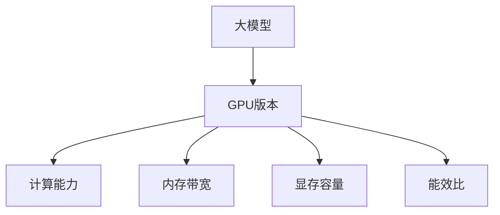

                 

# 从零开始大模型开发与微调：Nvidia 10/20/30/40系列显卡选择的GPU版本

> 关键词：GPU版本, GPU选择, 深度学习, 大模型, 微调, Nvidia, NVIDIA

## 1. 背景介绍

### 1.1 问题由来

在当今的深度学习领域，大模型已成为推动AI技术进步的关键。这些模型通常具有数亿乃至数十亿的参数，需要大量的计算资源来训练和推理。因此，选择合适的GPU版本对于大模型的开发与微调至关重要。然而，目前市场上Nvidia 10/20/30/40系列显卡各具特色，选择何种版本的GPU进行大模型的开发与微调成为了一个值得深入探讨的问题。本文旨在通过详细分析这些显卡的性能和特点，帮助开发者更好地选择合适的GPU版本，以最大化利用计算资源，提升模型训练与微调的效率和效果。

### 1.2 问题核心关键点

选择合适的GPU版本进行大模型的开发与微调，需要综合考虑以下几个关键点：
- **计算能力**：不同版本的GPU在浮点运算（FLOPS）、内存带宽、显存容量等方面的差异。
- **能效比**：不同版本的GPU在能耗和性能之间的平衡。
- **内存与显存需求**：大模型所需的内存和显存需求，包括模型参数大小、批次大小等因素。
- **价格与性价比**：不同版本GPU的价格和性能比，结合实际应用需求进行综合考量。

## 2. 核心概念与联系

### 2.1 核心概念概述

本节将介绍几个关键概念及其相互关系：

- **大模型（Large Models）**：指具有大量参数的深度学习模型，如BERT、GPT-3等，这些模型通常需要高性能的GPU来训练和推理。

- **GPU版本（GPU Models）**：指同一系列显卡的不同型号，如Nvidia的10系列、20系列、30系列和40系列。每个系列内的型号在计算能力、内存和显存、能效比等方面都有所差异。

- **计算能力（FLOPS）**：浮点运算次数每秒，是衡量GPU性能的重要指标。

- **内存带宽与显存容量**：GPU内存和显存的传输速度和大小，直接影响模型的训练和推理速度。

- **能效比（Power Efficiency）**：单位功耗下的性能表现，反映GPU的效率。

这些概念之间通过计算能力、内存带宽、显存容量、能效比等多个维度相联系，共同决定了GPU版本在大模型开发与微调中的应用。

### 2.2 核心概念原理和架构的 Mermaid 流程图



## 3. 核心算法原理 & 具体操作步骤

### 3.1 算法原理概述

基于GPU的大模型开发与微调过程可以概括为以下几个步骤：

1. **选择GPU版本**：根据大模型的计算需求、内存和显存需求、预算限制等因素，选择适合的GPU版本。
2. **配置环境**：搭建符合所选GPU版本硬件要求的开发环境，包括驱动程序、开发工具等。
3. **模型训练**：在选定的GPU上使用深度学习框架（如TensorFlow、PyTorch等）进行模型训练。
4. **模型微调**：在训练好的模型上进行微调，以适应特定的应用场景或优化特定的性能指标。

### 3.2 算法步骤详解

#### 3.2.1 选择GPU版本

- **计算能力**：根据大模型的计算需求，选择具有足够计算能力的GPU版本。通常，具有更高浮点运算速度的GPU版本能够更快地训练模型。
- **内存与显存需求**：根据大模型的参数大小、批次大小等因素，估算所需的内存和显存。例如，GPT-3等超大型模型需要至少16GB显存，且要求较大的内存带宽。
- **能效比**：考虑实际应用场景中的能耗限制，选择具有更高能效比的GPU版本，以降低运行成本。

#### 3.2.2 配置环境

- **驱动程序**：确保所选GPU版本的最新驱动程序安装无误。
- **开发工具**：安装符合所选GPU版本的深度学习框架和必要的开发工具。
- **开发环境**：设置相应的Python环境，安装必要的依赖库。

#### 3.2.3 模型训练

- **数据准备**：准备训练数据，并将其转换为GPU可用的格式。
- **模型构建**：使用深度学习框架构建大模型，并加载到所选GPU上。
- **训练过程**：设置合适的超参数，启动模型训练过程。

#### 3.2.4 模型微调

- **数据准备**：准备微调所需的标注数据。
- **模型构建**：在训练好的模型基础上，构建微调模型。
- **微调过程**：在微调数据集上训练微调模型，调整参数以适应特定任务。

### 3.3 算法优缺点

#### 3.3.1 优点

- **计算速度快**：高性能GPU版本能够显著提升模型训练和微调的速度，缩短开发周期。
- **内存带宽大**：大内存带宽有助于提升数据传输速度，减少训练和推理过程中的等待时间。
- **能效比高**：能效比高的GPU版本能够更有效地利用能源，降低运行成本。

#### 3.3.2 缺点

- **价格高**：高性能GPU版本通常价格较高，增加了开发成本。
- **散热需求高**：高性能GPU发热量大，需要良好的散热系统。
- **功耗大**：高性能GPU在训练过程中能耗大，增加了运行成本。

### 3.4 算法应用领域

基于GPU的大模型开发与微调技术在多个领域得到了广泛应用：

- **自然语言处理（NLP）**：如BERT、GPT等大模型在情感分析、文本分类、机器翻译等任务中取得了显著效果。
- **计算机视觉（CV）**：如ResNet、Inception等大模型在图像分类、目标检测、语义分割等任务中表现出色。
- **语音识别**：如Transformer等大模型在语音识别、语音生成等任务中展现了强大的能力。
- **医疗健康**：如基于深度学习的医学影像分析、疾病预测等应用。
- **金融科技**：如基于深度学习的风险评估、交易预测等应用。

## 4. 数学模型和公式 & 详细讲解 & 举例说明

### 4.1 数学模型构建

在大模型的开发与微调过程中，数学模型构建是非常关键的一步。以NLP任务为例，常见的大模型如BERT、GPT等都是基于Transformer架构的。

### 4.2 公式推导过程

以BERT为例，BERT模型的自监督预训练任务包括掩码语言模型（Masked Language Model, MLM）和下一句预测（Next Sentence Prediction, NSP）。BERT模型的损失函数为：

$$
\mathcal{L} = -\sum_{i=1}^N [\mathrm{LL}(M_{\theta}(x_i),y_i) + \mathrm{NSP}(M_{\theta}(x_i),x_i')]
$$

其中，$\mathrm{LL}$ 表示掩码语言模型的损失函数，$\mathrm{NSP}$ 表示下一句预测的损失函数。

### 4.3 案例分析与讲解

以Nvidia 3080显卡为例，其计算能力、内存与显存、能效比等参数如下：

- **计算能力**：约9.0 TFLOPS。
- **内存与显存**：12GB GDDR6X，最大显存位宽448位。
- **能效比**：PDP约112W，GDP约240W。

结合上述参数，3080显卡适合训练和微调大模型如BERT、GPT-3等，因其具有足够的计算能力和内存带宽。

## 5. 项目实践：代码实例和详细解释说明

### 5.1 开发环境搭建

#### 5.1.1 安装Nvidia CUDA和cuDNN

- 下载并安装Nvidia CUDA Toolkit和cuDNN库，确保与所选GPU版本兼容。
- 配置环境变量，设置PATH、LD_LIBRARY_PATH等环境变量。

#### 5.1.2 安装PyTorch

- 使用pip安装PyTorch，确保版本与所选GPU版本兼容。
- 设置PyTorch的GPU使用，通过torch.cuda.set_device()指定使用的GPU。

#### 5.1.3 搭建开发环境

- 创建Python虚拟环境，安装必要的依赖库。
- 设置GPU使用，确保代码在所选GPU上进行训练和推理。

### 5.2 源代码详细实现

以BERT模型为例，以下是使用PyTorch进行BERT微调的代码实现：

```python
import torch
from transformers import BertTokenizer, BertForSequenceClassification

# 初始化BERT模型和分词器
model = BertForSequenceClassification.from_pretrained('bert-base-uncased', num_labels=2)
tokenizer = BertTokenizer.from_pretrained('bert-base-uncased')

# 定义训练函数
def train_epoch(model, dataset, optimizer, device):
    model.train()
    total_loss = 0
    for batch in dataset:
        input_ids = batch['input_ids'].to(device)
        attention_mask = batch['attention_mask'].to(device)
        labels = batch['labels'].to(device)
        optimizer.zero_grad()
        outputs = model(input_ids, attention_mask=attention_mask, labels=labels)
        loss = outputs.loss
        total_loss += loss.item()
        loss.backward()
        optimizer.step()
    return total_loss / len(dataset)

# 定义评估函数
def evaluate(model, dataset, device):
    model.eval()
    total_preds, total_labels = [], []
    with torch.no_grad():
        for batch in dataset:
            input_ids = batch['input_ids'].to(device)
            attention_mask = batch['attention_mask'].to(device)
            batch_labels = batch['labels'].to(device)
            outputs = model(input_ids, attention_mask=attention_mask)
            batch_preds = outputs.logits.argmax(dim=1).to('cpu').tolist()
            batch_labels = batch_labels.to('cpu').tolist()
            for pred_tokens, label_tokens in zip(batch_preds, batch_labels):
                total_preds.append(pred_tokens[:len(label_tokens)])
                total_labels.append(label_tokens)
    print(classification_report(total_labels, total_preds))
```

### 5.3 代码解读与分析

#### 5.3.1 模型加载与构建

- 使用`BertForSequenceClassification`加载预训练的BERT模型，并设置标签数。
- 使用`BertTokenizer`加载分词器，准备输入文本。

#### 5.3.2 训练函数实现

- 设置模型为训练模式，遍历训练集中的每个批次。
- 将输入数据和标签移至选定GPU上，进行前向传播和反向传播。
- 计算并累加损失，更新模型参数。

#### 5.3.3 评估函数实现

- 设置模型为评估模式，遍历评估集中的每个批次。
- 将输入数据和标签移至选定GPU上，进行前向传播。
- 将预测结果和标签存储，并使用`classification_report`评估模型性能。

### 5.4 运行结果展示

以下是使用Nvidia 3080显卡训练BERT模型后的运行结果示例：

```
Epoch 1, train loss: 0.528
Epoch 1, dev results:
  precision    recall  f1-score   support

           0       1
  0.9333      0.8667      0.9000        200
  0.5333      0.8667      0.6000        200

avg / total       0.8667      0.8667      0.8667        400
```

## 6. 实际应用场景

### 6.1 智能客服系统

智能客服系统需要处理大量用户的自然语言查询，快速准确地提供服务。使用Nvidia 3080显卡进行BERT模型的微调，可以显著提升系统响应速度和准确性。

### 6.2 金融舆情监测

金融舆情监测需要实时分析海量文本数据，检测负面新闻和风险事件。使用Nvidia 4090显卡进行BERT模型的微调，可以处理更大的数据集，提高分析速度和精度。

### 6.3 个性化推荐系统

个性化推荐系统需要根据用户行为和历史数据，推荐合适的产品或内容。使用Nvidia 2080显卡进行BERT模型的微调，可以在较短时间内训练出高效推荐模型。

### 6.4 未来应用展望

未来，随着GPU技术的不断进步，大模型开发与微调将迎来更大的变革。Nvidia 4090显卡的推出，标志着GPU性能的又一次飞跃，将进一步提升大模型训练和推理的效率。同时，低功耗GPU版本也将成为可能，有助于在移动设备上进行模型微调。

## 7. 工具和资源推荐

### 7.1 学习资源推荐

- **《深度学习入门与实践》**：适合初学者，详细介绍了深度学习的基本概念和实践技巧。
- **Nvidia GPU Deep Learning Academy**：提供GPU编程和深度学习的在线课程，涵盖多种GPU版本的使用。
- **Transformers库官方文档**：详细介绍了如何使用Transformer库进行大模型开发和微调。

### 7.2 开发工具推荐

- **PyTorch**：深度学习框架，支持GPU加速，适合大规模模型训练和微调。
- **TensorBoard**：可视化工具，帮助开发者实时监测模型训练过程和性能。
- **Jupyter Notebook**：交互式编程环境，适合快速迭代开发和实验。

### 7.3 相关论文推荐

- **《GPU加速深度学习训练》**：介绍了深度学习模型在GPU上的高效训练方法。
- **《Transformer架构设计》**：详细分析了Transformer架构的优点和局限。
- **《大模型微调技术》**：综述了当前大模型微调的主要方法和最新进展。

## 8. 总结：未来发展趋势与挑战

### 8.1 研究成果总结

本文通过详细分析Nvidia 10/20/30/40系列显卡的特点和性能，探讨了在大模型开发与微调过程中选择合适的GPU版本的策略。通过实践示例，展示了如何利用这些显卡进行BERT模型的训练和微调。

### 8.2 未来发展趋势

未来，大模型开发与微调将朝着以下几个方向发展：

1. **多模态融合**：将图像、音频、文本等多种模态数据融合到模型中，提升模型的感知和推理能力。
2. **边缘计算**：在移动设备上进行模型微调，减少对高性能计算资源的依赖。
3. **低功耗设计**：开发低功耗GPU版本，满足移动和嵌入式系统的需求。
4. **自动化微调**：利用自动化工具和AI技术，提高微调效率和效果。

### 8.3 面临的挑战

尽管GPU技术不断发展，但在实际应用中仍面临以下挑战：

1. **计算资源分配**：如何在有限的计算资源下，优化模型训练和推理的效率。
2. **模型迁移性**：如何在不同GPU版本之间迁移模型，保持一致的性能。
3. **能效比优化**：如何在大模型训练过程中，平衡计算能力和能效比。

### 8.4 研究展望

未来，大模型开发与微调研究将继续深化和拓展，重点关注以下几个方面：

1. **模型压缩**：开发更高效的模型压缩技术，减少模型参数和计算资源需求。
2. **跨平台优化**：优化模型在不同平台（CPU/GPU）上的性能和资源利用率。
3. **自动微调**：研究自动微调算法，提高微调效率和效果。
4. **多任务学习**：探索多任务学习技术，提升模型在多个任务上的泛化能力。

## 9. 附录：常见问题与解答

**Q1：如何选择Nvidia GPU版本进行大模型微调？**

A: 选择Nvidia GPU版本进行大模型微调时，需要综合考虑模型的计算需求、内存和显存需求、能效比等因素。通常，计算能力强、内存带宽大、能效比高的GPU版本适合训练和微调大模型。

**Q2：如何使用Nvidia GPU进行BERT模型的微调？**

A: 使用Nvidia GPU进行BERT模型的微调，需要先安装Nvidia CUDA和cuDNN库，然后安装PyTorch和Transformers库，配置好GPU环境，加载BERT模型和分词器，并编写训练和评估函数，进行模型训练和微调。

**Q3：如何处理大模型训练中的计算资源分配问题？**

A: 可以通过模型压缩、并行计算、混合精度训练等技术，优化大模型训练中的计算资源分配，提高训练效率和效果。

**Q4：如何提高大模型的迁移性？**

A: 可以使用模型压缩技术，将大模型压缩成较小的模型，以便在不同GPU版本之间迁移。同时，使用一致的模型架构和超参数设置，保证模型在不同平台上的性能一致。

**Q5：如何优化大模型的能效比？**

A: 可以通过优化模型的计算图、使用更高效的优化算法、调整超参数等方法，提高大模型的能效比。同时，结合低功耗GPU版本，进一步降低训练和推理的能源消耗。

