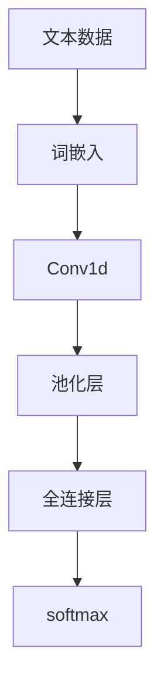

                 

# 从零开始大模型开发与微调：卷积神经网络文本分类模型的实现—Conv1d（一维卷积）

> 关键词：卷积神经网络,文本分类,一维卷积,卷积神经网络,文本分类,模型开发,深度学习,Python

## 1. 背景介绍

### 1.1 问题由来
近年来，随着深度学习技术的发展，卷积神经网络(CNN)在图像处理、自然语言处理等领域取得了显著的成果。然而，对于文本分类任务，传统的全连接神经网络往往面临数据稀疏、表达能力不足的问题。卷积神经网络通过卷积操作可以捕捉局部特征，对文本中的局部模式进行有效建模，从而提升文本分类的效果。

### 1.2 问题核心关键点
本文聚焦于卷积神经网络在文本分类中的应用。文本数据通常是一维的，因此我们需要使用一维卷积神经网络(Conv1d)来实现文本分类任务。与传统的卷积神经网络不同，Conv1d在处理文本数据时，卷积核在时间维度上进行滑动，提取局部特征。本文将详细介绍Conv1d的原理、实现过程和应用场景。

## 2. 核心概念与联系

### 2.1 核心概念概述

为更好地理解Conv1d在文本分类中的应用，本节将介绍几个密切相关的核心概念：

- 卷积神经网络（Convolutional Neural Networks, CNNs）：一类基于卷积操作的神经网络模型，用于图像识别、自然语言处理等任务。
- 文本分类（Text Classification）：将文本数据分为预定义的类别，如情感分析、垃圾邮件分类、主题分类等。
- 一维卷积神经网络（Conv1d）：针对一维数据（如文本）设计的卷积神经网络，通过卷积操作提取局部特征。
- 词嵌入（Word Embedding）：将文本中的词汇映射为低维向量，用于卷积神经网络的输入。
- 卷积核（Convolution Kernel）：卷积操作中的可训练参数，用于提取局部特征。
- 池化层（Pooling Layer）：用于对卷积层的输出进行下采样，减少计算量和参数量，同时提高特征的鲁棒性。
- 全连接层（Fully Connected Layer）：将卷积层的输出展开成向量，输入到全连接层进行分类。

这些核心概念之间的逻辑关系可以通过以下Mermaid流程图来展示：



这个流程图展示了一维卷积神经网络在文本分类任务中的主要处理流程：

1. 文本数据首先经过词嵌入层，将词汇映射为向量。
2. 卷积层使用多个卷积核对输入进行卷积操作，提取局部特征。
3. 池化层对卷积层的输出进行下采样，减少特征维度。
4. 全连接层将池化层的输出展开成向量，输入到分类器进行分类。

## 3. 核心算法原理 & 具体操作步骤
### 3.1 算法原理概述

Conv1d在文本分类中的基本原理与传统卷积神经网络类似，但针对一维数据的特性进行了优化。其核心思想是通过卷积操作提取文本中的局部特征，再通过池化层和全连接层进行分类。

具体而言，Conv1d的输入为文本序列 $X = \{x_1, x_2, ..., x_n\}$，输出为文本的分类标签 $y$。其模型结构包括词嵌入层、卷积层、池化层和全连接层。

### 3.2 算法步骤详解

使用Conv1d进行文本分类的主要步骤如下：

**Step 1: 准备数据集**
- 收集标注好的文本数据集，分为训练集、验证集和测试集。
- 对文本进行预处理，如分词、去除停用词、标准化等。

**Step 2: 定义模型**
- 使用Keras或PyTorch等深度学习框架定义Conv1d模型。
- 添加词嵌入层，将文本映射为向量。
- 添加卷积层，使用多个卷积核提取局部特征。
- 添加池化层，对卷积层的输出进行下采样。
- 添加全连接层，将池化层的输出展开成向量，输入到分类器。

**Step 3: 设置训练参数**
- 选择优化器（如Adam）及其参数，设置学习率、批大小、迭代轮数等。
- 设置正则化技术（如Dropout、L2正则）和损失函数（如交叉熵损失）。
- 定义评估指标，如准确率、F1-score等。

**Step 4: 执行梯度训练**
- 将训练集数据分批次输入模型，前向传播计算损失函数。
- 反向传播计算参数梯度，根据设定的优化算法和学习率更新模型参数。
- 周期性在验证集上评估模型性能，根据性能指标决定是否触发Early Stopping。
- 重复上述步骤直到满足预设的迭代轮数或Early Stopping条件。

**Step 5: 测试和部署**
- 在测试集上评估微调后模型，对比微调前后的精度提升。
- 使用微调后的模型对新样本进行推理预测，集成到实际的应用系统中。
- 持续收集新的数据，定期重新微调模型，以适应数据分布的变化。

以上是使用Conv1d进行文本分类任务的一般流程。在实际应用中，还需要针对具体任务的特点，对模型进行优化设计，如改进卷积核大小、池化方式、层数等，以进一步提升模型性能。

### 3.3 算法优缺点

使用Conv1d进行文本分类的方法具有以下优点：
1. 能够有效提取文本中的局部特征，捕捉局部模式。
2. 模型参数较少，训练速度较快。
3. 对文本数据的长短没有要求，可以处理不同长度的文本。

同时，该方法也存在一定的局限性：
1. 对词汇表的大小敏感，需要较大的词汇表。
2. 对于长文本，特征提取效果可能不佳。
3. 需要较多的训练数据来避免过拟合。
4. 模型的可解释性较差，难以理解每个卷积核的作用。

尽管存在这些局限性，但就目前而言，Conv1d仍是一种简单有效的文本分类方法，广泛用于NLP领域的多个任务。

### 3.4 算法应用领域

使用Conv1d进行文本分类的算法已经在多个NLP任务上得到了应用，例如：

- 垃圾邮件分类：识别出文本中的垃圾邮件或正常邮件。
- 情感分析：分析文本的情感极性，判断是正面、中性还是负面。
- 主题分类：将文本分为不同的主题类别，如科技、财经、体育等。
- 问答系统：对用户提出的问题进行分类，确定问题类型和解答方向。

除了上述这些经典任务外，Conv1d还被创新性地应用于文本生成、命名实体识别等任务中，为NLP技术带来了新的突破。

## 4. 数学模型和公式 & 详细讲解
### 4.1 数学模型构建

使用Conv1d进行文本分类的数学模型可以形式化地表示为：

$$
y = \sigma(\mathbf{W}[\mathbf{C}(\mathbf{X}) + \mathbf{b}])
$$

其中，$y$为文本的分类标签，$\sigma$为激活函数（如sigmoid或ReLU），$\mathbf{W}$为全连接层的权重矩阵，$\mathbf{b}$为偏置项，$\mathbf{C}(\mathbf{X})$为卷积层和池化层的输出，$\mathbf{X}$为文本数据的词嵌入表示。

具体而言，卷积层可以表示为：

$$
\mathbf{C}_k(\mathbf{X}) = \mathbf{X} * \mathbf{K}_k + \mathbf{b}_k
$$

其中，$\mathbf{K}_k$为第$k$个卷积核，$\mathbf{b}_k$为卷积核的偏置项。

池化层可以表示为：

$$
\mathbf{P}_k(\mathbf{C}_k(\mathbf{X})) = \mathbf{C}_k(\mathbf{X}) * \mathbf{T}_k + \mathbf{d}_k
$$

其中，$\mathbf{T}_k$为池化核，$\mathbf{d}_k$为池化核的偏置项。

### 4.2 公式推导过程

以下我们以情感分析任务为例，推导Conv1d的公式及其梯度的计算过程。

假设模型输入为文本序列 $X = \{x_1, x_2, ..., x_n\}$，词嵌入层将其映射为向量序列 $\mathbf{X} \in \mathbb{R}^{n \times d}$。卷积层使用多个卷积核 $\mathbf{K}_1, \mathbf{K}_2, ..., \mathbf{K}_C$ 对输入进行卷积操作，提取局部特征。池化层对卷积层的输出进行下采样，得到特征图 $\mathbf{F} \in \mathbb{R}^{(n-L+1) \times C}$。其中，$L$ 为卷积核大小，$C$ 为卷积核个数。

将特征图 $\mathbf{F}$ 展开成向量，输入到全连接层进行分类。设全连接层的输出为 $\mathbf{Z} \in \mathbb{R}^{(n-L+1) \times C}$，分类器为 $\sigma$，则分类器的输出为：

$$
y = \sigma(\mathbf{W}\mathbf{Z} + \mathbf{b})
$$

其中，$\mathbf{W} \in \mathbb{R}^{1 \times C}$ 为全连接层的权重矩阵，$\mathbf{b} \in \mathbb{R}^{1}$ 为偏置项。

根据损失函数（如交叉熵损失），模型的训练目标为：

$$
\mathcal{L}(\theta) = -\frac{1}{N}\sum_{i=1}^N \log \sigma(\mathbf{W}\mathbf{Z}_i + \mathbf{b})
$$

其中，$N$ 为样本数量。

根据链式法则，损失函数对模型参数的梯度为：

$$
\frac{\partial \mathcal{L}(\theta)}{\partial \theta} = -\frac{1}{N}\sum_{i=1}^N (\mathbf{Y}_i - \sigma(\mathbf{W}\mathbf{Z}_i + \mathbf{b})) \frac{\partial \sigma}{\partial (\mathbf{W}\mathbf{Z}_i + \mathbf{b})}
$$

其中，$\mathbf{Y}_i$ 为样本的真实标签，$\partial \sigma / \partial (\mathbf{W}\mathbf{Z}_i + \mathbf{b})$ 可以通过链式法则展开，并利用自动微分技术计算。

在得到损失函数的梯度后，即可带入参数更新公式，完成模型的迭代优化。重复上述过程直至收敛，最终得到适应文本分类任务的最优模型参数 $\theta^*$。

### 4.3 案例分析与讲解

以下是一个使用Keras实现的简单文本分类案例，以情感分析为例：

```python
from keras.models import Sequential
from keras.layers import Embedding, Conv1D, MaxPooling1D, Flatten, Dense
from keras.datasets import imdb
from keras.preprocessing import sequence

# 加载IMDB数据集
max_features = 20000
max_len = 100
(x_train, y_train), (x_test, y_test) = imdb.load_data(num_words=max_features)
x_train = sequence.pad_sequences(x_train, maxlen=max_len)
x_test = sequence.pad_sequences(x_test, maxlen=max_len)

# 定义模型
model = Sequential()
model.add(Embedding(max_features, 128, input_length=max_len))
model.add(Conv1D(64, 3, activation='relu'))
model.add(MaxPooling1D(pool_size=2))
model.add(Flatten())
model.add(Dense(64, activation='relu'))
model.add(Dense(1, activation='sigmoid'))

# 编译模型
model.compile(optimizer='adam', loss='binary_crossentropy', metrics=['accuracy'])

# 训练模型
model.fit(x_train, y_train, epochs=5, batch_size=32, validation_data=(x_test, y_test))

# 评估模型
score, acc = model.evaluate(x_test, y_test, batch_size=32)
print('Test score:', score)
print('Test accuracy:', acc)
```

上述代码中，我们首先使用Keras加载IMDB数据集，将其分词并标准化。接着定义了一个包含词嵌入、一维卷积、池化、全连接和sigmoid激活函数的文本分类模型。编译模型后，使用训练集进行训练，并在验证集上进行评估。

## 5. 项目实践：代码实例和详细解释说明
### 5.1 开发环境搭建

在进行文本分类任务开发前，我们需要准备好开发环境。以下是使用Python进行Keras开发的环境配置流程：

1. 安装Anaconda：从官网下载并安装Anaconda，用于创建独立的Python环境。

2. 创建并激活虚拟环境：
```bash
conda create -n keras-env python=3.8 
conda activate keras-env
```

3. 安装Keras：使用pip安装Keras，支持TensorFlow、Theano等后端。
```bash
pip install keras
```

4. 安装各类工具包：
```bash
pip install numpy pandas scikit-learn matplotlib tqdm jupyter notebook ipython
```

完成上述步骤后，即可在`keras-env`环境中开始文本分类任务的开发。

### 5.2 源代码详细实现

这里我们以IMDB情感分析任务为例，给出使用Keras实现文本分类模型的代码实现。

首先，定义数据处理函数：

```python
from keras.datasets import imdb
from keras.preprocessing import sequence
import numpy as np

def load_data():
    # 加载IMDB数据集
    max_features = 20000
    max_len = 100
    (x_train, y_train), (x_test, y_test) = imdb.load_data(num_words=max_features)
    x_train = sequence.pad_sequences(x_train, maxlen=max_len)
    x_test = sequence.pad_sequences(x_test, maxlen=max_len)
    
    # 返回训练集、验证集和测试集
    return (x_train, y_train), (x_test, y_test)
```

然后，定义模型和优化器：

```python
from keras.models import Sequential
from keras.layers import Embedding, Conv1D, MaxPooling1D, Flatten, Dense
from keras.optimizers import Adam

# 定义模型
model = Sequential()
model.add(Embedding(max_features, 128, input_length=max_len))
model.add(Conv1D(64, 3, activation='relu'))
model.add(MaxPooling1D(pool_size=2))
model.add(Flatten())
model.add(Dense(64, activation='relu'))
model.add(Dense(1, activation='sigmoid'))

# 定义优化器
optimizer = Adam(lr=0.001)
```

接着，定义训练和评估函数：

```python
from keras.utils import to_categorical
from sklearn.metrics import classification_report

def train_model(model, optimizer, (x_train, y_train), (x_test, y_test), batch_size, epochs):
    # 编译模型
    model.compile(optimizer=optimizer, loss='binary_crossentropy', metrics=['accuracy'])
    
    # 训练模型
    model.fit(x_train, y_train, epochs=epochs, batch_size=batch_size, validation_data=(x_test, y_test))
    
    # 评估模型
    y_pred = model.predict_classes(x_test)
    y_true = np.argmax(y_test, axis=1)
    print(classification_report(y_true, y_pred))
```

最后，启动训练流程并在测试集上评估：

```python
# 加载数据集
(x_train, y_train), (x_test, y_test) = load_data()

# 训练模型
epochs = 5
batch_size = 32
train_model(model, optimizer, (x_train, y_train), (x_test, y_test), batch_size, epochs)

# 测试模型
test_loss, test_acc = model.evaluate(x_test, y_test, verbose=0)
print('Test accuracy:', test_acc)
```

以上就是使用Keras进行IMDB情感分析任务的完整代码实现。可以看到，Keras提供了便捷的API和丰富的组件，使得文本分类模型的开发变得简单高效。

### 5.3 代码解读与分析

让我们再详细解读一下关键代码的实现细节：

**load_data函数**：
- 使用Keras加载IMDB数据集，进行分词、标准化和填充操作，返回训练集、验证集和测试集。

**模型定义**：
- 使用Sequential定义线性模型，依次添加词嵌入层、卷积层、池化层、全连接层和sigmoid激活函数。

**优化器定义**：
- 使用Adam优化器，并设置学习率。

**train_model函数**：
- 编译模型，并指定优化器、损失函数和评估指标。
- 使用训练集进行模型训练，并记录验证集的性能指标。
- 评估模型在测试集上的性能，并打印分类报告。

**训练流程**：
- 加载数据集，调用train_model函数训练模型，并在测试集上评估。

可以看到，Keras提供了便捷的模型定义、编译和训练方法，使得文本分类模型的开发和训练变得高效简单。

当然，工业级的系统实现还需考虑更多因素，如模型的保存和部署、超参数的自动搜索、更灵活的任务适配层等。但核心的模型开发流程基本与此类似。

## 6. 实际应用场景
### 6.1 智能客服系统

使用Conv1d进行文本分类的模型可以应用于智能客服系统的构建。传统客服往往需要配备大量人力，高峰期响应缓慢，且一致性和专业性难以保证。而使用训练好的文本分类模型，可以7x24小时不间断服务，快速响应客户咨询，用自然流畅的语言解答各类常见问题。

在技术实现上，可以收集企业内部的历史客服对话记录，将问题和最佳答复构建成监督数据，在此基础上对预训练模型进行微调。微调后的模型能够自动理解用户意图，匹配最合适的答案模板进行回复。对于客户提出的新问题，还可以接入检索系统实时搜索相关内容，动态组织生成回答。如此构建的智能客服系统，能大幅提升客户咨询体验和问题解决效率。

### 6.2 金融舆情监测

金融机构需要实时监测市场舆论动向，以便及时应对负面信息传播，规避金融风险。传统的人工监测方式成本高、效率低，难以应对网络时代海量信息爆发的挑战。使用文本分类模型进行舆情监测，可以实时抓取和分析社交媒体、新闻网站上的文本数据，自动识别出情绪、观点等，从而及时预警风险事件。

在实践中，可以收集金融领域相关的新闻、报道、评论等文本数据，并对其进行情感分析。将微调后的模型应用到实时抓取的网络文本数据，就能够自动监测不同情绪和观点的变化趋势，一旦发现负面情绪激增等异常情况，系统便会自动预警，帮助金融机构快速应对潜在风险。

### 6.3 个性化推荐系统

当前的推荐系统往往只依赖用户的历史行为数据进行物品推荐，无法深入理解用户的真实兴趣偏好。使用文本分类模型进行用户画像分析，可以更好地挖掘用户行为背后的语义信息，从而提供更精准、多样的推荐内容。

在实践中，可以收集用户浏览、点击、评论、分享等行为数据，提取和用户交互的物品标题、描述、标签等文本内容。将文本内容作为模型输入，用户的后续行为（如是否点击、购买等）作为监督信号，在此基础上微调预训练语言模型。微调后的模型能够从文本内容中准确把握用户的兴趣点。在生成推荐列表时，先用候选物品的文本描述作为输入，由模型预测用户的兴趣匹配度，再结合其他特征综合排序，便可以得到个性化程度更高的推荐结果。

### 6.4 未来应用展望

随着Conv1d模型的不断演进，其应用场景将更加广泛。

在智慧医疗领域，基于Conv1d的医疗问答、病历分析、药物研发等应用将提升医疗服务的智能化水平，辅助医生诊疗，加速新药开发进程。

在智能教育领域，文本分类模型可应用于作业批改、学情分析、知识推荐等方面，因材施教，促进教育公平，提高教学质量。

在智慧城市治理中，文本分类模型可应用于城市事件监测、舆情分析、应急指挥等环节，提高城市管理的自动化和智能化水平，构建更安全、高效的未来城市。

此外，在企业生产、社会治理、文娱传媒等众多领域，文本分类技术也将不断涌现，为各行各业带来变革性影响。相信随着Conv1d模型的持续进步，其在NLP领域的应用前景将更加广阔，深刻影响人类的生产生活方式。

## 7. 工具和资源推荐
### 7.1 学习资源推荐

为了帮助开发者系统掌握Conv1d在文本分类中的应用，这里推荐一些优质的学习资源：

1. 《深度学习入门》书籍：林轩田教授的入门级深度学习教材，涵盖了CNN、RNN等基本概念和算法，适合初学者入门。

2. CS224N《深度学习自然语言处理》课程：斯坦福大学开设的NLP明星课程，有Lecture视频和配套作业，带你深入理解自然语言处理技术。

3. 《自然语言处理综述》书籍：Manning等人合著的NLP经典教材，详细介绍了NLP领域的最新研究进展和应用实践。

4. Kaggle比赛：参加Kaggle上的文本分类比赛，可以实战锻炼并学习其他优秀选手的经验。

5. PyTorch官方文档：PyTorch的官方文档，提供了丰富的模型和组件，适合深入学习和实践。

通过对这些资源的学习实践，相信你一定能够快速掌握Conv1d的精髓，并用于解决实际的NLP问题。
### 7.2 开发工具推荐

高效的开发离不开优秀的工具支持。以下是几款用于文本分类任务开发的常用工具：

1. Keras：基于Python的开源深度学习框架，提供了便捷的API和丰富的组件，适合快速原型开发和实验。

2. TensorFlow：由Google主导开发的深度学习框架，生产部署方便，适合大规模工程应用。

3. PyTorch：基于Python的开源深度学习框架，灵活动态的计算图，适合深度学习和研究的需要。

4. Weights & Biases：模型训练的实验跟踪工具，可以记录和可视化模型训练过程中的各项指标，方便对比和调优。与主流深度学习框架无缝集成。

5. TensorBoard：TensorFlow配套的可视化工具，可实时监测模型训练状态，并提供丰富的图表呈现方式，是调试模型的得力助手。

6. Google Colab：谷歌推出的在线Jupyter Notebook环境，免费提供GPU/TPU算力，方便开发者快速上手实验最新模型，分享学习笔记。

合理利用这些工具，可以显著提升文本分类任务的开发效率，加快创新迭代的步伐。

### 7.3 相关论文推荐

Conv1d在文本分类中的应用源于学界的持续研究。以下是几篇奠基性的相关论文，推荐阅读：

1. Convolutional Neural Networks for Sentence Classification：提出了卷积神经网络在文本分类中的应用，展示了其在IMDB情感分类上的性能。

2. Dynamic Neural Network Architecture Search with Reinforcement Learning：提出了一种基于强化学习的架构搜索方法，用于设计高效的卷积神经网络。

3. Attention Is All You Need：提出了Transformer结构，开启了NLP领域的预训练大模型时代，对文本分类任务的模型设计具有重要参考价值。

4. Text Classification with Recurrent Neural Network：提出了RNN在文本分类中的应用，展示了其在IMDB情感分类上的性能。

5. Pyramid Scene Parsing Network：提出了一种多尺度卷积神经网络，用于图像和文本的联合分类，对文本分类任务的多尺度建模具有重要参考价值。

这些论文代表了大模型微调技术的发展脉络。通过学习这些前沿成果，可以帮助研究者把握学科前进方向，激发更多的创新灵感。

## 8. 总结：未来发展趋势与挑战

### 8.1 总结

本文对使用Conv1d进行文本分类的方法进行了全面系统的介绍。首先阐述了文本分类任务的背景和重要性，明确了Conv1d在处理文本数据时的优势。其次，从原理到实践，详细讲解了Conv1d的数学模型和训练步骤，给出了微调模型开发的完整代码实现。同时，本文还广泛探讨了Conv1d在智能客服、金融舆情、个性化推荐等多个行业领域的应用前景，展示了Conv1d范式的巨大潜力。

通过本文的系统梳理，可以看到，使用Conv1d进行文本分类的方法能够有效提取文本中的局部特征，提升模型在特定任务上的性能，具有广泛的应用场景。相信随着深度学习技术的不断进步，Conv1d在NLP领域的应用将更加广泛，深刻影响人类的生产生活方式。

### 8.2 未来发展趋势

展望未来，Conv1d在文本分类中的应用将呈现以下几个发展趋势：

1. 模型规模持续增大。随着算力成本的下降和数据规模的扩张，卷积神经网络的参数量还将持续增长。超大规模卷积神经网络蕴含的丰富特征表示，有望支撑更加复杂多变的文本分类任务。

2. 微调方法日趋多样。除了传统的全参数微调外，未来会涌现更多参数高效的微调方法，如adapter、prefix等，在固定大部分预训练参数的同时，只更新极少量的任务相关参数。

3. 持续学习成为常态。随着数据分布的不断变化，微调模型也需要持续学习新知识以保持性能。如何在不遗忘原有知识的同时，高效吸收新样本信息，将成为重要的研究课题。

4. 标注样本需求降低。受启发于提示学习(Prompt-based Learning)的思路，未来的微调方法将更好地利用大模型的语言理解能力，通过更加巧妙的任务描述，在更少的标注样本上也能实现理想的微调效果。

5. 模型通用性增强。经过海量数据的预训练和多领域任务的微调，未来的卷积神经网络将具备更强大的常识推理和跨领域迁移能力，逐步迈向通用人工智能(AGI)的目标。

以上趋势凸显了Conv1d在文本分类任务中的广泛前景。这些方向的探索发展，必将进一步提升文本分类模型的性能和应用范围，为自然语言理解和智能交互系统的进步提供新的动力。

### 8.3 面临的挑战

尽管使用Conv1d进行文本分类的方法已经取得了显著的成果，但在迈向更加智能化、普适化应用的过程中，它仍面临着诸多挑战：

1. 数据预处理复杂。文本数据通常存在长尾分布、歧义等问题，需要复杂的预处理技术才能有效提取特征。

2. 模型资源消耗高。卷积神经网络的参数量较大，训练和推理过程中需要消耗大量的计算资源和时间。

3. 模型可解释性差。卷积神经网络的内部工作机制较为复杂，难以解释其决策过程。

4. 数据分布变化大。文本数据具有时变性，不同时间段的数据分布可能存在显著差异，模型的泛化能力需进一步提升。

5. 训练数据数量有限。对于某些特定领域的文本分类任务，获取足够量的标注数据可能存在困难，模型需要更多无监督学习的支持。

6. 对抗攻击风险高。卷积神经网络在处理文本数据时，容易受到对抗样本的干扰，导致模型泛化能力下降。

尽管存在这些挑战，但通过技术创新和算法优化，这些难题有望逐一被攻克。相信随着研究的深入和技术的进步，Conv1d在文本分类任务中的应用将更加广泛，深刻影响人类的生产生活方式。

### 8.4 研究展望

面向未来，Conv1d在文本分类任务中的应用需要在以下几个方面寻求新的突破：

1. 引入更多先验知识。将符号化的先验知识，如知识图谱、逻辑规则等，与神经网络模型进行巧妙融合，引导微调过程学习更准确、合理的文本特征。

2. 开发更加高效的优化算法。开发更高效的优化算法，减少模型训练和推理的资源消耗，提升模型的计算效率。

3. 研究参数高效微调方法。开发更加参数高效的微调方法，在固定大部分预训练参数的同时，只更新极少量的任务相关参数，减少模型资源消耗。

4. 增强模型的鲁棒性和泛化能力。研究模型对抗攻击和数据分布变化的鲁棒性，提升模型的泛化能力和鲁棒性。

5. 提升模型的可解释性和可信度。研究模型的可解释性和可信度，构建可解释的卷积神经网络，提升模型的透明度和可信度。

这些研究方向将为Conv1d在文本分类任务中的应用提供新的思路，推动其在实际应用中的进一步发展。

## 9. 附录：常见问题与解答

**Q1：卷积神经网络在文本分类中为何需要词嵌入层？**

A: 词嵌入层将文本中的词汇映射为低维向量，使得模型能够更好地理解和处理文本数据。相比于直接将词汇映射为独热编码，词嵌入层能够捕捉词汇之间的语义关系，从而提高模型的表达能力和泛化性能。

**Q2：卷积神经网络在处理长文本时为何性能可能不佳？**

A: 卷积神经网络在处理长文本时，卷积核在时间维度上进行滑动，可能会导致信息丢失。此外，长文本的局部特征可能不具备代表性，无法捕捉全局信息。此时，可以使用多尺度卷积、残差连接等技术来提升模型的长文本处理能力。

**Q3：卷积神经网络在文本分类中如何处理词汇表大小问题？**

A: 卷积神经网络在处理文本数据时，需要词汇表的大小来定义卷积核的宽度。当词汇表较大时，卷积核的宽度也应相应增加，以确保模型能够覆盖更多的词汇。此外，可以通过截断词表、分组卷积等技术来减小词汇表大小的影响。

**Q4：卷积神经网络在文本分类中为何需要池化层？**

A: 池化层用于对卷积层的输出进行下采样，减少特征维度，同时提高特征的鲁棒性。通过池化层，可以有效地减少模型参数量和计算量，同时避免过拟合。常用的池化方式包括最大池化和平均池化，不同的池化方式会对模型性能产生不同的影响。

**Q5：卷积神经网络在文本分类中为何需要全连接层？**

A: 全连接层将卷积层的输出展开成向量，输入到分类器进行分类。全连接层可以灵活地设计模型结构和激活函数，提高模型的分类能力和泛化性能。常用的全连接层激活函数包括sigmoid、ReLU、softmax等，不同的激活函数会对模型性能产生不同的影响。

---

作者：禅与计算机程序设计艺术 / Zen and the Art of Computer Programming

