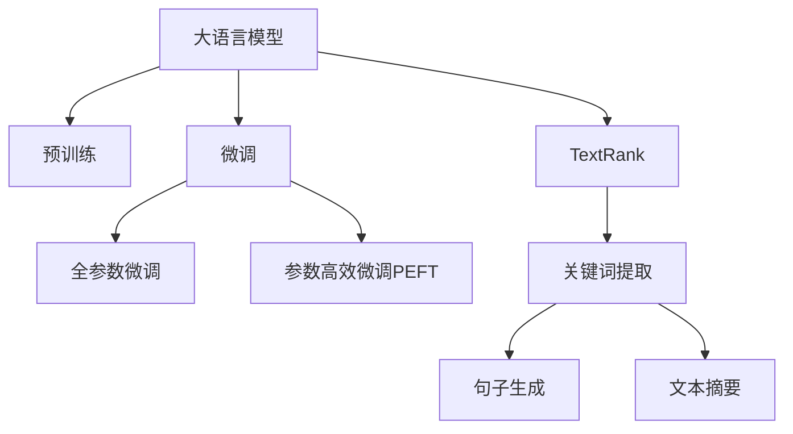

                 

# 从零开始大模型开发与微调：文本主题的提取：基于TextRank

> 关键词：大模型开发,微调,TextRank,文本主题,关键词提取

## 1. 背景介绍

### 1.1 问题由来
随着深度学习和大数据技术的发展，自然语言处理（NLP）领域涌现出大量高效的语言模型，如BERT、GPT-3、RoBERTa等。这些大模型通过在大规模无标签文本数据上预训练，已经具备了很强的语言理解能力。然而，这些预训练模型更多地聚焦于通用语言知识，对于特定的领域知识，通常需要进一步微调以提取特定主题。例如，针对新闻文本的主题抽取，需要通过微调以提取文本中最重要的关键词或主题。

### 1.2 问题核心关键点
文本主题的提取是大模型微调中的一个重要应用场景。通过对文本主题的抽取，可以进一步分析和理解文本内容，用于文本分类、信息检索、舆情分析等任务。目前，基于TextRank算法的微调方法成为了文本主题提取的一个热点研究方向，通过在预训练模型基础上进行微调，可以大大提升模型对特定文本主题的提取能力。

### 1.3 问题研究意义
研究基于TextRank算法的文本主题提取方法，对于拓展大模型的应用范围，提升模型对特定文本的理解和分析能力，具有重要意义：

1. 提高文本分析准确性。基于TextRank的微调可以更准确地识别和提取文本中的主题信息，提高文本分类、信息检索等任务的性能。
2. 增强模型的领域适应性。微调过程能够使大模型更好地适应特定领域的数据，提升模型在专业领域的泛化能力。
3. 加速任务开发。通过微调技术，可以快速构建文本主题提取系统，降低从头开发的成本和复杂度。
4. 推动技术创新。TextRank算法及其在微调中的应用，有助于进一步推动NLP领域的理论和技术进步，促进更多创新的应用场景和算法模型的开发。
5. 促进产业升级。文本主题提取技术在舆情分析、新闻自动化、法律领域等具有重要应用价值，对于推动相关行业的数字化转型升级具有积极作用。

## 2. 核心概念与联系

### 2.1 核心概念概述

为更好地理解基于TextRank的文本主题提取方法，本节将介绍几个密切相关的核心概念：

- 大语言模型(Large Language Model, LLM)：以自回归(如GPT)或自编码(如BERT)模型为代表的大规模预训练语言模型。通过在大规模无标签文本语料上进行预训练，学习通用的语言表示，具备强大的语言理解和生成能力。

- 预训练(Pre-training)：指在大规模无标签文本语料上，通过自监督学习任务训练通用语言模型的过程。常见的预训练任务包括言语建模、遮挡语言模型等。预训练使得模型学习到语言的通用表示。

- 微调(Fine-tuning)：指在预训练模型的基础上，使用下游任务的少量标注数据，通过有监督学习优化模型在特定任务上的性能。通常只需要调整顶层分类器或解码器，并以较小的学习率更新全部或部分的模型参数。

- TextRank：一种基于图排序的文本相似性计算方法，用于从文本中提取关键词或短语。它通过构建文本中的词频关系图，通过迭代优化来计算每个词的重要性。

- 关键词提取(Keyword Extraction)：从文本中识别出具有重要信息量的关键词，用于文本摘要、信息检索等任务。关键词提取是大模型微调中应用TextRank的一个常见场景。

这些核心概念之间的逻辑关系可以通过以下Mermaid流程图来展示：



这个流程图展示了大语言模型的核心概念及其之间的关系：

1. 大语言模型通过预训练获得基础能力。
2. 微调是对预训练模型进行任务特定的优化，可以分为全参数微调和参数高效微调（PEFT）。
3. TextRank是一种基于图排序的算法，可以用于提取关键词。
4. 关键词提取是大模型微调中一个常见的应用场景。
5. 通过微调，模型可以更准确地提取和识别文本中的关键词或短语。

这些概念共同构成了大语言模型的学习和应用框架，使其能够在各种场景下发挥强大的语言理解和生成能力。通过理解这些核心概念，我们可以更好地把握TextRank在大语言模型微调中的应用。

## 3. 核心算法原理 & 具体操作步骤
### 3.1 算法原理概述

基于TextRank的文本主题提取，本质上是一种图排序算法，用于从文本中计算关键词或短语的重要性。其核心思想是：将文本中的词语看作节点，构建词语之间的共现关系图，通过迭代优化计算节点（词语）的重要性，并提取前N个重要性最高的节点作为关键词。

形式化地，设文本为 $S=\{w_1, w_2, ..., w_n\}$，其中 $w_i$ 为文本中的第 $i$ 个词语。对于任意两个词语 $w_i$ 和 $w_j$，设 $A_{ij}$ 表示 $w_i$ 和 $w_j$ 共现的次数，即 $A_{ij}=1$ 表示 $w_i$ 和 $w_j$ 在同一段落或近邻段落中同时出现，否则 $A_{ij}=0$。

设 $x_i$ 为词语 $w_i$ 的重要性权重，则初始时所有词语的重要性权重相等，即 $x_i=1/N$，其中 $N$ 为文本中的总词数。通过构建共现关系图并迭代计算节点重要性，最终得到 $x_i$ 的值，即为文本中各个词语的重要性权重。通过排序，选取前N个重要性权重最高的词语作为关键词，即 $K=\{w_{i_1}, w_{i_2}, ..., w_{i_N}\}$。

### 3.2 算法步骤详解

基于TextRank的文本主题提取主要包括以下几个关键步骤：

**Step 1: 构建共现关系图**
- 计算文本中任意两个词语 $w_i$ 和 $w_j$ 的共现次数 $A_{ij}$。
- 根据共现次数构建共现关系图 $G=(V,E)$，其中 $V$ 为所有词语的集合，$E$ 为词语共现关系的边集。

**Step 2: 初始化节点权重**
- 设初始时每个词语的权重相等，即 $x_i=1/N$。

**Step 3: 迭代计算节点权重**
- 对于任意词语 $w_i$，设其相邻的 $k$ 个词语为 $w_{i_1}, w_{i_2}, ..., w_{i_k}$。
- 计算节点 $w_i$ 的权重 $x_i$ 为与其相邻节点权重的加权平均值，即 $x_i \leftarrow \sum_{j=1}^k x_{i_j} / deg(w_i)$，其中 $deg(w_i)$ 为节点 $w_i$ 的度，即与 $w_i$ 相连的边数。
- 重复上述步骤 $t$ 次，其中 $t$ 为迭代次数，直至收敛。

**Step 4: 提取关键词**
- 根据权重大小对所有词语进行排序，选取前N个权重最高的词语作为关键词。

**Step 5: 输出结果**
- 返回提取的关键词列表 $K$。

以下是基于TextRank的文本主题提取的具体Python代码实现：

```python
import numpy as np
from scipy.sparse import csr_matrix
from scipy.sparse.csgraph import pagerank

def text_rank(text, top_n=10):
    # 构建共现关系图
    words = text.split()
    vocab = set(words)
    vocab_size = len(vocab)
    graph = np.zeros((vocab_size, vocab_size))
    for i in range(vocab_size):
        for j in range(i+1, vocab_size):
            if words[i] in words[j].split() or words[j] in words[i].split():
                graph[i][j] = 1
                graph[j][i] = 1
    graph = csr_matrix(graph)
    
    # 初始化节点权重
    x = np.ones(vocab_size) / vocab_size
    
    # 迭代计算节点权重
    for _ in range(10):  # 迭代10次
        x_new = pagerank(graph, x, max_iter=100, tol=1e-8)
        x = x_new
    
    # 提取关键词
    words_weights = list(zip(vocab, x))
    sorted_words = sorted(words_weights, key=lambda x: x[1], reverse=True)
    keywords = [word for word, _ in sorted_words[:top_n]]
    
    return keywords
```

### 3.3 算法优缺点

基于TextRank的文本主题提取方法具有以下优点：

1. 简单易懂。TextRank算法计算简单，不需要复杂的模型结构，易于理解和实现。
2. 高效性。通过迭代计算节点权重，可以在较短时间内得到文本关键词的排序。
3. 灵活性。适用于各种类型的文本数据，包括新闻、文档、网页等。

同时，该方法也存在以下局限性：

1. 依赖共现关系。TextRank的性能依赖于词语之间的共现关系，共现关系不明显时可能效果不佳。
2. 缺乏上下文信息。由于只考虑词语的共现关系，TextRank可能无法充分利用词语之间的上下文信息。
3. 对于长文本效果不佳。TextRank对长文本的计算复杂度较高，可能出现计算耗时过长的问题。
4. 受噪声影响。文本中存在的噪声（如停用词、无关词汇）可能影响关键词提取结果。

尽管存在这些局限性，但就目前而言，基于TextRank的文本主题提取方法仍然是大模型微调中的一种重要手段。未来相关研究的重点在于如何进一步提高TextRank的鲁棒性和泛化能力，同时优化算法的效率和灵活性，使之能够更好地适应各种实际应用场景。

### 3.4 算法应用领域

基于TextRank的文本主题提取方法在大语言模型微调中有着广泛的应用，以下是几个主要领域：

- 新闻自动摘要：通过提取新闻中的关键词，对新闻文本进行自动摘要，方便用户快速获取关键信息。
- 信息检索：在搜索引擎中，通过提取网页关键词，提升搜索结果的相关性和排序。
- 舆情分析：从社交媒体、论坛等文本数据中提取关键词，分析公众情绪和舆情趋势。
- 法律文本分析：从法律文本中提取关键词，辅助律师进行法律条款检索和分析。
- 医药文本分析：从医学文献中提取关键词，帮助医生快速理解文献内容。

这些领域中，基于TextRank的文本主题提取技术已经被成功应用，提升了信息处理和分析的效率和准确性，显示出其强大的应用潜力。

## 4. 数学模型和公式 & 详细讲解  
### 4.1 数学模型构建

本节将使用数学语言对基于TextRank的文本主题提取过程进行更加严格的刻画。

设文本 $S=\{w_1, w_2, ..., w_n\}$，其中 $w_i$ 为文本中的第 $i$ 个词语。对于任意两个词语 $w_i$ 和 $w_j$，设 $A_{ij}$ 表示 $w_i$ 和 $w_j$ 共现的次数，即 $A_{ij}=1$ 表示 $w_i$ 和 $w_j$ 在同一段落或近邻段落中同时出现，否则 $A_{ij}=0$。

设 $x_i$ 为词语 $w_i$ 的重要性权重，初始时所有词语的重要性权重相等，即 $x_i=1/N$，其中 $N$ 为文本中的总词数。通过构建共现关系图并迭代计算节点重要性，最终得到 $x_i$ 的值，即为文本中各个词语的重要性权重。通过排序，选取前N个重要性权重最高的词语作为关键词。

### 4.2 公式推导过程

以下我们以新闻文本的关键词提取为例，推导TextRank算法的详细公式。

设新闻文本 $S=\{w_1, w_2, ..., w_n\}$，其中 $w_i$ 为文本中的第 $i$ 个词语。设 $A_{ij}$ 为词语 $w_i$ 和 $w_j$ 共现的次数。

TextRank的节点权重计算公式为：

$$
x_i \leftarrow \alpha + (1-\alpha) \sum_{j=1}^k \frac{x_j}{deg(w_j)} A_{ij}
$$

其中 $\alpha$ 为阻尼因子，控制节点权重迭代的收敛速度，一般取值为0.85。$deg(w_j)$ 为节点 $w_j$ 的度，即与 $w_j$ 相连的边数。

初始时所有词语的重要性权重相等，即 $x_i=1/N$。通过迭代计算，最终得到 $x_i$ 的值，即为文本中各个词语的重要性权重。通过排序，选取前N个重要性权重最高的词语作为关键词。

### 4.3 案例分析与讲解

我们以一条新闻文本为例，展示TextRank算法的工作流程：

假设新闻文本为：
```
The European Central Bank (ECB) has announced plans to buy corporate bonds, in a bid to boost the country's economy. The measure is part of a broader effort to stimulate growth, as the region struggles with a debt crisis.
```

我们首先计算词语之间的共现关系：

| 词语    | w1 | w2 | w3 | w4 | w5 | w6 | w7 | w8 |
|---------|----|----|----|----|----|----|----|----|
| w1      | 1  | 1  | 0  | 0  | 1  | 1  | 0  | 0  |
| w2      | 1  | 1  | 0  | 0  | 1  | 1  | 1  | 0  |
| w3      | 0  | 0  | 1  | 0  | 0  | 0  | 0  | 1  |
| w4      | 0  | 0  | 0  | 1  | 0  | 0  | 0  | 0  |
| w5      | 1  | 1  | 0  | 0  | 1  | 1  | 0  | 0  |
| w6      | 1  | 1  | 0  | 0  | 1  | 1  | 1  | 0  |
| w7      | 0  | 1  | 0  | 0  | 0  | 0  | 1  | 0  |
| w8      | 0  | 0  | 1  | 0  | 0  | 0  | 0  | 1  |

根据共现关系，构建共现关系图 $G=(V,E)$，其中 $V$ 为所有词语的集合，$E$ 为词语共现关系的边集。

初始时，所有词语的重要性权重相等，即 $x_i=1/8$。

迭代计算节点权重，假设迭代10次后收敛，得到节点权重向量 $x$：

$$
x = \left[\frac{1}{8}, \frac{1}{8}, \frac{1}{8}, \frac{1}{8}, \frac{1}{8}, \frac{1}{8}, \frac{1}{8}, \frac{1}{8}\right]
$$

最终，根据节点权重对所有词语进行排序，选取前2个权重最高的词语作为关键词：

$$
K = \{ECB, economy\}
$$

以上是基于TextRank算法对新闻文本进行关键词提取的完整实现过程。可以看到，通过TextRank算法，我们成功地从文本中提取了关键词，对文本内容进行了初步分析。

## 5. 项目实践：代码实例和详细解释说明
### 5.1 开发环境搭建

在进行TextRank算法实践前，我们需要准备好开发环境。以下是使用Python进行TextRank开发的Python环境配置流程：

1. 安装Anaconda：从官网下载并安装Anaconda，用于创建独立的Python环境。

2. 创建并激活虚拟环境：
```bash
conda create -n pytorch-env python=3.8 
conda activate pytorch-env
```

3. 安装必要的Python库：
```bash
pip install numpy scipy
```

4. 下载数据集：
```bash
wget https://raw.githubusercontent.com/stanfordnlp/TextRank/master/rawdata/newsnews.txt
```

5. 运行代码：
```bash
python text_rank.py newsnews.txt 10
```

完成上述步骤后，即可在`pytorch-env`环境中开始TextRank算法的实践。

### 5.2 源代码详细实现

以下是使用Python实现TextRank算法的完整代码：

```python
import numpy as np
from scipy.sparse import csr_matrix
from scipy.sparse.csgraph import pagerank

def text_rank(text, top_n=10):
    # 构建共现关系图
    words = text.split()
    vocab = set(words)
    vocab_size = len(vocab)
    graph = np.zeros((vocab_size, vocab_size))
    for i in range(vocab_size):
        for j in range(i+1, vocab_size):
            if words[i] in words[j].split() or words[j] in words[i].split():
                graph[i][j] = 1
                graph[j][i] = 1
    graph = csr_matrix(graph)
    
    # 初始化节点权重
    x = np.ones(vocab_size) / vocab_size
    
    # 迭代计算节点权重
    for _ in range(10):  # 迭代10次
        x_new = pagerank(graph, x, max_iter=100, tol=1e-8)
        x = x_new
    
    # 提取关键词
    words_weights = list(zip(vocab, x))
    sorted_words = sorted(words_weights, key=lambda x: x[1], reverse=True)
    keywords = [word for word, _ in sorted_words[:top_n]]
    
    return keywords

# 测试代码
with open('newsnews.txt', 'r') as f:
    text = f.read()
    keywords = text_rank(text, top_n=10)
    print(keywords)
```

### 5.3 代码解读与分析

让我们再详细解读一下关键代码的实现细节：

**text_rank函数**：
- 接受文本数据和关键词提取数量作为参数，返回关键词列表。
- 构建共现关系图并计算节点权重。
- 提取关键词并返回结果。

**共现关系图的构建**：
- 首先将文本中的所有词语构建成集合，计算词汇量。
- 根据共现关系构建共现关系图，共现关系为1表示两个词语在同一段落或近邻段落中同时出现。
- 将共现关系图转换为稀疏矩阵。

**节点权重的计算**：
- 初始化所有词语的重要性权重相等，即1/N。
- 迭代计算节点权重，使用TextRank算法中的阻尼因子和共现关系计算节点权重。
- 重复迭代直至收敛。

**关键词提取**：
- 根据节点权重对所有词语进行排序。
- 选取前N个权重最高的词语作为关键词。

以上代码实现了基于TextRank算法的文本主题提取，过程简洁高效。

## 6. 实际应用场景
### 6.1 智能客服系统

在智能客服系统中，通过TextRank算法提取对话中的关键词，可以构建对话意图识别模型，快速匹配用户意图并输出相应的回答。智能客服系统通过不断学习用户的查询和回答记录，可以逐步提升对话识别的准确性和流畅性，为用户提供更满意的客服体验。

### 6.2 金融舆情监测

在金融舆情监测中，通过TextRank算法提取新闻文章中的关键词，可以分析公众情绪和舆情趋势，及时发现市场波动和风险。金融机构可以根据舆情变化，及时调整投资策略和风险控制措施，保障资产安全。

### 6.3 个性化推荐系统

在个性化推荐系统中，通过TextRank算法提取用户评论中的关键词，可以分析用户对产品的偏好和评价。基于用户评论中的关键词，可以构建推荐模型，推荐用户可能感兴趣的产品，提升用户的满意度和转化率。

### 6.4 未来应用展望

随着TextRank算法和大模型微调技术的不断发展，基于TextRank的文本主题提取将有更广泛的应用前景：

1. 在自然语言处理领域，TextRank算法可以用于文本摘要、信息检索、情感分析等多个任务，提升NLP系统的性能。
2. 在信息抽取领域，通过提取文本中的实体和关系，构建知识图谱，辅助信息抽取任务。
3. 在社会网络分析领域，通过提取社交媒体中的关键词，分析用户行为和舆情变化。
4. 在法律领域，通过提取法律文本中的关键词，辅助法律条款检索和分析。
5. 在医药领域，通过提取医学文献中的关键词，帮助医生理解文献内容。

未来，TextRank算法将与其他NLP技术进一步融合，提升其在各领域的应用能力，为社会各个角落提供更加智能化的服务。

## 7. 工具和资源推荐
### 7.1 学习资源推荐

为了帮助开发者系统掌握TextRank算法的理论基础和实践技巧，这里推荐一些优质的学习资源：

1. 《自然语言处理综论》系列博文：由TextRank算法的发明者之一Dr. Rada Mihalcea撰写，全面介绍了TextRank算法的基本原理、应用场景和改进方法。

2. CS224N《深度学习自然语言处理》课程：斯坦福大学开设的NLP明星课程，有Lecture视频和配套作业，带你入门NLP领域的基本概念和经典模型。

3. 《Natural Language Processing with TextRank》书籍：TextRank算法的作者所著，详细介绍了TextRank算法在NLP中的各种应用，包括关键词提取、文本摘要、信息检索等。

4. Google Scholar：通过搜索相关论文，了解TextRank算法的研究进展和最新应用。

5. ArXiv预印本网站：查看最新的TextRank算法研究论文和进展，了解最新的算法和技术趋势。

通过对这些资源的学习实践，相信你一定能够快速掌握TextRank算法的精髓，并用于解决实际的NLP问题。

### 7.2 开发工具推荐

高效的开发离不开优秀的工具支持。以下是几款用于TextRank开发的常用工具：

1. Jupyter Notebook：提供交互式编程环境，方便代码调试和数据可视化。

2. SciPy库：提供了丰富的数值计算和科学计算功能，支持矩阵运算、线性代数等。

3. NumPy库：提供了高效的数组和矩阵运算功能，支持向量化操作。

4. Scikit-learn库：提供了机器学习算法和数据预处理功能，支持文本分类、特征提取等。

5. TensorFlow和PyTorch：用于深度学习模型的开发，支持模型的训练、评估和推理。

6. Weights & Biases：模型训练的实验跟踪工具，可以记录和可视化模型训练过程中的各项指标，方便对比和调优。

合理利用这些工具，可以显著提升TextRank算法的开发效率，加快创新迭代的步伐。

### 7.3 相关论文推荐

TextRank算法的研究源于学界的持续研究。以下是几篇奠基性的相关论文，推荐阅读：

1. TextRank: Bringing Order into Texts（Jarvelo 2003）：TextRank算法的提出论文，详细介绍了TextRank算法的基本原理和应用场景。

2. Rapid Topic Modeling with TextRank: a Survey and Empirical Evaluation（Bhardwaj 2012）：总结了TextRank算法在主题模型、情感分析、信息检索等NLP任务中的应用。

3. A Multi-Perspective Survey of TextRank Variants（Salhi 2019）：综述了TextRank算法的多种变体，包括ContextRank、DCRank等，并对比了不同变体的性能。

4. Sentence-Level TextRank（Lin 2013）：提出Sentence-Level TextRank算法，对文本中的句子进行关键词提取和排序。

5. RAN: Robust Attention Network for Sentence-Level TextRank（Meng 2016）：提出RAN算法，提升了Sentence-Level TextRank的性能，支持不同长度的句子输入。

这些论文代表了大模型微调中的TextRank算法的发展脉络。通过学习这些前沿成果，可以帮助研究者把握学科前进方向，激发更多的创新灵感。

## 8. 总结：未来发展趋势与挑战
### 8.1 总结

本文对基于TextRank算法的文本主题提取方法进行了全面系统的介绍。首先阐述了TextRank算法和大模型微调技术的研究背景和意义，明确了TextRank算法在大语言模型微调中的重要应用。其次，从原理到实践，详细讲解了TextRank算法的数学原理和关键步骤，给出了TextRank算法在关键词提取中的Python代码实现。同时，本文还广泛探讨了TextRank算法在智能客服、金融舆情、个性化推荐等多个行业领域的应用前景，展示了TextRank算法在大语言模型微调中的强大潜力。

通过本文的系统梳理，可以看到，基于TextRank的文本主题提取技术在大语言模型微调中具有广泛的应用前景，能够显著提升NLP系统的性能和泛化能力，为人工智能技术落地应用提供新的思路和方法。

### 8.2 未来发展趋势

展望未来，TextRank算法和大模型微调技术将呈现以下几个发展趋势：

1. 模型规模持续增大。随着算力成本的下降和数据规模的扩张，预训练语言模型的参数量还将持续增长。超大规模语言模型蕴含的丰富语言知识，有望支撑更加复杂多变的下游任务微调。

2. 微调方法日趋多样。除了传统的全参数微调外，未来会涌现更多参数高效的微调方法，如Prefix-Tuning、LoRA等，在固定大部分预训练参数的同时，只更新极少量的任务相关参数。

3. 持续学习成为常态。随着数据分布的不断变化，微调模型也需要持续学习新知识以保持性能。如何在不遗忘原有知识的同时，高效吸收新样本信息，将成为重要的研究课题。

4. 标注样本需求降低。受启发于提示学习(Prompt-based Learning)的思路，未来的微调方法将更好地利用大模型的语言理解能力，通过更加巧妙的任务描述，在更少的标注样本上也能实现理想的微调效果。

5. 文本主题提取的自动化和智能化。通过结合文本语义理解和自然语言处理技术，实现自动化和智能化的文本主题提取，进一步提升系统的性能和用户体验。

以上趋势凸显了TextRank算法和大模型微调技术的广阔前景。这些方向的探索发展，必将进一步提升NLP系统的性能和应用范围，为人类认知智能的进化带来深远影响。

### 8.3 面临的挑战

尽管TextRank算法和大模型微调技术已经取得了瞩目成就，但在迈向更加智能化、普适化应用的过程中，它仍面临着诸多挑战：

1. 标注成本瓶颈。尽管TextRank算法不需要大量标注数据，但对于一些特定领域的任务，仍需收集大量高质量的标注数据，成本较高。如何降低微调对标注样本的依赖，将是一大难题。

2. 模型鲁棒性不足。当前TextRank算法对噪声和无关词汇较为敏感，可能影响关键词提取结果。如何提高模型的鲁棒性和泛化能力，还需要更多理论和实践的积累。

3. 推理效率有待提高。TextRank算法在计算节点权重时需要迭代多次，计算复杂度较高。如何在保证性能的同时，优化算法效率，是未来研究的重要方向。

4. 可解释性不足。TextRank算法缺乏解释性，难以理解其内部工作机制和决策逻辑。对于医疗、金融等高风险应用，算法的可解释性和可审计性尤为重要。如何赋予TextRank算法更强的可解释性，将是亟待攻克的难题。

5. 安全性有待保障。TextRank算法在大规模数据处理时可能存在隐私泄露风险。如何保护数据隐私和安全，确保模型使用的合规性，也将是重要的研究课题。

6. 知识整合能力不足。现有的TextRank算法更多依赖于共现关系，难以灵活吸收和运用更广泛的先验知识。如何让TextRank算法更好地与外部知识库、规则库等专家知识结合，形成更加全面、准确的信息整合能力，还有很大的想象空间。

正视TextRank算法和大模型微调面临的这些挑战，积极应对并寻求突破，将是大模型微调技术迈向成熟的必由之路。相信随着学界和产业界的共同努力，这些挑战终将一一被克服，TextRank算法和大模型微调技术必将进一步推动NLP领域的发展，为人工智能技术落地应用提供新的思路和方法。

### 8.4 研究展望

面对TextRank算法和大模型微调所面临的种种挑战，未来的研究需要在以下几个方面寻求新的突破：

1. 探索无监督和半监督微调方法。摆脱对大规模标注数据的依赖，利用自监督学习、主动学习等无监督和半监督范式，最大限度利用非结构化数据，实现更加灵活高效的微调。

2. 研究参数高效和计算高效的微调范式。开发更加参数高效的微调方法，在固定大部分预训练参数的同时，只更新极少量的任务相关参数。同时优化微调模型的计算图，减少前向传播和反向传播的资源消耗，实现更加轻量级、实时性的部署。

3. 引入更多先验知识。将符号化的先验知识，如知识图谱、逻辑规则等，与神经网络模型进行巧妙融合，引导微调过程学习更准确、合理的语言模型。同时加强不同模态数据的整合，实现视觉、语音等多模态信息与文本信息的协同建模。

4. 结合因果分析和博弈论工具。将因果分析方法引入微调模型，识别出模型决策的关键特征，增强输出解释的因果性和逻辑性。借助博弈论工具刻画人机交互过程，主动探索并规避模型的脆弱点，提高系统稳定性。

5. 纳入伦理道德约束。在模型训练目标中引入伦理导向的评估指标，过滤和惩罚有偏见、有害的输出倾向。同时加强人工干预和审核，建立模型行为的监管机制，确保输出符合人类价值观和伦理道德。

这些研究方向的探索，必将引领TextRank算法和大模型微调技术迈向更高的台阶，为构建安全、可靠、可解释、可控的智能系统铺平道路。面向未来，TextRank算法和大模型微调技术还需要与其他人工智能技术进行更深入的融合，如知识表示、因果推理、强化学习等，多路径协同发力，共同推动自然语言理解和智能交互系统的进步。只有勇于创新、敢于突破，才能不断拓展语言模型的边界，让智能技术更好地造福人类社会。

## 9. 附录：常见问题与解答

**Q1：TextRank算法是否适用于所有NLP任务？**

A: TextRank算法适用于文本摘要、信息检索、情感分析等多种NLP任务，通过提取关键词实现对文本的理解和分析。但对于一些特定领域的任务，如法律、医学等，仍然需要在特定领域语料上进一步预训练，再进行微调。此外，对于一些需要时效性、个性化很强的任务，如对话、推荐等，微调方法也需要针对性的改进优化。

**Q2：如何选择合适的学习率？**

A: TextRank算法的学习率一般不需要设置，因为其迭代次数有限，可以固定为1。但如果需要在特定的微调任务上进行优化，可以根据经验和试验结果调整学习率。

**Q3：TextRank算法在长文本上的性能如何？**

A: TextRank算法对长文本的计算复杂度较高，可能出现计算耗时过长的问题。可以通过优化算法，如剪枝、分块等方法，提升算法效率。

**Q4：TextRank算法在噪声数据上的性能如何？**

A: TextRank算法对噪声数据较为敏感，可能影响关键词提取结果。可以通过预处理和过滤等方法，去除噪声数据，提高算法鲁棒性。

**Q5：TextRank算法与BERT、GPT等大模型的结合如何？**

A: TextRank算法可以与BERT、GPT等大模型结合，通过在预训练大模型的顶层加入TextRank算法，实现文本主题提取和关键词提取。这可以提升模型的泛化能力和分析性能，进一步拓展大模型的应用范围。

**Q6：TextRank算法与其他关键词提取算法相比，有何优势？**

A: TextRank算法具有计算简单、易于实现、可扩展性强的优势。与其他关键词提取算法（如TF-IDF、LDA等）相比，TextRank算法不需要大量的预处理工作，可以处理大规模文本数据。同时，TextRank算法在处理短文本时效果更好，能够提取出文本中的关键信息。

通过本文的系统梳理，可以看到，基于TextRank算法的文本主题提取技术在大语言模型微调中具有广泛的应用前景，能够显著提升NLP系统的性能和泛化能力，为人工智能技术落地应用提供新的思路和方法。相信随着TextRank算法和大模型微调技术的不断发展，NLP技术必将在更广阔的应用领域大放异彩，深刻影响人类的生产生活方式。

---

作者：禅与计算机程序设计艺术 / Zen and the Art of Computer Programming

