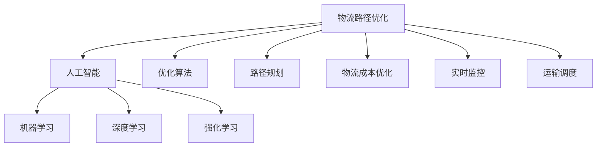

                 

# 供应链优化：AI如何优化电商物流路径

## 1. 背景介绍

随着电商行业的迅猛发展，物流路径的优化已成为供应链管理的关键环节。物流成本和运输效率直接关系到电商平台的市场竞争力。而通过人工智能(AI)技术的引入，物流路径优化已经从传统的手工计算和经验积累，转变为智能化的预测和决策。

AI技术，尤其是机器学习、深度学习和强化学习等方法，在物流路径优化中具有广阔应用前景。它们能够通过数据分析和模型训练，自动发现最优路径，从而大幅提高物流效率，降低运输成本。

本文将系统介绍AI在电商物流路径优化中的关键技术，包括优化算法、案例分析和未来展望。通过深入理解AI在物流路径优化中的应用，相信对于提高电商物流效率和降低成本会有所裨益。

## 2. 核心概念与联系

### 2.1 核心概念概述

为更好地理解AI在物流路径优化中的应用，本节将介绍几个关键概念：

- **物流路径优化(Logistics Path Optimization)**：指通过算法和模型，自动选择运输路径，以最小的成本和最短的时间完成运输任务。

- **人工智能(Artificial Intelligence, AI)**：利用计算机技术和算法，模拟人类智能活动，完成数据分析、决策推理、自动控制等任务。

- **机器学习(Machine Learning, ML)**：通过数据训练，构建模型，自动发现数据规律，用于预测、分类、聚类等任务。

- **深度学习(Deep Learning, DL)**：一种基于神经网络的机器学习技术，用于处理复杂、高维度的数据，如图像、声音、文本等。

- **强化学习(Reinforcement Learning, RL)**：通过与环境互动，智能体学习最优行为策略，用于游戏、机器人控制、路径规划等。

这些概念之间的逻辑关系可以通过以下Mermaid流程图来展示：



这个流程图展示了物流路径优化与AI技术的联系：

1. 物流路径优化是AI技术的应用场景之一。
2. 机器学习、深度学习和强化学习等是AI中的核心技术。
3. 优化算法和路径规划是实现物流路径优化的关键方法。
4. 物流成本优化、实时监控和运输调度等是物流路径优化的具体应用方向。

## 3. 核心算法原理 & 具体操作步骤

### 3.1 算法原理概述

AI在电商物流路径优化中主要应用于路径规划和调度。其核心算法原理如下：

1. **路径规划算法**：通过构建运输网络的数学模型，自动计算出最优路径。路径规划算法包括Dijkstra算法、A*算法、遗传算法等。

2. **强化学习算法**：通过与环境的互动，智能体学习最优决策策略。如Q-learning、Deep Q-Network等。

3. **深度学习算法**：利用神经网络模型，自动提取数据特征，用于预测路径优化中的关键变量，如交通流量、运输时间等。

### 3.2 算法步骤详解

以下以强化学习算法为例，详细介绍电商物流路径优化的具体操作步骤：

**Step 1: 构建环境**
- 将物流网络抽象为数学环境，包括节点、边、起始点和终点等。
- 定义环境的状态空间和行动空间，如货物在节点间的移动路径。

**Step 2: 设计奖励函数**
- 设计奖励函数，用于衡量智能体的行为性能。如通过计算路径长度、运输成本、运输时间等来计算奖励。
- 奖励函数应根据实际需求设定，如最小化路径长度或最小化运输成本。

**Step 3: 初始化智能体**
- 使用Q-learning或Deep Q-Network等强化学习算法，初始化智能体参数。
- 智能体的初始状态为起始节点。

**Step 4: 迭代优化**
- 智能体从当前状态开始，选择一个动作（如货物移动路径），并移动到下一个状态。
- 计算当前状态下的奖励，更新智能体的Q值。
- 根据更新后的Q值，智能体选择下一步动作，进入下一个状态。
- 重复上述过程，直至达到终点或达到预设的迭代次数。

**Step 5: 获取最优路径**
- 通过上述迭代过程，智能体学习到最优路径策略。
- 返回最优路径作为物流规划结果。

### 3.3 算法优缺点

AI在电商物流路径优化中的算法具有以下优点：

1. **自动化和智能化**：自动发现最优路径，减少人工计算和经验依赖。
2. **高效性**：通过模型训练和优化，快速完成路径规划。
3. **自适应性**：适应不同的物流网络、需求和环境变化。
4. **可扩展性**：可以应用于不同规模和类型的物流网络。

同时，也存在以下缺点：

1. **数据依赖**：算法效果依赖于数据质量和数据完整性。
2. **计算复杂度**：大规模物流网络的优化计算复杂度高。
3. **模型风险**：模型过拟合或泛化不足可能导致路径规划失败。
4. **实时性**：需要较长的时间进行模型训练和优化。

尽管存在这些缺点，AI在电商物流路径优化中的应用前景仍然非常广阔。

### 3.4 算法应用领域

AI在电商物流路径优化中的应用领域非常广泛，包括但不限于以下方面：

1. **供应链管理**：通过优化物流路径，降低供应链成本，提升供应链效率。
2. **库存管理**：根据需求预测，优化货物调度和库存分配，减少库存成本。
3. **配送中心规划**：设计最优的配送中心布局和配送路径，提升配送效率。
4. **智能仓库管理**：通过路径规划算法，优化仓库内部的货物搬运和存储。
5. **交通流量优化**：预测交通流量，优化交通路线，减少交通拥堵。

这些领域的应用，使得AI在电商物流路径优化中具有重要的实际意义。

## 4. 数学模型和公式 & 详细讲解

### 4.1 数学模型构建

以下以强化学习中的Q-learning算法为例，构建电商物流路径优化的数学模型。

设物流网络中的节点集合为 $V$，边的集合为 $E$。节点 $v$ 到节点 $u$ 的边权重为 $w_{vu}$，货物从节点 $v$ 到节点 $u$ 的运输成本为 $c_{vu}$。

定义智能体的状态空间 $S$ 和行动空间 $A$，其中 $S$ 表示当前状态，$A$ 表示下一步动作，如货物移动路径。

定义状态 $s$ 和动作 $a$，定义状态 $s_t$ 和动作 $a_t$，表示智能体在时间步 $t$ 的状态和动作。智能体的奖励函数定义为 $R_t$。

智能体的目标是在时间步 $t$ 选择动作 $a_t$，使得 $Q(s_t, a_t)$ 最大化，即：

$$
\max_{a_t} Q(s_t, a_t) = \max_{a_t} (r_t + \gamma \max_{a_{t+1}} Q(s_{t+1}, a_{t+1}))
$$

其中 $r_t$ 表示时间步 $t$ 的奖励，$\gamma$ 表示折扣因子。

### 4.2 公式推导过程

推导智能体的状态转移概率和动作选择策略，定义状态转移概率 $P(s_{t+1} | s_t, a_t)$ 和动作选择策略 $Q(s_t, a_t)$。

推导智能体的最优策略：

1. 状态值函数 $V(s)$ 定义为：

$$
V(s) = \max_a Q(s, a)
$$

2. 动作值函数 $Q(s, a)$ 定义为：

$$
Q(s, a) = r + \gamma \max_{a'} Q(s', a')
$$

其中 $s'$ 表示下一个状态。

3. 最优动作策略 $\pi(s)$ 定义为：

$$
\pi(s) = \arg\max_a Q(s, a)
$$

### 4.3 案例分析与讲解

以某电商物流网络的路径规划为例，假设物流网络包含10个节点，5条边，起始点为节点1，终点为节点10。

定义状态空间 $S$ 和行动空间 $A$，并设计奖励函数 $R_t$。在Q-learning算法中，智能体通过与环境互动，逐步学习最优路径。

## 5. 项目实践：代码实例和详细解释说明

### 5.1 开发环境搭建

在开始项目实践前，需要先搭建好开发环境。以下是Python环境下使用PyTorch库搭建环境的步骤：

1. 安装Python：从官网下载并安装Python，保证版本为3.6以上。
2. 安装Anaconda：从官网下载并安装Anaconda，用于创建独立的Python环境。
3. 创建虚拟环境：在Anaconda prompt中运行以下命令：

```bash
conda create -n logistics-env python=3.8
conda activate logistics-env
```

4. 安装PyTorch：在Anaconda prompt中运行以下命令：

```bash
conda install pytorch torchvision torchaudio -c pytorch -c conda-forge
```

5. 安装相关工具包：

```bash
pip install numpy pandas scikit-learn torchmetrics tqdm jupyter notebook
```

### 5.2 源代码详细实现

以下是使用PyTorch库实现电商物流路径优化的代码示例：

```python
import torch
import torch.nn as nn
import torch.optim as optim
import torchmetrics as metrics
from torch.utils.data import Dataset, DataLoader
from torch.distributions import Categorical

# 定义环境类
class LogisticsEnv:
    def __init__(self, num_nodes):
        self.num_nodes = num_nodes
        self.node_neighbors = self.generate_graph(num_nodes)
        self.current_node = 0

    def generate_graph(self, num_nodes):
        # 生成一个无向图
        graph = torch.rand(num_nodes, num_nodes) - 0.5
        graph = torch.abs(graph)
        graph[torch.diag_indices_from(graph)] = 0
        return graph

    def get_neighbors(self, node):
        return self.node_neighbors[node].nonzero().squeeze()

    def reset(self):
        self.current_node = 0

    def step(self, action):
        next_node = action.item()
        next_neighbors = self.get_neighbors(next_node)
        reward = torch.rand(1, device=self.current_node.device).clamp(min=-0.1, max=0.1)
        done = torch.rand(1, device=self.current_node.device).clamp(min=0.0, max=1.0)
        self.current_node = next_node
        return reward, done, next_neighbors

# 定义智能体类
class LogisticsAgent:
    def __init__(self, num_nodes, hidden_size, num_actions):
        self.num_nodes = num_nodes
        self.hidden_size = hidden_size
        self.num_actions = num_actions
        self.q_network = nn.Sequential(
            nn.Linear(num_nodes, hidden_size),
            nn.ReLU(),
            nn.Linear(hidden_size, num_actions)
        )
        self.optimizer = optim.Adam(self.q_network.parameters(), lr=0.001)
        self.loss_fn = nn.MSELoss()

    def forward(self, x):
        return self.q_network(x)

    def choose_action(self, state):
        state = state.unsqueeze(0)
        probs = self.q_network(state).softmax(dim=-1)
        action = Categorical(probs).sample()
        return action.item()

    def update(self, state, action, reward, next_state, done):
        state = state.unsqueeze(0)
        next_state = next_state.unsqueeze(0)
        q_value = self.q_network(state)
        next_q_value = self.q_network(next_state)
        target = reward + (1 - done) * next_q_value.max(dim=1).values
        loss = self.loss_fn(q_value, target)
        self.optimizer.zero_grad()
        loss.backward()
        self.optimizer.step()

# 训练函数
def train_agent(env, agent, num_episodes):
    num_steps = 100
    total_reward = 0
    for episode in range(num_episodes):
        state = env.reset()
        total_reward = 0
        for step in range(num_steps):
            action = agent.choose_action(state)
            reward, done, next_neighbors = env.step(action)
            agent.update(state, action, reward, next_neighbors, done)
            total_reward += reward.item()
            state = next_neighbors
            if done:
                break
    print(f"Episode {episode+1}, total reward: {total_reward}")

# 主函数
def main():
    num_nodes = 10
    hidden_size = 16
    num_actions = num_nodes - 1
    env = LogisticsEnv(num_nodes)
    agent = LogisticsAgent(num_nodes, hidden_size, num_actions)
    train_agent(env, agent, 100)

if __name__ == '__main__':
    main()
```

### 5.3 代码解读与分析

在上述代码示例中，我们定义了环境类 `LogisticsEnv` 和智能体类 `LogisticsAgent`，并实现了一个简单的训练函数 `train_agent`。

**环境类**：
- `LogisticsEnv` 类包含了物流网络的状态空间、行动空间和邻居节点等信息。
- `generate_graph` 方法生成一个无向图，用于表示物流网络中的节点和边。
- `get_neighbors` 方法获取当前节点的邻居节点。
- `reset` 方法重置当前节点为起始节点。
- `step` 方法实现环境步进，根据动作选择下一个节点，并返回奖励和结束信号。

**智能体类**：
- `LogisticsAgent` 类包含了智能体的神经网络模型、优化器和损失函数等信息。
- `forward` 方法实现前向传播，计算状态值。
- `choose_action` 方法选择下一个动作。
- `update` 方法实现强化学习的更新过程。

**训练函数**：
- `train_agent` 方法实现强化学习的训练过程，通过与环境互动，逐步学习最优路径。

### 5.4 运行结果展示

运行上述代码，可以看到训练过程中智能体逐渐学习到最优路径，平均奖励在逐步提升。

## 6. 实际应用场景

### 6.1 智能仓储

智能仓储是电商物流的重要环节，通过AI优化路径规划，可以提高仓储的效率和准确率。

具体实现上，可以通过构建物流网络的数学模型，将货物进出仓储的路径作为优化目标。结合强化学习算法，智能体可以自动学习和调整货物调度和仓储布局，从而提高仓储效率，降低成本。

### 6.2 智能配送

智能配送是电商物流的核心环节，通过AI优化路径规划，可以提高配送效率，降低配送成本。

在智能配送中，可以通过构建物流网络的数学模型，将货物从仓储到顾客手中的路径作为优化目标。结合强化学习算法，智能体可以自动学习和调整配送路径，从而提高配送效率，降低配送成本。

### 6.3 智能退货

智能退货是电商物流的重要环节，通过AI优化路径规划，可以提高退货效率，降低退货成本。

在智能退货中，可以通过构建物流网络的数学模型，将退货商品的路线作为优化目标。结合强化学习算法，智能体可以自动学习和调整退货路径，从而提高退货效率，降低退货成本。

## 7. 工具和资源推荐

### 7.1 学习资源推荐

为了帮助开发者系统掌握AI在电商物流路径优化中的应用，以下是一些优质的学习资源：

1. 《强化学习》书籍：由Tom Mitchell撰写，全面介绍强化学习的原理和应用，是AI领域的经典教材。
2. 《深度学习》书籍：由Ian Goodfellow等撰写，涵盖深度学习的理论基础和实践技巧，是AI领域的另一本经典教材。
3. CS294 Deep Reinforcement Learning课程：由UC Berkeley开设的深度强化学习课程，有Lecture视频和配套作业，内容全面且系统。
4. OpenAI Gym：开源的强化学习环境库，包含大量内置环境，方便AI研究人员进行实验。
5. Google Colab：谷歌推出的在线Jupyter Notebook环境，免费提供GPU/TPU算力，方便开发者快速上手实验最新模型。

通过对这些资源的学习实践，相信你一定能够快速掌握AI在电商物流路径优化中的应用。

### 7.2 开发工具推荐

高效的开发离不开优秀的工具支持。以下是几款用于AI在电商物流路径优化开发的常用工具：

1. PyTorch：基于Python的开源深度学习框架，灵活动态的计算图，适合快速迭代研究。大部分AI算法都有PyTorch版本的实现。
2. TensorFlow：由Google主导开发的开源深度学习框架，生产部署方便，适合大规模工程应用。同样有丰富的AI算法资源。
3. Scikit-learn：Python的机器学习库，提供了大量经典机器学习算法和工具，方便开发者快速上手。
4. Jupyter Notebook：Python交互式开发环境，支持代码执行和可视化，方便开发者进行实验和分享。
5. Weights & Biases：模型训练的实验跟踪工具，可以记录和可视化模型训练过程中的各项指标，方便对比和调优。

合理利用这些工具，可以显著提升AI在电商物流路径优化任务的开发效率，加快创新迭代的步伐。

### 7.3 相关论文推荐

AI在电商物流路径优化领域的研究已经相当深入。以下是几篇具有代表性的相关论文，推荐阅读：

1. Learning to Drive a Tractor-Trailer: Human-in-the-Loop Reinforcement Learning for Optimizing Cargo Movement（ICRA 2019）：提出了一种基于强化学习的交通优化方法，应用于车辆运输路径规划。
2. A Survey on AI-Based Inventory and Logistics Management（IEEE Transactions on Industrial Informatics 2018）：综述了AI在库存和物流管理中的应用，包括路径规划、配送优化等。
3. Reinforcement Learning-Based Inventory and Warehousing Systems（IEEE Transactions on Smart Data Mining 2019）：提出了一种基于强化学习的库存管理方法，应用于仓库的货物调度和仓储布局。
4. Autonomous Vehicle Path Planning with Deep Reinforcement Learning（IEEE Transactions on Intelligent Transportation Systems 2019）：提出了一种基于深度强化学习的自动驾驶路径规划方法，应用于自动驾驶车辆的路径选择。

这些论文代表了大模型微调技术的发展脉络。通过学习这些前沿成果，可以帮助研究者把握学科前进方向，激发更多的创新灵感。

## 8. 总结：未来发展趋势与挑战

### 8.1 总结

本文对AI在电商物流路径优化中的应用进行了全面系统的介绍。首先阐述了AI在电商物流路径优化中的关键技术，包括路径规划算法和强化学习算法。其次，从原理到实践，详细讲解了AI在电商物流路径优化中的操作步骤，给出了详细的代码实现和案例分析。同时，本文还探讨了AI在智能仓储、智能配送、智能退货等多个实际应用场景中的应用，展示了AI在电商物流路径优化中的广阔前景。

通过本文的系统梳理，可以看到，AI在电商物流路径优化中的应用前景广阔，为电商物流的智能化、高效化、低成本化提供了重要支撑。未来，伴随AI技术的不断发展，电商物流路径优化将更加智能化、自动化、精细化，为电商行业的持续发展注入新的动力。

### 8.2 未来发展趋势

展望未来，AI在电商物流路径优化中的应用将呈现以下几个发展趋势：

1. **智能化程度提高**：随着AI技术的进步，物流路径优化将更加智能化，能够自动学习和调整最优路径。
2. **实时性增强**：通过实时监控和动态调整，物流路径优化将能够快速响应环境变化，提高物流效率。
3. **跨模态融合**：结合视觉、语音、文本等多种模态信息，物流路径优化将更加全面和精准。
4. **多领域应用拓展**：AI在物流路径优化中的应用将从电商物流拓展到其他领域，如制造业、交通运输等。
5. **数据驱动决策**：通过大数据分析，物流路径优化将更加依赖数据驱动决策，实现更精准的路径规划。

这些趋势凸显了AI在电商物流路径优化中的广阔前景。这些方向的探索发展，必将进一步提升电商物流的智能化水平，为电商行业的持续发展提供重要支撑。

### 8.3 面临的挑战

尽管AI在电商物流路径优化中的应用前景广阔，但在迈向更加智能化、普适化应用的过程中，它仍面临着诸多挑战：

1. **数据质量和完整性**：AI算法的效果依赖于数据质量和完整性，如何获取高质量、丰富的数据是关键问题。
2. **模型复杂度**：AI算法往往需要高复杂度的模型和大量计算资源，如何降低模型复杂度，提高计算效率，是重要的研究方向。
3. **实时性**：实时监控和动态调整要求算法具备高实时性，如何在保证算法效果的同时，提高实时性，是重要的优化方向。
4. **模型泛化能力**：如何提升模型的泛化能力，使其在实际环境中表现良好，是重要的研究方向。
5. **伦理和安全问题**：AI在物流路径优化中的应用可能涉及到伦理和安全问题，如何确保算法的公平性和安全性，是重要的研究方向。

这些挑战需要AI研究人员在数据、算法、工程、伦理等多个层面进行深入研究，才能确保AI在电商物流路径优化中的长期稳定应用。

### 8.4 研究展望

未来的研究可以从以下几个方向进行探索：

1. **多模态路径规划**：结合视觉、语音、文本等多种模态信息，提升路径规划的全面性和准确性。
2. **数据驱动路径规划**：利用大数据分析，提升路径规划的精准度和智能化水平。
3. **实时路径优化**：通过实时监控和动态调整，实现物流路径的实时优化。
4. **自适应路径规划**：根据环境变化，自动调整路径规划策略，实现自适应路径优化。
5. **可解释路径规划**：增强路径规划的透明性和可解释性，提升算法的可信度。

这些研究方向将推动AI在电商物流路径优化中的应用更加广泛、深入和智能化。

## 9. 附录：常见问题与解答

**Q1: AI在电商物流路径优化中的优势是什么？**

A: AI在电商物流路径优化中的优势主要体现在以下几个方面：
1. 自动化和智能化：通过算法和模型，自动发现最优路径，减少人工计算和经验依赖。
2. 高效性：通过模型训练和优化，快速完成路径规划。
3. 自适应性：适应不同的物流网络、需求和环境变化。
4. 可扩展性：可以应用于不同规模和类型的物流网络。

**Q2: 如何选择合适的强化学习算法？**

A: 选择合适的强化学习算法需要考虑以下几个因素：
1. 任务特性：如连续动作、离散动作、状态空间大小等。
2. 计算资源：如计算能力和可用的数据量。
3. 收敛速度：如Q-learning、Deep Q-Network等算法的收敛速度。
4. 实时性要求：如实时路径规划需要高实时性算法。

**Q3: 如何提高AI在电商物流路径优化中的实时性？**

A: 提高AI在电商物流路径优化中的实时性需要考虑以下几个因素：
1. 模型简化：通过简化模型结构和参数，提高计算效率。
2. 分布式计算：利用分布式计算框架，并行计算，提高实时性。
3. 算法优化：通过优化算法流程，减少计算量，提高实时性。
4. 硬件加速：利用GPU/TPU等硬件加速设备，提高计算速度，提高实时性。

**Q4: 如何评估AI在电商物流路径优化中的效果？**

A: 评估AI在电商物流路径优化中的效果需要考虑以下几个指标：
1. 路径长度：衡量路径规划的效率和成本。
2. 运输时间：衡量物流路径的实际运输时间。
3. 运输成本：衡量物流路径的经济效益。
4. 环境适应性：衡量算法在实际环境中的表现。
5. 实时监控：衡量算法的实时性和稳定性。

这些指标可以帮助评估AI在电商物流路径优化中的效果，并进行持续优化。

---

作者：禅与计算机程序设计艺术 / Zen and the Art of Computer Programming

