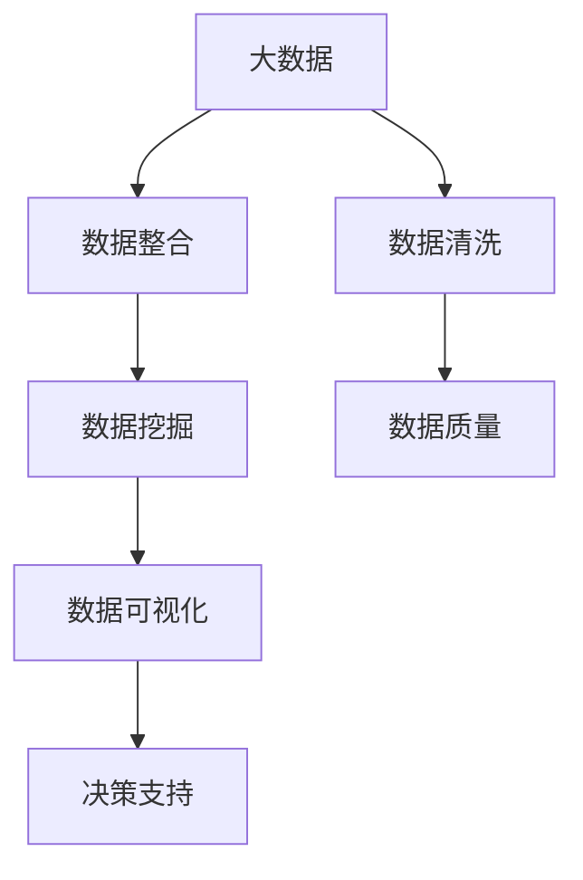

                 

## 1. 背景介绍

### 1.1 问题由来

在当前大数据时代，信息差已经成为了商业决策中一个不可忽视的挑战。随着信息技术的快速发展和互联网的普及，企业需要处理和分析的海量数据也日益增长。然而，由于数据的复杂性和多样性，以及决策者的认知局限，企业在获取、处理和使用这些数据时，往往会面临“信息不对称”的问题，即“信息差”。信息差的存在，不仅可能导致决策失误，还可能引发市场失灵和资源浪费，对企业的运营效率和竞争优势构成重大威胁。

### 1.2 问题核心关键点

信息差的商业挑战核心在于数据获取、处理和利用的效率和准确性。具体表现包括：

- 数据源的多样性和真实性问题。企业需要通过多种数据源获取信息，但这些数据源可能存在噪声、偏差、缺失等，影响决策的准确性。
- 数据处理的复杂性和实时性问题。海量数据需要高效、低延迟地进行处理，以保证决策的时效性。
- 数据整合与融合的难度。不同来源、格式的数据需要进行有效的整合，才能形成对决策有帮助的洞见。
- 数据驱动决策的鲁棒性和可解释性问题。企业需要确保数据驱动的决策具有高度的鲁棒性和可解释性，才能获得利益相关者的信任和支持。

### 1.3 问题研究意义

研究信息差的商业挑战应对方法，对于提升企业的数据决策能力，降低信息不对称带来的风险，具有重要意义：

- 提高决策效率。通过有效利用大数据，企业可以快速获取和分析相关信息，支持高频和即时的决策需求。
- 提升决策准确性。高质量的数据处理和分析方法，可以降低信息差对决策的影响，减少失误和偏差。
- 增强竞争优势。利用大数据技术，企业可以更好地洞察市场趋势，制定更为科学合理的战略。
- 促进创新发展。数据驱动的决策模式，可以激发企业的创新潜力，推动产品和服务不断升级。

## 2. 核心概念与联系

### 2.1 核心概念概述

为更好地理解大数据时代信息差的应对方法，本节将介绍几个密切相关的核心概念：

- 大数据(Big Data)：指体量巨大、类型多样的数据集合，包括结构化数据、非结构化数据、实时数据等。大数据在决策分析中具有重要作用。
- 信息差(Information Gap)：指决策者与数据之间的认知差距，即决策者对数据的理解、处理和应用能力不足。
- 数据清洗(Data Cleaning)：指对原始数据进行去重、去噪、填补缺失等操作，提升数据的质量和可用性。
- 数据整合(Data Integration)：指将不同来源的数据进行标准化、规范化，形成统一的数据模型。
- 数据挖掘(Data Mining)：指从大量数据中提取有价值的信息和知识，支持决策分析。
- 数据可视化(Data Visualization)：指通过图表、图形等形式，直观展示数据洞察，帮助决策者理解数据。

这些核心概念之间的逻辑关系可以通过以下Mermaid流程图来展示：



这个流程图展示了大数据在信息差应对中的核心流程：

1. 大数据经过数据清洗和整合后，形成高质量的数据源。
2. 数据挖掘技术从这些数据源中提取洞见和知识。
3. 数据可视化将洞见和知识以直观的形式呈现，帮助决策者理解数据。
4. 数据质量提升和洞见可视化，最终支持企业的高质量决策。

## 3. 核心算法原理 & 具体操作步骤
### 3.1 算法原理概述

信息差的应对方法，本质上是一种数据驱动的决策优化过程。其核心思想是：通过高效的数据获取、处理和分析，提升决策者的信息获取能力，减少决策中的信息不对称，从而提高决策的准确性和效率。

形式化地，假设企业面对的数据集为 $D=\{(x_i,y_i)\}_{i=1}^N$，其中 $x_i$ 为原始数据，$y_i$ 为真实标签。目标是找到最优的决策模型 $f$，使得：

$$
f = \mathop{\arg\min}_{f} \mathcal{L}(f,D)
$$

其中 $\mathcal{L}$ 为损失函数，用于衡量模型预测输出与真实标签之间的差异。常见的损失函数包括均方误差损失、交叉熵损失等。

通过梯度下降等优化算法，决策模型不断更新参数，最小化损失函数，使得模型预测逼近真实标签。由于数据质量提升和模型优化，决策模型能够更好地处理信息差，减少决策失误。

### 3.2 算法步骤详解

信息差的应对方法一般包括以下几个关键步骤：

**Step 1: 数据采集与预处理**
- 选择合适的数据源，收集与决策相关的数据。
- 进行数据清洗，去除噪声、填补缺失值、处理异常值等，提升数据质量。

**Step 2: 数据整合与标准化**
- 对不同来源、格式的数据进行整合，形成统一的数据模型。
- 进行数据标准化，统一数据单位和格式，便于后续分析和应用。

**Step 3: 数据挖掘与洞见提取**
- 使用数据挖掘技术，从数据中提取有价值的信息和知识。
- 使用统计分析、机器学习等方法，对数据进行建模和预测，提取洞见。

**Step 4: 数据可视化与洞见呈现**
- 将提取的洞见和知识进行可视化，如绘制图表、生成报表等。
- 通过直观的形式，帮助决策者理解数据和洞察。

**Step 5: 决策模型与决策优化**
- 将数据洞察转化为可执行的决策模型。
- 使用优化算法，对决策模型进行优化，提升决策效率和准确性。

### 3.3 算法优缺点

信息差应对方法具有以下优点：
1. 提升决策效率。通过高效的数据处理和分析，快速获取和应用相关信息。
2. 提升决策准确性。高质量的数据清洗和挖掘，降低信息差对决策的影响。
3. 增强数据驱动决策的可解释性。数据可视化和洞见提取，帮助决策者理解数据。

同时，该方法也存在一定的局限性：
1. 数据质量依赖性强。数据清洗和整合的效果，直接影响信息差的应对效果。
2. 技术复杂度较高。数据挖掘和机器学习技术需要较高的专业技能，普通决策者难以独立使用。
3. 数据隐私和安全问题。数据整合和挖掘过程中，涉及大量敏感信息，可能引发隐私泄露和安全风险。
4. 数据驱动决策的适用性。信息差应对方法在数据驱动决策领域具有较好的效果，但对传统决策模式的支持不足。

尽管存在这些局限性，但就目前而言，信息差应对方法仍是数据驱动决策中的主流范式。未来相关研究的重点在于如何进一步降低技术复杂度，提升数据隐私保护，同时兼顾可解释性和适用性等因素。

### 3.4 算法应用领域

信息差应对方法在商业决策中具有广泛的应用场景，包括：

- 市场分析：通过分析消费者行为数据、市场趋势数据，预测市场变化，制定营销策略。
- 风险管理：利用历史数据和模型，评估和控制企业运营风险。
- 供应链优化：分析供应链数据，优化物流、库存、生产等环节，提高运营效率。
- 财务分析：通过分析财务报表、市场数据，支持财务决策，优化资金管理。
- 客户关系管理：利用客户行为数据，提升客户满意度和忠诚度，拓展市场份额。
- 产品开发：通过分析用户反馈和市场数据，指导新产品开发和改进。

除了这些经典应用外，信息差应对方法还被创新性地应用于更多场景中，如智能投顾、智慧医疗、智能交通等，为商业决策带来了新的突破。随着大数据技术的不断进步，相信信息差应对方法将在更多领域得到应用，为商业决策提供更为科学和可靠的支撑。

## 4. 数学模型和公式 & 详细讲解  
### 4.1 数学模型构建

本节将使用数学语言对信息差应对方法进行更加严格的刻画。

记企业面对的数据集为 $D=\{(x_i,y_i)\}_{i=1}^N$，其中 $x_i$ 为原始数据，$y_i$ 为真实标签。假设决策模型为 $f$，其参数为 $\theta$。决策模型的损失函数为 $\ell(f(x_i),y_i)$，则数据集上的经验风险为：

$$
\mathcal{L}(\theta) = \frac{1}{N} \sum_{i=1}^N \ell(f(x_i),y_i)
$$

其中 $\ell$ 为损失函数，用于衡量模型预测输出与真实标签之间的差异。常见的损失函数包括均方误差损失、交叉熵损失等。

### 4.2 公式推导过程

以下我们以二分类任务为例，推导均方误差损失函数及其梯度的计算公式。

假设决策模型 $f$ 在输入 $x$ 上的输出为 $\hat{y}=f(x)$，表示样本属于正类的概率。真实标签 $y \in \{0,1\}$。则均方误差损失函数定义为：

$$
\ell(f(x),y) = (f(x)-y)^2
$$

将其代入经验风险公式，得：

$$
\mathcal{L}(\theta) = \frac{1}{N}\sum_{i=1}^N (f(x_i)-y_i)^2
$$

根据链式法则，损失函数对参数 $\theta$ 的梯度为：

$$
\frac{\partial \mathcal{L}(\theta)}{\partial \theta} = \frac{1}{N}\sum_{i=1}^N \frac{\partial f(x_i)}{\partial \theta} \cdot 2(f(x_i)-y_i)
$$

其中 $\frac{\partial f(x_i)}{\partial \theta}$ 可通过反向传播算法高效计算。

在得到损失函数的梯度后，即可带入优化算法，完成决策模型的迭代优化。重复上述过程直至收敛，最终得到适应信息差应对的最优模型参数 $\theta^*$。

## 5. 项目实践：代码实例和详细解释说明
### 5.1 开发环境搭建

在进行信息差应对实践前，我们需要准备好开发环境。以下是使用Python进行Pandas开发的环境配置流程：

1. 安装Anaconda：从官网下载并安装Anaconda，用于创建独立的Python环境。

2. 创建并激活虚拟环境：
```bash
conda create -n pandas-env python=3.8 
conda activate pandas-env
```

3. 安装Pandas：
```bash
pip install pandas
```

4. 安装各类工具包：
```bash
pip install numpy matplotlib seaborn scikit-learn jupyter notebook ipython
```

完成上述步骤后，即可在`pandas-env`环境中开始信息差应对实践。

### 5.2 源代码详细实现

下面我们以市场分析任务为例，给出使用Pandas库对数据进行清洗、整合和挖掘的PyTorch代码实现。

首先，定义数据处理函数：

```python
import pandas as pd
import numpy as np

def data_cleaning(df):
    # 去除缺失值
    df = df.dropna()
    # 处理异常值
    df = df[(df['销售额'] > 0)]
    # 数据标准化
    df['销售额'] = (df['销售额'] - df['销售额'].mean()) / df['销售额'].std()
    return df

def data_integration(df):
    # 数据整合
    merged_df = pd.merge(df, customer_df, on='customer_id')
    return merged_df

def data_mining(df):
    # 数据挖掘
    from sklearn.linear_model import LinearRegression
    model = LinearRegression()
    df['销售额预测'] = model.fit_transform(df[['销售额', '客户数']], df['销售额'])
    return df

# 加载数据
df = pd.read_csv('sales_data.csv')
customer_df = pd.read_csv('customer_data.csv')
```

然后，定义数据清洗、整合和挖掘函数：

```python
df = data_cleaning(df)
df = data_integration(df)
df = data_mining(df)
```

最后，输出清洗后的数据：

```python
print(df.head())
```

以上就是使用Pandas对市场分析数据进行清洗、整合和挖掘的完整代码实现。可以看到，利用Pandas强大的数据处理功能，可以快速高效地完成数据预处理和分析任务。

### 5.3 代码解读与分析

让我们再详细解读一下关键代码的实现细节：

**data_cleaning函数**：
- `dropna`方法：去除数据中的缺失值，确保数据完整性。
- `df['销售额'] > 0`条件：筛选出销售额大于0的数据，去除异常值。
- `(df['销售额'] - df['销售额'].mean()) / df['销售额'].std()`：标准化处理销售额数据，确保数据分布一致。

**data_integration函数**：
- `pd.merge`方法：将销售数据和客户数据合并，形成统一的数据模型。

**data_mining函数**：
- `LinearRegression`模型：使用线性回归模型，对销售额进行预测。

通过这些函数，我们完成了数据清洗、整合和挖掘的过程，得到了可供决策分析的数据模型。在实际应用中，我们还需要根据具体的决策需求，设计更加复杂的数据挖掘和分析算法，以提取更有价值的洞见。

## 6. 实际应用场景
### 6.1 智能投顾系统

智能投顾系统是信息差应对方法的典型应用场景。传统投顾依靠人力进行市场分析和投资决策，往往存在成本高、效率低、主观性强等问题。利用信息差应对方法，智能投顾系统可以自动分析海量市场数据，生成实时投资建议，提高投资决策的效率和准确性。

在技术实现上，可以收集历史交易数据、市场新闻、宏观经济数据等，利用Pandas进行数据清洗和整合，然后使用机器学习模型进行预测和优化，得到投资建议。通过API接口，智能投顾系统可以将投资建议实时推送给用户，提升投资体验。

### 6.2 智能客服系统

智能客服系统利用信息差应对方法，可以自动分析客户的历史聊天记录、情感状态、行为模式等数据，生成智能回复，提高客户服务效率和满意度。

在技术实现上，可以收集客户的历史聊天记录、情感分析结果、行为数据等，利用Pandas进行数据清洗和整合，然后使用自然语言处理模型进行情感识别和智能回复，生成推荐回答。通过API接口，智能客服系统可以将智能回复实时推送给客户，提升客服效率和客户体验。

### 6.3 金融风险管理

金融风险管理是信息差应对方法的另一个重要应用场景。金融企业需要实时监测市场变化，评估风险，制定应对策略。利用信息差应对方法，可以自动分析海量市场数据，生成风险评估报告，支持风险管理决策。

在技术实现上，可以收集市场数据、财务数据、政策数据等，利用Pandas进行数据清洗和整合，然后使用机器学习模型进行风险评估和预测，生成风险报告。通过API接口，金融企业可以将风险报告推送给相关部门，支持风险管理决策。

### 6.4 未来应用展望

随着信息差应对方法的发展，未来其在商业决策中的应用将更加广泛和深入。

在智慧医疗领域，智能诊疗系统可以通过分析海量患者数据，生成智能诊疗方案，提高诊疗效率和准确性。

在智能交通领域，交通管理系统可以通过分析交通流量数据，优化交通流量控制，提升交通效率和安全性。

在智能制造领域，生产管理系统可以通过分析生产数据，优化生产流程，提高生产效率和质量。

此外，在教育、零售、能源等多个领域，信息差应对方法都将得到广泛应用，为商业决策提供更为科学和可靠的数据支持。相信随着信息差应对技术的不断进步，未来的商业决策将更加智能化和自动化，带来更多的价值创造。

## 7. 工具和资源推荐
### 7.1 学习资源推荐

为了帮助开发者系统掌握信息差应对方法的原理和实践，这里推荐一些优质的学习资源：

1. 《大数据分析实战》系列书籍：全面介绍了大数据技术和大数据应用，包括数据清洗、数据整合、数据挖掘等核心技术。

2. 《Python数据科学手册》：详细讲解了Python在数据处理和分析中的应用，适合初学者入门。

3. Kaggle：全球知名的数据科学竞赛平台，提供了大量真实的数据集和案例，帮助开发者实践和提升。

4. Coursera：提供各类数据科学和机器学习课程，覆盖数据清洗、数据整合、数据可视化等核心技能。

5. Udacity：提供机器学习和数据科学项目，通过实战项目提升学习者的数据分析能力。

通过学习这些资源，相信你一定能够快速掌握信息差应对方法的精髓，并用于解决实际的商业决策问题。

### 7.2 开发工具推荐

高效的开发离不开优秀的工具支持。以下是几款用于信息差应对开发的常用工具：

1. Pandas：Python中强大的数据处理库，提供了高效的数据清洗和整合功能，适合数据分析应用。

2. NumPy：Python中常用的数学计算库，提供了高效的矩阵和数组操作，适合数据挖掘和机器学习应用。

3. Matplotlib：Python中常用的数据可视化库，提供了丰富的图表和图形展示功能，适合数据展示和分析。

4. Seaborn：基于Matplotlib的数据可视化库，提供了更加美观和高效的图表展示方式，适合高级数据可视化应用。

5. Scikit-learn：Python中常用的机器学习库，提供了丰富的算法和模型，适合数据挖掘和预测应用。

6. Jupyter Notebook：Python的交互式笔记本工具，支持代码执行、数据展示和文档编辑，适合数据分析和实践。

合理利用这些工具，可以显著提升信息差应对任务的开发效率，加快创新迭代的步伐。

### 7.3 相关论文推荐

信息差应对方法的发展源于学界的持续研究。以下是几篇奠基性的相关论文，推荐阅读：

1. 《大数据的商业应用》：探讨了大数据在商业决策中的应用，包括数据清洗、数据整合、数据挖掘等核心技术。

2. 《机器学习与数据挖掘》：介绍了机器学习算法和数据挖掘技术，为信息差应对方法提供了理论基础。

3. 《智能投顾系统设计》：介绍了智能投顾系统的设计思路和实现方法，展示了信息差应对方法在金融决策中的应用。

4. 《智能客服系统架构》：介绍了智能客服系统的设计思路和实现方法，展示了信息差应对方法在客户服务中的应用。

5. 《金融风险管理》：介绍了金融风险管理的方法和策略，展示了信息差应对方法在金融决策中的应用。

这些论文代表了大数据在商业决策中的应用方向，通过学习这些前沿成果，可以帮助研究者把握学科前进方向，激发更多的创新灵感。

## 8. 总结：未来发展趋势与挑战
### 8.1 总结

本文对信息差应对方法的原理和实践进行了全面系统的介绍。首先阐述了信息差的商业挑战背景和应对方法的研究意义，明确了信息差应对在提升决策效率和准确性方面的独特价值。其次，从原理到实践，详细讲解了信息差应对的数学原理和关键步骤，给出了信息差应对任务开发的完整代码实例。同时，本文还广泛探讨了信息差应对方法在智能投顾、智能客服、金融风险管理等多个行业领域的应用前景，展示了信息差应对范式的巨大潜力。此外，本文精选了信息差应对技术的各类学习资源，力求为读者提供全方位的技术指引。

通过本文的系统梳理，可以看到，信息差应对方法在大数据时代具有重要意义，能够有效提升企业的数据决策能力，降低信息不对称带来的风险。未来，伴随大数据技术的不断进步，信息差应对方法也将进一步发展，为商业决策提供更为科学和可靠的数据支持。

### 8.2 未来发展趋势

展望未来，信息差应对方法将呈现以下几个发展趋势：

1. 数据驱动决策的普及。随着数据技术的普及和应用，越来越多的企业将采用数据驱动的决策模式，提升决策效率和准确性。

2. 数据质量的持续提升。数据清洗和整合技术将不断进步，数据质量将得到更好的保障，信息差应对效果将更加显著。

3. 数据隐私和安全保护。数据隐私和安全问题将得到更多关注，数据驱动决策需要在数据隐私保护和安全防护上做出更多努力。

4. 数据驱动决策的可解释性。数据驱动决策需要具备更高的可解释性，确保决策过程透明、可追溯。

5. 数据驱动决策的智能化。数据驱动决策将进一步向智能化方向发展，结合AI、ML等技术，提供更为精准和高效的决策支持。

6. 数据驱动决策的实时性。数据驱动决策需要具备更高的实时性，支持高频和即时的决策需求。

以上趋势凸显了信息差应对方法在商业决策中的重要性。这些方向的探索发展，必将进一步提升企业的决策能力，为商业决策提供更为科学和可靠的数据支持。

### 8.3 面临的挑战

尽管信息差应对方法已经取得了瞩目成就，但在迈向更加智能化、普适化应用的过程中，它仍面临着诸多挑战：

1. 数据质量依赖性强。数据清洗和整合的效果，直接影响信息差应对效果。

2. 数据隐私和安全问题。数据整合和挖掘过程中，涉及大量敏感信息，可能引发隐私泄露和安全风险。

3. 数据驱动决策的适用性。信息差应对方法在数据驱动决策领域具有较好的效果，但对传统决策模式的支持不足。

4. 数据驱动决策的鲁棒性。数据驱动决策需要在不同数据分布和场景下具备鲁棒性。

5. 数据驱动决策的计算效率。数据驱动决策需要高效计算，避免资源浪费。

6. 数据驱动决策的易用性。数据驱动决策需要具备用户友好的操作界面，方便决策者使用。

这些挑战需要进一步研究和突破，才能真正实现信息差应对方法的广泛应用。

### 8.4 研究展望

面对信息差应对方法面临的挑战，未来的研究需要在以下几个方面寻求新的突破：

1. 探索无监督和半监督数据处理方法。摆脱对大规模标注数据的依赖，利用自监督学习、主动学习等无监督和半监督范式，最大限度利用非结构化数据，实现更加灵活高效的信息差应对。

2. 研究数据驱动决策的智能算法。开发更加智能化的决策算法，结合AI、ML等技术，提供更为精准和高效的决策支持。

3. 加强数据隐私和安全保护。开发数据隐私和安全保护技术，确保数据驱动决策在数据隐私保护和安全防护上的可靠性。

4. 提高数据驱动决策的可解释性。开发可解释性较高的决策算法，确保数据驱动决策过程透明、可追溯。

5. 提升数据驱动决策的计算效率。开发高效的数据处理和计算方法，确保数据驱动决策在计算效率上的优化。

6. 增强数据驱动决策的易用性。开发用户友好的决策工具和界面，确保数据驱动决策在易用性上的优化。

这些研究方向的发展，必将推动信息差应对方法的不断进步，为商业决策提供更为科学和可靠的数据支持。

## 9. 附录：常见问题与解答

**Q1：信息差应对是否适用于所有决策场景？**

A: 信息差应对方法在大多数决策场景上都能取得不错的效果，特别是对于数据驱动的决策场景。但对于一些特定的决策场景，如需要高度主观判断的场景，可能无法完全依赖数据驱动。

**Q2：如何进行数据清洗和整合？**

A: 数据清洗和整合是信息差应对的核心环节，关键在于选择合适的清洗和整合方法。常用的数据清洗方法包括去除噪声、填补缺失值、处理异常值等。常用的数据整合方法包括合并、拼接、标准化等。需要根据具体场景选择合适的方法。

**Q3：如何提升数据驱动决策的可解释性？**

A: 数据驱动决策的可解释性可以通过多种方法提升，如可视化、知识图谱、解释性模型等。可视化可以将决策过程和结果直观展示，知识图谱可以提供背景知识和上下文信息，解释性模型可以提供可解释的决策依据。

**Q4：如何平衡数据隐私和安全保护与决策效率？**

A: 数据隐私和安全保护是信息差应对中的重要问题，需要在保护隐私的同时，兼顾决策效率。可以采用差分隐私、联邦学习等技术，确保数据隐私安全的同时，提升决策效率。

**Q5：如何优化数据驱动决策的计算效率？**

A: 数据驱动决策的计算效率可以通过多种方法提升，如优化算法、并行计算、数据压缩等。优化算法可以减少计算复杂度，并行计算可以提高计算速度，数据压缩可以减少存储空间。

通过这些问题的解答，相信你能够更好地理解信息差应对方法的原理和应用，并在实践中充分发挥其价值。

---

作者：禅与计算机程序设计艺术 / Zen and the Art of Computer Programming

