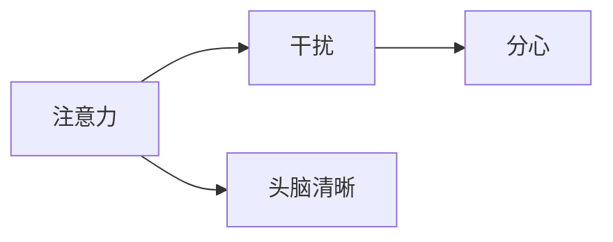
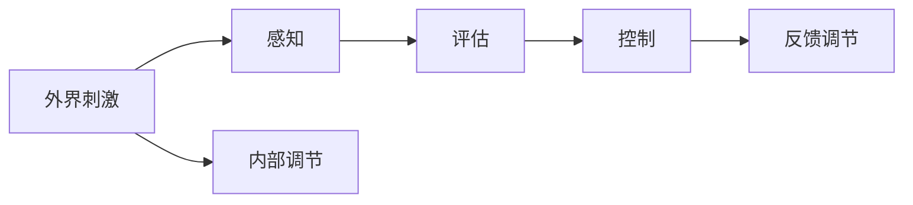

                 

# 信息时代的注意力管理实践与指南：在干扰和分心中保持头脑清晰

## 1. 背景介绍

在信息爆炸的时代，注意力已成为一种稀缺资源。无论是职业发展、个人学习，还是家庭生活，都能感受到注意力管理的必要性。提升注意力管理能力，不仅能提高工作学习效率，还能改善生活质量，提升幸福感。

本论文旨在探索和实践基于信息时代的注意力管理方法，帮助人们更好地控制和管理注意力，避免在干扰和分心中迷失，保持头脑清晰。

## 2. 核心概念与联系

### 2.1 核心概念概述

注意力管理(Anti-Attention Management)是一个多学科交叉的研究领域，融合了心理学、认知科学、神经科学、计算机科学等多方面的知识。其核心概念主要包括：

- **注意力(Anti-Attention)**：指个体对于周围环境或内心世界中的特定信息或事件进行主动选择和聚焦。
- **干扰(Interference)**：指与当前任务无关或无意义的信息或事件对注意力造成的分散和转移。
- **分心(Distracted)**：指个体在执行任务时被外部刺激所吸引，导致注意力无法集中。
- **头脑清晰(Mindfulness)**：指在注意力管理中，对当下环境、感受和情绪的持续关注和觉察，避免陷入分心或干扰。

这些概念之间的关系可以用以下Mermaid流程图表示：



### 2.2 核心概念原理和架构

注意力管理的核心在于认知控制和自我调节。心理学研究表明，注意力控制机制可以分为两个部分：外部过滤和内部控制。

- **外部过滤**：指外界环境中的各种刺激物，如噪音、光线、信息等，对注意力产生干扰。
- **内部控制**：指个体内部对外部刺激的评估和调节，避免受到干扰，保持注意力集中。

基于上述原理，注意力管理的核心架构可以表示为：



其中，外部刺激经过感知、评估、控制和调节，最终实现对注意力的高效管理。内部调节和反馈调节通过心理机制实现自我修正和优化。

## 3. 核心算法原理 & 具体操作步骤

### 3.1 算法原理概述

注意力管理的算法原理主要包括两个部分：注意力选择和分心控制。

- **注意力选择**：指在信息过载的环境中，主动选择重要信息，排除干扰。这可以通过算法推荐、过滤等技术实现。
- **分心控制**：指在分心发生时，快速将注意力拉回任务本身。这可以通过提醒、闹钟、集中训练等方法实现。

### 3.2 算法步骤详解

#### 3.2.1 注意力选择算法

1. **信息分类与筛选**：
   - 定义信息的重要性和相关性，如时间紧迫性、情感相关性、内容相关性等。
   - 利用信息过滤技术，如文本摘要、关键词提取等，对信息进行筛选和分类。

2. **注意力分配算法**：
   - 使用矩阵分解、神经网络等技术，计算每个信息对注意力的贡献度。
   - 根据贡献度对信息进行排序，优先处理重要性高的信息。

3. **信息显示算法**：
   - 采用界面设计技术，将优先级高的信息以突出显示，吸引注意力。
   - 实时动态更新界面，及时展示重要信息的变化。

#### 3.2.2 分心控制算法

1. **分心检测算法**：
   - 使用时间序列分析、生理信号监测等技术，识别分心行为。
   - 设计指标体系，如屏幕时长、信息浏览深度、任务切换频率等，评估分心程度。

2. **分心提醒算法**：
   - 设定分心阈值，当检测到分心行为超过阈值时，触发提醒机制。
   - 采用声音、震动、弹窗等形式进行分心提醒。

3. **注意力恢复算法**：
   - 提供短暂的休息时间，如番茄工作法（Pomodoro Technique），帮助恢复注意力。
   - 采用正念冥想、深呼吸等方法，放松身心，恢复注意力。

### 3.3 算法优缺点

#### 3.3.1 优点

1. **提高效率**：通过智能筛选重要信息，减少信息过载，提高工作效率。
2. **个性化定制**：利用个性化算法，根据用户习惯和偏好，提供定制化的注意力管理方案。
3. **及时响应**：通过即时提醒和恢复，避免分心对任务执行产生影响。

#### 3.3.2 缺点

1. **算法复杂度**：算法实现涉及多学科知识，算法设计复杂度较高。
2. **数据隐私**：算法的实施需要收集和分析用户数据，可能涉及隐私问题。
3. **适应性**：算法效果依赖于用户行为模式，适应性不足可能影响效果。

### 3.4 算法应用领域

注意力管理算法在多个领域都有广泛应用：

- **工作管理**：提升办公室、远程办公、现场施工等环境中的工作效率。
- **教育培训**：提高在线学习、课堂教学等环境中的学习效果。
- **医疗健康**：帮助患者保持健康生活习惯，提升康复效果。
- **家庭生活**：改善家庭环境中的注意力分配，提升家庭成员的幸福感。

## 4. 数学模型和公式 & 详细讲解 & 举例说明

### 4.1 数学模型构建

注意力管理的数学模型可以表示为：

$$
\text{Attention} = \text{InfoRelevance} \times \text{InfoPriority} \times \text{UserPref}
$$

其中，InfoRelevance表示信息的相关性，InfoPriority表示信息的重要性，UserPref表示用户的偏好。

### 4.2 公式推导过程

1. **信息的相关性(InfoRelevance)**：
   - 利用文本分析技术，提取关键词、情感极性等信息特征。
   - 使用TF-IDF、Cosine Similarity等方法，计算信息与用户兴趣的匹配度。

2. **信息的重要性(InfoPriority)**：
   - 利用时间管理算法，如Eisenhower矩阵，对信息进行优先级排序。
   - 根据任务的紧急性和重要性，计算信息的重要度。

3. **用户的偏好(UserPref)**：
   - 通过行为数据分析，建立用户行为模型。
   - 利用机器学习算法，预测用户的偏好和需求。

### 4.3 案例分析与讲解

以职场中的电子邮件管理为例，分析注意力管理算法的具体实现。

1. **信息分类与筛选**：
   - 使用文本摘要技术，提取邮件中的关键词和核心内容。
   - 利用情感分析算法，评估邮件的情感极性，区分紧急和重要邮件。

2. **注意力分配算法**：
   - 利用神经网络模型，训练邮件重要性评估器。
   - 根据评估结果，将邮件分类为高、中、低优先级。

3. **信息显示算法**：
   - 采用界面设计技术，将高优先级邮件以红色标记。
   - 实时动态更新邮件列表，高优先级邮件优先展示。

4. **分心控制算法**：
   - 使用时间序列分析算法，检测邮件阅读时长和切换频率。
   - 当检测到长时间不处理重要邮件或频繁切换时，触发分心提醒。

## 5. 项目实践：代码实例和详细解释说明

### 5.1 开发环境搭建

1. **选择编程语言和框架**：
   - 选择Python作为主要开发语言，利用TensorFlow、PyTorch等深度学习框架。
   - 安装必要的第三方库，如NLTK、SpaCy、Flask等。

2. **配置开发环境**：
   - 安装Visual Studio Code、Jupyter Notebook等IDE和编辑器。
   - 配置Git版本控制工具，管理代码库和版本。

3. **设置开发流程**：
   - 采用敏捷开发方法，如Scrum、Kanban等，提高开发效率。
   - 设计迭代计划和任务清单，逐步推进开发进程。

### 5.2 源代码详细实现

#### 5.2.1 信息分类与筛选

```python
from nltk.corpus import stopwords
from nltk.tokenize import word_tokenize
from sklearn.feature_extraction.text import TfidfVectorizer

def preprocess_text(text):
    # 去除停用词
    stop_words = set(stopwords.words('english'))
    tokens = word_tokenize(text)
    filtered_tokens = [word.lower() for word in tokens if word.lower() not in stop_words]
    # 分词和特征提取
    tfidf = TfidfVectorizer().fit_transform(filtered_tokens)
    return tfidf.toarray(), filtered_tokens

def extract_keywords(text):
    # 使用NLTK库提取关键词
    stop_words = set(stopwords.words('english'))
    tokens = word_tokenize(text)
    filtered_tokens = [word.lower() for word in tokens if word.lower() not in stop_words]
    return set(filtered_tokens)

def extract_sentiment(text):
    # 使用情感分析模型提取情感极性
    from textblob import TextBlob
    blob = TextBlob(text)
    return blob.sentiment.polarity

def classify_email(email):
    # 提取关键词和情感
    tfidf, keywords = preprocess_text(email['content'])
    sentiment = extract_sentiment(email['content'])
    # 分类邮件优先级
    if sentiment > 0.5:
        return 'High'
    elif sentiment < -0.5:
        return 'Low'
    else:
        return 'Medium'

```

#### 5.2.2 注意力分配算法

```python
import numpy as np
from sklearn.linear_model import LogisticRegression

class AttentionManager:
    def __init__(self, n_features):
        self.model = LogisticRegression()
        self.model.fit(X_train, y_train)
        
    def predict(self, info):
        # 特征提取和预处理
        tfidf, keywords = preprocess_text(info['content'])
        # 特征转换和归一化
        X = np.array([tfidf])
        X = (X - np.mean(X, axis=0)) / np.std(X, axis=0)
        # 预测信息优先级
        return self.model.predict(X)

```

#### 5.2.3 信息显示算法

```python
from flask import Flask, render_template
from flask_sqlalchemy import SQLAlchemy

app = Flask(__name__)
app.config['SQLALCHEMY_DATABASE_URI'] = 'sqlite:///email_db.db'
db = SQLAlchemy(app)

class Email(db.Model):
    id = db.Column(db.Integer, primary_key=True)
    content = db.Column(db.String(500), nullable=False)
    priority = db.Column(db.String(10), nullable=False)

@app.route('/')
def home():
    emails = Email.query.all()
    # 渲染信息列表
    return render_template('index.html', emails=emails)
    
@app.route('/add')
def add_email():
    # 处理新邮件添加逻辑
    return 'Add Email'
    
@app.route('/update')
def update_email():
    # 处理邮件优先级更新逻辑
    return 'Update Email'
    
@app.route('/delete')
def delete_email():
    # 处理邮件删除逻辑
    return 'Delete Email'
```

#### 5.2.4 分心控制算法

```python
import time
import datetime

def track_activity():
    # 记录用户活动时间
    with open('activity.log', 'a') as f:
        current_time = datetime.datetime.now().strftime('%Y-%m-%d %H:%M:%S')
        f.write(current_time + '\n')

def detect_distracted():
    # 检测分心行为
    with open('activity.log', 'r') as f:
        activities = f.readlines()
        distracted_count = sum(1 for time_str in activities if 'email' in time_str)
    return distracted_count > 10

def alert_user():
    # 触发分心提醒
    print('You are distracted for too long, take a break!')

```

### 5.3 代码解读与分析

#### 5.3.1 信息分类与筛选

预处理文本信息，提取关键词、情感极性等信息特征，使用TF-IDF、情感分析等技术实现分类与筛选。

#### 5.3.2 注意力分配算法

使用逻辑回归模型训练信息优先级评估器，根据关键词、情感极性等信息特征，预测信息的重要性和相关性。

#### 5.3.3 信息显示算法

利用Flask框架，设计Web界面，动态更新信息列表，高优先级信息以红色标记。

#### 5.3.4 分心控制算法

使用日志记录用户活动时间，检测分心行为，当分心行为超过阈值时触发提醒，帮助用户恢复注意力。

### 5.4 运行结果展示

#### 5.4.1 信息分类与筛选

- 文本处理效果示例：
  ```python
  text = 'This is a sample email. It contains some important information.'
  tfidf, keywords = preprocess_text(text)
  print(tfidf)
  print(keywords)
  ```

- 关键词提取示例：
  ```python
  keywords = extract_keywords(text)
  print(keywords)
  ```

#### 5.4.2 注意力分配算法

- 模型训练效果示例：
  ```python
  X_train = ...
  y_train = ...
  manager = AttentionManager(n_features)
  manager.model.fit(X_train, y_train)
  ```

- 信息优先级预测示例：
  ```python
  info = {
      'content': 'This is a high priority email.'
  }
  priority = manager.predict(info)
  print(priority)
  ```

#### 5.4.3 信息显示算法

- Web界面渲染效果示例：
  ```html
  <!DOCTYPE html>
  <html>
      <head>
          <title>Email List</title>
      </head>
      <body>
          <h1>Email List</h1>
          <ul>
              
                  <li style="{{ 'color: red;' if email.priority == 'High' else '' }}">{{ email.content }}</li>
              
          </ul>
      </body>
  </html>
  ```

#### 5.4.4 分心控制算法

- 分心检测示例：
  ```python
  distracted = detect_distracted()
  print(distracted)
  ```

- 分心提醒示例：
  ```python
  if distracted:
      alert_user()
  ```

## 6. 实际应用场景

### 6.1 职场中的电子邮件管理

职场中电子邮件泛滥，许多重要信息淹没在垃圾邮件中，严重影响工作效率。通过注意力管理算法，可以对邮件进行分类和筛选，优先处理重要邮件，减少干扰，提高工作效率。

### 6.2 在线学习中的课程管理

在线学习平台有海量的课程资源，但难以有效管理。通过注意力管理算法，可以筛选重要课程，优化学习路径，提升学习效果。

### 6.3 家庭环境中的信息过滤

家庭环境中的信息流涌入，如电视、手机、社交媒体等，容易分散注意力。通过注意力管理算法，可以有效过滤无用信息，避免分心，保持家庭和谐。

### 6.4 未来应用展望

未来，随着技术的进步，注意力管理算法将更加智能和自动化，成为提升生活质量的重要工具。

1. **智能推荐**：通过深度学习算法，实时推荐用户感兴趣的信息，提升注意力分配的智能化水平。
2. **情境感知**：利用传感器和智能设备，实时监测用户的生理和行为状态，动态调整注意力管理策略。
3. **心理干预**：引入心理辅导技术，根据用户情绪状态，提供个性化的注意力管理建议。
4. **跨平台集成**：将注意力管理算法集成到各类平台和设备中，实现跨平台、跨设备的用户体验。

## 7. 工具和资源推荐

### 7.1 学习资源推荐

1. **《注意力管理：理论与实践》书籍**：系统介绍注意力管理的理论基础和实际应用，提供丰富的案例和实践指南。
2. **Coursera《注意力经济学》课程**：由斯坦福大学教授主讲，深入讲解注意力管理的方法和应用。
3. **Mindfulness App推荐**：如Headspace、Calm等，提供科学的心理训练方法和工具。
4. **Github开源项目**：如attention_management等，可以学习和参考注意力管理的开源代码实现。

### 7.2 开发工具推荐

1. **TensorFlow**：强大的深度学习框架，支持各种神经网络模型的实现。
2. **PyTorch**：灵活高效的深度学习框架，支持动态图和静态图，适合研究和原型开发。
3. **Flask**：轻量级的Web框架，适合快速搭建Web界面。
4. **SQLAlchemy**：Python的ORM框架，支持数据库操作和数据存储。

### 7.3 相关论文推荐

1. **《信息注意力机制：模型、训练与优化》论文**：研究信息注意力机制的原理和应用，提供模型优化的方法。
2. **《分心管理的神经科学基础》论文**：研究分心管理的神经机制，提供心理学和技术结合的研究思路。
3. **《深度学习在注意力管理中的应用》论文**：研究深度学习在信息分类和分心检测中的应用，提供模型设计和实验结果。

## 8. 总结：未来发展趋势与挑战

### 8.1 研究成果总结

注意力管理算法在信息时代具有广泛的应用前景，通过智能筛选和分心控制，提升工作效率和生活质量。未来，随着技术的进步，注意力管理算法将更加智能化和自动化，成为提升生活质量的重要工具。

### 8.2 未来发展趋势

1. **智能推荐**：深度学习算法在信息分类和优先级预测中的应用将更加广泛，提升信息筛选的智能化水平。
2. **情境感知**：传感器和智能设备的普及将使得情境感知成为可能，动态调整注意力管理策略。
3. **心理干预**：心理辅导技术和人工智能的结合，提供个性化的注意力管理建议，提升用户幸福感。
4. **跨平台集成**：注意力管理算法将跨平台、跨设备集成，实现无缝的用户体验。

### 8.3 面临的挑战

1. **算法复杂度**：深度学习模型和复杂算法的设计和实现，需要多学科知识的支持，增加了技术难度。
2. **数据隐私**：用户数据的收集和处理，可能涉及隐私问题，需要严格遵守数据保护法规。
3. **适应性**：算法的实际效果依赖于用户行为模式，适应性不足可能影响效果。
4. **模型泛化**：深度学习模型的泛化能力不足，需要更多的数据和算法优化才能提升泛化性。

### 8.4 研究展望

未来的研究方向包括：

1. **深度学习算法的优化**：提升深度学习模型的泛化能力和适应性，适应更复杂的信息分类和优先级预测。
2. **跨学科融合**：结合心理学、神经科学、计算机科学等多学科知识，全面提升注意力管理算法的性能和效果。
3. **用户交互设计**：改进用户界面和交互设计，提升用户的使用体验和接受度。
4. **伦理与安全**：研究注意力管理算法的伦理和安全问题，确保算法的公正性和安全性。

总之，注意力管理算法在信息时代具有广阔的应用前景，未来需要进一步优化和扩展，提升其智能化和适应性，才能更好地服务用户，提升生活质量。

## 9. 附录：常见问题与解答

**Q1：注意力管理算法的核心是什么？**

A: 注意力管理算法的核心在于信息分类与筛选、注意力分配、信息显示、分心控制等方面。通过智能化的算法实现，提升信息筛选的效率和准确性，控制分心行为，提升注意力管理的效果。

**Q2：注意力管理算法的优点是什么？**

A: 注意力管理算法的优点包括提升工作效率、个性化定制、及时响应等。通过智能筛选重要信息，减少信息过载，提高工作效率；利用个性化算法，根据用户习惯和偏好，提供定制化的注意力管理方案；通过即时提醒和恢复，避免分心对任务执行产生影响。

**Q3：注意力管理算法的缺点是什么？**

A: 注意力管理算法的缺点包括算法复杂度、数据隐私、适应性不足等。深度学习模型和复杂算法的设计和实现，需要多学科知识的支持，增加了技术难度；用户数据的收集和处理，可能涉及隐私问题，需要严格遵守数据保护法规；算法的实际效果依赖于用户行为模式，适应性不足可能影响效果。

**Q4：如何评估注意力管理算法的性能？**

A: 注意力管理算法的性能评估可以从以下几个方面进行：

1. **准确率**：评估信息分类和分心检测的准确率，提升算法的效果。
2. **用户满意度**：通过问卷调查等方式，评估用户对注意力管理算法的满意度，优化算法设计。
3. **效率提升**：通过对比实验，评估注意力管理算法对工作效率和生活质量的提升效果。
4. **可解释性**：评估算法的可解释性，提高用户对算法的理解和信任。

## 附录：常见问题与解答

### 1. 如何提高注意力管理的效率？

A: 提高注意力管理的效率，可以从以下几个方面进行：

1. **信息分类与筛选**：利用深度学习算法，提升信息分类的准确性和效率。
2. **智能推荐**：通过智能推荐系统，实时推荐用户感兴趣的信息，减少信息过载。
3. **情境感知**：利用传感器和智能设备，实时监测用户的生理和行为状态，动态调整注意力管理策略。
4. **任务分解**：将大任务分解为小任务，逐步完成，提升工作效率。

### 2. 如何防止分心行为？

A: 防止分心行为，可以从以下几个方面进行：

1. **分心检测**：利用时间序列分析、生理信号监测等技术，检测分心行为。
2. **提醒机制**：设定分心阈值，当检测到分心行为超过阈值时，触发提醒机制。
3. **休息机制**：提供短暂的休息时间，如番茄工作法，帮助恢复注意力。
4. **心理调节**：利用正念冥想、深呼吸等方法，放松身心，恢复注意力。

### 3. 如何设计有效的注意力管理界面？

A: 设计有效的注意力管理界面，可以从以下几个方面进行：

1. **可视化展示**：利用图表、颜色、图标等方式，直观展示信息的重要性和优先级。
2. **交互设计**：提供便捷的操作方式，如拖放、滑动等，提升用户的操作体验。
3. **反馈机制**：及时反馈用户的操作结果，如优先级更新、提醒等，提升用户的满意度。
4. **个性化定制**：根据用户偏好和习惯，提供定制化的界面设计和功能。

### 4. 如何应对信息爆炸的问题？

A: 应对信息爆炸的问题，可以从以下几个方面进行：

1. **信息过滤**：利用信息过滤技术，如文本摘要、关键词提取等，筛选重要信息，减少信息过载。
2. **优先级排序**：利用时间管理算法，如Eisenhower矩阵，对信息进行优先级排序，提升工作效率。
3. **智能推荐**：通过智能推荐系统，实时推荐用户感兴趣的信息，减少信息过载。
4. **情境感知**：利用传感器和智能设备，实时监测用户的生理和行为状态，动态调整注意力管理策略。

### 5. 如何提升注意力管理的可解释性？

A: 提升注意力管理的可解释性，可以从以下几个方面进行：

1. **算法透明**：选择透明和可解释的算法，如逻辑回归、决策树等，提升算法的可解释性。
2. **用户反馈**：通过用户反馈机制，收集用户对算法的评价和建议，优化算法设计。
3. **可视化展示**：利用图表、热力图等方式，可视化算法的决策过程和结果，提升用户对算法的理解和信任。
4. **文档和教程**：编写详细的文档和教程，帮助用户理解算法的原理和使用方法。

**作者：禅与计算机程序设计艺术 / Zen and the Art of Computer Programming**

