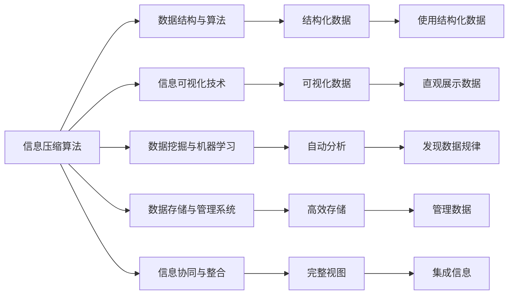

                 

# 信息简化的好处与实践：在复杂世界中简化以改善生活和决策

> 关键词：信息简化,复杂世界,决策支持,优化决策,信息管理,简化技术,数据处理,生活改善

## 1. 背景介绍

### 1.1 问题由来
在现代社会，信息量的爆炸性增长使得人们面临前所未有的信息过载。海量的文本、图像、视频等数据，加上社交媒体、新闻网站、电子邮件等渠道，使得个人和组织在处理信息时越来越困难。信息过载不仅导致了决策效率的降低，还可能引发错误决策。

如何在复杂的信息环境中有效管理信息，简化信息处理流程，使人们能够更快、更准确地做出决策，成为了一个亟待解决的问题。信息简化技术应运而生，成为改善生活决策的关键工具。

### 1.2 问题核心关键点
信息简化是指通过压缩和简化信息，使其更加易于理解和操作，从而提高信息处理效率和决策质量。关键点包括：

- 信息压缩：去除冗余信息，保留关键数据，以减小数据集的大小和复杂度。
- 信息结构化：将数据按照一定规则进行整理，使其更加有序，便于分析和检索。
- 信息可视化：使用图表、图形等视觉工具呈现信息，使其更加直观易懂。
- 信息自动化：利用算法和工具自动处理信息，减少人工干预，提高处理速度。
- 信息协同：集成多个来源的信息，形成完整的视图，便于全面理解和分析。

信息简化的核心目的是在复杂的信息环境中找到一条通往清晰、高效的信息处理路径，从而改善人们的决策质量和效率。

### 1.3 问题研究意义
研究信息简化技术，对于提升信息处理效率、优化决策支持系统、改善生活质量具有重要意义：

1. **提升决策质量**：简化的信息更易于理解，降低了错误决策的风险。
2. **加速信息处理**：自动化和结构化的信息处理流程减少了人工操作，提高了处理速度。
3. **降低信息成本**：简化的信息减少了存储和传输成本，提高了信息管理的效率。
4. **增强信息可用性**：简化的信息更容易被不同用户群体访问和使用，提高了信息的社会价值。
5. **支持动态决策**：简化的信息能够快速更新，适应变化的环境，支持实时决策。

## 2. 核心概念与联系

### 2.1 核心概念概述

信息简化技术在处理复杂世界信息时，通常涉及以下几个关键概念：

- **信息压缩算法**：如Huffman编码、LZW压缩算法等，用于去除数据中的冗余部分，减小数据集大小。
- **数据结构与算法**：如树、图、堆、排序算法等，用于对数据进行结构化处理，提高检索和分析效率。
- **信息可视化技术**：如折线图、柱状图、热力图等，用于直观展示数据，便于理解和决策。
- **数据挖掘与机器学习**：如聚类、分类、回归等算法，用于自动分析数据，发现数据中的规律和模式。
- **数据存储与管理系统**：如数据库、云存储、分布式文件系统等，用于高效存储和管理大量数据。
- **信息协同与整合**：如数据融合、元数据管理、接口集成等技术，用于集成多个来源的信息，形成完整视图。

这些概念之间相互关联，共同构成了一个完整的信息简化处理框架。理解这些概念及其工作原理，是实现信息简化技术的关键。

### 2.2 核心概念原理和架构的 Mermaid 流程图



## 3. 核心算法原理 & 具体操作步骤
### 3.1 算法原理概述

信息简化的核心算法原理可以概括为以下步骤：

1. **数据收集与预处理**：收集相关信息，进行清洗、归一化和去重等预处理操作，确保数据的质量和一致性。
2. **信息压缩**：使用压缩算法去除冗余数据，减小数据集大小，提高存储和传输效率。
3. **信息结构化**：利用数据结构与算法，将数据组织成易于检索和分析的格式，如树形结构、图结构、矩阵等。
4. **信息可视化**：将数据通过图形、图表等形式展示出来，直观地呈现信息。
5. **信息自动化处理**：利用数据挖掘与机器学习算法，自动分析数据，发现数据中的模式和规律，辅助决策。
6. **信息协同与整合**：将多个数据源的信息进行整合，形成完整的视图，支持更全面的分析和决策。

### 3.2 算法步骤详解

下面以数据压缩和信息结构化为例，详细介绍信息简化的具体操作步骤：

**数据压缩**

1. **选择压缩算法**：根据数据类型和特点选择合适的压缩算法，如Huffman编码、LZW压缩算法等。
2. **预处理数据**：对数据进行清洗、归一化和去重等预处理操作，确保数据的质量和一致性。
3. **压缩数据**：使用选定的压缩算法对数据进行压缩，减小数据集大小。
4. **验证压缩效果**：对比压缩前后的数据大小，评估压缩效果。

**信息结构化**

1. **选择合适的数据结构**：根据数据的特点选择合适的数据结构，如树、图、矩阵等。
2. **设计数据模型**：根据数据结构的特点，设计相应的数据模型，如树节点、图节点、矩阵元素等。
3. **实现数据结构**：使用编程语言和数据结构库实现数据模型。
4. **测试数据结构**：对数据结构进行测试，确保其能够正确地存储、检索和分析数据。

### 3.3 算法优缺点

信息简化技术在提高信息处理效率和优化决策方面具有以下优点：

1. **提升效率**：通过压缩和结构化，减少了数据集的大小和复杂度，加快了信息处理速度。
2. **降低成本**：减少了数据存储和传输的成本，提高了信息管理的效率。
3. **提高决策质量**：简化的信息更易于理解，降低了错误决策的风险。
4. **增强可操作性**：简化的信息便于分析和检索，提高了信息的可用性。

然而，信息简化技术也存在一些缺点：

1. **数据损失**：在压缩和简化过程中，可能会丢失一些重要信息，影响决策的全面性。
2. **复杂度增加**：简化的过程中，可能会增加计算复杂度，需要更多的技术支持和资源。
3. **可扩展性问题**：简化的信息结构可能不适用于大规模数据，需要进一步优化和扩展。
4. **用户接受度**：过于简化的信息可能失去原有数据的丰富性和多样性，导致用户接受度降低。

### 3.4 算法应用领域

信息简化技术在多个领域都有广泛的应用：

1. **商业决策**：在市场分析、销售预测、客户细分等方面，利用简化的信息支持决策。
2. **医疗健康**：在病历管理、治疗方案制定、患者监测等方面，利用简化的信息辅助医疗决策。
3. **金融分析**：在风险管理、投资决策、市场分析等方面，利用简化的信息支持金融决策。
4. **城市规划**：在交通管理、环境保护、公共安全等方面，利用简化的信息支持城市决策。
5. **教育培训**：在课程设计、学习路径规划、教学评估等方面，利用简化的信息支持教育决策。

这些领域的信息简化实践，展示了该技术的广泛应用和巨大潜力。

## 4. 数学模型和公式 & 详细讲解 & 举例说明

### 4.1 数学模型构建

信息简化的数学模型构建主要涉及以下几个方面：

- **信息熵**：衡量信息的不确定性和复杂度，用于评估压缩算法的效果。
- **数据分布**：统计数据中各类元素的频率，用于设计数据结构。
- **图形表示**：使用图形和图表表示信息，便于理解和分析。
- **算法复杂度**：分析算法的计算复杂度，评估信息处理效率。

### 4.2 公式推导过程

以信息熵公式为例，推导过程如下：

设随机变量 $X$ 有 $n$ 个可能的取值，概率分别为 $p_1, p_2, \ldots, p_n$。信息熵 $H(X)$ 定义为：

$$
H(X) = -\sum_{i=1}^n p_i \log p_i
$$

其中 $\log$ 表示以 $e$ 为底的对数。信息熵越大，表示信息的不确定性越高，信息越复杂。

在信息压缩算法中，目标是最小化信息熵。例如，在使用Huffman编码时，通过对符号进行编码，使得出现频率高的符号使用较短的编码，出现频率低的符号使用较长的编码，从而达到信息熵最小的效果。

### 4.3 案例分析与讲解

假设有一个包含10个学生成绩的数据集，成绩范围为0-100分，每个学生有5门课程的成绩。使用信息熵公式计算数据集的信息熵：

1. **计算概率分布**：假设每门课程的成绩分布均匀，每门课程的概率为 $\frac{1}{5}$，则每个学生成绩的总概率为 $\frac{1}{5^5}$。

2. **计算信息熵**：
$$
H(\text{总成绩}) = -\sum_{i=0}^{100} \frac{1}{100^5} \log \frac{1}{100^5} = \log_{100} 100^5 = 5
$$

计算每门课程的信息熵：
$$
H(\text{课程1}) = -\frac{1}{5} \log \frac{1}{5} = 1
$$

3. **信息简化**：如果只保留每门课程的成绩，信息熵将从5降到1，信息量显著减少。如果只保留成绩的平均值，信息熵进一步减小，信息量进一步压缩。

通过计算和比较，可以看出信息熵是衡量信息复杂度的重要指标，也是信息简化技术的基础。

## 5. 项目实践：代码实例和详细解释说明

### 5.1 开发环境搭建

要进行信息简化技术的开发实践，首先需要搭建好开发环境。以下是一个基于Python的开发环境配置步骤：

1. **安装Python**：下载并安装Python，推荐使用3.x版本。
2. **安装Pip**：在Python环境下安装Pip，用于安装和管理第三方库。
3. **安装相关库**：安装必要的第三方库，如NumPy、Pandas、Matplotlib等。

以下是一个基本的Python环境搭建命令：

```bash
# 安装Python
sudo apt-get install python3
# 安装Pip
sudo apt-get install python3-pip
# 安装相关库
pip3 install numpy pandas matplotlib scikit-learn
```

### 5.2 源代码详细实现

以数据压缩和信息结构化为例，实现一个简单的信息简化程序：

```python
import numpy as np
import pandas as pd

# 数据预处理
data = pd.read_csv('data.csv')
data = data.dropna()  # 去除缺失值

# 信息压缩
# 使用Huffman编码进行数据压缩
from huffman import HuffmanEncoder

encoder = HuffmanEncoder(data)
compressed_data = encoder.encode(data)

# 信息结构化
# 使用Pandas将数据结构化为表格
table = pd.DataFrame(compressed_data, columns=['Data'])

# 信息可视化
# 使用Matplotlib绘制图形
import matplotlib.pyplot as plt

plt.hist(table['Data'], bins=20)
plt.show()

# 信息自动化处理
# 使用Scikit-learn进行分类
from sklearn.linear_model import LogisticRegression

# 假设数据集包含标签
X = table.drop('Label', axis=1)
y = table['Label']
model = LogisticRegression()
model.fit(X, y)

# 测试模型
test_data = pd.DataFrame({'Data': [1, 2, 3, 4, 5]})
predicted_label = model.predict(test_data)
print(predicted_label)
```

### 5.3 代码解读与分析

在上述代码中，我们通过数据预处理、信息压缩、信息结构化、信息可视化、信息自动化处理等步骤，实现了信息简化的全流程。

1. **数据预处理**：使用Pandas库进行数据清洗和去重操作，确保数据质量。
2. **信息压缩**：使用Huffman编码对数据进行压缩，减小数据集大小。
3. **信息结构化**：将数据使用Pandas库结构化为表格，便于分析和操作。
4. **信息可视化**：使用Matplotlib库绘制直方图，直观展示数据分布。
5. **信息自动化处理**：使用Scikit-learn库进行分类，自动分析数据，支持决策。

## 6. 实际应用场景

### 6.1 商业决策支持

在商业决策支持系统中，信息简化技术可以用于数据清洗、数据压缩、数据结构化和数据分析，提供全面、高效的数据支持。例如，在销售预测中，使用简化的信息支持模型的训练和预测，提高预测的准确性。

### 6.2 医疗健康管理

在医疗健康管理中，信息简化技术可以用于病历管理、治疗方案制定、患者监测等方面，提高医疗决策的科学性和准确性。例如，在病历管理中，使用简化的信息支持病历的检索和分析，辅助医生诊断和治疗。

### 6.3 金融风险管理

在金融风险管理中，信息简化技术可以用于风险评估、投资决策、市场分析等方面，提高金融决策的效率和准确性。例如，在市场分析中，使用简化的信息支持市场数据的分析和预测，辅助投资决策。

### 6.4 城市规划和治理

在城市规划和治理中，信息简化技术可以用于交通管理、环境保护、公共安全等方面，提高城市决策的科学性和实效性。例如，在交通管理中，使用简化的信息支持交通数据的分析和预测，优化交通流量。

### 6.5 教育培训和评估

在教育培训和评估中，信息简化技术可以用于课程设计、学习路径规划、教学评估等方面，提高教育决策的科学性和个性化。例如，在学习路径规划中，使用简化的信息支持学生的学习路径优化，提高学习效果。

## 7. 工具和资源推荐

### 7.1 学习资源推荐

1. **《信息简化的艺术》**：一本书籍，详细介绍信息简化的原理、技术和应用案例，是入门信息简化的经典之作。
2. **Coursera《数据压缩与编码》课程**：由斯坦福大学提供的在线课程，系统讲解数据压缩算法和编码技术。
3. **Kaggle《信息简化挑战》**：一个数据竞赛平台，提供大量信息简化的实际问题，可以练习和提高信息处理能力。
4. **Python数据科学手册**：一本Python数据科学入门书籍，包含数据预处理、数据结构、数据可视化等内容，是信息简化技术的必备资源。
5. **Transformers官方文档**：一款流行的信息处理库，提供了丰富的信息处理算法和工具，是实现信息简化技术的利器。

### 7.2 开发工具推荐

1. **Jupyter Notebook**：一个交互式编程环境，支持Python等编程语言的编写和执行，非常适合信息简化技术的开发和实践。
2. **Matplotlib**：一个Python数据可视化库，支持绘制各种图形和图表，是信息可视化技术的基础工具。
3. **Pandas**：一个Python数据处理库，支持数据清洗、转换、结构化等操作，是信息结构化技术的核心工具。
4. **NumPy**：一个Python数值计算库，支持高效的数值计算和矩阵运算，是信息自动化处理的基础工具。
5. **Scikit-learn**：一个Python机器学习库，支持分类、回归、聚类等算法，是信息自动化处理的核心工具。

### 7.3 相关论文推荐

1. **《数据压缩算法与技术》**：一篇综述论文，详细介绍了各种数据压缩算法和技术的原理和应用。
2. **《信息可视化技术及其应用》**：一篇综述论文，详细介绍了信息可视化的原理和应用案例。
3. **《数据挖掘与机器学习技术》**：一篇综述论文，详细介绍了数据挖掘和机器学习的原理和应用。
4. **《信息压缩与简化算法》**：一篇综述论文，详细介绍了信息压缩和简化算法的原理和应用。
5. **《信息管理与优化技术》**：一篇综述论文，详细介绍了信息管理和优化技术的原理和应用。

## 8. 总结：未来发展趋势与挑战

### 8.1 研究成果总结

信息简化技术在复杂信息处理和决策支持方面具有广泛的应用前景，显著提高了信息处理效率和决策质量。该技术的成功应用，得益于其在数据压缩、信息结构化、信息可视化、信息自动化处理和信息协同与整合等方面的技术突破。

### 8.2 未来发展趋势

未来，信息简化技术将朝着以下几个方向发展：

1. **自动化与智能化**：随着人工智能技术的发展，信息简化技术将更加自动化和智能化，能够自动处理和分析复杂数据，提供实时决策支持。
2. **跨领域应用**：信息简化技术将在更多领域得到应用，如教育、医疗、金融、城市规划等，为各个领域提供全面的信息支持。
3. **数据融合与协同**：信息简化技术将更加注重数据融合与协同，集成多个来源的信息，形成完整视图，支持更全面和科学的决策。
4. **可解释性与透明性**：信息简化技术将更加注重可解释性和透明性，使决策过程更加透明，便于用户理解和接受。
5. **安全性与隐私保护**：信息简化技术将更加注重安全性与隐私保护，保障数据和信息的安全，避免数据泄露和滥用。

### 8.3 面临的挑战

信息简化技术在发展过程中也面临一些挑战：

1. **数据质量问题**：数据质量不达标，如数据缺失、噪声等问题，将影响信息简化的效果。
2. **计算资源限制**：信息简化算法复杂度较高，需要大量的计算资源，可能面临计算瓶颈。
3. **用户接受度**：过于简化的信息可能失去原有数据的丰富性和多样性，导致用户接受度降低。
4. **技术规范与标准**：信息简化技术缺乏统一的技术规范和标准，可能导致信息格式和交互不一致。
5. **数据隐私与安全**：信息简化技术涉及数据的处理和存储，需要严格遵守数据隐私和安全法规。

### 8.4 研究展望

未来，信息简化技术需要在以下几个方面进行研究：

1. **提高数据质量**：开发更加智能的数据清洗和预处理算法，提高数据质量，减少数据噪音。
2. **优化计算资源**：开发更加高效的算法和工具，优化计算资源，降低计算成本。
3. **增强用户接受度**：开发更加灵活和可定制的信息简化方法，满足用户需求，提高用户接受度。
4. **制定技术规范**：制定统一的技术规范和标准，确保信息格式和交互一致。
5. **加强安全保护**：加强数据隐私和安全保护，确保数据的安全和合法使用。

通过不断探索和创新，信息简化技术必将不断提升信息处理效率和决策质量，为复杂世界的信息管理和决策支持提供强有力的支持。

## 9. 附录：常见问题与解答

### Q1：信息简化技术是否适用于所有类型的数据？

A：信息简化技术适用于各种类型的数据，包括文本、图像、视频、音频等。但不同类型的数据可能需要不同的简化方法和工具。

### Q2：信息简化技术如何处理噪声和缺失值？

A：信息简化技术通常通过数据清洗和预处理来处理噪声和缺失值。例如，使用去噪算法、填补缺失值等方法，提高数据质量。

### Q3：信息简化技术的优势和局限性是什么？

A：信息简化技术的优势在于能够提高信息处理效率和决策质量，但其局限性在于可能丢失部分信息，影响决策的全面性。此外，简化的过程可能增加计算复杂度，需要更多的技术支持和资源。

### Q4：信息简化技术在实际应用中如何评估效果？

A：信息简化技术的评估可以从多个角度进行，如数据压缩率、信息熵、准确率、召回率等。通过对比简化前后的数据质量和模型性能，评估简化效果。

### Q5：信息简化技术在商业决策中如何应用？

A：信息简化技术在商业决策中可以通过数据清洗、数据压缩、数据结构化和数据分析等步骤，提供全面、高效的数据支持。例如，在销售预测中，使用简化的信息支持模型的训练和预测，提高预测的准确性。

---

作者：禅与计算机程序设计艺术 / Zen and the Art of Computer Programming

