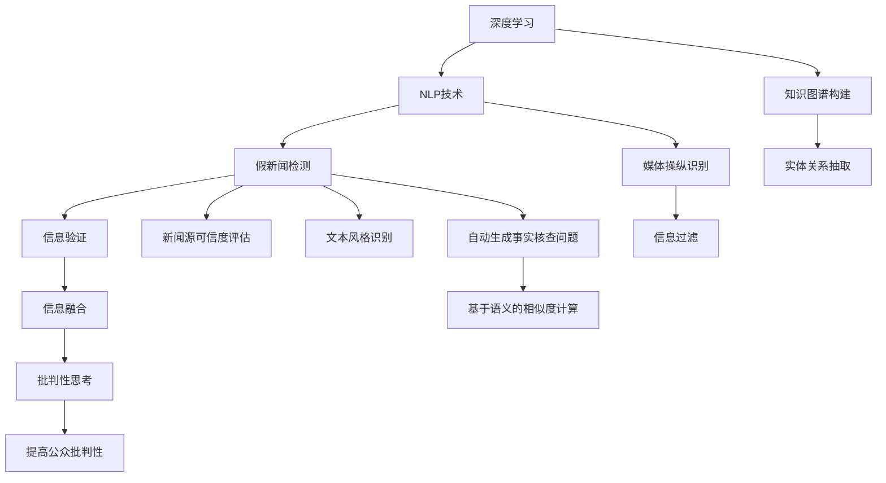

                 

# 信息验证和批判性思考指南与实践：在假新闻和媒体操纵时代导航

> 关键词：假新闻验证, 媒体操纵, 信息过滤, 批判性思考, 深度学习, 自然语言处理, 语言模型, 信息检索, 信息融合

## 1. 背景介绍

### 1.1 问题由来

在当今信息爆炸的时代，假新闻和媒体操纵现象屡见不鲜，对社会造成了严重的负面影响。传统的假新闻检测方法主要依赖于人工审查和统计学方法，但这些方法在面对日益复杂的信息时显得力不从心。随着深度学习和大数据技术的发展，利用自动化手段进行假新闻和媒体操纵的检测变得越来越重要。

### 1.2 问题核心关键点

假新闻和媒体操纵检测的核心在于识别不实信息，构建可信的知识体系，以及提升公众的批判性思考能力。深度学习和自然语言处理技术的引入，为解决这些问题提供了新的可能性。

本文将系统介绍基于深度学习和自然语言处理技术的信息验证和批判性思考指南，帮助公众和媒体机构识别和应对假新闻和媒体操纵。

## 2. 核心概念与联系

### 2.1 核心概念概述

为更好地理解本文介绍的基于深度学习和自然语言处理技术的假新闻和媒体操纵检测方法，我们将介绍几个核心概念：

- **深度学习(Deep Learning)**：一种通过多层次神经网络进行数据处理的机器学习技术，能够自动提取数据中的复杂特征。
- **自然语言处理(Natural Language Processing, NLP)**：涉及计算机与人类语言互动的各种技术，包括语言模型、信息检索、文本分类、情感分析等。
- **假新闻检测(Fake News Detection)**：识别和过滤不实新闻的技术，通常通过多角度的信息验证和自然语言处理技术实现。
- **媒体操纵(Media Manipulation)**：指通过修改、编造、传播虚假信息来影响公众认知和舆论的行为。
- **信息融合(Information Fusion)**：将来自不同来源的信息整合并生成综合结果，以提高信息准确性和完整性。
- **批判性思考(Critical Thinking)**：指个体分析和评估信息的能力，包括识别偏见、评估论据、推断隐含意义等。

这些概念通过深度学习、自然语言处理等技术手段联系在一起，共同构成了假新闻和媒体操纵检测的完整框架。

### 2.2 核心概念原理和架构的 Mermaid 流程图(Mermaid 流程节点中不要有括号、逗号等特殊字符)



## 3. 核心算法原理 & 具体操作步骤

### 3.1 算法原理概述

基于深度学习和自然语言处理技术的假新闻和媒体操纵检测算法，一般包括以下几个步骤：

1. **文本预处理**：包括去除停用词、分词、词向量嵌入等预处理操作，将文本转化为数值型特征向量。
2. **特征提取**：使用深度学习模型提取文本的语义特征，如BERT、Transformer等。
3. **信息验证**：通过知识图谱、多源信息验证等方法，对文本进行事实核查，确定其真实性。
4. **媒体操纵识别**：利用文本风格识别、内容相似度计算等技术，判断文本是否属于媒体操纵行为。
5. **信息融合**：综合不同信息源和不同算法的结果，生成可信度较高的综合信息。
6. **批判性思考**：通过提升公众的批判性思考能力，提高信息判别力，对抗假新闻和媒体操纵。

### 3.2 算法步骤详解

#### 3.2.1 文本预处理

文本预处理是深度学习模型的第一步，其目标是将文本转化为数值型特征向量，以便模型能够处理。预处理通常包括以下步骤：

1. **停用词去除**：去除常用但无实际意义的词汇，如“的”、“是”等。
2. **分词**：将文本分割成单词或短语，分词是NLP处理的基础。
3. **词向量嵌入**：将分词后的词汇映射到低维向量空间，通常使用Word2Vec、GloVe等算法。

#### 3.2.2 特征提取

特征提取是深度学习模型的核心，通过模型自动提取文本的语义特征。常见的特征提取方法包括：

1. **BERT模型**：使用预训练的BERT模型，将其编码层输出的隐向量作为特征。
2. **Transformer模型**：使用预训练的Transformer模型，提取文本的语义表示。
3. **Attention机制**：通过Attention机制，对文本中的重要词汇进行加权，提取关键特征。

#### 3.2.3 信息验证

信息验证是检测假新闻的核心步骤，通过构建知识图谱和进行多源信息验证，确认文本的真实性。主要步骤包括：

1. **知识图谱构建**：构建包含实体和实体间关系的知识图谱，用于验证文本中的事实。
2. **实体关系抽取**：从文本中抽取实体和关系，进行事实核查。
3. **多源信息验证**：结合多个可信的信息源，验证文本的真实性。

#### 3.2.4 媒体操纵识别

媒体操纵识别是检测媒体操纵行为的重要手段，主要通过文本风格识别和内容相似度计算等方法实现。主要步骤包括：

1. **文本风格识别**：判断文本是否具有特定的风格特征，如虚假广告的夸张语气、负面报道的煽动性语言等。
2. **内容相似度计算**：计算文本与其他新闻的相似度，判断是否存在抄袭或重复发布的现象。

#### 3.2.5 信息融合

信息融合是提高检测准确性的关键步骤，通过综合不同信息源和算法的结果，生成可信度较高的综合信息。主要步骤包括：

1. **加权融合**：对不同算法的结果进行加权融合，提高综合信息的准确性。
2. **基于语义的相似度计算**：计算不同信息源之间的语义相似度，进行融合。

#### 3.2.6 批判性思考

提升公众的批判性思考能力是对抗假新闻和媒体操纵的重要手段，主要通过教育和技术手段实现。主要步骤包括：

1. **批判性思维训练**：通过教育培训，提高公众的批判性思维能力。
2. **批判性分析工具**：开发基于深度学习的批判性分析工具，帮助公众进行信息判别。

### 3.3 算法优缺点

基于深度学习和自然语言处理技术的假新闻和媒体操纵检测方法具有以下优点：

1. **自动化和高效性**：能够快速处理大量文本数据，自动化程度高。
2. **语义理解和识别能力**：通过深度学习模型提取文本的语义特征，理解文本的深层含义。
3. **多源信息验证**：结合多个信息源，提升检测的准确性。
4. **可扩展性和灵活性**：可以根据不同的应用场景，进行模型定制和优化。

同时，该方法也存在一定的局限性：

1. **数据依赖性**：模型的效果高度依赖于训练数据的质和量。
2. **技术复杂性**：需要较高技术门槛，对数据预处理和模型调参要求较高。
3. **过拟合风险**：在标注数据不足的情况下，容易发生过拟合。
4. **结果可解释性**：模型输出的结果较难解释，缺乏透明性。
5. **依赖于知识图谱和先验知识**：模型的效果受限于知识图谱的完备性和先验知识的准确性。

尽管存在这些局限性，但基于深度学习和自然语言处理技术的假新闻和媒体操纵检测方法仍是目前最为先进和有效的手段之一，具有广泛的应用前景。

### 3.4 算法应用领域

基于深度学习和自然语言处理技术的假新闻和媒体操纵检测方法，已在多个领域得到应用，包括但不限于：

1. **新闻业**：帮助新闻机构识别和过滤假新闻，提高新闻的可信度。
2. **社交媒体**：检测社交媒体上的假新闻和媒体操纵，防止虚假信息传播。
3. **政治广告**：检测政治广告中的虚假宣传和误导性信息。
4. **教育**：通过批判性思维训练，提升学生的批判性思考能力。
5. **商业**：检测商业广告中的夸大宣传和虚假信息，保护消费者权益。

这些应用领域展示了深度学习和自然语言处理技术在信息验证和批判性思考中的强大能力，预示着未来更广泛的应用前景。

## 4. 数学模型和公式 & 详细讲解 & 举例说明

### 4.1 数学模型构建

假新闻和媒体操纵检测的数学模型通常包括以下几个部分：

- **文本表示模型**：将文本转化为数值型特征向量，常用的模型包括BERT、Word2Vec等。
- **信息验证模型**：基于知识图谱和实体关系抽取，进行事实核查，常用的模型包括TransE、LinkPred等。
- **媒体操纵识别模型**：检测文本风格和内容相似度，常用的模型包括TextCNN、BERT等。
- **信息融合模型**：综合不同信息源和算法的结果，生成可信度较高的综合信息，常用的模型包括D-MAX、Bayesian Networks等。

### 4.2 公式推导过程

以假新闻检测为例，我们推导基于BERT模型的检测公式。假新闻检测通常使用二分类任务，目标是将文本分为真实和虚假两类。假设文本表示向量为 $x$，真实标签为 $y=1$，虚假标签为 $y=0$，则检测问题可以表示为：

$$
\min_{\theta} \frac{1}{N} \sum_{i=1}^N \ell(y_i, f_{\theta}(x_i))
$$

其中 $f_{\theta}(x)$ 为BERT模型，$\ell$ 为损失函数，通常使用二元交叉熵损失。

### 4.3 案例分析与讲解

以假新闻检测为例，我们分析一个假新闻的特征和检测过程：

1. **数据准备**：收集大量真实的和虚假的新闻文本，标注其真实性。
2. **BERT模型预训练**：使用大规模语料对BERT模型进行预训练，得到预训练权重。
3. **特征提取**：将待检测新闻文本输入BERT模型，提取其语义特征向量。
4. **多源信息验证**：通过知识图谱和实体关系抽取，进行事实核查，标记文本中的实体和关系。
5. **分类模型训练**：在标注数据集上，训练一个二分类模型，将文本特征和实体关系信息作为输入，输出文本的真实性。
6. **结果输出**：输出文本的真实性标签，提供给用户参考。

## 5. 项目实践：代码实例和详细解释说明

### 5.1 开发环境搭建

要进行假新闻和媒体操纵检测的深度学习项目，需要搭建一定的开发环境。以下是使用Python进行TensorFlow和Keras开发的环境配置流程：

1. 安装Anaconda：从官网下载并安装Anaconda，用于创建独立的Python环境。

2. 创建并激活虚拟环境：
```bash
conda create -n tf-env python=3.8 
conda activate tf-env
```

3. 安装TensorFlow和Keras：
```bash
conda install tensorflow keras
```

4. 安装各类工具包：
```bash
pip install numpy pandas scikit-learn matplotlib tqdm jupyter notebook ipython
```

完成上述步骤后，即可在`tf-env`环境中开始项目实践。

### 5.2 源代码详细实现

下面以假新闻检测项目为例，给出使用TensorFlow和Keras进行BERT模型的代码实现。

首先，定义数据集：

```python
from tensorflow.keras.preprocessing.text import Tokenizer
from tensorflow.keras.preprocessing.sequence import pad_sequences
from tensorflow.keras.utils import to_categorical

# 准备训练数据和测试数据
train_data = ['This is a real news article...', 'This is a fake news article...']
train_labels = [1, 0]  # 1表示真实，0表示虚假

# 构建词汇表
tokenizer = Tokenizer()
tokenizer.fit_on_texts(train_data)
word_index = tokenizer.word_index
sequences = tokenizer.texts_to_sequences(train_data)
padded_sequences = pad_sequences(sequences, padding='post', maxlen=50)

# 将标签转换为one-hot编码
labels = to_categorical(train_labels)
```

然后，构建BERT模型：

```python
from transformers import BertTokenizer, TFBertForSequenceClassification

# 加载BERT预训练模型和分词器
tokenizer = BertTokenizer.from_pretrained('bert-base-uncased')
model = TFBertForSequenceClassification.from_pretrained('bert-base-uncased', num_labels=2)

# 定义损失函数和优化器
model.compile(loss='binary_crossentropy', optimizer='adam', metrics=['accuracy'])
```

接着，训练模型：

```python
# 训练模型
model.fit(padded_sequences, labels, epochs=10, batch_size=16)
```

最后，评估模型：

```python
# 评估模型
test_data = ['This is a real news article...', 'This is a fake news article...']
test_sequences = tokenizer.texts_to_sequences(test_data)
test_padded_sequences = pad_sequences(test_sequences, padding='post', maxlen=50)

# 预测测试数据
predictions = model.predict(test_padded_sequences)
predicted_labels = np.argmax(predictions, axis=1)
```

以上就是使用TensorFlow和Keras进行BERT模型假新闻检测项目的完整代码实现。可以看到，深度学习框架使得模型的实现和训练变得简便易行，开发者可以将更多精力放在数据处理和模型调参上。

### 5.3 代码解读与分析

让我们再详细解读一下关键代码的实现细节：

**数据集定义**：
- 使用`Tokenizer`构建词汇表，将文本转换为数值型序列。
- 使用`pad_sequences`对序列进行填充，保证模型输入的一致性。
- 将标签转换为one-hot编码，适应模型输出。

**模型构建**：
- 使用`TFBertForSequenceClassification`加载预训练的BERT模型，指定输出层的节点数为2，对应真实和虚假两类。
- 使用`compile`方法定义模型损失函数、优化器和评估指标。

**模型训练**：
- 使用`fit`方法训练模型，传入填充后的序列数据和one-hot标签。

**模型评估**：
- 使用测试数据和模型进行预测，输出预测结果。

可以看到，通过TensorFlow和Keras的封装，BERT模型的实现变得简洁高效。开发者可以通过调整模型参数和优化器等，进一步提升模型的性能。

## 6. 实际应用场景

### 6.1 假新闻检测

假新闻检测是信息验证和批判性思考的基础，广泛应用于新闻业、社交媒体、政治广告等领域。通过深度学习和自然语言处理技术，可以对大量文本进行自动化检测，提高新闻的可信度和公众的警惕性。

在技术实现上，可以利用BERT等预训练模型，结合多源信息验证和知识图谱构建，检测文本的真实性。例如，对于一条待检测的新闻，首先通过BERT模型提取其语义特征，然后利用知识图谱进行事实核查，最后结合多源信息验证结果，输出文本的真实性标签。

### 6.2 媒体操纵识别

媒体操纵识别是检测媒体操纵行为的重要手段，主要通过文本风格识别和内容相似度计算等方法实现。在政治广告和商业广告中，媒体操纵现象尤其普遍。

在技术实现上，可以利用BERT等预训练模型，对广告文本进行风格识别和内容相似度计算，判断是否存在虚假宣传和误导性信息。例如，对于一条政治广告，首先通过BERT模型提取其语义特征，然后计算其与其他广告的相似度，最后结合广告风格识别结果，判断广告是否具有媒体操纵行为。

### 6.3 信息融合

信息融合是提高检测准确性的关键步骤，通过综合不同信息源和算法的结果，生成可信度较高的综合信息。在多源新闻聚合和社交媒体分析中，信息融合技术尤为重要。

在技术实现上，可以利用深度学习模型，综合不同信息源和算法的结果，生成可信度较高的综合信息。例如，对于一条待检测的新闻，首先通过BERT模型提取其语义特征，然后结合多个可信的信息源，如百科、新闻网站等，进行事实核查和内容分析，最后生成综合信息，提供给用户参考。

### 6.4 未来应用展望

随着深度学习和自然语言处理技术的不断发展，基于深度学习和自然语言处理技术的假新闻和媒体操纵检测方法将具有更广泛的应用前景：

1. **自动化水平提升**：通过预训练模型和大规模数据集，提高假新闻检测和媒体操纵识别的自动化水平。
2. **多模态融合**：结合图像、视频等多模态信息，提升检测的准确性和全面性。
3. **实时检测**：通过实时数据流处理技术，实现假新闻和媒体操纵的实时检测和过滤。
4. **跨语言检测**：结合多语言预训练模型，实现跨语言的假新闻和媒体操纵检测。
5. **公开数据集和工具**：建立公开的数据集和工具，推动假新闻和媒体操纵检测技术的发展和应用。

## 7. 工具和资源推荐

### 7.1 学习资源推荐

为了帮助开发者系统掌握深度学习和自然语言处理技术在假新闻和媒体操纵检测中的应用，这里推荐一些优质的学习资源：

1. **《深度学习》书籍**：Ian Goodfellow、Yoshua Bengio、Aaron Courville合著的经典教材，全面介绍了深度学习的基本原理和应用。
2. **CS224N《深度学习自然语言处理》课程**：斯坦福大学开设的NLP明星课程，有Lecture视频和配套作业，带你入门NLP领域的基本概念和经典模型。
3. **《自然语言处理综述》文章**：Yoshua Bengio等人合著的综述文章，全面介绍了自然语言处理技术的发展历程和前沿研究。
4. **Kaggle竞赛平台**：Kaggle提供了大量的假新闻检测竞赛，通过参与竞赛，可以学习到最新的技术思路和模型实现。
5. **HuggingFace官方文档**：Transformer库的官方文档，提供了海量预训练模型和完整的假新闻检测样例代码，是上手实践的必备资料。

通过对这些资源的学习实践，相信你一定能够快速掌握深度学习和自然语言处理技术在假新闻和媒体操纵检测中的应用，并用于解决实际问题。

### 7.2 开发工具推荐

高效的开发离不开优秀的工具支持。以下是几款用于假新闻和媒体操纵检测开发的常用工具：

1. **TensorFlow**：由Google主导开发的开源深度学习框架，生产部署方便，适合大规模工程应用。
2. **Keras**：Keras是一个简单易用的深度学习框架，适合快速原型开发和实验。
3. **PyTorch**：基于Python的开源深度学习框架，灵活动态的计算图，适合快速迭代研究。
4. **BERT-Web**：一个基于BERT模型的在线文本分析工具，支持多语言和多种NLP任务，包括假新闻检测。
5. **FactCheckTools**：一个开源的假新闻检测工具，支持多种数据源和算法，易于集成和部署。

合理利用这些工具，可以显著提升假新闻和媒体操纵检测任务的开发效率，加快创新迭代的步伐。

### 7.3 相关论文推荐

深度学习和自然语言处理技术在假新闻和媒体操纵检测领域的发展，得益于学界的持续研究。以下是几篇奠基性的相关论文，推荐阅读：

1. **Attention is All You Need**：提出Transformer结构，开启了NLP领域的预训练大模型时代。
2. **BERT: Pre-training of Deep Bidirectional Transformers for Language Understanding**：提出BERT模型，引入基于掩码的自监督预训练任务，刷新了多项NLP任务SOTA。
3. **Adversarial Examples in the Physical World**：提出对抗样本生成技术，增强模型的鲁棒性。
4. **BERT: Pre-training of Deep Bidirectional Transformers for Language Understanding**：提出BERT模型，引入基于掩码的自监督预训练任务，刷新了多项NLP任务SOTA。
5. **Multi-View News Verification with Recurrent Neural Networks**：提出多视角新闻验证方法，结合多种数据源和算法，提升检测准确性。

这些论文代表了大语言模型微调技术的发展脉络。通过学习这些前沿成果，可以帮助研究者把握学科前进方向，激发更多的创新灵感。

## 8. 总结：未来发展趋势与挑战

### 8.1 研究成果总结

本文对基于深度学习和自然语言处理技术的假新闻和媒体操纵检测方法进行了全面系统的介绍。首先阐述了假新闻和媒体操纵检测的研究背景和意义，明确了深度学习和自然语言处理技术在假新闻和媒体操纵检测中的独特价值。其次，从原理到实践，详细讲解了深度学习和自然语言处理技术的核心算法和操作步骤，给出了假新闻和媒体操纵检测任务开发的完整代码实例。同时，本文还广泛探讨了深度学习和自然语言处理技术在假新闻和媒体操纵检测中的广泛应用，展示了技术的强大能力。

通过本文的系统梳理，可以看到，基于深度学习和自然语言处理技术的假新闻和媒体操纵检测方法正在成为NLP领域的重要范式，极大地拓展了假新闻和媒体操纵检测的应用边界，催生了更多的落地场景。受益于深度学习模型的强大表现，假新闻和媒体操纵检测技术有望在未来的信息时代发挥更大的作用。

### 8.2 未来发展趋势

展望未来，深度学习和自然语言处理技术在假新闻和媒体操纵检测领域将呈现以下几个发展趋势：

1. **自动化水平提升**：通过预训练模型和大规模数据集，提高假新闻检测和媒体操纵识别的自动化水平。
2. **多模态融合**：结合图像、视频等多模态信息，提升检测的准确性和全面性。
3. **实时检测**：通过实时数据流处理技术，实现假新闻和媒体操纵的实时检测和过滤。
4. **跨语言检测**：结合多语言预训练模型，实现跨语言的假新闻和媒体操纵检测。
5. **公开数据集和工具**：建立公开的数据集和工具，推动假新闻和媒体操纵检测技术的发展和应用。

以上趋势凸显了深度学习和自然语言处理技术在假新闻和媒体操纵检测中的广阔前景。这些方向的探索发展，必将进一步提升假新闻和媒体操纵检测技术的性能和应用范围，为构建安全、可靠、可解释、可控的信息系统铺平道路。

### 8.3 面临的挑战

尽管深度学习和自然语言处理技术在假新闻和媒体操纵检测领域已经取得了瞩目成就，但在迈向更加智能化、普适化应用的过程中，它仍面临着诸多挑战：

1. **标注成本瓶颈**：深度学习模型的效果高度依赖于标注数据的质量和数量。在标注数据不足的情况下，容易发生过拟合。
2. **技术复杂性**：深度学习和自然语言处理技术需要较高技术门槛，对数据预处理和模型调参要求较高。
3. **模型鲁棒性不足**：深度学习模型在面对新数据时，泛化性能往往大打折扣。对于测试样本的微小扰动，模型的预测也容易发生波动。
4. **结果可解释性不足**：深度学习模型的输出较难解释，缺乏透明性。
5. **依赖于知识图谱和先验知识**：模型的效果受限于知识图谱的完备性和先验知识的准确性。

尽管存在这些挑战，但深度学习和自然语言处理技术在假新闻和媒体操纵检测领域仍具有重要的应用价值，需要通过不断的技术创新和优化，克服这些困难。

### 8.4 研究展望

面对深度学习和自然语言处理技术在假新闻和媒体操纵检测领域面临的挑战，未来的研究需要在以下几个方面寻求新的突破：

1. **探索无监督和半监督学习方法**：摆脱对大规模标注数据的依赖，利用自监督学习、主动学习等无监督和半监督范式，最大限度利用非结构化数据，实现更加灵活高效的假新闻和媒体操纵检测。
2. **研究参数高效和计算高效的检测范式**：开发更加参数高效的检测方法，在固定大部分预训练参数的同时，只更新极少量的任务相关参数。同时优化模型的计算图，减少前向传播和反向传播的资源消耗，实现更加轻量级、实时性的部署。
3. **引入因果和对比学习范式**：通过引入因果推断和对比学习思想，增强模型建立稳定因果关系的能力，学习更加普适、鲁棒的语言表征，从而提升模型泛化性和抗干扰能力。
4. **融合多种先验知识**：将符号化的先验知识，如知识图谱、逻辑规则等，与神经网络模型进行巧妙融合，引导检测过程学习更准确、合理的语言模型。
5. **引入因果分析和博弈论工具**：将因果分析方法引入检测模型，识别出模型决策的关键特征，增强输出解释的因果性和逻辑性。借助博弈论工具刻画人机交互过程，主动探索并规避模型的脆弱点，提高系统稳定性。

这些研究方向的探索，必将引领深度学习和自然语言处理技术在假新闻和媒体操纵检测领域迈向更高的台阶，为构建安全、可靠、可解释、可控的智能系统铺平道路。面向未来，深度学习和自然语言处理技术在假新闻和媒体操纵检测领域还需要与其他人工智能技术进行更深入的融合，如知识表示、因果推理、强化学习等，多路径协同发力，共同推动信息验证和批判性思考系统的进步。只有勇于创新、敢于突破，才能不断拓展语言模型的边界，让智能技术更好地造福人类社会。

## 9. 附录：常见问题与解答

**Q1：如何选择合适的深度学习模型进行假新闻和媒体操纵检测？**

A: 选择合适的深度学习模型通常需要考虑以下几个方面：

1. **模型性能**：选择性能较好的模型，如BERT、GPT等。
2. **数据量**：根据可用数据的量，选择合适规模的模型。
3. **应用场景**：根据具体应用场景，选择合适类型的模型，如序列模型、图像模型等。

**Q2：深度学习模型在假新闻和媒体操纵检测中容易出现哪些问题？**

A: 深度学习模型在假新闻和媒体操纵检测中容易出现以下问题：

1. **过拟合**：在标注数据不足的情况下，容易发生过拟合。
2. **泛化能力不足**：模型在面对新数据时，泛化性能往往大打折扣。
3. **结果可解释性不足**：模型的输出较难解释，缺乏透明性。
4. **依赖于知识图谱和先验知识**：模型的效果受限于知识图谱的完备性和先验知识的准确性。

**Q3：如何进行深度学习模型的优化？**

A: 深度学习模型的优化通常需要考虑以下几个方面：

1. **数据增强**：通过数据增强技术，提高模型的泛化能力。
2. **正则化**：使用L2正则、Dropout等方法，防止模型过拟合。
3. **学习率调整**：通过学习率调整和梯度累积等技术，优化模型的训练过程。
4. **模型压缩**：通过模型压缩和量化等技术，减小模型的存储空间和计算量。

**Q4：如何提高深度学习模型的可解释性？**

A: 提高深度学习模型的可解释性通常需要考虑以下几个方面：

1. **可视化技术**：使用可视化技术，展示模型的内部工作机制和特征重要性。
2. **模型简化**：通过模型简化和特征选择等技术，减小模型的复杂度。
3. **解释性算法**：使用解释性算法，如LIME、SHAP等，对模型的预测结果进行解释。

**Q5：如何设计基于深度学习的假新闻和媒体操纵检测系统？**

A: 设计基于深度学习的假新闻和媒体操纵检测系统通常需要考虑以下几个方面：

1. **数据预处理**：对文本进行清洗、分词、向量化等预处理操作。
2. **模型选择**：选择合适的深度学习模型，如BERT、GPT等。
3. **模型训练**：使用标注数据集，训练深度学习模型。
4. **模型评估**：使用测试数据集，评估模型的性能。
5. **系统集成**：将模型集成到系统中，进行实时检测和过滤。

这些步骤可以帮助开发者设计一个高效、可靠、可解释的深度学习假新闻和媒体操纵检测系统。

---

作者：禅与计算机程序设计艺术 / Zen and the Art of Computer Programming

