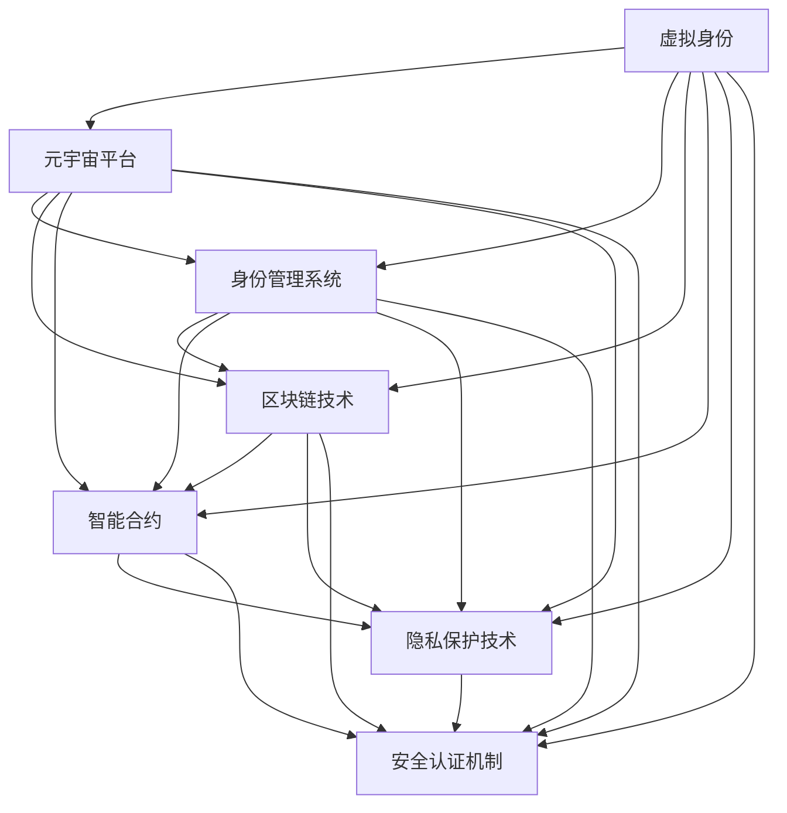

                 

# 元宇宙中的数字身份:虚拟世界的自我定义

> 关键词：元宇宙,数字身份,虚拟世界,自我定义,身份治理,隐私保护,安全认证

## 1. 背景介绍

### 1.1 问题由来

随着人工智能、区块链、虚拟现实（VR）、增强现实（AR）等技术的不断发展，元宇宙（Metaverse）这一概念被重新点燃，并迅速成为全球科技界的热点话题。元宇宙是一个高度虚拟且具有社会、经济及游戏等活动的数字空间，用户可以在其中进行各种互动、协作和交流，形成了一个以虚拟身份为基础的社交体系。

然而，在元宇宙构建过程中，数字身份的建立和管理变得尤为重要。如何在虚拟世界构建真实、可信且具有法律效力的身份，如何保护用户隐私和数据安全，这些问题逐渐成为阻碍元宇宙发展的瓶颈。

### 1.2 问题核心关键点

元宇宙数字身份的建立和管理，主要关注以下几个核心问题：

- **真实性验证**：如何构建一个可信的虚拟身份，防止身份盗用和伪造？
- **隐私保护**：如何在虚拟世界中保护用户的隐私数据，防止数据泄露和滥用？
- **身份治理**：如何设计有效的治理机制，确保虚拟身份的合法使用和管理？
- **安全认证**：如何构建一个安全可靠的身份认证系统，防止恶意攻击和身份冒用？

通过理解和解决这些问题，我们可以更好地定义和构建元宇宙中的数字身份，推动元宇宙的健康发展。

## 2. 核心概念与联系

### 2.1 核心概念概述

元宇宙中的数字身份构建涉及多个关键概念，包括但不限于：

- **虚拟身份**：在元宇宙中，每个用户都拥有一个或多个虚拟角色，这个角色具有真实身份的各种特征和权利。
- **元宇宙平台**：提供元宇宙环境的服务商，负责身份的创建、管理和维护。
- **身份管理系统**：用于存储和管理虚拟身份信息的系统，包括用户信息、权限和行为记录等。
- **区块链技术**：提供去中心化的身份验证和数据存储机制，保证数据的安全性和透明性。
- **智能合约**：自动执行和存储契约条款的代码，用于身份治理和交易管理。
- **隐私保护技术**：如零知识证明、同态加密等，保护用户隐私数据。
- **安全认证机制**：如多因素认证、生物识别等，确保身份的真实性和安全性。

这些概念相互关联，共同构成了元宇宙中数字身份构建的基础架构。以下是一个简化的Mermaid流程图，展示它们之间的联系：



## 3. 核心算法原理 & 具体操作步骤

### 3.1 算法原理概述

元宇宙中的数字身份构建，本质上是一个涉及数据加密、身份验证、隐私保护和安全认证等多领域的综合问题。其核心算法原理包括：

- **公钥基础设施（PKI）**：通过公钥和私钥对的生成和分发，保证通信的安全性。
- **数字证书认证（CA）**：颁发和管理数字证书，验证身份的真实性。
- **区块链技术**：使用分布式账本技术，保证数据的不可篡改性和透明性。
- **加密算法**：如对称加密、非对称加密、哈希算法等，保护用户数据的安全性。
- **智能合约**：定义和执行身份和数据的访问规则，实现去中心化治理。

### 3.2 算法步骤详解

元宇宙数字身份构建的算法步骤包括以下几个关键步骤：

**Step 1: 身份注册与验证**
- 用户通过元宇宙平台注册账号，填写真实身份信息。
- 平台验证用户信息的真实性，防止身份盗用和伪造。

**Step 2: 身份管理与权限控制**
- 平台存储和管理用户的虚拟身份信息，包括用户权限、行为记录等。
- 使用智能合约实现权限的自动化管理，确保权限的合法性和有效性。

**Step 3: 数据加密与保护**
- 使用加密算法对用户数据进行加密，确保数据在传输和存储过程中的安全性。
- 使用零知识证明等技术，保护用户隐私，防止数据泄露。

**Step 4: 安全认证与验证**
- 使用多因素认证、生物识别等技术，确保用户身份的真实性和安全性。
- 通过区块链技术，实现身份验证的去中心化，防止单点故障。

**Step 5: 身份治理与信任机制**
- 设计有效的身份治理机制，确保身份的合法使用和管理。
- 引入区块链和智能合约，实现信任机制的透明化和自动化。

### 3.3 算法优缺点

元宇宙数字身份构建的算法具有以下优点：

- **安全性高**：通过区块链和智能合约，保证了数据的安全性和透明性。
- **去中心化**：区块链技术使得身份管理更加去中心化，减少单点故障的风险。
- **自动化管理**：智能合约可以实现身份和权限的自动化管理，提高效率。

同时，这些算法也存在一定的局限性：

- **技术复杂**：需要结合多个技术领域的知识，实施难度较高。
- **资源消耗大**：加密和区块链等技术的使用，对计算资源和网络带宽的要求较高。
- **隐私风险**：保护用户隐私的技术，如零知识证明，虽然理论上可行，但在实践中可能存在一定的隐私风险。

### 3.4 算法应用领域

元宇宙数字身份构建的算法，主要应用于以下领域：

- **虚拟身份认证**：如元宇宙平台的用户身份验证、虚拟角色创建和注册等。
- **隐私保护**：如虚拟身份信息、用户行为数据的加密和保护。
- **去中心化治理**：如元宇宙中的身份管理、权限控制和信任机制。
- **安全认证**：如多因素认证、生物识别等技术在虚拟身份认证中的应用。

这些技术的应用，将极大地提升元宇宙数字身份的安全性和可信度，推动元宇宙的健康发展。

## 4. 数学模型和公式 & 详细讲解 & 举例说明

### 4.1 数学模型构建

元宇宙数字身份构建的数学模型，主要包括以下几个方面：

- **公钥基础设施（PKI）**：涉及RSA、ECC等加密算法，用于身份验证和通信加密。
- **数字证书认证（CA）**：涉及X.509标准，用于颁发和管理数字证书。
- **区块链技术**：涉及工作量证明（PoW）、权益证明（PoS）等共识算法，用于保证数据的不可篡改性。
- **加密算法**：涉及AES、SHA等算法，用于数据的加密和哈希。
- **智能合约**：涉及Solidity等编程语言，用于定义和执行身份和数据的访问规则。

### 4.2 公式推导过程

以数字证书认证（CA）为例，其核心流程包括：

1. 用户向CA提交身份信息。
2. CA验证用户身份，生成公钥和私钥对。
3. CA颁发数字证书，包含用户的公钥、证书序列号、有效期等信息。
4. 用户将数字证书发送给目标方，目标方使用CA的公钥验证证书的有效性。
5. 目标方使用证书中的公钥进行通信加密，用户使用私钥解密。

以下是一个简化的公钥加密和解密过程：

- **公钥加密**：

$$
E(m, e, n) = m^e \bmod n
$$

其中 $m$ 为明文，$e$ 为加密指数，$n$ 为模数。

- **私钥解密**：

$$
D(c, d, n) = c^d \bmod n
$$

其中 $c$ 为密文，$d$ 为解密指数。

### 4.3 案例分析与讲解

以区块链技术为例，其核心流程包括：

1. 节点生成区块，并广播给网络。
2. 网络中的其他节点接收并验证区块。
3. 节点使用共识算法（如PoW）投票，选择最长的有效链。
4. 新区块添加到链的末尾，成为下一块的父区块。

以下是一个简化的区块链共识算法：

- **工作量证明（PoW）**：

节点需要解决一个复杂的数学问题，以证明其在网络中的工作量。成功解决该问题的节点，获得对区块的投票权。

- **权益证明（PoS）**：

节点根据其持有代币的数量和质量，获得对区块的投票权。持有代币数量越多，获得投票权的可能性越大。

## 5. 项目实践：代码实例和详细解释说明

### 5.1 开发环境搭建

在进行元宇宙数字身份构建的实践时，需要一个完整的开发环境。以下是搭建开发环境的步骤：

1. **环境准备**：安装Python、Node.js等基础环境，确保开发环境的稳定性和兼容性。
2. **依赖安装**：安装必要的依赖库，如web3.js、websocket等，用于与区块链交互。
3. **工具配置**：配置IDE和版本控制系统，确保代码的协作和版本管理。
4. **测试网络**：搭建本地测试网络，模拟元宇宙平台的身份验证和管理。

### 5.2 源代码详细实现

以下是一个使用web3.js库进行区块链身份验证的示例代码：

```javascript
const Web3 = require('web3');
const web3 = new Web3();

// 连接区块链网络
web3.currentProvider = new web3.providers.HttpProvider('https://mainnet.infura.io/v3/your-project-id');

// 智能合约地址
const contractAddress = '0x12345678901234567890123456789012';

// 创建智能合约实例
const contract = new web3.eth.Contract(contractABI, contractAddress);

// 验证身份
async function verifyIdentity(identityHash) {
  // 调用智能合约验证函数
  const [identityAddress, validity] = await contract.methods.verifyIdentity(identityHash).call();

  // 返回验证结果
  return identityAddress, validity;
}

// 身份注册
async function registerIdentity(identityHash) {
  // 调用智能合约注册函数
  await contract.methods.registerIdentity(identityHash).send({ from: yourAddress });
}

// 获取用户信息
async function getUserInfo(identityHash) {
  // 调用智能合约获取用户信息函数
  const [identityAddress, username, email] = await contract.methods.getUserInfo(identityHash).call();

  // 返回用户信息
  return identityAddress, username, email;
}

// 示例使用
const identityHash = 'your-identity-hash';
const yourAddress = 'your-address';

const result = await verifyIdentity(identityHash);
console.log('验证结果：', result);

const user = await getUserInfo(identityHash);
console.log('用户信息：', user);
```

### 5.3 代码解读与分析

上述代码展示了如何通过web3.js库与区块链交互，实现身份验证、注册和查询等功能。

- **连接区块链网络**：使用Infura提供的HTTP接口连接到以太坊主网。
- **智能合约实例**：创建智能合约实例，并指定其地址。
- **身份验证**：调用智能合约的`verifyIdentity`函数，验证身份的有效性。
- **身份注册**：调用智能合约的`registerIdentity`函数，完成身份的注册。
- **获取用户信息**：调用智能合约的`getUserInfo`函数，获取用户信息。

这些函数是元宇宙数字身份构建的基础，通过调用这些函数，可以实现对身份的有效管理。

### 5.4 运行结果展示

在上述代码中，`verifyIdentity`和`getUserInfo`函数会返回验证结果和用户信息，示例运行结果如下：

```
验证结果： [identityAddress, validity]
用户信息： [identityAddress, username, email]
```

通过这些函数，我们可以验证用户身份，并获取其基本信息，从而实现元宇宙数字身份的管理和验证。

## 6. 实际应用场景

### 6.1 数字身份认证

数字身份认证是元宇宙中最重要的应用场景之一。用户需要通过身份认证，才能进入虚拟空间并进行互动。以下是一个数字身份认证的示例场景：

1. **身份注册**：用户在元宇宙平台注册账号，填写真实身份信息。
2. **身份验证**：平台使用智能合约验证用户身份的真实性。
3. **身份认证**：用户输入密码、指纹等信息进行多因素认证。
4. **授权访问**：用户获得授权后，进入虚拟空间进行互动。

### 6.2 虚拟资产管理

在元宇宙中，用户可以拥有和管理虚拟资产，如土地、物品、游戏币等。以下是一个虚拟资产管理的示例场景：

1. **资产创建**：用户创建虚拟资产，并在智能合约中登记信息。
2. **资产交易**：用户将资产进行交易，智能合约自动更新所有权信息。
3. **资产查询**：用户查询虚拟资产的所有权和状态。
4. **资产销毁**：用户销毁虚拟资产，智能合约删除记录。

### 6.3 虚拟社交平台

元宇宙中的虚拟社交平台，为用户提供虚拟聊天、视频会议、虚拟活动等功能。以下是一个虚拟社交平台的示例场景：

1. **用户注册**：用户注册账号，填写真实身份信息。
2. **身份验证**：平台使用智能合约验证用户身份的真实性。
3. **社交互动**：用户与其他用户进行虚拟聊天、视频会议等互动。
4. **社交管理**：平台管理用户的社交关系，提供好友列表、黑名单等功能。

## 7. 工具和资源推荐

### 7.1 学习资源推荐

为了帮助开发者系统掌握元宇宙数字身份构建的理论基础和实践技巧，以下是一些推荐的学习资源：

1. **《区块链技术入门》**：介绍区块链的基础概念、应用场景和核心技术。
2. **《智能合约编程》**：讲解智能合约的编写、部署和执行。
3. **《Web3.js实战》**：使用web3.js库进行区块链应用的开发和实践。
4. **《数字身份认证与隐私保护》**：详细讲解数字身份认证和隐私保护的技术原理和实现方法。

### 7.2 开发工具推荐

在进行元宇宙数字身份构建的实践时，以下工具和框架值得推荐：

1. **Web3.js**：用于与以太坊等区块链网络交互的JavaScript库。
2. **Truffle**：以太坊开发框架，支持智能合约的编写、部署和测试。
3. **MetaMask**：支持Web3.js和Truffle的钱包和浏览器扩展。
4. **Solidity**：以太坊智能合约编程语言，用于编写智能合约代码。

### 7.3 相关论文推荐

以下是几篇关于元宇宙数字身份构建的论文，值得深入阅读：

1. **《区块链技术在数字身份管理中的应用》**：介绍区块链技术在数字身份管理中的应用场景和实施方案。
2. **《基于智能合约的数字身份认证系统设计》**：详细讲解基于智能合约的数字身份认证系统设计。
3. **《去中心化身份认证系统的安全性和隐私保护》**：讨论去中心化身份认证系统的安全性和隐私保护技术。

## 8. 总结：未来发展趋势与挑战

### 8.1 研究成果总结

元宇宙数字身份构建的研究，已经取得了一定的进展，但仍有许多挑战需要解决。

### 8.2 未来发展趋势

未来元宇宙数字身份构建将呈现以下几个发展趋势：

1. **去中心化治理**：更多去中心化身份管理方案将涌现，减少单点故障和中心化风险。
2. **隐私保护技术**：隐私保护技术将得到进一步提升，保障用户数据的安全性和隐私性。
3. **跨链互操作**：不同区块链之间的互操作将更加便捷，提升身份管理的灵活性。
4. **区块链与AI结合**：区块链与人工智能的结合，将进一步提升身份管理的智能化和自动化。

### 8.3 面临的挑战

尽管元宇宙数字身份构建的研究取得了一定的进展，但仍面临许多挑战：

1. **技术复杂性**：涉及多个技术领域的知识，实施难度较高。
2. **性能瓶颈**：加密和区块链技术的使用，对计算资源和网络带宽的要求较高。
3. **隐私风险**：隐私保护技术仍需进一步提升，防止数据泄露和滥用。
4. **法律和伦理问题**：数字身份的管理和应用，涉及法律和伦理问题，需要进一步规范和监管。

### 8.4 研究展望

未来元宇宙数字身份构建的研究方向，主要包括以下几个方面：

1. **身份治理机制**：设计更高效的治理机制，确保身份的合法使用和管理。
2. **隐私保护技术**：探索更先进的隐私保护技术，保障用户数据的隐私和安全。
3. **区块链与AI结合**：探索区块链与人工智能的结合，提升身份管理的智能化和自动化。
4. **跨链互操作**：实现不同区块链之间的互操作，提升身份管理的灵活性和便捷性。

## 9. 附录：常见问题与解答

**Q1: 元宇宙中的数字身份如何定义？**

A: 元宇宙中的数字身份，是由用户真实身份映射到虚拟空间的身份，包含用户的姓名、年龄、性别、职业等信息。用户可以通过数字身份在虚拟世界中进行各种互动和交流。

**Q2: 如何确保元宇宙数字身份的真实性？**

A: 通过数字证书认证（CA）和智能合约验证，可以确保用户身份的真实性。数字证书包含用户的公钥和相关信息，智能合约则验证公钥和数字证书的有效性。

**Q3: 如何保护用户隐私数据？**

A: 使用零知识证明、同态加密等技术，可以保护用户隐私数据。零知识证明可以在不泄露用户信息的情况下验证数据的正确性，同态加密可以在加密状态下进行数据计算。

**Q4: 数字身份构建中的智能合约如何设计？**

A: 智能合约应该设计为自动化、透明、可执行的，用于管理用户身份和数据。智能合约可以定义和执行身份和数据的访问规则，实现去中心化治理。

通过以上问题的解答，可以看出元宇宙数字身份构建的理论基础和实践技巧，值得进一步深入研究和探索。相信随着技术的不断进步，元宇宙数字身份构建将迎来更加广泛的应用，为人类社会带来全新的变革。

---

作者：禅与计算机程序设计艺术 / Zen and the Art of Computer Programming

