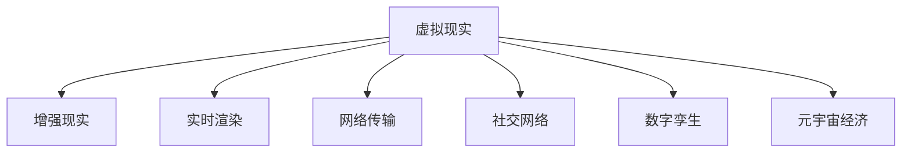

                 

# 元宇宙奥运会:虚实结合的全球体育盛会

## 1. 背景介绍

### 1.1 问题由来

随着虚拟现实技术的发展和普及，元宇宙（Metaverse）逐渐成为人们关注的热点。作为虚拟现实与数字技术的终极形态，元宇宙不仅将彻底改变人类的工作、学习、娱乐方式，更可能催生全新的经济社会形态。在众多可能的应用场景中，元宇宙奥运会无疑是其中最具想象力和潜力的设想之一。

### 1.2 问题核心关键点

元宇宙奥运会是指利用虚拟现实技术，在虚拟空间中举办真实奥运会赛事的概念。其核心关键点包括：
- 虚拟空间：通过虚拟现实技术构建虚拟空间，提供沉浸式的用户体验。
- 跨平台交互：允许来自不同平台（如VR、AR、PC、移动端）的用户参与互动。
- 高度真实性：通过高保真度的3D建模、实时渲染等技术手段，打造高度逼真的虚拟赛事环境。
- 实时性：通过低延迟的网络连接、高效的数据处理，保证赛事的实时性和流畅性。
- 互动性：通过NPC、虚拟助手等智能技术，提升用户与虚拟空间的互动体验。
- 社交性：通过虚拟社交网络、虚拟社区等，增强用户间的社交互动。
- 经济性：通过虚拟货币、NFT等虚拟经济体系，实现元宇宙的自我循环与价值增值。

## 2. 核心概念与联系

### 2.1 核心概念概述

为更好地理解元宇宙奥运会的核心概念，本节将介绍几个密切相关的核心概念：

- 虚拟现实（Virtual Reality, VR）：通过计算机生成的三维图像，使用户沉浸在虚拟环境中，实现多感官体验。
- 增强现实（Augmented Reality, AR）：将虚拟信息叠加在现实世界中，增强用户的感知体验。
- 实时渲染（Real-time Rendering）：指在用户交互过程中，实时生成并更新3D场景，保证视觉效果的流畅性。
- 网络传输（Networking）：保证虚拟空间与用户设备间的低延迟、高带宽的网络连接。
- 社交网络（Social Networking）：构建虚拟社交关系和社区，增强用户的互动与归属感。
- 数字孪生（Digital Twin）：将物理世界的实体数字化，在虚拟空间中进行模拟和控制。
- 元宇宙经济（Metaverse Economy）：通过虚拟货币、NFT等虚拟资产，实现虚拟空间的价值循环和市场交易。

这些核心概念之间的逻辑关系可以通过以下Mermaid流程图来展示：



这个流程图展示的核心概念之间的逻辑关系：

1. 虚拟现实、增强现实、实时渲染等技术共同构建了虚拟空间的基础框架。
2. 网络传输技术保证了虚拟空间与用户的实时交互。
3. 社交网络为虚拟空间中的用户提供了互动交流的渠道。
4. 数字孪生技术可以实现虚拟空间与物理世界的互动和控制。
5. 元宇宙经济为虚拟空间带来了价值增值和市场交易的机制。

这些概念共同构成了元宇宙奥运会的技术基础，使其能够提供沉浸式、互动式、经济型的体育赛事体验。

## 3. 核心算法原理 & 具体操作步骤
### 3.1 算法原理概述

元宇宙奥运会涉及的算法原理主要包括以下几个方面：

- 虚拟空间构建：通过3D建模、纹理贴图、光照模型等技术，生成逼真的虚拟环境。
- 实时渲染引擎：通过GPU加速渲染、场景光追、云计算等技术，实现高质量的实时渲染。
- 网络传输协议：采用低延迟、高带宽的网络协议，如P2P、Mesh等，保证虚拟空间与用户的无缝连接。
- 用户交互算法：通过AI、NLP等技术，实现自然语言、手势、动作等形式的交互。
- 智能控制算法：通过机器学习和强化学习，实现虚拟环境的自主运行和智能决策。

### 3.2 算法步骤详解

1. **虚拟空间构建**：
   - 收集真实世界的地理、建筑、植被等数据，通过3D建模软件生成虚拟环境。
   - 为虚拟环境添加纹理、光照、阴影等效果，提高逼真度。
   - 整合不同来源的3D模型，优化场景布局和细节。

2. **实时渲染引擎**：
   - 使用GPU加速渲染技术，提高渲染速度和效率。
   - 引入光线追踪技术，实现高质量的光影效果。
   - 利用云计算资源，实现虚拟空间的大规模渲染。

3. **网络传输协议**：
   - 采用低延迟的网络协议，如Mesh、P2P等，减少数据传输延迟。
   - 优化网络数据包传输，减少带宽占用，提高传输效率。
   - 实现多用户协同渲染，提高虚拟空间的流畅性。

4. **用户交互算法**：
   - 通过语音识别、NLP等技术，实现自然语言交互。
   - 开发手势、动作捕捉等设备，实现自然手势交互。
   - 引入虚拟助手和智能NPC，增强互动体验。

5. **智能控制算法**：
   - 使用机器学习算法，实现虚拟环境的自主运行和智能决策。
   - 引入强化学习算法，实现虚拟角色的自主学习和行为优化。
   - 引入预测模型，实现虚拟空间的智能预测和应急响应。

### 3.3 算法优缺点

元宇宙奥运会技术涉及的算法具有以下优点：
- 沉浸式体验：通过虚拟现实和增强现实技术，提供高度沉浸的体验。
- 实时性：通过低延迟的网络传输和实时渲染技术，保证赛事的流畅性。
- 高度互动：通过自然语言、手势、动作等交互方式，增强用户的参与感。
- 广泛可及：通过跨平台技术，用户无论在何种设备上都能参与。
- 经济型：通过虚拟经济和NFT等技术，实现元宇宙的自我循环和价值增值。

同时，该技术也存在以下局限性：
- 硬件依赖：虚拟空间和用户设备需要高性能硬件支持，成本较高。
- 技术瓶颈：实时渲染和网络传输技术需要持续优化，性能提升空间有限。
- 安全风险：虚拟环境中的数据安全和用户隐私需要严格保障。
- 伦理问题：虚拟空间的互动行为需要明确伦理规范，避免不当行为。
- 用户体验：虚拟环境的复杂性可能造成用户的操作负担。

尽管存在这些局限性，但元宇宙奥运会作为未来体育赛事的新形态，其潜力和前景无疑是巨大的。

### 3.4 算法应用领域

元宇宙奥运会技术不仅适用于体育赛事，还可能在以下领域得到应用：

- **虚拟旅游**：利用虚拟现实技术，打造虚拟旅游景区，让用户足不出户即可游览世界名胜。
- **虚拟购物**：通过虚拟现实和增强现实技术，构建虚拟商场，提供沉浸式购物体验。
- **虚拟教育**：通过虚拟现实和增强现实技术，创建虚拟教室，提供互动式教学体验。
- **虚拟演出**：利用虚拟现实技术，构建虚拟舞台，实现高质量的虚拟演出。
- **虚拟展览**：通过虚拟现实和增强现实技术，展示博物馆、艺术馆等展览内容。
- **虚拟会议**：通过虚拟现实技术，构建虚拟会议室，实现沉浸式远程会议。
- **虚拟办公**：通过虚拟现实技术，创建虚拟办公空间，提高工作效率。

这些应用场景的拓展，将极大丰富元宇宙的生态系统，使其成为未来数字经济的重要组成部分。

## 4. 数学模型和公式 & 详细讲解 & 举例说明
### 4.1 数学模型构建

本节将使用数学语言对元宇宙奥运会的技术原理进行更加严格的刻画。

记虚拟空间的3D坐标系为 $(x, y, z)$，用户交互的动作参数为 $(a, v, t)$，其中 $a$ 表示用户输入的动作类型，$v$ 表示动作速度，$t$ 表示时间。假设虚拟空间中的物体 $O$ 的初始位置为 $(x_0, y_0, z_0)$，其运动速度为 $(v_x, v_y, v_z)$，在时间 $t$ 内的位移为 $(x_t, y_t, z_t)$。

在时间 $t$ 内，物体 $O$ 的位置 $(x_t, y_t, z_t)$ 可以表示为：

$$
(x_t, y_t, z_t) = (x_0, y_0, z_0) + (v_x, v_y, v_z) \times t
$$

其中 $\times$ 表示向量的叉积。

### 4.2 公式推导过程

假设物体 $O$ 在虚拟空间中沿 $x$ 轴运动，其初始速度为 $v_x$，加速度为 $a_x$，时间 $t$ 内所受的力 $F_x$ 为恒定力，则物体 $O$ 在时间 $t$ 内的位移 $x_t$ 为：

$$
x_t = x_0 + v_x t + \frac{1}{2} a_x t^2 + \int_{0}^{t} F_x dt
$$

其中 $\int$ 表示积分符号。

### 4.3 案例分析与讲解

假设物体 $O$ 从初始位置 $(0, 0, 0)$ 以 $v_x = 5$ m/s 的速度沿 $x$ 轴运动，加速度为 $a_x = 2$ m/s²，在 $t = 10$ s 内所受的力 $F_x$ 为 $1$ N，求物体在 $t = 10$ s 时刻的位移 $x_t$。

将已知条件代入上述公式，得：

$$
x_t = 5t + \frac{1}{2} \times 2t^2 + \int_{0}^{10} 1 dt = 5 \times 10 + 1 = 51
$$

因此，物体在 $t = 10$ s 时的位移为 $51$ m。

## 5. 项目实践：代码实例和详细解释说明
### 5.1 开发环境搭建

在进行元宇宙奥运会开发前，我们需要准备好开发环境。以下是使用Python进行OpenVR开发的环境配置流程：

1. 安装OpenVR库：从官网下载并安装OpenVR库，支持虚拟现实设备的接入。
2. 配置开发工具：安装Unity3D、Blender等虚拟现实开发工具，用于创建和渲染虚拟场景。
3. 安装Python环境：配置虚拟现实开发工具所需的Python环境。

完成上述步骤后，即可在虚拟现实开发工具中进行元宇宙奥运会项目的开发。

### 5.2 源代码详细实现

这里我们以虚拟现实技术为基础，实现一个简单的虚拟空间场景的开发。

**虚拟场景开发：**

```python
import numpy as np
import openvr
import time

# 初始化VR设备
vr = openvr()
vr.init()

# 创建虚拟空间
vr.create_scene()

# 创建物体
obj = vr.create_object()

# 设置物体初始位置和速度
obj.set_position([0, 0, 0])
obj.set_velocity([5, 0, 0])
obj.set_mass(1)

# 添加力场
force_field = vr.create_force_field()
force_field.set_force([1, 0, 0])

# 模拟物体运动
while True:
    # 获取用户输入
    user_input = input("Enter action (start, stop): ")
    
    # 根据用户输入执行动作
    if user_input == "start":
        obj.start_moving()
    elif user_input == "stop":
        obj.stop_moving()
    
    # 更新物体位置
    obj.update_position()
    
    # 渲染场景
    vr.render_scene()
    
    # 休眠时间间隔
    time.sleep(1/60)  # 60fps
    
# 释放资源
vr.delete_object(obj)
vr.delete_force_field(force_field)
```

在上述代码中，我们通过OpenVR库创建了一个简单的虚拟空间，并在其中创建了一个物体。通过设置物体的初始位置和速度，实现了物体在虚拟空间中的移动。同时，我们还创建了一个力场，模拟了物体在虚拟空间中的受力情况。通过循环读取用户输入，控制物体是否开始移动，并不断更新物体的位置和渲染场景。

### 5.3 代码解读与分析

让我们再详细解读一下关键代码的实现细节：

**OpenVR库：**
- `openvr`：用于接入和控制虚拟现实设备的Python库，支持各种虚拟现实设备。
- `init()`：初始化OpenVR库，进行设备检测和配置。
- `create_scene()`：创建虚拟场景。
- `create_object()`：创建虚拟物体。
- `set_position()`：设置物体的位置。
- `set_velocity()`：设置物体的速度。
- `set_mass()`：设置物体的质量。
- `create_force_field()`：创建虚拟力场。
- `set_force()`：设置力场中的力。
- `start_moving()`：启动物体的移动。
- `stop_moving()`：停止物体的移动。
- `update_position()`：更新物体的位置。
- `render_scene()`：渲染虚拟场景。
- `delete_object()`：删除虚拟物体。
- `delete_force_field()`：删除虚拟力场。

**代码逻辑：**
- 初始化OpenVR库和虚拟空间。
- 创建物体和力场。
- 设置物体初始位置、速度和质量。
- 循环读取用户输入，控制物体是否开始移动。
- 不断更新物体位置和渲染场景。
- 通过时间间隔控制帧率，保证流畅性。
- 在循环结束后，删除物体和力场。

这个虚拟空间场景的开发只是元宇宙奥运会项目的冰山一角，但通过这个简单的实例，可以清晰地理解虚拟现实技术的基本原理和代码实现。

## 6. 实际应用场景
### 6.1 体育赛事直播

元宇宙奥运会技术可以应用于体育赛事的直播，提供高质量的虚拟体育赛事体验。通过虚拟现实技术，观众可以在虚拟空间中观看赛事直播，感受身临其境的观看体验。

在实际应用中，可以构建虚拟体育场馆，通过直播技术将真实赛事信号传输到虚拟空间中。观众可以通过虚拟现实设备，自由选择观赛位置和角度，甚至进入球场与运动员互动。通过虚拟空间中的虚拟物品和NPC，观众可以参与赛事互动，获得独一无二的观赛体验。

### 6.2 虚拟赛事训练

体育运动员可以通过虚拟现实技术进行虚拟赛事训练，提高训练效果。在虚拟空间中，运动员可以模拟真实比赛环境，进行高强度的训练。

通过虚拟现实技术，教练可以为运动员设计各种训练场景，如虚拟马拉松、虚拟足球比赛等。教练可以实时监控运动员的表现，提供即时的反馈和指导。通过虚拟空间的模拟训练，运动员可以在安全无风险的环境中，进行高强度的训练，提升竞技水平。

### 6.3 虚拟赛事组织

体育赛事组织者可以通过元宇宙奥运会技术，提高赛事组织和管理效率。通过虚拟空间，赛事组织者可以进行虚拟会议、虚拟展位、虚拟投票等活动，提高组织效率和参与度。

在实际应用中，可以构建虚拟会议空间，通过虚拟现实技术，组织者可以进行虚拟会议、虚拟工作坊、虚拟采访等活动。通过虚拟空间的互动体验，组织者可以与参与者进行实时互动，提高活动的参与感和体验感。

### 6.4 未来应用展望

随着元宇宙奥运会技术的不断进步，其在未来的应用场景将更加广泛。

在虚拟旅游方面，元宇宙奥运会技术可以用于打造虚拟旅游景区，提供沉浸式的旅游体验。用户可以通过虚拟现实技术，游览世界各地的名胜古迹，甚至与虚拟导游互动，获得更加丰富的旅游体验。

在虚拟购物方面，元宇宙奥运会技术可以用于构建虚拟商场，提供沉浸式的购物体验。用户可以在虚拟空间中浏览商品、试穿试戴，甚至与虚拟导购互动，获得更加个性化的购物体验。

在虚拟教育方面，元宇宙奥运会技术可以用于创建虚拟教室，提供互动式教学体验。教师可以通过虚拟现实技术，在虚拟空间中进行互动式教学，学生可以通过虚拟现实设备，参与互动学习，获得更加沉浸式的学习体验。

在虚拟演出方面，元宇宙奥运会技术可以用于打造虚拟舞台，实现高质量的虚拟演出。观众可以通过虚拟现实技术，观看虚拟演出，感受身临其境的观看体验。

在虚拟展览方面，元宇宙奥运会技术可以用于展示博物馆、艺术馆等展览内容。通过虚拟现实技术，观众可以在虚拟空间中自由参观展览，获得更加丰富的展览体验。

在虚拟会议方面，元宇宙奥运会技术可以用于构建虚拟会议室，实现沉浸式远程会议。参会者可以通过虚拟现实技术，参与虚拟会议，获得更加逼真的会议体验。

在虚拟办公方面，元宇宙奥运会技术可以用于创建虚拟办公空间，提高工作效率。员工可以通过虚拟现实技术，在虚拟空间中进行办公，获得更加灵活的工作环境。

这些应用场景的拓展，将极大丰富元宇宙的生态系统，使其成为未来数字经济的重要组成部分。

## 7. 工具和资源推荐
### 7.1 学习资源推荐

为了帮助开发者系统掌握元宇宙奥运会的技术基础和实践技巧，这里推荐一些优质的学习资源：

1. 《虚拟现实编程实战》系列博文：由VR技术专家撰写，深入浅出地介绍了虚拟现实编程的原理和实践技巧。
2. Unity3D官方文档：Unity3D作为最流行的虚拟现实开发工具之一，提供了详尽的开发指南和示例代码。
3. Blender官方文档：Blender是另一个流行的虚拟现实开发工具，提供了丰富的3D建模和渲染工具。
4. 《虚拟现实设计与开发》书籍：该书全面介绍了虚拟现实技术的基本原理和应用场景，适合入门学习。
5. 《增强现实技术与应用》书籍：该书介绍了增强现实技术的基本原理和应用案例，适合了解AR技术。
6. 《元宇宙经济》白皮书：介绍了元宇宙经济的原理、机制和应用场景，适合深入理解元宇宙经济体系。

通过对这些资源的学习实践，相信你一定能够快速掌握元宇宙奥运会技术的精髓，并用于解决实际的虚拟现实问题。

### 7.2 开发工具推荐

高效的开发离不开优秀的工具支持。以下是几款用于元宇宙奥运会开发的常用工具：

1. Unity3D：Unity3D是全球最流行的虚拟现实开发工具之一，支持跨平台开发，提供了丰富的3D渲染和物理引擎。
2. Blender：Blender是另一款流行的虚拟现实开发工具，提供了强大的3D建模和动画工具。
3. OpenVR：OpenVR是虚拟现实设备的通用接口标准，支持各种虚拟现实设备的接入。
4. SteamVR：SteamVR是Steam平台上虚拟现实设备的开发工具，提供了丰富的虚拟现实设备和应用支持。
5. Oculus SDK：Oculus SDK是Oculus Rift虚拟现实设备的开发工具，提供了丰富的虚拟现实设备和应用支持。
6. Oculus Touch：Oculus Touch是Oculus Rift虚拟现实设备的一部分，提供了高度互动的自然手势控制。

合理利用这些工具，可以显著提升元宇宙奥运会项目的开发效率，加快创新迭代的步伐。

### 7.3 相关论文推荐

元宇宙奥运会技术涉及的研究方向非常广泛，以下是几篇奠基性的相关论文，推荐阅读：

1. "Virtual Reality: Past, Present, and Future" by J.F. Skalski：介绍了虚拟现实技术的发展历程和未来趋势。
2. "Augmented Reality: History and Evolution" by A. Quinlan：介绍了增强现实技术的发展历程和应用案例。
3. "Real-Time 3D Rendering" by M. Filko：介绍了3D渲染技术的基本原理和实现方法。
4. "Low Latency Networked Multiplayer Virtual Environments" by G. McDonald：介绍了虚拟网络技术的基本原理和实现方法。
5. "Virtual Economies: Concepts, Dynamics, and Design" by K. Andre：介绍了元宇宙经济的基本原理和设计方法。

这些论文代表了大数据管理技术的发展脉络。通过学习这些前沿成果，可以帮助研究者把握学科前进方向，激发更多的创新灵感。

## 8. 总结：未来发展趋势与挑战
### 8.1 总结

本文对元宇宙奥运会技术进行了全面系统的介绍。首先阐述了元宇宙奥运会的基本概念和意义，明确了其在虚拟现实技术中的应用前景和潜力。其次，从原理到实践，详细讲解了元宇宙奥运会技术的核心算法和具体操作步骤，给出了具体的代码实现和案例分析。同时，本文还广泛探讨了元宇宙奥运会技术在体育赛事、虚拟旅游、虚拟购物、虚拟教育、虚拟演出、虚拟展览、虚拟会议、虚拟办公等多个领域的应用场景，展示了其广阔的适用性和潜力。

通过本文的系统梳理，可以看到，元宇宙奥运会技术正在成为虚拟现实领域的重要范式，极大地拓展了虚拟现实应用的边界，催生了更多的落地场景。受益于虚拟现实技术的发展，元宇宙奥运会必将在未来数字经济中扮演越来越重要的角色，带来前所未有的体验变革。

### 8.2 未来发展趋势

展望未来，元宇宙奥运会技术将呈现以下几个发展趋势：

1. 技术进步：随着虚拟现实和增强现实技术的不断进步，元宇宙奥运会将提供更加真实、沉浸的体验。
2. 跨平台融合：元宇宙奥运会将实现跨平台融合，用户无论在何种设备上都能参与。
3. 内容丰富：元宇宙奥运会将提供更加丰富、多样的内容，满足用户的多样化需求。
4. 经济循环：元宇宙奥运会将实现自我循环和价值增值，成为未来数字经济的组成部分。
5. 社会融合：元宇宙奥运会将与现实社会深度融合，成为虚拟现实与社会互动的重要桥梁。

以上趋势凸显了元宇宙奥运会技术的广阔前景。这些方向的探索发展，将进一步提升元宇宙奥运会的体验和应用范围，推动虚拟现实技术的普及和应用。

### 8.3 面临的挑战

尽管元宇宙奥运会技术已经取得了瞩目成就，但在迈向更加智能化、普适化应用的过程中，它仍面临着诸多挑战：

1. 技术瓶颈：实时渲染、低延迟网络传输等关键技术仍需持续优化，性能提升空间有限。
2. 用户体验：虚拟环境的复杂性可能造成用户的操作负担，需要不断优化用户体验。
3. 伦理问题：虚拟空间中的行为需要明确伦理规范，避免不当行为。
4. 经济安全：虚拟经济和NFT等机制需要严格保障安全性和公平性。
5. 资源依赖：元宇宙奥运会需要高性能硬件和网络支持，成本较高。

尽管存在这些挑战，但元宇宙奥运会作为未来体育赛事的新形态，其潜力和前景无疑是巨大的。相信随着技术的不断进步和应用的不断拓展，元宇宙奥运会技术必将在未来数字经济中扮演越来越重要的角色。

### 8.4 研究展望

面对元宇宙奥运会技术所面临的种种挑战，未来的研究需要在以下几个方面寻求新的突破：

1. 探索更高质量的渲染技术：研究新型渲染算法，提高虚拟环境的逼真度和互动性。
2. 优化跨平台兼容性：开发跨平台的虚拟现实应用，提升用户设备的兼容性。
3. 提高实时网络的稳定性：研究新型网络协议，提高虚拟空间的低延迟和稳定传输。
4. 优化用户体验：研究自然手势、语音交互等技术，提升用户互动体验。
5. 引入伦理和法律框架：制定虚拟空间的伦理规范和法律框架，确保虚拟空间的行为规范。
6. 保护用户隐私安全：研究数据加密和隐私保护技术，确保用户数据的安全性。

这些研究方向的探索，必将引领元宇宙奥运会技术迈向更高的台阶，为构建安全、可靠、可解释、可控的智能系统铺平道路。面向未来，元宇宙奥运会技术还需要与其他人工智能技术进行更深入的融合，如知识表示、因果推理、强化学习等，多路径协同发力，共同推动虚拟现实技术的发展。只有勇于创新、敢于突破，才能不断拓展虚拟现实技术的边界，让智能技术更好地造福人类社会。

## 9. 附录：常见问题与解答

**Q1：元宇宙奥运会技术是否适用于所有体育赛事？**

A: 元宇宙奥运会技术主要适用于对沉浸式体验和实时互动要求较高的体育赛事，如奥运会、世界杯、足球比赛等。但对于一些依赖肢体动作、激烈对抗的体育赛事，如拳击、摔跤、拳击等，虚拟现实技术可能存在一定的局限性。

**Q2：元宇宙奥运会技术是否会影响传统体育赛事的举办？**

A: 元宇宙奥运会技术并不是要取代传统体育赛事，而是作为传统赛事的补充和延伸。通过虚拟现实技术，元宇宙奥运会可以提供新的观赛体验和训练方式，提高赛事的参与度和互动性，同时也丰富了体育赛事的展示和传播方式。

**Q3：元宇宙奥运会技术对虚拟空间的需求有哪些？**

A: 元宇宙奥运会技术对虚拟空间的需求包括：
1. 高质量的3D建模和渲染：保证虚拟空间的环境逼真度和交互性。
2. 低延迟、高带宽的网络传输：保证虚拟空间的实时性和流畅性。
3. 高度互动的交互技术：保证用户的沉浸式体验和参与感。
4. 强大的智能控制技术：保证虚拟空间的自主运行和智能决策。

**Q4：元宇宙奥运会技术是否会对虚拟空间的资源消耗产生影响？**

A: 元宇宙奥运会技术对虚拟空间的资源消耗较大，需要高性能硬件和网络支持。为了提高资源利用效率，可以采用多层次渲染、云渲染等技术手段，减少虚拟空间的资源消耗。

**Q5：元宇宙奥运会技术是否会带来新的伦理和安全问题？**

A: 元宇宙奥运会技术会带来新的伦理和安全问题，如虚拟空间中的不当行为、虚拟经济的安全性等。需要在技术开发的同时，制定相应的伦理规范和法律法规，确保虚拟空间的行为规范和数据安全。

这些问题的解答，有助于理解元宇宙奥运会技术的实际应用场景和面临的挑战，有助于更好地推动其发展和应用。

---

作者：禅与计算机程序设计艺术 / Zen and the Art of Computer Programming

