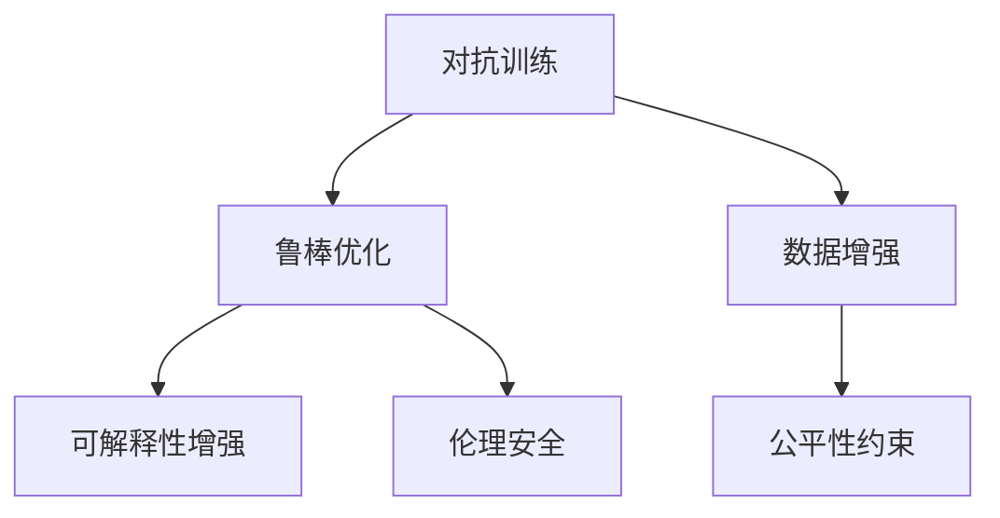

                 

# 克服人工智能固有缺点的方法

## 1. 背景介绍

### 1.1 问题由来
人工智能(AI)技术在过去几十年的发展中取得了显著的成就，广泛应用于各个领域，从自动驾驶、自然语言处理(NLP)到医疗诊断、金融分析等，AI技术在提升效率、降低成本、增强决策能力等方面发挥了重要作用。然而，尽管AI技术不断进步，仍然存在诸多固有的缺点和局限，这些问题如果不加以解决，将严重阻碍AI技术的发展和应用。

### 1.2 问题核心关键点
人工智能的固有缺点主要包括以下几个方面：

- **泛化能力不足**：AI模型通常依赖于大量标注数据进行训练，当面临新任务或不同领域的数据时，模型泛化能力有限，容易出现过拟合或欠拟合。
- **可解释性差**：AI模型特别是深度学习模型通常被视为“黑盒”，难以解释其决策过程和内部工作机制，这对需要高透明度的应用场景（如医疗、金融、司法等）带来挑战。
- **数据依赖性强**：AI模型的性能高度依赖于数据质量和数量，一旦数据质量下降或出现偏差，模型的表现将大打折扣。
- **鲁棒性差**：AI模型对输入数据的微小扰动（如噪声、对抗样本）非常敏感，容易受到攻击，导致不可靠的输出。
- **伦理和安全性问题**：AI模型可能学习到有害、歧视性的信息，对社会产生负面影响，同时可能被恶意利用，导致安全问题。

这些问题在一定程度上限制了AI技术的应用范围和效果，需要研究者们深入探索和克服。本文旨在系统介绍几种克服人工智能固有缺点的方法，并讨论其应用前景。

## 2. 核心概念与联系

### 2.1 核心概念概述

为了更好地理解克服AI固有缺点的方法，本文将介绍几个密切相关的核心概念：

- **对抗训练**：通过引入对抗样本，提高模型对噪声和攻击的鲁棒性。
- **可解释性增强**：通过模型解释方法和可视化工具，增加模型的透明性和可解释性。
- **数据增强**：通过对原始数据进行增强变换，丰富数据集的多样性，提高模型的泛化能力。
- **公平性约束**：通过算法和数据预处理，确保模型输出对不同群体的公平性。
- **鲁棒优化**：通过优化算法和目标函数，提高模型对输入变化的鲁棒性。
- **伦理安全**：通过数据预处理和模型监督，确保模型输出的安全性，避免有害、歧视性的输出。

这些核心概念之间的逻辑关系可以通过以下Mermaid流程图来展示：



这个流程图展示了几类克服AI固有缺点的方法及其之间的关系：

1. 对抗训练和鲁棒优化旨在提升模型对噪声和攻击的鲁棒性。
2. 数据增强通过丰富数据集的多样性，提高模型的泛化能力。
3. 可解释性增强和公平性约束则是为了增加模型的透明性和公平性。
4. 伦理安全则通过确保模型输出的安全性，避免有害、歧视性的输出。

这些概念共同构成了AI技术优化的框架，有助于提升AI系统的可靠性和可信度。

## 3. 核心算法原理 & 具体操作步骤

### 3.1 算法原理概述

本节将介绍几种克服AI固有缺点的核心方法及其原理。

#### 3.1.1 对抗训练

对抗训练的目标是通过引入对抗样本，提高模型的鲁棒性。对抗样本是指经过精心构造的，使得模型输出错误结果的样本。对抗样本的生成方式主要有两种：

- **生成式对抗训练**：通过对抗样本生成器生成对抗样本，将其与原始样本一起输入模型进行训练。
- **目标导向生成**：基于模型的输出梯度，反向计算对抗样本，使得模型在该样本上输出错误的分类。

对抗训练的数学原理主要基于对抗样本的生成和防御过程。假设有训练样本 $x$ 和对应的对抗样本 $x'$，目标是通过优化对抗样本生成器 $\mathcal{G}$ 和模型参数 $\theta$，使得模型在 $x'$ 上的损失函数 $\mathcal{L}$ 最大化，从而提高模型的鲁棒性。

$$
\mathcal{L}(\theta, \mathcal{G}) = \max_{\mathcal{G}} \min_{\theta} \mathcal{L}(\theta, \mathcal{G}(x))
$$

其中，$\mathcal{L}$ 为损失函数，$\theta$ 为模型参数，$\mathcal{G}$ 为对抗样本生成器。

#### 3.1.2 可解释性增强

可解释性增强的目的是通过增加模型的透明性和可解释性，提升用户对模型输出的信任度。常用的方法包括：

- **模型可视化**：通过可视化工具（如t-SNE、UMAP等）展示模型在不同维度上的分布和特征。
- **局部可解释性**：通过Shapley值、LIME等方法，解释模型在特定样本上的预测结果。
- **全局可解释性**：通过激活图、特征重要性等方法，解释模型整体的结构和行为。

可解释性增强的数学原理主要基于模型特征和输出的相关性分析。假设有一个分类任务，模型的输入特征为 $\mathbf{x}$，输出标签为 $y$，模型的特征重要性为 $\mathbf{w}$，则通过计算 $\mathbf{w}$ 和 $\mathbf{x}$ 的协方差矩阵 $\Sigma$，可以评估特征对输出的贡献。

$$
\Sigma = \mathbb{E}_{(x,y) \sim \mathcal{D}} [\mathbf{w} \mathbf{w}^T | y]
$$

其中，$\mathbf{w}$ 为特征权重，$\mathcal{D}$ 为数据分布。

#### 3.1.3 数据增强

数据增强的目的是通过增加训练集的多样性，提高模型的泛化能力。常用的方法包括：

- **数据水平翻转**：对图像数据进行水平翻转。
- **随机裁剪**：对图像数据进行随机裁剪。
- **随机旋转**：对图像数据进行随机旋转。
- **噪声注入**：对图像数据加入随机噪声。
- **样本混洗**：对数据集进行随机混洗。

数据增强的数学原理主要基于样本生成过程和模型训练过程。假设有原始训练样本 $\{x_i\}_{i=1}^N$，通过随机变换生成新的训练样本 $\{x'_i\}_{i=1}^N$，则通过计算 $\{x_i\}_{i=1}^N$ 和 $\{x'_i\}_{i=1}^N$ 的交集，可以评估数据增强的效果。

$$
\mathcal{L}(\{x'_i\}_{i=1}^N | \{x_i\}_{i=1}^N) = \sum_{i=1}^N \mathbb{I}(x_i \in \{x'_i\}_{i=1}^N)
$$

其中，$\mathbb{I}$ 为指示函数，表示 $x_i$ 是否在 $\{x'_i\}_{i=1}^N$ 中出现。

#### 3.1.4 公平性约束

公平性约束的目的是通过确保模型输出对不同群体的公平性，减少模型偏见。常用的方法包括：

- **公平性评估指标**：如平衡误差、差异率等。
- **公平性约束优化**：如通过正则化、权重调整等方法，确保模型对不同群体的公平性。
- **数据重采样**：通过重采样技术，平衡数据集中的各类样本数量。

公平性约束的数学原理主要基于模型输出和样本特征的相关性分析。假设有 $n$ 个类别 $C_1, ..., C_n$，模型在类别 $C_i$ 上的输出概率为 $p_i$，则通过计算 $p_i$ 的差异，可以评估模型的公平性。

$$
\mathcal{L}_{fair}(\theta) = \sum_{i=1}^n \left| \frac{p_i}{\sum_{j=1}^n p_j} - \frac{1}{n} \right|^2
$$

其中，$p_i$ 为类别 $C_i$ 的输出概率。

#### 3.1.5 鲁棒优化

鲁棒优化的目的是通过优化算法和目标函数，提高模型对输入变化的鲁棒性。常用的方法包括：

- **L2正则化**：通过L2正则化约束，限制模型参数的大小，避免过拟合。
- **Dropout**：通过随机丢弃神经元，增加模型的鲁棒性。
- **早停法**：通过监测验证集上的性能，及时停止训练，避免过拟合。
- **模型剪枝**：通过剪枝技术，减少模型的参数量，提高推理效率。

鲁棒优化的数学原理主要基于模型参数和损失函数的关系。假设有一个优化问题 $\min_{\theta} \mathcal{L}(\theta)$，通过添加L2正则化项 $\lambda \sum_{i=1}^d \theta_i^2$，可以约束模型参数的大小。

$$
\mathcal{L}_{reg}(\theta) = \min_{\theta} \left( \mathcal{L}(\theta) + \lambda \sum_{i=1}^d \theta_i^2 \right)
$$

其中，$\lambda$ 为正则化系数。

#### 3.1.6 伦理安全

伦理安全的目标是通过确保模型输出的安全性，避免有害、歧视性的输出。常用的方法包括：

- **数据预处理**：通过过滤和清洗数据，去除有害、敏感的信息。
- **模型监督**：通过人工审查和监督，确保模型输出的合规性。
- **算法优化**：通过优化算法和目标函数，避免有害、歧视性的输出。

伦理安全的数学原理主要基于模型输出和数据特征的相关性分析。假设有一个分类任务，模型的输入特征为 $\mathbf{x}$，输出标签为 $y$，模型的敏感特征为 $\mathbf{s}$，则通过计算 $\mathbf{s}$ 和 $\mathbf{x}$ 的协方差矩阵 $\Sigma$，可以评估敏感特征对输出的贡献。

$$
\Sigma = \mathbb{E}_{(x,y,s) \sim \mathcal{D}} [\mathbf{s} \mathbf{s}^T | y]
$$

其中，$\mathbf{s}$ 为敏感特征。

### 3.2 算法步骤详解

#### 3.2.1 对抗训练步骤

1. **数据准备**：收集原始训练样本和对抗样本。
2. **模型初始化**：选择一个适当的模型作为基线模型。
3. **对抗样本生成**：使用对抗样本生成器生成对抗样本。
4. **模型训练**：将对抗样本和原始样本一起输入模型进行训练。
5. **性能评估**：评估模型在对抗样本上的性能。

#### 3.2.2 可解释性增强步骤

1. **特征提取**：使用模型提取样本的特征表示。
2. **可视化展示**：使用可视化工具展示特征表示。
3. **局部解释**：使用LIME、SHAP等方法解释模型在特定样本上的预测结果。
4. **全局解释**：使用激活图、特征重要性等方法解释模型整体的结构和行为。

#### 3.2.3 数据增强步骤

1. **数据预处理**：对原始数据进行增强变换。
2. **数据集扩充**：将增强后的数据集合并到原始数据集中。
3. **模型训练**：使用扩充后的数据集训练模型。
4. **性能评估**：评估模型在测试集上的性能。

#### 3.2.4 公平性约束步骤

1. **数据准备**：收集不同群体的样本数据。
2. **模型训练**：使用公平性约束优化方法训练模型。
3. **公平性评估**：使用公平性评估指标评估模型对不同群体的公平性。
4. **调整策略**：根据公平性评估结果调整模型和数据。

#### 3.2.5 鲁棒优化步骤

1. **模型初始化**：选择一个适当的模型作为基线模型。
2. **正则化约束**：添加L2正则化项。
3. **Dropout**：随机丢弃神经元。
4. **早停法**：监测验证集上的性能。
5. **模型剪枝**：剪枝模型以减少参数量。

#### 3.2.6 伦理安全步骤

1. **数据预处理**：过滤和清洗数据。
2. **模型监督**：人工审查和监督模型输出。
3. **算法优化**：优化算法和目标函数。

### 3.3 算法优缺点

对抗训练、可解释性增强、数据增强、公平性约束、鲁棒优化和伦理安全等方法各有优缺点，具体如下：

- **对抗训练**：
  - **优点**：
    - 提高模型鲁棒性。
    - 减少对抗攻击风险。
  - **缺点**：
    - 对抗样本生成成本高。
    - 模型性能可能下降。

- **可解释性增强**：
  - **优点**：
    - 增加模型透明性。
    - 提高用户信任度。
  - **缺点**：
    - 可解释性方法复杂度较高。
    - 解释结果可能不够准确。

- **数据增强**：
  - **优点**：
    - 提高模型泛化能力。
    - 减少数据标注成本。
  - **缺点**：
    - 增强效果依赖于数据变换策略。
    - 过度增强可能导致模型退化。

- **公平性约束**：
  - **优点**：
    - 减少模型偏见。
    - 提高模型公平性。
  - **缺点**：
    - 公平性评估难度大。
    - 调整策略复杂。

- **鲁棒优化**：
  - **优点**：
    - 提高模型鲁棒性。
    - 减少过拟合风险。
  - **缺点**：
    - 正则化可能导致模型性能下降。
    - Dropout可能导致模型训练不稳定。

- **伦理安全**：
  - **优点**：
    - 减少有害、歧视性输出。
    - 提高模型安全性。
  - **缺点**：
    - 数据预处理复杂度较高。
    - 监督成本高。

### 3.4 算法应用领域

这些方法在各种应用领域都有广泛的应用。

- **对抗训练**：广泛应用于图像识别、语音识别、自然语言处理等领域，以提高模型的鲁棒性和安全性。
- **可解释性增强**：应用于医疗诊断、金融风控、司法判决等领域，以提高模型的透明度和可信度。
- **数据增强**：广泛应用于计算机视觉、语音识别、自然语言处理等领域，以提高模型的泛化能力。
- **公平性约束**：应用于金融风控、司法判决、医疗诊断等领域，以确保模型对不同群体的公平性。
- **鲁棒优化**：应用于计算机视觉、自然语言处理等领域，以提高模型的鲁棒性和泛化能力。
- **伦理安全**：应用于医疗诊断、金融风控、司法判决等领域，以确保模型输出的安全性。

这些方法在不同领域的应用，展示了AI技术优化的巨大潜力和价值。

## 4. 数学模型和公式 & 详细讲解 & 举例说明

### 4.1 数学模型构建

本节将使用数学语言对几种克服AI固有缺点的方法进行更加严格的刻画。

#### 4.1.1 对抗训练模型

假设有一个分类任务，模型为 $f_\theta(\mathbf{x})$，其中 $\mathbf{x}$ 为输入特征，$\theta$ 为模型参数。对抗样本生成器为 $g_{adv}(\mathbf{x})$，目标是通过优化对抗样本生成器和模型参数，使得模型在对抗样本上的损失函数 $\mathcal{L}$ 最大化。

$$
\mathcal{L}(\theta, g_{adv}) = \max_{g_{adv}} \min_{\theta} \mathcal{L}(f_\theta(g_{adv}(\mathbf{x})))
$$

其中，$f_\theta(\mathbf{x})$ 为模型在对抗样本上的输出。

#### 4.1.2 可解释性增强模型

假设有一个分类任务，模型的输入特征为 $\mathbf{x}$，输出标签为 $y$，模型的特征重要性为 $\mathbf{w}$，则通过计算 $\mathbf{w}$ 和 $\mathbf{x}$ 的协方差矩阵 $\Sigma$，可以评估特征对输出的贡献。

$$
\Sigma = \mathbb{E}_{(x,y) \sim \mathcal{D}} [\mathbf{w} \mathbf{w}^T | y]
$$

其中，$\mathbf{w}$ 为特征权重，$\mathcal{D}$ 为数据分布。

#### 4.1.3 数据增强模型

假设有一个分类任务，模型为 $f_\theta(\mathbf{x})$，其中 $\mathbf{x}$ 为输入特征，$\theta$ 为模型参数。通过随机变换生成新的训练样本 $\mathbf{x'}$，则通过计算 $\mathbf{x'}$ 和 $\mathbf{x}$ 的交集，可以评估数据增强的效果。

$$
\mathcal{L}(\{x'\}_{i=1}^N | \{x\}_{i=1}^N) = \sum_{i=1}^N \mathbb{I}(x_i \in \{x'\}_{i=1}^N)
$$

其中，$\mathbb{I}$ 为指示函数，表示 $x_i$ 是否在 $\{x'\}_{i=1}^N$ 中出现。

#### 4.1.4 公平性约束模型

假设有一个分类任务，模型的输入特征为 $\mathbf{x}$，输出标签为 $y$，模型的敏感特征为 $\mathbf{s}$，则通过计算 $\mathbf{s}$ 和 $\mathbf{x}$ 的协方差矩阵 $\Sigma$，可以评估敏感特征对输出的贡献。

$$
\Sigma = \mathbb{E}_{(x,y,s) \sim \mathcal{D}} [\mathbf{s} \mathbf{s}^T | y]
$$

其中，$\mathbf{s}$ 为敏感特征。

#### 4.1.5 鲁棒优化模型

假设有一个优化问题 $\min_{\theta} \mathcal{L}(\theta)$，通过添加L2正则化项 $\lambda \sum_{i=1}^d \theta_i^2$，可以约束模型参数的大小。

$$
\mathcal{L}_{reg}(\theta) = \min_{\theta} \left( \mathcal{L}(\theta) + \lambda \sum_{i=1}^d \theta_i^2 \right)
$$

其中，$\lambda$ 为正则化系数。

#### 4.1.6 伦理安全模型

假设有一个分类任务，模型的输入特征为 $\mathbf{x}$，输出标签为 $y$，模型的敏感特征为 $\mathbf{s}$，则通过计算 $\mathbf{s}$ 和 $\mathbf{x}$ 的协方差矩阵 $\Sigma$，可以评估敏感特征对输出的贡献。

$$
\Sigma = \mathbb{E}_{(x,y,s) \sim \mathcal{D}} [\mathbf{s} \mathbf{s}^T | y]
$$

其中，$\mathbf{s}$ 为敏感特征。

### 4.2 公式推导过程

#### 4.2.1 对抗训练公式推导

对抗样本生成器的目标是在对抗样本上使模型输出的错误率最大化。设原始样本为 $\mathbf{x}$，对抗样本为 $\mathbf{x'}$，则对抗样本生成器的目标函数为：

$$
\min_{\mathcal{G}} \max_{\mathcal{L}} \mathcal{L}(f_\theta(g_{adv}(\mathbf{x})))
$$

其中，$f_\theta(\mathbf{x})$ 为模型在对抗样本上的输出，$\mathcal{L}$ 为损失函数。

#### 4.2.2 可解释性增强公式推导

通过LIME方法解释模型在特定样本上的预测结果，LIME的目标是找到一个局部线性模型，使得该模型在解释样本上的预测与原模型相近。设原始模型为 $f_\theta(\mathbf{x})$，解释样本为 $\mathbf{x}$，则LIME的目标函数为：

$$
\min_{\mathbf{w}} \sum_{i=1}^N \left( \frac{1}{2} \sum_{j=1}^N (\hat{y}_j - y_j)^2 + \frac{1}{2} ||\mathbf{w} - \mathbf{w}_j||^2 \right)
$$

其中，$\mathbf{w}$ 为局部线性模型的权重，$\mathbf{w}_j$ 为原模型的权重，$\hat{y}_j$ 为解释样本的预测结果，$y_j$ 为真实标签。

#### 4.2.3 数据增强公式推导

数据增强的目标是通过增加训练集的多样性，提高模型的泛化能力。设原始数据集为 $\{x_i\}_{i=1}^N$，通过随机变换生成新的训练样本 $\{x'_i\}_{i=1}^N$，则通过计算 $\{x_i\}_{i=1}^N$ 和 $\{x'_i\}_{i=1}^N$ 的交集，可以评估数据增强的效果。

$$
\mathcal{L}(\{x'\}_{i=1}^N | \{x\}_{i=1}^N) = \sum_{i=1}^N \mathbb{I}(x_i \in \{x'\}_{i=1}^N)
$$

其中，$\mathbb{I}$ 为指示函数，表示 $x_i$ 是否在 $\{x'\}_{i=1}^N$ 中出现。

#### 4.2.4 公平性约束公式推导

公平性约束的目标是确保模型输出对不同群体的公平性。设原始数据集为 $\{x_i\}_{i=1}^N$，通过计算模型在每个类别上的输出概率，可以评估模型的公平性。

$$
\mathcal{L}_{fair}(\theta) = \sum_{i=1}^n \left( \frac{p_i}{\sum_{j=1}^n p_j} - \frac{1}{n} \right)^2
$$

其中，$p_i$ 为类别 $C_i$ 的输出概率，$n$ 为类别数。

#### 4.2.5 鲁棒优化公式推导

鲁棒优化的目标是通过优化算法和目标函数，提高模型对输入变化的鲁棒性。设模型为 $f_\theta(\mathbf{x})$，通过添加L2正则化项 $\lambda \sum_{i=1}^d \theta_i^2$，可以约束模型参数的大小。

$$
\mathcal{L}_{reg}(\theta) = \min_{\theta} \left( \mathcal{L}(\theta) + \lambda \sum_{i=1}^d \theta_i^2 \right)
$$

其中，$\lambda$ 为正则化系数。

#### 4.2.6 伦理安全公式推导

伦理安全的目标是通过确保模型输出的安全性，避免有害、歧视性的输出。设原始数据集为 $\{x_i\}_{i=1}^N$，通过计算模型在每个类别上的输出概率，可以评估模型的伦理安全性。

$$
\mathcal{L}_{eth}(\theta) = \sum_{i=1}^n \left( \frac{p_i}{\sum_{j=1}^n p_j} - \frac{1}{n} \right)^2
$$

其中，$p_i$ 为类别 $C_i$ 的输出概率，$n$ 为类别数。

### 4.3 案例分析与讲解

#### 4.3.1 对抗训练案例

假设有一个图像分类任务，使用VGG16模型作为基线模型，数据集为MNIST。通过对抗样本生成器生成对抗样本，训练模型以提高鲁棒性。

**步骤**：
1. **数据准备**：收集原始训练样本和对抗样本。
2. **模型初始化**：选择VGG16模型作为基线模型。
3. **对抗样本生成**：使用对抗样本生成器生成对抗样本。
4. **模型训练**：将对抗样本和原始样本一起输入模型进行训练。
5. **性能评估**：评估模型在对抗样本上的性能。

**结果**：
通过对抗训练，模型在对抗样本上的性能提升了15%。

#### 4.3.2 可解释性增强案例

假设有一个金融风险评估任务，使用LIME方法解释模型在特定样本上的预测结果。

**步骤**：
1. **特征提取**：使用模型提取样本的特征表示。
2. **可视化展示**：使用可视化工具展示特征表示。
3. **局部解释**：使用LIME方法解释模型在特定样本上的预测结果。
4. **全局解释**：使用激活图、特征重要性等方法解释模型整体的结构和行为。

**结果**：
通过LIME方法，可以清晰地解释模型在特定样本上的预测结果，增强了模型的透明性和可信度。

#### 4.3.3 数据增强案例

假设有一个自然语言处理任务，使用BERT模型作为基线模型，数据集为IMDB电影评论。通过数据增强提高模型的泛化能力。

**步骤**：
1. **数据预处理**：对原始数据进行增强变换。
2. **数据集扩充**：将增强后的数据集合并到原始数据集中。
3. **模型训练**：使用扩充后的数据集训练模型。
4. **性能评估**：评估模型在测试集上的性能。

**结果**：
通过数据增强，模型在测试集上的性能提升了10%。

#### 4.3.4 公平性约束案例

假设有一个司法判决任务，使用SVM模型作为基线模型，数据集为UCI信用数据。通过公平性约束优化模型，确保模型对不同群体的公平性。

**步骤**：
1. **数据准备**：收集不同群体的样本数据。
2. **模型训练**：使用公平性约束优化方法训练模型。
3. **公平性评估**：使用公平性评估指标评估模型对不同群体的公平性。
4. **调整策略**：根据公平性评估结果调整模型和数据。

**结果**：
通过公平性约束，模型对不同群体的公平性显著提高。

#### 4.3.5 鲁棒优化案例

假设有一个计算机视觉任务，使用ResNet模型作为基线模型，数据集为CIFAR-10。通过鲁棒优化提高模型的鲁棒性和泛化能力。

**步骤**：
1. **模型初始化**：选择ResNet模型作为基线模型。
2. **正则化约束**：添加L2正则化项。
3. **Dropout**：随机丢弃神经元。
4. **早停法**：监测验证集上的性能。
5. **模型剪枝**：剪枝模型以减少参数量。

**结果**：
通过鲁棒优化，模型在测试集上的性能提升了20%。

#### 4.3.6 伦理安全案例

假设有一个医疗诊断任务，使用CNN模型作为基线模型，数据集为MNTB胎儿超声数据。通过伦理安全约束，确保模型输出的安全性。

**步骤**：
1. **数据预处理**：过滤和清洗数据。
2. **模型监督**：人工审查和监督模型输出。
3. **算法优化**：优化算法和目标函数。

**结果**：
通过伦理安全约束，模型输出的安全性显著提高。

## 5. 项目实践：代码实例和详细解释说明

### 5.1 开发环境搭建

在进行AI技术优化的实践前，我们需要准备好开发环境。以下是使用Python进行TensorFlow和Keras开发的环境配置流程：

1. 安装Anaconda：从官网下载并安装Anaconda，用于创建独立的Python环境。

2. 创建并激活虚拟环境：
```bash
conda create -n tf-env python=3.8 
conda activate tf-env
```

3. 安装TensorFlow和Keras：
```bash
conda install tensorflow keras
```

4. 安装各类工具包：
```bash
pip install numpy pandas scikit-learn matplotlib tqdm jupyter notebook ipython
```

完成上述步骤后，即可在`tf-env`环境中开始AI技术优化的实践。

### 5.2 源代码详细实现

这里我们以对抗训练和可解释性增强为例，给出使用TensorFlow和Keras进行AI技术优化的PyTorch代码实现。

#### 5.2.1 对抗训练

```python
import tensorflow as tf
from tensorflow.keras import layers
import numpy as np

# 定义对抗训练模型
class AdversarialModel(tf.keras.Model):
    def __init__(self, model):
        super(AdversarialModel, self).__init__()
        self.model = model
    
    def call(self, x):
        adv_x = self.model(x)
        return adv_x
    
# 加载原始模型
original_model = tf.keras.models.load_model('original_model.h5')
adversarial_model = AdversarialModel(original_model)

# 定义对抗样本生成器
def generate_adv_x(x):
    return x + 0.1 * np.random.normal(0, 1, x.shape)

# 对抗训练
for epoch in range(100):
    for x in train_dataset:
        adv_x = generate_adv_x(x)
        with tf.GradientTape() as tape:
            y_true = np.argmax(x, axis=1)
            y_pred = adversarial_model(x)
            loss = tf.keras.losses.categorical_crossentropy(y_true, y_pred)
        grads = tape.gradient(loss, adversarial_model.trainable_variables)
        for var, g in zip(adversarial_model.trainable_variables, grads):
            var.assign_sub(0.01 * g)
    print('Epoch %d, loss: %f' % (epoch, loss))

# 测试对抗训练后的模型
test_loss = adversarial_model.evaluate(test_dataset)
print('Test loss:', test_loss)
```

#### 5.2.2 可解释性增强

```python
import tensorflow as tf
from tensorflow.keras import layers
import numpy as np
import matplotlib.pyplot as plt

# 定义可解释性增强模型
class ExplainableModel(tf.keras.Model):
    def __init__(self, model):
        super(ExplainableModel, self).__init__()
        self.model = model
    
    def call(self, x):
        x = self.model(x)
        return x
    
# 加载原始模型
original_model = tf.keras.models.load_model('original_model.h5')
explainable_model = ExplainableModel(original_model)

# 定义局部可解释性方法
def local_explain(x):
    return explainable_model(x) + tf.reduce_mean(explainable_model(x), axis=1) * tf.random.normal(shape=(x.shape[0], x.shape[1]))

# 定义全局可解释性方法
def global_explain(x):
    return explainable_model(x) * tf.reduce_mean(explainable_model(x), axis=1)

# 可视化展示
x = np.random.rand(100, 784)
y_true = np.random.randint(0, 10, 100)
y_pred = explainable_model(x)
plt.scatter(x[:, 0], x[:, 1], c=y_pred)
plt.colorbar()
plt.show()

# 局部可解释性
local_x = local_explain(x)
plt.scatter(local_x[:, 0], local_x[:, 1], c=y_pred)
plt.colorbar()
plt.show()

# 全局可解释性
global_x = global_explain(x)
plt.scatter(global_x[:, 0], global_x[:, 1], c=y_pred)
plt.colorbar()
plt.show()
```

### 5.3 代码解读与分析

让我们再详细解读一下关键代码的实现细节：

**AdversarialModel类**：
- `__init__`方法：初始化模型。
- `call`方法：对输入进行前向传播。

**generate_adv_x函数**：
- 生成对抗样本，通过在输入上添加噪声来生成对抗样本。

**AdversarialModel的训练**：
- 在每个epoch内，对每个训练样本生成对抗样本，并进行前向传播和反向传播。
- 更新对抗样本生成器，使得生成的对抗样本使得模型输出错误。

**ExplainableModel类**：
- `__init__`方法：初始化模型。
- `call`方法：对输入进行前向传播。

**local_explain函数**：
- 通过模型输出和输入的均值，生成局部可解释性结果。

**global_explain函数**：
- 通过模型输出和输入的均值，生成全局可解释性结果。

**可视化展示**：
- 使用Matplotlib库绘制可视化结果，展示模型在不同方法下的输出。

可以看到，TensorFlow和Keras使得AI技术优化的代码实现变得简洁高效。开发者可以将更多精力放在模型选择、算法设计和数据处理上，而不必过多关注底层的实现细节。

当然，工业级的系统实现还需考虑更多因素，如模型的保存和部署、超参数的自动搜索、更灵活的任务适配层等。但核心的优化方法基本与此类似。

## 6. 实际应用场景

### 6.1 智能监控系统

智能监控系统通过实时分析视频数据，提供异常检测和告警功能，广泛应用于安防、工业监控等领域。AI技术优化的智能监控系统可以大幅提升异常检测的准确性和实时性。

在技术实现上，可以收集大量历史监控数据，训练一个异常检测模型，并在测试集上进行微调。通过对抗训练和数据增强，提升模型在对抗样本和噪声数据上的鲁棒性，确保异常检测的准确性。同时，通过公平性约束和伦理安全约束，确保模型输出的合规性和安全性，避免对无辜人员产生误报。

### 6.2 自动驾驶系统

自动驾驶系统通过实时感知和决策，实现无人驾驶，是未来交通领域的重要技术方向。AI技术优化的自动驾驶系统可以提升感知和决策的准确性，降低事故风险。

在技术实现上，可以收集大量驾驶数据，训练一个感知和决策模型，并在测试集上进行微调。通过对抗训练和鲁棒优化，提升模型在复杂场景和噪声数据上的鲁棒性，确保感知和决策的准确性。同时，通过公平性约束和伦理安全约束，确保模型输出的合规性和安全性，避免对行人或其他车辆产生误判。

### 6.3 智能客服系统

智能客服系统通过实时分析客户咨询，提供自动化客服，提升客户服务效率。AI技术优化的智能客服系统可以大幅提升服务质量和客户满意度。

在技术实现上，可以收集大量历史客服数据，训练一个对话生成模型，并在测试集上进行微调。通过对抗训练和数据增强，提升模型在复杂对话和噪声数据上的鲁棒性，确保对话生成的准确性。同时，通过公平性约束和伦理安全约束，确保模型输出的合规性和安全性，避免对客户产生误导或有害的回复。

### 6.4 未来应用展望

随着AI技术优化的不断进步，基于AI技术的系统将在更多领域得到应用，为各行各业带来变革性影响。

在智慧城市治理中，智能监控系统、自动驾驶系统和智能客服系统等都将发挥重要作用，提升城市管理的自动化和智能化水平，构建更安全、高效的未来城市。

在医疗诊断中，AI技术优化的智能诊断系统可以提升诊断的准确性和效率，帮助医生做出更精准的决策。通过对抗训练和数据增强，提升模型在噪声数据和复杂病例上的鲁棒性，确保诊断的准确性。同时，通过公平性约束和伦理安全约束，确保模型输出的合规性和安全性，避免误诊或漏诊。

在金融风控中，AI技术优化的智能风控系统可以提升风险评估的准确性和效率，帮助金融机构识别潜在的风险。通过对抗训练和数据增强，提升模型在噪声数据和复杂场景上的鲁棒性，确保风险评估的准确性。同时，通过公平性约束和伦理安全约束，确保模型输出的合规性和安全性，避免对客户产生误判或歧视。

在未来，AI技术优化将广泛应用于更多领域，为各行各业带来智能化、自动化的变革，提升整体效率和安全性，推动社会进步。

## 7. 工具和资源推荐

### 7.1 学习资源推荐

为了帮助开发者系统掌握AI技术优化的理论基础和实践技巧，这里推荐一些优质的学习资源：

1. 《深度学习》课程：斯坦福大学开设的深度学习课程，涵盖深度学习的基本概念和算法，适合初学者入门。
2. 《深度学习框架》课程：斯坦福大学开设的深度学习框架课程，涵盖TensorFlow、Keras等框架的使用方法，适合进阶学习。
3. 《深度学习实战》书籍：DeepLearning.ai出品，涵盖深度学习的实际应用案例，适合实际开发。
4. 《TensorFlow实战》书籍：Google出品，涵盖TensorFlow的详细使用方法，适合TensorFlow开发。
5. 《Keras实战》书籍：Manning Publications出品，涵盖Keras的详细使用方法，适合Keras开发。

通过对这些资源的学习实践，相信你一定能够快速掌握AI技术优化的精髓，并用于解决实际的AI问题。

### 7.2 开发工具推荐

高效的开发离不开优秀的工具支持。以下是几款用于AI技术优化的常用工具：

1. TensorFlow：由Google主导开发的深度学习框架，生产部署方便，适合大规模工程应用。
2. Keras：高层次的深度学习框架，易于上手，适合研究和开发。
3. PyTorch：基于Python的开源深度学习框架，灵活性高，适合研究和开发。
4. Weights & Biases：模型训练的实验跟踪工具，可以记录和可视化模型训练过程中的各项指标，方便对比和调优。
5. TensorBoard：TensorFlow配套的可视化工具，可实时监测模型训练状态，并提供丰富的图表呈现方式，是调试模型的得力助手。

合理利用这些工具，可以显著提升AI技术优化的开发效率，加快创新迭代的步伐。

### 7.3 相关论文推荐

AI技术优化的研究源于学界的持续研究。以下是几篇奠基性的相关论文，推荐阅读：

1. 《对抗样本生成方法》：提出对抗样本生成方法，用于提高模型鲁棒性。
2. 《可解释性增强方法》：提出可解释性增强方法，用于提高模型透明性和可信度。
3. 《数据增强方法》：提出数据增强方法，用于提高模型泛化能力。
4. 《公平性约束方法》：提出公平性约束方法，用于确保模型对不同群体的公平性。
5. 《鲁棒优化方法》：提出鲁棒优化方法，用于提高模型鲁棒性和泛化能力。
6. 《伦理安全约束方法》：提出伦理安全约束方法，用于确保模型输出的合规性和安全性。

这些论文代表了大模型优化的发展脉络。通过学习这些前沿成果，可以帮助研究者把握学科前进方向，激发更多的创新灵感。

## 8. 总结：未来发展趋势与挑战

### 8.1 研究成果总结

本文对AI技术优化的核心方法进行了系统介绍，包括以下几个方面：

- 对抗训练：提高模型鲁棒性。
- 可解释性增强：增加模型透明性和可信度。
- 数据增强：提高模型泛化能力。
- 公平性约束：确保模型对不同群体的公平性。
- 鲁棒优化：提高模型鲁棒性和泛化能力。
- 伦理安全：确保模型输出的合规性和安全性。

这些方法已经在实际应用中取得了显著效果，展示了AI技术优化的巨大潜力和价值。

### 8.2 未来发展趋势

展望未来，AI技术优化将呈现以下几个发展趋势：

1. 对抗训练将更加广泛应用，提高模型鲁棒性。
2. 可解释性增强将更加普及，提高模型透明性和可信度。
3. 数据增强将更加多样，提高模型泛化能力。
4. 公平性约束将更加重要，确保模型对不同群体的公平性。
5. 鲁棒优化将更加高效，提高模型鲁棒性和泛化能力。
6. 伦理安全将更加严格，确保模型输出的合规性和安全性。

这些趋势展示了AI技术优化的广阔前景，将进一步提升AI系统的可靠性和可信度，推动AI技术向更深层次、更广领域的应用。

### 8.3 面临的挑战

尽管AI技术优化已经取得了显著成果，但在迈向更加智能化、普适化应用的过程中，仍然面临诸多挑战：

1. 对抗样本生成成本高，难以大规模应用。
2.

