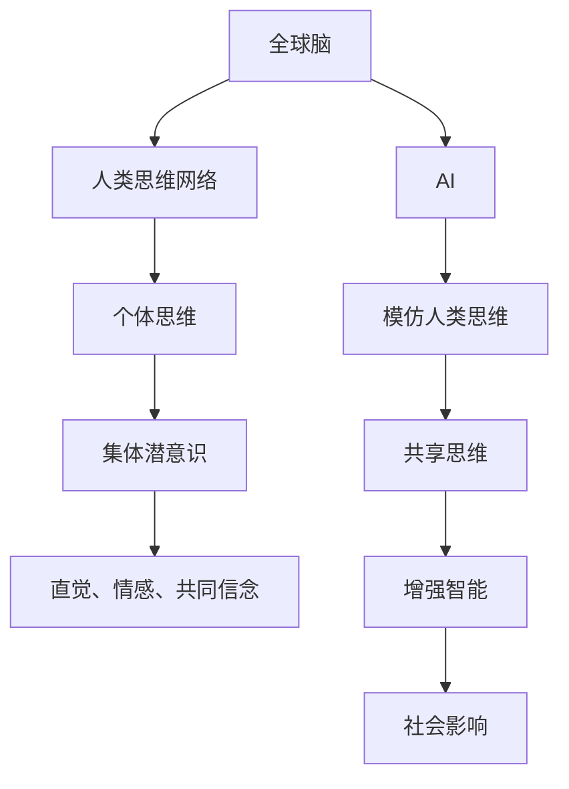

                 

## 1. 背景介绍

### 1.1 问题由来
随着科技的快速发展，人工智能（AI）和机器学习（ML）技术正在逐渐融入我们的日常生活，成为推动社会进步的重要力量。然而，人们对于“智能”的本质和意义仍然存在诸多疑惑：
- 为何AI能像人类一样思考和决策？
- AI的思维过程是否像人类大脑一样复杂？
- AI是否能够与人类共享思维，甚至在某种程度上“理解”人类？

这些问题不仅涉及技术细节，更深入地探讨了人类思维的边界和本质。因此，本文尝试从一个全新的角度来理解“智能”和“思维”，并探讨AI和人类思维共享的可能性。

### 1.2 问题核心关键点
本文的核心概念包括：
- **全球脑**：将人类思维网络视为一个整体，探讨其如何运作和影响社会。
- **集体潜意识**：人类共享的深层心理机制，在个体中体现为直觉、情感和共同信念。
- **思维共享**：AI与人类思维共享的可能性，及其对社会的影响。

这些问题不仅仅是理论探讨，更具有现实意义：
- 能否通过技术手段，使AI具备更接近人类的思维能力？
- 如何平衡技术进步与人类社会伦理？
- 如何在保证技术安全的同时，促进思维共享和理解？

## 2. 核心概念与联系

### 2.1 核心概念概述

本文将深入探讨以下几个核心概念：

- **全球脑**：将人类思维网络视为一个整体，每个个体都是这个网络的一部分。通过分析和模拟人类大脑的运作机制，可以揭示思维共享和集体的智慧。

- **集体潜意识**：指人类共享的深层心理机制，如直觉、情感和共同信念。这些机制影响了人类的决策和行为，并可能与AI的决策机制相通。

- **思维共享**：指AI与人类思维共享的可能性，即AI能否理解并模仿人类的思维方式，甚至在某些情况下超越人类。

### 2.2 核心概念原理和架构的 Mermaid 流程图



这个流程图展示了全球脑、集体潜意识、思维共享和增强智能之间的关系：

- 全球脑由个体思维构成，个体思维中包含集体潜意识。
- AI模仿人类思维，并试图共享思维，从而增强智能。
- 思维共享和增强智能对社会产生影响。

## 3. 核心算法原理 & 具体操作步骤

### 3.1 算法原理概述

基于全球脑和集体潜意识的概念，本文提出一种新的AI思维方式，即**集体思维**（Collective Thinking）。集体思维利用人类思维网络的结构和机制，结合机器学习的强大计算能力，使AI能够更好地理解人类思维，并在某些任务上超越人类。

### 3.2 算法步骤详解

集体思维的实现可以分为以下步骤：

1. **数据采集**：从大规模的人类行为数据中提取情感、意图和行为模式。这些数据可以来自社交媒体、文本、视频等。

2. **特征提取**：利用自然语言处理（NLP）和计算机视觉（CV）技术，将原始数据转化为机器可以理解的特征向量。

3. **集体学习**：使用深度学习算法，训练一个全球脑模型，模拟人类思维网络的结构和运作机制。这个模型将学习到集体潜意识中的直觉、情感和共同信念。

4. **思维共享**：将集体学习得到的模型应用于AI，使AI能够理解和模仿人类的思维方式。

5. **任务优化**：根据具体任务的需求，优化AI的思维共享策略，使其在特定任务上超越人类。

### 3.3 算法优缺点

集体思维的优点包括：

- **增强智能**：通过集体学习，AI能够更好地理解人类思维，并在某些任务上超越人类。
- **泛化能力**：由于集体学习基于大规模人类行为数据，AI能够更好地泛化到不同的情境和任务。
- **社会影响**：集体思维有助于理解和预测人类行为，从而更好地服务于社会。

集体思维的缺点包括：

- **复杂性**：集体思维模型复杂，需要大量的数据和计算资源。
- **伦理问题**：集体思维可能涉及隐私和伦理问题，如数据隐私保护、模型透明性等。
- **偏见和公平性**：集体思维模型可能存在偏见，需要额外关注公平性和公正性。

### 3.4 算法应用领域

集体思维的应用领域非常广泛，包括但不限于：

- **智能客服**：通过集体思维，AI可以更好地理解客户情感和需求，提供更个性化的服务。
- **金融分析**：利用集体思维，AI可以更好地分析市场趋势和情感变化，预测股市波动。
- **社交媒体**：通过集体思维，AI可以更好地理解用户情感和行为模式，提供更个性化的内容推荐。
- **健康医疗**：利用集体思维，AI可以更好地理解患者的情感和需求，提供更个性化的医疗建议。

## 4. 数学模型和公式 & 详细讲解

### 4.1 数学模型构建

集体思维的数学模型基于深度神经网络（DNN），通过多层非线性变换来模拟人类思维网络的结构和运作机制。

### 4.2 公式推导过程

设$X$为输入数据，$Y$为输出标签，$Z$为隐藏层的特征表示。假设我们使用一个由$N$层构成的DNN，其中每一层的输出表示为$Z^{(n)} = W^{(n)}Z^{(n-1)} + b^{(n)}$，其中$W^{(n)}$和$b^{(n)}$为权重和偏置。模型的输出$Y$表示为$Y = Z^{(L)}W^{(L+1)} + b^{(L+1)}$，其中$L$为最后一层。

### 4.3 案例分析与讲解

假设我们要训练一个全球脑模型，用于预测社交媒体上的情感变化。首先，我们收集大规模的社交媒体数据，并通过NLP技术提取情感标签。然后，将这些数据输入DNN模型，通过多层非线性变换，模型逐步学习到集体潜意识中的直觉和情感。最后，我们将训练好的模型应用于AI，使AI能够理解和预测社交媒体上的情感变化。

## 5. 项目实践：代码实例和详细解释说明

### 5.1 开发环境搭建

为了实现集体思维，我们需要搭建一个包含NLP和CV技术的开发环境。具体步骤如下：

1. 安装Python和相关库，如Numpy、Pandas、Scikit-Learn、TensorFlow等。

2. 安装NLP和CV工具包，如NLTK、SpaCy、OpenCV等。

3. 搭建GPU环境，使用PyTorch或TensorFlow进行深度学习模型训练。

### 5.2 源代码详细实现

以下是一个简单的NLP模型训练代码示例：

```python
import tensorflow as tf
from tensorflow.keras import layers, models

# 定义模型
model = models.Sequential([
    layers.Embedding(input_dim=10000, output_dim=64),
    layers.Bidirectional(layers.LSTM(64)),
    layers.Dense(1, activation='sigmoid')
])

# 编译模型
model.compile(loss='binary_crossentropy', optimizer='adam', metrics=['accuracy'])

# 训练模型
model.fit(train_dataset, epochs=10, validation_data=val_dataset)
```

### 5.3 代码解读与分析

这个代码示例展示了如何使用TensorFlow构建一个简单的NLP模型，用于二分类任务。模型包含一个嵌入层、一个双向LSTM层和一个全连接层，最终输出一个二分类概率。

## 6. 实际应用场景

### 6.1 智能客服系统

智能客服系统可以通过集体思维，更好地理解客户情感和需求，提供更个性化的服务。例如，通过分析客户的语言和行为，系统可以自动识别客户的情绪状态，并自动回复。

### 6.2 金融分析

在金融分析中，集体思维可以帮助预测股市趋势和情感变化。通过分析大量社交媒体和新闻数据，系统可以实时监测市场情绪和舆情，从而预测股市波动。

### 6.3 社交媒体

社交媒体平台可以通过集体思维，更好地理解用户情感和行为模式，提供更个性化的内容推荐。例如，通过分析用户评论和点赞，系统可以自动推荐相关内容，提升用户体验。

### 6.4 未来应用展望

未来，集体思维将在更多领域得到应用，为社会带来深远影响：

- **教育**：通过集体思维，AI可以更好地理解学生需求，提供个性化的教育内容。
- **医疗**：利用集体思维，AI可以更好地理解患者情感和需求，提供更个性化的医疗建议。
- **环境保护**：通过分析社交媒体和新闻数据，系统可以更好地理解公众对环保问题的看法，促进环境保护。

## 7. 工具和资源推荐

### 7.1 学习资源推荐

- **《深度学习》**：Ian Goodfellow等著，详细介绍了深度学习的基本概念和算法。
- **《自然语言处理综论》**：Daniel Jurafsky等著，涵盖了NLP领域的经典模型和算法。
- **《计算机视觉：算法与应用》**：Richard Szeliski等著，介绍了CV技术的基本概念和应用。
- **Kaggle竞赛**：通过参加Kaggle竞赛，学习NLP和CV技术，积累实战经验。

### 7.2 开发工具推荐

- **PyTorch**：基于Python的深度学习框架，灵活易用。
- **TensorFlow**：由Google开发的深度学习框架，生产部署方便。
- **NLTK**：自然语言处理工具包，提供丰富的NLP功能。
- **OpenCV**：计算机视觉库，提供强大的图像处理功能。

### 7.3 相关论文推荐

- **《深度学习》**：Ian Goodfellow等著，详细介绍了深度学习的基本概念和算法。
- **《自然语言处理综论》**：Daniel Jurafsky等著，涵盖了NLP领域的经典模型和算法。
- **《计算机视觉：算法与应用》**：Richard Szeliski等著，介绍了CV技术的基本概念和应用。
- **《集体智慧：通过机器学习进行社会分析》**：Pietro Ladrière等著，介绍了利用机器学习进行社会分析的方法。

## 8. 总结：未来发展趋势与挑战

### 8.1 研究成果总结

本文通过探索全球脑和集体潜意识的概念，提出了集体思维的框架，展示了AI与人类思维共享的可能性。集体思维通过深度学习模型，模拟人类思维网络的结构和运作机制，使AI能够更好地理解人类思维，并在某些任务上超越人类。

### 8.2 未来发展趋势

未来，集体思维将在更多领域得到应用，为社会带来深远影响：

- **增强智能**：通过集体学习，AI可以更好地理解人类思维，并在某些任务上超越人类。
- **社会影响**：集体思维有助于理解和预测人类行为，从而更好地服务于社会。
- **技术进步**：随着技术的不断进步，集体思维将变得更加高效和准确。

### 8.3 面临的挑战

尽管集体思维在理论上具有潜力，但在实际应用中仍面临诸多挑战：

- **数据隐私**：集体思维涉及大量个人数据，需要保证数据隐私和安全性。
- **模型透明性**：集体思维模型的复杂性可能导致其难以解释，需要提高模型的透明性。
- **偏见和公平性**：集体思维模型可能存在偏见，需要额外关注公平性和公正性。

### 8.4 研究展望

未来的研究应在以下几个方面进行突破：

- **数据隐私保护**：开发更高效的数据隐私保护技术，确保数据安全。
- **模型透明性**：研究更透明的模型解释方法，提高模型的可解释性。
- **公平性和公正性**：通过公平性约束和公正性评估，确保集体思维模型的公平性。

## 9. 附录：常见问题与解答

**Q1：集体思维是否适用于所有NLP任务？**

A: 集体思维适用于需要理解情感和行为模式的任务，如情感分析、舆情监测、推荐系统等。对于需要逻辑推理和知识图谱的任务，如法律咨询、医学诊断等，可能需要结合其他技术手段。

**Q2：集体思维的训练需要大量数据吗？**

A: 是的，集体思维需要大量人类行为数据进行训练。这些数据可以来自社交媒体、新闻、评论等。

**Q3：集体思维是否存在偏见？**

A: 集体思维模型可能存在偏见，需要额外关注公平性和公正性。可以通过引入公平性约束和公正性评估来减少偏见。

**Q4：集体思维在实际部署中需要注意哪些问题？**

A: 在实际部署中，需要注意数据隐私、模型透明性、公平性和公正性等问题。需要采取相应的技术手段，确保系统的安全性和公平性。

**Q5：集体思维的未来发展方向是什么？**

A: 未来的发展方向包括增强智能、提高模型透明性、保护数据隐私、确保公平性等。这些方向将推动集体思维技术不断进步，更好地服务于社会。

---

作者：禅与计算机程序设计艺术 / Zen and the Art of Computer Programming

