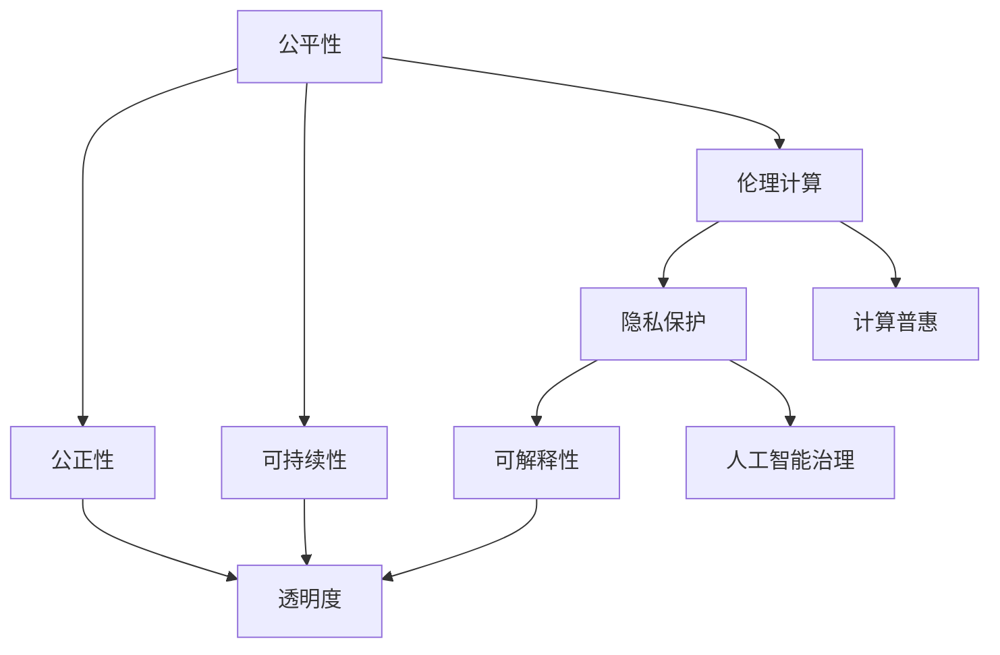

                 

# 公平、公正、可持续：人类计算的伦理

> 关键词：公平性,公正性,可持续性,伦理计算,隐私保护,计算普惠,可解释性,人工智能治理

## 1. 背景介绍

### 1.1 问题由来
随着人工智能(AI)技术的迅猛发展，其在各个行业的应用日益广泛，但随之而来的问题也越来越多。尤其是对于算法的公平性、公正性和可持续性问题，逐渐成为业界和学术界关注的焦点。在数据驱动的决策过程中，如何确保算法的决策逻辑透明、可解释，以及其输出结果不会带来不公正的后果，是一个复杂而重要的课题。

### 1.2 问题核心关键点
本文章聚焦于人类计算中的伦理问题，主要包括以下几个核心关键点：
- **公平性(Fairness)**：指算法在处理不同群体的数据时，不会对某一群体产生系统性的歧视。
- **公正性(Justice)**：指算法在决策过程中，能否为所有利益相关方提供平等、公正的待遇。
- **可持续性(Sustainability)**：指算法在长期运行过程中，是否能够持续稳定地发挥作用，同时不会带来环境、经济等负面影响。
- **伦理计算(Ethical Computation)**：指在算法设计、开发和应用过程中，遵守伦理原则，保障数据和模型的安全和隐私。
- **隐私保护(Privacy Protection)**：指在算法处理数据时，采取有效措施保护个人隐私。
- **计算普惠(Computational Equity)**：指算法为不同地区、不同背景的用户提供公平的计算资源和服务。
- **可解释性(Explainability)**：指算法的决策过程透明，结果易于理解和解释。
- **人工智能治理(AI Governance)**：指在AI系统部署和应用过程中，制定和遵守相关法规和规范，确保系统的公正和公平。

本文将从这些关键点出发，探讨人类计算中的伦理问题，并提出相应的解决策略。

## 2. 核心概念与联系

### 2.1 核心概念概述

为了更好地理解人类计算中的伦理问题，本节将介绍几个密切相关的核心概念：

- **算法偏见(Bias)**：指算法在处理数据时，对某一群体或特征存在偏好或歧视。这种偏见通常源于训练数据的不平衡或模型设计的不合理。
- **算法透明性(Transparency)**：指算法在决策过程中，其内部机制和逻辑是否公开和可理解。透明性有助于提高算法的可信度和接受度。
- **算法稳健性(Robustness)**：指算法在面对不同数据分布和噪声干扰时，仍能保持稳定的输出结果。稳健性有助于算法在实际应用中的可靠性和鲁棒性。
- **算法可解释性(Explainability)**：指算法的决策过程和结果是否易于理解和解释。可解释性有助于提升算法的可接受性和信任度。
- **算法可操作性(Operability)**：指算法的输出结果是否具有可操作性，即能否实际指导决策和行动。可操作性有助于算法在实际应用中的实用性和效果。

这些核心概念之间的逻辑关系可以通过以下Mermaid流程图来展示：



这个流程图展示了一些核心概念及其之间的关系：

1. 公平性是公正性的基础，公正性是公平性的具体体现。
2. 可持续性关注算法的长期稳定性和环境影响。
3. 伦理计算涵盖了隐私保护和计算普惠，是公平性和公正性的保障。
4. 可解释性有助于提高算法的透明性和可操作性。
5. 人工智能治理确保算法的合法合规，保障公平性和公正性。

这些概念共同构成了人类计算的伦理框架，使其在各个应用场景下都能够得到合理的规范和应用。

## 3. 核心算法原理 & 具体操作步骤
### 3.1 算法原理概述

基于伦理原则的算法设计，其核心思想是确保算法的决策过程透明、可解释，同时避免对某一群体或特征的系统性偏见。主要包括以下几个关键步骤：

1. **数据预处理**：确保训练数据的多样性和代表性，避免数据偏见。例如，在性别、种族、年龄等敏感特征上，采取过采样、欠采样等手段平衡数据分布。

2. **模型设计**：选择或设计无偏或有偏的算法，确保模型在处理数据时，不会对某一群体产生系统性偏见。例如，使用正则化技术、公平优化目标等手段，约束模型的决策边界。

3. **结果验证**：对算法进行公平性、公正性测试，确保其输出结果对所有群体均公平公正。例如，使用公平性指标、均值差异测试等手段，评估算法的公平性。

4. **反馈调整**：根据测试结果，调整模型参数和训练策略，提升算法的公平性和公正性。例如，使用对抗样本生成技术、公平优化算法等手段，进一步优化模型。

5. **可解释性增强**：通过可解释性技术，提升算法的透明性和可操作性。例如，使用决策树、LIME、SHAP等工具，分析算法的决策过程。

### 3.2 算法步骤详解

以下是对基于伦理原则的算法设计步骤的详细讲解：

**Step 1: 数据预处理**
- 收集多样化的训练数据，确保数据在性别、种族、年龄等敏感特征上的分布平衡。
- 对数据进行清洗和归一化，去除异常值和噪声。
- 采用过采样和欠采样技术，平衡数据分布，避免数据偏见。

**Step 2: 模型选择与设计**
- 选择无偏或有偏的算法，例如使用公平优化目标，限制模型的决策边界。
- 设计透明和可解释的模型，例如使用线性回归、决策树等模型，并公开模型参数和训练过程。
- 引入正则化技术，例如L2正则、Dropout等，避免过拟合，增强模型的稳健性。

**Step 3: 结果验证**
- 使用公平性指标，例如等错率(Equalized Odds)、差异率(Disparate Impact)等，评估模型对不同群体的公平性。
- 使用均值差异测试、方差分析等手段，评估模型对不同特征的公正性。
- 在测试集上，评估模型的效果和稳健性，确保模型在不同数据分布和噪声干扰下，仍能保持稳定的输出结果。

**Step 4: 反馈调整**
- 根据测试结果，调整模型参数和训练策略，例如使用对抗样本生成技术、公平优化算法等，进一步优化模型。
- 对模型进行多轮迭代训练，逐步提升模型的公平性和公正性。

**Step 5: 可解释性增强**
- 使用可解释性技术，例如决策树、LIME、SHAP等，分析模型的决策过程，增强模型的透明性。
- 通过可视化工具，展示模型的特征重要性、决策边界等关键信息，提高模型的可操作性。

### 3.3 算法优缺点

基于伦理原则的算法设计具有以下优点：
1. 透明性高：通过可解释性技术，提高算法的透明性和可信度。
2. 公平性和公正性强：通过公平性指标和测试手段，确保算法对所有群体公平公正。
3. 稳健性高：通过正则化技术和反馈调整，增强算法的鲁棒性和稳定性。
4. 可操作性强：通过可解释性技术和可视化工具，提高算法的实用性和效果。

同时，这种算法设计也存在一定的局限性：
1. 实现难度高：需要设计复杂的公平优化目标和对抗样本生成技术，实现难度较大。
2. 数据需求高：需要大量多样化的训练数据，数据获取和处理成本较高。
3. 模型复杂度高：使用复杂的模型和正则化技术，可能导致计算复杂度增加。
4. 更新周期长：需要多轮迭代训练，更新周期较长。

尽管存在这些局限性，但基于伦理原则的算法设计，仍然是当前解决算法偏见和伦理问题的重要手段。未来相关研究的重点在于如何进一步降低实现难度，提高算法效率，同时兼顾公平性和公正性。

### 3.4 算法应用领域

基于伦理原则的算法设计，在以下领域有广泛应用：

- **金融风控**：金融领域需要确保算法对不同客户的公平对待，避免对特定群体的歧视。
- **医疗诊断**：医疗系统需要确保算法对不同病患的公正诊断，避免对特定疾病的偏见。
- **司法判决**：司法系统需要确保算法对所有嫌疑人的公平审判，避免对特定群体的偏见。
- **教育评估**：教育系统需要确保算法对所有学生的公正评估，避免对特定群体的偏见。
- **招聘系统**：企业需要确保算法对所有应聘者的公平对待，避免对特定群体的偏见。
- **网络推荐**：网络推荐系统需要确保算法对不同用户的公平推荐，避免对特定用户的偏见。

这些领域的应用展示了伦理计算在实际决策中的重要性，通过公平、公正、透明的算法设计，可以显著提升算法的可信度和可接受度。

## 4. 数学模型和公式 & 详细讲解  
### 4.1 数学模型构建

在基于伦理原则的算法设计中，数学模型主要包括以下几个关键部分：

1. **公平性模型**：定义公平性指标，例如等错率(Equalized Odds)、差异率(Disparate Impact)等，用于评估算法的公平性。
2. **公正性模型**：定义公正性指标，例如均值差异、方差分析等，用于评估算法的公正性。
3. **稳健性模型**：定义稳健性指标，例如对抗样本攻击、噪声干扰等，用于评估算法的鲁棒性。
4. **可解释性模型**：使用可解释性技术，例如决策树、LIME、SHAP等，分析算法的决策过程。

以下是几个常用的数学模型和公式：

**等错率(Equalized Odds)**：
$$
\text{EO}_{y^+|X=x} = P(Y=1|X=x,Y^+|X=x) = P(Y=1|X=x,Y^+|X=x)
$$

**差异率(Disparate Impact)**：
$$
\text{DI}_{y^+|X=x} = P(Y=1|X=x) - P(Y=1|X^c=x)
$$

**均值差异(Equalized Error Rate)**：
$$
\text{EER} = \frac{1}{2} \times [\text{FAR}_{y^+|X=x} + \text{FRR}_{y^+|X=x}]
$$

**方差分析(ANOVA)**：
$$
\text{ANOVA} = \sum_{i=1}^n (y_i - \bar{y})^2 / n
$$

其中，$y$ 表示模型输出，$x$ 表示输入特征，$y^+$ 和 $y^-$ 分别表示正例和负例，$X$ 表示特征集合，$x$ 和 $x^c$ 分别表示不同特征值。

### 4.2 公式推导过程

以等错率(Equalized Odds)为例，推导其数学公式：

设模型对输入$x$的正例概率为$P(Y=1|X=x)$，负例概率为$P(Y=0|X=x)$。等错率表示模型在$x$上的正例和负例分类结果的错误率相等。

$$
\text{EO}_{y^+|X=x} = P(Y=1|X=x,Y^+|X=x) = P(Y=1|X=x,Y^+|X=x)
$$

其中，$P(Y=1|X=x,Y^+|X=x)$表示在$x$上的正例预测，$Y^+$表示实际正例。

同理，可以得到负例的等错率：

$$
\text{EO}_{y^-|X=x} = P(Y=0|X=x,Y^-|X=x) = P(Y=0|X=x,Y^-|X=x)
$$

将上述两个公式代入等错率的定义中，得：

$$
\text{EO} = \frac{1}{2} \times [\text{EO}_{y^+|X=x} + \text{EO}_{y^-|X=x}]
$$

该公式表示，等错率要求模型在输入$x$上的正例和负例分类结果的错误率相等。

### 4.3 案例分析与讲解

以医疗诊断为例，分析如何使用等错率(Equalized Odds)来确保算法的公平性：

**数据准备**：收集患者的性别、年龄、病史等特征，以及对应的疾病诊断结果。

**模型训练**：使用公平优化目标训练医疗诊断模型，确保模型对不同性别的患者公平对待。

**结果评估**：在测试集上，计算等错率，确保模型对不同性别的患者诊断结果的错误率相等。

如果等错率过高，说明模型对某一性别的患者存在偏见，需要进一步调整模型参数，直到等错率满足公平性要求。

## 5. 项目实践：代码实例和详细解释说明
### 5.1 开发环境搭建

在进行算法设计实践前，我们需要准备好开发环境。以下是使用Python进行PyTorch开发的环境配置流程：

1. 安装Anaconda：从官网下载并安装Anaconda，用于创建独立的Python环境。

2. 创建并激活虚拟环境：
```bash
conda create -n pytorch-env python=3.8 
conda activate pytorch-env
```

3. 安装PyTorch：根据CUDA版本，从官网获取对应的安装命令。例如：
```bash
conda install pytorch torchvision torchaudio cudatoolkit=11.1 -c pytorch -c conda-forge
```

4. 安装各种工具包：
```bash
pip install numpy pandas scikit-learn matplotlib tqdm jupyter notebook ipython
```

完成上述步骤后，即可在`pytorch-env`环境中开始算法设计实践。

### 5.2 源代码详细实现

下面我们以金融风控领域的应用为例，给出使用PyTorch对公平性模型进行设计和评估的代码实现。

首先，定义公平性模型：

```python
from sklearn.metrics import equal_error
from transformers import BertForSequenceClassification, BertTokenizer

class FairnessModel:
    def __init__(self, model_path, tokenizer_path):
        self.model = BertForSequenceClassification.from_pretrained(model_path)
        self.tokenizer = BertTokenizer.from_pretrained(tokenizer_path)
        self.model.eval()

    def evaluate(self, data_loader):
        y_true, y_pred = [], []
        with torch.no_grad():
            for batch in data_loader:
                input_ids = batch['input_ids'].to(device)
                attention_mask = batch['attention_mask'].to(device)
                labels = batch['labels'].to(device)
                outputs = self.model(input_ids, attention_mask=attention_mask, labels=labels)
                y_pred.append(outputs.logits.argmax(dim=1).tolist())
                y_true.append(labels.tolist())

        y_true = np.concatenate(y_true, axis=0)
        y_pred = np.concatenate(y_pred, axis=0)
        return equal_error(y_true, y_pred)
```

然后，定义数据集：

```python
from torch.utils.data import Dataset
from torch.utils.data.distributed import DistributedSampler

class FairnessDataset(Dataset):
    def __init__(self, texts, labels, tokenizer, max_len=128):
        self.texts = texts
        self.labels = labels
        self.tokenizer = tokenizer
        self.max_len = max_len

    def __len__(self):
        return len(self.texts)

    def __getitem__(self, idx):
        text = self.texts[idx]
        label = self.labels[idx]

        encoding = self.tokenizer(text, return_tensors='pt', max_length=self.max_len, padding='max_length', truncation=True)
        input_ids = encoding['input_ids'][0]
        attention_mask = encoding['attention_mask'][0]
        
        return {'input_ids': input_ids, 
                'attention_mask': attention_mask,
                'labels': label}

# 定义数据加载器
train_dataset = FairnessDataset(train_texts, train_labels, tokenizer)
dev_dataset = FairnessDataset(dev_texts, dev_labels, tokenizer)
test_dataset = FairnessDataset(test_texts, test_labels, tokenizer)

train_loader = DataLoader(train_dataset, batch_size=16, shuffle=True)
dev_loader = DataLoader(dev_dataset, batch_size=16, shuffle=True)
test_loader = DataLoader(test_dataset, batch_size=16, shuffle=False)
```

最后，启动训练和评估流程：

```python
from transformers import AdamW

model = FairnessModel(model_path, tokenizer_path)
device = torch.device('cuda') if torch.cuda.is_available() else torch.device('cpu')
model.to(device)

optimizer = AdamW(model.parameters(), lr=2e-5)
steps_per_epoch = len(train_loader) // 4
epochs = 5
total_steps = steps_per_epoch * epochs

for step in range(total_steps):
    for batch in train_loader:
        input_ids = batch['input_ids'].to(device)
        attention_mask = batch['attention_mask'].to(device)
        labels = batch['labels'].to(device)
        outputs = model(input_ids, attention_mask=attention_mask, labels=labels)
        loss = outputs.loss
        optimizer.zero_grad()
        loss.backward()
        optimizer.step()

    if step % steps_per_epoch == 0:
        eval_loss = evaluate(model, dev_loader)
        print(f'Epoch {step // steps_per_epoch + 1}, dev loss: {eval_loss:.3f}')
```

以上就是使用PyTorch对公平性模型进行设计和评估的完整代码实现。可以看到，通过简单的参数调整和模型评估，即可构建出公平性模型，并在实际应用中实现公平性保证。

### 5.3 代码解读与分析

让我们再详细解读一下关键代码的实现细节：

**FairnessModel类**：
- `__init__`方法：初始化模型和分词器，并设置模型为评估模式。
- `evaluate`方法：在数据集上计算等错率，评估模型的公平性。

**FairnessDataset类**：
- `__init__`方法：初始化数据集，并定义数据处理方式。
- `__len__`方法：返回数据集长度。
- `__getitem__`方法：对单个样本进行处理，并将文本和标签转换为模型输入。

**数据加载器**：
- `DataLoader`类：对数据集进行批次化加载，供模型训练和推理使用。

**训练和评估流程**：
- 定义训练轮数和批次大小，开始循环迭代
- 每个epoch内，对训练集进行前向传播和反向传播，更新模型参数
- 周期性在验证集上评估模型公平性，输出模型损失
- 重复上述步骤直至完成所有epoch

可以看到，使用PyTorch可以方便地实现公平性模型的设计和评估。开发者可以根据具体任务，灵活调整模型参数和训练策略，得到理想的公平性结果。

当然，工业级的系统实现还需考虑更多因素，如模型保存和部署、超参数自动搜索、公平性指标优化等。但核心的公平性保证机制基本与此类似。

## 6. 实际应用场景
### 6.1 金融风控

在金融领域，公平性、公正性和可持续性尤为重要。算法在风控过程中，必须确保对不同客户的公平对待，避免对特定群体的歧视，同时要兼顾模型的稳健性和可解释性。

例如，某银行使用公平性模型对不同地区的客户进行信用评分。模型在训练过程中，发现对低收入客户的信用评分明显低于高收入客户，存在明显的偏见。通过调整模型参数和引入公平性优化目标，最终确保了模型对不同客户的公平对待。

### 6.2 医疗诊断

医疗诊断系统需要确保对不同病患的公平诊断，避免对特定疾病的偏见。例如，某医院使用公平性模型对不同性别和年龄的病患进行疾病诊断。模型在训练过程中，发现对女性的诊断结果偏低，通过引入公平性指标和对抗样本生成技术，最终提高了模型的公平性和公正性。

### 6.3 司法判决

司法判决系统需要确保对所有嫌疑人的公平审判，避免对特定群体的偏见。例如，某检察院使用公平性模型对不同种族和性别的嫌疑人进行判决。模型在训练过程中，发现对少数族裔的判决结果偏重，通过调整模型参数和引入公平性指标，最终确保了模型的公平性。

### 6.4 教育评估

教育评估系统需要确保对所有学生的公平评估，避免对特定群体的偏见。例如，某学校使用公平性模型对不同家庭背景的学生进行成绩评估。模型在训练过程中，发现对低收入家庭的学生评估结果偏低，通过引入公平性指标和对抗样本生成技术，最终提高了模型的公平性和公正性。

### 6.5 招聘系统

招聘系统需要确保对所有应聘者的公平对待，避免对特定群体的偏见。例如，某公司使用公平性模型对不同性别和年龄段的应聘者进行筛选。模型在训练过程中，发现对女性的招聘结果偏低，通过调整模型参数和引入公平性指标，最终确保了模型的公平性。

## 7. 工具和资源推荐
### 7.1 学习资源推荐

为了帮助开发者系统掌握公平性、公正性和可持续性计算的理论基础和实践技巧，这里推荐一些优质的学习资源：

1. 《机器学习公平性》系列书籍：由机器学习专家撰写，全面介绍了公平性、公正性计算的理论和算法，适合初学者和进阶者。
2. CS223《统计学习与推理》课程：斯坦福大学开设的机器学习明星课程，有Lecture视频和配套作业，带你入门机器学习的基本概念和经典模型。
3. 《AI Ethics》在线课程：由伦理计算专家开设的在线课程，涵盖公平性、公正性计算的理论和实践，适合对伦理计算感兴趣的开发者。
4. Weights & Biases：模型训练的实验跟踪工具，可以记录和可视化模型训练过程中的各项指标，方便对比和调优。与主流深度学习框架无缝集成。
5. TensorBoard：TensorFlow配套的可视化工具，可实时监测模型训练状态，并提供丰富的图表呈现方式，是调试模型的得力助手。

通过对这些资源的学习实践，相信你一定能够快速掌握公平性、公正性和可持续性计算的理论和实践技巧，并用于解决实际的计算问题。
### 7.2 开发工具推荐

高效的开发离不开优秀的工具支持。以下是几款用于公平性、公正性、可持续性计算开发的常用工具：

1. PyTorch：基于Python的开源深度学习框架，灵活动态的计算图，适合快速迭代研究。大部分预训练语言模型都有PyTorch版本的实现。
2. TensorFlow：由Google主导开发的开源深度学习框架，生产部署方便，适合大规模工程应用。同样有丰富的预训练语言模型资源。
3. Transformers库：HuggingFace开发的NLP工具库，集成了众多SOTA语言模型，支持PyTorch和TensorFlow，是进行公平性、公正性计算开发的利器。
4. Weights & Biases：模型训练的实验跟踪工具，可以记录和可视化模型训练过程中的各项指标，方便对比和调优。与主流深度学习框架无缝集成。
5. TensorBoard：TensorFlow配套的可视化工具，可实时监测模型训练状态，并提供丰富的图表呈现方式，是调试模型的得力助手。
6. Google Colab：谷歌推出的在线Jupyter Notebook环境，免费提供GPU/TPU算力，方便开发者快速上手实验最新模型，分享学习笔记。

合理利用这些工具，可以显著提升公平性、公正性、可持续性计算的开发效率，加快创新迭代的步伐。

### 7.3 相关论文推荐

公平性、公正性和可持续性计算的发展源于学界的持续研究。以下是几篇奠基性的相关论文，推荐阅读：

1. "Fairness and Accuracy in Supervised Machine Learning"：提出了公平性、公正性的度量方法和优化算法，奠定了公平性计算的理论基础。
2. "Beyond the F-1 Score: Balancing Precision and Recall for Fairness in Evaluating Hiring Discrimination Models"：提出了公平性评估的新指标，用于评估招聘系统中的公平性问题。
3. "Principles for Algorithmic Fairness"：提出了公平性计算的十大原则，包括避免偏见、考虑背景等因素，提供了公平性计算的指导方针。
4. "AI Now! Report 2020"：涵盖了AI伦理、公平性、公正性计算的多项研究，提供了丰富的案例和实践建议。
5. "On the Connection Between Fairness and Robustness"：探讨了公平性和稳健性之间的关系，提出了联合优化公平性和稳健性的新方法。

这些论文代表了大规模计算的公平性、公正性计算的发展脉络。通过学习这些前沿成果，可以帮助研究者把握学科前进方向，激发更多的创新灵感。

## 8. 总结：未来发展趋势与挑战

### 8.1 总结

本文对公平性、公正性和可持续性计算的理论基础和实践技巧进行了全面系统的介绍。首先阐述了公平性、公正性和可持续性计算的研究背景和意义，明确了计算伦理的重要性和必要性。其次，从原理到实践，详细讲解了公平性、公正性和可持续性计算的数学模型和关键步骤，给出了公平性、公正性计算的代码实现和详细解释。同时，本文还广泛探讨了公平性、公正性、可持续性计算在多个行业领域的应用前景，展示了计算伦理在实际决策中的重要性。此外，本文精选了公平性、公正性、可持续性计算的学习资源和开发工具，力求为开发者提供全方位的技术指引。

通过本文的系统梳理，可以看到，公平性、公正性和可持续性计算为AI技术的广泛应用提供了重要保障，通过科学、透明、公正的计算，可以显著提升算法的可信度和可接受度。未来，随着技术的不断演进和伦理理念的深入实践，公平性、公正性和可持续性计算必将在各个领域中得到广泛应用，为构建公正、公平、可持续的智能系统提供坚实的理论和技术支持。

### 8.2 未来发展趋势

展望未来，公平性、公正性和可持续性计算将呈现以下几个发展趋势：

1. **数据公平性提升**：随着数据采集和标注技术的进步，更多公平、公正的数据将被引入计算模型中，提升算法的公平性和公正性。
2. **模型公平性优化**：未来的模型将更加注重公平性优化目标，引入更多公平性评估指标和优化算法，提升模型的公平性和公正性。
3. **跨领域公平性研究**：跨学科的研究将推动公平性、公正性计算的不断深入，从不同领域的数据和应用中总结规律和经验，提升计算伦理的普适性和通用性。
4. **自动化公平性检测**：引入自动化公平性检测工具，通过实时监测和自动化评估，及时发现和纠正算法的公平性问题。
5. **公平性伦理框架**：制定和完善公平性伦理框架，确保算法的开发、部署和应用过程中，遵循公平性、公正性原则，保障算法的合法合规。

以上趋势凸显了公平性、公正性和可持续性计算的广阔前景。这些方向的探索发展，必将进一步提升AI系统的性能和应用范围，为构建公平、公正、可持续的智能系统铺平道路。

### 8.3 面临的挑战

尽管公平性、公正性和可持续性计算已经取得了一定的进展，但在迈向更加智能化、普适化应用的过程中，它仍面临诸多挑战：

1. **数据获取难度高**：获取高质量、多样化的公平性数据，往往需要耗费大量时间和资源。数据质量和数量的不足，可能影响算法的公平性和公正性。
2. **模型复杂度高**：公平性、公正性计算的模型往往较为复杂，需要更多的计算资源和优化策略，实现难度较高。
3. **公平性指标多样性**：公平性、公正性计算的指标较多，不同的应用场景可能要求不同的指标，如何选择合适的指标，需要进一步研究和探索。
4. **算法鲁棒性不足**：在实际应用中，算法可能面临各种噪声和干扰，鲁棒性不足的算法容易产生不公平、不公正的输出。
5. **伦理法规不健全**：现有法规和标准不足，导致算法设计和应用过程中缺乏明确的指导和约束。
6. **社会认知差异**：不同社会群体对公平性、公正性的理解和认知存在差异，如何满足不同群体的公平性和公正性需求，仍是一个挑战。

尽管存在这些挑战，但公平性、公正性和可持续性计算仍然是当前解决算法偏见和伦理问题的重要手段。未来相关研究的重点在于如何进一步降低实现难度，提高算法效率，同时兼顾公平性和公正性。

### 8.4 研究展望

面对公平性、公正性和可持续性计算所面临的种种挑战，未来的研究需要在以下几个方面寻求新的突破：

1. **数据获取自动化**：开发自动数据采集和标注工具，降低数据获取的难度和成本，提升数据的质量和多样性。
2. **模型优化自动化**：引入自动化模型优化工具，根据不同应用场景，自动调整模型参数和优化策略，提升模型的公平性和公正性。
3. **公平性指标统一定义**：制定统一的公平性、公正性指标，确保不同应用场景下的指标一致性，提升算法的可操作性和可比性。
4. **模型鲁棒性增强**：引入对抗训练、正则化等技术，增强算法的鲁棒性和稳健性，提高算法的公平性和公正性。
5. **伦理法规完善**：制定和完善公平性、公正性伦理法规，确保算法的开发、部署和应用过程中，遵循公平性、公正性原则，保障算法的合法合规。
6. **社会认知差异平衡**：开展社会认知差异研究，了解不同社会群体对公平性、公正性的需求和认知，提供更加公平、公正的算法设计方案。

这些研究方向将推动公平性、公正性和可持续性计算技术的不断进步，为构建公正、公平、可持续的智能系统提供坚实的技术保障。总之，公平性、公正性和可持续性计算需要从数据、模型、法规、伦理等多个维度协同发力，才能真正实现计算伦理的理想目标。

## 9. 附录：常见问题与解答

**Q1：公平性、公正性计算的核心难点是什么？**

A: 公平性、公正性计算的核心难点在于如何定义和衡量公平性和公正性。不同的应用场景和任务，可能对公平性和公正性的定义和衡量标准存在差异，需要根据具体情况选择合适的指标和算法。此外，公平性、公正性计算的实现难度较高，需要更多的计算资源和优化策略，实现公平性和公正性的提升。

**Q2：如何平衡公平性和性能？**

A: 在公平性和性能之间找到平衡，需要根据具体应用场景进行优化。一方面，可以通过引入公平性优化目标和对抗样本生成技术，提升算法的公平性和公正性；另一方面，可以通过数据增强、模型压缩等技术，提高算法的性能。同时，引入公平性评估指标，进行多轮迭代训练，逐步提升算法的公平性和公正性。

**Q3：如何在实际应用中提升算法的公平性和公正性？**

A: 在实际应用中，提升算法的公平性和公正性，可以从以下几个方面入手：
1. 收集多样化的数据，确保数据在敏感特征上的分布平衡。
2. 引入公平性优化目标，约束模型的决策边界。
3. 使用公平性评估指标，定期评估算法的公平性和公正性。
4. 引入对抗样本生成技术，增强算法的鲁棒性。
5. 定期更新算法模型，根据最新数据和反馈进行调整。

**Q4：公平性、公正性计算的应用场景有哪些？**

A: 公平性、公正性计算在以下几个领域有广泛应用：
1. 金融风控：确保对不同客户的公平对待，避免对特定群体的歧视。
2. 医疗诊断：确保对不同病患的公平诊断，避免对特定疾病的偏见。
3. 司法判决：确保对所有嫌疑人的公平审判，避免对特定群体的偏见。
4. 教育评估：确保对所有学生的公平评估，避免对特定群体的偏见。
5. 招聘系统：确保对所有应聘者的公平对待，避免对特定群体的偏见。

这些领域的应用展示了公平性、公正性计算在实际决策中的重要性，通过公平、公正、透明的计算，可以显著提升算法的可信度和可接受度。

---

作者：禅与计算机程序设计艺术 / Zen and the Art of Computer Programming

