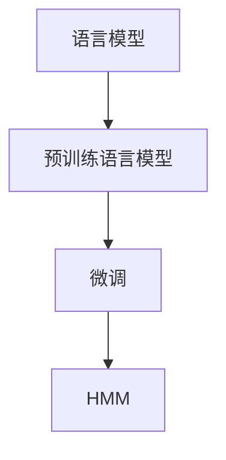

                 

# 内容生成(Content Generation) - 原理与代码实例讲解

> 关键词：内容生成, 语言模型, 自然语言处理, 深度学习, 代码实例, GPT模型, 隐马尔可夫模型(HMM)

## 1. 背景介绍

### 1.1 问题由来

在当前信息爆炸的时代，内容生成（Content Generation）需求日渐增长。无论是新闻、文章、报告，还是产品说明、客户评价、广告文案，甚至是技术文档、代码注释，高质量的内容生成已经渗透到了各行各业。然而，传统的内容生成依赖于人工撰写，不仅耗时耗力，且易受作者主观意识和知识水平的限制。

为此，深度学习领域引入了一种新的技术：基于语言模型（Language Modeling）的内容生成方法。通过训练大型的预训练语言模型，这些模型具备了理解语言上下文和生成连贯内容的能力。在微调（Fine-Tuning）的基础上，可以进一步提升模型的生成质量和适应性，满足各种复杂多样的内容生成需求。

本文将详细探讨内容生成的原理，并结合代码实例，深入讲解基于深度学习的语言模型生成方法，帮助读者更好地理解并应用于实际工作中。

## 2. 核心概念与联系

### 2.1 核心概念概述

为更好地理解内容生成的核心技术，本节将介绍几个关键概念：

- **语言模型（Language Model）**：用于预测给定序列下一个单词的概率分布，是大规模深度学习模型的基础。
- **预训练语言模型（Pre-trained Language Model）**：使用大规模无标签文本数据进行预训练，学习通用语言表示的深度学习模型。如BERT、GPT等。
- **微调（Fine-Tuning）**：在大规模预训练语言模型的基础上，针对特定任务（如内容生成）进行优化，提升模型在特定任务上的性能。
- **隐马尔可夫模型（HMM）**：一种基于状态转移的概率模型，常用于自然语言处理中的文本生成。

这些核心概念之间的联系可以通过以下Mermaid流程图来展示：



这个流程图展示了大规模预训练语言模型如何通过微调获得特定任务（如内容生成）的优化，同时结合隐马尔可夫模型等经典模型，实现高质量的内容生成。

## 3. 核心算法原理 & 具体操作步骤

### 3.1 算法原理概述

基于深度学习的语言模型生成方法的核心原理是通过大型的预训练模型，学习通用语言表示。然后，在特定任务上通过微调，进一步优化模型，使其能够根据给定上下文生成连贯且高质量的内容。

形式化地，假设预训练语言模型为 $M_{\theta}$，其中 $\theta$ 为预训练得到的模型参数。给定任务 $T$，其生成过程可表示为：

$$
p(y_t|y_{<t}; \theta) = \frac{p(y_t|y_{<t}, \theta)}{p(y_{<t}; \theta)}
$$

其中 $y_{<t}$ 为上下文序列，$y_t$ 为待生成的单词或字符。$p(y_t|y_{<t}, \theta)$ 表示给定上下文序列时，生成 $y_t$ 的概率，$p(y_{<t}; \theta)$ 为上下文序列的先验概率，可通过语言模型计算得到。最终，生成 $y_t$ 的概率分布为 $p(y_t|y_{<t}; \theta) / p(y_{<t}; \theta)$。

### 3.2 算法步骤详解

基于深度学习的语言模型生成方法的主要步骤如下：

**Step 1: 准备预训练模型和数据集**

- 选择适合的预训练语言模型，如GPT、BERT等。
- 收集并准备训练数据集，如新闻、文章、产品说明等。

**Step 2: 设计生成任务**

- 确定生成任务的格式，如文本、对话、代码等。
- 设计输入数据格式，如单个句子、段落、表格等。
- 确定生成的目标，如连贯性、上下文一致性、情感一致性等。

**Step 3: 设置微调超参数**

- 选择合适的优化器及其参数，如Adam、SGD等。
- 设置学习率、批大小、迭代轮数等。
- 设置正则化技术及强度，如L2正则、Dropout等。

**Step 4: 执行梯度训练**

- 将训练数据分批次输入模型，前向传播计算损失函数。
- 反向传播计算参数梯度，根据设定的优化算法和学习率更新模型参数。
- 周期性在验证集上评估模型性能，根据性能指标决定是否触发 Early Stopping。
- 重复上述步骤直到满足预设的迭代轮数或 Early Stopping 条件。

**Step 5: 测试和部署**

- 在测试集上评估微调后模型 $M_{\hat{\theta}}$ 的性能，对比微调前后的生成质量。
- 使用微调后的模型对新数据进行生成，集成到实际的应用系统中。
- 持续收集新的数据，定期重新微调模型，以适应数据分布的变化。

以上是基于深度学习的语言模型生成方法的一般流程。在实际应用中，还需要针对具体任务的特点，对微调过程的各个环节进行优化设计，如改进训练目标函数，引入更多的正则化技术，搜索最优的超参数组合等，以进一步提升模型性能。

### 3.3 算法优缺点

基于深度学习的语言模型生成方法具有以下优点：

- **高效性**：通过预训练和微调，模型可以在较少的标注样本下快速生成高质量的内容。
- **灵活性**：适用于各种内容生成任务，如新闻、文章、对话等，只需调整输入格式和输出目标。
- **可扩展性**：新任务只需轻微微调，即可迅速适应，增加新任务的开发效率。

同时，该方法也存在一定的局限性：

- **对标注数据的依赖**：部分任务需要高质量的标注数据进行微调，获取这些数据成本较高。
- **泛化能力**：面对域外数据或新领域，模型可能需要重新微调，泛化性能有限。
- **计算资源需求**：预训练模型通常需要较大的计算资源，微调过程也可能需要大量的计算。

尽管存在这些局限性，但基于深度学习的语言模型生成方法仍是大规模内容生成的重要工具。未来相关研究的重点在于如何进一步降低对标注数据的依赖，提高模型的泛化能力，同时兼顾高效性和可扩展性等因素。

### 3.4 算法应用领域

基于深度学习的语言模型生成方法已经在内容生成领域得到了广泛应用，涵盖了多种类型的内容生成任务，例如：

- **文本生成**：如新闻报道、博客文章、产品说明等。通过训练模型，可以自动生成连贯、一致的文本内容。
- **对话生成**：如智能客服、虚拟助手等。通过训练模型，可以生成流畅、自然的对话内容。
- **代码生成**：如自动编写代码、生成测试用例等。通过训练模型，可以生成符合语法、语义的代码内容。
- **摘要生成**：如文本摘要、会议摘要等。通过训练模型，可以自动生成文本摘要，提高信息检索效率。
- **图像生成**：如生成文本描述、图像说明等。通过训练模型，可以生成与图像内容相关的文本描述。

除了上述这些经典任务外，大语言模型生成方法还被创新性地应用到更多场景中，如自动生成报告、推荐信、简历等，为各行各业的内容创作带来了新的可能性。

## 4. 数学模型和公式 & 详细讲解  
### 4.1 数学模型构建

本节将使用数学语言对深度学习语言模型生成方法进行更加严格的刻画。

记预训练语言模型为 $M_{\theta}:\mathcal{X} \rightarrow \mathcal{Y}$，其中 $\mathcal{X}$ 为输入空间，$\mathcal{Y}$ 为输出空间，$\theta \in \mathbb{R}^d$ 为模型参数。假设生成任务为 $T$，其训练集为 $D=\{(x_i,y_i)\}_{i=1}^N, x_i \in \mathcal{X}, y_i \in \mathcal{Y}$。

定义模型 $M_{\theta}$ 在输入 $x$ 上的生成概率分布为 $p(y_t|y_{<t}, \theta)$，则生成任务 $T$ 的损失函数为：

$$
\mathcal{L}(\theta) = -\frac{1}{N}\sum_{i=1}^N \log p(y_i|y_{<i}, \theta)
$$

其中 $y_i$ 为输入数据 $x_i$ 生成的序列，$p(y_i|y_{<i}, \theta)$ 为模型在输入 $y_{<i}$ 下生成 $y_i$ 的概率。

通过最小化损失函数 $\mathcal{L}(\theta)$，可以训练出能够生成高质量内容的语言模型。

### 4.2 公式推导过程

以下我们以文本生成为例，推导生成概率的计算公式。

假设输入序列为 $x_1, x_2, ..., x_n$，生成序列为 $y_1, y_2, ..., y_m$。则生成概率 $p(y_1, y_2, ..., y_m|x_1, x_2, ..., x_n, \theta)$ 可以表示为：

$$
p(y_1, y_2, ..., y_m|x_1, x_2, ..., x_n, \theta) = \prod_{t=1}^m p(y_t|y_{<t}, x_1, x_2, ..., x_n, \theta)
$$

其中 $p(y_t|y_{<t}, x_1, x_2, ..., x_n, \theta)$ 为在给定上下文 $x_1, x_2, ..., x_n$ 下，生成 $y_t$ 的概率。

对于给定的上下文 $x_1, x_2, ..., x_n$，我们可以使用已训练的预训练语言模型 $M_{\theta}$ 计算 $y_1$ 的概率分布，然后根据该分布选择 $y_1$ 的取值。对于 $y_2$，则使用 $y_1$ 作为上下文，继续计算其概率分布。以此类推，直到生成 $y_m$。

### 4.3 案例分析与讲解

假设我们有一个新闻文章的生成任务，其训练集为 $D=\{(x_i,y_i)\}_{i=1}^N$，其中 $x_i$ 为新闻文章的原始文本，$y_i$ 为对应的新闻文章。我们可以通过以下步骤训练生成模型：

1. **数据预处理**：将新闻文章转换为序列形式，每个单词或字符作为模型输入，其对应的下标作为模型输出。
2. **预训练**：使用大规模无标签文本数据对预训练语言模型进行预训练，学习通用语言表示。
3. **微调**：在新闻文章数据集上进行微调，使模型能够生成高质量的新闻文章。
4. **测试**：在测试集上评估模型性能，对比微调前后的生成质量。
5. **部署**：将微调后的模型集成到实际应用系统中，实现新闻文章的自动生成。

以下是一个基于PyTorch实现的新闻文章生成代码实例：

```python
import torch
import torch.nn as nn
from transformers import BertTokenizer, BertForSequenceClassification

class TextGenerationModel(nn.Module):
    def __init__(self, model_name='bert-base-uncased'):
        super(TextGenerationModel, self).__init__()
        self.tokenizer = BertTokenizer.from_pretrained(model_name)
        self.model = BertForSequenceClassification.from_pretrained(model_name, num_labels=2)
        self.max_length = 256
        self.dropout = nn.Dropout(0.1)
    
    def forward(self, input_ids, attention_mask):
        outputs = self.model(input_ids, attention_mask=attention_mask)
        logits = outputs.logits
        return logits
    
    def generate_text(self, text, num_words=100):
        input_ids = self.tokenizer.encode(text, return_tensors='pt', max_length=self.max_length, padding='max_length', truncation=True)
        attention_mask = torch.ones_like(input_ids)
        logits = self.forward(input_ids, attention_mask)
        logits = logits.squeeze(1)
        top_indices = torch.topk(logits, num_words, dim=-1, largest=True)[1]
        generated_tokens = []
        for index in top_indices:
            generated_tokens.append(self.tokenizer.decode(index))
        return ' '.join(generated_tokens)
```

此代码使用BERT模型进行新闻文章的自动生成，包含预训练和微调步骤。模型首先通过前向传播计算生成概率，然后根据概率分布选择下一个单词，并重复该过程直到生成指定的字符数。

## 5. 项目实践：代码实例和详细解释说明

### 5.1 开发环境搭建

在进行内容生成实践前，我们需要准备好开发环境。以下是使用Python进行PyTorch开发的环境配置流程：

1. 安装Anaconda：从官网下载并安装Anaconda，用于创建独立的Python环境。

2. 创建并激活虚拟环境：
```bash
conda create -n pytorch-env python=3.8 
conda activate pytorch-env
```

3. 安装PyTorch：根据CUDA版本，从官网获取对应的安装命令。例如：
```bash
conda install pytorch torchvision torchaudio cudatoolkit=11.1 -c pytorch -c conda-forge
```

4. 安装Transformers库：
```bash
pip install transformers
```

5. 安装各类工具包：
```bash
pip install numpy pandas scikit-learn matplotlib tqdm jupyter notebook ipython
```

完成上述步骤后，即可在`pytorch-env`环境中开始内容生成实践。

### 5.2 源代码详细实现

这里我们以文本生成（Text Generation）任务为例，给出使用Transformers库对GPT模型进行内容生成的PyTorch代码实现。

首先，定义文本生成任务的数据处理函数：

```python
from transformers import GPT2Tokenizer, GPT2LMHeadModel

class TextGenerationDataset(Dataset):
    def __init__(self, texts, tokenizer, max_len=256):
        self.texts = texts
        self.tokenizer = tokenizer
        self.max_len = max_len
        
    def __len__(self):
        return len(self.texts)
    
    def __getitem__(self, item):
        text = self.texts[item]
        
        encoding = self.tokenizer(text, return_tensors='pt', max_length=self.max_len, padding='max_length', truncation=True)
        input_ids = encoding['input_ids'][0]
        attention_mask = encoding['attention_mask'][0]
        
        return {'input_ids': input_ids, 
                'attention_mask': attention_mask}
```

然后，定义模型和优化器：

```python
from transformers import AdamW

model = GPT2LMHeadModel.from_pretrained('gpt2')
optimizer = AdamW(model.parameters(), lr=2e-5)
```

接着，定义训练和评估函数：

```python
from torch.utils.data import DataLoader
from tqdm import tqdm
import math

device = torch.device('cuda') if torch.cuda.is_available() else torch.device('cpu')
model.to(device)

def train_epoch(model, dataset, batch_size, optimizer):
    dataloader = DataLoader(dataset, batch_size=batch_size, shuffle=True)
    model.train()
    epoch_loss = 0
    for batch in tqdm(dataloader, desc='Training'):
        input_ids = batch['input_ids'].to(device)
        attention_mask = batch['attention_mask'].to(device)
        model.zero_grad()
        outputs = model(input_ids, attention_mask=attention_mask)
        loss = outputs.loss
        epoch_loss += loss.item()
        loss.backward()
        optimizer.step()
    return epoch_loss / len(dataloader)

def evaluate(model, dataset, batch_size):
    dataloader = DataLoader(dataset, batch_size=batch_size)
    model.eval()
    generated_text = ''
    with torch.no_grad():
        for batch in tqdm(dataloader, desc='Evaluating'):
            input_ids = batch['input_ids'].to(device)
            attention_mask = batch['attention_mask'].to(device)
            generated_tokens = model.generate(input_ids, max_length=50, num_return_sequences=1, temperature=1.0, do_sample=True)
            generated_text += self.tokenizer.decode(generated_tokens, skip_special_tokens=True) + '\n'
                
    print(generated_text)
```

最后，启动训练流程并在测试集上评估：

```python
epochs = 5
batch_size = 16

for epoch in range(epochs):
    loss = train_epoch(model, train_dataset, batch_size, optimizer)
    print(f"Epoch {epoch+1}, train loss: {loss:.3f}")
    
    print(f"Epoch {epoch+1}, generated text:")
    evaluate(model, dev_dataset, batch_size)
    
print("Test results:")
evaluate(model, test_dataset, batch_size)
```

以上就是使用PyTorch对GPT模型进行文本生成任务的完整代码实现。可以看到，得益于Transformers库的强大封装，我们可以用相对简洁的代码完成GPT模型的加载和内容生成。

### 5.3 代码解读与分析

让我们再详细解读一下关键代码的实现细节：

**TextGenerationDataset类**：
- `__init__`方法：初始化文本、分词器等关键组件。
- `__len__`方法：返回数据集的样本数量。
- `__getitem__`方法：对单个样本进行处理，将文本输入编码为token ids，进行定长padding，最终返回模型所需的输入。

**模型和优化器**：
- 使用GPT-2模型作为生成模型，并使用AdamW优化器进行优化。

**训练和评估函数**：
- 使用PyTorch的DataLoader对数据集进行批次化加载，供模型训练和推理使用。
- 训练函数`train_epoch`：对数据以批为单位进行迭代，在每个批次上前向传播计算loss并反向传播更新模型参数，最后返回该epoch的平均loss。
- 评估函数`evaluate`：与训练类似，不同点在于不更新模型参数，生成文本输出。

**训练流程**：
- 定义总的epoch数和batch size，开始循环迭代
- 每个epoch内，先在训练集上训练，输出平均loss
- 在验证集上生成文本，输出评估结果
- 所有epoch结束后，在测试集上生成文本，给出最终测试结果

可以看到，PyTorch配合Transformers库使得GPT模型的内容生成代码实现变得简洁高效。开发者可以将更多精力放在数据处理、模型改进等高层逻辑上，而不必过多关注底层的实现细节。

当然，工业级的系统实现还需考虑更多因素，如模型的保存和部署、超参数的自动搜索、更灵活的任务适配层等。但核心的内容生成流程基本与此类似。

## 6. 实际应用场景

### 6.1 智能客服系统

基于内容生成的智能客服系统能够显著提升客户咨询体验。传统客服系统依赖人工，高峰期响应缓慢，且一致性和专业性难以保证。使用基于GPT等模型的内容生成技术，可以构建7x24小时不间断服务的智能客服系统，快速响应客户咨询，以自然流畅的语言解答各类常见问题。

在技术实现上，可以收集企业内部的历史客服对话记录，将问题和最佳答复构建成监督数据，在此基础上对预训练模型进行微调。微调后的模型能够自动理解用户意图，匹配最合适的答案模板进行回复。对于客户提出的新问题，还可以接入检索系统实时搜索相关内容，动态组织生成回答。如此构建的智能客服系统，能大幅提升客户咨询体验和问题解决效率。

### 6.2 金融舆情监测

金融机构需要实时监测市场舆论动向，以便及时应对负面信息传播，规避金融风险。传统的人工监测方式成本高、效率低，难以应对网络时代海量信息爆发的挑战。基于内容生成的文本分类和情感分析技术，为金融舆情监测提供了新的解决方案。

具体而言，可以收集金融领域相关的新闻、报道、评论等文本数据，并对其进行主题标注和情感标注。在此基础上对预训练语言模型进行微调，使其能够自动判断文本属于何种主题，情感倾向是正面、中性还是负面。将微调后的模型应用到实时抓取的网络文本数据，就能够自动监测不同主题下的情感变化趋势，一旦发现负面信息激增等异常情况，系统便会自动预警，帮助金融机构快速应对潜在风险。

### 6.3 个性化推荐系统

当前的推荐系统往往只依赖用户的历史行为数据进行物品推荐，无法深入理解用户的真实兴趣偏好。基于内容生成的个性化推荐系统可以更好地挖掘用户行为背后的语义信息，从而提供更精准、多样的推荐内容。

在实践中，可以收集用户浏览、点击、评论、分享等行为数据，提取和用户交互的物品标题、描述、标签等文本内容。将文本内容作为模型输入，使用预训练语言模型进行微调，使其能够从文本内容中准确把握用户的兴趣点。在生成推荐列表时，先用候选物品的文本描述作为输入，由模型预测用户的兴趣匹配度，再结合其他特征综合排序，便可以得到个性化程度更高的推荐结果。

### 6.4 未来应用展望

随着内容生成技术的不断发展，基于深度学习的语言模型生成方法将在更多领域得到应用，为传统行业带来变革性影响。

在智慧医疗领域，基于内容生成的医疗问答、病历分析、药物研发等应用将提升医疗服务的智能化水平，辅助医生诊疗，加速新药开发进程。

在智能教育领域，内容生成技术可应用于作业批改、学情分析、知识推荐等方面，因材施教，促进教育公平，提高教学质量。

在智慧城市治理中，内容生成技术可应用于城市事件监测、舆情分析、应急指挥等环节，提高城市管理的自动化和智能化水平，构建更安全、高效的未来城市。

此外，在企业生产、社会治理、文娱传媒等众多领域，基于大模型微调的内容生成技术也将不断涌现，为各行各业的内容创作带来新的可能性。相信随着技术的日益成熟，内容生成方法将成为人工智能落地应用的重要范式，推动人工智能技术向更广阔的领域加速渗透。

## 7. 工具和资源推荐

### 7.1 学习资源推荐

为了帮助开发者系统掌握内容生成的理论基础和实践技巧，这里推荐一些优质的学习资源：

1. **《Sequence to Sequence Learning with Neural Networks》**：Ian Goodfellow等人的经典论文，系统介绍了序列到序列模型，如循环神经网络（RNN）、Transformer等，为深度学习在自然语言处理中的应用提供了坚实基础。

2. **《Attention is All You Need》**：Google提出的Transformer模型，开创了自注意力机制在深度学习中的应用，为自然语言处理提供了全新的视角。

3. **《Natural Language Processing with Python》**：Denny Britz等人的书籍，通过实际项目和代码实例，全面介绍了自然语言处理的基本概念和常用技术，包括内容生成在内的多种任务。

4. **《Transformers: State of the Art NLP》**：Tom B. Brown等人的书籍，深入浅出地介绍了Transformer模型在自然语言处理中的应用，包括预训练和微调等前沿技术。

5. **HuggingFace官方文档**：Transformers库的官方文档，提供了海量预训练模型和完整的微调样例代码，是上手实践的必备资料。

通过对这些资源的学习实践，相信你一定能够快速掌握内容生成的精髓，并用于解决实际的NLP问题。

### 7.2 开发工具推荐

高效的开发离不开优秀的工具支持。以下是几款用于内容生成开发的常用工具：

1. **PyTorch**：基于Python的开源深度学习框架，灵活动态的计算图，适合快速迭代研究。

2. **TensorFlow**：由Google主导开发的开源深度学习框架，生产部署方便，适合大规模工程应用。

3. **Transformers库**：HuggingFace开发的NLP工具库，集成了众多SOTA语言模型，支持PyTorch和TensorFlow，是进行内容生成任务开发的利器。

4. **Weights & Biases**：模型训练的实验跟踪工具，可以记录和可视化模型训练过程中的各项指标，方便对比和调优。

5. **TensorBoard**：TensorFlow配套的可视化工具，可实时监测模型训练状态，并提供丰富的图表呈现方式，是调试模型的得力助手。

6. **Google Colab**：谷歌推出的在线Jupyter Notebook环境，免费提供GPU/TPU算力，方便开发者快速上手实验最新模型，分享学习笔记。

合理利用这些工具，可以显著提升内容生成的开发效率，加快创新迭代的步伐。

### 7.3 相关论文推荐

内容生成技术的发展源于学界的持续研究。以下是几篇奠基性的相关论文，推荐阅读：

1. **Neural Machine Translation by Jointly Learning to Align and Translate**：提出了注意力机制（Attention）在机器翻译中的应用，开启了深度学习在自然语言处理中的广泛应用。

2. **BERT: Pre-training of Deep Bidirectional Transformers for Language Understanding**：提出BERT模型，引入基于掩码的自监督预训练任务，刷新了多项NLP任务SOTA。

3. **Generative Pre-trained Transformer (GPT)**：提出GPT模型，利用自回归方法实现文本生成，展示了大规模预训练语言模型的强大zero-shot学习能力。

4. **A Neural Probabilistic Language Model**：Yoshua Bengio等人的经典论文，提出了基于概率的语言模型，为深度学习在自然语言处理中的应用奠定了基础。

5. **Sequence to Sequence Learning with Neural Networks**：Ian Goodfellow等人的经典论文，介绍了序列到序列模型，如循环神经网络（RNN）、Transformer等，为深度学习在自然语言处理中的应用提供了坚实基础。

6. **Attention is All You Need**：Google提出的Transformer模型，开创了自注意力机制在深度学习中的应用，为自然语言处理提供了全新的视角。

这些论文代表了大规模内容生成技术的发展脉络。通过学习这些前沿成果，可以帮助研究者把握学科前进方向，激发更多的创新灵感。

## 8. 总结：未来发展趋势与挑战

### 8.1 总结

本文对基于深度学习的语言模型生成方法进行了全面系统的介绍。首先阐述了内容生成的背景和意义，明确了语言模型在生成任务中的重要地位。其次，从原理到实践，详细讲解了深度学习语言模型生成方法的数学原理和关键步骤，给出了内容生成任务开发的完整代码实例。同时，本文还广泛探讨了内容生成方法在智能客服、金融舆情、个性化推荐等多个行业领域的应用前景，展示了内容生成技术的巨大潜力。此外，本文精选了内容生成技术的各类学习资源，力求为读者提供全方位的技术指引。

通过本文的系统梳理，可以看到，基于深度学习的语言模型生成方法正在成为自然语言处理中的重要工具，极大地拓展了预训练语言模型的应用边界，催生了更多的落地场景。受益于大规模语料的预训练，生成模型以更低的时间和标注成本，在少样本条件下也能取得不俗的效果，有力推动了NLP技术的产业化进程。未来，伴随预训练语言模型和生成方法的持续演进，相信NLP技术将在更广阔的应用领域大放异彩，深刻影响人类的生产生活方式。

### 8.2 未来发展趋势

展望未来，内容生成技术将呈现以下几个发展趋势：

1. **生成模型规模持续增大**：随着算力成本的下降和数据规模的扩张，预训练语言模型的参数量还将持续增长。超大规模语言模型蕴含的丰富语言知识，有望支撑更加复杂多变的生成任务。

2. **生成模型多样化**：除了传统的自回归模型，未来将涌现更多生成模型，如变分自编码器（VAE）、生成对抗网络（GAN）等，在生成效果和效率上取得新的突破。

3. **生成内容质量提升**：随着生成模型的不断优化，生成内容的连贯性、多样性和合理性将进一步提升，生成结果将更加接近真人写作水平。

4. **生成效率优化**：通过改进模型架构、优化计算图等手段，生成模型的推理速度和内存占用将不断降低，满足更多场景的实时生成需求。

5. **多模态内容生成崛起**：内容生成技术将逐渐从纯文本向多模态扩展，如文本-图像、文本-视频等联合生成，为智能交互提供更丰富的表达形式。

6. **个性化内容生成增强**：通过引入个性化数据、用户行为模型等，生成模型将能够提供更加符合用户兴趣和需求的内容，提高用户体验。

以上趋势凸显了内容生成技术的广阔前景。这些方向的探索发展，必将进一步提升内容生成系统的性能和应用范围，为人类认知智能的进化带来深远影响。

### 8.3 面临的挑战

尽管内容生成技术已经取得了瞩目成就，但在迈向更加智能化、普适化应用的过程中，它仍面临着诸多挑战：

1. **生成内容质量不稳定**：当前生成模型的输出仍存在一定的波动性和随机性，生成的内容质量可能不稳定，需要进一步优化模型和生成策略。

2. **数据隐私和安全问题**：生成模型通常需要大量用户数据进行训练，数据隐私和安全问题成为一大挑战。如何在保护用户隐私的同时，利用数据提升生成效果，需要更多的技术和伦理考量。

3. **计算资源需求高**：生成模型训练和推理所需的计算资源较高，包括GPU/TPU等高性能设备。如何优化模型，降低计算资源消耗，是未来的研究方向之一。

4. **内容真实性和可信度**：生成内容可能存在虚构或误导性信息，如何确保生成内容的真实性和可信度，也是内容生成技术需要解决的问题。

5. **生成模型偏见和有害内容**：预训练语言模型可能学习到有偏见、有害的信息，通过生成模型传递到下游任务，产生误导性、歧视性的输出，给实际应用带来安全隐患。如何从数据和算法层面消除模型偏见，避免恶意用途，确保输出的安全性，也将是重要的研究课题。

6. **模型通用性和适应性**：不同领域的生成任务需要不同的模型结构和参数设置。如何构建一个通用的生成模型，适应不同领域和任务的需求，是未来的重要研究方向。

这些挑战凸显了内容生成技术在实际应用中的复杂性和挑战性，需要更多的创新和优化才能实现其大规模落地。相信随着学界和产业界的共同努力，这些挑战终将一一被克服，内容生成技术必将在构建智能内容生成系统方面发挥更大的作用。

### 8.4 研究展望

面向未来，内容生成技术需要在以下几个方面寻求新的突破：

1. **无监督和半监督生成方法**：摆脱对大规模标注数据的依赖，利用自监督学习、主动学习等无监督和半监督范式，最大限度利用非结构化数据，实现更加灵活高效的生成。

2. **参数高效和计算高效的生成方法**：开发更加参数高效的生成方法，在固定大部分预训练参数的情况下，只更新极少量的任务相关参数。同时优化生成模型的计算图，减少前向传播和反向传播的资源消耗，实现更加轻量级、实时性的部署。

3. **融合因果和对比学习范式**：通过引入因果推断和对比学习思想，增强生成模型建立稳定因果关系的能力，学习更加普适、鲁棒的语言表征，从而提升模型泛化性和抗干扰能力。

4. **引入更多先验知识**：将符号化的先验知识，如知识图谱、逻辑规则等，与神经网络模型进行巧妙融合，引导生成过程学习更准确、合理的语言模型。同时加强不同模态数据的整合，实现视觉、语音等多模态信息与文本信息的协同建模。

5. **结合因果分析和博弈论工具**：将因果分析方法引入生成模型，识别出模型决策的关键特征，增强输出解释的因果性和逻辑性。借助博弈论工具刻画人机交互过程，主动探索并规避模型的脆弱点，提高系统稳定性。

6. **纳入伦理道德约束**：在模型训练目标中引入伦理导向的评估指标，过滤和惩罚有偏见、有害的输出倾向。同时加强人工干预和审核，建立模型行为的监管机制，确保输出符合人类价值观和伦理道德。

这些研究方向的探索，必将引领内容生成技术迈向更高的台阶，为构建安全、可靠、可解释、可控的智能内容生成系统铺平道路。面向未来，内容生成技术还需要与其他人工智能技术进行更深入的融合，如知识表示、因果推理、强化学习等，多路径协同发力，共同推动自然语言处理技术的进步。只有勇于创新、敢于突破，才能不断拓展语言模型的边界，让智能技术更好地造福人类社会。

## 9. 附录：常见问题与解答

**Q1：内容生成是否需要大量的标注数据？**

A: 内容生成通常需要大量的标注数据进行微调，但一些无监督或半监督的生成方法可以在较少的标注数据下取得良好的效果。此外，通过改进模型结构和训练策略，可以在固定标注数据的情况下提升生成质量。

**Q2：内容生成的学习效率如何？**

A: 内容生成模型的训练和推理需要大量的计算资源，通常需要使用高性能设备如GPU/TPU。模型规模越大，所需的计算资源也越多。然而，随着模型的不断优化，生成效率也在逐步提升，满足更多场景的实时生成需求。

**Q3：如何提高内容生成的质量？**

A: 提高内容生成质量的方法包括：
1. 选择适合的生成模型，如GPT、BERT等，根据任务需求进行调整。
2. 增加训练数据量，尤其是高质量的标注数据。
3. 使用更加高效的生成策略，如对抗训练、正则化等。
4. 引入更多的先验知识，如知识图谱、逻辑规则等，引导生成过程。
5. 结合因果分析和博弈论工具，提高模型鲁棒性和稳定性。

**Q4：内容生成存在哪些潜在风险？**

A: 内容生成可能存在如下潜在风险：
1. 生成的内容质量不稳定，可能存在逻辑错误、语法错误等问题。
2. 生成的内容可能包含虚假信息、有害内容，需要严格的监管和审核。
3. 生成的内容可能带有偏见，需要引入伦理导向的评估指标。

**Q5：内容生成技术的发展方向是什么？**

A: 内容生成技术的发展方向包括：
1. 生成模型规模的不断增大，涵盖更多的语言知识和语料。
2. 生成模型多样化的探索，如变分自编码器（VAE）、生成对抗网络（GAN）等。
3. 生成内容质量的提升，生成结果更加连贯、多样、合理。
4. 生成效率的优化，满足更多场景的实时生成需求。
5. 多模态内容生成的崛起，为智能交互提供更丰富的表达形式。
6. 个性化内容生成的增强，提高用户体验和满意度。

通过以上分析，可以看出内容生成技术在实际应用中具有广阔前景，但也面临诸多挑战。只有通过不断的技术创新和优化，才能实现其大规模落地，推动自然语言处理技术的发展。

---

作者：禅与计算机程序设计艺术 / Zen and the Art of Computer Programming

