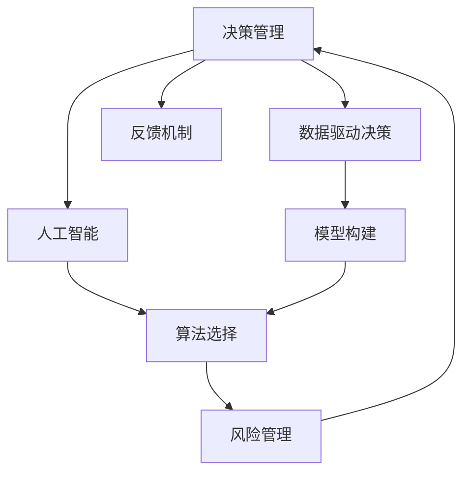

                 

# 决策管理：提高关键决策的质量

> 关键词：决策管理, 优化决策, 风险管理, 模型选择, 算法选择, 反馈机制, 人工智能应用

## 1. 背景介绍

在快速变化的市场环境中，面对复杂的业务挑战，企业需要制定高质量的决策来确保竞争优势。传统的决策制定往往依赖于经验、直觉和局部信息，难以应对快速变化的市场环境。随着人工智能和大数据技术的发展，通过科学方法和算法优化决策过程成为可能。

### 1.1 问题由来
企业在日常运营中需要面对各式各样的决策，从产品开发、营销策略、供应链管理到风险控制等，每一个决策都直接关系到企业的发展方向和收益。然而，由于信息不对称、复杂性高、依赖经验等因素，传统的决策制定方式效率低、风险高。

随着数据科学和人工智能技术的普及，数据驱动的决策管理成为了一种新的趋势。通过对数据的全面分析、模型构建和算法优化，决策过程可以变得更加科学、高效、风险可控。

### 1.2 问题核心关键点
决策管理的关键在于：
1. 数据收集与处理：如何高效、准确地获取和处理相关数据。
2. 模型选择与构建：选择合适的人工智能模型，并根据数据特点进行构建。
3. 算法优化与调整：优化算法的参数，选择合适的算法进行决策。
4. 反馈机制与迭代：通过反馈机制不断调整和优化决策模型。
5. 风险管理与控制：评估决策风险，制定相应的风险管理策略。

这些关键点构成了一个完整的决策管理系统，帮助企业制定出高质量的决策。

## 2. 核心概念与联系

### 2.1 核心概念概述

为更好地理解决策管理的原理和方法，本节将介绍几个密切相关的核心概念：

- 决策管理(Decision Making)：企业在日常运营中面临的各种决策制定过程，包括战略决策、战术决策和操作决策。
- 数据驱动决策(Data-Driven Decision Making)：基于数据的分析、处理和建模，科学地制定决策的过程。
- 人工智能(AI)：包括机器学习、深度学习、自然语言处理、计算机视觉等技术，通过算法和模型辅助决策。
- 模型构建(Model Building)：根据决策问题选择合适的模型，并使用数据进行训练和验证。
- 算法选择(Algorithm Selection)：在数据和问题特点的基础上，选择最适合的算法进行模型构建。
- 风险管理(Risk Management)：通过评估决策风险，制定相应的风险控制措施。
- 反馈机制(Feedback Mechanism)：在决策实施后，通过结果反馈调整模型和算法。

这些核心概念之间的逻辑关系可以通过以下Mermaid流程图来展示：



这个流程图展示了决策管理的主要流程：

1. 企业面临各种决策。
2. 通过数据驱动决策，科学地分析问题和数据。
3. 使用人工智能技术，选择合适的模型和算法进行构建。
4. 在构建模型时，通过评估决策风险，制定相应的控制措施。
5. 在模型构建和实施过程中，不断通过反馈机制调整和优化。

## 3. 核心算法原理 & 具体操作步骤

### 3.1 算法原理概述

决策管理的核心算法主要基于机器学习、深度学习和优化算法，通过数据驱动的方法进行决策优化。其核心思想是：

1. 数据预处理与特征工程：获取、清洗和处理相关数据，提取有用的特征。
2. 模型选择与训练：根据问题类型和数据特点，选择合适的模型，并通过数据进行训练。
3. 算法优化与调参：通过交叉验证、网格搜索等方法，优化模型参数，提升模型性能。
4. 模型评估与选择：通过评估指标，选择性能最佳的模型进行决策。
5. 风险评估与控制：通过风险分析，制定相应的风险管理策略。

决策管理的目标是通过科学的算法和模型，提高决策的准确性和效率，降低风险。

### 3.2 算法步骤详解

决策管理的算法步骤主要包括：

1. **数据收集与预处理**：
    - 从各个渠道获取相关的原始数据。
    - 对数据进行清洗、去重、缺失值填充等预处理操作。
    - 对数据进行特征工程，提取有用的特征变量。

2. **模型选择与构建**：
    - 根据问题类型和数据特点，选择合适的模型，如回归模型、分类模型、聚类模型等。
    - 使用数据集对模型进行训练和验证，选择性能最佳的模型。

3. **算法优化与调参**：
    - 通过交叉验证等方法，评估模型性能，选择最优的算法参数。
    - 使用网格搜索、贝叶斯优化等方法，优化模型参数，提升模型性能。

4. **模型评估与选择**：
    - 使用测试集对模型进行评估，计算各种评估指标，如准确率、召回率、F1值等。
    - 根据评估结果，选择性能最佳的模型进行决策。

5. **风险评估与控制**：
    - 通过统计分析和模拟实验，评估模型的风险。
    - 根据风险评估结果，制定相应的风险控制措施，如设置阈值、备份策略等。

6. **反馈机制与迭代**：
    - 在模型应用过程中，收集反馈数据，不断调整和优化模型。
    - 通过不断迭代，逐步提升模型的性能和决策质量。

### 3.3 算法优缺点

决策管理的算法优点包括：
1. 数据驱动：基于数据的分析，科学地制定决策，减少主观偏差。
2. 模型优化：通过算法优化，选择性能最佳的模型，提升决策质量。
3. 风险控制：通过风险评估，制定相应的控制措施，降低决策风险。
4. 反馈机制：通过反馈机制不断调整和优化模型，提升决策的准确性和及时性。

缺点包括：
1. 数据质量要求高：决策管理的准确性依赖于高质量的数据，数据质量差可能导致决策失误。
2. 算法复杂度高：模型选择和算法优化需要较高的技术门槛，对技术团队的要求较高。
3. 实施成本高：数据处理、模型构建和优化等步骤需要投入大量的人力、时间和资金。
4. 模型解释性差：某些复杂的模型难以解释其决策过程，影响决策的可解释性和可信度。

尽管存在这些局限性，但决策管理方法在大规模、高风险、复杂决策场景中，具有明显的优势和潜力。

### 3.4 算法应用领域

决策管理算法在以下领域得到了广泛应用：

1. **金融风险管理**：通过数据分析和风险评估，制定相应的风险管理策略，降低金融风险。
2. **市场营销**：通过客户分析和大数据分析，制定科学的营销策略，提升市场竞争力。
3. **供应链管理**：通过供应链数据分析，优化供应链管理，降低成本，提高效率。
4. **产品开发**：通过用户需求分析，制定科学的产品开发策略，提升产品竞争力。
5. **人力资源管理**：通过员工数据分析，制定科学的招聘、培训和绩效管理策略，提升人力资源管理水平。

## 4. 数学模型和公式 & 详细讲解 & 举例说明

### 4.1 数学模型构建

决策管理的数学模型主要基于机器学习、深度学习和优化算法。常见的模型包括回归模型、分类模型、聚类模型等。以下以线性回归模型为例，介绍其数学模型的构建过程。

线性回归模型的一般形式为：

$$
y = \beta_0 + \beta_1 x_1 + \beta_2 x_2 + \ldots + \beta_n x_n + \epsilon
$$

其中，$y$ 为因变量，$x_1, x_2, \ldots, x_n$ 为自变量，$\beta_0, \beta_1, \beta_2, \ldots, \beta_n$ 为回归系数，$\epsilon$ 为随机误差项。

线性回归的目标是最小化预测值与真实值之间的平方误差：

$$
\min \sum_{i=1}^n (y_i - \hat{y}_i)^2
$$

其中，$\hat{y}_i$ 为第 $i$ 个样本的预测值，$y_i$ 为真实值。

### 4.2 公式推导过程

线性回归的公式推导主要基于最小二乘法，具体步骤如下：

1. 求解回归系数 $\beta_0, \beta_1, \beta_2, \ldots, \beta_n$：

$$
\min \sum_{i=1}^n (y_i - \hat{y}_i)^2
$$

对每个 $\beta_j$ 求偏导数，得：

$$
\frac{\partial \sum_{i=1}^n (y_i - \hat{y}_i)^2}{\partial \beta_j} = -2\sum_{i=1}^n x_{ij}(y_i - \hat{y}_i)
$$

2. 将导数设置为0，解方程组：

$$
\begin{cases}
\sum_{i=1}^n x_{i1}(y_i - \hat{y}_i) = 0 \\
\sum_{i=1}^n x_{i2}(y_i - \hat{y}_i) = 0 \\
\ldots \\
\sum_{i=1}^n x_{in}(y_i - \hat{y}_i) = 0
\end{cases}
$$

3. 解得回归系数 $\beta_0, \beta_1, \beta_2, \ldots, \beta_n$：

$$
\beta_j = \frac{\sum_{i=1}^n x_{ij}(y_i - \bar{y})}{\sum_{i=1}^n x_{ij}^2 - \sum_{i=1}^n x_{ij}x_{ik} / n}
$$

其中，$\bar{y}$ 为样本的均值。

### 4.3 案例分析与讲解

假设有一家电商平台，想预测客户的购买行为，使用线性回归模型进行建模。

1. **数据收集与预处理**：
    - 收集客户的年龄、性别、收入、购买历史等数据。
    - 对数据进行清洗、去重、缺失值填充等预处理操作。
    - 提取有用的特征变量，如年龄、性别、收入等。

2. **模型选择与构建**：
    - 选择线性回归模型进行预测，使用训练集进行模型训练。
    - 对模型进行验证，选择性能最佳的模型。

3. **算法优化与调参**：
    - 使用交叉验证等方法，评估模型性能，选择最优的算法参数。
    - 使用网格搜索、贝叶斯优化等方法，优化模型参数，提升模型性能。

4. **模型评估与选择**：
    - 使用测试集对模型进行评估，计算各种评估指标，如准确率、召回率、F1值等。
    - 根据评估结果，选择性能最佳的模型进行决策。

5. **风险评估与控制**：
    - 通过统计分析和模拟实验，评估模型的风险。
    - 根据风险评估结果，制定相应的风险控制措施，如设置阈值、备份策略等。

6. **反馈机制与迭代**：
    - 在模型应用过程中，收集反馈数据，不断调整和优化模型。
    - 通过不断迭代，逐步提升模型的性能和决策质量。

## 5. 项目实践：代码实例和详细解释说明

### 5.1 开发环境搭建

在进行决策管理项目实践前，我们需要准备好开发环境。以下是使用Python进行Scikit-learn开发的开发环境配置流程：

1. 安装Anaconda：从官网下载并安装Anaconda，用于创建独立的Python环境。

2. 创建并激活虚拟环境：
```bash
conda create -n decision-env python=3.8 
conda activate decision-env
```

3. 安装Scikit-learn：
```bash
pip install scikit-learn
```

4. 安装各类工具包：
```bash
pip install numpy pandas matplotlib seaborn scikit-learn matplotlib
```

完成上述步骤后，即可在`decision-env`环境中开始决策管理项目的开发。

### 5.2 源代码详细实现

下面我们以线性回归模型为例，给出使用Scikit-learn对决策管理项目进行开发的PyTorch代码实现。

首先，定义数据集：

```python
import numpy as np
from sklearn.datasets import make_regression
from sklearn.model_selection import train_test_split
from sklearn.linear_model import LinearRegression

X, y = make_regression(n_samples=1000, n_features=5, noise=0.1, random_state=42)
X_train, X_test, y_train, y_test = train_test_split(X, y, test_size=0.2, random_state=42)
```

然后，定义模型和优化器：

```python
model = LinearRegression()
optimizer = SGD(model.parameters(), lr=0.01)
```

接着，定义训练和评估函数：

```python
def train_epoch(model, X_train, y_train, optimizer, batch_size):
    model.train()
    for i in range(0, X_train.shape[0], batch_size):
        optimizer.zero_grad()
        inputs = X_train[i:i+batch_size].numpy()
        targets = y_train[i:i+batch_size].numpy()
        outputs = model(inputs)
        loss = criterion(outputs, targets)
        loss.backward()
        optimizer.step()
    return loss.item()

def evaluate(model, X_test, y_test):
    model.eval()
    with torch.no_grad():
        inputs = X_test.numpy()
        targets = y_test.numpy()
        outputs = model(inputs)
        loss = criterion(outputs, targets)
    return loss.item()

criterion = nn.MSELoss()
batch_size = 64
epochs = 100
```

最后，启动训练流程并在测试集上评估：

```python
for epoch in range(epochs):
    loss = train_epoch(model, X_train, y_train, optimizer, batch_size)
    print(f'Epoch {epoch+1}, Loss: {loss:.3f}')

    test_loss = evaluate(model, X_test, y_test)
    print(f'Test Loss: {test_loss:.3f}')
```

以上就是使用Scikit-learn对线性回归模型进行决策管理项目开发的完整代码实现。可以看到，Scikit-learn提供了简单易用的API，可以快速搭建和训练决策管理模型。

### 5.3 代码解读与分析

让我们再详细解读一下关键代码的实现细节：

**数据生成**：
- 使用`make_regression`函数生成1000个样本，特征数为5，噪声为0.1。
- 将数据分为训练集和测试集，比例为8:2。

**模型定义**：
- 定义线性回归模型，使用随机梯度下降算法进行优化。
- 设置学习率为0.01，批量大小为64。

**训练和评估函数**：
- `train_epoch`函数：在训练集上迭代更新模型参数。
- `evaluate`函数：在测试集上评估模型性能。
- `criterion`函数：定义均方误差损失函数。

**训练流程**：
- 循环迭代训练次数。
- 在每个epoch中，计算损失并更新模型参数。
- 在测试集上评估模型性能。

可以看到，Scikit-learn的API简洁易用，能够快速实现决策管理模型的开发和训练。在实际项目中，还需要结合业务需求，对模型进行进一步的优化和调参。

## 6. 实际应用场景

### 6.1 金融风险管理

金融风险管理是决策管理的重要应用场景。银行和金融机构需要制定科学的信贷风险评估模型，以防止不良贷款和金融欺诈。

1. **数据收集与预处理**：
    - 收集客户的个人基本信息、财务状况、信用记录等数据。
    - 对数据进行清洗、去重、缺失值填充等预处理操作。
    - 提取有用的特征变量，如收入、负债比例、信用评分等。

2. **模型选择与构建**：
    - 选择逻辑回归、决策树、随机森林等模型进行风险评估。
    - 使用历史贷款数据进行模型训练和验证。

3. **算法优化与调参**：
    - 使用交叉验证等方法，评估模型性能，选择最优的算法参数。
    - 使用网格搜索、贝叶斯优化等方法，优化模型参数，提升模型性能。

4. **模型评估与选择**：
    - 使用测试集对模型进行评估，计算各种评估指标，如准确率、召回率、F1值等。
    - 根据评估结果，选择性能最佳的模型进行决策。

5. **风险评估与控制**：
    - 通过统计分析和模拟实验，评估模型的风险。
    - 根据风险评估结果，制定相应的风险控制措施，如设置贷款额度、设定违约阈值等。

6. **反馈机制与迭代**：
    - 在模型应用过程中，收集反馈数据，不断调整和优化模型。
    - 通过不断迭代，逐步提升模型的性能和决策质量。

### 6.2 市场营销

市场营销需要制定科学的客户分析和市场预测模型，以制定有效的营销策略，提升市场竞争力。

1. **数据收集与预处理**：
    - 收集客户的年龄、性别、收入、购买历史等数据。
    - 对数据进行清洗、去重、缺失值填充等预处理操作。
    - 提取有用的特征变量，如年龄、性别、收入等。

2. **模型选择与构建**：
    - 选择回归模型、分类模型、聚类模型等进行市场分析和预测。
    - 使用历史销售数据进行模型训练和验证。

3. **算法优化与调参**：
    - 使用交叉验证等方法，评估模型性能，选择最优的算法参数。
    - 使用网格搜索、贝叶斯优化等方法，优化模型参数，提升模型性能。

4. **模型评估与选择**：
    - 使用测试集对模型进行评估，计算各种评估指标，如准确率、召回率、F1值等。
    - 根据评估结果，选择性能最佳的模型进行决策。

5. **风险评估与控制**：
    - 通过统计分析和模拟实验，评估模型的风险。
    - 根据风险评估结果，制定相应的风险控制措施，如设置预算、调整营销策略等。

6. **反馈机制与迭代**：
    - 在模型应用过程中，收集反馈数据，不断调整和优化模型。
    - 通过不断迭代，逐步提升模型的性能和决策质量。

## 7. 工具和资源推荐

### 7.1 学习资源推荐

为了帮助开发者系统掌握决策管理的理论基础和实践技巧，这里推荐一些优质的学习资源：

1. 《机器学习》课程：斯坦福大学开设的著名课程，介绍了机器学习的基本概念和算法。
2. 《深度学习》课程：吴恩达教授的Coursera课程，系统介绍了深度学习的基本理论和实践。
3. 《Python机器学习》书籍：结合Python编程语言，详细介绍了机器学习和深度学习的基本算法和实践。
4. 《数据分析实战》书籍：深入浅出地介绍了数据收集、处理、分析和可视化的实用技巧。
5. 《数据分析与Python编程》在线课程：通过Python编程语言，介绍了数据分析的基本方法和实践。

通过对这些资源的学习实践，相信你一定能够快速掌握决策管理的精髓，并用于解决实际的决策问题。

### 7.2 开发工具推荐

高效的开发离不开优秀的工具支持。以下是几款用于决策管理开发的常用工具：

1. Python：简单易用的编程语言，提供了丰富的第三方库和工具。
2. Scikit-learn：提供了简单易用的API，支持多种机器学习算法和模型构建。
3. TensorFlow：由Google主导开发的深度学习框架，支持大规模模型训练和优化。
4. PyTorch：由Facebook开发的深度学习框架，提供了动态计算图和灵活的模型构建能力。
5. Jupyter Notebook：交互式的编程环境，支持实时可视化，方便开发和调试。

合理利用这些工具，可以显著提升决策管理任务的开发效率，加快创新迭代的步伐。

### 7.3 相关论文推荐

决策管理的研究源于学界的持续研究。以下是几篇奠基性的相关论文，推荐阅读：

1. 《机器学习：算法与应用》：阐述了机器学习的基本理论和算法，覆盖了决策管理的基础。
2. 《深度学习：理论与实践》：系统介绍了深度学习的基本理论和实践，为决策管理提供了技术支持。
3. 《大数据与决策分析》：介绍了大数据分析的基本方法和实践，为决策管理提供了数据支持。
4. 《优化算法与应用》：系统介绍了优化算法的基本理论和实践，为决策管理提供了算法支持。
5. 《数据分析与决策》：介绍了数据分析的基本方法和实践，为决策管理提供了理论支持。

这些论文代表了大数据和人工智能技术的发展脉络。通过学习这些前沿成果，可以帮助研究者把握学科前进方向，激发更多的创新灵感。

## 8. 总结：未来发展趋势与挑战

### 8.1 总结

本文对决策管理的核心算法和操作步骤进行了全面系统的介绍。首先阐述了决策管理的理论基础和实践意义，明确了决策管理在提高决策质量和效率方面的独特价值。其次，从原理到实践，详细讲解了决策管理的主要步骤，给出了决策管理项目的完整代码实现。同时，本文还广泛探讨了决策管理在金融风险管理、市场营销等诸多行业领域的应用前景，展示了决策管理范式的巨大潜力。此外，本文精选了决策管理的各类学习资源，力求为读者提供全方位的技术指引。

通过本文的系统梳理，可以看到，决策管理算法在大规模、高风险、复杂决策场景中，具有明显的优势和潜力。这些方向的探索发展，必将进一步提升决策管理算法的性能和应用范围，为企业的决策制定提供更加科学、高效、风险可控的支持。

### 8.2 未来发展趋势

展望未来，决策管理技术将呈现以下几个发展趋势：

1. **数据驱动决策**：随着大数据和人工智能技术的进一步发展，数据驱动决策将成为一种主流方法，帮助企业制定更加科学、高效的决策。
2. **模型多样化**：除了传统的机器学习模型外，未来的决策管理将更多地引入深度学习、强化学习等新兴技术，提升决策的智能化水平。
3. **算法优化**：未来的决策管理将更加注重算法的优化，通过高效的算法实现快速的模型训练和参数调优。
4. **多模态融合**：未来的决策管理将更多地引入多模态数据，如文本、图像、视频等，提升决策的全面性和准确性。
5. **实时决策**：未来的决策管理将更多地引入实时数据流和实时算法，提升决策的及时性和动态性。
6. **跨领域应用**：未来的决策管理将更多地引入跨领域的知识，如专家知识、规则库等，提升决策的全面性和合理性。

这些趋势将推动决策管理技术不断进步，为企业的决策制定提供更加科学、高效、智能的支持。

### 8.3 面临的挑战

尽管决策管理技术已经取得了显著进展，但在实际应用中也面临一些挑战：

1. **数据质量问题**：数据的质量直接影响决策的准确性，数据缺失、噪声、错误等问题需要加以解决。
2. **算法复杂性**：决策管理的算法较为复杂，对技术团队的要求较高，需要投入大量的时间和精力进行模型构建和优化。
3. **模型可解释性**：复杂的决策模型难以解释其决策过程，影响决策的可信度和接受度。
4. **隐私和伦理问题**：决策模型涉及大量敏感数据，需要采取相应的隐私保护和伦理约束措施。
5. **计算资源限制**：大规模模型的训练和优化需要大量的计算资源，对企业的计算能力提出较高要求。
6. **模型更新与迭代**：决策模型需要根据业务变化不断更新和迭代，以保证其有效性和适应性。

这些挑战需要企业在技术、资源、伦理等方面进行全面的考虑和应对。

### 8.4 研究展望

面对决策管理技术面临的挑战，未来的研究需要在以下几个方面寻求新的突破：

1. **数据治理与质量控制**：建立数据治理机制，提升数据质量和可靠性，保证决策的准确性。
2. **算法可解释性**：引入可解释性算法，提升决策的可信度和接受度，增加模型的透明度。
3. **隐私保护与伦理约束**：制定隐私保护和伦理约束标准，保障数据安全和用户权益。
4. **模型自动化**：引入自动化算法和工具，简化模型构建和优化过程，提升效率和准确性。
5. **跨领域知识融合**：引入跨领域的知识库、规则库等，提升决策的全面性和合理性。
6. **实时决策支持**：引入实时数据流和实时算法，提升决策的及时性和动态性。

这些研究方向的探索，必将引领决策管理技术迈向更高的台阶，为企业的决策制定提供更加科学、高效、智能的支持。面向未来，决策管理技术还需要与其他人工智能技术进行更深入的融合，如知识表示、因果推理、强化学习等，多路径协同发力，共同推动决策管理系统的进步。

## 9. 附录：常见问题与解答

**Q1：决策管理是否适用于所有业务场景？**

A: 决策管理在大多数业务场景中都能得到应用，特别是那些需要数据分析和模型优化的场景。但对于一些特殊场景，如实时决策、低延迟要求等，决策管理需要结合具体情况进行优化。

**Q2：如何选择合适的决策模型？**

A: 选择决策模型需要根据业务问题和数据特点进行综合评估。常见的方法包括：
1. 模型效果评估：使用各种评估指标（如准确率、召回率、F1值等）评估模型性能。
2. 数据分布分析：分析数据分布，选择适合分布的模型。
3. 模型可解释性：选择易于解释的模型，便于理解和调整。
4. 资源限制：考虑模型的计算资源限制，选择适合的模型规模和参数量。

**Q3：如何提高决策模型的可解释性？**

A: 提高决策模型的可解释性可以通过以下方法：
1. 选择可解释性强的模型，如线性回归、决策树等。
2. 引入可解释性算法，如LIME、SHAP等，对模型的预测过程进行解释。
3. 采用可视化工具，对模型的关键特征和决策过程进行可视化展示。
4. 增加业务知识，提升模型解释的合理性和可信度。

**Q4：如何处理决策模型的数据质量问题？**

A: 处理决策模型的数据质量问题需要从数据收集、清洗、预处理等多个环节进行综合治理：
1. 数据收集：选择合适的数据源，获取高质量的数据。
2. 数据清洗：对数据进行清洗、去重、缺失值填充等预处理操作，去除噪声和错误数据。
3. 数据整合：整合多源数据，提升数据质量和全面性。
4. 数据验证：通过模拟实验和验证数据，评估数据质量，进行必要的修正和处理。

**Q5：如何应对决策模型的计算资源限制？**

A: 应对决策模型的计算资源限制可以通过以下方法：
1. 模型压缩：使用模型压缩技术，减小模型规模和参数量。
2. 分布式计算：使用分布式计算框架，如Spark、Hadoop等，进行模型训练和推理。
3. 云计算：使用云计算平台，如AWS、Azure等，获取强大的计算资源。
4. 资源优化：优化算法和模型，降低计算复杂度，提升计算效率。

这些方法可以帮助企业在计算资源有限的情况下，实现高效、准确的决策模型构建和应用。

---

作者：禅与计算机程序设计艺术 / Zen and the Art of Computer Programming

