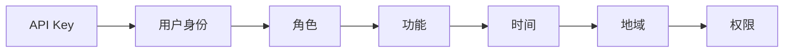

                 

# 分级 API Key 的实现细节

## 1. 背景介绍

随着API服务的广泛应用，越来越多的开发者开始构建自己的API平台，以便提供数据共享、业务协同等功能。但API的开放性和易用性也带来了新的问题：滥用、攻击、数据泄露等风险不断增加。为了控制API的使用，保障API平台的安全，分级API Key（分级访问密钥）应运而生。分级API Key将API的使用权限按照角色、功能、时间、地域等多个维度进行细粒度的划分，使得API平台的管理更加精细化、安全化。

本博客将详细探讨分级API Key的设计思路、实现细节、应用场景和优化策略，并给出实际代码示例，帮助你全面理解如何构建一个高效、安全、易于扩展的分级API Key系统。

## 2. 核心概念与联系

### 2.1 核心概念概述

要理解分级API Key的设计与实现，首先需要明确以下几个关键概念：

- **API Key**：用于认证和授权用户访问API的字符串，通常与用户身份绑定。
- **角色(Role)**：定义用户或应用在API平台中的访问权限。
- **功能(Function)**：细化API的具体功能点，如查询、更新、删除等。
- **时间(Time)**：限制API使用的时间范围，如某时间段内只允许访问。
- **地域(Locality)**：限制API访问的地域范围，如仅允许特定IP地址访问。

这些概念通过组合，可以形成细粒度的API使用权限，确保API平台的灵活管理和安全防护。

### 2.2 核心概念原理和架构的 Mermaid 流程图



这个流程图示意了分级API Key的基本架构：

1. **API Key** 用于身份认证。
2. **用户身份** 通过API Key映射到**角色**。
3. **角色** 对应着具体的**功能**、**时间**和**地域**，从而形成细粒度的**权限**。
4. **权限** 指导API平台如何处理用户请求。

## 3. 核心算法原理 & 具体操作步骤

### 3.1 算法原理概述

分级API Key的设计和实现，本质上是一个权限管理系统的构建过程。其核心思想是通过逻辑运算和策略组合，根据不同的用户身份、时间、地域等因素，动态生成API访问权限。具体实现时，可以采用基于规则或基于角色的访问控制技术，实现对API请求的细粒度控制。

### 3.2 算法步骤详解

分级API Key的实现通常包括以下几个关键步骤：

**Step 1: 设计权限规则**

1. **定义权限粒度**：明确API的粒度，如查询、更新、删除等。
2. **设定权限策略**：基于用户角色、时间、地域等因素，定义不同粒度的权限策略。

**Step 2: 实现权限判断**

1. **请求截获**：在API接口处拦截所有请求，进行权限校验。
2. **权限验证**：根据API Key、时间戳、IP地址等参数，判断用户是否有访问权限。
3. **结果返回**：根据权限判断结果，返回请求成功或失败的信息。

**Step 3: 记录和审计**

1. **日志记录**：记录API调用的详细信息，包括API Key、请求时间、请求IP等。
2. **审计分析**：定期对日志进行分析，排查异常访问，优化权限设置。

### 3.3 算法优缺点

分级API Key系统的优点包括：

1. **细粒度控制**：能够根据不同的角色、功能、时间、地域等因素，灵活设置API访问权限，提高API平台的安全性和灵活性。
2. **易于扩展**：权限规则的灵活设计，使得系统可以方便地应对新场景和新需求。
3. **自动化管理**：基于规则的权限验证，可以减少人工干预，提升系统自动化水平。

然而，分级API Key也存在一些缺点：

1. **复杂性高**：权限规则的设计和维护较为复杂，需要开发和运维人员具备一定的安全意识和技术能力。
2. **性能开销**：对每个请求进行权限校验，可能导致系统性能下降。
3. **规则冲突**：多个权限规则可能存在冲突，需要合理设计，避免权限判断混乱。

### 3.4 算法应用领域

分级API Key的应用领域非常广泛，包括但不限于：

- **Web API**：为Web开发提供细粒度的API权限控制。
- **移动应用**：为移动应用提供安全、灵活的API访问方案。
- **企业内部API**：为企业内部系统提供精细化的API使用权限。
- **云服务API**：为云服务提供灵活、安全的API访问策略。

## 4. 数学模型和公式 & 详细讲解 & 举例说明

### 4.1 数学模型构建

分级API Key的实现，可以通过布尔代数和逻辑表达式来构建数学模型。设用户U的API Key为K，角色R为R，功能F为F，时间T为T，地域L为L。假设权限P由布尔表达式p组成：

$$
P = K \land R \land F \land T \land L
$$

其中：

- $\land$ 表示逻辑与运算，表示所有条件都满足。
- $K$、$R$、$F$、$T$、$L$ 表示用户身份、角色、功能、时间和地域。

### 4.2 公式推导过程

在实际应用中，为了简化权限规则的表示，常常将权限规则分解为多个部分，并使用逻辑运算符组合。例如，假设用户U在时间T内，只能从地域L1和L2访问API。可以表示为：

$$
P = K \land (R_1 \lor R_2) \land F \land T \land L_1 \land L_2
$$

其中：

- $R_1$ 和 $R_2$ 表示两个角色，用户可以通过任一角色访问。
- $\lor$ 表示逻辑或运算，表示用户可以通过任一角色访问。

### 4.3 案例分析与讲解

假设一个API平台，需要为管理员、开发人员和普通用户分别设置访问权限。管理员可以访问所有API，开发人员只能访问查询API，普通用户只能访问查询API，且仅限于工作日。可以定义如下权限规则：

- **管理员(ADMIN)**：
  - **功能(F)**：所有API
  - **时间(T)**：无限制
  - **地域(L)**：无限制

- **开发人员(DEVELOPER)**：
  - **功能(F)**：查询API
  - **时间(T)**：无限制
  - **地域(L)**：无限制

- **普通用户(NORMAL)**：
  - **功能(F)**：查询API
  - **时间(T)**：仅限于工作日
  - **地域(L)**：无限制

使用上述规则，可以定义如下权限表达式：

- **管理员**：
  - $P_{ADMIN} = K_{ADMIN} \land R_{ADMIN} \land T_{ADMIN} \land L_{ADMIN}$
  - $R_{ADMIN} = true$，$T_{ADMIN} = true$，$L_{ADMIN} = true$

- **开发人员**：
  - $P_{DEVELOPER} = K_{DEVELOPER} \land R_{DEVELOPER} \land F_{DEVELOPER} \land T_{DEVELOPER} \land L_{DEVELOPER}$
  - $R_{DEVELOPER} = true$，$F_{DEVELOPER} = true$，$T_{DEVELOPER} = true$，$L_{DEVELOPER} = true$

- **普通用户**：
  - $P_{NORMAL} = K_{NORMAL} \land R_{NORMAL} \land F_{NORMAL} \land T_{NORMAL} \land L_{NORMAL}$
  - $R_{NORMAL} = true$，$F_{NORMAL} = true$，$T_{NORMAL} = true$，$L_{NORMAL} = true$

在实际应用中，可以根据用户提交的API Key，使用上述规则进行权限验证，从而决定是否允许访问。

## 5. 项目实践：代码实例和详细解释说明

### 5.1 开发环境搭建

为了构建分级API Key系统，需要安装和配置相应的开发环境。以下是使用Python和Flask框架搭建环境的步骤：

1. **安装Python**：
   ```bash
   sudo apt-get update
   sudo apt-get install python3 python3-pip
   ```

2. **安装Flask**：
   ```bash
   pip install flask
   ```

3. **创建Flask应用**：
   ```python
   from flask import Flask, request, jsonify

   app = Flask(__name__)

   # 权限验证函数
   def validate_api_key(api_key, roles, functions, times, locality):
       # 实现权限验证的逻辑，这里只是一个示例
       return True

   # 定义API接口
   @app.route('/api/v1/endpoint', methods=['GET'])
   def endpoint():
       api_key = request.args.get('api_key')
       roles = request.args.get('roles')
       functions = request.args.get('functions')
       times = request.args.get('times')
       locality = request.args.get('locality')

       if validate_api_key(api_key, roles, functions, times, locality):
           return jsonify({'status': 'success'})
       else:
           return jsonify({'status': 'error', 'message': 'Access denied'})

   if __name__ == '__main__':
       app.run(host='0.0.0.0', port=5000)
   ```

### 5.2 源代码详细实现

上述代码实现了分级API Key系统的基本功能。以下是对代码的详细解释：

- **Flask应用初始化**：使用Flask框架创建HTTP服务器，并设置监听地址和端口。
- **权限验证函数**：实现权限验证的逻辑，这里只是一个示例。在实际应用中，需要根据具体的权限规则进行验证。
- **API接口定义**：定义API接口，接收API Key、角色、功能、时间和地域等参数，并调用权限验证函数进行验证。
- **响应处理**：根据权限验证结果，返回请求成功或失败的信息。

### 5.3 代码解读与分析

**Flask框架**：
- **路由定义**：使用`@app.route`定义API接口的路由，`methods`参数指定了支持的HTTP方法。
- **请求参数解析**：使用`request.args`获取请求参数。

**权限验证函数**：
- **参数接收**：接收API Key、角色、功能、时间和地域等参数。
- **权限判断**：根据参数进行权限验证，这里只是一个示例。在实际应用中，需要根据具体的权限规则进行判断。

**API接口定义**：
- **请求处理**：接收请求参数，并调用权限验证函数进行验证。
- **响应处理**：根据权限验证结果，返回请求成功或失败的信息。

### 5.4 运行结果展示

假设请求参数为：

- **api_key**：admin
- **roles**：admin
- **functions**：all
- **times**：无限制
- **locality**：无限制

则请求会被允许访问，返回如下JSON数据：

```json
{
    "status": "success"
}
```

如果请求参数不符合权限规则，则返回如下JSON数据：

```json
{
    "status": "error",
    "message": "Access denied"
}
```

## 6. 实际应用场景

分级API Key系统可以应用于多种场景，以下是几个典型案例：

### 6.1 企业内部API管理

企业内部系统通常需要共享数据和功能，但不同部门、不同角色对API的访问权限要求不同。分级API Key系统可以为企业内部API提供细粒度的权限控制，确保数据安全。

### 6.2 Web应用安全

Web应用通常会提供各种API接口，供第三方开发者调用。分级API Key系统可以为Web应用提供安全的API访问控制，防止恶意攻击和滥用。

### 6.3 云服务安全

云服务提供商需要为不同用户、不同应用提供细粒度的API访问控制，确保云服务的安全性。分级API Key系统可以满足云服务的安全需求。

## 7. 工具和资源推荐

### 7.1 学习资源推荐

为了帮助开发者掌握分级API Key的设计与实现，以下是一些推荐的资源：

1. **Flask官方文档**：Flask框架的官方文档，详细介绍了Flask的使用方法和API接口开发。
2. **权限管理博客**：如《权限管理实战》，介绍了权限管理的基本原理和实践经验。
3. **安全编程书籍**：如《Web安全技术与实践》，介绍了Web应用安全的基本概念和最佳实践。

### 7.2 开发工具推荐

以下是一些常用的开发工具，可以帮助开发者构建分级API Key系统：

1. **Flask框架**：轻量级的Web开发框架，易于学习和使用。
2. **PostgreSQL**：关系型数据库，适合存储权限规则和日志信息。
3. **Jwt**：用于生成和验证JSON Web Tokens，方便API Key的传输和验证。

### 7.3 相关论文推荐

分级API Key的设计和实现涉及到多个领域，以下是一些相关论文的推荐：

1. **《基于角色的访问控制模型》**：介绍基于角色的访问控制模型的基本原理和实现方法。
2. **《基于上下文的访问控制》**：介绍基于上下文的访问控制方法，适用于动态环境下的权限管理。
3. **《安全API设计》**：介绍API设计和开发的几个关键安全问题，包括API Key的管理和验证。

## 8. 总结：未来发展趋势与挑战

### 8.1 总结

分级API Key系统的设计与实现，是构建安全、灵活、可扩展API平台的重要基础。通过细粒度的权限控制，可以大大提升API平台的安全性和灵活性。本文详细介绍了分级API Key的设计思路、实现细节和应用场景，并通过代码实例展示了其实现过程。

### 8.2 未来发展趋势

展望未来，分级API Key系统将呈现以下几个发展趋势：

1. **智能权限管理**：引入机器学习和智能算法，动态调整权限规则，提升系统的自动化水平。
2. **分布式权限管理**：通过分布式系统，实现权限管理的负载均衡和高可用性。
3. **多级权限管理**：引入多级权限体系，细化权限粒度，满足更多场景的需求。
4. **API Key加密**：对API Key进行加密处理，提升系统的安全性。

### 8.3 面临的挑战

尽管分级API Key系统在API安全管理中发挥了重要作用，但也面临一些挑战：

1. **权限规则复杂性**：随着权限规则的增加，系统的复杂性将不断提升，需要合理设计权限体系。
2. **性能开销**：对每个请求进行权限校验，可能导致系统性能下降，需要优化权限校验算法。
3. **权限规则冲突**：多个权限规则可能存在冲突，需要合理设计，避免权限判断混乱。

### 8.4 研究展望

未来，分级API Key系统的研究需要关注以下几个方向：

1. **权限规则优化**：优化权限规则设计，减少权限规则的冲突，提升系统的可维护性。
2. **权限管理自动化**：引入自动化工具，简化权限管理的复杂度，提升系统效率。
3. **权限监控与审计**：引入监控和审计工具，实时监测权限使用情况，及时发现异常。

## 9. 附录：常见问题与解答

**Q1：分级API Key与API Key有什么区别？**

A: 分级API Key是一种细粒度的权限管理方式，将API Key按照角色、功能、时间、地域等多个维度进行细化，使得API平台的管理更加精细化、安全化。而API Key只是用于认证和授权用户访问API的字符串。

**Q2：如何设计合理的权限规则？**

A: 设计合理的权限规则需要考虑以下几个因素：

1. **最小权限原则**：为每个用户或应用分配最小权限，避免权限滥用。
2. **权限粒度细化**：将权限细化为功能、时间、地域等多个维度，确保权限管理灵活性和安全性。
3. **规则冲突避免**：避免多个权限规则之间的冲突，确保权限判断的准确性。

**Q3：分级API Key系统如何保证性能？**

A: 分级API Key系统的性能优化可以从以下几个方面入手：

1. **缓存机制**：对权限验证结果进行缓存，减少重复计算。
2. **并发处理**：使用并发处理机制，提升API接口的响应速度。
3. **权限预判**：引入权限预判机制，减少权限校验的次数。

**Q4：分级API Key系统如何实现高可用性？**

A: 分级API Key系统的高可用性可以通过以下几个措施实现：

1. **负载均衡**：使用负载均衡机制，将请求分散到多个服务器上处理。
2. **冗余设计**：设计冗余系统，确保系统在高负载情况下的稳定性。
3. **故障转移**：引入故障转移机制，确保系统在故障情况下能够快速恢复。

---

作者：禅与计算机程序设计艺术 / Zen and the Art of Computer Programming

