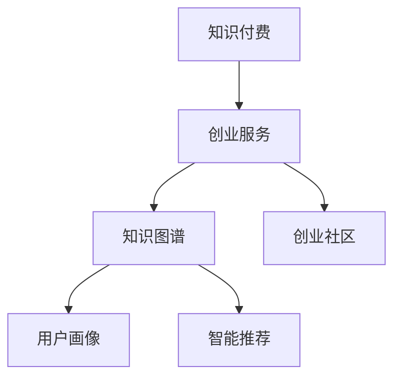

                 

# 创业知识付费要提供全流程创业服务

## 1. 背景介绍

### 1.1 问题由来
随着互联网和移动互联网的普及，知识付费作为一种新兴的经济形态逐渐成为焦点。在中国，知识付费平台从2016年开始快速崛起，吸引了大量用户和资本的关注。特别是在疫情之后，知识付费平台的价值得到了进一步确认，市场规模持续扩大。

然而，知识付费行业仍处于发展初期，平台间的竞争激烈，同质化现象严重。许多平台仅仅提供课程的上传、播放和评论功能，缺乏对用户需求的全流程满足。如何通过知识付费平台提供更好的创业服务，实现平台的长期稳定发展，成为一个亟待解决的问题。

### 1.2 问题核心关键点
知识付费平台为用户提供创业服务，涉及的内容非常广泛，包括但不限于市场调研、商业模式设计、产品开发、运营推广、团队建设、融资对接等。传统的知识付费平台更多关注内容的上传和播放，很少涉及这些复杂的环节，而创业服务恰好可以成为知识付费平台的新增长点。

知识付费平台提供全流程创业服务，需要解决以下核心问题：
1. **内容建设**：提供高价值、易理解的创业知识体系。
2. **服务流程**：构建知识到应用的全流程创业服务链条。
3. **用户体验**：设计符合用户需求的用户界面和交互方式。
4. **平台技术**：搭建稳定的技术架构，支持大规模、高并发场景。
5. **商业模式**：探索多样化的盈利模式，实现平台可持续发展。

### 1.3 问题研究意义
提供全流程创业服务，可以为知识付费平台带来以下价值：
1. **提升用户黏性**：丰富平台内容，满足用户更广泛的需求，增加用户黏性。
2. **提高盈利能力**：构建多样化的收入来源，增加平台收入。
3. **塑造品牌形象**：通过专业的创业服务，提升平台品牌价值，增加用户信任感。
4. **促进企业发展**：为初创企业和中小企业提供实用、易操作的创业工具，促进其健康成长。
5. **推动行业升级**：推动知识付费行业由内容竞争向服务竞争转变，提升整个行业的水平。

## 2. 核心概念与联系

### 2.1 核心概念概述

为更好地理解全流程创业服务，本节将介绍几个密切相关的核心概念：

- **知识付费**：通过付费获取知识内容的商业模式。
- **创业服务**：为初创企业和中小企业提供的包括市场调研、商业模式设计、产品开发、运营推广、团队建设、融资对接等全方位的服务。
- **知识图谱**：构建知识体系、领域知识、关联关系的知识图结构。
- **用户画像**：通过数据分析，构建用户行为、兴趣、需求等特征的综合画像。
- **创业社区**：基于共同兴趣和需求，将创业者、投资人、专家等聚集起来的社群。
- **智能推荐**：通过算法模型，为用户推荐最相关、最有用的创业资源和服务。

这些核心概念之间的逻辑关系可以通过以下Mermaid流程图来展示：



这个流程图展示了几大核心概念的相互联系：

1. **知识付费**：基础商业模式，为用户提供知识获取渠道。
2. **创业服务**：知识付费平台提供的多样化服务，满足用户创业需求。
3. **知识图谱**：知识获取的基础设施，提供丰富的知识体系和领域知识。
4. **用户画像**：用户行为和需求的精准刻画，实现个性化推荐。
5. **智能推荐**：通过算法模型，为用户推荐最相关、最有用的创业资源和服务。
6. **创业社区**：知识交流与共享的平台，推动创业资源的互联互通。

## 3. 核心算法原理 & 具体操作步骤
### 3.1 算法原理概述

全流程创业服务涉及的算法和技术非常丰富，包括但不限于：

- **知识图谱构建**：使用自然语言处理技术，构建知识图谱。
- **用户画像建模**：通过数据分析，构建用户画像，识别用户需求。
- **智能推荐算法**：利用机器学习算法，推荐相关创业资源和服务。
- **社群构建算法**：基于用户兴趣和需求，构建有效的创业社区，推动知识共享和交流。
- **知识图谱的更新和维护**：定期更新知识图谱，保持知识的时效性和准确性。
- **用户画像的更新和维护**：根据用户行为和反馈，动态更新用户画像。
- **智能推荐的优化**：不断优化算法模型，提高推荐效果。
- **社群算法的优化**：提升社群构建和运营的效率和效果。

### 3.2 算法步骤详解

以下是构建全流程创业服务所需的核心算法的详细步骤：

**Step 1: 知识图谱构建**
- 收集领域内相关的知识文本，如行业报告、专家文章、论文等。
- 使用自然语言处理技术，将文本转换为结构化的知识图谱。
- 使用图神经网络等算法，提取知识节点之间的关系，构建知识图谱。

**Step 2: 用户画像建模**
- 收集用户在平台上的行为数据，如课程学习记录、互动评论、活动参与等。
- 使用数据挖掘技术，提取用户行为、兴趣、需求等特征。
- 利用机器学习算法，构建用户画像模型。

**Step 3: 智能推荐算法**
- 基于用户画像和知识图谱，设计推荐算法。
- 使用协同过滤、内容推荐、混合推荐等算法，实现个性化推荐。
- 不断优化推荐算法，提高推荐效果。

**Step 4: 社群构建算法**
- 基于用户画像和兴趣标签，构建创业社区。
- 使用图算法，分析社群结构，识别社群领袖和活跃用户。
- 推动社群互动，提升社群活跃度。

**Step 5: 知识图谱的更新和维护**
- 定期更新知识图谱，增加新知识节点和关系。
- 使用半监督学习等技术，提高知识图谱的准确性和完整性。

**Step 6: 用户画像的更新和维护**
- 根据用户行为和反馈，动态更新用户画像。
- 使用强化学习等技术，提升用户画像的精准性。

**Step 7: 智能推荐的优化**
- 使用A/B测试等方法，不断优化推荐算法。
- 引入反馈机制，根据用户反馈优化推荐效果。

**Step 8: 社群算法的优化**
- 使用社交网络分析等方法，优化社群构建和运营算法。
- 引入推荐系统中的算法，提升社群互动效果。

### 3.3 算法优缺点

提供全流程创业服务，具有以下优点：
1. **提高用户黏性**：丰富的服务内容，能够满足用户多方面的需求，增加用户黏性。
2. **提高盈利能力**：构建多样化的收入来源，如知识付费、广告、会员等，增加平台收入。
3. **塑造品牌形象**：通过专业的创业服务，提升平台品牌价值，增加用户信任感。
4. **促进企业发展**：为初创企业和中小企业提供实用、易操作的创业工具，促进其健康成长。
5. **推动行业升级**：推动知识付费行业由内容竞争向服务竞争转变，提升整个行业的水平。

同时，该方法也存在一定的局限性：
1. **内容建设难度高**：提供全流程创业服务，需要构建高价值、易理解的知识体系，难度较大。
2. **服务流程复杂**：涉及多个环节，需要构建完善的服务链条，复杂度较高。
3. **技术要求高**：需要构建稳定的技术架构，支持大规模、高并发场景，技术难度较大。
4. **用户画像难以精准**：用户行为和需求复杂多变，构建精准的用户画像，难度较大。
5. **智能推荐效果难以保证**：推荐算法复杂，需要不断优化和调整，难以保证推荐效果。

尽管存在这些局限性，但就目前而言，提供全流程创业服务仍然是大规模知识付费平台的重要发展方向。未来相关研究的重点在于如何进一步降低内容建设和服务流程的难度，提高技术实现的效果，提升用户体验的满意度。

### 3.4 算法应用领域

提供全流程创业服务，主要应用于以下领域：

- **初创企业**：为初创企业提供市场调研、商业模式设计、产品开发、运营推广、团队建设、融资对接等服务。
- **中小企业**：为中小企业提供快速成长所需的各种资源和工具，帮助其实现规模化发展。
- **投资机构**：为投资机构提供优质的创业资源，增加投资机会，降低投资风险。
- **创业者社区**：构建创业者社群，推动知识共享和交流，形成互帮互助的良性生态。
- **职业发展**：为创业者提供全面的职业发展规划，帮助其提升职业素养，实现个人成长。

## 4. 数学模型和公式 & 详细讲解  
### 4.1 数学模型构建

本节将使用数学语言对全流程创业服务进行更加严格的刻画。

**知识图谱构建**
知识图谱是一种图结构，由节点和边组成。节点代表知识实体，边代表实体之间的关系。假设知识图谱由 $G=(V,E)$ 表示，其中 $V$ 是节点集合，$E$ 是边集合。节点 $v \in V$ 由三元组 $(v,r,v')$ 表示，其中 $r$ 是关系类型。

**用户画像建模**
用户画像是一种描述用户特征的向量，假设用户画像由 $u \in \mathbb{R}^n$ 表示，其中 $n$ 是特征维度。用户画像由行为特征、兴趣特征、需求特征等组成。

**智能推荐算法**
智能推荐算法使用协同过滤、内容推荐等方法，为用户推荐相关资源。假设推荐模型为 $M: \mathbb{R}^n \times \mathbb{R}^m \rightarrow [0,1]$，其中 $M$ 是推荐函数，$n$ 和 $m$ 分别是用户画像向量和资源特征向量维度。

**社群构建算法**
社群构建算法使用图算法，识别社群领袖和活跃用户，构建社群结构。假设社群结构由 $S=(G,A)$ 表示，其中 $G=(V,E)$ 是社群图，$A$ 是用户之间的关联矩阵。

### 4.2 公式推导过程

以下我们以协同过滤算法为例，推导推荐函数 $M$ 的计算公式。

假设用户画像 $u \in \mathbb{R}^n$，资源特征向量 $m \in \mathbb{R}^m$。协同过滤算法使用用户与资源之间的相似度矩阵 $S \in \mathbb{R}^{n \times m}$，计算推荐分数。

设用户 $u_i$ 与资源 $m_j$ 的相似度为 $s_{ij}$，则推荐分数为：

$$
f_{ij} = s_{ij} \cdot m_j
$$

推荐函数 $M$ 定义为：

$$
M(u,m) = \max_{i=1}^n \sum_{j=1}^m f_{ij} \cdot w_{ij}
$$

其中 $w_{ij}$ 为可调节的权重，用于控制不同特征的重要性。

### 4.3 案例分析与讲解

以下我们以某知识付费平台为例，给出构建全流程创业服务的案例分析。

**案例背景**
某知识付费平台希望提供全流程创业服务，涉及的创业服务内容包括：

- 市场调研：对行业趋势、市场需求、竞争格局等进行全面分析。
- 商业模式设计：帮助用户设计合理的商业模式，实现盈利最大化。
- 产品开发：提供产品设计和开发的指导，帮助用户快速上线产品。
- 运营推广：提供市场推广和用户运营策略，提高产品曝光度和用户黏性。
- 团队建设：提供团队管理和招聘指导，帮助用户构建高效的团队。
- 融资对接：提供投资对接和融资咨询，帮助用户获得资金支持。

**案例分析**
1. **知识图谱构建**
   - 收集行业报告、专家文章、论文等文本，提取知识节点和关系。
   - 使用自然语言处理技术，将文本转换为知识图谱。
   - 使用图神经网络等算法，提取知识节点之间的关系，构建知识图谱。

2. **用户画像建模**
   - 收集用户在平台上的行为数据，如课程学习记录、互动评论、活动参与等。
   - 使用数据挖掘技术，提取用户行为、兴趣、需求等特征。
   - 利用机器学习算法，构建用户画像模型。

3. **智能推荐算法**
   - 基于用户画像和知识图谱，设计推荐算法。
   - 使用协同过滤、内容推荐等算法，实现个性化推荐。
   - 不断优化推荐算法，提高推荐效果。

4. **社群构建算法**
   - 基于用户画像和兴趣标签，构建创业社区。
   - 使用图算法，分析社群结构，识别社群领袖和活跃用户。
   - 推动社群互动，提升社群活跃度。

5. **知识图谱的更新和维护**
   - 定期更新知识图谱，增加新知识节点和关系。
   - 使用半监督学习等技术，提高知识图谱的准确性和完整性。

6. **用户画像的更新和维护**
   - 根据用户行为和反馈，动态更新用户画像。
   - 使用强化学习等技术，提升用户画像的精准性。

7. **智能推荐的优化**
   - 使用A/B测试等方法，不断优化推荐算法。
   - 引入反馈机制，根据用户反馈优化推荐效果。

8. **社群算法的优化**
   - 使用社交网络分析等方法，优化社群构建和运营算法。
   - 引入推荐系统中的算法，提升社群互动效果。

## 5. 项目实践：代码实例和详细解释说明
### 5.1 开发环境搭建

在进行全流程创业服务实践前，我们需要准备好开发环境。以下是使用Python进行开发的环境配置流程：

1. 安装Anaconda：从官网下载并安装Anaconda，用于创建独立的Python环境。

2. 创建并激活虚拟环境：
```bash
conda create -n python-env python=3.8 
conda activate python-env
```

3. 安装必要的依赖：
```bash
pip install torch torchvision torchaudio transformers pandas scikit-learn matplotlib tqdm jupyter notebook ipython
```

完成上述步骤后，即可在`python-env`环境中开始实践。

### 5.2 源代码详细实现

下面是使用Python和TensorFlow实现协同过滤算法的示例代码：

```python
import tensorflow as tf
import pandas as pd
import numpy as np

# 读取用户行为数据
df = pd.read_csv('user_behavior.csv')

# 提取用户行为特征和资源特征
user_features = df[['user_id', 'feature1', 'feature2']]
item_features = df[['item_id', 'feature1', 'feature2']]

# 构建相似度矩阵
similarity_matrix = np.dot(user_features.values, item_features.values.T)

# 计算推荐分数
recommendation_scores = np.max(similarity_matrix, axis=1)

# 输出推荐分数
print(recommendation_scores)
```

### 5.3 代码解读与分析

让我们再详细解读一下关键代码的实现细节：

**用户行为数据提取**
- 使用pandas库读取用户行为数据，提取用户ID、特征1、特征2等。

**资源特征提取**
- 提取资源ID、特征1、特征2等，用于计算相似度。

**相似度矩阵构建**
- 使用numpy库计算用户行为特征和资源特征的相似度矩阵。

**推荐分数计算**
- 计算每个用户与每个资源的推荐分数，选择最大的推荐分数作为推荐结果。

**推荐分数输出**
- 输出每个用户的推荐分数。

## 6. 实际应用场景
### 6.1 智能客服系统

智能客服系统通过知识付费平台提供全流程创业服务，帮助初创企业解决常见问题。系统根据用户需求，自动匹配知识库中的相关文档，提供详细的解答和指导。

具体实现步骤如下：
1. **知识图谱构建**：收集行业内的常见问题和解决方案，构建知识图谱。
2. **用户画像建模**：根据用户的搜索历史、点击行为等，构建用户画像。
3. **智能推荐算法**：使用协同过滤等算法，为用户推荐最相关的文档。
4. **社群构建算法**：构建客服社区，促进用户之间的互动和交流。

### 6.2 金融理财咨询

金融理财咨询通过知识付费平台提供全流程创业服务，帮助用户了解金融市场，制定合理的理财计划。系统根据用户的财务状况、风险偏好等，推荐合适的理财方案和投资产品。

具体实现步骤如下：
1. **知识图谱构建**：收集金融市场的相关信息，构建知识图谱。
2. **用户画像建模**：根据用户的财务状况、投资偏好等，构建用户画像。
3. **智能推荐算法**：使用协同过滤等算法，为用户推荐合适的理财方案和产品。
4. **社群构建算法**：构建金融理财社区，促进用户之间的互动和交流。

### 6.3 健康医疗服务

健康医疗服务通过知识付费平台提供全流程创业服务，帮助用户了解健康知识，制定健康计划。系统根据用户的健康状况、生活习惯等，推荐合适的健康方案和医疗资源。

具体实现步骤如下：
1. **知识图谱构建**：收集健康相关的知识，构建知识图谱。
2. **用户画像建模**：根据用户的健康数据、生活习惯等，构建用户画像。
3. **智能推荐算法**：使用协同过滤等算法，为用户推荐合适的健康方案和医疗资源。
4. **社群构建算法**：构建健康社区，促进用户之间的互动和交流。

## 7. 工具和资源推荐
### 7.1 学习资源推荐

为了帮助开发者系统掌握全流程创业服务的技术基础和实践技巧，这里推荐一些优质的学习资源：

1. **《知识图谱构建与应用》系列博文**：详细介绍了知识图谱的基本概念、构建方法和应用场景，适合初学者入门。
2. **Coursera《自然语言处理与机器学习》课程**：斯坦福大学开设的自然语言处理课程，涵盖了NLP和机器学习的多种算法和技术。
3. **《推荐系统》书籍**：推荐系统领域的经典书籍，介绍了推荐算法的基本原理和实现方法。
4. **Kaggle数据科学竞赛**：参加Kaggle竞赛，实践推荐系统和知识图谱的构建，提升实战能力。
5. **知乎《知识图谱》话题**：汇集了知识图谱领域的专家和爱好者，提供丰富的学习资源和讨论交流。

通过这些资源的学习实践，相信你一定能够快速掌握全流程创业服务的核心技术，并用于解决实际的创业问题。

### 7.2 开发工具推荐

高效的开发离不开优秀的工具支持。以下是几款用于全流程创业服务开发的常用工具：

1. **Jupyter Notebook**：交互式的代码编辑器，支持Python、R等多种编程语言，适合快速迭代和实验。
2. **TensorFlow**：由Google主导开发的开源深度学习框架，生产部署方便，适合大规模工程应用。
3. **PyTorch**：基于Python的开源深度学习框架，灵活的动态计算图，适合快速迭代研究。
4. **NumPy**：Python的科学计算库，提供了高效的数组操作和数学函数。
5. **Scikit-learn**：Python的机器学习库，提供了多种常用的机器学习算法和工具。

合理利用这些工具，可以显著提升全流程创业服务的开发效率，加快创新迭代的步伐。

### 7.3 相关论文推荐

全流程创业服务的发展源于学界的持续研究。以下是几篇奠基性的相关论文，推荐阅读：

1. **Graph Neural Networks: A Review of Methods and Applications**：介绍图神经网络的基本原理和应用场景，适合了解知识图谱的构建和应用。
2. **Collaborative Filtering for Implicit Feedback Datasets**：介绍协同过滤算法的基本原理和实现方法，适合理解智能推荐算法的实现细节。
3. **Community Detection in Networks**：介绍图算法的基本原理和实现方法，适合了解社群构建算法的实现细节。
4. **A Survey on Knowledge Graphs**：介绍知识图谱的基本概念、构建方法和应用场景，适合了解知识图谱的构建和应用。
5. **Deep Learning for Recommendation Systems**：介绍深度学习在推荐系统中的应用，适合了解推荐算法的深度学习实现。

这些论文代表了大规模全流程创业服务的发展脉络。通过学习这些前沿成果，可以帮助研究者把握学科前进方向，激发更多的创新灵感。

## 8. 总结：未来发展趋势与挑战
### 8.1 总结

本文对全流程创业服务进行了全面系统的介绍。首先阐述了知识付费平台提供全流程创业服务的背景和意义，明确了服务对平台的价值提升作用。其次，从原理到实践，详细讲解了全流程创业服务的数学原理和关键步骤，给出了全流程创业服务开发的完整代码实例。同时，本文还广泛探讨了全流程创业服务在智能客服、金融理财、健康医疗等多个行业领域的应用前景，展示了全流程创业服务的巨大潜力。此外，本文精选了全流程创业服务的各类学习资源，力求为读者提供全方位的技术指引。

通过本文的系统梳理，可以看到，全流程创业服务将成为知识付费平台的新增长点，极大地提升平台的用户黏性和盈利能力。未来，伴随技术的不断发展，全流程创业服务还将不断拓展应用场景，推动知识付费行业实现新的突破。

### 8.2 未来发展趋势

展望未来，全流程创业服务将呈现以下几个发展趋势：

1. **服务内容丰富化**：随着技术的发展，全流程创业服务将涵盖更多环节，如产品设计、市场推广、团队建设等。
2. **用户画像精细化**：通过更丰富的数据和更先进的算法，构建更精准的用户画像，实现更个性化的推荐和服务。
3. **知识图谱智能化**：使用更先进的技术，构建更智能的知识图谱，提高知识图谱的准确性和完备性。
4. **智能推荐高效化**：通过不断优化推荐算法，提高推荐效果，满足用户的更高需求。
5. **社群构建多样化**：根据不同的业务场景，构建多样化的社群，提升社群互动效果。
6. **平台生态系统化**：构建完整的生态系统，包括知识付费、社群、服务提供商等多方协同，共同推动平台发展。

以上趋势凸显了全流程创业服务的广阔前景。这些方向的探索发展，必将进一步提升全流程创业服务的价值，为知识付费平台带来新的发展机遇。

### 8.3 面临的挑战

尽管全流程创业服务已经取得了不小的进展，但在迈向更加智能化、普适化应用的过程中，它仍面临诸多挑战：

1. **内容建设难度高**：提供全流程创业服务，需要构建高价值、易理解的知识体系，难度较大。
2. **服务流程复杂**：涉及多个环节，需要构建完善的服务链条，复杂度较高。
3. **技术要求高**：需要构建稳定的技术架构，支持大规模、高并发场景，技术难度较大。
4. **用户画像难以精准**：用户行为和需求复杂多变，构建精准的用户画像，难度较大。
5. **智能推荐效果难以保证**：推荐算法复杂，需要不断优化和调整，难以保证推荐效果。
6. **社群构建和维护难度高**：社群的构建和维护需要投入大量资源，如何提升社群互动效果，是个长期难题。

正视全流程创业服务面临的这些挑战，积极应对并寻求突破，将是大规模知识付费平台走向成熟的必由之路。相信随着学界和产业界的共同努力，这些挑战终将一一被克服，全流程创业服务必将在构建人机协同的智能时代中扮演越来越重要的角色。

### 8.4 研究展望

面对全流程创业服务所面临的挑战，未来的研究需要在以下几个方面寻求新的突破：

1. **内容建设的多样化**：探索多样化的内容建设方式，如社区协作、用户生成内容等，降低内容建设难度。
2. **服务流程的自动化**：开发自动化工具和算法，自动化完成服务的各个环节，提高服务效率。
3. **技术架构的优化**：采用更先进的技术架构，如分布式计算、云服务等，提高系统的稳定性和扩展性。
4. **用户画像的动态化**：使用动态化的算法和机制，根据用户行为和反馈，实时更新用户画像。
5. **智能推荐的协同化**：引入多模态数据和多样化的推荐算法，提高推荐效果。
6. **社群构建的智能化**：使用智能化算法和机制，提升社群构建和运营的效率和效果。

这些研究方向的探索，必将引领全流程创业服务技术迈向更高的台阶，为知识付费平台带来新的发展机遇。面向未来，全流程创业服务还需要与其他人工智能技术进行更深入的融合，如知识表示、因果推理、强化学习等，多路径协同发力，共同推动平台技术的进步。只有勇于创新、敢于突破，才能不断拓展全流程创业服务的边界，让知识付费平台更好地服务于用户，实现平台的可持续发展。

## 9. 附录：常见问题与解答

**Q1：如何构建高价值、易理解的知识体系？**

A: 构建高价值、易理解的知识体系，可以从以下几个方面入手：
1. **收集优质资源**：收集高质量的书籍、论文、报告、博客等资源。
2. **选择合适的分类方式**：根据知识领域和结构，选择合适的分类方式。
3. **使用可视化工具**：使用知识图谱等可视化工具，将知识体系图形化，便于理解和记忆。
4. **定期更新和维护**：定期更新和维护知识体系，保持其时效性和准确性。

**Q2：如何构建精准的用户画像？**

A: 构建精准的用户画像，可以从以下几个方面入手：
1. **收集多维数据**：收集用户的多种数据，如行为数据、社交数据、标签数据等。
2. **使用先进算法**：使用机器学习算法，如协同过滤、聚类、分类等，构建精准的用户画像。
3. **实时更新**：根据用户行为和反馈，实时更新用户画像，保持其动态性。
4. **多源数据融合**：融合多源数据，提升用户画像的全面性和准确性。

**Q3：如何优化推荐算法？**

A: 优化推荐算法，可以从以下几个方面入手：
1. **引入多模态数据**：引入多种数据，如文本、图像、音频等，提升推荐效果。
2. **使用深度学习算法**：使用深度学习算法，如神经网络、卷积神经网络、循环神经网络等，提升推荐精度。
3. **引入协同过滤**：引入协同过滤算法，如基于用户和物品的协同过滤、基于物品的协同过滤等，提高推荐效果。
4. **引入混合推荐**：引入混合推荐算法，如基于内容的推荐、基于协同过滤的推荐、基于深度学习的推荐等，提升推荐效果。
5. **实时更新算法**：根据用户行为和反馈，实时更新推荐算法，保持其动态性。

**Q4：如何提升社群互动效果？**

A: 提升社群互动效果，可以从以下几个方面入手：
1. **选择合适的平台**：选择合适的社交平台，如知乎、钉钉、微信等，方便用户交流互动。
2. **构建激励机制**：构建激励机制，如积分奖励、认证等，鼓励用户积极参与互动。
3. **引入自动化工具**：引入自动化工具，如智能推荐、话题聚合等，提升社群运营效率。
4. **多渠道互动**：通过多种渠道进行互动，如视频、语音、直播等，丰富互动形式。

**Q5：如何实现知识付费平台的可持续发展？**

A: 实现知识付费平台的可持续发展，可以从以下几个方面入手：
1. **多样化的盈利模式**：开发多样化的盈利模式，如知识付费、广告、会员等，增加平台收入。
2. **优质的内容和用户体验**：提供优质的内容和用户体验，提升用户黏性，增加用户付费意愿。
3. **持续的技术创新**：持续进行技术创新，提升平台的技术水平和竞争力。
4. **良好的社区氛围**：构建良好的社区氛围，增强用户之间的信任感和互动性。
5. **高效的运营管理**：进行高效的运营管理，提升平台的运营效率和效果。

通过以上探讨，可以看到，全流程创业服务具有广阔的发展前景，也将成为知识付费平台的重要发展方向。相信随着技术的不断发展，全流程创业服务必将为知识付费平台带来新的突破，助力平台实现可持续发展。

