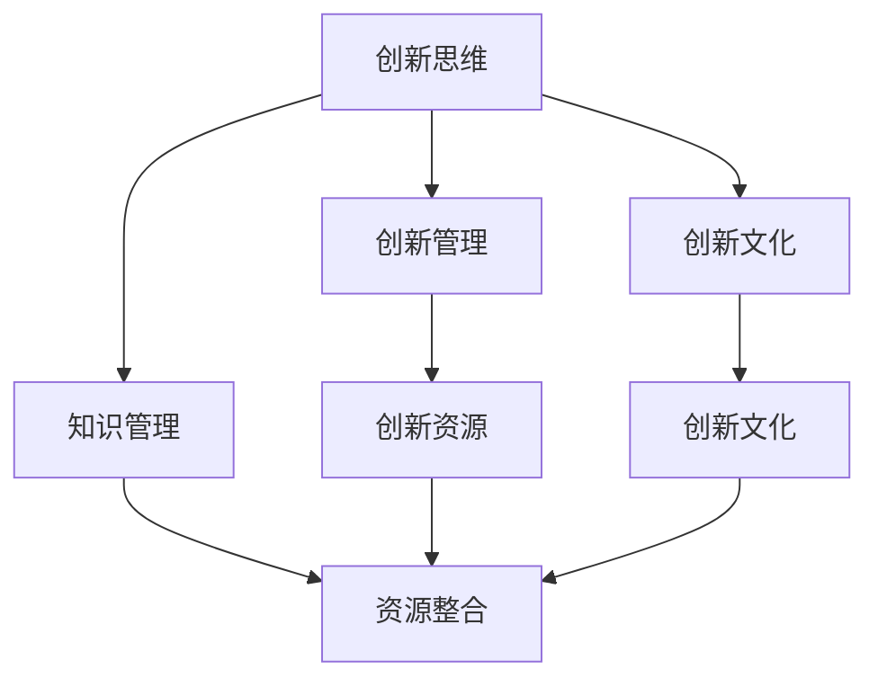

                 

## 1. 背景介绍

### 1.1 问题由来
在当今快速变化的商业环境中，企业面临诸多不确定性，如技术迭代加速、市场需求变化、法规政策调整等。持续创新成为企业保持竞争力的关键。然而，许多企业在创新管理方面存在挑战，如创新思维固化、资源投入不足、激励机制缺失等。本文旨在探讨如何通过系统化、科学化的创新管理，激发企业内部的创新活力，实现高质量的创新成果。

### 1.2 问题核心关键点
本节将明确创新管理面临的核心问题及其重要性：

- **创新思维固化**：许多企业在长期运营中，形成了固定的思维方式和业务模式，缺乏灵活性和创新意愿。
- **资源投入不足**：创新通常需要高额的研发投入和跨部门协作，而一些企业难以满足这些需求。
- **激励机制缺失**：缺乏有效的激励机制，导致员工在创新项目上的积极性不足。
- **创新成功率低**：许多创新项目未能转化为实际生产力，导致资源浪费。

通过系统化的创新管理，可以有效应对这些问题，提升企业的创新能力和竞争力。

## 2. 核心概念与联系

### 2.1 核心概念概述
- **创新管理**：指通过一系列策略和工具，系统化地推动企业内部的创新活动，以实现企业战略目标的过程。
- **创新思维**：指在创新过程中，采用新颖、创造性的方法和视角，解决复杂问题。
- **创新文化**：指在企业内部形成的支持创新、鼓励创新的文化氛围。
- **知识管理**：指对企业内部知识的收集、存储、共享和应用，以支持创新活动。
- **资源整合**：指通过跨部门协作和资源调配，支持创新项目所需的各类资源。

这些核心概念之间的逻辑关系可以通过以下Mermaid流程图来展示：



这个流程图展示了几者之间的关系：

1. 创新思维是创新管理的基础，推动知识管理和资源整合。
2. 创新文化是创新思维得以实现的土壤，培养员工的创新意识和行为。
3. 创新管理是创新活动的系统支撑，确保各项创新资源有效整合。

## 3. 核心算法原理 & 具体操作步骤
### 3.1 算法原理概述

创新管理涉及多个领域的知识和方法，包括创新心理学、管理学、组织行为学等。本文将重点探讨基于系统论和网络理论的创新管理算法，其核心思想是通过构建创新的网络结构和优化系统要素，推动企业的创新活动。

### 3.2 算法步骤详解

#### 3.2.1 数据收集与分析

1. **收集创新数据**：
   - **历史数据**：收集企业历史上的创新项目数据，包括项目名称、负责人、时间、预算、结果等。
   - **当前数据**：收集企业当前正在进行的创新项目数据，并进行实时跟踪。
   - **外部数据**：收集行业内的创新数据，包括技术趋势、竞争对手的创新活动等。

2. **数据预处理**：
   - **数据清洗**：去除重复和缺失数据，确保数据质量。
   - **数据标注**：对创新项目进行分类，如技术创新、产品创新、流程创新等。
   - **数据可视化**：使用图表、网络图等可视化工具，帮助理解创新项目的分布和进展。

#### 3.2.2 创新网络构建

1. **节点定义**：
   - **项目节点**：以创新项目为节点，记录其基本信息和进展。
   - **人员节点**：以创新团队成员为节点，记录其背景、技能和贡献。
   - **资源节点**：以所需资源为节点，记录其类型、可用性和分配情况。

2. **关系定义**：
   - **依赖关系**：记录创新项目之间的依赖关系，如前置项目、后续项目等。
   - **协作关系**：记录团队成员之间的协作关系，如共同负责的项目、知识分享等。
   - **资源关系**：记录创新项目与所需资源的关系，如预算、设备、信息等。

3. **网络构建**：
   - **邻接矩阵**：定义创新网络中的节点关系，构建邻接矩阵。
   - **图结构**：将邻接矩阵转换为图形结构，便于后续分析和优化。

#### 3.2.3 网络优化与分析

1. **网络中心性分析**：
   - **度中心性**：评估每个节点的连接数，识别关键项目和人员。
   - **接近中心性**：评估节点与其他节点之间的距离，识别信息传播中心。
   - **中介中心性**：评估节点在关系网络中的中介作用，识别关键连接点。

2. **网络效率分析**：
   - **网络效率**：评估创新网络的整体效率，如资源利用率、项目完成率等。
   - **路径分析**：评估项目之间的路径长度和频率，识别关键依赖关系。
   - **资源分配**：评估资源分配的合理性和有效性，识别资源瓶颈。

3. **网络优化策略**：
   - **节点优化**：调整关键项目和人员，提高其贡献度。
   - **边优化**：调整关键依赖关系，提高项目进展速度。
   - **网络扩展**：引入新的节点和边，扩大创新网络规模。

### 3.3 算法优缺点

#### 3.3.1 优点

1. **系统化**：通过构建创新网络，将创新活动视为系统化的过程，提高管理的规范性和可控性。
2. **科学化**：基于数据分析和网络理论，提供客观的创新管理依据，减少主观判断。
3. **动态化**：实时跟踪创新进展，及时调整网络结构和策略，保持创新活动的动态平衡。
4. **全局化**：综合考虑企业内部和外部因素，从全局视角优化创新资源配置。

#### 3.3.2 缺点

1. **数据依赖**：创新网络构建和分析需要大量数据支持，数据质量直接影响分析结果。
2. **复杂性**：构建和优化创新网络涉及多个维度，操作复杂度较高。
3. **技术门槛**：需要掌握数据分析和网络理论，对技术要求较高。
4. **适应性**：创新网络模型较为静态，难以应对快速变化的市场和技术环境。

### 3.4 算法应用领域

创新管理算法在多个领域具有广泛的应用前景，例如：

1. **技术研发**：构建研发项目网络，优化资源配置，提升研发效率。
2. **产品创新**：构建产品开发网络，优化流程设计，加速产品上市。
3. **流程优化**：构建流程改进网络，优化操作流程，降低运营成本。
4. **市场拓展**：构建市场推广网络，优化市场策略，扩大市场份额。
5. **风险管理**：构建风险评估网络，识别潜在风险，制定应对措施。

## 4. 数学模型和公式 & 详细讲解 & 举例说明

### 4.1 数学模型构建

本节将使用数学语言对基于系统论和网络理论的创新管理模型进行严格定义。

定义创新网络为 $G(V,E)$，其中 $V$ 为节点集合，$E$ 为边集合。每个节点 $v_i$ 表示一个创新项目或人员，每条边 $e_{ij}$ 表示两个节点之间的依赖或协作关系。

### 4.2 公式推导过程

#### 4.2.1 度中心性

- **公式**：
  $$
  DC(v_i) = \sum_{j=1}^{n} A_{ij}
  $$
  其中 $DC(v_i)$ 表示节点 $v_i$ 的度中心性，$A_{ij}$ 为邻接矩阵中的元素。

- **解释**：
  度中心性衡量节点与网络其他节点之间的连接数，表示节点在网络中的重要程度。

#### 4.2.2 接近中心性

- **公式**：
  $$
  CC(v_i) = \sum_{j=1}^{n} \frac{A_{ij}}{k_j}
  $$
  其中 $CC(v_i)$ 表示节点 $v_i$ 的接近中心性，$k_j$ 为节点 $j$ 的度数。

- **解释**：
  接近中心性衡量节点到其他节点的平均距离，表示节点在信息传播中的中心性。

#### 4.2.3 中介中心性

- **公式**：
  $$
  BC(v_i) = \sum_{j=1}^{n} \frac{\sigma_j(v_i)}{\delta_j(v_i)}
  $$
  其中 $BC(v_i)$ 表示节点 $v_i$ 的中介中心性，$\sigma_j(v_i)$ 为节点 $j$ 到节点 $v_i$ 的最短路径数，$\delta_j(v_i)$ 为节点 $j$ 到节点 $v_i$ 的直接路径数。

- **解释**：
  中介中心性衡量节点在关系网络中的中介作用，表示节点在信息传播中的重要性。

### 4.3 案例分析与讲解

假设某技术公司有三个研发项目 $P_1, P_2, P_3$，涉及团队成员 $A, B, C, D$，以及所需资源 $R_1, R_2$。构建如下创新网络：

```
P1 -> R1, R2
     ↓
P2 --- A --- B --- R1
         ↓
P3 --- C --- D --- R2
```

- **度中心性**：
  - $DC(P_1) = 2$
  - $DC(A) = 2$
  - $DC(B) = 2$
  - $DC(C) = 2$
  - $DC(D) = 2$

  - $DC(R_1) = 3$
  - $DC(R_2) = 2$

  - **结论**：$R_1$ 的度中心性最高，表示其是资源利用率最高的节点。

- **接近中心性**：
  - $CC(P_1) = \frac{2}{2} + \frac{1}{2} + \frac{1}{2} = 2$
  - $CC(P_2) = \frac{2}{3} + \frac{2}{3} + \frac{1}{3} = 2$
  - $CC(P_3) = \frac{2}{3} + \frac{2}{3} + \frac{1}{3} = 2$
  - $CC(A) = \frac{1}{2} + \frac{1}{2} = 1$
  - $CC(B) = \frac{1}{2} + \frac{1}{2} = 1$
  - $CC(C) = \frac{1}{2} + \frac{1}{2} = 1$
  - $CC(D) = \frac{1}{2} + \frac{1}{2} = 1$

  - **结论**：$P_1, P_2, P_3$ 的接近中心性最高，表示它们是信息传播的中心。

- **中介中心性**：
  - $BC(P_1) = \frac{2}{2} + \frac{1}{2} = 2$
  - $BC(P_2) = \frac{2}{2} = 1$
  - $BC(P_3) = \frac{2}{2} = 1$
  - $BC(A) = \frac{2}{3} = \frac{2}{3}$
  - $BC(B) = \frac{2}{3} = \frac{2}{3}$
  - $BC(C) = \frac{2}{3} = \frac{2}{3}$
  - $BC(D) = \frac{2}{3} = \frac{2}{3}$

  - **结论**：$P_1$ 的中介中心性最高，表示其是信息传播的关键点。

## 5. 项目实践：代码实例和详细解释说明

### 5.1 开发环境搭建

在进行创新管理项目开发前，我们需要准备好开发环境。以下是使用Python进行开发的环境配置流程：

1. 安装Anaconda：从官网下载并安装Anaconda，用于创建独立的Python环境。

2. 创建并激活虚拟环境：
```bash
conda create -n innovation-env python=3.8 
conda activate innovation-env
```

3. 安装相关库：
```bash
pip install networkx matplotlib pandas numpy
```

4. 安装绘图库：
```bash
pip install plotly
```

完成上述步骤后，即可在`innovation-env`环境中开始项目开发。

### 5.2 源代码详细实现

下面我们以技术研发为例，给出使用Python对创新网络进行构建和分析的代码实现。

首先，定义创新网络的数据结构：

```python
import networkx as nx

class InnovationNetwork:
    def __init__(self):
        self.G = nx.Graph()
        self.nodes = []
        self.edges = []
    
    def add_node(self, node):
        self.nodes.append(node)
        self.G.add_node(node)
    
    def add_edge(self, node1, node2, weight=1):
        self.edges.append((node1, node2, weight))
        self.G.add_edge(node1, node2, weight=weight)
    
    def get_node_degree(self, node):
        return self.G.degree(node)
    
    def get_node_closeness(self, node):
        return nx.closeness_centrality(self.G, node)
    
    def get_node_betwenness(self, node):
        return nx.betweenness_centrality(self.G, node)
```

然后，构建一个简单的创新网络并计算各节点的中心性：

```python
# 创建创新网络
innov = InnovationNetwork()

# 添加节点
innov.add_node('P1')
innov.add_node('P2')
innov.add_node('P3')
innov.add_node('A')
innov.add_node('B')
innov.add_node('C')
innov.add_node('D')
innov.add_node('R1')
innov.add_node('R2')

# 添加边
innov.add_edge('P1', 'R1', 1)
innov.add_edge('P1', 'R2', 1)
innov.add_edge('P2', 'A', 1)
innov.add_edge('P2', 'B', 1)
innov.add_edge('P3', 'C', 1)
innov.add_edge('P3', 'D', 1)
innov.add_edge('A', 'R1', 1)
innov.add_edge('B', 'R1', 1)
innov.add_edge('C', 'R2', 1)
innov.add_edge('D', 'R2', 1)

# 计算节点中心性
degree_centrality = [innov.get_node_degree(node) for node in innov.nodes]
closeness_centrality = [innov.get_node_closeness(node) for node in innov.nodes]
betwenness_centrality = [innov.get_node_betwenness(node) for node in innov.nodes]
```

最后，可视化计算结果：

```python
import matplotlib.pyplot as plt
import plotly.express as px

# 绘制度中心性图
degree_centrality_df = pd.DataFrame({'Node': innov.nodes, 'Degree Centrality': degree_centrality})
px.bar(degree_centrality_df, x='Node', y='Degree Centrality', title='Degree Centrality')

# 绘制接近中心性图
closeness_centrality_df = pd.DataFrame({'Node': innov.nodes, 'Closeness Centrality': closeness_centrality})
px.bar(closeness_centrality_df, x='Node', y='Closeness Centrality', title='Closeness Centrality')

# 绘制中介中心性图
betwenness_centrality_df = pd.DataFrame({'Node': innov.nodes, 'Betwenness Centrality': betwenness_centrality})
px.bar(betwenness_centrality_df, x='Node', y='Betwenness Centrality', title='Betwenness Centrality')
```

以上代码展示了如何使用Python构建和分析创新网络，并可视化计算结果。

### 5.3 代码解读与分析

让我们再详细解读一下关键代码的实现细节：

**InnovationNetwork类**：
- `__init__`方法：初始化创新网络。
- `add_node`方法：添加节点到网络中。
- `add_edge`方法：添加边到网络中，并记录边的权重。
- `get_node_degree`方法：获取节点的度中心性。
- `get_node_closeness`方法：获取节点的接近中心性。
- `get_node_betwenness`方法：获取节点的中介中心性。

**计算中心性**：
- 定义创新网络的基本节点和边关系。
- 计算各节点的度中心性、接近中心性和中介中心性。
- 使用matplotlib和plotly进行结果的可视化展示。

可以看到，Python语言配合网络分析库networkx，能够方便地实现创新网络的管理和分析。开发者可以根据具体需求，灵活调整节点和边的属性，探索更复杂的创新网络模型。

## 6. 实际应用场景

### 6.1 技术研发

技术研发是创新管理的重要应用场景之一。通过构建研发项目网络，优化资源配置，可以提升研发效率，加速创新成果的产出。

例如，某公司有三个研发项目 $P_1, P_2, P_3$，涉及多个团队成员和多种资源。通过构建研发项目网络，可以识别关键项目和人员，优化资源分配，避免资源浪费，提高研发成功率。

### 6.2 产品创新

产品创新过程中，项目节点包括市场需求分析、产品设计、原型开发、市场推广等。通过构建产品创新网络，可以优化流程设计，缩短产品上市时间，提升市场竞争力。

例如，某公司的新产品开发流程中，市场调研和产品设计之间存在依赖关系。通过网络优化，可以减少依赖路径，加速产品设计，提升市场响应速度。

### 6.3 流程优化

流程优化主要关注企业内部流程的改进，提高运营效率。通过构建流程优化网络，可以识别关键节点和瓶颈，优化操作流程，降低运营成本。

例如，某公司的生产线存在多个环节，通过网络分析，可以识别瓶颈环节，调整资源配置，提升生产效率。

### 6.4 未来应用展望

随着创新管理算法的发展，未来将在更多领域得到应用，为传统行业带来变革性影响。

在智慧医疗领域，创新管理可以帮助医疗机构优化资源配置，提升诊断和治疗水平。

在智能教育领域，创新管理可以优化课程设计和教学方法，提升教育质量。

在智慧城市治理中，创新管理可以优化城市管理流程，提高公共服务效率。

此外，在企业生产、社会治理、文娱传媒等众多领域，创新管理也将不断涌现，为社会进步注入新的动力。

## 7. 工具和资源推荐

### 7.1 学习资源推荐

为了帮助开发者系统掌握创新管理的理论基础和实践技巧，这里推荐一些优质的学习资源：

1. **《创新管理》一书**：详细介绍了创新管理的理论基础和实践方法，提供系统化的创新管理策略。
2. **《网络理论基础与应用》课程**：通过网络分析方法，探索创新网络的结构和属性，提供科学化的创新管理依据。
3. **《管理学》课程**：结合管理理论，深入探讨创新管理的实际应用，提供全面的管理视角。
4. **创新管理论坛**：汇集创新管理的最新研究成果，提供交流和学习的平台。
5. **创新管理案例库**：收集企业内部的创新管理案例，提供借鉴和参考。

通过对这些资源的学习实践，相信你一定能够快速掌握创新管理的精髓，并用于解决实际的创新问题。

### 7.2 开发工具推荐

高效的开发离不开优秀的工具支持。以下是几款用于创新管理开发的常用工具：

1. **Python编程语言**：简单易学，灵活高效，支持网络分析库networkx和可视化库matplotlib、plotly。
2. **Anaconda**：集成Python环境管理，支持虚拟环境创建和激活，便于项目开发和实验。
3. **Jupyter Notebook**：交互式编程环境，支持代码块的交互执行和结果展示，便于学习和实验。
4. **Microsoft Excel**：数据分析和可视化工具，支持复杂的图表和数据处理。

合理利用这些工具，可以显著提升创新管理任务的开发效率，加快创新管理的实施和优化。

### 7.3 相关论文推荐

创新管理算法的研究源于学界的持续探索。以下是几篇奠基性的相关论文，推荐阅读：

1. **《创新网络结构与性能分析》**：通过构建创新网络模型，研究网络结构对创新绩效的影响。
2. **《知识管理与创新绩效的关系研究》**：探讨知识管理在创新管理中的作用，以及知识共享对创新绩效的提升。
3. **《资源整合与创新管理的关系研究》**：分析资源整合对创新管理的影响，以及如何通过资源优化提升创新绩效。
4. **《技术创新网络的结构分析》**：通过网络分析方法，研究技术创新网络的结构和属性，提供科学化的创新管理依据。
5. **《创新管理与组织绩效的关系研究》**：探讨创新管理对组织绩效的影响，以及如何通过创新管理提升组织绩效。

这些论文代表了大创新管理的发展脉络。通过学习这些前沿成果，可以帮助研究者把握学科前进方向，激发更多的创新灵感。

## 8. 总结：未来发展趋势与挑战

### 8.1 总结

本文对基于系统论和网络理论的创新管理算法进行了全面系统的介绍。首先阐述了创新管理面临的核心问题及其重要性，明确了创新管理在企业运营中的关键作用。其次，从原理到实践，详细讲解了创新网络构建和优化的方法，给出了创新管理任务开发的完整代码实例。同时，本文还广泛探讨了创新管理算法在技术研发、产品创新、流程优化等多个行业领域的应用前景，展示了创新管理算法的广阔前景。此外，本文精选了创新管理技术的各类学习资源，力求为读者提供全方位的技术指引。

通过本文的系统梳理，可以看到，基于系统论和网络理论的创新管理算法能够有效推动企业内部的创新活动，提升企业的创新能力和竞争力。未来，伴随技术的不断进步，创新管理算法必将引领更多企业迈向更高的创新水平。

### 8.2 未来发展趋势

展望未来，创新管理算法将呈现以下几个发展趋势：

1. **自动化**：通过机器学习和智能算法，实现创新管理的自动化和智能化，减少人工干预，提高管理效率。
2. **实时化**：引入实时数据和信息流，实现创新管理过程的动态调整和优化，提升管理灵活性。
3. **跨领域化**：与其他学科和技术相结合，如心理学、社会学、大数据等，扩展创新管理的理论基础和应用范围。
4. **多目标化**：综合考虑创新绩效、资源效率、风险管理等多个目标，构建多目标优化模型，提升管理效果。
5. **开放化**：引入开放式创新理念，通过跨组织协作，实现创新资源的共享和优化，提升创新绩效。

以上趋势凸显了创新管理算法的广阔前景。这些方向的探索发展，必将进一步提升创新管理的科学性和实效性，为企业创新活动提供更强大的支持。

### 8.3 面临的挑战

尽管创新管理算法已经取得了一定进展，但在迈向更加智能化、普适化应用的过程中，它仍面临着诸多挑战：

1. **数据质量瓶颈**：创新管理算法依赖于高质量的数据，数据质量直接影响算法效果。如何获取和处理高质量的数据，是未来的重要研究方向。
2. **模型复杂性**：创新管理算法涉及多个维度的数据和指标，模型构建和优化过程较为复杂，如何简化模型，提高可操作性，是未来的关键问题。
3. **技术融合难度**：创新管理算法需要与其他技术相结合，如大数据、人工智能、区块链等，如何实现技术融合，是未来的技术难题。
4. **管理适应性**：创新管理算法需要适应不同规模和类型的企业，如何实现普适性，是未来的重要挑战。
5. **伦理和安全问题**：创新管理算法涉及敏感数据和决策，如何确保数据隐私和决策公正性，是未来的伦理和安全挑战。

正视创新管理算法面临的这些挑战，积极应对并寻求突破，将是大创新管理算法走向成熟的必由之路。相信随着学界和产业界的共同努力，这些挑战终将一一被克服，创新管理算法必将在构建创新驱动的企业中发挥重要作用。

### 8.4 研究展望

面对创新管理算法所面临的挑战，未来的研究需要在以下几个方面寻求新的突破：

1. **自动化工具的开发**：研发自动化和智能化的工具，提高创新管理的效率和准确性。
2. **实时数据处理技术**：探索实时数据处理技术，实现创新管理的动态优化。
3. **跨领域技术的融合**：与其他学科和技术相结合，探索创新管理的新方法和新应用。
4. **多目标优化算法**：研究多目标优化算法，提升创新管理的效果和实效性。
5. **伦理和安全保障**：建立伦理和安全保障机制，确保数据隐私和决策公正性。

这些研究方向的探索，必将引领创新管理算法迈向更高的台阶，为创新驱动的企业提供更加科学和可靠的管理支持。面向未来，创新管理算法还需要与其他人工智能技术进行更深入的融合，如知识表示、因果推理、强化学习等，共同推动创新管理的进步。只有勇于创新、敢于突破，才能不断拓展创新管理的边界，让创新管理算法更好地服务于企业和社会。

## 9. 附录：常见问题与解答

**Q1：创新管理算法的核心思想是什么？**

A: 创新管理算法的核心思想是通过构建创新网络，优化系统要素，推动企业内部的创新活动。具体来说，通过网络分析方法，评估节点（项目、人员、资源）的中心性，识别关键节点和瓶颈，优化资源配置，提升创新绩效。

**Q2：创新管理算法在实际应用中需要注意哪些问题？**

A: 创新管理算法在实际应用中需要注意以下几个问题：
1. **数据质量**：创新管理算法依赖于高质量的数据，数据质量直接影响算法效果。需要确保数据的准确性和完整性。
2. **模型复杂性**：创新管理算法涉及多个维度的数据和指标，模型构建和优化过程较为复杂，需要简化模型，提高可操作性。
3. **技术融合**：创新管理算法需要与其他技术相结合，如大数据、人工智能、区块链等，需要探索技术融合的新方法。
4. **管理适应性**：创新管理算法需要适应不同规模和类型的企业，需要研究普适性问题。
5. **伦理和安全**：创新管理算法涉及敏感数据和决策，需要确保数据隐私和决策公正性。

**Q3：如何提高创新管理算法的准确性和可靠性？**

A: 提高创新管理算法的准确性和可靠性，需要从以下几个方面入手：
1. **数据质量**：确保数据的准确性和完整性，减少数据噪声。
2. **模型优化**：不断优化模型，提高模型的解释性和鲁棒性。
3. **跨学科合作**：与其他学科和技术相结合，探索创新管理的新方法和新应用。
4. **实时调整**：引入实时数据和信息流，实现创新管理的动态调整和优化。
5. **伦理和安全保障**：建立伦理和安全保障机制，确保数据隐私和决策公正性。

这些措施将有助于提高创新管理算法的准确性和可靠性，推动创新管理算法的发展和应用。

---

作者：禅与计算机程序设计艺术 / Zen and the Art of Computer Programming

