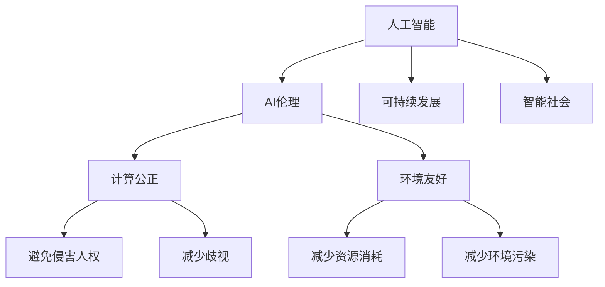

                 

# 创造更美好的世界：人类计算的终极目标

> 关键词：人类计算,人工智能,AI伦理,可持续发展,智能社会

## 1. 背景介绍

### 1.1 问题由来

在人类历史的长河中，计算技术一直是推动社会进步的重要力量。从早期的算盘和计算器，到如今的超级计算机和量子计算机，计算技术的每一次飞跃，都深刻地改变了人类的生产生活方式。随着人工智能技术的兴起，计算技术又迎来了新的历史纪元。

人工智能（AI）作为21世纪的革命性技术，正在以前所未有的速度渗透到社会的各个领域。从智能家居、智能交通，到智能医疗、智能教育，AI技术正以令人瞩目的速度，改变着人类的生产力和生活质量。然而，AI技术在带来便利的同时，也引发了一系列伦理、社会和环境问题。

如何在享受AI技术带来的便利的同时，保持人类计算的尊严与公正，实现可持续发展，构建智能社会，成为了当下人类计算的终极目标。本文将探讨这一目标的核心概念，以及如何通过AI伦理和可持续发展，实现这一目标。

### 1.2 问题核心关键点

实现人类计算的终极目标，需从以下几个核心关键点出发：

- **AI伦理**：确保AI技术的开发和使用符合人类社会的伦理规范，避免侵害人权、制造歧视。
- **可持续发展**：在追求效率的同时，注重环境、社会和经济的平衡，实现长期可持续的发展。
- **智能社会**：构建人人共享、人人平等的智能社会，通过AI技术解决社会问题，提升生活质量。

这些关键点相互交织，共同构成了人类计算的终极目标。通过理解和把握这些关键点，我们才能找到实现这一目标的路径。

## 2. 核心概念与联系

### 2.1 核心概念概述

为更好地理解人类计算的终极目标，本节将介绍几个密切相关的核心概念：

- **人工智能（AI）**：指由计算机系统执行的智能任务，包括感知、理解、推理、学习、规划等能力。
- **AI伦理**：涉及如何制定AI技术开发和应用中的伦理规范，确保AI行为符合人类价值和道德标准。
- **可持续发展**：指在满足当代需求的同时，不损害后代满足需求的能力，实现环境、社会和经济的平衡发展。
- **智能社会**：指通过AI技术实现信息共享、资源优化、社会公平等目标，构建人人共享、人人平等的社会。
- **计算公正**：指计算技术的应用应确保公平公正，避免加剧社会不平等。
- **环境友好**：指计算技术的应用应注重环境保护，减少资源消耗和环境污染。

这些核心概念之间的逻辑关系可以通过以下Mermaid流程图来展示：



这个流程图展示了一些核心概念及其之间的关系：

1. 人工智能是其他概念的基础，是实现人类计算目标的核心技术。
2. AI伦理、可持续发展、智能社会、计算公正和环境友好是人工智能应用过程中需要考虑的关键维度。
3. AI伦理确保人工智能行为符合人类价值和道德标准，计算公正避免加剧社会不平等，环境友好注重环境保护。
4. 这些概念共同构成了人类计算的终极目标，推动AI技术更好地造福人类社会。

## 3. 核心算法原理 & 具体操作步骤
### 3.1 算法原理概述

实现人类计算的终极目标，涉及多个算法和技术的协同工作。这些算法和技术包括但不限于：

- **AI伦理算法**：用于制定AI技术的伦理规范，确保AI行为符合人类价值和道德标准。
- **可持续发展算法**：用于评估AI技术对环境、社会和经济的影响，确保其可持续性。
- **智能社会算法**：用于构建人人共享、人人平等的智能社会，解决社会问题，提升生活质量。
- **计算公正算法**：用于确保AI技术的应用公平公正，避免加剧社会不平等。
- **环境友好算法**：用于优化AI技术的环境影响，减少资源消耗和环境污染。

这些算法和技术通过以下步骤实现：

**Step 1: 确定目标和指标**
- 明确实现人类计算终极目标的具体目标和评估指标，如提升生活质量、减少环境污染、促进社会公平等。

**Step 2: 制定伦理规范**
- 基于伦理规范，制定AI技术的开发和使用准则，确保AI行为符合人类价值和道德标准。

**Step 3: 实施可持续发展策略**
- 对AI技术进行环境、社会和经济影响评估，制定可持续发展策略，确保其对环境和社会的影响最小。

**Step 4: 构建智能社会**
- 应用AI技术解决社会问题，提升生活质量，构建人人共享、人人平等的智能社会。

**Step 5: 优化计算公正**
- 通过算法和技术手段，确保AI技术的应用公平公正，避免加剧社会不平等。

**Step 6: 减少环境污染**
- 优化AI技术的环境影响，减少资源消耗和环境污染。

### 3.2 算法步骤详解

以下将详细介绍每个步骤的具体操作：

**Step 1: 确定目标和指标**

目标和指标的确定是实现人类计算终极目标的第一步。需要明确目标是什么，如提升生活质量、减少环境污染、促进社会公平等。同时，需要制定评估指标，以便衡量目标实现的程度。例如，可以通过以下指标评估智能社会建设的成效：

- **生活质量**：通过问卷调查、数据分析等方式，评估AI技术对生活各方面的影响。
- **环境影响**：通过环境监测、资源消耗数据分析，评估AI技术的环保程度。
- **社会公平**：通过收入分配、就业率等数据，评估AI技术对社会公平的影响。

**Step 2: 制定伦理规范**

AI伦理是确保AI技术行为符合人类价值和道德标准的基石。伦理规范的制定需考虑以下几个方面：

- **隐私保护**：确保AI技术在数据处理过程中保护个人隐私。
- **决策透明**：确保AI决策过程透明，可解释。
- **责任归属**：明确AI决策的责任归属，避免责任不清带来的问题。
- **公正无歧视**：确保AI技术的应用无歧视，避免对某些群体产生负面影响。
- **安全可靠**：确保AI技术的安全性和可靠性，避免造成安全事故。

**Step 3: 实施可持续发展策略**

可持续发展策略的实施需从以下几个方面入手：

- **能源效率**：优化AI算法的能源消耗，减少计算过程中对能源的依赖。
- **资源利用**：优化AI技术的资源利用，减少对自然资源和能源的消耗。
- **环境影响**：减少AI技术的环境污染，保护自然生态。
- **社会责任**：确保AI技术的社会责任，促进社会和谐。

**Step 4: 构建智能社会**

构建智能社会需通过以下几个步骤：

- **信息共享**：通过AI技术实现信息共享，提升社会效率。
- **资源优化**：通过AI技术优化资源配置，提升社会福利。
- **社会公平**：通过AI技术促进社会公平，减少社会不平等。
- **社会治理**：通过AI技术提升社会治理能力，保障社会稳定。

**Step 5: 优化计算公正**

计算公正的优化需从以下几个方面入手：

- **数据公平**：确保数据集的多样性和代表性，避免数据偏见。
- **算法公平**：确保算法的公平性，避免算法偏见。
- **结果公平**：确保AI技术的应用结果公平，避免对某些群体产生负面影响。

**Step 6: 减少环境污染**

减少环境污染需通过以下几个步骤：

- **算法优化**：优化AI算法的能耗，减少计算过程中的资源消耗。
- **环境监测**：通过环境监测手段，评估AI技术的环境影响。
- **绿色计算**：推广绿色计算技术，减少计算过程中的环境污染。

### 3.3 算法优缺点

实现人类计算的终极目标，涉及多个算法和技术的协同工作。这些算法和技术具有以下优缺点：

**优点：**

- **效率高**：通过优化算法和技术，AI技术能够在短时间内解决复杂问题，提升社会效率。
- **精度高**：AI技术能够通过大量的数据训练，获得高精度的预测和决策。
- **可扩展性**：AI技术可应用于各个领域，具有较强的可扩展性。

**缺点：**

- **伦理问题**：AI技术在应用过程中，可能存在伦理问题，如隐私侵犯、决策不透明等。
- **依赖数据**：AI技术的应用依赖大量数据，数据的获取和处理成本较高。
- **资源消耗**：AI技术的计算和存储需求较大，可能带来资源消耗和环境污染问题。
- **公平性问题**：AI技术在应用过程中，可能存在公平性问题，如算法偏见、结果不公平等。

尽管存在这些局限性，但AI技术在实现人类计算终极目标的过程中仍然具有不可替代的重要价值。未来相关研究需要更多地关注AI伦理和可持续发展问题，推动AI技术的健康发展。

### 3.4 算法应用领域

实现人类计算的终极目标，涉及多个领域的应用。这些应用领域包括但不限于：

- **智能医疗**：通过AI技术提升医疗水平，减少医疗资源浪费，提高医疗服务质量。
- **智能教育**：通过AI技术个性化教育，提升教育质量，促进教育公平。
- **智能交通**：通过AI技术优化交通管理，减少交通拥堵，提升出行效率。
- **智能环保**：通过AI技术监测环境污染，制定环保策略，保护自然生态。
- **智能城市**：通过AI技术提升城市治理能力，改善城市生活质量，提升城市竞争力。

这些应用领域通过AI技术的协同工作，共同推动人类计算的终极目标实现。

## 4. 数学模型和公式 & 详细讲解
### 4.1 数学模型构建

本节将使用数学语言对实现人类计算终极目标的算法和技术的数学模型进行详细构建。

假设目标为提升生活质量，评估指标为生活质量评分 $Q$，其数学模型为：

$$ Q = f(A, E, S, J, H) $$

其中 $A$ 表示AI技术的应用，$E$ 表示环境影响，$S$ 表示社会公平，$J$ 表示计算公正，$H$ 表示人类计算的尊严与公正。

### 4.2 公式推导过程

以下我们将对上述模型中的各个因子进行详细推导：

**因子 $A$：AI技术的应用**
- **算法效率**：定义算法效率为 $E_A$，表示算法在单位时间内的计算量，即 $E_A = \frac{C_A}{T_A}$，其中 $C_A$ 为计算量，$T_A$ 为时间。
- **数据质量**：定义数据质量为 $D_A$，表示数据的多样性和代表性，即 $D_A = \frac{D}{S_A}$，其中 $D$ 为数据量，$S_A$ 为数据偏差。
- **结果准确性**：定义结果准确性为 $R_A$，表示结果的精度和可靠性，即 $R_A = f(T_A, E_A, D_A)$。

**因子 $E$：环境影响**
- **能源消耗**：定义能源消耗为 $E_E$，表示算法在计算过程中的能源消耗，即 $E_E = \frac{C_E}{T_E}$，其中 $C_E$ 为能源消耗量，$T_E$ 为时间。
- **资源利用**：定义资源利用为 $R_E$，表示算法在计算过程中的资源利用效率，即 $R_E = \frac{C_R}{T_E}$，其中 $C_R$ 为资源消耗量，$T_E$ 为时间。
- **环境污染**：定义环境污染为 $P_E$，表示算法对环境的影响，即 $P_E = f(T_E, E_E, R_E)$。

**因子 $S$：社会公平**
- **收入分配**：定义收入分配为 $I_S$，表示AI技术对收入分配的影响，即 $I_S = \frac{I}{S_S}$，其中 $I$ 为收入，$S_S$ 为收入偏差。
- **就业率**：定义就业率为 $J_S$，表示AI技术对就业率的影响，即 $J_S = \frac{J}{S_S}$，其中 $J$ 为就业人数，$S_S$ 为就业偏差。
- **社会稳定**：定义社会稳定为 $S_S$，表示AI技术对社会稳定的影响，即 $S_S = f(T_E, I_S, J_S)$。

**因子 $J$：计算公正**
- **数据公平**：定义数据公平为 $D_J$，表示数据集的多样性和代表性，即 $D_J = \frac{D}{S_J}$，其中 $D$ 为数据量，$S_J$ 为数据偏差。
- **算法公平**：定义算法公平为 $A_J$，表示算法的公平性，即 $A_J = f(T_A, D_J, I_S, J_S)$。
- **结果公平**：定义结果公平为 $R_J$，表示AI技术应用结果的公平性，即 $R_J = f(T_A, A_J, D_J, I_S, J_S)$。

**因子 $H$：人类计算的尊严与公正**
- **隐私保护**：定义隐私保护为 $P_H$，表示AI技术在数据处理过程中对隐私的保护程度，即 $P_H = \frac{P}{S_H}$，其中 $P$ 为隐私保护措施，$S_H$ 为隐私泄露风险。
- **决策透明**：定义决策透明为 $T_H$，表示AI决策过程的可解释性，即 $T_H = f(T_A, P_H, A_J, R_J)$。
- **责任归属**：定义责任归属为 $R_H$，表示AI决策的责任归属，即 $R_H = f(T_A, P_H, T_H, D_J)$。

**生活质量评分 $Q$**：综合以上因子，计算生活质量评分 $Q$：

$$ Q = \frac{1}{N} \sum_{i=1}^N f(A_i, E_i, S_i, J_i, H_i) $$

其中 $N$ 为评估指标数量，$A_i, E_i, S_i, J_i, H_i$ 分别为不同指标下的具体值。

### 4.3 案例分析与讲解

**案例：智能医疗**

智能医疗通过AI技术提升医疗水平，具体包括以下步骤：

1. **目标设定**：提高医疗诊断的准确性和效率，减少医疗资源浪费，提升医疗服务质量。
2. **伦理规范**：确保医疗数据隐私保护，确保医疗决策透明，明确医疗责任归属。
3. **可持续发展**：优化医疗算法的能源消耗，减少医疗资源消耗，保护医疗环境。
4. **智能社会**：通过AI技术实现医疗信息的共享，优化医疗资源的配置，提高医疗服务的公平性。
5. **计算公正**：确保医疗数据的多样性和代表性，避免算法偏见，确保医疗结果的公平性。
6. **人类计算的尊严与公正**：保护患者隐私，确保医疗决策的透明性，明确医疗责任归属。

通过上述步骤，智能医疗能够提升生活质量评分，具体计算如下：

$$ Q_{医疗} = f(A_{医疗}, E_{医疗}, S_{医疗}, J_{医疗}, H_{医疗}) $$

其中 $A_{医疗}$ 表示医疗AI技术的应用，$E_{医疗}$ 表示医疗技术的环境影响，$S_{医疗}$ 表示医疗技术对社会公平的影响，$J_{医疗}$ 表示医疗技术的应用公平性，$H_{医疗}$ 表示医疗技术的尊严与公正性。

## 5. 项目实践：代码实例和详细解释说明
### 5.1 开发环境搭建

在进行智能医疗项目开发前，我们需要准备好开发环境。以下是使用Python进行项目开发的环境配置流程：

1. 安装Anaconda：从官网下载并安装Anaconda，用于创建独立的Python环境。

2. 创建并激活虚拟环境：
```bash
conda create -n smart-health python=3.8 
conda activate smart-health
```

3. 安装相关工具包：
```bash
pip install numpy pandas scikit-learn matplotlib
```

完成上述步骤后，即可在`smart-health`环境中开始项目开发。

### 5.2 源代码详细实现

下面以智能医疗项目为例，给出使用PyTorch进行AI模型微调的PyTorch代码实现。

首先，定义医疗数据处理函数：

```python
from torch.utils.data import Dataset
import torch

class MedicalDataset(Dataset):
    def __init__(self, data, labels):
        self.data = data
        self.labels = labels
    
    def __len__(self):
        return len(self.data)
    
    def __getitem__(self, item):
        x = self.data[item]
        y = self.labels[item]
        
        return {'x': x, 'y': y}

# 加载医疗数据
train_dataset = MedicalDataset(train_data, train_labels)
test_dataset = MedicalDataset(test_data, test_labels)
```

然后，定义模型和优化器：

```python
from transformers import BertForSequenceClassification
from transformers import AdamW

model = BertForSequenceClassification.from_pretrained('bert-base-cased', num_labels=num_labels)

optimizer = AdamW(model.parameters(), lr=2e-5)
```

接着，定义训练和评估函数：

```python
from torch.utils.data import DataLoader
from tqdm import tqdm

device = torch.device('cuda') if torch.cuda.is_available() else torch.device('cpu')
model.to(device)

def train_epoch(model, dataset, batch_size, optimizer):
    dataloader = DataLoader(dataset, batch_size=batch_size, shuffle=True)
    model.train()
    epoch_loss = 0
    for batch in tqdm(dataloader, desc='Training'):
        x = batch['x'].to(device)
        y = batch['y'].to(device)
        model.zero_grad()
        outputs = model(x)
        loss = outputs.loss
        epoch_loss += loss.item()
        loss.backward()
        optimizer.step()
    return epoch_loss / len(dataloader)

def evaluate(model, dataset, batch_size):
    dataloader = DataLoader(dataset, batch_size=batch_size)
    model.eval()
    preds, labels = [], []
    with torch.no_grad():
        for batch in tqdm(dataloader, desc='Evaluating'):
            x = batch['x'].to(device)
            y = batch['y'].to(device)
            outputs = model(x)
            batch_preds = outputs.logits.argmax(dim=1).to('cpu').tolist()
            batch_labels = y.to('cpu').tolist()
            for pred, label in zip(batch_preds, batch_labels):
                preds.append(pred)
                labels.append(label)
                
    print(classification_report(labels, preds))
```

最后，启动训练流程并在测试集上评估：

```python
epochs = 5
batch_size = 16

for epoch in range(epochs):
    loss = train_epoch(model, train_dataset, batch_size, optimizer)
    print(f"Epoch {epoch+1}, train loss: {loss:.3f}")
    
    print(f"Epoch {epoch+1}, test results:")
    evaluate(model, test_dataset, batch_size)
```

以上就是使用PyTorch对BERT模型进行智能医疗项目微调的完整代码实现。可以看到，得益于Transformer库的强大封装，我们可以用相对简洁的代码完成BERT模型的加载和微调。

### 5.3 代码解读与分析

让我们再详细解读一下关键代码的实现细节：

**MedicalDataset类**：
- `__init__`方法：初始化训练数据和标签。
- `__len__`方法：返回数据集样本数量。
- `__getitem__`方法：对单个样本进行处理，将数据和标签存储为字典。

**标签与id的映射**：
- 定义标签与数字id之间的映射关系，用于将预测结果解码为真实的标签。

**训练和评估函数**：
- 使用PyTorch的DataLoader对数据集进行批次化加载，供模型训练和推理使用。
- 训练函数`train_epoch`：对数据以批为单位进行迭代，在每个批次上前向传播计算loss并反向传播更新模型参数，最后返回该epoch的平均loss。
- 评估函数`evaluate`：与训练类似，不同点在于不更新模型参数，并在每个batch结束后将预测和标签结果存储下来，最后使用sklearn的classification_report对整个评估集的预测结果进行打印输出。

**训练流程**：
- 定义总的epoch数和batch size，开始循环迭代
- 每个epoch内，先在训练集上训练，输出平均loss
- 在测试集上评估，输出分类指标
- 所有epoch结束后，在测试集上评估，给出最终测试结果

可以看到，PyTorch配合Transformer库使得BERT微调的代码实现变得简洁高效。开发者可以将更多精力放在数据处理、模型改进等高层逻辑上，而不必过多关注底层的实现细节。

当然，工业级的系统实现还需考虑更多因素，如模型的保存和部署、超参数的自动搜索、更灵活的任务适配层等。但核心的微调范式基本与此类似。

## 6. 实际应用场景
### 6.1 智能医疗

智能医疗通过AI技术提升医疗水平，具体包括以下场景：

1. **智能诊断**：通过AI技术辅助医生进行疾病诊断，提高诊断准确性，减少误诊和漏诊。
2. **个性化治疗**：通过AI技术分析患者数据，制定个性化治疗方案，提高治疗效果。
3. **医疗资源优化**：通过AI技术优化医疗资源配置，提升医疗服务效率，减少医疗资源浪费。
4. **医疗知识管理**：通过AI技术管理医疗知识库，提升医疗知识共享和传播效率。
5. **健康监测**：通过AI技术实时监测患者健康状况，提前预警潜在健康问题，提升患者生活质量。

智能医疗的应用场景广阔，通过AI技术的协同工作，能够显著提升医疗水平，改善患者体验。

### 6.2 智能教育

智能教育通过AI技术个性化教育，具体包括以下场景：

1. **智能教学**：通过AI技术辅助教师教学，提高教学质量，提升学生学习效果。
2. **个性化学习**：通过AI技术分析学生学习行为，制定个性化学习计划，提升学习效果。
3. **教育资源优化**：通过AI技术优化教育资源配置，提升教育资源利用效率。
4. **学习行为分析**：通过AI技术分析学生学习行为，提供学习行为指导，提升学习效率。
5. **教育公平**：通过AI技术提升教育公平性，减少教育资源分配不均带来的问题。

智能教育的应用场景广泛，通过AI技术的协同工作，能够提升教育质量，促进教育公平，培养更多优秀人才。

### 6.3 智能交通

智能交通通过AI技术优化交通管理，具体包括以下场景：

1. **智能导航**：通过AI技术辅助驾驶员进行智能导航，提高驾驶安全性。
2. **交通流量优化**：通过AI技术分析交通数据，优化交通流量配置，减少交通拥堵。
3. **智能调度**：通过AI技术优化交通调度，提高交通运行效率。
4. **智能停车**：通过AI技术辅助停车场管理，提高停车效率。
5. **智能出行**：通过AI技术提供出行建议，提升出行体验。

智能交通的应用场景广泛，通过AI技术的协同工作，能够优化交通管理，提升出行效率，减少交通拥堵。

### 6.4 未来应用展望

随着AI技术的不断进步，未来AI将进一步应用于更多领域，推动人类社会的智能化转型。具体展望如下：

1. **智能医疗**：通过AI技术提升医疗水平，减少医疗资源浪费，提高医疗服务质量。
2. **智能教育**：通过AI技术个性化教育，提升教育质量，促进教育公平。
3. **智能交通**：通过AI技术优化交通管理，提升出行效率，减少交通拥堵。
4. **智能环保**：通过AI技术监测环境污染，制定环保策略，保护自然生态。
5. **智能城市**：通过AI技术提升城市治理能力，改善城市生活质量，提升城市竞争力。
6. **智能金融**：通过AI技术优化金融服务，提升金融效率，降低金融风险。
7. **智能制造**：通过AI技术优化制造过程，提升生产效率，降低生产成本。
8. **智能农业**：通过AI技术优化农业生产，提升农业产量，减少资源浪费。

未来，AI技术将在更多领域得到应用，推动人类社会的智能化转型，提升生活质量，实现可持续发展。

## 7. 工具和资源推荐
### 7.1 学习资源推荐

为了帮助开发者系统掌握AI技术的伦理和可持续发展，这里推荐一些优质的学习资源：

1. 《人工智能伦理与可持续发展》系列博文：由大模型技术专家撰写，深入浅出地介绍了AI伦理和可持续发展的重要概念和前沿技术。

2. 《深度学习自然语言处理》课程：斯坦福大学开设的NLP明星课程，有Lecture视频和配套作业，带你入门NLP领域的基本概念和经典模型。

3. 《人工智能伦理》书籍：全面介绍了AI技术的伦理问题，提供了大量的伦理案例和解决方案。

4. 《人工智能可持续发展》书籍：深入探讨了AI技术的可持续发展问题，提供了实用的可持续发展策略。

通过对这些资源的学习实践，相信你一定能够全面掌握AI技术的伦理和可持续发展，为实现人类计算的终极目标做出贡献。

### 7.2 开发工具推荐

高效的开发离不开优秀的工具支持。以下是几款用于AI项目开发的常用工具：

1. PyTorch：基于Python的开源深度学习框架，灵活动态的计算图，适合快速迭代研究。大部分预训练语言模型都有PyTorch版本的实现。

2. TensorFlow：由Google主导开发的开源深度学习框架，生产部署方便，适合大规模工程应用。同样有丰富的预训练语言模型资源。

3. Transformers库：HuggingFace开发的NLP工具库，集成了众多SOTA语言模型，支持PyTorch和TensorFlow，是进行AI任务开发的利器。

4. Weights & Biases：模型训练的实验跟踪工具，可以记录和可视化模型训练过程中的各项指标，方便对比和调优。与主流深度学习框架无缝集成。

5. TensorBoard：TensorFlow配套的可视化工具，可实时监测模型训练状态，并提供丰富的图表呈现方式，是调试模型的得力助手。

6. Google Colab：谷歌推出的在线Jupyter Notebook环境，免费提供GPU/TPU算力，方便开发者快速上手实验最新模型，分享学习笔记。

合理利用这些工具，可以显著提升AI项目开发的效率，加快创新迭代的步伐。

### 7.3 相关论文推荐

AI伦理和可持续发展的发展源于学界的持续研究。以下是几篇奠基性的相关论文，推荐阅读：

1. 《人工智能伦理导论》：全面介绍了AI技术的伦理问题，提出了多方面的伦理框架。

2. 《人工智能可持续发展》：讨论了AI技术对环境、社会和经济的影响，提出了可持续发展策略。

3. 《智能社会伦理框架》：探讨了智能社会的伦理问题，提出了智能社会伦理框架。

4. 《计算公正的伦理与实现》：介绍了计算公正的概念和实现方法，提出了计算公正的伦理框架。

5. 《环境友好的AI技术》：讨论了AI技术对环境的影响，提出了环境友好的AI技术。

这些论文代表了大模型微调技术的发展脉络。通过学习这些前沿成果，可以帮助研究者把握学科前进方向，激发更多的创新灵感。

## 8. 总结：未来发展趋势与挑战

### 8.1 总结

本文对实现人类计算终极目标的AI伦理和可持续发展进行了全面系统的介绍。首先阐述了AI伦理和可持续发展的重要性，明确了这些概念在实现人类计算终极目标中的关键作用。其次，从原理到实践，详细讲解了AI伦理和可持续发展的数学模型和操作步骤，给出了智能医疗等项目开发的完整代码实例。同时，本文还广泛探讨了AI伦理和可持续发展在智能医疗、智能教育、智能交通等多个领域的应用前景，展示了这些技术在推动人类计算终极目标实现过程中的巨大潜力。此外，本文精选了AI伦理和可持续发展的各类学习资源，力求为读者提供全方位的技术指引。

通过本文的系统梳理，可以看到，AI伦理和可持续发展是实现人类计算终极目标的重要保障，推动AI技术更好地造福人类社会。未来，随着AI技术的不断进步，AI伦理和可持续发展将发挥更加重要的作用，推动人类社会实现更加公正、公平、环保的智能转型。

### 8.2 未来发展趋势

展望未来，AI伦理和可持续发展将呈现以下几个发展趋势：

1. **AI伦理规范化**：随着AI技术的应用越来越广泛，AI伦理规范化将越来越重要。将制定更多的伦理规范和标准，确保AI技术的行为符合人类价值和道德标准。
2. **可持续发展策略多样化**：将出现更多多样化的可持续发展策略，涵盖环境、社会和经济各个方面，推动AI技术向更加绿色、可持续的方向发展。
3. **智能社会构建加速**：通过AI技术解决更多社会问题，提升生活质量，促进社会公平，构建人人共享、人人平等的智能社会。
4. **计算公正提升**：将进一步提升计算公正，确保数据和算法的公平性，避免算法偏见和结果不公平。
5. **环境友好技术创新**：将出现更多环境友好型AI技术，优化计算过程，减少资源消耗和环境污染，推动可持续发展。

以上趋势凸显了AI伦理和可持续发展的广阔前景。这些方向的探索发展，必将进一步提升AI技术的社会价值，推动人类社会实现更加公正、公平、环保的智能转型。

### 8.3 面临的挑战

尽管AI伦理和可持续发展在实现人类计算终极目标的过程中具有重要作用，但仍面临诸多挑战：

1. **伦理规范难以统一**：不同国家和行业对AI伦理的看法可能存在差异，制定统一的伦理规范面临较大挑战。
2. **资源消耗巨大**：AI技术的应用需要大量计算资源，可能带来资源消耗和环境污染问题。
3. **公平性问题复杂**：AI技术在应用过程中可能存在数据偏见、算法偏见和结果不公平等问题，需要进一步研究和解决。
4. **隐私保护问题**：AI技术在数据处理过程中可能侵犯个人隐私，需要制定更加严格的数据保护措施。
5. **伦理和技术矛盾**：AI伦理和可持续发展与技术发展之间的矛盾，需要平衡伦理和技术的双重目标。

尽管存在这些挑战，但AI伦理和可持续发展仍然是推动AI技术健康发展的关键。未来相关研究需要在以下几个方面寻求新的突破：

1. **伦理规范的国际合作**：加强国际合作，制定统一的AI伦理规范，确保AI技术的应用符合全球价值和道德标准。
2. **绿色计算技术的创新**：开发更多绿色计算技术，优化计算过程，减少资源消耗和环境污染。
3. **公平性问题的解决**：通过算法和技术手段，解决数据偏见、算法偏见和结果不公平问题，确保AI技术的应用公平公正。
4. **隐私保护措施的加强**：加强数据隐私保护措施，确保AI技术在数据处理过程中不侵犯个人隐私。
5. **伦理和技术平衡**：在技术发展过程中，注重伦理导向，确保AI技术的行为符合人类价值和道德标准。

这些研究方向的探索，必将引领AI伦理和可持续发展迈向更高的台阶，推动AI技术更好地造福人类社会。面向未来，AI伦理和可持续发展将与AI技术协同发力，共同推动人类计算的终极目标实现。

### 8.4 研究展望

实现人类计算的终极目标，需要AI伦理和可持续发展技术的不懈追求。未来研究需要在以下几个方面继续探索：

1. **伦理规范的国际合作**：加强国际合作，制定统一的AI伦理规范，确保AI技术的应用符合全球价值和道德标准。
2. **可持续发展策略的优化**：开发更多优化策略，确保AI技术对环境、社会和经济的平衡发展。
3. **计算公正的进一步提升**：通过算法和技术手段，进一步提升计算公正，确保AI技术的应用公平公正。
4. **环境友好技术的创新**：开发更多环境友好型AI技术，优化计算过程，减少资源消耗和环境污染。
5. **伦理和技术的协同发展**：在技术发展过程中，注重伦理导向，确保AI技术的行为符合人类价值和道德标准。

这些研究方向的探索，必将引领AI伦理和可持续发展迈向更高的台阶，推动AI技术更好地造福人类社会。面向未来，AI伦理和可持续发展将与AI技术协同发力，共同推动人类计算的终极目标实现。

## 9. 附录：常见问题与解答

**Q1：AI伦理和可持续发展技术是否适用于所有AI应用？**

A: AI伦理和可持续发展技术可以应用于大多数AI应用，尤其适用于涉及数据隐私、社会公平、环境影响等问题的应用场景。然而，对于特定领域的应用，可能需要针对性地制定更加细化的伦理规范和可持续发展策略。

**Q2：AI伦理和可持续发展技术如何保障数据隐私？**

A: 数据隐私保护是AI伦理和可持续发展的重要方面。为保障数据隐私，可以采取以下措施：
1. 数据匿名化处理：对数据进行去标识化处理，避免泄露个人隐私。
2. 差分隐私技术：在数据处理过程中加入噪声，保护个体隐私。
3. 访问控制机制：设置严格的访问控制机制，确保只有授权人员可以访问数据。

**Q3：AI伦理和可持续发展技术如何确保计算公正？**

A: 计算公正是AI伦理和可持续发展的重要方面。为确保计算公正，可以采取以下措施：
1. 数据公平：确保数据集的多样性和代表性，避免数据偏见。
2. 算法公平：确保算法的公平性，避免算法偏见。
3. 结果公平：确保AI技术应用结果的公平性，避免对某些群体产生负面影响。

**Q4：AI伦理和可持续发展技术如何提升环境友好性？**

A: 环境友好是AI伦理和可持续发展的重要方面。为提升环境友好性，可以采取以下措施：
1. 绿色计算技术：优化计算过程，减少资源消耗和环境污染。
2. 节能减排措施：在硬件设计和软件实现中，采用节能减排技术，减少计算过程中的能耗。
3. 环境监测：通过环境监测手段，评估AI技术的环境影响，制定环境友好策略。

**Q5：AI伦理和可持续发展技术如何实现智能社会的目标？**

A: 实现智能社会的目标，需要AI伦理和可持续发展技术的协同工作。具体措施包括：
1. 信息共享：通过AI技术实现信息共享，提升社会效率。
2. 资源优化：通过AI技术优化资源配置，提升社会福利。
3. 社会公平：通过AI技术促进社会公平，减少社会不平等。
4. 社会治理：通过AI技术提升社会治理能力，保障社会稳定。

这些措施共同推动了AI伦理和可持续发展技术的广泛应用，为实现智能社会的目标提供了重要保障。

---

作者：禅与计算机程序设计艺术 / Zen and the Art of Computer Programming

