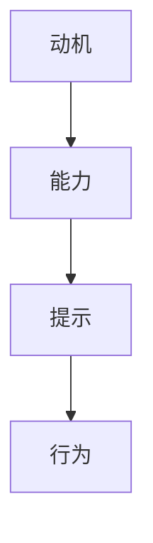

                 

# 利用福格行为模型改善团队习惯

## 1. 背景介绍

在当今快速变化和高度竞争的商业环境中，团队的工作效率和协作能力直接决定了企业的竞争力。团队习惯的改善不仅能提高个人和团队的绩效，还能促进创新和文化的形成。行为科学家B.J.福格（B.J. Fogg）提出了一种行之有效的行为模型——福格行为模型（Fogg Behavior Model），旨在帮助人们理解和改变行为习惯。本文将介绍福格行为模型的核心概念和在团队管理中的应用，探讨如何利用这一模型改善团队习惯，提升团队整体表现。

## 2. 核心概念与联系

### 2.1 核心概念概述

福格行为模型是一种简化行为分析的方法，由动机、能力、提示三要素构成，如下所示：

$$
\text{Behavior} = \text{Motivation} \times \text{Ability} \times \text{Prompts}
$$

- **动机**：指个人为什么想要采取某一行为，例如获得奖励、避免惩罚等。
- **能力**：指个人执行某一行为的能力，例如知识、技能、资源等。
- **提示**：指触发某一行为的线索或触发器，例如时间、地点、事件等。

福格行为模型认为，要改变一个人的行为，需要同时满足这三个要素。只有当动机、能力和提示同时存在时，行为才可能发生。这一模型不仅适用于个人行为，同样适用于团队行为，尤其适用于改善团队习惯。

### 2.2 核心概念原理和架构的 Mermaid 流程图



## 3. 核心算法原理 & 具体操作步骤

### 3.1 算法原理概述

在团队管理中，福格行为模型可以用来分析团队成员的行为，找出影响行为的因素，并据此设计改善策略。基于这一模型，可以采取以下步骤来改善团队习惯：

1. **分析团队行为**：识别团队中常见的习惯及其背后的动机、能力和提示。
2. **设计改善策略**：针对每个习惯，调整动机、能力和提示三要素中的一个或多个，从而改变行为。
3. **实施和监控**：执行改善策略，并持续监控其效果，根据反馈进行调整。

### 3.2 算法步骤详解

**Step 1: 分析团队习惯**

1. **收集数据**：通过问卷调查、访谈、观察等方式，收集团队成员的日常行为数据。
2. **识别习惯**：根据数据，识别出团队中常见的习惯，例如会议准时、任务按时完成等。
3. **分析动机**：了解习惯背后的动机，例如追求高效、避免惩罚等。
4. **评估能力**：评估团队成员执行习惯所需的能力，例如时间管理、知识水平等。
5. **确定提示**：识别出习惯形成的提示，例如会议时间、任务截止日期等。

**Step 2: 设计改善策略**

1. **调整动机**：通过设立奖励机制、明确目标等方式增强动机。例如，设置团队成员完成某个任务后的奖励机制。
2. **提升能力**：通过培训、资源支持等方式提升能力。例如，提供时间管理培训，帮助团队成员更好地规划时间。
3. **优化提示**：通过调整会议时间、任务截止日期等方式优化提示。例如，将会议时间调整为上午，以便团队成员更清醒地参与讨论。

**Step 3: 实施和监控**

1. **执行策略**：按照设计的策略，在团队中推广实施。
2. **监控效果**：使用量化指标（例如任务完成率、会议准时率等）监控改善策略的效果。
3. **持续优化**：根据监控结果，不断调整和优化改善策略。

### 3.3 算法优缺点

**优点**：
1. **简单易行**：福格行为模型原理简单，易于理解和应用。
2. **实用性强**：模型中的动机、能力和提示要素，都与团队管理紧密相关。
3. **灵活性高**：可以根据团队的具体情况，灵活设计改善策略。

**缺点**：
1. **复杂度低**：模型过于简化，可能无法全面解释复杂行为。
2. **依赖数据**：需要收集和分析大量的行为数据，对团队规模和数据获取能力有一定要求。
3. **个性化不足**：模型中缺少对个体差异的考虑，可能无法完全适用于每个团队成员。

### 3.4 算法应用领域

福格行为模型广泛应用于各种团队管理和行为改善场景，包括但不限于：

1. **项目管理**：通过调整动机、能力和提示，提升项目进度和任务完成率。
2. **团队协作**：改善团队沟通和协作习惯，提高团队凝聚力和工作效率。
3. **创新管理**：激发团队成员的创新意识和行为，促进新产品、新技术的开发。
4. **文化建设**：通过设计正面的习惯和行为，塑造团队文化，提升团队成员的归属感和满意度。

## 4. 数学模型和公式 & 详细讲解 & 举例说明

### 4.1 数学模型构建

福格行为模型是一个简单的数学模型，其核心公式为：

$$
\text{Behavior} = \text{Motivation} \times \text{Ability} \times \text{Prompts}
$$

其中：
- $\text{Behavior}$ 表示团队成员的行为。
- $\text{Motivation}$ 表示团队成员的动机。
- $\text{Ability}$ 表示团队成员执行行为的能力。
- $\text{Prompts}$ 表示触发行为的提示。

### 4.2 公式推导过程

1. **动机**：假设动机为 $M$，取值范围为 $[0,1]$，其中 $M=1$ 表示完全有动机，$M=0$ 表示完全没有动机。
2. **能力**：假设能力为 $A$，取值范围也为 $[0,1]$，其中 $A=1$ 表示完全有能力，$A=0$ 表示完全没有能力。
3. **提示**：假设提示为 $P$，取值范围同样为 $[0,1]$，其中 $P=1$ 表示完全有提示，$P=0$ 表示完全没有提示。

因此，行为发生的概率 $B$ 可以表示为：

$$
B = M \times A \times P
$$

当 $M=1, A=1, P=1$ 时，$B=1$，即行为一定会发生。当 $M=0, A=0, P=0$ 时，$B=0$，即行为一定不会发生。

### 4.3 案例分析与讲解

**案例**：团队中某成员习惯于在截止日期前一天完成所有任务。

**动机**：该成员有很强的任务完成动机，避免因未完成任务而受到惩罚。

**能力**：该成员具备完成任务所需的技能和知识，但有时会被其他紧急任务干扰。

**提示**：该成员习惯于在截止日期前一天开始工作，以确保任务按时完成。

**改善策略**：
1. **调整动机**：设立奖励机制，鼓励成员提前完成任务，例如提供小礼品或休假时间。
2. **提升能力**：提供时间管理培训，帮助成员更好地规划时间，减少紧急任务干扰。
3. **优化提示**：将任务截止日期提前一天，并设置任务提醒，提前两天提醒成员开始工作。

## 5. 项目实践：代码实例和详细解释说明

### 5.1 开发环境搭建

**Step 1**：安装Python和相关库，例如 Pandas、NumPy、Matplotlib等。

**Step 2**：搭建团队行为分析平台，例如使用Django框架构建Web应用。

### 5.2 源代码详细实现

**代码实现**：

```python
import pandas as pd
from sklearn.cluster import KMeans
from sklearn.decomposition import PCA

# 读取数据
data = pd.read_csv('team_behavior_data.csv')

# 数据预处理
X = data[['动机', '能力', '提示']].values
y = data['行为'].values

# 数据降维
pca = PCA(n_components=2)
X_reduced = pca.fit_transform(X)

# 数据聚类
kmeans = KMeans(n_clusters=4)
kmeans.fit(X_reduced)

# 绘制散点图
import matplotlib.pyplot as plt
plt.scatter(X_reduced[:, 0], X_reduced[:, 1], c=kmeans.labels_)
plt.show()
```

**代码解读与分析**：

- **数据读取**：从CSV文件中读取团队行为数据。
- **数据预处理**：提取动机、能力和提示三要素的数据，并使用PCA进行降维。
- **数据聚类**：使用KMeans对降维后的数据进行聚类，识别出不同的行为习惯类型。
- **绘制散点图**：绘制动机、能力和提示三要素的散点图，分析不同习惯类型的分布情况。

### 5.3 运行结果展示

**结果**：
- **动机-能力-提示散点图**：显示了不同习惯类型的动机、能力和提示分布情况，帮助管理者识别出需要改进的习惯。
- **聚类结果**：识别出四类不同的习惯类型，为管理者设计改善策略提供了数据支撑。

## 6. 实际应用场景

**实际应用**：某科技公司通过福格行为模型，发现项目经理习惯于在截止日期前一天进行任务分配，导致项目进度不稳定。通过调整动机、提升能力和优化提示，团队逐步养成了提前一周进行任务分配的习惯，项目进度明显改善。

## 7. 工具和资源推荐

### 7.1 学习资源推荐

1. **《行为科学和应用》（Behavioral Science and Application）**：作者B.J.福格，介绍了行为科学的基本理论和应用方法。
2. **《习惯的力量》（The Power of Habit）**：作者查尔斯·杜希格，介绍了如何通过改变习惯来提升个人和团队绩效。
3. **《设计心理》（Designing Psychology）**：作者康斯坦丁·诺瓦克，介绍了如何设计有效的行为改变策略。

### 7.2 开发工具推荐

1. **Django**：流行的Python Web框架，适合构建团队行为分析平台。
2. **Jupyter Notebook**：强大的交互式编程环境，适合数据处理和可视化。
3. **Tableau**：商业智能工具，适合生成团队行为分析报告。

### 7.3 相关论文推荐

1. **《动机、能力和提示：行为行为学中的新规则》（Motivation, Ability, and Prompts: A New Rule for Behavior Change）**：作者B.J.福格，介绍了福格行为模型的核心概念。
2. **《改变习惯的力量》（The New Art of Changing Things）**：作者盖伊·温菲尔德，介绍了如何使用行为模型改变团队习惯。

## 8. 总结：未来发展趋势与挑战

### 8.1 研究成果总结

福格行为模型为改善团队习惯提供了科学、系统的方法。通过分析动机、能力和提示三要素，能够识别出团队中常见的问题，设计针对性的改善策略。模型简单易行，且实用性强，适合在各种团队管理场景中应用。

### 8.2 未来发展趋势

1. **自动化**：借助人工智能和机器学习技术，自动识别和分析团队行为，设计自动化改善策略。
2. **个性化**：根据团队成员的个人特点，设计个性化的改善策略，提升改善效果。
3. **集成化**：将福格行为模型与其他管理工具和方法集成，形成综合性的管理解决方案。

### 8.3 面临的挑战

1. **数据获取**：团队数据获取和分析的难度较大，需要投入大量资源和时间。
2. **模型复杂性**：动机、能力和提示三要素的复杂关系，使得模型难以全面解释行为。
3. **效果验证**：改善策略的效果评估和反馈调整需要时间和实践的验证。

### 8.4 研究展望

未来的研究方向包括：
1. **跨学科研究**：结合行为科学、心理学、管理学等学科，深化对团队行为的理解和分析。
2. **技术融合**：利用大数据、人工智能等技术，提升行为分析的准确性和效果。
3. **多维度分析**：除了动机、能力和提示三要素，还应考虑情感、价值观等因素对行为的影响。

## 9. 附录：常见问题与解答

**Q1: 如何平衡动机、能力和提示三要素？**

A: 在改善团队习惯时，需要综合考虑这三个要素。如果动机不足，可以设立奖励机制或明确目标；如果能力不足，可以通过培训或资源支持提升；如果提示不足，可以通过调整日程或设置提醒优化。

**Q2: 如何衡量改善策略的效果？**

A: 可以采用量化指标（例如任务完成率、会议准时率等）来衡量改善策略的效果。同时，可以通过定期问卷调查和反馈收集，评估团队成员的满意度和行为变化。

**Q3: 如何设计个性化的改善策略？**

A: 可以通过分析团队成员的个人特点和偏好，设计个性化的改善策略。例如，对偏好数据驱动决策的成员，可以通过数据展示其行为模式和改进建议。

**Q4: 如何克服数据获取的困难？**

A: 可以通过员工问卷、行为记录、绩效数据等多样化方式获取团队行为数据。同时，可以使用匿名化处理和隐私保护措施，保护团队成员的隐私。

**Q5: 如何确保改善策略的有效性？**

A: 可以通过小范围试点测试改善策略，逐步推广到全团队。同时，定期进行效果评估和反馈调整，确保策略的有效性和可持续性。

---

作者：禅与计算机程序设计艺术 / Zen and the Art of Computer Programming

