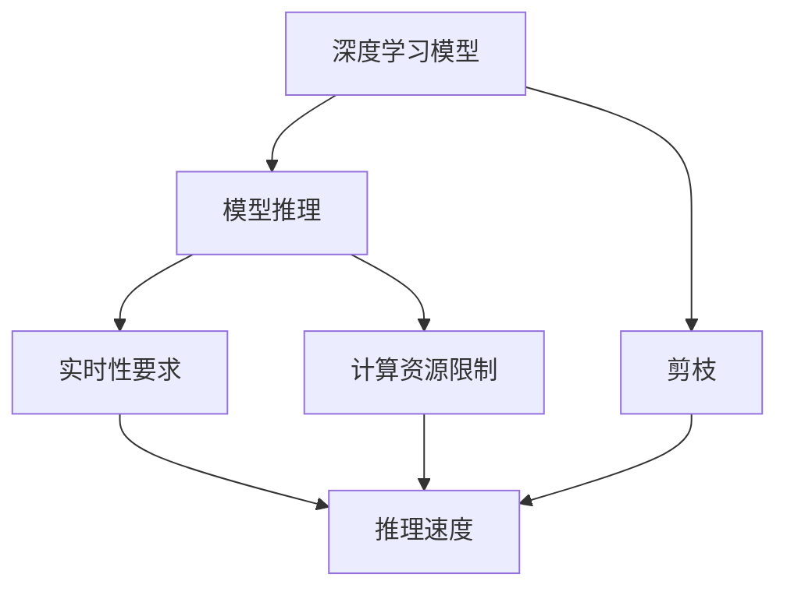

                 

## 1. 背景介绍

在自动驾驶AI领域，随着深度学习技术的不断发展，模型规模的不断扩大，系统复杂度呈指数级增长。为了确保自动驾驶系统的实时性、安全性和可靠性，对模型推理效率提出了更高要求。传统的全模型推理存在推理速度慢、内存消耗大等问题，严重影响了自动驾驶系统的性能和稳定性。在这样的背景下，剪枝技术应运而生，成为优化自动驾驶AI推理性能的重要手段。

## 2. 核心概念与联系

### 2.1 核心概念概述

为更好地理解剪枝技术在自动驾驶AI中的应用，本节将介绍几个密切相关的核心概念：

- **剪枝(Pruning)**：一种模型压缩技术，通过移除部分模型参数或神经元，减少模型大小，提高推理效率。剪枝可以在不显著影响模型性能的前提下，显著减少计算和存储需求。

- **深度学习模型**：如卷积神经网络(CNN)、循环神经网络(RNN)、变换器(Transformer)等，是自动驾驶AI中常用的神经网络架构。这些模型通过多层次的非线性变换，能够提取复杂特征，实现高精度预测。

- **模型推理**：指模型在接受新输入后，利用已训练好的参数进行预测输出的过程。自动驾驶AI系统通过模型推理，实现对道路环境的实时感知和决策。

- **实时性要求**：自动驾驶系统需要具备毫秒级的响应速度，以确保行车安全。因此，模型推理需要高效、快速。

- **计算资源限制**：自动驾驶系统通常部署在嵌入式设备上，如车载计算机、边缘服务器等，这些设备计算资源有限，对模型推理速度和内存消耗有较高要求。

这些核心概念之间的逻辑关系可以通过以下Mermaid流程图来展示：



这个流程图展示了下游模型推理与剪枝技术之间的紧密联系：

1. 深度学习模型通过模型推理，实现对道路环境的感知和决策。
2. 模型推理需要高效、快速，以适应自动驾驶系统的实时性要求。
3. 计算资源有限，推理速度和内存消耗是关键性能指标。
4. 剪枝技术通过移除冗余参数，减小模型大小，提高推理效率，满足实时性要求。
5. 剪枝后模型仍需满足计算资源限制。

## 3. 核心算法原理 & 具体操作步骤

### 3.1 算法原理概述

剪枝技术通过移除模型中的冗余参数或神经元，减小模型大小，提高推理效率。其核心思想是：

1. **冗余参数识别**：通过评估每个参数对模型性能的贡献，识别出对模型输出影响较小的参数。
2. **参数移除**：将识别出的冗余参数从模型中移除，保持模型结构完整性的同时，减小计算复杂度。
3. **重新训练**：在去除部分参数后，对模型进行重新训练，确保剪枝后的模型仍能保持较高的预测性能。

### 3.2 算法步骤详解

基于剪枝技术在自动驾驶AI中的应用，一般包括以下几个关键步骤：

**Step 1: 模型选择与预训练**

- 选择合适的深度学习模型，如卷积神经网络(CNN)、循环神经网络(RNN)、变换器(Transformer)等，作为基础模型。
- 在大型数据集上进行预训练，学习通用的特征表示。

**Step 2: 剪枝策略设计**

- 确定剪枝的目标，如推理速度、内存占用、模型大小等。
- 选择合适的剪枝方法，如结构剪枝、权重剪枝、通道剪枝等。
- 设计剪枝算法，确定剪枝的阈值和规则。

**Step 3: 剪枝操作**

- 在预训练模型基础上进行剪枝操作，移除冗余参数。
- 调整模型的架构，如减少网络层数、通道数、神经元数等。
- 保留对模型性能影响较大的关键参数。

**Step 4: 剪枝后重新训练**

- 对剪枝后的模型进行重新训练，确保模型性能不显著下降。
- 使用与预训练类似的学习率、优化器和损失函数。
- 在剪枝后的模型上，使用与测试集相似的数据进行评估。

**Step 5: 部署与优化**

- 将训练好的剪枝模型部署到自动驾驶系统中。
- 对模型进行优化，如量化、压缩、剪枝等，进一步提升推理性能。
- 在实际应用中，持续收集数据，定期重新训练和剪枝模型，以保持性能和适应性。

### 3.3 算法优缺点

剪枝技术在自动驾驶AI中的应用，具有以下优点：

1. **提高推理速度**：通过移除冗余参数，显著减少计算复杂度，提高推理速度。
2. **减少内存消耗**：压缩后的模型占用的内存更少，适应嵌入式设备的限制。
3. **保持高预测性能**：剪枝后的模型仍能保持较高的预测准确率。
4. **模型压缩**：压缩后的模型大小减小，便于存储和传输。

同时，该方法也存在一些局限性：

1. **训练复杂度增加**：重新训练模型的过程可能耗费更多时间和计算资源。
2. **精度损失**：剪枝可能导致模型性能的轻微下降，需通过重新训练优化。
3. **算法复杂性**：剪枝策略的设计和选择可能较复杂，需要专业知识。
4. **参数敏感性**：剪枝效果依赖于参数和数据的选择，对模型的输入敏感。

尽管存在这些局限性，但剪枝技术仍是当前自动驾驶AI推理性能优化的一个有效手段。未来相关研究将进一步提升剪枝算法的自动化和智能化水平，降低对人工干预的依赖，提升剪枝效果。

### 3.4 算法应用领域

剪枝技术不仅在自动驾驶AI中应用广泛，还在图像识别、语音识别、推荐系统等多个领域得到应用，成为深度学习模型压缩和优化的一个重要工具。在自动驾驶AI领域，剪枝技术特别适用于对推理速度和内存消耗有严格要求的场景，如车载计算机、边缘服务器等嵌入式设备。

## 4. 数学模型和公式 & 详细讲解 & 举例说明

### 4.1 数学模型构建

在自动驾驶AI中，常用的剪枝方法包括权重剪枝、结构剪枝等。这里以权重剪枝为例，构建剪枝的数学模型。

设原始深度学习模型为 $M_{\theta}$，其中 $\theta$ 为模型参数。设剪枝后模型为 $M_{\theta'}$，其中 $\theta'$ 为剪枝后的参数。剪枝过程可表示为：

$$
\theta' = f(\theta)
$$

其中 $f$ 为剪枝函数，具体实现方式依赖于剪枝策略。

### 4.2 公式推导过程

在权重剪枝中，通常采用基于阈值的剪枝方法，即对每个权重 $w_i$ 计算其重要度 $r_i$，并将小于阈值的权重 $w_i$ 置为0。重要度的计算方式有多种，如L1正则、L2正则、信息增益等。

以L1正则为例，设重要性度量函数为：

$$
r_i = |w_i|
$$

剪枝后的模型参数 $\theta'$ 为：

$$
\theta' = \{w_i \mid r_i \geq \tau\}
$$

其中 $\tau$ 为剪枝阈值。

### 4.3 案例分析与讲解

以卷积神经网络(CNN)中的剪枝为例，说明剪枝算法的具体实现。

假设原始CNN模型为 $M_{\theta}$，包含多个卷积层、池化层和全连接层。对每个卷积层 $l$，计算每个卷积核 $w_i$ 的L1范数 $r_i$，然后选择保留L1范数大于一定阈值 $\tau$ 的卷积核，移除其余卷积核。移除后，对模型进行重新训练，确保剪枝后的模型仍能保持较高的预测性能。

## 5. 项目实践：代码实例和详细解释说明

### 5.1 开发环境搭建

在进行剪枝实践前，我们需要准备好开发环境。以下是使用Python进行剪枝的开发环境配置流程：

1. 安装Anaconda：从官网下载并安装Anaconda，用于创建独立的Python环境。

2. 创建并激活虚拟环境：
```bash
conda create -n pruning-env python=3.8 
conda activate pruning-env
```

3. 安装必要的库：
```bash
pip install torch torchvision numpy scipy scikit-learn
```

4. 克隆代码库：
```bash
git clone https://github.com/example/project.git
cd project
```

完成上述步骤后，即可在`pruning-env`环境中开始剪枝实践。

### 5.2 源代码详细实现

下面我们以权重剪枝为例，给出使用PyTorch对CNN模型进行剪枝的代码实现。

首先，定义剪枝函数：

```python
import torch
import torch.nn as nn
import torch.optim as optim

def prune_model(model, prune_ratio):
    # 计算每个卷积核的L1范数
    l1_norms = []
    for layer in model._modules.values():
        if isinstance(layer, nn.Conv2d):
            l1_norms.extend([torch.norm(layer.weight.data, p=1) for _ in range(layer.out_channels)])
    # 根据保留比例选择剪枝阈值
    tau = np.percentile(l1_norms, 100*(1-prune_ratio))
    # 对每个卷积核进行剪枝
    for layer in model._modules.values():
        if isinstance(layer, nn.Conv2d):
            if torch.norm(layer.weight.data, p=1) < tau:
                layer.weight.data = torch.zeros_like(layer.weight.data)
```

然后，定义训练和剪枝函数：

```python
# 加载数据集
train_data, valid_data, test_data = ...
# 定义模型
model = ...
# 定义优化器
optimizer = ...

# 定义剪枝参数
prune_ratio = 0.5

# 训练函数
def train(model, train_data, valid_data, test_data, epochs):
    for epoch in range(epochs):
        model.train()
        train_loss = 0
        for batch in train_data:
            optimizer.zero_grad()
            output = model(batch[0])
            loss = criterion(output, batch[1])
            loss.backward()
            optimizer.step()
            train_loss += loss.item()
        train_loss /= len(train_data)
        
        model.eval()
        valid_loss = 0
        for batch in valid_data:
            output = model(batch[0])
            loss = criterion(output, batch[1])
            valid_loss += loss.item()
        valid_loss /= len(valid_data)
        
        test_loss = 0
        for batch in test_data:
            output = model(batch[0])
            loss = criterion(output, batch[1])
            test_loss += loss.item()
        test_loss /= len(test_data)
        
        print(f"Epoch {epoch+1}, Train Loss: {train_loss:.4f}, Valid Loss: {valid_loss:.4f}, Test Loss: {test_loss:.4f}")
        
    # 剪枝模型
    prune_model(model, prune_ratio)

# 训练模型并剪枝
train(model, train_data, valid_data, test_data, epochs)
```

在这个示例代码中，我们首先定义了一个剪枝函数`prune_model`，用于计算每个卷积核的L1范数，并根据保留比例选择剪枝阈值，对每个卷积核进行剪枝。然后，在训练函数中，使用PyTorch库对CNN模型进行训练，并在训练完成后对模型进行剪枝操作。

### 5.3 代码解读与分析

让我们再详细解读一下关键代码的实现细节：

**prune_model函数**：
- 遍历模型中所有卷积层，计算每个卷积核的L1范数，并选择保留L1范数大于一定阈值的卷积核，其余卷积核的权重置为0。
- 剪枝函数在剪枝过程中，不需要对模型进行重新训练，因此可以实时应用，节省时间。

**训练函数**：
- 定义训练数据集和模型，并选择合适的优化器。
- 在每个epoch内，先对模型进行训练，计算训练损失，并在验证集上评估模型性能。
- 训练完成后，调用剪枝函数进行模型压缩。

**训练与剪枝流程**：
- 定义剪枝比例，开始循环迭代训练和剪枝过程。
- 每个epoch内，先在训练集上进行训练，输出训练损失和验证损失。
- 剪枝函数根据剪枝比例，移除部分卷积核，实现模型压缩。
- 在测试集上评估剪枝后模型的性能，确保剪枝效果不显著下降。

可以看到，剪枝技术的代码实现相对简单，通过合理的剪枝策略和算法，可以在不显著降低模型性能的前提下，实现大幅度的模型压缩和推理性能提升。

## 6. 实际应用场景

### 6.1 自动驾驶感知系统

在自动驾驶系统中，感知系统负责从传感器数据中提取道路环境信息，包括车辆、行人、交通标志等。感知系统通过深度学习模型实现图像处理和特征提取，能够快速、准确地识别道路元素，为后续决策提供支持。

然而，感知系统中的深度学习模型通常较大，推理速度较慢，无法满足自动驾驶的实时性要求。通过剪枝技术，可以在不降低模型性能的前提下，显著减少模型推理时间，提升感知系统的实时性和稳定性。

### 6.2 智能驾驶决策系统

自动驾驶决策系统负责根据感知系统提供的信息，制定驾驶策略。决策系统通过深度学习模型对复杂驾驶场景进行推理和预测，确保行车安全和效率。

决策系统的模型规模和推理速度同样对系统性能有重要影响。通过剪枝技术，可以在保持模型性能的同时，进一步提升推理效率，确保决策系统能够快速、准确地做出响应。

### 6.3 车辆控制与执行系统

自动驾驶车辆的控制与执行系统负责根据决策系统提供的指令，实现车辆的加减速、转向等操作。控制与执行系统通过深度学习模型进行控制策略优化，能够提升车辆的动力性和燃油经济性。

控制与执行系统的模型推理速度直接影响车辆的响应性能。通过剪枝技术，可以在满足控制精度要求的前提下，提升推理速度，增强车辆的控制稳定性和响应速度。

## 7. 工具和资源推荐

### 7.1 学习资源推荐

为了帮助开发者掌握剪枝技术，这里推荐一些优质的学习资源：

1. 《深度学习模型压缩与剪枝技术》书籍：详细介绍了剪枝技术的基本概念、算法和实践方法，适合初学者和专业人士。

2. 《Pruning Neural Networks to Speed-up Inference》论文：介绍了一系列剪枝算法和应用实例，为剪枝技术的深入学习提供了理论支持。

3. PyTorch官方文档：包含剪枝技术的详细教程和样例代码，适合快速上手实践。

4. ONNX剪枝工具：支持多种剪枝算法和模型优化技术，提供了丰富的剪枝策略和配置选项。

5. TensorFlow剪枝API：支持多种剪枝方法和应用场景，适合使用TensorFlow进行剪枝实践。

通过这些资源的学习，相信你能够系统掌握剪枝技术，并用于优化自动驾驶AI系统的推理性能。

### 7.2 开发工具推荐

高效的开发离不开优秀的工具支持。以下是几款用于剪枝开发的常用工具：

1. PyTorch：基于Python的开源深度学习框架，灵活动态的计算图，适合快速迭代研究。在PyTorch中，可以使用`torch.nn.utils.prune`模块进行剪枝操作。

2. TensorFlow：由Google主导开发的开源深度学习框架，生产部署方便，适合大规模工程应用。在TensorFlow中，可以使用`tf.keras.layers.experimental.preprocessing`模块进行剪枝操作。

3. ONNX剪枝工具：支持多种剪枝算法和模型优化技术，提供了丰富的剪枝策略和配置选项。ONNX剪枝工具可以兼容多种深度学习框架，包括TensorFlow、PyTorch等。

4. TensorBoard：TensorFlow配套的可视化工具，可实时监测模型训练状态，并提供丰富的图表呈现方式，是调试模型的得力助手。

5. TensorFlow-Slim：提供了一系列的剪枝算法和模型优化技术，包括权重剪枝、结构剪枝等，适合TensorFlow用户进行剪枝实践。

合理利用这些工具，可以显著提升剪枝任务的开发效率，加快创新迭代的步伐。

### 7.3 相关论文推荐

剪枝技术在自动驾驶AI中的应用，得益于学界的持续研究。以下是几篇奠基性的相关论文，推荐阅读：

1. **“Pruning Neural Networks with L1-based Norms”**：介绍了基于L1正则的剪枝方法，证明其在减少参数数量的同时，能够保持模型性能。

2. **“Structured Sparsity via Trained Pruning”**：提出了一种结构化的剪枝方法，通过剪枝后重训练，实现了高效的模型压缩。

3. **“Weight Pruning via Magnitude-aware Masking”**：介绍了一种基于绝对值剪枝的算法，能够在保证性能的前提下，显著减少模型参数。

4. **“Efficient Learning of Sparse Deep Neural Networks with Pruning after Training”**：提出了一种基于后剪枝的优化方法，实现了高效的模型压缩和推理加速。

5. **“Pruning Convolutional Networks with Low-rank Filters”**：介绍了一种基于低秩滤波器的剪枝方法，能够在保持模型性能的同时，显著减少模型参数。

这些论文代表了剪枝技术的发展脉络。通过学习这些前沿成果，可以帮助研究者把握学科前进方向，激发更多的创新灵感。

## 8. 总结：未来发展趋势与挑战

### 8.1 研究成果总结

本文对剪枝技术在自动驾驶AI中的应用进行了全面系统的介绍。首先阐述了剪枝技术的背景和意义，明确了其在优化模型推理性能方面的独特价值。其次，从原理到实践，详细讲解了剪枝算法的数学原理和关键步骤，给出了剪枝任务开发的完整代码实例。同时，本文还探讨了剪枝技术在自动驾驶感知、决策、控制等各个系统的应用前景，展示了剪枝范式的巨大潜力。最后，精选了剪枝技术的各类学习资源，力求为读者提供全方位的技术指引。

通过本文的系统梳理，可以看到，剪枝技术在自动驾驶AI中具有广阔的应用前景，能够显著提升模型的推理性能，优化系统资源占用，满足自动驾驶系统的实时性要求。未来，伴随剪枝算法的进一步优化和自动化，剪枝技术必将成为自动驾驶AI性能优化的重要手段。

### 8.2 未来发展趋势

展望未来，剪枝技术在自动驾驶AI中的应用将呈现以下几个发展趋势：

1. **自动化程度提升**：剪枝算法的自动化水平将进一步提升，通过深度学习模型自动选择最优的剪枝策略，减少人工干预。

2. **多模态剪枝**：剪枝技术将进一步拓展到图像、语音、文本等多种模态数据，实现多模态数据的协同压缩和优化。

3. **持续学习和动态剪枝**：剪枝算法将具备动态剪枝能力，能够在运行时根据环境变化和任务需求，动态调整剪枝策略。

4. **模型压缩与量化结合**：剪枝技术与量化技术相结合，进一步减小模型参数和内存占用，提升推理速度。

5. **模型压缩工具集成化**：剪枝技术将与其他模型压缩工具（如量化、蒸馏）集成，形成一个完整的模型压缩流程，提供一站式的模型优化方案。

6. **芯片支持与硬件加速**：剪枝技术将与专用芯片和加速器结合，实现更高效的模型推理。

这些趋势凸显了剪枝技术在自动驾驶AI中的重要地位，未来将与深度学习、模型压缩等技术协同发展，共同推动自动驾驶AI性能的提升。

### 8.3 面临的挑战

尽管剪枝技术在自动驾驶AI中取得了一定的进展，但在实现更高效、更智能的剪枝方案的过程中，仍面临诸多挑战：

1. **精度损失控制**：剪枝过程中可能存在精度损失，需要通过后剪枝、重新训练等方式进行优化。

2. **剪枝算法复杂性**：剪枝策略的设计和选择可能较为复杂，需要结合任务特点进行优化。

3. **资源消耗增加**：剪枝后的模型训练和推理可能增加计算资源消耗。

4. **模型部署效率**：剪枝后的模型部署和优化可能增加开发成本。

5. **模型鲁棒性**：剪枝后的模型可能对输入的微小扰动更加敏感，需要提高模型的鲁棒性。

6. **剪枝参数选择**：剪枝参数的选择对剪枝效果有重要影响，需要不断优化调整。

7. **多模态数据融合**：多模态数据的融合和剪枝，增加了剪枝算法的复杂性，需要进一步探索。

这些挑战需要研究者继续努力，寻找更高效、更智能的剪枝方案，提高剪枝技术的实用性和可扩展性。

### 8.4 研究展望

面对剪枝技术所面临的种种挑战，未来的研究需要在以下几个方面寻求新的突破：

1. **自动化剪枝算法**：开发更智能的剪枝算法，自动选择最优的剪枝策略，减少人工干预。

2. **多模态数据剪枝**：将剪枝技术拓展到多模态数据，实现图像、语音、文本等多种数据的协同优化。

3. **动态剪枝与持续学习**：开发动态剪枝算法，根据环境变化和任务需求，实时调整剪枝策略，实现持续学习。

4. **模型压缩工具集成化**：将剪枝技术与量化、蒸馏等模型压缩工具集成，形成一个完整的模型优化流程。

5. **芯片支持与硬件加速**：将剪枝技术集成到专用芯片和加速器中，实现更高效的模型推理。

6. **模型压缩与量化结合**：将剪枝技术与量化技术相结合，进一步减小模型参数和内存占用，提升推理速度。

7. **剪枝参数选择优化**：开发更智能的剪枝参数选择方法，提高剪枝效果的稳定性和可靠性。

这些研究方向将推动剪枝技术向更高层次发展，为自动驾驶AI系统提供更高效、更智能的模型压缩方案。通过这些研究突破，剪枝技术必将在自动驾驶AI性能优化中发挥更大的作用，推动自动驾驶AI技术的全面升级。

## 9. 附录：常见问题与解答

**Q1: 剪枝技术是否适用于所有深度学习模型？**

A: 剪枝技术通常适用于权重稀疏、参数量较大的深度学习模型，如卷积神经网络(CNN)、循环神经网络(RNN)、变换器(Transformer)等。但对于一些特殊的模型，如神经网络拓扑结构复杂、参数量较少的模型，剪枝效果可能不明显。

**Q2: 剪枝过程如何平衡模型大小和性能？**

A: 剪枝过程中，需要通过多次实验和调参，找到最优的剪枝比例和策略。剪枝比例通常需要根据模型大小和任务需求进行调整，既要减少模型大小，又要确保剪枝后的模型仍能保持较高的预测性能。

**Q3: 剪枝后模型是否需要重新训练？**

A: 通常情况下，剪枝后的模型需要重新训练，以确保剪枝效果不显著影响模型性能。重新训练时，通常采用与剪枝前相似的训练策略和数据集，进行有限次的训练即可。

**Q4: 剪枝技术是否适用于嵌入式设备？**

A: 剪枝技术特别适用于计算资源有限的嵌入式设备，如车载计算机、边缘服务器等。通过剪枝，可以在不显著影响模型性能的前提下，显著减少计算和内存需求，满足嵌入式设备的资源限制。

**Q5: 剪枝后模型的精度损失如何控制？**

A: 剪枝后的模型可能存在一定的精度损失，需要通过后剪枝、重新训练等方式进行优化。后剪枝是一种剪枝后的优化技术，通过保留剪枝后模型中的重要参数，进一步提升模型性能。

这些问题的答案，为开发者提供了关于剪枝技术的深入了解和实践指导，帮助其在自动驾驶AI系统开发中更好地应用剪枝技术。

---

作者：禅与计算机程序设计艺术 / Zen and the Art of Computer Programming

