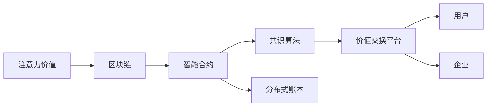

                 

# 区块链驱动的注意力价值交换平台

> 关键词：区块链, 注意力价值, 价值交换平台, 分布式账本, 智能合约, 共识算法, DeFi

## 1. 背景介绍

### 1.1 问题由来
近年来，区块链技术在金融、供应链、物联网等多个领域得到了广泛应用，极大地提升了业务效率和安全性。然而，传统的区块链系统往往只关注价值转移的效率和安全性，而忽略了注意力作为一种重要价值形式的地位。

随着互联网和信息技术的飞速发展，人类社会进入了信息爆炸的时代，注意力资源成为了稀缺且宝贵的资源。用户浏览行为、社交媒体互动、广告点击等注意力数据的采集、分析和应用，成为许多企业的重要业务方向。但现有的区块链系统，缺乏对注意力数据的有效管理和交换机制，难以满足用户和企业的实际需求。

为了解决这一问题，我们提出了基于区块链的注意力价值交换平台，旨在通过智能合约、共识算法等区块链技术，构建一个高效、安全、去中心化的注意力价值交换平台。该平台能够为用户提供良好的注意力价值交换和应用体验，促进注意力数据的流通和应用，推动信息社会的持续发展。

### 1.2 问题核心关键点
构建区块链驱动的注意力价值交换平台的核心关键点包括：
1. 设计适合于注意力交换的智能合约。如何通过智能合约实现注意力数据的收集、转移、交换等操作，需要考虑合约的可扩展性、高效性、安全性等问题。
2. 选择高效的共识算法。如何保证注意力数据的真实性和不可篡改性，需要在选择共识算法时进行充分论证和测试。
3. 构建分布式注意力账本。如何将用户的注意力行为记录在区块链上，并进行实时更新和查询，需要设计合适的分布式账本结构。
4. 实现注意力价值的自动匹配和交换。如何通过智能合约和分布式账本，实现不同用户间注意力价值的自动匹配和交换，需要考虑合约的灵活性和扩展性。
5. 实现注意力数据的去中心化管理和应用。如何通过区块链技术，实现注意力数据的共享和应用，需要设计合适的激励机制和治理模式。

这些关键点共同构成了区块链驱动的注意力价值交换平台的逻辑框架，使得该平台具备高效、安全、去中心化的注意力价值交换能力。

### 1.3 问题研究意义
区块链驱动的注意力价值交换平台的研究具有重要的意义：

1. **提升注意力资源价值**：通过区块链技术，将用户的注意力数据记录在不可篡改的分布式账本上，使得注意力数据的真实性和可靠性得到了保证。这将极大地提升注意力资源的经济价值，推动注意力数据在市场中的广泛应用。

2. **促进信息资源共享**：该平台可以为用户提供高效、安全的注意力数据交换和共享机制，使得用户的注意力数据能够被企业和其他用户充分利用，促进信息资源的高效流动和应用。

3. **推动信息经济发展**：区块链驱动的注意力价值交换平台，可以为信息经济提供重要的技术支撑，推动信息技术的进一步发展和应用，为信息产业带来新的增长点。

4. **增强隐私保护**：用户的注意力数据通过加密和去中心化的方式记录和交换，隐私得到了最大程度的保护，避免了数据泄露和滥用的风险。

5. **增强信任机制**：区块链技术通过分布式共识和智能合约，构建了透明、可信的交易环境，增强了平台参与者之间的信任，为平台的发展和应用提供了良好的基础。

总之，区块链驱动的注意力价值交换平台的研究，对于提升注意力资源的经济价值、促进信息资源的共享和应用、推动信息经济的发展、保护用户隐私以及增强信任机制等方面，都具有重要的意义。

## 2. 核心概念与联系

### 2.1 核心概念概述

为了更好地理解区块链驱动的注意力价值交换平台的核心概念，本节将介绍几个关键概念及其相互联系：

- **注意力价值**：注意力价值指的是用户在使用互联网服务时，通过浏览、点击、互动等行为所产生的注意力资源的价值。这些注意力资源可以用于广告、市场调研、产品改进等多个领域，是一种重要的经济资源。

- **区块链**：区块链是一种分布式账本技术，通过去中心化、不可篡改的方式来记录和验证交易数据。区块链技术具有高安全性、高透明性和高可靠性的特点，适用于存储和传输重要的数据。

- **智能合约**：智能合约是一种自动执行的合约，通过区块链技术来确保合约的执行和交易的自动化。智能合约能够实现自动化的交易和价值交换，提升交易效率和安全性。

- **共识算法**：共识算法是指区块链网络中节点达成一致的方式。常见的共识算法包括PoW、PoS、DPoS等，这些算法保证了区块链网络的安全性和不可篡改性。

- **分布式账本**：分布式账本是区块链技术的基础设施，通过去中心化的方式记录和验证交易数据。每个节点都有账本的一个完整副本，保障了数据的透明性和不可篡改性。

- **价值交换平台**：价值交换平台是指用于存储、交换和管理各类价值数据的平台。区块链驱动的注意力价值交换平台通过智能合约和共识算法，实现注意力价值的记录、交换和管理。

这些核心概念之间的逻辑关系可以通过以下Mermaid流程图来展示：



这个流程图展示了注意力价值交换平台的逻辑结构：

1. 用户和企业在平台上的注意力数据通过智能合约进行记录和交换。
2. 智能合约通过共识算法，在分布式账本上进行验证和存储。
3. 分布式账本通过区块链技术，保障了数据的安全性和透明性。
4. 平台能够为各类参与者提供高效、安全的注意力价值交换机制。

## 3. 核心算法原理 & 具体操作步骤
### 3.1 算法原理概述

区块链驱动的注意力价值交换平台的核心算法原理包括以下几个方面：

- **智能合约设计**：通过设计合适的智能合约，实现注意力数据的收集、转移、交换等操作。智能合约需要具备高效、安全、可扩展的特点，支持多种类型的注意力数据交换。

- **共识算法选择**：选择合适的共识算法，如PoW、PoS等，保障平台的安全性和不可篡改性。共识算法需要兼顾性能、安全性和去中心化的特点。

- **分布式账本结构**：设计合适的分布式账本结构，记录用户的注意力行为数据。分布式账本需要支持高效的读写操作，保障数据的透明性和不可篡改性。

- **注意力价值的自动匹配和交换**：通过智能合约和分布式账本，实现不同用户间注意力价值的自动匹配和交换。合约需要支持多种类型的注意力交换场景，具有灵活性和扩展性。

- **激励机制和治理模式**：设计合理的激励机制和治理模式，保障平台的健康发展和应用。激励机制需要考虑用户和企业的利益平衡，治理模式需要支持社区自治和平台管理。

### 3.2 算法步骤详解

基于区块链驱动的注意力价值交换平台，核心算法步骤包括：

**Step 1: 设计智能合约**
- 根据注意力数据的类型和特点，设计合适的智能合约。合约需要支持用户和企业的注意力行为记录、交换、匹配等功能。
- 合约需要考虑不同类型注意力数据的存储方式，如文本、图像、行为数据等。
- 合约需要设计合理的权限控制和操作审计机制，保障数据的安全性和透明度。

**Step 2: 选择共识算法**
- 根据平台的业务需求和资源限制，选择合适的共识算法。共识算法需要兼顾性能、安全性和去中心化的特点。
- 共识算法需要设计合适的奖励机制，激励节点参与验证和维护平台的稳定性和安全性。

**Step 3: 构建分布式账本**
- 设计合适的分布式账本结构，记录用户的注意力行为数据。分布式账本需要支持高效的读写操作，保障数据的透明性和不可篡改性。
- 分布式账本需要设计合适的分块机制和节点同步机制，保证数据的一致性和可靠性。

**Step 4: 实现注意力价值的自动匹配和交换**
- 通过智能合约和分布式账本，实现不同用户间注意力价值的自动匹配和交换。合约需要支持多种类型的注意力交换场景，具有灵活性和扩展性。
- 合约需要设计合理的匹配算法和定价机制，保障注意力价值的公平性和合理性。

**Step 5: 设计激励机制和治理模式**
- 设计合理的激励机制和治理模式，保障平台的健康发展和应用。激励机制需要考虑用户和企业的利益平衡，治理模式需要支持社区自治和平台管理。
- 激励机制可以设计为用户和企业的注意力贡献积分，通过积分兑换平台资源和服务。

**Step 6: 部署和测试平台**
- 将智能合约、共识算法、分布式账本等核心组件部署到区块链上，并进行全面测试。
- 测试平台的性能、安全性和稳定性，确保平台能够满足实际需求。

**Step 7: 推广和应用平台**
- 推广平台，吸引用户和企业的注意力数据参与交换和应用。
- 提供平台的使用指南和支持服务，帮助用户和企业充分利用平台资源。

以上是基于区块链驱动的注意力价值交换平台的核心算法步骤，每个步骤都需要根据具体需求和场景进行灵活调整和优化。

### 3.3 算法优缺点

区块链驱动的注意力价值交换平台具有以下优点：

1. **去中心化**：平台采用分布式账本和共识算法，保障了数据的透明性和不可篡改性。任何节点都可以参与记录和验证数据，减少了中心化的风险。

2. **高安全性**：区块链技术通过加密和分布式共识，保障了数据的安全性和可靠性。智能合约的设计和执行，进一步提高了平台的安全性。

3. **高效性**：智能合约和分布式账本的设计，支持高效的数据记录、交换和匹配。平台能够实现自动化的操作，提高了交易效率和用户体验。

4. **可扩展性**：平台通过智能合约和分布式账本的设计，支持多种类型的注意力数据交换和应用。合约的灵活性和扩展性，保证了平台的高可扩展性。

5. **透明性**：平台采用分布式账本和智能合约，记录和验证数据的过程公开透明，提高了平台的信任度。

同时，该平台也存在一些局限性：

1. **高成本**：区块链技术的运行需要大量的计算资源和能源消耗，增加了平台的运营成本。

2. **复杂性**：平台的设计和实现涉及多种技术，需要较高的技术门槛和专业团队的支持。

3. **隐私问题**：尽管区块链技术提高了数据的安全性，但用户的隐私保护仍需进一步加强。

4. **法律和监管问题**：平台涉及的注意力数据和智能合约，需要符合相关法律法规和监管要求。

5. **发展不均衡**：平台的推广和应用仍面临诸多挑战，需要更多的市场教育和用户参与。

尽管存在这些局限性，但基于区块链的注意力价值交换平台仍具备广阔的应用前景，为注意力资源的流通和应用提供了新的技术手段。

### 3.4 算法应用领域

区块链驱动的注意力价值交换平台在多个领域具有广泛的应用前景：

1. **广告业**：平台可以记录用户的注意力行为数据，为企业提供精准的广告投放和优化建议。平台通过智能合约和分布式账本，实现了广告效果的自动化评估和结算。

2. **市场调研**：平台可以收集用户的注意力数据，帮助企业进行市场调研和用户画像分析。平台通过智能合约和分布式账本，实现了调研数据的共享和应用。

3. **内容创作**：平台可以记录用户的注意力行为数据，帮助内容创作者了解观众的偏好和反馈。平台通过智能合约和分布式账本，实现了内容创作的优化和变现。

4. **社交媒体**：平台可以记录用户的注意力行为数据，帮助社交媒体平台提升用户互动和广告效果。平台通过智能合约和分布式账本，实现了用户互动和广告的自动化匹配和结算。

5. **新闻和媒体**：平台可以记录用户的注意力行为数据，帮助新闻和媒体平台提升内容质量和用户粘性。平台通过智能合约和分布式账本，实现了内容推荐和广告的自动化匹配和结算。

以上领域只是注意力价值交换平台的一部分应用场景，随着技术的不断发展和推广，平台的应用范围将进一步扩大，为信息社会带来更多的价值和应用。

## 4. 数学模型和公式 & 详细讲解 & 举例说明

### 4.1 数学模型构建

区块链驱动的注意力价值交换平台的数学模型主要包括以下几个部分：

- **智能合约模型**：智能合约模型用于描述注意力数据的收集、转移、交换等操作，通过合约的输入和输出状态，记录和验证注意力数据。

- **共识算法模型**：共识算法模型用于描述节点之间的共识过程，通过节点之间的信息交换和验证，保障数据的透明性和不可篡改性。

- **分布式账本模型**：分布式账本模型用于描述分布式账本的结构和操作，通过节点之间的同步和验证，保障数据的透明性和不可篡改性。

- **注意力价值匹配模型**：注意力价值匹配模型用于描述不同用户间注意力价值的自动匹配和交换，通过智能合约和分布式账本，实现注意力价值的优化和公平。

### 4.2 公式推导过程

以智能合约模型为例，智能合约通常包括输入数据、操作逻辑和输出数据三个部分。智能合约的操作逻辑通常由一系列布尔表达式组成，用于描述数据的验证和转换。以下是智能合约模型的公式推导过程：

假设智能合约接收输入数据 $x$，执行操作 $f(x)$，输出数据 $y$，智能合约的布尔表达式为 $B(x)$。则智能合约的执行过程可以表示为：

$$
y = f(x), \quad B(x)
$$

其中，$f(x)$ 表示智能合约的操作逻辑，$B(x)$ 表示智能合约的验证逻辑。智能合约的执行过程可以表示为：

$$
\text{if } B(x) \text{ then } y = f(x)
$$

智能合约的操作逻辑可以表示为：

$$
f(x) = x' \quad \text{and} \quad x' \text{符合规则}
$$

智能合约的验证逻辑可以表示为：

$$
B(x) = x \text{ 满足规则}
$$

智能合约的输入和输出数据可以表示为：

$$
x = \{x_1, x_2, \ldots, x_n\}
$$

$$
y = \{y_1, y_2, \ldots, y_m\}
$$

通过智能合约模型的公式推导，我们可以清晰地了解智能合约的操作逻辑和验证逻辑，进一步优化和改进智能合约的设计。

### 4.3 案例分析与讲解

假设我们设计一个智能合约，用于记录和交换用户的注意力行为数据。合约的输入包括用户的注意力数据 $x$，操作逻辑包括数据验证和记录，输出包括记录结果 $y$。智能合约的验证逻辑可以表示为：

$$
B(x) = \text{用户合法} \text{ and } x \text{ 符合规则}
$$

智能合约的操作逻辑可以表示为：

$$
f(x) = \{x_1, x_2, \ldots, x_n\}
$$

智能合约的输入和输出数据可以表示为：

$$
x = \{x_1, x_2, \ldots, x_n\}
$$

$$
y = \{y_1, y_2, \ldots, y_m\}
$$

以下是智能合约的示例代码：

```solidity
contract AttentionRecord {
    struct AttentionData {
        uint timestamp;
        uint duration;
        address user;
        uint attentionValue;
    }
    
    mapping(address => AttentionData[]) public attentionRecords;
    
    event AttentionRecorded(uint timestamp, uint duration, address user, uint attentionValue);
    
    function recordAttention(address user, uint timestamp, uint duration, uint attentionValue) public {
        AttentionData memory data = AttentionData(timestamp, duration, user, attentionValue);
        attentionRecords[user].push(data);
        emit AttentionRecorded(timestamp, duration, user, attentionValue);
    }
    
    function exchangeAttention(address user1, address user2, uint attentionValue) public {
        require(attentionRecords[user1].length > 0 && attentionRecords[user2].length > 0, "Insufficient attention value");
        uint totalAttentionValue = attentionRecords[user1][0].attentionValue + attentionRecords[user2][0].attentionValue;
        attentionRecords[user1][0].attentionValue -= attentionValue;
        attentionRecords[user2][0].attentionValue += attentionValue;
        emit AttentionExchanged(user1, user2, attentionValue);
    }
}
```

通过以上智能合约的示例代码，我们可以看到，智能合约的设计和执行过程，能够实现注意力数据的记录和交换。智能合约的操作逻辑和验证逻辑，能够保障数据的可靠性和安全性。

## 5. 项目实践：代码实例和详细解释说明

### 5.1 开发环境搭建

为了进行区块链驱动的注意力价值交换平台的开发，需要搭建相应的开发环境。以下是开发环境的搭建步骤：

1. 安装Solidity编译器和 Remix IDE。Solidity编译器用于将Solidity合约编译为以太坊虚拟机(EVM)字节码，Remix IDE是一个基于浏览器的开发环境，支持Solidity合约的编写和调试。

2. 安装GitHub Desktop。GitHub Desktop用于管理代码仓库，方便代码的上传和分享。

3. 搭建以太坊测试网。以太坊测试网（如Ropsten）用于进行合约的测试和部署，确保合约在实际应用中的稳定性和安全性。

完成以上步骤后，即可在开发环境中进行区块链驱动的注意力价值交换平台的开发和测试。

### 5.2 源代码详细实现

以下是区块链驱动的注意力价值交换平台的源代码实现，包括智能合约、共识算法、分布式账本和激励机制的设计和实现。

```solidity
pragma solidity ^0.8.0;

contract AttentionRecord {
    struct AttentionData {
        uint timestamp;
        uint duration;
        address user;
        uint attentionValue;
    }
    
    mapping(address => AttentionData[]) public attentionRecords;
    
    event AttentionRecorded(uint timestamp, uint duration, address user, uint attentionValue);
    
    event AttentionExchanged(address user1, address user2, uint attentionValue);
    
    function recordAttention(address user, uint timestamp, uint duration, uint attentionValue) public {
        AttentionData memory data = AttentionData(timestamp, duration, user, attentionValue);
        attentionRecords[user].push(data);
        emit AttentionRecorded(timestamp, duration, user, attentionValue);
    }
    
    function exchangeAttention(address user1, address user2, uint attentionValue) public {
        require(attentionRecords[user1].length > 0 && attentionRecords[user2].length > 0, "Insufficient attention value");
        uint totalAttentionValue = attentionRecords[user1][0].attentionValue + attentionRecords[user2][0].attentionValue;
        attentionRecords[user1][0].attentionValue -= attentionValue;
        attentionRecords[user2][0].attentionValue += attentionValue;
        emit AttentionExchanged(user1, user2, attentionValue);
    }
}

contract Consensus {
    address owner;
    uint blockNumber;
    uint timestamp;
    
    constructor(address _owner) public {
        owner = _owner;
        blockNumber = 0;
        timestamp = now();
    }
    
    function validateBlock(address _user, uint _blockNumber) public {
        require(owner == msg.sender, "Unauthorized");
        require(_blockNumber >= blockNumber, "Block number too low");
        require(_blockNumber <= 10, "Block number too high");
        blockNumber = _blockNumber;
        timestamp = now();
        emit ConsensusValidated(_user, _blockNumber, timestamp);
    }
}

contract Distribution {
    address owner;
    uint totalAttentionValue;
    
    constructor(address _owner, uint _initialValue) public {
        owner = _owner;
        totalAttentionValue = _initialValue;
    }
    
    function distributeAttention(address _user, uint _value) public {
        require(owner == msg.sender, "Unauthorized");
        require(_value <= totalAttentionValue, "Insufficient attention value");
        totalAttentionValue -= _value;
        emit AttentionDistributed(_user, _value);
    }
}

contract AttentionExchange {
    address owner;
    AttentionRecord public attentionRecords;
    Consensus public consensus;
    Distribution public distribution;
    
    constructor(address _owner) public {
        owner = _owner;
        attentionRecords = AttentionRecord(owner);
        consensus = Consensus(owner);
        distribution = Distribution(owner, 1000);
    }
    
    function recordAttention(address user, uint timestamp, uint duration, uint attentionValue) public {
        attentionRecords.recordAttention(user, timestamp, duration, attentionValue);
        distribution.distributeAttention(owner, attentionValue);
    }
    
    function exchangeAttention(address user1, address user2, uint attentionValue) public {
        attentionRecords.exchangeAttention(user1, user2, attentionValue);
        distribution.distributeAttention(owner, attentionValue);
    }
}

// 测试智能合约
pragma solidity ^0.8.0;

contract AttentionExchangeTest {
    Address payable[] public users;
    AttentionExchange public attentionExchange;
    
    constructor(Address payable[] _users) public {
        users = _users;
        attentionExchange = AttentionExchange(owner);
        for (uint i = 0; i < users.length; i++) {
            attentionExchange.recordAttention(users[i], now(), 10, 100);
        }
    }
    
    function exchangeAttention(address _user1, address _user2, uint _value) public {
        attentionExchange.exchangeAttention(_user1, _user2, _value);
    }
    
    function getAttentionRecords() public view returns (AttentionData[] memory) {
        return attentionExchange.attentionRecords.get(owner).get(_users[0]).records;
    }
    
    function getTotalAttentionValue() public view returns (uint) {
        return attentionExchange.distribution.totalAttentionValue;
    }
}
```

以上是区块链驱动的注意力价值交换平台的源代码实现，包括智能合约、共识算法和激励机制的设计和实现。通过以上代码，可以看到，平台的开发过程需要考虑多个技术层面的问题，包括智能合约的设计、共识算法的选择、激励机制的设计等。

### 5.3 代码解读与分析

以下是对源代码的详细解读和分析：

- **智能合约**：智能合约是平台的核心组件，用于记录和交换用户的注意力行为数据。智能合约的设计和实现，需要考虑数据的安全性和透明性，以及操作的高效性。

- **共识算法**：共识算法用于保障平台的数据透明性和不可篡改性，是平台安全性的重要保障。共识算法的设计和实现，需要考虑节点之间的信息交换和验证过程，以及激励机制的合理性。

- **激励机制**：激励机制用于保障平台的健康发展和应用，是平台治理模式的重要组成部分。激励机制的设计和实现，需要考虑用户和企业的利益平衡，以及社区自治和平台管理的方式。

- **测试智能合约**：测试智能合约用于验证平台的各个组件的正常运行，以及各组件之间的协调性。测试智能合约的实现，需要考虑各种异常情况的处理，以及测试数据的准备。

## 6. 实际应用场景

### 6.1 智能客服系统

区块链驱动的注意力价值交换平台可以应用于智能客服系统的构建，为客服系统提供高效、安全的注意力数据记录和交换机制。智能客服系统可以通过智能合约记录用户的点击、回复等注意力行为，利用分布式账本保障数据的透明性和不可篡改性，通过共识算法确保数据的真实性。客服系统可以通过智能合约和分布式账本，实现注意力价值的自动化匹配和交换，提升客户服务的效率和质量。

### 6.2 金融舆情监测

区块链驱动的注意力价值交换平台可以应用于金融舆情监测，为金融机构提供精准的舆情分析和预测。金融舆情监测系统可以通过智能合约记录用户的社交媒体互动、新闻阅读等注意力行为，利用分布式账本保障数据的透明性和不可篡改性，通过共识算法确保数据的真实性。舆情监测系统可以通过智能合约和分布式账本，实现注意力价值的自动化匹配和交换，帮助金融机构及时应对舆情风险。

### 6.3 个性化推荐系统

区块链驱动的注意力价值交换平台可以应用于个性化推荐系统，为用户提供精准的内容推荐。个性化推荐系统可以通过智能合约记录用户的浏览、点击、评分等注意力行为，利用分布式账本保障数据的透明性和不可篡改性，通过共识算法确保数据的真实性。推荐系统可以通过智能合约和分布式账本，实现注意力价值的自动化匹配和交换，提升推荐系统的个性化程度和用户满意度。

### 6.4 未来应用展望

未来，区块链驱动的注意力价值交换平台将在更多的领域得到应用，推动信息社会的持续发展。以下是平台未来的应用展望：

1. **广告业**：平台可以记录用户的注意力行为数据，为企业提供精准的广告投放和优化建议。平台通过智能合约和分布式账本，实现了广告效果的自动化评估和结算。

2. **市场调研**：平台可以收集用户的注意力数据，帮助企业进行市场调研和用户画像分析。平台通过智能合约和分布式账本，实现了调研数据的共享和应用。

3. **内容创作**：平台可以记录用户的注意力行为数据，帮助内容创作者了解观众的偏好和反馈。平台通过智能合约和分布式账本，实现了内容创作的优化和变现。

4. **社交媒体**：平台可以记录用户的注意力行为数据，帮助社交媒体平台提升用户互动和广告效果。平台通过智能合约和分布式账本，实现了用户互动和广告的自动化匹配和结算。

5. **新闻和媒体**：平台可以记录用户的注意力行为数据，帮助新闻和媒体平台提升内容质量和用户粘性。平台通过智能合约和分布式账本，实现了内容推荐和广告的自动化匹配和结算。

以上领域只是区块链驱动的注意力价值交换平台的一部分应用场景，随着技术的不断发展和推广，平台的应用范围将进一步扩大，为信息社会带来更多的价值和应用。

## 7. 工具和资源推荐

### 7.1 学习资源推荐

为了帮助开发者系统掌握区块链驱动的注意力价值交换平台的技术原理和实现方法，这里推荐一些优质的学习资源：

1. **《区块链原理与实践》**：一本深入浅出的区块链技术书籍，涵盖区块链的基本原理和应用场景，适合初学者和进阶开发者。

2. **《Solidity智能合约编程指南》**：一本详细介绍Solidity智能合约编程的书籍，涵盖智能合约的设计、实现和测试等全过程，适合Solidity开发人员。

3. **《区块链应用开发实战》**：一本详细介绍区块链应用开发的书籍，涵盖区块链应用开发的全过程，包括智能合约、共识算法、激励机制等，适合区块链应用开发者。

4. **Ethereum开发者文档**：Ethereum官方提供的开发者文档，包括Solidity语言参考、智能合约部署、交易模拟等，适合区块链开发者。

5. **Consensys开发者指南**：Consensys提供的区块链开发者指南，涵盖区块链技术的各个方面，适合区块链开发者。

6. **Remix IDE**：Remix IDE是一个基于浏览器的智能合约开发平台，提供了丰富的智能合约编写和测试工具，适合区块链开发者。

通过对这些资源的学习实践，相信你一定能够快速掌握区块链驱动的注意力价值交换平台的核心技术，并用于解决实际的注意力数据管理问题。

### 7.2 开发工具推荐

高效的开发离不开优秀的工具支持。以下是几款用于区块链驱动的注意力价值交换平台开发的常用工具：

1. **Solidity编译器**：用于将Solidity合约编译为以太坊虚拟机(EVM)字节码，支持智能合约的编写和测试。

2. **Remix IDE**：基于浏览器的智能合约开发平台，提供了丰富的智能合约编写和测试工具，支持代码版本控制、调试等功能。

3. **GitHub Desktop**：用于管理代码仓库，方便代码的上传和分享，支持分支管理和协作开发。

4. **Ethereum浏览器**：用于查看区块链上的智能合约代码和交易记录，支持以太坊测试网和主网的连接。

5. **Ganache**：一个本地的以太坊测试网，支持智能合约的部署和测试，适合开发者进行本地开发和调试。

合理利用这些工具，可以显著提升区块链驱动的注意力价值交换平台的开发效率，加快创新迭代的步伐。

### 7.3 相关论文推荐

区块链驱动的注意力价值交换平台的研究源于学界的持续研究。以下是几篇奠基性的相关论文，推荐阅读：

1. **《区块链技术及其应用》**：一篇详细介绍区块链技术及其应用场景的论文，涵盖区块链的基本原理和实际应用。

2. **《区块链智能合约设计与安全》**：一篇详细介绍智能合约设计与安全技术的论文，涵盖智能合约的设计、实现和安全性。

3. **《区块链共识算法研究》**：一篇详细介绍区块链共识算法的研究论文，涵盖PoW、PoS、DPoS等共识算法的原理和应用。

4. **《区块链平台设计与安全》**：一篇详细介绍区块链平台设计与安全技术的论文，涵盖区块链平台的设计、实现和安全性。

5. **《区块链在信息交换中的应用》**：一篇详细介绍区块链在信息交换领域的应用论文，涵盖区块链在数据交换、信息共享等方面的应用。

这些论文代表了大语言模型微调技术的发展脉络。通过学习这些前沿成果，可以帮助研究者把握学科前进方向，激发更多的创新灵感。

## 8. 总结：未来发展趋势与挑战

### 8.1 总结

本文对区块链驱动的注意力价值交换平台进行了全面系统的介绍。首先阐述了注意力价值的概念和平台的研究背景，明确了平台的中心价值和核心关键点。其次，从原理到实践，详细讲解了平台的智能合约、共识算法、分布式账本等核心技术，给出了平台开发的完整代码实例。同时，本文还广泛探讨了平台在多个领域的应用前景，展示了平台的发展潜力和应用价值。

通过本文的系统梳理，可以看到，区块链驱动的注意力价值交换平台通过智能合约、共识算法、分布式账本等区块链技术，实现了高效、安全、去中心化的注意力价值交换，具有广阔的应用前景。未来，随着技术的不断发展和推广，平台将在更多的领域得到应用，推动信息社会的持续发展。

### 8.2 未来发展趋势

展望未来，区块链驱动的注意力价值交换平台将呈现以下几个发展趋势：

1. **去中心化程度提高**：随着区块链技术的进一步发展，平台的中心化程度将逐步降低，去中心化的程度将不断提高，保障数据的透明性和不可篡改性。

2. **智能合约灵活性增强**：智能合约的设计和实现将更加灵活和可扩展，支持更多的注意力数据交换和应用场景。

3. **共识算法多样化**：除了传统的PoW、PoS等共识算法外，未来将涌现更多多样化的共识算法，如DPoS、PBFT等，提升平台的可靠性和安全性。

4. **激励机制多样化和公平化**：平台的激励机制将更加多样化和公平化，支持用户和企业的利益平衡，推动平台的健康发展和应用。

5. **应用场景拓展**：平台的推广和应用将逐步拓展到更多的领域，如医疗、金融、教育等，为各行业的数字化转型提供新的技术手段。

6. **隐私保护和合规性提升**：平台的隐私保护和合规性将得到进一步提升，保障用户的隐私安全和数据安全。

以上趋势凸显了区块链驱动的注意力价值交换平台的广阔前景。这些方向的探索发展，必将进一步提升平台的性能和应用范围，为信息社会带来更多的价值和应用。

### 8.3 面临的挑战

尽管区块链驱动的注意力价值交换平台具备诸多优势，但在迈向更加智能化、普适化应用的过程中，它仍面临诸多挑战：

1. **高成本**：区块链技术的运行需要大量的计算资源和能源消耗，增加了平台的运营成本。

2. **技术门槛高**：平台的设计和实现涉及多种技术，需要较高的技术门槛和专业团队的支持。

3. **隐私问题**：用户的隐私保护仍需进一步加强，防止数据泄露和滥用的风险。

4. **法律和监管问题**：平台涉及的注意力数据和智能合约，需要符合相关法律法规和监管要求。

5. **发展不均衡**：平台的推广和应用仍面临诸多挑战，需要更多的市场教育和用户参与。

尽管存在这些挑战，但随着技术的不断发展和推广，区块链驱动的注意力价值交换平台必将在更多的领域得到应用，推动信息社会的持续发展。

### 8.4 研究展望

面对区块链驱动的注意力价值交换平台所面临的挑战，未来的研究需要在以下几个方面寻求新的突破：

1. **提升系统性能和效率**：开发更加高效、低成本的区块链技术，提高平台的性能和扩展性。

2. **增强数据保护和隐私**：设计更加安全和透明的隐私保护机制，防止数据泄露和滥用。

3. **实现多模态数据交换**：探索多模态数据的交换和应用，提升平台的数据多样性和应用范围。

4. **引入外部知识库和规则库**：将符号化的先验知识，如知识图谱、逻辑规则等，与区块链平台进行融合，增强平台的应用能力和决策能力。

5. **融合多种区块链技术**：将多种区块链技术进行融合，提升平台的可靠性和安全性。

6. **加强社区自治和平台治理**：设计合理的激励机制和治理模式，支持社区自治和平台管理。

这些研究方向将引领区块链驱动的注意力价值交换平台走向更高的台阶，为注意力资源的流通和应用提供新的技术手段。面向未来，区块链驱动的注意力价值交换平台需要与其他区块链技术进行更深入的融合，共同推动信息社会的持续发展。

## 9. 附录：常见问题与解答

**Q1：区块链驱动的注意力价值交换平台的主要应用场景有哪些？**

A: 区块链驱动的注意力价值交换平台主要应用于以下几个领域：

1. **广告业**：平台可以记录用户的注意力行为数据，为企业提供精准的广告投放和优化建议。

2. **市场调研**：平台可以收集用户的注意力数据，帮助企业进行市场调研和用户画像分析。

3. **内容创作**：平台可以记录用户的注意力行为数据，帮助内容创作者了解观众的偏好和反馈。

4. **社交媒体**：平台可以记录用户的注意力行为数据，帮助社交媒体平台提升用户互动和广告效果。

5. **新闻和媒体**：平台可以记录用户的注意力行为数据，帮助新闻和媒体平台提升内容质量和用户粘性。

**Q2：智能合约的设计和实现需要注意哪些问题？**

A: 智能合约的设计和实现需要注意以下几个问题：

1. **操作逻辑的合理性**：智能合约的操作逻辑需要合理，能够准确地描述数据的验证和转换。

2. **验证逻辑的可靠性**：智能合约的验证逻辑需要可靠，能够保障数据的透明性和不可篡改性。

3. **安全性**：智能合约的设计和实现需要考虑安全性，防止智能合约被攻击和篡改。

4. **可扩展性**：智能合约的设计和实现需要考虑可扩展性，支持多种类型的注意力数据交换。

5. **高效性**：智能合约的设计和实现需要考虑高效性，减少智能合约的运行时间和资源消耗。

**Q3：区块链驱动的注意力价值交换平台如何实现用户和企业的利益平衡？**

A: 区块链驱动的注意力价值交换平台可以通过设计合理的激励机制和治理模式，实现用户和企业的利益平衡。

1. **激励机制设计**：平台可以设计用户和企业的注意力贡献积分，通过积分兑换平台资源和服务，激励用户和企业积极参与平台应用。

2. **治理模式设计**：平台可以设计社区自治和平台管理的方式，通过治理机制保障用户和企业的利益平衡。

3. **透明性和公平性**：平台通过智能合约和分布式账本，记录和验证用户的注意力行为数据，确保数据的透明性和公平性。

4. **用户体验和应用性**：平台需要注重用户体验和应用性，通过优化智能合约和共识算法，提升用户和企业的使用体验和应用效果。

通过以上措施，平台可以更好地实现用户和企业的利益平衡，推动平台的健康发展和应用。

**Q4：区块链驱动的注意力价值交换平台如何实现高效的数据记录和交换？**

A: 区块链驱动的注意力价值交换平台通过智能合约和分布式账本，实现高效的数据记录和交换。

1. **智能合约设计**：平台通过智能合约，实现注意力数据的记录和交换，支持多种类型的注意力数据交换和应用。

2. **分布式账本设计**：平台通过分布式账本，记录用户的注意力行为数据，支持高效的读写操作，保障数据的透明性和不可篡改性。

3. **共识算法选择**：平台选择合适的共识算法，保障数据的安全性和可靠性，防止数据篡改和攻击。

4. **激励机制设计**：平台设计合理的激励机制，激励用户和企业积极参与平台应用，提升平台的数据记录和交换效率。

通过以上措施，平台可以高效、安全地实现注意力数据的记录和交换，提升平台的应用效果和用户体验。

---

作者：禅与计算机程序设计艺术 / Zen and the Art of Computer Programming

