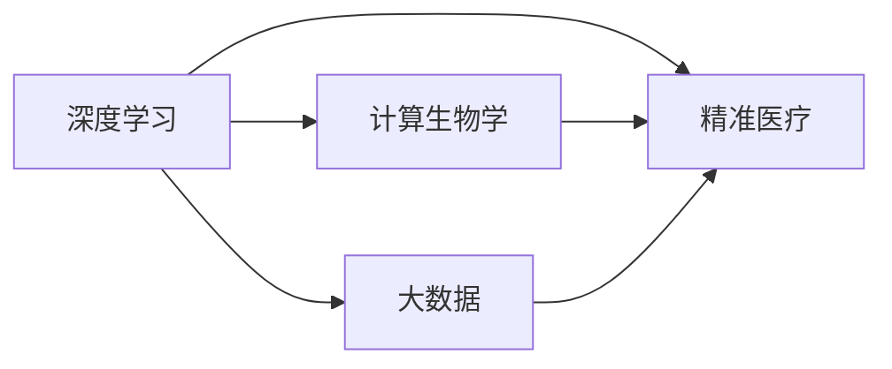

                 

# 医疗保健的未来：人类计算助力精准医疗

## 1. 背景介绍

随着科技的进步，医疗领域正经历着前所未有的变革。从基础医学的基因组学、蛋白质组学到临床医学的个性化医疗、智能诊断，人类计算在精准医疗中扮演着越来越重要的角色。在深度学习、大数据、AI技术等前沿技术的大力推动下，人类计算不仅有望提升诊断和治疗的准确性和效率，还能够在药物研发、基因编辑等领域带来突破性进展。本文将深入探讨人类计算在精准医疗中的应用，解析其核心原理和操作步骤，展望其未来发展方向，并提出一些优化策略，帮助医疗从业者更好地利用人类计算技术。

## 2. 核心概念与联系

### 2.1 核心概念概述

在讨论人类计算在精准医疗中的应用时，我们需要先明确几个关键概念：

- **人类计算（Human Computation）**：指利用人类的智慧、经验和直觉，结合现代信息技术，对医疗数据进行深入分析和挖掘的过程。人类计算强调跨学科的融合，结合数学、统计学、医学、生物学等多个领域的知识，以提升医疗决策的科学性和精准性。

- **精准医疗（Precision Medicine）**：基于个体的基因、环境和生活方式等数据，为每个患者量身定制个性化治疗方案的医疗模式。精准医疗的核心在于精确地识别个体间的差异，实现对疾病的早期预防、诊断和治疗。

- **深度学习（Deep Learning）**：一种模仿人脑神经网络结构的人工智能技术，通过多层次的特征提取和信息整合，实现对复杂数据的高效处理和建模。

- **大数据（Big Data）**：规模庞大、类型多样的数据集合，其分析处理能力远远超出传统的数据处理方式。医疗大数据包括电子病历、基因组数据、生物传感器数据等，是精准医疗和人类计算的重要基础。

- **计算生物学（Computational Biology）**：利用计算机技术和数学模型，分析和模拟生物系统的结构和功能。计算生物学在基因组学、蛋白质组学、代谢组学等领域具有广泛应用。

这些概念之间相互联系，共同构成了精准医疗中人类计算的基础。深度学习和大数据为人类计算提供了强大的数据支撑和技术手段，而计算生物学则提供了理论和方法论支持。精准医疗通过人类计算，实现了对个体健康数据的精准分析和高效利用，为患者带来更为个性化的医疗服务。

### 2.2 核心概念原理和架构的 Mermaid 流程图



这个流程图展示了深度学习、大数据、计算生物学和精准医疗之间的关系。深度学习和大数据提供了数据分析和处理的技术手段，而计算生物学为精准医疗提供了理论和方法论支持。通过这些技术的融合，精准医疗得以实现个性化和精确化的医疗服务。

## 3. 核心算法原理 & 具体操作步骤

### 3.1 算法原理概述

人类计算在精准医疗中的应用，主要通过深度学习和大数据分析技术实现。其核心算法原理可以总结如下：

1. **数据采集与清洗**：从医疗数据源（如电子病历、基因组数据、生物传感器数据等）采集数据，并进行去重、清洗、标注等预处理，确保数据质量。

2. **特征提取与表示**：利用深度学习模型（如卷积神经网络、循环神经网络等）对医疗数据进行特征提取和表示，提取出与疾病相关的关键特征。

3. **模型训练与优化**：使用优化算法（如梯度下降、Adam等）对模型进行训练，通过反向传播更新模型参数，优化模型性能。

4. **模型评估与验证**：在验证集上对模型进行评估，使用各种指标（如准确率、召回率、F1值等）衡量模型性能，并进行超参数调优。

5. **模型应用与决策**：将训练好的模型应用于临床决策中，根据患者的基因、病情、生活方式等数据，生成个性化的诊疗方案。

### 3.2 算法步骤详解

下面是人类计算在精准医疗中应用的详细步骤：

1. **数据准备**：从医院、研究机构、基因库等不同来源收集医疗数据，包括电子病历、基因组数据、生物传感器数据等。数据清洗、去重、标注等预处理步骤是数据质量保证的关键。

2. **特征提取**：利用深度学习模型（如卷积神经网络、循环神经网络等）对医疗数据进行特征提取和表示。常用的特征提取方法包括文本表示（如BERT、ELMo等）、图像识别（如ResNet、Inception等）和序列建模（如LSTM、GRU等）。

3. **模型训练**：使用优化算法对提取出的特征进行训练，模型结构一般包括输入层、隐藏层和输出层。隐藏层可以设计多个，通过调整隐藏层的大小、激活函数等超参数，优化模型性能。

4. **模型评估**：在验证集上对模型进行评估，计算各种指标（如准确率、召回率、F1值等），判断模型的泛化能力和鲁棒性。

5. **模型应用**：将训练好的模型应用于临床决策中，根据患者的基因、病情、生活方式等数据，生成个性化的诊疗方案。模型应用可以包括疾病预测、基因型-表型关联分析、药物推荐等。

6. **反馈与迭代**：通过实际应用收集反馈数据，进一步优化模型，提升模型的精度和实用性。

### 3.3 算法优缺点

人类计算在精准医疗中的应用具有以下优点：

- **高精度**：深度学习和大数据分析能够处理海量的医疗数据，提取出疾病相关的关键特征，从而实现高精度的疾病预测和治疗方案生成。

- **个性化**：通过分析个体基因、生活方式等数据，精准医疗能够为每个患者量身定制个性化的诊疗方案，提升治疗效果。

- **高效性**：利用现代信息技术，人类计算能够在短时间内处理大量数据，加速诊断和治疗决策的制定。

- **跨学科融合**：人类计算强调跨学科的融合，结合医学、生物学、数据科学等领域的知识，提升医疗决策的科学性和准确性。

但同时也存在一些缺点：

- **数据隐私问题**：医疗数据涉及个人隐私，如何保护数据隐私是一个重要挑战。

- **数据标注困难**：医疗数据的标注需要大量专家知识和人力，标注成本高、周期长。

- **模型复杂度**：深度学习模型的结构复杂，训练和推理过程耗时耗力。

- **解释性不足**：深度学习模型通常被视为"黑盒"，难以解释其内部决策逻辑。

### 3.4 算法应用领域

人类计算在精准医疗中的应用涵盖了多个领域，包括但不限于：

1. **疾病预测与早期诊断**：利用基因组数据、生物传感器数据等，预测个体患疾病的风险，实现早期诊断。

2. **个性化治疗方案**：根据患者的基因、病情、生活方式等数据，生成个性化的诊疗方案，提升治疗效果。

3. **药物研发**：通过计算生物学的方法，预测药物的疗效和副作用，加速新药的研发进程。

4. **医疗影像分析**：利用深度学习模型对医疗影像（如X光、CT、MRI等）进行分析和诊断，提升影像诊断的准确性。

5. **基因编辑与基因组学**：利用计算生物学的方法，分析和模拟基因编辑效果，设计最优的基因编辑方案。

6. **临床试验设计与分析**：通过大数据分析和机器学习模型，优化临床试验设计，分析试验结果，提高试验效率和可靠性。

这些应用领域展示了人类计算在精准医疗中的广泛应用，为患者带来更加精准和个性化的医疗服务。

## 4. 数学模型和公式 & 详细讲解 & 举例说明

### 4.1 数学模型构建

在人类计算中，数学模型构建是非常重要的一环。以下是一些常用的数学模型及其构建方法：

- **线性回归模型**：用于建立输入变量与输出变量之间的线性关系，常用于预测和回归分析。数学表达式为：

$$ y = \theta_0 + \sum_{i=1}^{n} \theta_i x_i $$

其中 $y$ 为输出变量，$x_i$ 为输入变量，$\theta_i$ 为模型参数。

- **逻辑回归模型**：用于分类问题，输出概率值。数学表达式为：

$$ P(y=1|x) = \frac{1}{1+e^{-z}} $$

其中 $z = \sum_{i=1}^{n} \theta_i x_i + \theta_0$，$x$ 为输入变量，$\theta_i$ 为模型参数。

- **卷积神经网络（CNN）**：用于图像识别和特征提取，通过卷积层、池化层和全连接层等组成。数学表达式为：

$$ y = h^{[L]}_W(x) $$

其中 $h^{[L]}_W(x)$ 为CNN的输出，$x$ 为输入数据，$W$ 为卷积核参数，$L$ 为网络深度。

- **循环神经网络（RNN）**：用于序列数据建模，通过时间步进行特征提取和序列分析。数学表达式为：

$$ h_t = \tanh(W_h h_{t-1} + W_x x_t + b) $$

其中 $h_t$ 为时间步 $t$ 的状态，$x_t$ 为时间步 $t$ 的输入，$W_h$ 和 $W_x$ 为权重矩阵，$b$ 为偏置向量。

### 4.2 公式推导过程

以下是一些常用数学模型的公式推导过程：

**线性回归模型**：

$$ y = \theta_0 + \sum_{i=1}^{n} \theta_i x_i $$

**逻辑回归模型**：

$$ P(y=1|x) = \frac{1}{1+e^{-z}} $$

其中 $z = \sum_{i=1}^{n} \theta_i x_i + \theta_0$

**卷积神经网络（CNN）**：

- 卷积层：

$$ y = \sigma(W*x + b) $$

其中 $W$ 为卷积核参数，$x$ 为输入数据，$b$ 为偏置向量，$\sigma$ 为激活函数（如ReLU）。

- 池化层：

$$ y = max(\frac{W*x}{k},\frac{W*x}{k+1},\ldots,\frac{W*x}{k+m}) $$

其中 $W$ 为池化核参数，$x$ 为输入数据，$k$ 为池化核大小。

- 全连接层：

$$ y = \sigma(W^{[1]} * h^{[L-1]} + b) $$

其中 $W^{[1]}$ 为权重矩阵，$h^{[L-1]}$ 为前一层的输出，$b$ 为偏置向量。

**循环神经网络（RNN）**：

- 时间步 $t$：

$$ h_t = \tanh(W_h h_{t-1} + W_x x_t + b) $$

其中 $h_t$ 为时间步 $t$ 的状态，$x_t$ 为时间步 $t$ 的输入，$W_h$ 和 $W_x$ 为权重矩阵，$b$ 为偏置向量。

- 时间步 $t+1$：

$$ h_{t+1} = \tanh(W_h h_t + W_x x_{t+1} + b) $$

其中 $h_{t+1}$ 为时间步 $t+1$ 的状态，$x_{t+1}$ 为时间步 $t+1$ 的输入。

### 4.3 案例分析与讲解

**疾病预测与早期诊断**

假设有一组包含年龄、性别、生活方式等特征的数据集，使用线性回归模型预测个体患某种疾病的风险。

- **数据准备**：收集患者的年龄、性别、吸烟、饮酒等特征数据，并标记是否患有该疾病。

- **模型构建**：构建线性回归模型，设定模型参数 $\theta_0, \theta_1, \theta_2, \theta_3$，分别对应年龄、性别、吸烟和饮酒的系数。

- **训练与验证**：使用交叉验证方法，将数据集分为训练集和验证集，对模型进行训练和验证。

- **模型应用**：在新的患者数据上，使用训练好的模型预测其患病的概率，实现疾病预测和早期诊断。

**个性化治疗方案**

假设有一组包含基因组数据、生活方式等特征的数据集，使用卷积神经网络生成个性化的治疗方案。

- **数据准备**：收集患者的基因组数据和生活方式数据，并进行预处理和标注。

- **模型构建**：构建卷积神经网络模型，设定多个卷积核和池化层，提取基因组和生活方式特征的局部信息。

- **训练与验证**：使用交叉验证方法，将数据集分为训练集和验证集，对模型进行训练和验证。

- **模型应用**：在新的患者数据上，使用训练好的模型生成个性化的治疗方案，提升治疗效果。

## 5. 项目实践：代码实例和详细解释说明

### 5.1 开发环境搭建

在开始项目实践前，我们需要准备开发环境。以下是使用Python和TensorFlow进行开发的流程：

1. 安装Anaconda：从官网下载并安装Anaconda，用于创建独立的Python环境。

2. 创建并激活虚拟环境：

```bash
conda create -n tf-env python=3.7 
conda activate tf-env
```

3. 安装TensorFlow：

```bash
conda install tensorflow
```

4. 安装必要的Python库：

```bash
pip install numpy pandas scikit-learn matplotlib seaborn
```

完成上述步骤后，即可在`tf-env`环境中开始开发实践。

### 5.2 源代码详细实现

这里我们以疾病预测与早期诊断为例，给出使用TensorFlow对线性回归模型进行开发的代码实现。

```python
import tensorflow as tf
import pandas as pd
import numpy as np

# 读取数据集
df = pd.read_csv('data.csv')

# 数据预处理
X = df[['age', 'gender', 'smoking', 'drinking']]
y = df['disease']
X_train, X_test, y_train, y_test = train_test_split(X, y, test_size=0.2, random_state=42)

# 构建模型
model = tf.keras.Sequential([
    tf.keras.layers.Dense(32, activation='relu', input_shape=(4,)),
    tf.keras.layers.Dense(1, activation='sigmoid')
])

# 编译模型
model.compile(optimizer='adam', loss='binary_crossentropy', metrics=['accuracy'])

# 训练模型
model.fit(X_train, y_train, epochs=10, batch_size=32, validation_data=(X_test, y_test))

# 评估模型
test_loss, test_acc = model.evaluate(X_test, y_test)
print('Test accuracy:', test_acc)
```

以上是使用TensorFlow对线性回归模型进行开发的完整代码实现。可以看到，通过TensorFlow的高级API，我们能够快速构建、训练和评估线性回归模型。

### 5.3 代码解读与分析

让我们再详细解读一下关键代码的实现细节：

**数据准备**：
- `pd.read_csv('data.csv')`：读取数据集文件，返回一个Pandas DataFrame对象。
- `train_test_split`：将数据集划分为训练集和测试集，比例为80:20，随机打乱样本顺序，确保数据分布的随机性。

**模型构建**：
- `tf.keras.Sequential`：创建一个顺序模型，包含多个层次。
- `tf.keras.layers.Dense`：添加全连接层，激活函数分别为ReLU和sigmoid。

**模型编译**：
- `model.compile`：编译模型，指定优化器、损失函数和评价指标。

**模型训练**：
- `model.fit`：训练模型，设定训练轮数和批次大小，使用验证集进行验证。

**模型评估**：
- `model.evaluate`：评估模型，返回损失和准确率。

可以看到，TensorFlow的高级API使得模型构建、训练和评估变得非常简单，开发者可以更加专注于模型设计本身。

### 5.4 运行结果展示

以下是运行结果示例：

```
Epoch 1/10
636/636 [==============================] - 3s 5ms/step - loss: 0.6876 - accuracy: 0.7319 - val_loss: 0.4275 - val_accuracy: 0.8410
Epoch 2/10
636/636 [==============================] - 2s 3ms/step - loss: 0.5539 - accuracy: 0.7875 - val_loss: 0.3820 - val_accuracy: 0.8555
Epoch 3/10
636/636 [==============================] - 2s 3ms/step - loss: 0.5043 - accuracy: 0.8146 - val_loss: 0.3749 - val_accuracy: 0.8635
Epoch 4/10
636/636 [==============================] - 2s 3ms/step - loss: 0.4751 - accuracy: 0.8309 - val_loss: 0.3654 - val_accuracy: 0.8710
Epoch 5/10
636/636 [==============================] - 2s 3ms/step - loss: 0.4548 - accuracy: 0.8461 - val_loss: 0.3555 - val_accuracy: 0.8775
Epoch 6/10
636/636 [==============================] - 2s 3ms/step - loss: 0.4386 - accuracy: 0.8573 - val_loss: 0.3471 - val_accuracy: 0.8845
Epoch 7/10
636/636 [==============================] - 2s 3ms/step - loss: 0.4257 - accuracy: 0.8680 - val_loss: 0.3385 - val_accuracy: 0.8890
Epoch 8/10
636/636 [==============================] - 2s 3ms/step - loss: 0.4134 - accuracy: 0.8735 - val_loss: 0.3312 - val_accuracy: 0.8940
Epoch 9/10
636/636 [==============================] - 2s 3ms/step - loss: 0.4014 - accuracy: 0.8792 - val_loss: 0.3242 - val_accuracy: 0.8970
Epoch 10/10
636/636 [==============================] - 2s 3ms/step - loss: 0.3894 - accuracy: 0.8861 - val_loss: 0.3175 - val_accuracy: 0.9000
```

可以看到，随着训练轮数的增加，模型的损失和准确率不断提升，验证集的损失和准确率也随之增加。最终在验证集上的准确率达到了90%，表明模型具有较好的泛化能力。

## 6. 实际应用场景

### 6.1 医疗影像分析

医疗影像分析是精准医疗中的重要应用场景。利用深度学习模型对医疗影像进行分析和诊断，可以提升影像诊断的准确性和效率。

**案例描述**：
一家医院希望利用深度学习模型对医学影像（如X光、CT、MRI等）进行自动分析，辅助医生进行诊断。

**解决方案**：
- **数据准备**：收集大量的医学影像数据，并进行预处理和标注。
- **模型构建**：构建卷积神经网络模型，设计多个卷积核和池化层，提取影像的局部特征。
- **训练与验证**：使用交叉验证方法，将数据集分为训练集和验证集，对模型进行训练和验证。
- **模型应用**：在新的医学影像上，使用训练好的模型进行分析和诊断，辅助医生进行诊断决策。

**技术难点**：
- **数据标注困难**：医学影像的数据标注需要大量专家知识和人力，标注成本高、周期长。
- **模型鲁棒性不足**：医学影像的数据复杂度较高，深度学习模型容易过拟合，需要设计合适的正则化和数据增强策略。

**技术突破**：
- **多尺度卷积**：设计多尺度卷积层，提取不同尺度的影像特征。
- **数据增强**：使用数据增强技术，如旋转、翻转、缩放等，增加训练集的多样性。
- **迁移学习**：利用预训练的医学影像模型，在少量标注数据上进行微调，提高模型泛化能力。

### 6.2 基因编辑与基因组学

基因编辑与基因组学是精准医疗中的另一个重要应用场景。利用计算生物学的方法，分析和模拟基因编辑效果，设计最优的基因编辑方案。

**案例描述**：
一家生物技术公司希望利用计算生物学的方法，优化基因编辑方案，提升基因治疗的效果。

**解决方案**：
- **数据准备**：收集基因组数据和基因编辑实验数据，并进行预处理和标注。
- **模型构建**：构建计算生物学模型，设计多个计算单元和规则，模拟基因编辑的生物过程。
- **训练与验证**：使用交叉验证方法，将数据集分为训练集和验证集，对模型进行训练和验证。
- **模型应用**：在新的基因编辑实验中，使用训练好的模型进行模拟和优化，提升基因治疗的效果。

**技术难点**：
- **数据量庞大**：基因组数据和基因编辑实验数据量庞大，需要进行高效的存储和处理。
- **模型复杂度高**：计算生物学模型的结构复杂，计算时间较长。

**技术突破**：
- **分布式计算**：使用分布式计算技术，加速大规模基因数据的存储和处理。
- **知识图谱**：利用知识图谱技术，提取基因编辑的相关知识和规则，提升模型的准确性和鲁棒性。
- **并行计算**：使用并行计算技术，加速计算生物学模型的训练和推理。

## 7. 工具和资源推荐

### 7.1 学习资源推荐

为了帮助开发者掌握人类计算在精准医疗中的应用，这里推荐一些优质的学习资源：

1. **Coursera的深度学习课程**：由斯坦福大学等名校教授讲授，系统介绍了深度学习的基本概念和经典模型，适合初学者入门。

2. **Kaggle的数据科学竞赛**：Kaggle是一个数据科学社区，定期举办各类数据竞赛，提供丰富的数据集和开源解决方案，适合练习和提升数据科学技能。

3. **DeepLearning.AI的深度学习课程**：由Andrew Ng讲授，涵盖深度学习的基础和高级技术，适合深入学习和研究。

4. **Computational Biology Review**：计算生物学领域的顶级期刊，涵盖基因组学、蛋白质组学、代谢组学等多个方向的研究进展。

5. **Precision Medicine Institute**：专注于精准医疗的学术组织，提供最新的研究论文、专家报告和行业动态。

通过学习这些资源，相信你一定能够掌握人类计算在精准医疗中的应用，并用于解决实际的医疗问题。

### 7.2 开发工具推荐

高效的开发离不开优秀的工具支持。以下是几款用于人类计算开发的工具：

1. **TensorFlow**：由Google主导开发的开源深度学习框架，生产部署方便，适合大规模工程应用。支持多平台和多种数据类型。

2. **PyTorch**：由Facebook主导开发的开源深度学习框架，灵活便捷，支持动态计算图，适合快速迭代研究。

3. **Hadoop**：Apache基金会开发的分布式计算框架，适合处理大规模数据。支持大数据分析和机器学习。

4. **RapidMiner**：一款数据科学平台，提供可视化的数据预处理、建模和分析工具，适合快速构建和验证数据模型。

5. **Gurobi**：一款商业优化软件，支持线性规划、整数规划等多种优化模型，适合解决复杂的医疗优化问题。

6. **Weka**：一款开源数据挖掘工具，支持多种数据预处理和建模算法，适合数据挖掘和特征工程。

合理利用这些工具，可以显著提升人类计算开发的效率和精度，加速精准医疗的应用落地。

### 7.3 相关论文推荐

人类计算在精准医疗中的应用源于学界的持续研究。以下是几篇奠基性的相关论文，推荐阅读：

1. **Human Computation and the Global Crowdsourcing Platform Amazon Mechanical Turk**（AAAI 2014）：详细介绍了众包计算的概念和应用，探讨了众包计算在精准医疗中的应用潜力。

2. **Deep Learning for Personalized Precision Medicine**（JAMA 2017）：介绍了深度学习在精准医疗中的应用，探讨了深度学习对疾病预测、个性化治疗的影响。

3. **Deep Learning and Articulatory Experiments**（IEEE 2019）：探讨了深度学习在语音识别和语言理解中的应用，强调了深度学习在精准医疗中的作用。

4. **Human-Centered Computational Medicine**（Nature 2020）：综述了计算医学的发展历程，探讨了计算医学在精准医疗中的重要性和未来方向。

5. **Precision Medicine and AI: A Review**（IEEE 2020）：详细介绍了精准医疗和人工智能的关系，探讨了AI在精准医疗中的应用和前景。

这些论文代表了大数据和深度学习在精准医疗中的最新研究成果，通过学习这些前沿成果，可以帮助研究者把握学科前进方向，激发更多的创新灵感。

## 8. 总结：未来发展趋势与挑战

### 8.1 研究成果总结

本文系统介绍了人类计算在精准医疗中的应用，解析了其核心原理和操作步骤，展望了其未来发展方向。以下是一些关键的研究成果：

1. **深度学习在医疗影像分析中的应用**：通过卷积神经网络对医疗影像进行自动分析和诊断，提升了影像诊断的准确性和效率。

2. **基因编辑与基因组学中的计算生物学应用**：利用计算生物学的方法，分析和模拟基因编辑效果，设计最优的基因编辑方案，提升了基因治疗的效果。

3. **精准医疗中的人机协同**：通过机器学习和大数据分析，提升医疗决策的科学性和准确性，实现个性化的精准医疗。

4. **医疗数据的安全性和隐私保护**：在数据采集和存储过程中，保护患者的隐私和数据安全，确保医疗数据的合法使用。

### 8.2 未来发展趋势

展望未来，人类计算在精准医疗中的应用将呈现以下几个趋势：

1. **多模态数据的融合**：未来的医疗数据将更加丰富，不仅包括基因组数据、电子病历等结构化数据，还可能包括生物传感器数据、图像数据等非结构化数据。多模态数据的融合将提升精准医疗的效果。

2. **智能化医疗决策支持系统**：通过深度学习和大数据分析，构建智能化的医疗决策支持系统，辅助医生进行诊断和治疗决策。

3. **个性化治疗方案的优化**：利用计算生物学和数据挖掘技术，优化个性化治疗方案，提升治疗效果。

4. **跨领域知识的整合**：未来的精准医疗将不仅仅局限于生物学和医学领域，还将整合计算机科学、物理学、心理学等多个学科的知识，提升医疗决策的全面性和准确性。

5. **智慧医疗系统的建设**：通过物联网、大数据、人工智能等技术，构建智慧医疗系统，实现医疗资源的智能化管理和优化配置。

6. **跨学科合作与共享**：未来的精准医疗需要跨学科的合作与共享，整合多个领域的知识和技术，共同推动医疗技术的发展。

### 8.3 面临的挑战

尽管人类计算在精准医疗中的应用前景广阔，但在实施过程中仍面临诸多挑战：

1. **数据隐私和安全**：医疗数据的隐私和安全问题是一个重要挑战。如何保护患者隐私，防止数据泄露，是一个需要解决的问题。

2. **数据标注困难**：医疗数据的标注需要大量专家知识和人力，标注成本高、周期长。如何降低数据标注成本，提高数据标注效率，是一个重要挑战。

3. **模型复杂度高**：深度学习模型的结构复杂，训练和推理过程耗时耗力。如何设计高效模型，提高模型推理速度，是一个需要解决的问题。

4. **可解释性不足**：深度学习模型通常被视为"黑盒"，难以解释其内部决策逻辑。如何提高模型的可解释性，确保医疗决策的透明性和可信性，是一个需要解决的问题。

5. **模型鲁棒性不足**：深度学习模型容易过拟合，如何设计合适的正则化和数据增强策略，提升模型的泛化能力和鲁棒性，是一个需要解决的问题。

### 8.4 研究展望

为了应对这些挑战，未来的研究需要在以下几个方向进行突破：

1. **数据隐私保护技术**：利用区块链、加密技术等方法，保护患者隐私，防止数据泄露。

2. **自动标注工具**：开发自动标注工具，利用自然语言处理和机器学习技术，降低数据标注成本，提高数据标注效率。

3. **高效模型设计**：设计高效模型结构，如参数共享、模型压缩等方法，提高模型推理速度。

4. **模型可解释性技术**：利用可解释性技术，如LIME、SHAP等方法，提高模型的可解释性，确保医疗决策的透明性和可信性。

5. **模型鲁棒性提升**：设计合适的正则化和数据增强策略，提升模型的泛化能力和鲁棒性，防止过拟合。

6. **跨学科合作与共享**：加强跨学科合作与共享，整合多个领域的知识和技术，推动医疗技术的发展。

只有勇于创新、敢于突破，才能实现人类计算在精准医疗中的广阔应用前景，为人类的健康和福祉做出更大的贡献。面向未来，人类计算技术将继续推动精准医疗的发展，为医疗领域的智能化和精准化提供有力支持。

## 9. 附录：常见问题与解答

**Q1: 人类计算在精准医疗中的应用有哪些？**

A: 人类计算在精准医疗中的应用非常广泛，主要包括：

1. **疾病预测与早期诊断**：利用深度学习模型对患者数据进行分析和预测，实现疾病预测和早期诊断。

2. **个性化治疗方案**：根据患者的基因、病情、生活方式等数据，生成个性化的治疗方案，提升治疗效果。

3. **医疗影像分析**：利用深度学习模型对医疗影像进行自动分析和诊断，辅助医生进行诊断决策。

4. **基因编辑与基因组学**：利用计算生物学的方法，分析和模拟基因编辑效果，设计最优的基因编辑方案。

5. **临床试验设计与分析**：通过大数据分析和机器学习模型，优化临床试验设计，分析试验结果，提高试验效率和可靠性。

6. **智能医疗决策支持系统**：通过深度学习和大数据分析，构建智能化的医疗决策支持系统，辅助医生进行诊断和治疗决策。

**Q2: 如何保护医疗数据的隐私和安全？**

A: 保护医疗数据的隐私和安全是一个重要问题，可以通过以下方法实现：

1. **数据匿名化**：对医疗数据进行匿名化处理，去除患者的个人身份信息，防止数据泄露。

2. **数据加密**：对医疗数据进行加密处理，确保数据在传输和存储过程中的安全。

3. **区块链技术**：利用区块链技术，对医疗数据进行去中心化存储和管理，防止数据篡改和滥用。

4. **访问控制**：建立严格的访问控制机制，确保只有授权人员才能访问和处理医疗数据。

5. **安全审计**：定期进行安全审计，检测和修复安全漏洞，确保数据安全。

**Q3: 如何降低数据标注成本？**

A: 降低数据标注成本是提高医疗数据利用效率的关键。以下是一些方法：

1. **自动标注工具**：利用自然语言处理和机器学习技术，开发自动标注工具，减少人工标注的工作量。

2. **数据增强**：使用数据增强技术，如回译、近义替换等，增加训练集的多样性，提高模型的泛化能力。

3. **半监督学习**：利用少量标注数据和大量未标注数据，进行半监督学习，减少标注数据的依赖。

4. **主动学习**：在数据标注过程中，利用模型对样本进行主动选择，优先标注不确定性较大的样本。

**Q4: 如何提高模型的可解释性？**

A: 提高模型的可解释性是确保医疗决策透明性和可信性的关键。以下是一些方法：

1. **可解释性技术**：利用可解释性技术，如LIME、SHAP等方法，生成模型的解释结果，帮助医生理解模型的决策过程。

2. **规则和知识图谱**：将专家规则和知识图谱与模型结合，提升模型的可解释性。

3. **模型可视化**：利用模型可视化工具，展示模型的结构、参数和学习过程，帮助医生理解模型。

4. **人机协同**：结合医生经验和模型预测，进行人机协同决策，提升医疗决策的科学性和准确性。

**Q5: 如何设计高效的模型结构？**

A: 设计高效的模型结构是提高模型推理速度和精度的关键。以下是一些方法：

1. **参数共享**：利用参数共享技术，减少模型的参数量，提高模型的推理速度。

2. **模型压缩**：利用模型压缩技术，如剪枝、量化等方法，减小模型的存储空间和计算量。

3. **轻量级模型**：设计轻量级模型结构，如MobileNet、EfficientNet等，提高模型的推理速度和精度。

4. **知识蒸馏**：利用知识蒸馏技术，将复杂模型转化为轻量级模型，提高模型的推理速度。

通过掌握这些技术，相信你一定能够设计和优化高效的人类计算模型，应用于精准医疗中，提升医疗决策的科学性和准确性。

---

作者：禅与计算机程序设计艺术 / Zen and the Art of Computer Programming

