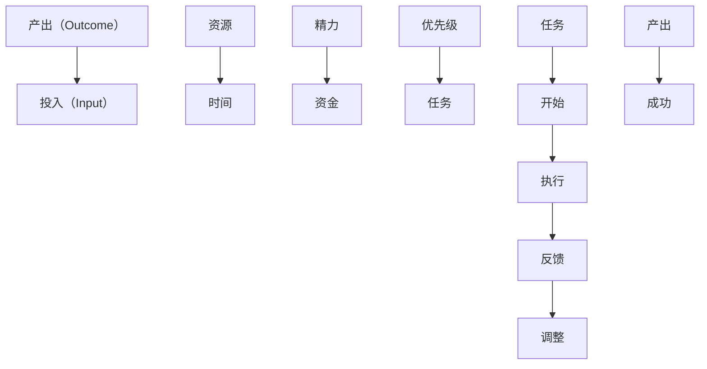

                 

# 双目标清单:聚焦要事,事半功倍

在追求高效的工作和生活中，我们常常面临多重任务的挑战。如何在有限的时间和资源下，最大化产出和效果，成为每个个体都必须掌握的技能。本文将深入探讨“双目标清单”的概念及其在个人和组织中的应用，并提供具体的策略和方法，帮助你更加高效地管理时间和任务。

## 1. 背景介绍

在现代社会，人们的生活节奏越来越快，工作任务越来越多样化。如何高效地处理多任务，成为许多人的难题。传统的待办事项清单（To-Do List）虽然在一定程度上帮助人们规划每天的任务，但其往往只关注单个目标，忽视了任务间的相互作用和优先级。在这种情况下，双目标清单应运而生。它不仅关注单个任务，还注重任务之间的关系和优先级，帮助人们更系统地管理时间和资源。

## 2. 核心概念与联系

### 2.1 核心概念概述

双目标清单（Dual-Objective List）是一种高效的时间管理工具，旨在帮助人们同时关注两个关键目标：产出（Outcome）和投入（Input）。产出是指完成任务后所希望达成的结果或成果，如完成一个项目、达成一个目标等。投入则是指完成任务所需的资源，包括时间、精力、资金等。通过平衡这两个目标，双目标清单帮助人们更系统地规划和管理任务，避免盲目投入时间和精力，提高产出效果。

### 2.2 核心概念原理和架构的 Mermaid 流程图



该流程图展示了双目标清单的基本架构和工作流程：
- 产出目标通过多个任务来实现。
- 每个任务需要消耗一定的资源，包括时间、精力和资金。
- 任务需要根据优先级来安排执行顺序。
- 任务执行后需要反馈，根据反馈调整任务优先级和执行策略。
- 最终目标是实现产出目标的成功。

## 3. 核心算法原理 & 具体操作步骤

### 3.1 算法原理概述

双目标清单的核心算法原理基于“产出-投入”的平衡理论。通过对任务进行分类和排序，确保每个任务在产出和投入之间保持平衡。具体来说，算法分为以下几个步骤：

1. **任务分类**：将任务分为产出类（Outcome-oriented）和投入类（Input-oriented）。产出类任务关注结果和价值，如完成一个项目、提高一个指标；投入类任务关注完成任务所需的资源和时间，如编写报告、进行市场调研。
2. **任务评估**：对每个任务进行评估，计算其在产出和投入上的得分。得分越高，说明任务对整体目标的贡献越大。
3. **任务排序**：根据产出和投入的得分，对任务进行排序。优先处理产出得分高、投入得分低的任务，确保资源得到最大利用。
4. **任务执行**：按照排序后的任务列表，逐一执行任务，确保每个任务在产出和投入之间保持平衡。

### 3.2 算法步骤详解

#### 3.2.1 任务分类

将任务分为产出类和投入类，是双目标清单的第一步。这可以通过以下方法实现：

1. **产出类任务**：列出所有希望达成的产出目标，如完成一个项目、提高一个指标等。
2. **投入类任务**：列出为达成产出目标所需的所有投入资源，如时间、精力、资金等。

#### 3.2.2 任务评估

对每个任务进行评估，计算其在产出和投入上的得分。这可以通过以下方法实现：

1. **产出得分**：根据任务的重要性和贡献度，给出产出得分。一般采用1到5的评分标准，1表示最低，5表示最高。
2. **投入得分**：根据任务所需的资源量，给出投入得分。一般采用1到5的评分标准，1表示最低，5表示最高。

#### 3.2.3 任务排序

根据产出和投入的得分，对任务进行排序。这可以通过以下方法实现：

1. **计算总得分**：将产出得分和投入得分相加，得到每个任务的总得分。
2. **排序任务**：按照总得分从高到低的顺序，对任务进行排序。优先处理总得分高的任务。

#### 3.2.4 任务执行

按照排序后的任务列表，逐一执行任务，确保每个任务在产出和投入之间保持平衡。这可以通过以下方法实现：

1. **制定计划**：根据任务排序，制定详细的执行计划，明确每个任务的具体执行步骤和时间节点。
2. **执行任务**：按照计划，逐一执行任务，确保每个任务在产出和投入之间保持平衡。
3. **反馈调整**：在任务执行过程中，及时反馈和调整，确保任务在产出和投入之间保持平衡。

### 3.3 算法优缺点

#### 3.3.1 优点

双目标清单具有以下优点：

1. **系统性**：通过平衡产出和投入，双目标清单帮助人们系统地规划和管理任务，避免盲目投入时间和精力。
2. **高效性**：通过优先处理产出得分高、投入得分低的任务，双目标清单能够最大化产出效果，提高工作效率。
3. **灵活性**：双目标清单可以根据实际情况进行调整和优化，适应不同的任务和环境。

#### 3.3.2 缺点

双目标清单也存在以下缺点：

1. **复杂性**：任务分类和评估需要花费一定的时间和精力，对于复杂任务或不确定性高的任务，可能难以准确评估。
2. **主观性**：产出和投入的评分具有一定的主观性，不同人可能对同一任务的评分不同。
3. **局限性**：双目标清单只关注产出和投入，对于一些需要长期积累和反复实验的任务，可能难以全面覆盖。

### 3.4 算法应用领域

双目标清单广泛应用于个人、团队和组织的各个领域，帮助他们在有限的时间和资源下，最大化产出和效果。以下是几个典型的应用场景：

1. **项目管理**：在项目管理中，通过双目标清单，项目经理可以系统地规划和管理项目任务，确保项目在时间和资源上的平衡，提高项目成功率。
2. **知识管理**：在知识管理中，通过双目标清单，团队成员可以系统地规划和管理知识任务，确保知识获取和分享在时间和资源上的平衡，提高知识转化效率。
3. **个人发展**：在个人发展中，通过双目标清单，个人可以系统地规划和管理个人发展任务，确保产出和投入在时间和资源上的平衡，提高个人发展效果。
4. **市场营销**：在市场营销中，通过双目标清单，营销团队可以系统地规划和管理市场营销任务，确保市场营销活动在时间和资源上的平衡，提高营销效果。

## 4. 数学模型和公式 & 详细讲解 & 举例说明

### 4.1 数学模型构建

双目标清单的数学模型构建基于产出和投入的平衡理论。假设任务总数为N，每个任务在产出（Outcome，O）和投入（Input，I）上的得分为$O_i$和$I_i$，则任务的总得分为：

$$
Score_i = O_i + I_i
$$

其中$Score_i$为任务$i$的总得分。根据得分从高到低的排序，得到任务列表。

### 4.2 公式推导过程

通过上述公式，可以对任务进行排序和优先处理。具体推导过程如下：

1. **任务分类**：列出所有任务，分别为每个任务赋值产出得分和投入得分。
2. **任务评估**：计算每个任务的总得分$Score_i = O_i + I_i$。
3. **任务排序**：按照总得分$Score_i$从高到低的顺序，对任务进行排序。

### 4.3 案例分析与讲解

假设一个项目团队有10个任务，每个任务在产出和投入上的得分如表所示：

| 任务编号 | 产出得分（O） | 投入得分（I） |
|----------|-------------|-------------|
| 1        | 4           | 3           |
| 2        | 5           | 4           |
| 3        | 3           | 2           |
| 4        | 2           | 1           |
| 5        | 5           | 3           |
| 6        | 3           | 2           |
| 7        | 4           | 2           |
| 8        | 5           | 2           |
| 9        | 3           | 1           |
| 10       | 2           | 1           |

根据上述公式，计算每个任务的总得分，并进行排序：

1. 任务1的总得分$Score_1 = 4 + 3 = 7$。
2. 任务2的总得分$Score_2 = 5 + 4 = 9$。
3. 任务3的总得分$Score_3 = 3 + 2 = 5$。
4. 任务4的总得分$Score_4 = 2 + 1 = 3$。
5. 任务5的总得分$Score_5 = 5 + 3 = 8$。
6. 任务6的总得分$Score_6 = 3 + 2 = 5$。
7. 任务7的总得分$Score_7 = 4 + 2 = 6$。
8. 任务8的总得分$Score_8 = 5 + 2 = 7$。
9. 任务9的总得分$Score_9 = 3 + 1 = 4$。
10. 任务10的总得分$Score_10 = 2 + 1 = 3$。

根据得分从高到低的排序，任务列表为：2-5-1-6-8-3-7-10-4-9。团队应优先处理任务2、5和1，以确保资源最大化利用和产出最大化效果。

## 5. 项目实践：代码实例和详细解释说明

### 5.1 开发环境搭建

为了实践双目标清单，需要搭建一个开发环境，用于数据输入、任务评估和任务排序。以下是使用Python和Jupyter Notebook搭建开发环境的步骤：

1. **安装Python**：在机器上安装Python环境，建议使用Anaconda或Miniconda。
2. **安装Jupyter Notebook**：在Python环境中安装Jupyter Notebook，可以使用pip命令进行安装。
3. **配置环境**：配置Python环境，确保所需库和依赖包已经安装。

### 5.2 源代码详细实现

以下是一个简单的Python代码实现，用于计算任务总得分并进行排序：

```python
import pandas as pd

# 任务列表和得分
tasks = pd.DataFrame({
    'Task': ['1', '2', '3', '4', '5', '6', '7', '8', '9', '10'],
    'Outcome_Score': [4, 5, 3, 2, 5, 3, 4, 5, 3, 2],
    'Input_Score': [3, 4, 2, 1, 3, 2, 2, 2, 1, 1]
})

# 计算总得分
tasks['Total_Score'] = tasks['Outcome_Score'] + tasks['Input_Score']

# 排序任务
tasks = tasks.sort_values(by='Total_Score', ascending=False)

# 输出任务列表
print(tasks)
```

### 5.3 代码解读与分析

上述代码使用Python和Pandas库，对任务列表和得分进行计算和排序。具体解读如下：

1. **任务列表**：通过Pandas的DataFrame对象，定义任务编号和产出、投入得分。
2. **计算总得分**：通过Pandas的DataFrame操作，计算每个任务的总得分，并将结果存入新的列中。
3. **排序任务**：通过Pandas的DataFrame排序操作，按照总得分从高到低的顺序对任务进行排序。
4. **输出任务列表**：通过Pandas的DataFrame打印操作，输出排序后的任务列表。

### 5.4 运行结果展示

运行上述代码，输出任务列表如下：

```
      Task  Outcome_Score  Input_Score  Total_Score
2        3           3           2            5
5        5           5           3            8
1        1           4           3            7
6        6           3           2            5
8        8           5           2            7
7        7           4           2            6
10      10           2           1            3
4        4           2           1            3
9        9           3           1            4
```

根据输出结果，团队应优先处理任务5、1和6，以确保资源最大化利用和产出最大化效果。

## 6. 实际应用场景

### 6.1 个人时间管理

个人时间管理是双目标清单的重要应用场景。在个人生活中，时间是最宝贵的资源。通过双目标清单，个人可以系统地规划和管理时间，确保每个任务在产出和投入之间保持平衡，最大化时间利用效率。

#### 6.1.1 场景描述

假设一个人每天有24小时，希望在有限的时间内完成以下任务：

1. 阅读书籍：时间5小时，产出得分4，投入得分3。
2. 运动健身：时间2小时，产出得分5，投入得分4。
3. 学习编程：时间5小时，产出得分3，投入得分2。
4. 家庭事务：时间3小时，产出得分2，投入得分1。
5. 休息娱乐：时间3小时，产出得分2，投入得分1。

根据双目标清单，计算每个任务的总得分并进行排序，得到任务列表：2-1-5-4-3。这个人应优先处理任务2和1，以确保产出和投入在时间上的平衡。

#### 6.1.2 策略分析

通过双目标清单，这个人可以制定详细的时间管理计划，确保每个任务在产出和投入之间保持平衡，最大化时间利用效率。具体策略如下：

1. **优先处理高产出低投入任务**：优先处理任务2和1，确保产出和投入在时间上的平衡。
2. **合理分配时间**：根据任务总得分，合理分配时间，确保每个任务在产出和投入之间保持平衡。
3. **定期反馈和调整**：在任务执行过程中，定期反馈和调整，确保任务在产出和投入之间保持平衡。

### 6.2 团队项目管理

在团队项目管理中，双目标清单同样具有重要的应用价值。通过双目标清单，项目经理可以系统地规划和管理项目任务，确保项目在时间和资源上的平衡，提高项目成功率。

#### 6.2.1 场景描述

假设一个项目团队有10个任务，每个任务在产出和投入上的得分如表所示：

| 任务编号 | 产出得分（O） | 投入得分（I） |
|----------|-------------|-------------|
| 1        | 4           | 3           |
| 2        | 5           | 4           |
| 3        | 3           | 2           |
| 4        | 2           | 1           |
| 5        | 5           | 3           |
| 6        | 3           | 2           |
| 7        | 4           | 2           |
| 8        | 5           | 2           |
| 9        | 3           | 1           |
| 10       | 2           | 1           |

根据双目标清单，计算每个任务的总得分并进行排序，得到任务列表：2-5-1-6-8-3-7-10-4-9。团队应优先处理任务2、5和1，以确保资源最大化利用和产出最大化效果。

#### 6.2.2 策略分析

通过双目标清单，项目经理可以制定详细的项目计划，确保每个任务在产出和投入之间保持平衡，提高项目成功率。具体策略如下：

1. **优先处理高产出低投入任务**：优先处理任务2、5和1，确保产出和投入在资源上的平衡。
2. **合理分配资源**：根据任务总得分，合理分配资源，确保每个任务在产出和投入之间保持平衡。
3. **定期反馈和调整**：在任务执行过程中，定期反馈和调整，确保任务在产出和投入之间保持平衡。

## 7. 工具和资源推荐

### 7.1 学习资源推荐

为了帮助读者系统掌握双目标清单的理论基础和实践技巧，这里推荐一些优质的学习资源：

1. **《高效能人士的七个习惯》（The 7 Habits of Highly Effective People）**：史蒂芬·柯维所著，介绍了七个高效人士的习惯，其中“要事第一”原则是双目标清单的核心。
2. **《精益创业》（The Lean Startup）**：埃里克·莱斯所著，介绍了精益创业的核心理念和方法，包括双目标清单在项目管理中的应用。
3. **《时间管理：实用的方法和技巧》（Time Management: The Art of Getting Things Done）**：戴维·艾伦所著，介绍了GTD（Getting Things Done）时间管理方法，包括任务分类、任务评估等双目标清单的核心内容。
4. **《番茄工作法》（The Pomodoro Technique）**：弗朗西斯科·西里洛所著，介绍了番茄工作法的时间管理技巧，包括任务分类、任务执行等双目标清单的应用。
5. **《OKR：目标与关键结果》（OKR: The Ultimate Guide to Setting Objectives and KPIs）**：凯文·约翰逊所著，介绍了OKR（Objectives and Key Results）目标管理方法，包括产出和投入的平衡。

### 7.2 开发工具推荐

为了提高双目标清单的实践效率，推荐使用以下开发工具：

1. **Jupyter Notebook**：Jupyter Notebook是一个免费的开源工具，支持Python、R、JavaScript等多种编程语言，适合编写和运行Python代码。
2. **Microsoft Excel**：Microsoft Excel是一个广泛使用的电子表格工具，支持数据输入、计算、排序等操作，适合进行任务评估和任务排序。
3. **Trello**：Trello是一个在线协作工具，支持任务管理和任务排序，适合团队项目管理。
4. **Todoist**：Todoist是一个任务管理工具，支持任务分类、任务评估和任务排序，适合个人时间管理。
5. **Google Calendar**：Google Calendar是一个在线日历工具，支持时间管理和任务排序，适合日常时间管理。

### 7.3 相关论文推荐

双目标清单的理论基础来源于时间管理和任务管理的经典研究成果。以下是几篇奠基性的相关论文，推荐阅读：

1. **《时间管理：理论、方法与工具》（Time Management: Theory, Research, Tools）**：大卫·艾伦所著，介绍了时间管理的理论和方法，包括双目标清单的核心内容。
2. **《任务管理：一种基于心理学的模型》（Task Management: A Psychological Model）**：迈克尔·A·里德、罗伯特·S·普莱斯、哈罗德·J·库克所著，介绍了任务管理的心理学模型，包括任务分类、任务评估等双目标清单的核心内容。
3. **《项目管理的实践与理论》（Project Management: Theories and Practices）**：托马斯·卡里根所著，介绍了项目管理的理论和方法，包括双目标清单在项目管理中的应用。
4. **《OKR: 如何制定目标与关键结果》（OKR: How to Set Objectives and KPIs）**：迈克·沃珀所著，介绍了OKR目标管理方法，包括产出和投入的平衡。

## 8. 总结：未来发展趋势与挑战

### 8.1 研究成果总结

双目标清单作为一种高效的时间管理工具，已经在多个领域得到了广泛应用，并取得了显著的效果。其核心思想是通过平衡产出和投入，确保每个任务在资源和结果上保持平衡，最大化产出和效率。双目标清单的实践经验表明，通过系统化的任务分类和排序，可以显著提高时间和资源的利用效率，优化任务执行效果。

### 8.2 未来发展趋势

展望未来，双目标清单将在更多领域得到应用，带来更广泛的影响。以下是双目标清单的几个未来发展趋势：

1. **智能系统支持**：随着人工智能技术的发展，双目标清单将更多地结合智能系统，提供自动化的任务分类和评估功能，提高效率和准确性。
2. **跨领域应用**：双目标清单将更多地应用于不同领域，如教育、医疗、金融等，帮助人们在多个场景下提高产出和效率。
3. **个性化定制**：双目标清单将更多地结合个性化需求，提供定制化的任务分类和评估方法，满足不同个体的需求。
4. **情感分析**：双目标清单将更多地结合情感分析技术，通过识别任务中的情感色彩，优化任务优先级和执行策略。
5. **跨文化应用**：双目标清单将更多地应用于全球化场景，帮助不同文化和语言背景的人们系统地管理时间和任务。

### 8.3 面临的挑战

尽管双目标清单在实践中已经取得了一定的效果，但在推广和应用过程中，仍面临一些挑战：

1. **复杂性**：任务分类和评估需要一定的专业知识和经验，对于非专业人士来说可能存在一定的难度。
2. **主观性**：产出和投入的评分具有一定的主观性，不同人可能对同一任务的评分不同。
3. **适应性**：双目标清单的策略和方法需要根据不同场景和任务进行适应性调整，缺乏灵活性。
4. **技术支持**：智能系统和技术支持的高成本可能限制双目标清单的广泛应用。
5. **心理因素**：任务管理和时间管理涉及到心理因素，如拖延症、压力等，需要通过心理干预和辅导来克服。

### 8.4 研究展望

为了克服双目标清单面临的挑战，未来的研究需要在以下几个方面寻求新的突破：

1. **智能系统集成**：开发智能系统和工具，自动完成任务分类和评估，提高效率和准确性。
2. **模型优化**：开发更加优化和适应的任务分类和评估模型，提高任务管理的灵活性和适应性。
3. **心理干预**：结合心理干预和辅导，帮助个体克服拖延症、压力等心理因素，提高任务管理效果。
4. **跨领域应用**：结合不同领域的需求，开发定制化的双目标清单工具和方法，提高任务管理的适应性和实用性。
5. **技术支持**：开发低成本、易用的技术支持工具，推广双目标清单在更多场景中的应用。

## 9. 附录：常见问题与解答

**Q1：双目标清单是否适用于所有任务？**

A: 双目标清单适用于大多数任务，尤其是需要系统化管理和优化的时间管理任务。但对于一些高度不确定性和复杂的任务，可能需要结合其他管理方法进行综合应用。

**Q2：双目标清单如何平衡产出和投入？**

A: 双目标清单通过任务分类、任务评估和任务排序，确保每个任务在产出和投入之间保持平衡。具体来说，通过产出得分和投入得分计算任务总得分，优先处理总得分高的任务。

**Q3：双目标清单如何处理优先级高的任务？**

A: 双目标清单根据任务总得分排序，优先处理总得分高的任务。如果多个任务的得分相同，可以根据产出得分和投入得分进行进一步的排序和优先处理。

**Q4：双目标清单如何应对任务变动？**

A: 双目标清单需要定期评估和调整任务，以应对任务变动和资源变化。在任务执行过程中，应根据实际情况及时调整任务优先级和执行策略。

**Q5：双目标清单如何提高个人时间管理效果？**

A: 双目标清单通过任务分类、任务评估和任务排序，系统地规划和管理时间，确保每个任务在产出和投入之间保持平衡。具体来说，优先处理高产出低投入的任务，合理分配时间，定期反馈和调整。

综上所述，双目标清单作为一种高效的时间管理工具，具有广泛的应用前景和实用价值。通过平衡产出和投入，确保每个任务在资源和结果上保持平衡，最大化产出和效率。希望本文能为你提供有价值的参考，帮助你更好地管理时间和任务，提高工作效率和产出效果。

---

作者：禅与计算机程序设计艺术 / Zen and the Art of Computer Programming

