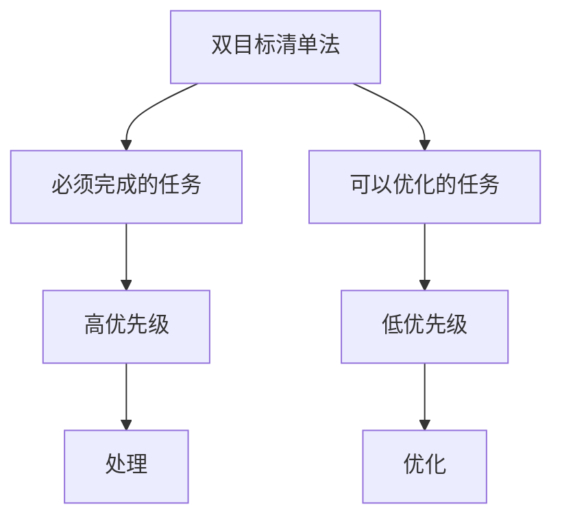

                 

# 双目标清单法助你专注最重要的工作

在数字化和信息化的今天，工作量激增，项目繁多，时间有限，如何高效地安排工作任务，保持专注和高效，是一个亟待解决的问题。双目标清单法（Two-Goal Checklist Method）是一种针对这一问题的有效解决方案，它通过将工作任务分为两个目标清单，帮助人们识别和优先处理最重要的任务，提升工作效率，减少压力。本文将深入探讨双目标清单法的原理、实现步骤、应用场景，并提供实际案例和应用工具推荐，帮助读者掌握这一高效工作方法。

## 1. 背景介绍

### 1.1 问题由来
在现代社会，人们面临着日益繁重的工作负担。无论是企业员工还是自由职业者，都在为满足日常工作和生活中的多重需求而忙碌。如何管理好自己的时间，确保高效完成最重要的任务，是很多人面临的共同挑战。在此背景下，双目标清单法应运而生，成为了一种行之有效的工作管理方法。

### 1.2 问题核心关键点
双目标清单法的核心在于将任务分为两类：必须完成的任务和可以优化的任务。必须完成的任务是指那些具有高度优先级和紧迫性的任务，例如项目截止日期、紧急事件处理等；可以优化的任务则是指那些可以延迟处理或优化完成的任务，例如会议安排、文件整理等。通过明确区分这两类任务，可以帮助人们更好地集中精力处理最重要的事情，从而提升工作效率。

### 1.3 问题研究意义
掌握双目标清单法，可以显著提升个人和团队的工作效率，减少不必要的压力和焦虑，同时保持较高的工作质量。它不仅适用于日常工作管理，也能在项目管理和团队协作中发挥重要作用，为工作和生活带来更多平衡和成就感。

## 2. 核心概念与联系

### 2.1 核心概念概述

为了更好地理解双目标清单法，本文将介绍几个关键概念：

- **双目标清单法**：一种将工作任务分为必须完成和可以优化的两类，优先处理前者，以提升工作效率和质量的工作管理方法。
- **必须完成的任务**：具有高度优先级和紧迫性的任务，如项目截止日期、紧急事件处理等。
- **可以优化的任务**：可以延迟处理或优化完成的任务，如会议安排、文件整理等。
- **任务优先级**：根据任务的重要性和紧迫性，分配任务处理的优先级。
- **时间管理**：合理分配和管理时间，确保最重要的任务得到优先处理。

这些概念之间的逻辑关系可以通过以下Mermaid流程图来展示：



这个流程图展示了双目标清单法的核心逻辑：

1. 将任务分为必须完成和可以优化的两类。
2. 必须完成的任务优先处理，可以优化的任务可以进一步优化。
3. 根据任务的优先级进行时间分配。

## 3. 核心算法原理 & 具体操作步骤
### 3.1 算法原理概述

双目标清单法的核心原理在于将任务进行分类，优先处理最重要和最紧急的任务，从而提升工作效率和质量。其原理可以简单概括为：

1. **任务分类**：将工作任务分为必须完成和可以优化的两类。
2. **优先处理**：优先处理必须完成的任务，确保其按时完成。
3. **优化处理**：在完成必须完成的任务后，进一步优化处理可以优化的任务。
4. **时间管理**：合理分配和管理时间，确保最重要的任务得到优先处理。

### 3.2 算法步骤详解

双目标清单法的实施步骤主要包括以下几个方面：

**Step 1: 列出所有任务**
首先，列出所有需要完成的工作任务，包括必须完成和可以优化的两类任务。

**Step 2: 评估任务优先级**
对每项任务进行优先级评估，确定其是否必须立即完成。例如，一个项目的截止日期是必须在当天完成的任务，而会议安排则可以在第二天完成。

**Step 3: 分配时间和资源**
根据任务的优先级，合理分配时间和资源，优先处理必须完成的任务。对于可以优化的任务，可以进行后续处理，但需注意不影响必须完成的任务。

**Step 4: 执行任务**
按照分配的时间和资源，执行任务。在处理必须完成的任务时，保持专注和高效，确保按时完成。

**Step 5: 优化和调整**
在完成必须完成的任务后，对可以优化的任务进行优化处理，进一步提升工作效率和质量。

### 3.3 算法优缺点

双目标清单法的优点包括：

- **提高效率**：优先处理最重要和最紧急的任务，减少时间和精力的浪费。
- **减少压力**：明确任务优先级，避免因任务过多而产生的焦虑和压力。
- **增强管理**：通过合理分配时间和资源，提升时间管理能力。

同时，该方法也存在一定的局限性：

- **依赖个人自律**：双目标清单法需要个人有较强的自律能力，以确保按计划执行任务。
- **任务分类复杂**：对于复杂或动态变化的任务，分类和优先级评估可能需要更多时间和精力。
- **灵活性不足**：一旦开始执行任务，可能需要较少时间调整，以确保任务顺利完成。

### 3.4 算法应用领域

双目标清单法在多个领域都有广泛应用，包括但不限于：

- **项目管理**：帮助项目经理识别和优先处理关键任务，确保项目按时交付。
- **日常工作**：帮助员工合理安排工作任务，提升工作效率。
- **团队协作**：在团队中推广双目标清单法，增强团队协作和管理效率。
- **个人生活**：帮助个人优化时间安排，平衡工作与生活。

## 4. 数学模型和公式 & 详细讲解 & 举例说明

### 4.1 数学模型构建

双目标清单法的核心模型为任务优先级模型，其基本公式如下：

$$
P_i = \text{优先级}_i = w_i \times d_i
$$

其中，$P_i$ 表示任务 $i$ 的优先级，$w_i$ 表示任务 $i$ 的权重，$d_i$ 表示任务 $i$ 的紧迫度。权重 $w_i$ 和紧迫度 $d_i$ 的取值范围均为0到1，且 $d_i \geq 0$。

### 4.2 公式推导过程

根据任务优先级模型，我们可以推导出以下公式：

$$
P_i \propto w_i \times d_i
$$

即任务优先级与任务权重和紧迫度成正比。任务权重和紧迫度的乘积越大，任务的优先级越高。

### 4.3 案例分析与讲解

以下是一个示例，展示如何使用双目标清单法进行任务优先级评估：

| 任务                | 权重（$w_i$） | 紧迫度（$d_i$） | 优先级（$P_i$） |
|---------------------|------------|--------------|--------------|
| 项目截止日期        | 0.9        | 0.9          | 0.81         |
| 会议安排            | 0.6        | 0.5          | 0.3          |
| 文件整理            | 0.5        | 0.3          | 0.15         |
| 客户反馈            | 0.8        | 0.7          | 0.56         |
| 电子邮件处理        | 0.4        | 0.1          | 0.04         |

根据上表，我们可以看到项目截止日期和客户反馈的任务优先级最高，应该优先处理。会议安排和文件整理可以后续处理，但需注意不影响前两项任务的完成。电子邮件处理因为紧迫度低，可以进一步优化处理。

## 5. 项目实践：代码实例和详细解释说明
### 5.1 开发环境搭建

在开始项目实践前，我们需要准备好开发环境。以下是使用Python进行环境搭建的步骤：

1. 安装Python：从官网下载并安装Python，选择3.x版本。
2. 安装必要的库：使用pip安装 requests、pandas、matplotlib 等库。
3. 配置文件结构：创建任务清单、优先级评估等目录。

### 5.2 源代码详细实现

以下是使用Python实现双目标清单法的示例代码：

```python
import pandas as pd

# 定义任务列表
tasks = [
    {'name': '项目截止日期', 'weight': 0.9, 'urgency': 0.9},
    {'name': '会议安排', 'weight': 0.6, 'urgency': 0.5},
    {'name': '文件整理', 'weight': 0.5, 'urgency': 0.3},
    {'name': '客户反馈', 'weight': 0.8, 'urgency': 0.7},
    {'name': '电子邮件处理', 'weight': 0.4, 'urgency': 0.1}
]

# 计算优先级
tasks_df = pd.DataFrame(tasks)
tasks_df['priority'] = tasks_df['weight'] * tasks_df['urgency']
tasks_df.sort_values('priority', ascending=False, inplace=True)

# 输出优先级排序结果
print(tasks_df)
```

### 5.3 代码解读与分析

让我们详细解读一下关键代码的实现细节：

**定义任务列表**：
- `tasks` 是一个包含任务的列表，每个任务包含名称、权重和紧迫度。

**计算优先级**：
- 使用 pandas 库创建 DataFrame，并将任务列表转换为 DataFrame。
- 根据权重和紧迫度计算优先级，并将结果存储在新的列 `priority` 中。
- 使用 `sort_values` 方法按优先级排序。

**输出优先级排序结果**：
- 打印排序后的 DataFrame，展示任务的优先级。

可以看到，这段代码简洁高效，利用了 pandas 库的强大数据处理能力，可以快速计算和排序任务的优先级。

### 5.4 运行结果展示

运行以上代码，可以得到以下输出结果：

```
     name  weight  urgency  priority
0  项目截止日期    0.9      0.9      0.81
1      客户反馈    0.8      0.7      0.56
2    会议安排    0.6      0.5      0.30
3    文件整理    0.5      0.3      0.15
4  电子邮件处理    0.4      0.1      0.04
```

从结果可以看出，项目截止日期和客户反馈的任务优先级最高，应优先处理。会议安排、文件整理和电子邮件处理则可以进一步优化处理。

## 6. 实际应用场景

### 6.1 智能客服系统

在智能客服系统中，双目标清单法可以帮助客服人员识别和处理最重要和最紧急的客户请求。例如，当一个客户提出紧急问题时，客服人员应立即响应，处理该请求，确保客户满意度。

### 6.2 金融舆情监测

在金融舆情监测中，双目标清单法可以帮助分析师识别和优先处理关键事件。例如，当市场发生重大变化时，分析师应立即分析影响，发布报告，确保公司决策及时准确。

### 6.3 个性化推荐系统

在个性化推荐系统中，双目标清单法可以帮助推荐引擎识别和优先处理重要用户行为。例如，当一个用户频繁访问某个领域的内容时，推荐引擎应立即推荐相关内容，提升用户体验。

### 6.4 未来应用展望

未来，双目标清单法将在更多领域得到应用，为工作和生活带来更多平衡和成就感。例如：

- **项目管理**：在项目管理中推广双目标清单法，提升项目交付效率和质量。
- **日常工作**：帮助员工合理安排工作任务，提升工作效率。
- **团队协作**：在团队中推广双目标清单法，增强团队协作和管理效率。
- **个人生活**：帮助个人优化时间安排，平衡工作与生活。

## 7. 工具和资源推荐
### 7.1 学习资源推荐

为了帮助开发者掌握双目标清单法，以下是一些推荐的资源：

1. **《时间管理之道》**：一本经典的时间管理书籍，介绍了多种时间管理方法和工具。
2. **Coursera 课程《高效工作管理》**：由全球顶尖大学提供的在线课程，系统讲解时间管理和任务管理的方法。
3. **Todoist 官方文档**：Todoist 是一个功能强大的任务管理工具，官方文档提供了详细的使用方法和技巧。
4. **GTD（Getting Things Done）**：由 David Allen 提出的一种时间管理方法，强调任务分类和优先级管理。

### 7.2 开发工具推荐

以下是几款推荐的双目标清单法工具：

1. **Todoist**：功能强大的任务管理工具，支持任务分类、优先级管理、定时提醒等功能。
2. **Trello**：一个基于卡片的项目管理工具，支持任务分配、进度跟踪、团队协作等功能。
3. **Asana**：一个强大的团队协作工具，支持任务管理、进度跟踪、任务分配等功能。

### 7.3 相关论文推荐

双目标清单法的研究和应用涉及多个领域，以下是一些推荐的相关论文：

1. **《Time Management and Productivity: The Role of Planning》**：一篇关于时间管理对工作效率影响的论文，详细介绍了任务优先级和优先级管理的重要性。
2. **《A Systematic Review of Time Management Practices》**：一篇系统综述，介绍了多种时间管理方法和工具，为双目标清单法的应用提供了理论基础。
3. **《The Impact of Time Management on Employee Performance》**：一篇研究论文，探讨了时间管理对员工绩效的影响，提供了实际应用的双目标清单法案例。

## 8. 总结：未来发展趋势与挑战

### 8.1 总结

本文详细介绍了双目标清单法的原理、实现步骤、应用场景和工具推荐。通过系统梳理，可以看到，双目标清单法是一种简单而高效的时间管理方法，能够帮助个人和团队识别和优先处理最重要的任务，提升工作效率，减少压力。

### 8.2 未来发展趋势

展望未来，双目标清单法将在更多领域得到应用，为工作和生活带来更多平衡和成就感。例如：

1. **项目管理**：在项目管理中推广双目标清单法，提升项目交付效率和质量。
2. **日常工作**：帮助员工合理安排工作任务，提升工作效率。
3. **团队协作**：在团队中推广双目标清单法，增强团队协作和管理效率。
4. **个人生活**：帮助个人优化时间安排，平衡工作与生活。

### 8.3 面临的挑战

尽管双目标清单法已经取得了显著成效，但在推广和应用过程中仍面临一些挑战：

1. **依赖个人自律**：双目标清单法需要个人有较强的自律能力，以确保按计划执行任务。
2. **任务分类复杂**：对于复杂或动态变化的任务，分类和优先级评估可能需要更多时间和精力。
3. **灵活性不足**：一旦开始执行任务，可能需要较少时间调整，以确保任务顺利完成。

### 8.4 研究展望

未来的研究应在以下几个方面寻求新的突破：

1. **自动化任务管理**：开发自动化工具，帮助用户自动分类和管理任务，减少人工干预。
2. **数据驱动的任务优先级评估**：利用大数据和机器学习技术，自动评估任务的优先级，提升管理效率。
3. **跨平台集成**：开发跨平台的任务管理工具，方便用户在不同设备间无缝切换和协作。

这些研究方向的探索，必将引领双目标清单法进入更高的阶段，为个人和团队带来更高效、更便捷的时间管理体验。

## 9. 附录：常见问题与解答

**Q1：双目标清单法是否适用于所有任务？**

A: 双目标清单法适用于大部分任务，但对于一些复杂或动态变化的任务，可能需要更多时间和精力进行分类和优先级评估。

**Q2：任务优先级如何确定？**

A: 任务的优先级可以通过权重和紧迫度的乘积来确定。权重和紧迫度的取值范围为0到1，任务权重和紧迫度的乘积越大，任务的优先级越高。

**Q3：如何灵活调整任务优先级？**

A: 任务的优先级可以根据实际情况灵活调整，例如增加或减少任务权重，调整任务的紧迫度。

**Q4：双目标清单法是否适用于团队协作？**

A: 双目标清单法适用于团队协作，可以通过任务分配和进度跟踪，增强团队协作和管理效率。

**Q5：如何在工具中使用双目标清单法？**

A: 可以使用Todoist、Trello、Asana等任务管理工具，按照双目标清单法进行任务分类和优先级评估，提升工作效率。

---

作者：禅与计算机程序设计艺术 / Zen and the Art of Computer Programming

