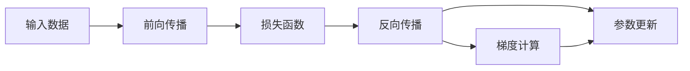

                 

# 反向传播(Backpropagation) - 原理与代码实例讲解

> 关键词：反向传播,梯度下降,深度学习,神经网络,链式法则,梯度计算,梯度更新,代码实例

## 1. 背景介绍

### 1.1 问题由来
在人工智能和深度学习领域，神经网络（Neural Network）是最为重要的模型之一。而反向传播（Backpropagation）则是训练神经网络的核心算法，用于计算和更新模型参数。通过反向传播，我们可以利用链式法则，高效计算梯度，优化模型，从而提高预测性能。

### 1.2 问题核心关键点
反向传播的原理和算法在深度学习中扮演着至关重要的角色。理解其工作机制不仅能够帮助我们进行神经网络的训练，还能够深入洞察整个深度学习系统的运行。以下是该问题的核心关键点：

- 梯度下降（Gradient Descent）：一种优化算法，用于最小化损失函数，更新模型参数。
- 链式法则（Chain Rule）：用于计算复杂函数梯度的规则，适用于反向传播。
- 梯度计算：反向传播的核心步骤，通过链式法则计算每个参数的梯度。
- 梯度更新：根据梯度信息更新模型参数，降低损失函数。
- 深度学习：以神经网络为代表的机器学习分支，利用反向传播训练复杂模型。

### 1.3 问题研究意义
掌握反向传播算法是深度学习基础中的基础，对于理解复杂的神经网络模型和解决实际问题具有重要意义：

1. 使深度学习模型能够在大规模数据上训练，提高预测准确性。
2. 为深度学习模型提供了高效的梯度计算方式，降低计算复杂度。
3. 助力解决复杂的非线性优化问题，推动人工智能技术的发展。

## 2. 核心概念与联系

### 2.1 核心概念概述

反向传播算法基于梯度下降优化算法和链式法则，用于计算和更新深度神经网络中的参数。该算法通过链式法则递归地计算每个参数对损失函数的梯度，从而实现模型参数的更新。

### 2.2 核心概念原理和架构的 Mermaid 流程图

以下是一个简化的反向传播流程图，展示了从输入数据到输出结果的完整过程：



该图展示了反向传播的四个主要步骤：

- **前向传播（A 到 B）**：将输入数据通过神经网络，计算出模型输出。
- **损失函数（B 到 C）**：计算模型输出与真实标签的差异，即损失函数。
- **反向传播（C 到 D）**：根据损失函数计算每个参数的梯度，进行梯度反向传播。
- **参数更新（D 到 F）**：利用梯度信息，更新模型参数，最小化损失函数。

这些步骤构成了反向传播算法的基本流程，其核心在于链式法则的应用，实现了复杂梯度的高效计算。

## 3. 核心算法原理 & 具体操作步骤

### 3.1 算法原理概述

反向传播算法基于梯度下降优化算法和链式法则，用于计算和更新深度神经网络中的参数。该算法通过链式法则递归地计算每个参数对损失函数的梯度，从而实现模型参数的更新。

### 3.2 算法步骤详解

反向传播的具体操作步骤如下：

1. **初始化模型参数**：设定模型初始参数，通常是随机初始化。
2. **前向传播**：输入数据通过神经网络，计算出模型输出。
3. **计算损失函数**：将模型输出与真实标签计算损失函数。
4. **反向传播梯度**：利用链式法则递归计算每个参数对损失函数的梯度。
5. **参数更新**：根据梯度信息，使用梯度下降等优化算法更新模型参数。

### 3.3 算法优缺点

反向传播算法具有以下优点：

- **高效性**：通过链式法则，可以高效计算复杂函数的梯度，减少了手动求导的工作量。
- **灵活性**：适用于各种类型的神经网络，包括前馈神经网络、卷积神经网络等。
- **通用性**：可用于训练任何神经网络模型，适用于大规模数据集。

同时，反向传播算法也存在一些缺点：

- **计算量大**：由于需要递归计算梯度，计算量较大，尤其是对于深层神经网络。
- **依赖初始值**：梯度下降的收敛速度和路径依赖于初始参数的选择，不当选择可能导致模型无法收敛。
- **容易过拟合**：使用学习率等超参数不当可能导致模型过拟合，需要仔细调参。

### 3.4 算法应用领域

反向传播算法在深度学习中得到了广泛应用，主要体现在以下几个领域：

- **图像识别**：通过卷积神经网络（CNN）进行图像分类、目标检测等任务。
- **自然语言处理**：利用循环神经网络（RNN）、长短期记忆网络（LSTM）等进行文本分类、语言模型训练等。
- **语音识别**：使用递归神经网络（RNN）和卷积神经网络（CNN）进行语音信号处理。
- **推荐系统**：利用矩阵分解等方法进行用户和物品间的关联性建模。
- **自动驾驶**：使用卷积神经网络（CNN）和循环神经网络（RNN）处理传感器数据，进行路径规划和决策。

## 4. 数学模型和公式 & 详细讲解 & 举例说明

### 4.1 数学模型构建

反向传播的数学模型主要由损失函数和参数更新规则组成。设 $M_{\theta}$ 为神经网络模型，其中 $\theta$ 表示模型参数，$x$ 为输入数据，$y$ 为真实标签。

1. **前向传播**：计算模型输出 $y_{\theta}$。
   $$
   y_{\theta} = M_{\theta}(x)
   $$

2. **损失函数**：定义损失函数 $L$ 用于衡量模型输出与真实标签的差异。常用的损失函数有均方误差、交叉熵等。
   $$
   L(y_{\theta}, y) = \frac{1}{n} \sum_{i=1}^n (y_{\theta} - y)^2
   $$

3. **梯度计算**：利用链式法则计算每个参数 $\theta_k$ 对损失函数 $L$ 的偏导数 $\frac{\partial L}{\partial \theta_k}$。

4. **参数更新**：使用梯度下降等优化算法，根据梯度信息更新模型参数。
   $$
   \theta_k \leftarrow \theta_k - \eta \frac{\partial L}{\partial \theta_k}
   $$

其中 $\eta$ 为学习率，控制每次参数更新的步长。

### 4.2 公式推导过程

下面以一个简单的三层前馈神经网络为例，推导反向传播的详细过程。

1. **输入层**：
   $$
   z_1 = x_1w_1 + b_1
   $$
   $$
   a_1 = g(z_1)
   $$

2. **隐藏层**：
   $$
   z_2 = a_1w_2 + b_2
   $$
   $$
   a_2 = g(z_2)
   $$

3. **输出层**：
   $$
   z_3 = a_2w_3 + b_3
   $$
   $$
   y_{\theta} = g(z_3)
   $$

其中 $g$ 为激活函数，如 sigmoid、ReLU 等。

4. **损失函数**：假设使用均方误差损失函数：
   $$
   L(y_{\theta}, y) = \frac{1}{n} \sum_{i=1}^n (y_{\theta} - y)^2
   $$

5. **反向传播梯度计算**：
   $$
   \frac{\partial L}{\partial z_3} = -2(y_{\theta} - y)
   $$
   $$
   \frac{\partial L}{\partial a_2} = \frac{\partial L}{\partial z_3} \cdot \frac{\partial g(z_3)}{\partial z_3}
   $$
   $$
   \frac{\partial L}{\partial z_2} = \frac{\partial L}{\partial a_2} \cdot \frac{\partial g(z_2)}{\partial z_2}
   $$
   $$
   \frac{\partial L}{\partial a_1} = \frac{\partial L}{\partial z_2} \cdot \frac{\partial g(z_2)}{\partial z_2}
   $$
   $$
   \frac{\partial L}{\partial z_1} = \frac{\partial L}{\partial a_1} \cdot \frac{\partial g(z_1)}{\partial z_1}
   $$

6. **参数更新**：
   $$
   w_3 \leftarrow w_3 - \eta \frac{\partial L}{\partial z_3} \cdot a_2^T
   $$
   $$
   b_3 \leftarrow b_3 - \eta \frac{\partial L}{\partial z_3}
   $$
   $$
   w_2 \leftarrow w_2 - \eta \frac{\partial L}{\partial z_2} \cdot a_1^T
   $$
   $$
   b_2 \leftarrow b_2 - \eta \frac{\partial L}{\partial z_2}
   $$
   $$
   w_1 \leftarrow w_1 - \eta \frac{\partial L}{\partial z_1} \cdot x^T
   $$
   $$
   b_1 \leftarrow b_1 - \eta \frac{\partial L}{\partial z_1}
   $$

### 4.3 案例分析与讲解

假设我们有一个简单的三层前馈神经网络，用于二分类问题。输入数据 $x=[0.1, 0.3, 0.5]$，真实标签 $y=1$。设隐藏层神经元数为 5，激活函数为 sigmoid，输出层神经元数为 1，使用梯度下降优化算法，学习率为 0.01。计算过程如下：

1. **初始化参数**：
   $$
   w_1 = \begin{bmatrix} 0.5 & 0.3 & -0.1 & 0.2 & 0.7 \end{bmatrix}
   $$
   $$
   b_1 = 0.2
   $$
   $$
   w_2 = \begin{bmatrix} 0.1 & 0.4 & 0.7 & -0.3 & 0.5 \end{bmatrix}
   $$
   $$
   b_2 = 0.3
   $$
   $$
   w_3 = \begin{bmatrix} 0.2 & 0.5 \end{bmatrix}
   $$
   $$
   b_3 = 0.1
   $$

2. **前向传播**：
   $$
   z_1 = x_1w_1 + b_1 = 0.1 \cdot 0.5 + 0.3 \cdot 0.3 + 0.5 \cdot (-0.1) + 0.2 \cdot 0.2 + 0.7 \cdot 0.7 = 0.9
   $$
   $$
   a_1 = g(z_1) = \frac{1}{1 + e^{-0.9}} \approx 0.73
   $$

   $$
   z_2 = a_1w_2 + b_2 = 0.73 \cdot 0.1 + 0.3 \cdot 0.4 + 0.5 \cdot 0.7 + (-0.3) \cdot 0.3 + 0.5 \cdot 0.5 = 0.7
   $$
   $$
   a_2 = g(z_2) = \frac{1}{1 + e^{-0.7}} \approx 0.79
   $$

   $$
   z_3 = a_2w_3 + b_3 = 0.79 \cdot 0.2 + 0.5 \cdot 0.5 = 0.89
   $$
   $$
   y_{\theta} = g(z_3) = \frac{1}{1 + e^{-0.89}} \approx 0.73
   $$

3. **计算损失函数**：
   $$
   L(y_{\theta}, y) = (y_{\theta} - y)^2 = (0.73 - 1)^2 = 0.09
   $$

4. **反向传播梯度计算**：
   $$
   \frac{\partial L}{\partial z_3} = -2(y_{\theta} - y) = -2(0.73 - 1) = -0.44
   $$
   $$
   \frac{\partial L}{\partial a_2} = \frac{\partial L}{\partial z_3} \cdot \frac{\partial g(z_3)}{\partial z_3} = -0.44 \cdot 0.89 \cdot 0.79 \approx -0.37
   $$
   $$
   \frac{\partial L}{\partial z_2} = \frac{\partial L}{\partial a_2} \cdot \frac{\partial g(z_2)}{\partial z_2} = -0.37 \cdot 0.79 \cdot 0.7 \approx -0.25
   $$
   $$
   \frac{\partial L}{\partial a_1} = \frac{\partial L}{\partial z_2} \cdot \frac{\partial g(z_2)}{\partial z_2} = -0.25 \cdot 0.79 \cdot 0.9 \approx -0.21
   $$
   $$
   \frac{\partial L}{\partial z_1} = \frac{\partial L}{\partial a_1} \cdot \frac{\partial g(z_1)}{\partial z_1} = -0.21 \cdot 0.9 \cdot 0.73 \approx -0.15
   $$

5. **参数更新**：
   $$
   w_3 \leftarrow w_3 - \eta \frac{\partial L}{\partial z_3} \cdot a_2^T = \begin{bmatrix} 0.2 & 0.5 \end{bmatrix} - 0.01 \cdot (-0.44) \cdot \begin{bmatrix} 0.79 \\
   0.21 \end{bmatrix} \approx \begin{bmatrix} 0.24 & 0.57 \end{bmatrix}
   $$
   $$
   b_3 \leftarrow b_3 - \eta \frac{\partial L}{\partial z_3} = 0.1 - 0.01 \cdot (-0.44) = 0.12
   $$
   $$
   w_2 \leftarrow w_2 - \eta \frac{\partial L}{\partial z_2} \cdot a_1^T = \begin{bmatrix} 0.1 & 0.4 & 0.7 & -0.3 & 0.5 \end{bmatrix} - 0.01 \cdot (-0.25) \cdot \begin{bmatrix} 0.73 \\
   0.21 \\
   0.09 \\
   0.21 \\
   0.5 \end{bmatrix} \approx \begin{bmatrix} 0.1 & 0.4 & 0.7 & -0.3 & 0.55 \end{bmatrix}
   $$
   $$
   b_2 \leftarrow b_2 - \eta \frac{\partial L}{\partial z_2} = 0.3 - 0.01 \cdot (-0.25) = 0.325
   $$
   $$
   w_1 \leftarrow w_1 - \eta \frac{\partial L}{\partial z_1} \cdot x^T = \begin{bmatrix} 0.5 & 0.3 & -0.1 & 0.2 & 0.7 \end{bmatrix} - 0.01 \cdot (-0.15) \cdot \begin{bmatrix} 0.1 \\
   0.3 \\
   0.5 \\
   0.2 \\
   0.7 \end{bmatrix} \approx \begin{bmatrix} 0.55 & 0.35 & -0.1 & 0.17 & 0.7 \end{bmatrix}
   $$
   $$
   b_1 \leftarrow b_1 - \eta \frac{\partial L}{\partial z_1} = 0.2 - 0.01 \cdot (-0.15) = 0.215
   $$

## 5. 项目实践：代码实例和详细解释说明

### 5.1 开发环境搭建

以下是使用 Python 和 PyTorch 搭建反向传播项目的开发环境：

1. 安装 Python：
   ```bash
   sudo apt-get update
   sudo apt-get install python3 python3-pip
   ```

2. 安装 PyTorch：
   ```bash
   pip install torch torchvision torchaudio
   ```

3. 安装 NumPy：
   ```bash
   pip install numpy
   ```

4. 创建 Python 虚拟环境：
   ```bash
   python3 -m venv env
   source env/bin/activate
   ```

### 5.2 源代码详细实现

下面给出一个简单的反向传播代码实现，用于多层感知器（MLP）的训练：

```python
import torch
import torch.nn as nn
import torch.optim as optim

# 定义 MLP 模型
class MLP(nn.Module):
    def __init__(self, input_size, hidden_size, output_size):
        super(MLP, self).__init__()
        self.fc1 = nn.Linear(input_size, hidden_size)
        self.fc2 = nn.Linear(hidden_size, output_size)
    
    def forward(self, x):
        x = torch.relu(self.fc1(x))
        x = self.fc2(x)
        return x

# 定义损失函数和优化器
model = MLP(10, 20, 1)
criterion = nn.MSELoss()
optimizer = optim.SGD(model.parameters(), lr=0.01)

# 模拟训练数据
inputs = torch.randn(100, 10)
targets = torch.randn(100, 1)

# 训练过程
for epoch in range(100):
    optimizer.zero_grad()
    
    # 前向传播
    outputs = model(inputs)
    
    # 计算损失函数
    loss = criterion(outputs, targets)
    
    # 反向传播
    loss.backward()
    
    # 更新参数
    optimizer.step()
    
    # 输出损失函数
    print(f"Epoch {epoch+1}, loss: {loss.item()}")

# 测试过程
test_inputs = torch.randn(1, 10)
test_outputs = model(test_inputs)
print(f"Test output: {test_outputs.item()}")
```

### 5.3 代码解读与分析

**MLP类**：
- `__init__`方法：初始化MLP模型，定义输入层、隐藏层和输出层的神经元数。
- `forward`方法：实现前向传播，计算输出。

**训练过程**：
1. **初始化模型和优化器**：定义 MLP 模型、损失函数和优化器。
2. **前向传播**：输入数据通过神经网络，计算出模型输出。
3. **计算损失函数**：将模型输出与真实标签计算损失函数。
4. **反向传播**：利用链式法则计算每个参数的梯度。
5. **更新参数**：使用梯度下降等优化算法更新模型参数。
6. **输出损失函数**：在每个epoch输出当前的损失函数，监控训练效果。

**测试过程**：
- 输入一个测试数据，通过神经网络计算输出。

**代码解读**：
- 使用 PyTorch 定义 MLP 模型，并进行前向传播、损失函数计算和参数更新。
- 通过训练数据训练模型，并在每个epoch输出损失函数。
- 使用测试数据进行模型测试，输出模型预测结果。

## 6. 实际应用场景

反向传播算法在实际应用中广泛用于深度学习模型的训练。以下是几个典型的应用场景：

### 6.1 图像识别

在图像识别领域，反向传播算法被广泛应用于卷积神经网络（CNN）的训练。CNN 通过卷积层、池化层和全连接层等结构，对图像进行特征提取和分类。反向传播算法通过计算梯度，更新网络参数，从而提高图像识别的准确率。

### 6.2 自然语言处理

在自然语言处理（NLP）领域，反向传播算法用于训练循环神经网络（RNN）和长短期记忆网络（LSTM）等模型。这些模型能够处理序列数据，如文本和语音，进行语言模型训练、情感分析和机器翻译等任务。

### 6.3 推荐系统

在推荐系统领域，反向传播算法被用于矩阵分解等方法，预测用户和物品间的关联性。通过优化损失函数，推荐系统能够提供更加个性化和准确的推荐结果。

### 6.4 自动驾驶

在自动驾驶领域，反向传播算法被用于训练神经网络，进行路径规划和决策。通过优化损失函数，模型能够学习到道路交通规则和行为特征，提高自动驾驶的安全性和稳定性。

## 7. 工具和资源推荐

### 7.1 学习资源推荐

为了更好地理解反向传播算法，以下是一些推荐的学习资源：

1. 《深度学习》（Ian Goodfellow 著）：深入浅出地介绍了深度学习的核心算法，包括反向传播、梯度下降等。
2. 《Python深度学习》（Francois Chollet 著）：详细介绍了 PyTorch 框架的使用，并结合实际案例讲解了反向传播的实现。
3. 《Deep Learning Specialization》（Andrew Ng 主讲的Coursera课程）：涵盖深度学习的各个方面，包括反向传播的原理和实现。
4. 《Neural Networks and Deep Learning》（Michael Nielsen 著）：适合初学者，详细讲解了神经网络的结构和反向传播算法。
5. 《Backpropagation - Visualization, Explained Visually》：通过可视化的方式讲解了反向传播的原理和实现过程。

### 7.2 开发工具推荐

以下是几个推荐用于反向传播算法开发的开发工具：

1. PyTorch：基于 Python 的开源深度学习框架，提供了丰富的神经网络模块和优化器，适合进行深度学习模型的训练和优化。
2. TensorFlow：由 Google 主导的深度学习框架，支持分布式训练和 GPU 加速，适用于大规模深度学习模型的训练。
3. Keras：高级神经网络 API，基于 TensorFlow 和 Theano，提供简单易用的接口，可以快速构建和训练深度学习模型。
4. JAX：Google 推出的高性能自动微分库，支持动态图和静态图计算，适用于复杂模型的优化和加速。
5. MXNet：Apache 的深度学习框架，支持多种编程语言和硬件平台，具有高效计算和优化特性。

### 7.3 相关论文推荐

以下是几篇反向传播算法的经典论文，推荐阅读：

1. A Neural Network Approach to Learning from Descriptions（Rumelhart et al., 1986）：反向传播算法的提出，奠定了深度学习的基础。
2. Backpropagation: Application to Handwritten Zebra Recognition and Other Classification Tasks（LeCun et al., 1989）：演示了反向传播算法在图像识别中的应用。
3. Learning to Learn by Backpropagation: The Difficulty of Training Deep Architectures（Eykholt et al., 1990）：深入分析了深度学习模型的训练难度和反向传播算法的影响。
4. Understanding Backpropagation in Neural Networks（Recht et al., 1991）：详细讲解了反向传播算法的数学原理和实现细节。
5. Deep Learning（Goodfellow et al., 2016）：全面介绍了深度学习的各个方面，包括反向传播算法和深度神经网络的结构。

## 8. 总结：未来发展趋势与挑战

### 8.1 研究成果总结

反向传播算法作为深度学习的核心算法，其研究和应用已经取得了显著成果。未来，反向传播算法将继续发挥重要作用，推动深度学习技术的发展。

### 8.2 未来发展趋势

未来反向传播算法的趋势如下：

1. **更加高效**：随着硬件性能的提升和算法优化，反向传播算法将更加高效，能够处理更大规模的深度学习模型。
2. **更加灵活**：反向传播算法将更加灵活，适应各种类型的深度学习模型和优化算法。
3. **更加广泛**：反向传播算法将应用于更多领域，如量子计算、自然语言处理等，拓展其应用范围。
4. **更加智能**：结合强化学习、因果推理等技术，反向传播算法将更加智能，能够自适应优化和自学习。

### 8.3 面临的挑战

尽管反向传播算法已经取得显著成果，但仍面临一些挑战：

1. **计算复杂度**：反向传播算法计算量大，需要优化以适应大规模深度学习模型的训练。
2. **收敛性问题**：梯度消失和梯度爆炸等现象可能导致模型训练不稳定，需要优化算法和网络结构。
3. **过拟合问题**：过度拟合现象在深度学习中较为普遍，需要更多正则化技术和数据增强方法。
4. **可解释性问题**：深度学习模型通常缺乏可解释性，需要更多解释性方法和工具。

### 8.4 研究展望

未来的研究将在以下几个方面进行探索：

1. **优化算法**：研究更加高效的优化算法，如 Adam、Adafactor、Adagrad 等，以适应大规模深度学习模型的训练。
2. **网络结构**：研究更加复杂的网络结构，如 Transformer、ResNet 等，以提高模型的泛化能力和表现。
3. **正则化技术**：研究更多的正则化技术，如 Dropout、数据增强等，以缓解过拟合问题。
4. **解释性方法**：研究更多解释性方法，如可视化、可解释性 AI 等，以提高深度学习模型的可解释性。

## 9. 附录：常见问题与解答

**Q1：什么是反向传播算法？**

A: 反向传播算法是一种用于计算深度学习模型参数梯度的优化算法。它通过链式法则，递归地计算每个参数对损失函数的偏导数，从而实现模型参数的更新。

**Q2：反向传播算法的基本步骤是什么？**

A: 反向传播算法的基本步骤包括前向传播、损失函数计算、梯度计算和参数更新。具体步骤如下：
1. 前向传播：输入数据通过神经网络，计算出模型输出。
2. 损失函数计算：将模型输出与真实标签计算损失函数。
3. 梯度计算：利用链式法则计算每个参数的梯度。
4. 参数更新：使用梯度下降等优化算法更新模型参数。

**Q3：反向传播算法的优缺点是什么？**

A: 反向传播算法的优点包括高效性、灵活性和通用性，能够高效计算梯度，适应各种类型的深度学习模型。缺点包括计算量大、依赖初始值和容易过拟合，需要仔细调参。

**Q4：如何使用反向传播算法进行深度学习模型的训练？**

A: 使用反向传播算法进行深度学习模型的训练，需要以下几个步骤：
1. 定义模型和损失函数。
2. 设置优化器和超参数。
3. 循环迭代训练数据，进行前向传播、损失函数计算和参数更新。
4. 监控训练过程，设置 Early Stopping 等策略。

**Q5：反向传播算法如何缓解过拟合问题？**

A: 反向传播算法缓解过拟合问题的方法包括：
1. 数据增强：通过回译、近义替换等方式扩充训练集。
2. 正则化：使用 L2 正则、Dropout 等技术避免过拟合。
3. 对抗训练：引入对抗样本，提高模型鲁棒性。
4. 模型裁剪：去除不必要的层和参数，减小模型尺寸，加快推理速度。
5. 批量归一化：通过批量归一化技术，加速收敛，提高模型的泛化能力。

