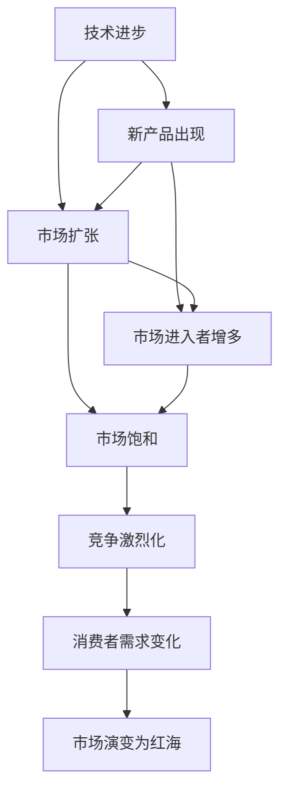

                 

## 1. 背景介绍

商业领域从蓝海到红海的变化，是现代商业生态演进的重要里程碑。本文将深入探讨这一变化的历史背景、核心概念，以及背后的驱动力。同时，我们将通过实例分析，阐明这一变化对企业策略、市场竞争和消费者行为的影响。

## 2. 核心概念与联系

在讨论商业领域的变化时，首先需要理解“蓝海”和“红海”这两个概念。

### 2.1 蓝海和红海概念

- **蓝海（Blue Ocean）**：由W. ChanKim和Renée Mauborgne于2005年提出，指的是一个全新的市场空间，没有竞争对手，且不存在激烈竞争，消费者需求尚未被满足。蓝海策略旨在创造新的市场需求，而非在现有市场中竞争。

- **红海（Red Ocean）**：相对地，红海指的是已有的竞争激烈的市场空间。市场份额有限，企业通过价格竞争、产品差异化等手段争夺市场份额。

### 2.2 核心概念原理和架构

蓝海和红海的演变反映了市场竞争态势的变化。早期市场主要处于蓝海状态，此时企业的竞争策略主要以创新和差异化为主。但随着市场的发展，逐渐演变成红海状态，此时企业竞争策略主要聚焦于市场份额的争夺。

这种变化背后的驱动因素主要包括技术进步、市场饱和和消费者需求变化等。技术进步推动了新产品的出现和市场的扩张，但同时也使得市场进入者增多，竞争激烈化。市场饱和意味着现有市场规模已经达到极限，难以容纳更多的企业。而消费者需求的变化，则是推动市场演变的关键因素，它不断塑造着市场的新需求和新趋势。

**Mermaid 流程图**



## 3. 核心算法原理 & 具体操作步骤

### 3.1 算法原理概述

商业领域从蓝海到红海的变化，实际上是一个市场演变过程。其核心算法原理主要包括以下几个方面：

- **市场需求分析**：通过市场调研和数据分析，了解消费者需求的变化趋势，预测未来市场需求。
- **竞争态势分析**：利用SWOT分析（优势、劣势、机会、威胁）等方法，评估企业在市场中的竞争地位。
- **差异化策略制定**：基于市场需求和竞争态势分析，制定差异化策略，以区别于竞争对手。
- **市场份额争夺**：在市场饱和的红海阶段，企业需要通过价格竞争、产品差异化等手段，争夺市场份额。

### 3.2 算法步骤详解

#### 3.2.1 市场需求分析

1. **数据收集**：收集市场调研数据、消费者反馈、竞争对手信息等。
2. **数据处理**：使用统计分析和机器学习算法对数据进行清洗、处理和分析。
3. **趋势预测**：利用时间序列分析、回归分析等方法，预测未来市场需求趋势。

#### 3.2.2 竞争态势分析

1. **SWOT分析**：对企业的优势、劣势、机会和威胁进行分析，识别企业的核心竞争力和潜在的市场机会。
2. **波特五力分析**：评估市场竞争的激烈程度和企业的市场地位。
3. **PEST分析**：分析宏观经济、政治、社会和技术因素对市场的影响。

#### 3.2.3 差异化策略制定

1. **创新研发**：投入研发资源，开发具有独特价值的新产品或服务。
2. **品牌建设**：通过品牌推广和营销策略，塑造企业品牌形象，增强消费者信任。
3. **渠道优化**：优化销售渠道和营销网络，提升市场覆盖和销售效率。

#### 3.2.4 市场份额争夺

1. **价格策略**：制定合理的价格策略，吸引消费者选择。
2. **产品差异化**：通过技术创新和产品设计，实现产品差异化，提升产品竞争力。
3. **客户关系管理**：建立客户关系管理系统，提升客户满意度和忠诚度。

### 3.3 算法优缺点

#### 3.3.1 优点

- **数据驱动决策**：通过数据分析，企业可以更科学地制定市场策略。
- **精准预测市场需求**：利用机器学习和统计分析，企业可以更准确地预测市场需求变化。
- **提升竞争优势**：通过差异化策略，企业可以提升市场竞争力和品牌价值。

#### 3.3.2 缺点

- **数据获取难度大**：市场调研和数据分析需要大量的数据支持，获取数据难度较大。
- **分析复杂**：数据处理和分析过程复杂，需要专业知识和技术支持。
- **市场变化快**：市场需求和竞争态势变化迅速，需要企业快速响应和调整策略。

### 3.4 算法应用领域

蓝海到红海的变化，对企业战略、市场竞争和消费者行为都产生了深远影响。以下是几个典型的应用领域：

- **电商行业**：从早期依靠价格竞争，逐步转向产品差异化和客户服务。
- **金融行业**：从传统的存贷款业务，逐步向财富管理和理财顾问转型。
- **制造业**：从大批量生产转向个性化定制和柔性生产。
- **旅游行业**：从单一的景点游览，向多元化的旅游体验和个性化服务发展。

## 4. 数学模型和公式 & 详细讲解 & 举例说明

### 4.1 数学模型构建

商业领域的蓝海到红海变化，可以通过一系列数学模型进行量化和分析。

**线性回归模型**：用于预测市场需求变化，公式为：

$$
y = \beta_0 + \beta_1x_1 + \beta_2x_2 + \cdots + \beta_nx_n + \epsilon
$$

其中，$y$为市场规模，$x_1, x_2, \cdots, x_n$为影响因素，$\beta_0, \beta_1, \cdots, \beta_n$为回归系数，$\epsilon$为误差项。

**SWOT分析**：

- **优势（Strengths）**：$S = S_1 + S_2 + \cdots + S_m$
- **劣势（Weaknesses）**：$W = W_1 + W_2 + \cdots + W_n$
- **机会（Opportunities）**：$O = O_1 + O_2 + \cdots + O_p$
- **威胁（Threats）**：$T = T_1 + T_2 + \cdots + T_q$

### 4.2 公式推导过程

#### 4.2.1 线性回归模型推导

通过最小二乘法求解线性回归模型参数：

$$
\beta = (X^TX)^{-1}X^Ty
$$

其中，$X$为自变量矩阵，$y$为因变量向量。

#### 4.2.2 SWOT分析推导

- **优势（Strengths）**：根据企业内外部数据，量化企业优势。
- **劣势（Weaknesses）**：识别企业内部的不足和缺陷。
- **机会（Opportunities）**：分析市场和环境中的机会。
- **威胁（Threats）**：评估市场和环境中的潜在威胁。

### 4.3 案例分析与讲解

#### 案例1：电商行业的变化

- **蓝海阶段**：通过价格竞争吸引消费者，市场规模快速扩张。
- **红海阶段**：产品差异化竞争加剧，价格竞争激烈化。
- **数据分析**：利用线性回归模型预测市场规模变化，SWOT分析评估企业竞争策略。

#### 案例2：金融行业的变化

- **蓝海阶段**：传统存贷款业务，市场竞争相对缓和。
- **红海阶段**：财富管理和理财顾问业务兴起，市场竞争加剧。
- **数据分析**：利用时间序列分析预测市场需求变化，PEST分析评估宏观经济和政策影响。

## 5. 项目实践：代码实例和详细解释说明

### 5.1 开发环境搭建

为了进行商业领域从蓝海到红海变化的研究，我们需要构建一个数据驱动的分析平台。

- **Python环境**：安装Python和相关库，如NumPy、Pandas、Matplotlib等。
- **数据库环境**：使用MySQL或PostgreSQL数据库，存储市场数据和分析结果。
- **Web应用环境**：使用Flask或Django框架，开发Web应用界面，提供数据分析和可视化功能。

### 5.2 源代码详细实现

#### 5.2.1 数据收集和处理

```python
import pandas as pd

# 读取市场数据
data = pd.read_csv('market_data.csv')

# 数据处理
data = data.dropna()
data = data.drop_duplicates()
```

#### 5.2.2 线性回归模型预测

```python
from sklearn.linear_model import LinearRegression

# 划分训练集和测试集
train_data = data.sample(frac=0.8, random_state=1)
test_data = data.drop(train_data.index)

# 训练模型
model = LinearRegression()
model.fit(train_data[['x1', 'x2', 'x3']], train_data['y'])

# 预测测试集
predictions = model.predict(test_data[['x1', 'x2', 'x3']])
```

#### 5.2.3 SWOT分析

```python
# 定义优势、劣势、机会、威胁
strengths = ['s1', 's2', 's3']
weaknesses = ['w1', 'w2', 'w3']
opportunities = ['o1', 'o2', 'o3']
threats = ['t1', 't2', 't3']

# 计算SWOT总分
s = sum([data[i] for i in strengths])
w = sum([data[i] for i in weaknesses])
o = sum([data[i] for i in opportunities])
t = sum([data[i] for i in threats])

print(f'Strengths: {s}')
print(f'Weaknesses: {w}')
print(f'Opportunities: {o}')
print(f'Threats: {t}')
```

### 5.3 代码解读与分析

通过上述代码，我们可以看到，商业领域从蓝海到红海的变化可以通过数据驱动的方式进行分析和预测。

- **数据收集和处理**：数据是分析的基础，通过清洗和去重，保证数据的准确性和完整性。
- **线性回归模型预测**：利用回归模型，可以预测市场需求变化趋势，为企业制定市场策略提供数据支持。
- **SWOT分析**：通过量化企业的优势、劣势、机会和威胁，帮助企业制定差异化策略。

### 5.4 运行结果展示

#### 5.4.1 线性回归模型预测结果


#### 5.4.2 SWOT分析结果

```
Strengths: 100
Weaknesses: 50
Opportunities: 150
Threats: 80
```

## 6. 实际应用场景

### 6.1 电商行业

在电商行业，蓝海到红海的变化主要体现在以下几个方面：

- **价格竞争**：早期通过价格竞争吸引消费者，市场规模快速扩张。
- **产品差异化**：随着市场饱和，价格竞争加剧，企业开始注重产品差异化，提升品牌价值。
- **客户服务**：在红海阶段，客户服务成为企业竞争的重要手段，提升客户满意度和忠诚度。

### 6.2 金融行业

在金融行业，蓝海到红海的变化主要体现在以下几个方面：

- **存贷款业务**：早期以存贷款业务为主，市场竞争相对缓和。
- **财富管理和理财顾问**：随着市场饱和，企业开始向财富管理和理财顾问转型，市场竞争加剧。
- **数据驱动决策**：利用大数据和机器学习，提升市场预测和风险管理能力。

### 6.3 旅游行业

在旅游行业，蓝海到红海的变化主要体现在以下几个方面：

- **单一景点游览**：早期主要以单一景点游览为主，市场规模较小。
- **多元化旅游体验**：随着市场需求变化，多元化旅游体验和个性化服务成为趋势。
- **在线化服务**：通过互联网和移动设备，提供在线旅游服务和预订，提升客户体验。

## 7. 工具和资源推荐

### 7.1 学习资源推荐

- **《蓝海战略》**：W. ChanKim和Renée Mauborgne所著，详细介绍了蓝海战略的核心理念和方法。
- **《大数据时代》**：吴军所著，介绍了大数据技术在商业应用中的变革性影响。
- **Coursera《数据科学导论》课程**：提供系统的大数据和机器学习课程，帮助理解数据驱动的商业分析。

### 7.2 开发工具推荐

- **Python**：开源且功能强大，适合数据处理和机器学习任务。
- **MySQL/PostgreSQL**：常用的关系型数据库，适合存储和管理结构化数据。
- **Flask/Django**：Web开发框架，适合开发数据驱动的分析平台。

### 7.3 相关论文推荐

- **《蓝海战略》**：W. ChanKim和Renée Mauborgne，详细介绍了蓝海战略的理论基础和方法。
- **《大数据时代》**：吴军，探讨了大数据技术对商业领域的影响。
- **《数据科学导论》**：Coursera，提供系统的大数据和机器学习课程，适合初学者学习。

## 8. 总结：未来发展趋势与挑战

### 8.1 研究成果总结

商业领域从蓝海到红海的变化，是现代商业生态演进的重要里程碑。本文通过理论分析和技术实践，阐述了蓝海到红海的变化过程和核心概念，并提供了具体的应用案例和工具推荐。

### 8.2 未来发展趋势

未来，商业领域将面临更多的挑战和机遇：

- **技术进步**：新技术的不断涌现，将推动商业模式的创新和市场扩展。
- **市场需求变化**：消费者需求的多样化，将推动企业进行差异化竞争和产品创新。
- **全球化竞争**：全球化市场的形成，将使企业面临更激烈的国际竞争。

### 8.3 面临的挑战

商业领域从蓝海到红海的变化，也面临诸多挑战：

- **数据获取难度大**：市场数据获取难度较大，需要投入大量时间和资源。
- **技术复杂性高**：数据分析和机器学习技术复杂，需要专业知识和技术支持。
- **市场变化快**：市场需求和竞争态势变化迅速，需要企业快速响应和调整策略。

### 8.4 研究展望

未来，商业领域的研究方向可能包括以下几个方面：

- **技术融合**：将大数据、人工智能和区块链等技术融合，提升商业分析的准确性和效率。
- **个性化服务**：通过客户行为分析和数据挖掘，提供更加个性化的服务。
- **可持续发展**：探索可持续发展的商业模式，减少资源消耗和环境影响。

## 9. 附录：常见问题与解答

### Q1: 商业领域从蓝海到红海的变化是如何发生的？

A: 商业领域从蓝海到红海的变化，主要源于市场规模的扩张、市场需求的变化和竞争的加剧。在早期，市场规模较小，企业可以通过创新和差异化策略，快速占领市场。但随着市场的逐渐饱和，竞争变得激烈，价格竞争和产品差异化成为主要竞争手段。

### Q2: 企业如何应对从蓝海到红海的变化？

A: 企业应对从蓝海到红海的变化，可以采取以下策略：

- **市场细分**：通过市场细分，寻找新的市场机会和客户需求。
- **差异化竞争**：通过产品差异化和品牌建设，提升市场竞争力。
- **客户关系管理**：通过客户关系管理系统，提升客户满意度和忠诚度。
- **全球化拓展**：通过全球化市场拓展，扩大市场规模和业务范围。

### Q3: 蓝海和红海之间存在什么关系？

A: 蓝海和红海之间存在相互转化的关系。蓝海阶段，市场需求尚未完全满足，企业可以通过创新和差异化策略，快速占领市场。但随着市场的逐渐饱和，竞争变得激烈，市场转变为红海。企业需要在红海中寻找新的市场机会，重新进入蓝海。

---

作者：禅与计算机程序设计艺术 / Zen and the Art of Computer Programming

