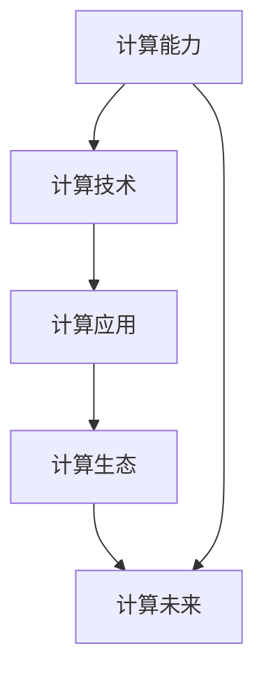

                 

# 回顾与展望：人类计算的发展历程与未来

## 1. 背景介绍

### 1.1 问题由来
随着人类社会的快速发展，计算能力已经成为推动科技进步的重要驱动力。从早期的机械计数器到现代的超级计算机，计算技术经历了翻天覆地的变化。计算机的出现，不仅改变了人类的生产生活方式，还为科学研究、工程设计、商业决策等诸多领域带来了革命性的变革。本文旨在回顾人类计算技术的发展历程，探讨未来计算技术的趋势与挑战，为读者提供一份深刻的理解和前瞻性的思考。

### 1.2 问题核心关键点
- 计算能力的演变：从手工计数到自动化计算，从单机到分布式计算，从通用计算到专用计算。
- 关键技术的突破：机械计数器、电子管计算机、集成电路、微处理器、超大规模集成电路、量子计算等。
- 计算应用的发展：科学计算、工程仿真、数据分析、机器学习等。
- 计算技术的未来：高性能计算、云计算、边缘计算、量子计算等。
- 计算与人类生活的关系：智能交通、智慧城市、医疗健康、金融科技等。

## 2. 核心概念与联系

### 2.1 核心概念概述

为了更好地理解人类计算技术的发展历程，本节将介绍几个密切相关的核心概念：

- **计算能力**：指在单位时间内能够处理的计算任务量。计算能力是衡量计算机性能的重要指标。
- **计算技术**：指实现计算任务所需的各种技术手段，包括硬件设计、软件算法、网络通信等。
- **计算应用**：指计算技术在各个领域的实际应用，如科学计算、工程仿真、数据分析等。
- **计算生态**：指围绕计算技术的各种硬件、软件、服务、人才等资源的综合体。
- **计算未来**：指计算技术发展的未来趋势，包括高性能计算、云计算、边缘计算、量子计算等。

这些核心概念之间的逻辑关系可以通过以下Mermaid流程图来展示：



这个流程图展示了一个从计算能力到未来发展的总体脉络：

1. 计算能力为计算技术提供基础。
2. 计算技术推动计算应用的发展。
3. 计算应用塑造计算生态，吸引更多资源和人才。
4. 计算生态催生计算未来的技术趋势。

这些概念共同构成了人类计算技术的研究框架，使得我们能够系统地理解和探索计算技术的演变与未来发展。

## 3. 核心算法原理 & 具体操作步骤

### 3.1 算法原理概述

人类计算技术的发展，从根本上说，是算法与硬件不断协同进化的结果。算法是计算任务的核心，而硬件是算法执行的物理平台。在过去几十年中，算法的演进经历了从古典算法到现代算法、从串行算法到并行算法的转变，而硬件的演进则经历了从电子管到晶体管、从集成电路到超大规模集成电路、再到量子计算的变革。

### 3.2 算法步骤详解

以下我们以现代机器学习的算法为例，详细讲解其步骤：

1. **数据预处理**：将原始数据转换为算法能够处理的形式，如特征提取、归一化、数据分割等。
2. **模型训练**：使用部分数据集对算法进行训练，调整参数以拟合数据分布。
3. **模型评估**：使用另外一部分数据集对模型进行评估，判断其泛化能力。
4. **模型优化**：根据评估结果调整模型参数，优化模型性能。
5. **模型部署**：将优化后的模型部署到实际应用中，进行推理预测。
6. **模型维护**：根据新数据和新需求，持续更新和维护模型。

这些步骤构成了机器学习算法的基本流程，但具体实现方式和技术手段会因为算法的不同而有所差异。

### 3.3 算法优缺点

现代机器学习算法在精度、泛化能力等方面取得了显著进展，但也存在一些缺点：

- **精度与泛化能力的平衡**：在提高模型精度的同时，可能会降低其泛化能力，导致过拟合。
- **计算资源消耗大**：现代机器学习算法通常需要大量的数据和计算资源，对硬件要求较高。
- **算法复杂度高**：一些高级算法，如深度学习、生成对抗网络等，需要复杂的计算图和优化算法，难以理解和调试。
- **数据隐私与安全**：现代算法往往依赖大量数据，可能带来数据隐私和安全问题。

尽管存在这些局限性，但机器学习算法以其强大的建模能力，为计算技术带来了新的突破，推动了人工智能技术的发展。

### 3.4 算法应用领域

现代机器学习算法在多个领域得到了广泛应用，包括但不限于：

- **自然语言处理**：如文本分类、情感分析、机器翻译等。
- **计算机视觉**：如图像分类、目标检测、人脸识别等。
- **语音识别**：如语音转文本、语音合成等。
- **推荐系统**：如电商推荐、内容推荐、广告推荐等。
- **金融分析**：如信用评分、投资预测、欺诈检测等。
- **健康医疗**：如疾病诊断、药物研发、基因分析等。

这些应用领域展示了机器学习算法在实际生活中的广泛应用，展示了其强大的价值和潜力。

## 4. 数学模型和公式 & 详细讲解 & 举例说明

### 4.1 数学模型构建

现代机器学习算法通常基于统计学和优化理论，使用数学模型来描述数据的特征和分布。以下是一个简单的线性回归模型的数学公式：

$$
y = \theta_0 + \theta_1x_1 + \theta_2x_2 + \cdots + \theta_nx_n + \epsilon
$$

其中，$y$ 为预测值，$\theta_0, \theta_1, \theta_2, \cdots, \theta_n$ 为模型参数，$x_1, x_2, \cdots, x_n$ 为特征变量，$\epsilon$ 为误差项。

### 4.2 公式推导过程

线性回归模型的目标是最小化预测值与实际值之间的误差。通过最小二乘法，可以得到模型参数的估计值：

$$
\hat{\theta} = (X^TX)^{-1}X^Ty
$$

其中，$X$ 为特征矩阵，$y$ 为实际值向量。

### 4.3 案例分析与讲解

以线性回归模型为例，我们可以分析其在房价预测中的应用。假设我们有一组房屋的面积、卧室数量、卫生间数量等特征数据，以及其对应的房价。通过线性回归模型，我们可以构建一个房价预测模型，输入房屋的特征数据，预测其对应的房价。

## 5. 项目实践：代码实例和详细解释说明

### 5.1 开发环境搭建

在进行机器学习算法实践前，我们需要准备好开发环境。以下是使用Python进行机器学习开发的常见环境配置流程：

1. 安装Python：从官网下载并安装Python，确保版本为3.6或以上。
2. 安装pip：在命令行中输入 `python -m ensurepip --default-pip` 进行安装。
3. 安装虚拟环境：使用 `virtualenv` 工具创建虚拟环境，以便隔离不同项目的环境。
4. 安装机器学习库：使用pip安装常用的机器学习库，如Scikit-learn、TensorFlow、PyTorch等。

### 5.2 源代码详细实现

以下是一个简单的线性回归模型的Python实现代码：

```python
import numpy as np
from sklearn.linear_model import LinearRegression

# 创建训练数据
X_train = np.array([[10, 2], [20, 3], [30, 4], [40, 5]])
y_train = np.array([50, 70, 90, 110])

# 创建模型
model = LinearRegression()

# 训练模型
model.fit(X_train, y_train)

# 预测房价
X_test = np.array([[50, 3], [60, 4]])
y_pred = model.predict(X_test)

print(y_pred)
```

### 5.3 代码解读与分析

这段代码实现了线性回归模型的基本流程：

1. 创建训练数据：使用NumPy数组创建特征数据和目标变量。
2. 创建模型：使用Scikit-learn库的LinearRegression类创建线性回归模型。
3. 训练模型：使用fit方法对模型进行训练，调整模型参数。
4. 预测房价：使用predict方法对测试数据进行预测，得到预测房价。

## 6. 实际应用场景

### 6.1 智能交通系统

智能交通系统是现代计算技术在城市管理中的重要应用之一。通过传感器、摄像头、GPS等设备采集实时交通数据，结合机器学习算法，可以实现交通流量预测、事故预警、路径优化等功能，大大提高城市交通的效率和安全性。

### 6.2 智慧医疗

智慧医疗是计算技术在医疗健康领域的重要应用。通过电子病历、影像数据、基因组数据等，结合机器学习算法，可以实现疾病预测、个性化治疗、药物研发等功能，提高医疗服务的质量和效率。

### 6.3 金融科技

金融科技是计算技术在金融领域的重要应用。通过交易数据、市场数据、用户数据等，结合机器学习算法，可以实现风险评估、欺诈检测、投资预测等功能，提升金融服务的智能化水平。

### 6.4 未来应用展望

未来计算技术的发展，将会更加智能化、自动化和个性化。以下是一些可能的趋势：

- **云计算与边缘计算**：云计算提供了强大的计算资源，边缘计算则将计算任务分散到各个节点，提高响应速度和网络效率。
- **量子计算**：量子计算利用量子比特的并行性，能够在某些特定问题上超越经典计算。
- **人工智能与大数据**：结合人工智能和大数据技术，可以实现更精确的数据分析和预测。
- **人机协同**：通过计算技术实现人机协同工作，提高工作效率和质量。

## 7. 工具和资源推荐

### 7.1 学习资源推荐

为了帮助开发者系统掌握机器学习技术，这里推荐一些优质的学习资源：

1. **机器学习课程**：如斯坦福大学的《机器学习》课程，由Andrew Ng主讲，讲解机器学习的基本概念和算法。
2. **深度学习框架**：如TensorFlow、PyTorch等，提供了丰富的API和文档，帮助开发者高效实现机器学习模型。
3. **在线课程**：如Coursera、edX等平台上的机器学习课程，提供了广泛的课程选择，涵盖了从入门到高级的内容。
4. **开源项目**：如TensorFlow官方文档，提供了丰富的样例和代码，帮助开发者快速上手。
5. **书籍**：如《机器学习实战》、《深度学习》等书籍，详细讲解了机器学习的基本原理和应用。

### 7.2 开发工具推荐

高效的开发离不开优秀的工具支持。以下是几款用于机器学习算法开发的常用工具：

1. **Python**：作为机器学习的主流编程语言，Python提供了丰富的库和框架，支持高效的数据处理和算法实现。
2. **Jupyter Notebook**：支持Python代码块的交互式执行，方便开发者快速验证算法。
3. **TensorFlow**：Google开发的深度学习框架，支持GPU加速和分布式计算。
4. **PyTorch**：Facebook开发的深度学习框架，具有灵活的API和高效的计算图。
5. **RapidMiner**：一个数据科学平台，提供了可视化界面和丰富的数据分析工具。

### 7.3 相关论文推荐

机器学习技术的发展离不开学界的持续研究。以下是几篇奠基性的相关论文，推荐阅读：

1. **Perceptron: An Improved Training Strategy for Multilayer Feedforward Networks**：提出了多层感知器的训练策略，奠定了深度学习的基础。
2. **Training Deep Neural Networks on Large Datasets using GPUs**：展示了使用GPU加速深度学习训练的方法，大大提高了计算效率。
3. **AlphaGo**：展示了使用深度学习实现人工智能战胜人类世界冠军游戏的能力。
4. **Generative Adversarial Networks**：提出了生成对抗网络，实现了数据生成和图像生成等任务。
5. **Reinforcement Learning for Human-Robot Interaction**：展示了使用强化学习实现人机协同工作的能力。

这些论文代表了大数据和机器学习技术的发展脉络。通过学习这些前沿成果，可以帮助研究者把握学科前进方向，激发更多的创新灵感。

## 8. 总结：未来发展趋势与挑战

### 8.1 总结

本文对机器学习技术的发展历程进行了全面系统的介绍。首先阐述了计算技术在各领域的应用和发展历程，明确了计算技术在推动科技进步中的重要地位。其次，从原理到实践，详细讲解了机器学习算法的数学原理和关键步骤，给出了机器学习算法开发的完整代码实例。同时，本文还广泛探讨了机器学习算法在智能交通、智慧医疗、金融科技等多个领域的应用前景，展示了机器学习算法的巨大潜力。此外，本文精选了机器学习技术的各类学习资源，力求为读者提供全方位的技术指引。

通过本文的系统梳理，可以看到，机器学习技术正在成为计算技术的重要组成部分，极大地拓展了计算技术的应用边界，催生了更多的落地场景。受益于大规模数据和算力资源的积累，机器学习算法在精度、泛化能力等方面取得了显著进展，推动了人工智能技术的发展。未来，伴随计算技术的不断演进，机器学习算法将迎来更多突破，为构建智能化社会提供更强大的技术支持。

### 8.2 未来发展趋势

展望未来，机器学习技术将呈现以下几个发展趋势：

- **深度学习与强化学习的融合**：通过结合深度学习和强化学习，实现更智能、更自主的决策系统。
- **多模态数据的融合**：结合语音、图像、视频等多模态数据，提升系统的感知和理解能力。
- **联邦学习与边缘计算**：通过分布式计算和数据联邦，提升计算效率和数据隐私保护能力。
- **自主学习和自适应系统**：通过自适应和自主学习，提升系统的鲁棒性和自学习能力。
- **计算生态的融合**：通过计算技术与物联网、区块链等技术结合，实现更广泛的跨领域应用。

以上趋势凸显了机器学习技术的发展方向，这些方向的探索发展，必将进一步提升计算技术的性能和应用范围，为构建智能化社会提供更强大的技术支撑。

### 8.3 面临的挑战

尽管机器学习技术已经取得了瞩目成就，但在迈向更加智能化、普适化应用的过程中，它仍面临着诸多挑战：

- **数据隐私与安全**：机器学习算法依赖大量数据，数据隐私和安全问题亟待解决。
- **算法透明性与可解释性**：机器学习算法的“黑盒”特性，难以解释其内部工作机制。
- **计算资源消耗大**：大规模数据和复杂算法的计算资源消耗大，对硬件要求较高。
- **模型泛化能力差**：机器学习算法在训练数据上的表现往往与实际数据分布差异较大。
- **算法鲁棒性不足**：机器学习算法在面对异常数据和攻击时，容易产生波动和错误。

尽管存在这些局限性，但机器学习算法以其强大的建模能力，为计算技术带来了新的突破，推动了人工智能技术的发展。未来，我们需要在数据隐私、算法透明性、计算资源等方面进行更多研究，以克服这些挑战，推动机器学习技术的不断进步。

### 8.4 研究展望

面对机器学习技术面临的挑战，未来的研究需要在以下几个方面寻求新的突破：

- **数据隐私保护**：研究隐私保护技术，如差分隐私、联邦学习等，确保数据安全和隐私保护。
- **算法透明性与可解释性**：开发可解释性更强的机器学习算法，增强模型的透明性和可解释性。
- **高效计算资源**：研究高效计算方法，如分布式计算、异构计算、量子计算等，提升计算效率和资源利用率。
- **多模态数据融合**：研究多模态数据融合技术，实现更全面的数据感知和理解。
- **自适应与自主学习**：研究自适应和自主学习方法，提升系统的鲁棒性和自学习能力。

这些研究方向的探索，必将引领机器学习技术迈向更高的台阶，为构建智能化社会提供更强大的技术支持。

## 9. 附录：常见问题与解答

**Q1：机器学习算法的精度与泛化能力如何平衡？**

A: 机器学习算法的精度与泛化能力可以通过交叉验证等技术进行平衡。在训练时，可以使用验证集对模型进行评估，根据评估结果调整模型参数，确保模型在泛化集上的表现不差于训练集。此外，可以通过正则化、dropout等技术，控制模型的复杂度，避免过拟合。

**Q2：机器学习算法对计算资源的要求有哪些？**

A: 机器学习算法对计算资源的要求主要包括数据存储、计算能力和网络带宽等。数据存储需要足够的存储空间来保存大规模数据集；计算能力需要强大的GPU、TPU等设备来支持大规模计算；网络带宽需要高速网络来支持大规模数据传输。

**Q3：机器学习算法在实际应用中如何保证数据隐私与安全？**

A: 机器学习算法可以通过数据匿名化、差分隐私、联邦学习等技术来保证数据隐私与安全。数据匿名化可以通过去除或模糊化敏感信息，降低数据泄露风险；差分隐私可以通过添加噪声或扰动数据，确保个体数据无法被识别；联邦学习可以通过分布式计算，减少数据传输和集中存储的隐私风险。

**Q4：机器学习算法的“黑盒”特性有哪些？**

A: 机器学习算法的“黑盒”特性主要体现在其内部工作机制难以解释，难以理解和调试。这种特性在一定程度上限制了算法的应用范围，特别是在需要高透明度和高信任度的场景，如医疗、金融等领域。

**Q5：机器学习算法在实际应用中如何实现多模态数据的融合？**

A: 机器学习算法可以通过融合语音、图像、视频等多模态数据，实现更全面的数据感知和理解。例如，在语音识别任务中，可以将语音数据与文本数据结合，提升识别精度和鲁棒性。

---

作者：禅与计算机程序设计艺术 / Zen and the Art of Computer Programming

