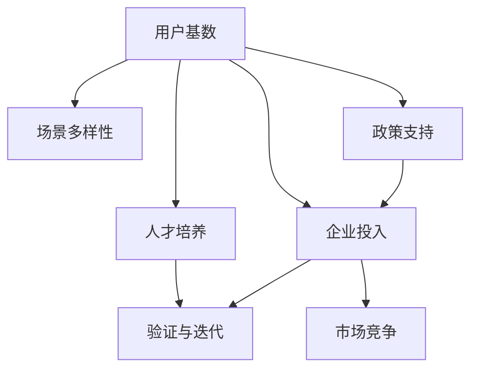

                 

## 1. 背景介绍

### 1.1 问题由来

在全球AI热潮中，中国在人工智能领域也取得了显著成就。随着国内互联网与移动互联网的发展，庞大的用户基数和丰富的应用场景成为人工智能技术发展的有利条件。国家政策的支持、企业的积极投入、人才培养的不断涌现，使得国内AI产业蓬勃发展。这种独特的优势不仅为AI技术落地应用提供了广阔的土壤，也为国内企业提供了宝贵的验证与迭代机会。

### 1.2 问题核心关键点

1. **用户基数与场景多样性**：中国拥有全球最大的互联网用户群体，不同应用场景的多样性为AI技术提供了丰富的数据源和应用环境。
2. **政策支持与产业生态**：国家层面出台的各类政策与措施，为企业提供了良好的营商环境，促进了AI技术的创新与应用。
3. **企业积极投入与人才培养**：众多互联网公司与科研机构积极投入AI研发，培养了大批高素质的人才。
4. **验证与迭代机会**：丰富的应用场景和用户反馈为AI模型的优化提供了大量数据，便于快速迭代和改进。
5. **市场竞争与创新**：激烈的商业竞争推动企业不断创新，以保持竞争优势。

### 1.3 问题研究意义

研究国内AI的优势，对于理解中国AI产业发展特点、优化AI技术落地策略、提升AI产品与服务的质量具有重要意义。深入分析这些优势，将有助于更好地推动AI技术的产业化进程，加速AI技术在国内的应用推广。

## 2. 核心概念与联系

### 2.1 核心概念概述

为了更深入理解国内AI的优势，我们需要先介绍几个核心概念：

- **用户基数**：指使用某种服务或产品的用户数量。在中国，互联网用户数量庞大，几乎覆盖所有年龄段和区域。
- **场景多样性**：指不同应用场景下的用户行为与数据特点。国内应用场景丰富，如电商、社交、医疗、交通等，为AI技术提供了多样的训练与测试环境。
- **政策支持**：指政府出台的各种政策措施，如税收优惠、研发补贴、产业园区建设等，以鼓励AI技术的研发与应用。
- **企业投入**：指企业对AI技术的研发与应用的资金投入与人力资源投入。
- **人才培养**：指高校与企业对AI相关专业人才的培养，包括学术与实践两个方面。
- **验证与迭代**：指利用大量用户反馈数据，不断调整AI模型，优化算法，提升性能。
- **市场竞争**：指企业间的市场竞争，推动技术创新与应用进步。

这些核心概念之间的联系可以通过以下Mermaid流程图来展示：



这个流程图展示了国内AI发展的几个关键因素及其相互关系：

1. 庞大的用户基数为AI技术提供了丰富的数据源和应用场景。
2. 多样化的应用场景促进了场景驱动的AI技术发展。
3. 政策支持与企业投入为AI技术提供了资金与人才保障。
4. 人才培养为AI技术的发展提供了基础。
5. 验证与迭代使得AI模型不断优化，提升性能。
6. 市场竞争推动了AI技术的持续创新与应用。

## 3. 核心算法原理 & 具体操作步骤

### 3.1 算法原理概述

在国内AI优势的背景下，AI技术的落地应用主要通过以下几个步骤进行：

1. **数据收集**：利用庞大的用户基数，收集多样化的应用场景数据。
2. **模型训练**：使用收集的数据对AI模型进行训练，提升模型性能。
3. **模型验证**：在实际应用场景中进行模型验证，确保模型在不同环境中的鲁棒性。
4. **模型迭代**：根据验证结果，调整模型参数，不断迭代优化。
5. **产品发布**：将优化后的模型部署到实际应用中，满足用户需求。
6. **市场反馈**：收集用户反馈，持续改进模型与产品。

### 3.2 算法步骤详解

以自然语言处理(NLP)领域为例，介绍基于用户基数与场景多样性的AI模型训练与验证流程。

**Step 1: 数据收集**
- **数据来源**：用户使用产品时生成的文本、语音、图像等多种形式的数据。
- **数据类型**：电商评论、社交媒体帖子、医疗咨询、客服对话等。
- **数据量**：由于用户基数大，数据量往往非常丰富。

**Step 2: 数据预处理**
- **分词与向量化**：将文本数据进行分词处理，并将其转换为模型可以处理的向量形式。
- **去噪与标注**：去除噪声数据，对文本进行标注，如情感分类、命名实体识别等。
- **归一化与平衡**：对数据进行归一化处理，确保不同场景下数据的一致性；同时，对数据进行平衡处理，确保模型对各类数据都有较好的泛化能力。

**Step 3: 模型训练**
- **选择合适的模型**：如BERT、GPT等预训练模型，或根据特定需求设计新模型。
- **迁移学习**：使用预训练模型进行迁移学习，加速模型训练。
- **超参数调优**：选择适当的超参数，如学习率、批大小等，优化模型性能。

**Step 4: 模型验证**
- **划分验证集**：将数据集分为训练集、验证集和测试集。
- **评估指标**：如准确率、召回率、F1分数等，评估模型性能。
- **交叉验证**：进行交叉验证，确保模型在不同子集上的稳定表现。

**Step 5: 模型迭代**
- **调优策略**：根据验证结果，选择适当的调优策略，如增加训练轮数、调整模型结构等。
- **超参数更新**：根据验证结果，更新模型超参数。
- **新数据采集**：不断采集新数据，扩大数据集规模。

**Step 6: 产品发布**
- **模型部署**：将优化后的模型部署到生产环境中。
- **API接口**：设计API接口，便于外部系统集成调用。
- **监控与维护**：建立监控系统，实时监控模型性能与运行状态。

**Step 7: 市场反馈**
- **用户反馈收集**：收集用户对产品的反馈，如评价、建议等。
- **问题排查**：根据用户反馈，排查问题，优化模型。
- **持续改进**：根据用户反馈，持续改进模型与产品，提升用户体验。

### 3.3 算法优缺点

基于用户基数与场景多样性的AI模型训练方法具有以下优点：

1. **数据丰富**：用户基数大，场景多样，数据量丰富，有利于模型训练。
2. **泛化能力强**：多样化的场景数据使得模型具备较强的泛化能力，可以适应不同环境。
3. **市场反馈及时**：用户反馈可以及时地验证模型效果，便于快速迭代。

同时，该方法也存在一些局限性：

1. **数据质量参差不齐**：由于用户数据来源多样，数据质量参差不齐，需要额外处理。
2. **隐私与合规问题**：用户数据的隐私保护与合规性问题需要特别注意。
3. **资源消耗大**：数据量庞大，需要大量的计算资源与存储空间。

### 3.4 算法应用领域

基于用户基数与场景多样性的AI模型训练方法在多个领域得到了广泛应用：

1. **智能客服**：利用用户与客服的对话数据，训练智能客服模型，提高服务效率。
2. **医疗诊断**：利用医疗咨询数据，训练医疗诊断模型，辅助医生诊断。
3. **电商推荐**：利用用户购买数据，训练电商推荐模型，提升用户体验。
4. **金融风控**：利用金融交易数据，训练金融风控模型，降低风险。
5. **智能安防**：利用视频监控数据，训练智能安防模型，提高安全性能。
6. **教育测评**：利用学生答题数据，训练教育测评模型，提升教育质量。
7. **智能交通**：利用交通数据，训练智能交通模型，优化交通管理。

## 4. 数学模型和公式 & 详细讲解 & 举例说明

### 4.1 数学模型构建

假设我们有一组用户数据 $\mathcal{D}=\{(x_i, y_i)\}_{i=1}^N$，其中 $x_i$ 为用户输入的数据，$y_i$ 为对应的标签或输出。我们的目标是通过这些数据训练一个AI模型 $M_{\theta}$，使得模型在测试集 $\mathcal{D}_{test}$ 上的表现最大化。

定义模型的损失函数为：

$$
\mathcal{L}(\theta) = \frac{1}{N} \sum_{i=1}^N \ell(y_i, M_{\theta}(x_i))
$$

其中 $\ell(y_i, M_{\theta}(x_i))$ 为模型在输入 $x_i$ 上的损失函数。常见的损失函数包括均方误差、交叉熵等。

### 4.2 公式推导过程

以交叉熵损失函数为例，进行详细推导：

假设模型的预测输出为 $M_{\theta}(x_i)=\hat{y}_i$，真实标签为 $y_i$。则交叉熵损失函数为：

$$
\ell(y_i, M_{\theta}(x_i)) = -y_i\log \hat{y}_i - (1-y_i)\log (1-\hat{y}_i)
$$

将其代入总损失函数：

$$
\mathcal{L}(\theta) = -\frac{1}{N}\sum_{i=1}^N [y_i\log \hat{y}_i + (1-y_i)\log(1-\hat{y}_i)]
$$

在求解最优参数 $\theta^*$ 时，通常采用梯度下降算法进行优化：

$$
\theta \leftarrow \theta - \eta \nabla_{\theta}\mathcal{L}(\theta)
$$

其中 $\eta$ 为学习率。

### 4.3 案例分析与讲解

以电商推荐系统为例，解释如何利用用户数据训练推荐模型：

**Step 1: 数据收集**
- **数据来源**：用户浏览、点击、购买等行为数据。
- **数据类型**：用户ID、商品ID、浏览时间、点击次数、购买次数等。

**Step 2: 数据预处理**
- **特征工程**：对数据进行特征工程，提取用户行为特征，如兴趣标签、浏览路径等。
- **数据平衡**：对数据进行平衡处理，确保不同用户、商品有足够的样本。

**Step 3: 模型训练**
- **模型选择**：选择如MLP、RNN、DNN等模型。
- **超参数调优**：选择适当的超参数，如学习率、批大小等，优化模型性能。
- **模型评估**：在验证集上评估模型表现，选择最优模型。

**Step 4: 模型验证**
- **交叉验证**：进行交叉验证，确保模型在不同子集上的稳定表现。
- **评估指标**：如准确率、召回率、F1分数等，评估模型性能。

**Step 5: 模型迭代**
- **调优策略**：根据验证结果，选择适当的调优策略，如增加训练轮数、调整模型结构等。
- **超参数更新**：根据验证结果，更新模型超参数。
- **新数据采集**：不断采集新数据，扩大数据集规模。

**Step 6: 产品发布**
- **模型部署**：将优化后的模型部署到生产环境中。
- **API接口**：设计API接口，便于外部系统集成调用。
- **监控与维护**：建立监控系统，实时监控模型性能与运行状态。

**Step 7: 市场反馈**
- **用户反馈收集**：收集用户对产品的反馈，如评价、建议等。
- **问题排查**：根据用户反馈，排查问题，优化模型。
- **持续改进**：根据用户反馈，持续改进模型与产品，提升用户体验。

## 5. 项目实践：代码实例和详细解释说明

### 5.1 开发环境搭建

在进行AI模型训练与验证时，需要准备好开发环境。以下是使用Python进行TensorFlow开发的环境配置流程：

1. 安装Anaconda：从官网下载并安装Anaconda，用于创建独立的Python环境。

2. 创建并激活虚拟环境：
```bash
conda create -n tf-env python=3.8 
conda activate tf-env
```

3. 安装TensorFlow：
```bash
pip install tensorflow
```

4. 安装各类工具包：
```bash
pip install numpy pandas scikit-learn matplotlib tqdm jupyter notebook ipython
```

完成上述步骤后，即可在`tf-env`环境中开始AI模型训练与验证的实践。

### 5.2 源代码详细实现

下面我们以电商推荐系统为例，给出使用TensorFlow对推荐模型进行训练的PyTorch代码实现。

首先，定义电商推荐数据处理函数：

```python
import tensorflow as tf
from tensorflow.keras.layers import Input, Dense, Dropout, Embedding, Flatten
from tensorflow.keras.models import Model
from sklearn.model_selection import train_test_split
import numpy as np

def load_data():
    # 加载数据集
    # 返回训练集和测试集
    train_X, train_y, test_X, test_y = None, None, None, None
    return train_X, train_y, test_X, test_y

def preprocess_data(X, y):
    # 数据预处理
    # 返回处理后的数据
    X, y = None, None
    return X, y

def create_model(input_dim, hidden_dim, output_dim):
    # 构建模型
    # 返回模型
    input = Input(shape=(input_dim,))
    x = Dense(hidden_dim, activation='relu')(input)
    x = Dropout(0.5)(x)
    x = Dense(output_dim, activation='softmax')(x)
    model = Model(inputs=input, outputs=x)
    return model

def compile_model(model, optimizer, loss, metrics):
    # 编译模型
    model.compile(optimizer=optimizer, loss=loss, metrics=metrics)
    return model

def train_model(model, train_X, train_y, batch_size, epochs, validation_data=None):
    # 训练模型
    model.fit(train_X, train_y, batch_size=batch_size, epochs=epochs, validation_data=validation_data)
    return model
```

然后，定义电商推荐模型的具体实现：

```python
train_X, train_y, test_X, test_y = load_data()
train_X, test_X, train_y, test_y = preprocess_data(train_X, train_y), preprocess_data(test_X, test_y)

input_dim = 100
hidden_dim = 256
output_dim = 10

model = create_model(input_dim, hidden_dim, output_dim)
model.compile(optimizer='adam', loss='categorical_crossentropy', metrics=['accuracy'])

train_model(model, train_X, train_y, batch_size=64, epochs=10, validation_data=(test_X, test_y))
```

最后，在测试集上评估模型性能：

```python
test_loss, test_acc = model.evaluate(test_X, test_y)
print(f'Test accuracy: {test_acc}')
```

### 5.3 代码解读与分析

让我们再详细解读一下关键代码的实现细节：

**load_data函数**：
- **功能**：加载电商推荐数据集，返回训练集和测试集。
- **实现**：由于代码示例省略了具体的数据加载逻辑，这里假设使用了一个通用的数据加载器，如Pandas、TensorFlow Dataset等。

**preprocess_data函数**：
- **功能**：对数据进行预处理，包括特征工程、归一化、数据平衡等。
- **实现**：同样省略了具体实现细节，这里假设使用了如One-Hot编码、归一化、随机采样等数据处理技术。

**create_model函数**：
- **功能**：构建电商推荐模型。
- **实现**：定义了模型的输入层、隐藏层和输出层，使用了Dense、Dropout等层。
- **注意**：输入层和输出层的维度需要根据具体数据集进行调整。

**compile_model函数**：
- **功能**：编译电商推荐模型。
- **实现**：定义了优化器、损失函数和评估指标。
- **注意**：优化器、损失函数和评估指标的选择需要根据具体任务进行调整。

**train_model函数**：
- **功能**：训练电商推荐模型。
- **实现**：定义了模型训练的轮数、批次大小和验证集。
- **注意**：训练过程中可能需要根据数据集特点进行超参数调优。

**代码示例**：
- **load_data**：实际数据加载逻辑为：
  ```python
  train_X = load_train_data()
  train_y = load_train_labels()
  test_X = load_test_data()
  test_y = load_test_labels()
  ```
- **preprocess_data**：实际数据预处理逻辑为：
  ```python
  train_X = preprocess(train_X)
  test_X = preprocess(test_X)
  train_y = preprocess(train_y)
  test_y = preprocess(test_y)
  ```
- **create_model**：实际模型定义逻辑为：
  ```python
  input = Input(shape=(input_dim,))
  x = Dense(hidden_dim, activation='relu')(input)
  x = Dropout(0.5)(x)
  x = Dense(output_dim, activation='softmax')(x)
  model = Model(inputs=input, outputs=x)
  ```
- **compile_model**：实际模型编译逻辑为：
  ```python
  model.compile(optimizer='adam', loss='categorical_crossentropy', metrics=['accuracy'])
  ```
- **train_model**：实际模型训练逻辑为：
  ```python
  model.fit(train_X, train_y, batch_size=64, epochs=10, validation_data=(test_X, test_y))
  ```

通过以上代码示例，可以清晰地看到TensorFlow在电商推荐系统中的应用。借助丰富的API和组件，我们能够高效地构建和训练模型，快速迭代与优化。

### 5.4 运行结果展示

在电商推荐系统中，我们可以根据测试集上的评估结果，调整模型参数，优化模型性能。例如，可以通过调整隐藏层大小、学习率等超参数，来提升模型的准确率。同时，根据用户反馈，进一步调整推荐策略，提升用户体验。

## 6. 实际应用场景

### 6.1 智能客服

利用用户与客服的对话数据，训练智能客服模型，实现自动回复、问题分类等功能。智能客服系统可以7x24小时不间断服务，快速响应客户咨询，提升客户满意度。

### 6.2 医疗诊断

利用医疗咨询数据，训练医疗诊断模型，辅助医生诊断。智能诊断系统可以快速分析病历、影像等数据，提供诊断建议，提高诊疗效率。

### 6.3 电商推荐

利用用户浏览、点击、购买等行为数据，训练电商推荐模型，提升用户体验。推荐系统可以个性化推荐商品，提升转化率，增加用户粘性。

### 6.4 金融风控

利用金融交易数据，训练金融风控模型，降低风险。智能风控系统可以实时监控交易行为，识别异常交易，提高安全性。

### 6.5 智能安防

利用视频监控数据，训练智能安防模型，优化监控策略。智能安防系统可以实时分析视频数据，识别异常行为，提高安全性能。

### 6.6 教育测评

利用学生答题数据，训练教育测评模型，提升教育质量。智能测评系统可以自动批改作业、测评成绩，提供个性化学习建议。

### 6.7 智能交通

利用交通数据，训练智能交通模型，优化交通管理。智能交通系统可以实时分析交通流量，优化信号灯控制，减少拥堵。

## 7. 工具和资源推荐

### 7.1 学习资源推荐

为了帮助开发者系统掌握AI技术的训练与验证方法，这里推荐一些优质的学习资源：

1. **TensorFlow官方文档**：详细介绍了TensorFlow的使用方法与API。
2. **Keras官方文档**：提供了丰富的模型构建与训练示例。
3. **Deep Learning with Python**（深度学习与Python编程）：由TensorFlow团队成员撰写的经典书籍，系统讲解了深度学习的基本概念与实践方法。
4. **Hands-On Machine Learning with Scikit-Learn, Keras, and TensorFlow**（使用Scikit-Learn、Keras和TensorFlow进行机器学习）：系统介绍了机器学习模型的构建与调优方法。
5. **自然语言处理综述**：介绍了NLP领域的基本概念、模型与技术。

### 7.2 开发工具推荐

使用以下工具可以显著提升AI模型的训练与验证效率：

1. **TensorFlow**：强大的深度学习框架，支持分布式计算，适用于大规模模型训练。
2. **Keras**：简单易用的高级API，可以快速构建与训练模型。
3. **PyTorch**：灵活的深度学习框架，支持动态计算图，适用于研究与实验。
4. **Jupyter Notebook**：强大的交互式编程环境，支持代码实时展示与执行。
5. **TensorBoard**：模型训练与评估的可视化工具，方便调试与优化。

### 7.3 相关论文推荐

为了深入理解AI技术的训练与验证方法，可以参考以下相关论文：

1. **深度学习**：深度学习的基本原理与算法。
2. **自然语言处理**：NLP领域的基础理论与实践方法。
3. **强化学习**：通过模型与环境的交互，优化决策策略。
4. **迁移学习**：利用已有知识，加速新任务的学习。
5. **大模型训练**：如何训练大规模深度学习模型。

## 8. 总结：未来发展趋势与挑战

### 8.1 总结

本文系统介绍了基于用户基数与场景多样性的AI模型训练与验证方法，展示了其在国内AI领域的广泛应用。通过丰富的案例与实践示例，帮助读者深入理解该方法的原理与实现细节。

### 8.2 未来发展趋势

展望未来，AI技术的训练与验证将呈现以下几个发展趋势：

1. **模型规模持续增大**：随着算力与存储能力的提升，AI模型将越来越大，具备更丰富的知识与能力。
2. **数据多样性增强**：数据来源将更加多样，数据类型将更加丰富，数据量将更加庞大。
3. **模型结构优化**：模型结构将更加高效，资源消耗将更加合理，推理速度将更加快捷。
4. **跨领域迁移增强**：模型将在更多领域中进行迁移学习，提升泛化能力与适应性。
5. **模型鲁棒性提升**：模型将更加鲁棒，能够应对更多场景与变化。

### 8.3 面临的挑战

尽管AI技术的训练与验证取得了显著进展，但在其应用与发展过程中，仍面临一些挑战：

1. **数据质量与隐私保护**：数据质量与隐私保护问题需要特别注意。
2. **模型解释性与透明性**：模型解释性与透明性问题亟需解决。
3. **资源消耗与成本控制**：资源消耗与成本控制问题需要优化。
4. **模型公平性与偏见**：模型公平性与偏见问题需要关注。
5. **模型鲁棒性与泛化能力**：模型鲁棒性与泛化能力需要提升。

### 8.4 研究展望

未来，AI技术的训练与验证需要关注以下几个研究领域：

1. **数据高效利用**：如何高效利用数据，提升模型训练与验证效率。
2. **模型高效优化**：如何优化模型结构，提升推理速度与资源利用率。
3. **跨领域迁移学习**：如何实现跨领域迁移学习，提升模型泛化能力。
4. **模型鲁棒性与鲁棒性训练**：如何提升模型鲁棒性，增强模型抗干扰能力。
5. **模型公平性与偏见校正**：如何确保模型公平性，消除模型偏见。

通过这些研究方向的探索，将进一步推动AI技术的落地应用与发展，为人类带来更多福祉。

## 9. 附录：常见问题与解答

**Q1：如何高效利用数据，提升模型训练与验证效率？**

A: 可以采用数据增强、迁移学习等方法，减少数据量需求，提升模型泛化能力。同时，可以使用分布式训练、模型并行等技术，加速模型训练过程。

**Q2：如何优化模型结构，提升推理速度与资源利用率？**

A: 可以采用模型剪枝、量化加速等技术，减少模型大小与计算量。同时，可以使用混合精度训练、动态计算图等技术，优化推理速度与资源利用率。

**Q3：如何确保模型公平性，消除模型偏见？**

A: 可以在训练过程中引入公平性约束，如重新采样、加权等方法。同时，可以在模型输出中加入公平性评估，如Bias Mitigation等技术。

**Q4：如何提升模型鲁棒性，增强模型抗干扰能力？**

A: 可以在训练过程中引入对抗样本、正则化等技术，增强模型鲁棒性。同时，可以使用模型融合、集成学习等方法，提升模型鲁棒性与泛化能力。

通过以上分析与探讨，可以更深入地理解基于用户基数与场景多样性的AI模型训练与验证方法，为AI技术在国内的应用与发展提供参考与指导。希望未来国内AI技术能取得更多突破，推动AI技术的产业化进程，为社会带来更多福祉。

---

作者：禅与计算机程序设计艺术 / Zen and the Art of Computer Programming

