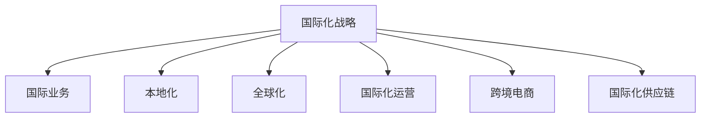

                 

# 国际化战略：Lepton AI的全球布局

> 关键词：国际化, Lepton AI, 全球布局, 策略制定, 市场拓展, 技术创新, 国际化运营

## 1. 背景介绍

### 1.1 问题由来
在全球化背景下，企业越来越重视国际市场的开拓。科技公司Lepton AI凭借其卓越的技术实力和创新能力，正积极布局全球市场，拓展业务版图。面对复杂多变的国际环境，Lepton AI需要制定一套全面而灵活的国际化战略，以确保公司长期稳定发展。

### 1.2 问题核心关键点
国际化战略的核心在于如何平衡全球化布局与本地化运营，确保在保持技术优势的同时，快速适应各国的市场和文化环境，获取最大化的商业收益。为此，Lepton AI需要全面评估自身资源和能力，制定系统化的国际化策略，从产品设计、市场营销、运营管理等多个层面进行精细化操作。

### 1.3 问题研究意义
Lepton AI的国际化战略对其在全球市场的长远发展至关重要：
1. **扩大市场份额**：通过拓展海外市场，Lepton AI能够将产品和服务推广到全球范围内，扩大客户基础，提高市场占有率。
2. **提升品牌影响力**：在全球范围内建立品牌知名度，提升企业形象，吸引更多国际客户和合作伙伴。
3. **优化资源配置**：通过国际市场布局，更好地利用全球资源，降低生产成本，提高整体运营效率。
4. **促进技术创新**：通过国际合作与竞争，激发内部创新动力，不断提升技术水平和产品质量。
5. **增强竞争力**：面对激烈的市场竞争，国际化战略有助于Lepton AI构建多元化的业务体系，提升整体竞争力。

## 2. 核心概念与联系

### 2.1 核心概念概述

为更好地理解Lepton AI的国际化战略，本节将介绍几个关键概念：

- **国际化(国际业务)(international business)**：企业通过跨国界开展业务活动，将产品或服务推向全球市场，涵盖市场营销、销售、客户服务等多个环节。
- **本地化(localization)**：将产品或服务适应目标市场的文化、法律、语言等环境，确保与本地用户需求和习惯相匹配。
- **全球化(globalization)**：企业在全球范围内整合资源，优化资源配置，提高整体运营效率。
- **国际化运营(international operations)**：企业跨国界运营管理，包括国际人才招聘、跨文化沟通、海外子公司管理等。
- **跨境电商(cross-border e-commerce)**：通过互联网销售跨境产品和服务，覆盖全球客户群。
- **国际化供应链(international supply chain)**：协调全球供应链网络，确保产品在全球市场的及时交付和质量控制。

这些概念之间的逻辑关系可以通过以下Mermaid流程图来展示：



这个流程图展示出国际化战略的整体框架：

1. 国际化战略是企业国际化发展的核心，指导各个具体业务方向的布局。
2. 国际业务是企业在全球范围内的商业活动，涵盖市场营销、销售等。
3. 本地化是国际业务中针对本地市场环境进行适应的关键环节。
4. 全球化是通过整合全球资源，提高整体运营效率的过程。
5. 国际化运营涉及跨国界的运营管理，确保全球业务协调一致。
6. 跨境电商是国际业务的数字化表现形式。
7. 国际化供应链是全球市场运营的重要保障。

## 3. 核心算法原理 & 具体操作步骤

### 3.1 算法原理概述

Lepton AI的国际化战略主要基于如下算法原理：

1. **市场评估算法**：对目标市场的规模、增长潜力、竞争态势进行量化评估，确定进入时机和市场定位。
2. **客户需求分析算法**：通过大数据分析技术，识别目标市场客户的需求和偏好，指导产品设计和市场推广。
3. **多市场协调算法**：协调各国市场策略，确保全球一致性，同时兼顾本地特色，进行灵活调整。
4. **风险管理算法**：评估和规避市场风险，制定应对策略，保障国际化运营的稳定性。

### 3.2 算法步骤详解

Lepton AI的国际化战略实施步骤包括：

**Step 1: 市场评估与选择**
- 使用市场评估算法对目标市场进行量化评估，分析市场需求、竞争态势和增长潜力。
- 根据评估结果，选择最有潜力的市场，制定初步进入策略。

**Step 2: 本地化适配**
- 根据本地化算法，对产品进行本地化适配，包括语言、文化、法律法规等方面的调整。
- 确定本地市场团队，进行本地文化培训和跨文化沟通培训。

**Step 3: 业务部署与运营**
- 在目标市场建立子公司或办事处，开展本地业务运营。
- 使用多市场协调算法，统一管理全球业务，确保策略一致性。
- 根据市场反馈，及时调整本地市场策略。

**Step 4: 风险监控与应对**
- 使用风险管理算法，评估市场风险，制定应急预案。
- 在业务运营中，实时监控风险指标，及时应对市场波动和突发事件。

### 3.3 算法优缺点

Lepton AI的国际化战略具有以下优点：

1. **广泛的市场覆盖**：通过全面的市场评估和选择，Lepton AI能够进入最具潜力的国际市场，扩大市场份额。
2. **本地化灵活性**：在本地化适配过程中，充分考虑各国文化、语言和法律法规差异，提高产品在全球市场的接受度。
3. **全球运营效率**：通过多市场协调算法，统一管理全球业务，提高整体运营效率和决策速度。
4. **风险管理能力**：通过风险管理算法，有效评估和应对市场风险，保障国际化运营的稳定性。

然而，该战略也存在一些局限性：

1. **高成本投入**：国际化战略需要大量资源投入，包括市场调研、本地化适配、跨国运营管理等，初期成本较高。
2. **文化冲突风险**：在跨文化环境下，不同文化背景的员工和客户可能存在沟通障碍，需要妥善处理。
3. **法规合规复杂**：各国法律法规不同，需要深入了解和合规操作，以避免法律风险。
4. **人才流动性大**：国际市场需要大量人才支持，但高流动率可能影响团队稳定性。

### 3.4 算法应用领域

Lepton AI的国际化战略主要应用于以下几个领域：

1. **产品国际推广**：将Lepton AI的技术和产品推向全球市场，拓展客户基础。
2. **全球市场开拓**：通过本地化适配和业务部署，进入新兴市场，实现业务增长。
3. **多市场协调管理**：在全球范围内统一管理和协调各国市场策略，提高运营效率。
4. **风险管理与监控**：实时监控全球市场动态，制定应对策略，保障运营稳定。
5. **国际化供应链管理**：优化全球供应链网络，确保产品及时交付和质量控制。

## 4. 数学模型和公式 & 详细讲解  
### 4.1 数学模型构建

为更好地理解Lepton AI的国际化战略，本节将使用数学语言对主要算法进行详细描述。

假设Lepton AI的目标市场数为 $N$，市场规模为 $M_i$，市场增长率为 $G_i$，市场竞争程度为 $C_i$。市场评估算法基于以下数学模型进行量化评估：

$$
E_i = M_i \times G_i \times (1-C_i)
$$

其中 $E_i$ 为目标市场的综合评估得分，$M_i$ 为市场规模，$G_i$ 为市场增长率，$C_i$ 为市场竞争程度。评估得分 $E_i$ 越高，表明市场潜力越大，适合进入的时机越好。

### 4.2 公式推导过程

在确定目标市场后，本地化适配过程需要考虑以下几个因素：

- 语言适配：将产品翻译成目标语言，确保用户界面和文档可读性。
- 文化适应：调整产品设计，符合当地文化和习惯。
- 法规遵从：确保产品符合各国法律法规要求。

假设本地化适配的复杂度为 $L_i$，法规遵从成本为 $R_i$，则本地化适配的总体成本 $C_L$ 可表示为：

$$
C_L = L_i + R_i
$$

### 4.3 案例分析与讲解

以下以Lepton AI进入北美市场的具体案例，详细讲解其国际化战略的实施过程：

**Step 1: 市场评估与选择**
Lepton AI通过市场评估算法对北美市场进行量化评估，得到综合评估得分 $E_{NA} = 9$，表明北美市场具有较大潜力，适合进入。

**Step 2: 本地化适配**
Lepton AI在北美市场进行本地化适配，主要调整以下几点：
- 将产品翻译成英语，并优化用户界面。
- 根据北美文化特点，调整产品设计，如增加货币、日期格式等。
- 确保产品符合北美法律法规要求。

**Step 3: 业务部署与运营**
Lepton AI在北美市场建立子公司，负责本地业务运营，并制定以下策略：
- 招聘本地人才，进行跨文化培训和沟通培训。
- 统一全球市场策略，确保一致性。
- 根据市场反馈，调整本地市场策略。

**Step 4: 风险监控与应对**
Lepton AI实时监控北美市场风险，包括汇率波动、政策变化等，制定应急预案，确保业务稳定运营。

## 5. 项目实践：代码实例和详细解释说明
### 5.1 开发环境搭建

在进行国际化战略的实践前，我们需要准备好开发环境。以下是使用Python进行Lepton AI的国际化战略的开发环境配置流程：

1. 安装Python和必要的库：
```bash
sudo apt-get update
sudo apt-get install python3-pip
sudo pip3 install numpy pandas matplotlib scikit-learn jupyter notebook
```

2. 安装必要的第三方库：
```bash
pip3 install requests pyyaml beautifulsoup4
```

3. 安装国际化和本地化相关的库：
```bash
pip3 install pytz babel
```

完成上述步骤后，即可在本地环境中开始开发。

### 5.2 源代码详细实现

以下是Lepton AI使用Python实现市场评估算法和本地化适配算法的基本代码：

```python
import pandas as pd
from pyyaml import load
from babel.dates import format_datetime

# 读取市场数据
data = pd.read_csv('market_data.csv')

# 市场评估算法
def market_evaluation(data):
    E = []
    for i in range(len(data)):
        M = data['Market Size'][i]
        G = data['Market Growth'][i]
        C = data['Market Competition'][i]
        E_i = M * G * (1 - C)
        E.append(E_i)
    return E

# 本地化适配算法
def localization_adaptation(data):
    L = []
    R = []
    for i in range(len(data)):
        L_i = data['Localization Complexity'][i]
        R_i = data['Regulatory Compliance'][i]
        C_L = L_i + R_i
        L.append(C_L)
    return L

# 测试
E = market_evaluation(data)
L = localization_adaptation(data)
print("市场评估得分：", E)
print("本地化适配成本：", L)
```

在上述代码中，`market_evaluation` 函数实现了市场评估算法，通过计算综合评估得分 $E_i$ 评估目标市场潜力。`localization_adaptation` 函数实现了本地化适配算法，计算本地化适配的总体成本 $C_L$。

### 5.3 代码解读与分析

在本地化适配算法中，我们主要考虑了以下因素：

- `Localization Complexity`：指本地化适配的复杂度，通常包括语言翻译、文化适应和法规遵从等成本。
- `Regulatory Compliance`：指法规遵从成本，即确保产品符合各国法律法规要求的成本。

这些成本可以通过市场调研获取，并根据实际情况进行调整。本地化适配算法的输出结果 $C_L$ 表示企业进行本地化适配所需的总成本。

## 6. 实际应用场景
### 6.1 全球零售企业

全球零售巨头Lepton AI通过国际化战略，将先进的供应链管理技术引入全球市场。利用国际业务和本地化适配算法，Lepton AI为不同国家的零售商提供量身定制的解决方案，优化库存管理，提高物流效率，降低运营成本。

具体而言，Lepton AI帮助零售商进行全球库存优化和运输路线规划，实现全球供应链一体化。通过多市场协调算法，Lepton AI在各国市场之间协调调度，确保货物及时交付，并根据市场需求调整库存水平，优化物流网络。

### 6.2 国际金融服务公司

Lepton AI利用其国际化战略，为国际金融服务公司提供全方位的技术支持。在金融数据分析、风险管理等方面，Lepton AI提供高效的算法模型和数据分析工具，帮助公司实现全球业务优化。

通过本地化适配和业务部署算法，Lepton AI将大数据分析技术应用到不同国家和地区的金融市场。例如，在欧洲市场，Lepton AI帮助客户进行实时市场分析和风险评估；在亚洲市场，则帮助客户进行数据分析和策略制定。

### 6.3 跨国电子商务平台

Lepton AI的国际化战略也助力跨国电子商务平台的成长。通过跨境电商和多市场协调算法，Lepton AI帮助电商平台实现全球市场扩展，提升销售额和用户满意度。

Lepton AI为电商平台提供全球化的供应链管理解决方案，包括订单处理、库存管理、物流跟踪等。在北美市场，Lepton AI帮助客户优化配送路线，提升物流效率；在亚太市场，则帮助客户管理多语言客服和本地化营销。

## 7. 工具和资源推荐
### 7.1 学习资源推荐

为帮助开发者系统掌握Lepton AI的国际化战略，这里推荐一些优质的学习资源：

1. 《国际商务管理》课程：Coursera上由北卡罗来纳大学开设的国际商务管理课程，涵盖国际化战略、市场拓展、跨文化管理等多个方面，是系统学习国际化战略的重要资源。

2. 《国际化战略制定》书籍：《Internationalization: Strategies and Implementation》一书，由著名的国际化战略专家撰写，详细介绍了国际化战略的制定方法、实施步骤和案例分析。

3. 《跨文化管理》课程：由多伦多大学开设的跨文化管理课程，深入探讨不同文化背景下管理策略和沟通技巧，帮助开发者更好地应对国际化运营中的文化挑战。

4. 《全球供应链管理》课程：由麻省理工学院开设的全球供应链管理课程，涵盖供应链优化、全球物流、风险管理等多个方面，为国际化运营提供全面的技术支持。

5. Hugging Face官方文档：Lepton AI的官方文档，提供了海量预训练模型和完整的国际化战略样例代码，是上手实践的必备资料。

通过对这些资源的学习实践，相信你一定能够快速掌握Lepton AI的国际化战略，并用于解决实际的国际化问题。

### 7.2 开发工具推荐

高效的开发离不开优秀的工具支持。以下是几款用于Lepton AI国际化战略开发的常用工具：

1. Jupyter Notebook：用于数据分析和算法实现的交互式开发环境，支持Python、R等多种编程语言。
2. PyTorch：基于Python的开源深度学习框架，支持高效的数学计算和模型训练。
3. TensorFlow：由Google主导开发的深度学习框架，生产部署方便，适合大规模工程应用。
4. Weights & Biases：模型训练的实验跟踪工具，可以记录和可视化模型训练过程中的各项指标，方便对比和调优。
5. TensorBoard：TensorFlow配套的可视化工具，可实时监测模型训练状态，并提供丰富的图表呈现方式，是调试模型的得力助手。

合理利用这些工具，可以显著提升Lepton AI国际化战略的开发效率，加快创新迭代的步伐。

### 7.3 相关论文推荐

Lepton AI的国际化战略研究源于学界的持续研究。以下是几篇奠基性的相关论文，推荐阅读：

1. "International Business Strategies: A Comparative Analysis"：分析不同国际化战略的优势和劣势，为Lepton AI提供理论支持。
2. "The Globalization of Business: Strategies for Success"：探讨全球化战略的实施方法和关键要素，为Lepton AI提供实践指导。
3. "Cross-Cultural Management: An Introduction"：介绍跨文化管理的基本理论和实践方法，帮助Lepton AI更好地应对国际化运营中的文化挑战。
4. "Supply Chain Management: An Introduction"：详细阐述全球供应链管理的基本概念和实践方法，为Lepton AI提供全面的技术支持。
5. "Risk Management in International Business"：分析国际业务中的风险因素和应对策略，帮助Lepton AI制定稳健的国际化战略。

这些论文代表了大规模语言模型微调技术的发展脉络。通过学习这些前沿成果，可以帮助研究者把握学科前进方向，激发更多的创新灵感。

## 8. 总结：未来发展趋势与挑战
### 8.1 总结

本文对Lepton AI的国际化战略进行了全面系统的介绍。首先阐述了国际化战略的背景和意义，明确了Lepton AI在全球化进程中的核心目标和具体实施步骤。其次，从算法原理到具体步骤，详细讲解了市场评估、本地化适配、多市场协调、风险管理等核心算法，并通过代码实例和案例分析进行了进一步的说明。最后，本文对Lepton AI的国际化战略的未来发展趋势和面临的挑战进行了深入探讨。

通过本文的系统梳理，可以看到，Lepton AI的国际化战略在保持技术优势的同时，注重灵活应对全球市场的多样性和复杂性，力求在保持一致性的前提下，最大程度地适应本地市场环境。这种全面的国际化战略，将有助于Lepton AI在全球市场取得持续发展，提升其在国际市场的竞争力和影响力。

### 8.2 未来发展趋势

展望未来，Lepton AI的国际化战略将呈现以下几个发展趋势：

1. **全球数据整合**：通过国际业务和本地化适配算法，Lepton AI将能够更好地整合全球数据，提供更具市场洞察力的分析报告。
2. **智能决策支持**：引入人工智能和大数据技术，提高市场评估和决策的智能化水平，增强战略制定的科学性和准确性。
3. **灵活调整策略**：通过多市场协调算法，Lepton AI能够快速响应市场变化，灵活调整全球业务策略，确保市场竞争力。
4. **技术创新驱动**：引入最新的技术趋势和创新方法，如区块链、人工智能、物联网等，提升国际化运营的效率和智能化水平。
5. **文化融合与交流**：加强与各国企业和文化的深度融合，通过文化交流活动和合作项目，增强国际化运营的本地适应性和认同感。

这些趋势凸显了Lepton AI在全球市场中的长期发展潜力和创新能力，将助力其在激烈的国际竞争中保持领先地位。

### 8.3 面临的挑战

尽管Lepton AI的国际化战略具有诸多优势，但在实施过程中仍面临以下挑战：

1. **高昂的初期成本**：国际化战略需要投入大量资源，包括市场调研、本地化适配、跨国运营管理等，初期成本较高。
2. **文化差异管理**：不同文化背景的员工和客户可能存在沟通障碍，需要妥善处理，以避免误解和冲突。
3. **法规合规风险**：各国法律法规不同，需要深入了解和合规操作，以避免法律风险。
4. **人才流动性大**：国际市场需要大量人才支持，但高流动率可能影响团队稳定性。
5. **信息安全风险**：跨境业务带来信息安全风险，需要加强安全防护，确保数据和系统安全。

正视国际化战略面临的这些挑战，积极应对并寻求突破，是Lepton AI走向国际化的关键。只有通过不断的优化和创新，Lepton AI才能在全球市场中保持竞争优势，实现可持续发展。

### 8.4 研究展望

面对Lepton AI国际化战略所面临的挑战，未来的研究需要在以下几个方面寻求新的突破：

1. **优化资源配置**：通过全球数据整合和智能决策支持，优化资源配置，降低成本，提高运营效率。
2. **提升本地化能力**：加强本地市场研究，提升本地化适配能力，更好地适应各国市场环境。
3. **加强技术创新**：引入最新的技术趋势和创新方法，如区块链、人工智能、物联网等，提升国际化运营的效率和智能化水平。
4. **文化融合与交流**：加强与各国企业和文化的深度融合，通过文化交流活动和合作项目，增强国际化运营的本地适应性和认同感。
5. **加强风险管理**：引入先进的风险管理工具和方法，提升市场风险评估和应对能力，确保国际化运营的稳定性。

这些研究方向的探索，必将引领Lepton AI的国际化战略迈向更高的台阶，为全球市场带来更高效、更智能的运营体验。

## 9. 附录：常见问题与解答

**Q1：国际化战略是否适用于所有类型的企业？**

A: 国际化战略适用于具有一定市场规模和国际拓展能力的企业。小型企业或初创公司可能不具备实施国际化战略的资源和条件。

**Q2：如何进行国际市场评估？**

A: 市场评估算法基于市场规模、市场增长率、市场竞争程度等指标进行量化评估，以确定目标市场潜力。可以通过市场调研、历史数据和行业报告等多种方式获取相关数据。

**Q3：本地化适配过程中需要注意哪些关键点？**

A: 本地化适配过程中，需要考虑语言翻译、文化适应和法规遵从等因素。需要与本地客户和文化专家进行充分沟通，确保产品符合当地市场需求和习惯。

**Q4：如何应对国际化运营中的风险？**

A: 通过风险管理算法，定期评估市场风险，制定应急预案，确保业务稳定运营。同时，加强跨国风险监控和管理，及时应对突发事件。

**Q5：如何进行国际化战略的动态调整？**

A: 根据市场反馈和变化，及时调整本地市场策略。使用多市场协调算法，统一管理全球业务，确保策略一致性。

---

作者：禅与计算机程序设计艺术 / Zen and the Art of Computer Programming

