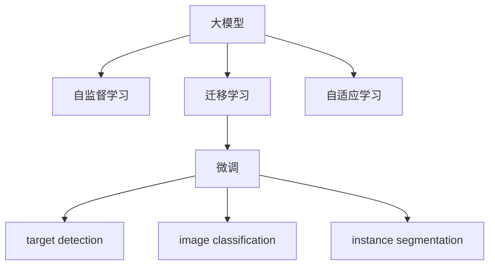

                 

# 图像处理的AI大模型：重塑视觉技术的未来

> 关键词：图像处理, 大模型, AI, 视觉技术, 计算机视觉, 深度学习, 自监督学习, 迁移学习, 目标检测, 图像分类, 实例分割

## 1. 背景介绍

### 1.1 问题由来
图像处理领域，随着深度学习技术的普及，AI大模型在图像分类、目标检测、图像生成等方面取得了显著进展。这些大模型通常基于自监督学习的方式在大量无标签数据上进行预训练，学习到了丰富的图像特征表示。但这些通用模型在特定应用场景中，由于数据量较小，微调过程需要进行大量标注，难以发挥其潜力。为了提高模型的适应性和性能，研究人员提出了一种基于大模型的迁移学习范式，即在预训练的基础上，通过微调优化模型，以适应特定任务，从而大幅提升了模型的应用效果。

### 1.2 问题核心关键点
基于大模型的迁移学习范式，本质上是一种将通用模型知识应用于特定任务的优化方法。其核心思想是：利用自监督学习获得的图像特征表示，通过有监督的微调过程，使模型逐渐适应特定任务的需求，从而在少量标注数据下也能取得较好的效果。这一方法在目标检测、图像分类、实例分割等计算机视觉任务中得到了广泛应用，成为计算机视觉领域的主流范式之一。

### 1.3 问题研究意义
研究基于大模型的迁移学习范式，对于提升图像处理任务的效果，降低应用成本，加速AI技术在实际场景中的部署，具有重要意义：

1. 降低应用开发成本。基于大模型的迁移学习可以大大减少从头开发所需的标注数据、计算资源和人力投入。
2. 提升模型效果。通过微调，模型能够更好地适应特定任务，在实际应用中取得更好的效果。
3. 加速开发进度。利用大模型的通用特征表示，可以快速适配新任务，缩短开发周期。
4. 带来技术创新。迁移学习范式促进了对预训练-微调的深入研究，催生了自监督学习、自适应学习等新的研究方向。
5. 赋能产业升级。迁移学习使得AI技术更容易被各行各业采用，为传统行业数字化转型升级提供了新的技术路径。

## 2. 核心概念与联系

### 2.1 核心概念概述

为更好地理解基于大模型的迁移学习范式，本节将介绍几个关键概念：

- 大模型(Large Model)：以深度神经网络为代表的大规模预训练模型。通过在海量无标签数据上进行自监督学习，学习到丰富的特征表示。

- 自监督学习(Self-Supervised Learning)：利用无标签数据，通过构造伪标签或预测任务等手段，自动生成监督信号，训练模型。

- 迁移学习(Transfer Learning)：将一个领域学习到的知识，迁移应用到另一个相关领域的学习范式。大模型的迁移学习即通过微调，使通用模型适应特定任务。

- 微调(Fine-Tuning)：在预训练模型的基础上，使用有标签数据进行有监督学习，优化模型以适应特定任务。

- 目标检测(Object Detection)：识别图像中特定对象的位置和类别，广泛应用于人脸识别、自动驾驶等领域。

- 图像分类(Image Classification)：对图像进行分类，识别出其所属类别。

- 实例分割(Segmentation)：将图像划分为不同对象和背景，并标注每个对象的类别。

- 自适应学习(Adaptive Learning)：根据数据分布变化，动态调整模型参数和架构，以适应新环境。

这些核心概念之间的逻辑关系可以通过以下Mermaid流程图来展示：



这个流程图展示了基于大模型的迁移学习范式的核心概念及其之间的关系：

1. 大模型通过自监督学习获得通用特征表示。
2. 迁移学习连接预训练模型与下游任务，通过微调适应特定任务。
3. 微调过程使模型逐渐适应任务需求，提升性能。
4. 目标检测、图像分类、实例分割等下游任务可以通过微调过程得到优化。
5. 自适应学习方法使模型能够不断适应新的数据分布，避免过拟合。

这些概念共同构成了基于大模型的迁移学习范式，使其在特定应用场景中能够发挥强大的图像处理能力。

## 3. 核心算法原理 & 具体操作步骤
### 3.1 算法原理概述

基于大模型的迁移学习，本质上是一种有监督的细粒度迁移学习过程。其核心思想是：利用自监督学习获得的通用特征表示，通过微调优化模型以适应特定任务，从而在少量标注数据下也能取得较好的效果。

形式化地，假设预训练模型为 $M_{\theta}$，其中 $\theta$ 为预训练得到的模型参数。给定下游任务 $T$ 的标注数据集 $D=\{(x_i, y_i)\}_{i=1}^N$，迁移学习的目标是找到新的模型参数 $\hat{\theta}$，使得：

$$
\hat{\theta}=\mathop{\arg\min}_{\theta} \mathcal{L}(M_{\theta},D)
$$

其中 $\mathcal{L}$ 为针对任务 $T$ 设计的损失函数，用于衡量模型预测输出与真实标签之间的差异。常见的损失函数包括交叉熵损失、均方误差损失等。

通过梯度下降等优化算法，迁移学习过程不断更新模型参数 $\theta$，最小化损失函数 $\mathcal{L}$，使得模型输出逼近真实标签。由于 $\theta$ 已经通过自监督学习获得了较好的初始化，因此即便在少量标注数据集 $D$ 上进行微调，也能较快收敛到理想的模型参数 $\hat{\theta}$。

### 3.2 算法步骤详解

基于大模型的迁移学习一般包括以下几个关键步骤：

**Step 1: 准备预训练模型和数据集**
- 选择合适的预训练图像模型 $M_{\theta}$ 作为初始化参数，如 ResNet、VGG、Inception等。
- 准备下游任务 $T$ 的标注数据集 $D$，划分为训练集、验证集和测试集。一般要求标注数据与预训练数据的分布不要差异过大。

**Step 2: 添加任务适配层**
- 根据任务类型，在预训练模型顶层设计合适的输出层和损失函数。
- 对于分类任务，通常在顶层添加线性分类器和交叉熵损失函数。
- 对于检测任务，通常使用锚框回归和分类器输出概率分布，并以交叉熵损失和均方误差损失为损失函数。

**Step 3: 设置迁移学习超参数**
- 选择合适的优化算法及其参数，如 AdamW、SGD 等，设置学习率、批大小、迭代轮数等。
- 设置正则化技术及强度，包括权重衰减、Dropout、Early Stopping 等。
- 确定冻结预训练参数的策略，如仅微调顶层，或全部参数都参与迁移学习。

**Step 4: 执行迁移学习**
- 将训练集数据分批次输入模型，前向传播计算损失函数。
- 反向传播计算参数梯度，根据设定的优化算法和学习率更新模型参数。
- 周期性在验证集上评估模型性能，根据性能指标决定是否触发 Early Stopping。
- 重复上述步骤直到满足预设的迭代轮数或 Early Stopping 条件。

**Step 5: 测试和部署**
- 在测试集上评估迁移学习后模型 $M_{\hat{\theta}}$ 的性能，对比迁移学习前后的精度提升。
- 使用迁移学习后的模型对新样本进行推理预测，集成到实际的应用系统中。
- 持续收集新的数据，定期重新迁移学习模型，以适应数据分布的变化。

以上是基于大模型的迁移学习的一般流程。在实际应用中，还需要针对具体任务的特点，对迁移学习过程的各个环节进行优化设计，如改进训练目标函数，引入更多的正则化技术，搜索最优的超参数组合等，以进一步提升模型性能。

### 3.3 算法优缺点

基于大模型的迁移学习方法具有以下优点：
1. 简单高效。只需准备少量标注数据，即可对预训练模型进行快速适配，获得较大的性能提升。
2. 通用适用。适用于各种计算机视觉下游任务，包括分类、检测、分割等，设计简单的任务适配层即可实现迁移学习。
3. 参数高效。利用参数高效迁移学习技术，在固定大部分预训练权重不变的情况下，仍可取得不错的迁移效果。
4. 效果显著。在学术界和工业界的诸多任务上，基于迁移学习的方法已经刷新了多项计算机视觉任务的SOTA。

同时，该方法也存在一定的局限性：
1. 依赖标注数据。迁移学习的效果很大程度上取决于标注数据的质量和数量，获取高质量标注数据的成本较高。
2. 迁移能力有限。当目标任务与预训练数据的分布差异较大时，迁移学习的性能提升有限。
3. 负面效果传递。预训练模型的固有偏见、有害信息等，可能通过迁移学习传递到下游任务，造成负面影响。
4. 可解释性不足。迁移学习模型的决策过程通常缺乏可解释性，难以对其推理逻辑进行分析和调试。

尽管存在这些局限性，但就目前而言，基于大模型的迁移学习仍是最主流的方法。未来相关研究的重点在于如何进一步降低迁移学习对标注数据的依赖，提高模型的少样本学习和跨领域迁移能力，同时兼顾可解释性和伦理安全性等因素。

### 3.4 算法应用领域

基于大模型的迁移学习方法，在计算机视觉领域已经得到了广泛的应用，覆盖了几乎所有常见任务，例如：

- 图像分类：如识别图像中的人、动物、车辆等类别。
- 目标检测：识别图像中特定对象的位置和类别。
- 实例分割：将图像划分为不同对象和背景，并标注每个对象的类别。
- 语义分割：将图像划分为具有语义意义的区域。
- 人脸识别：识别图像中的人脸并进行验证。
- 行为识别：识别视频中人的行为并进行分类。
- 三维重建：从单张或多张图像中重建三维场景。
- 超分辨率：将低分辨率图像提升到高分辨率。
- 风格转换：将图像转换为指定的艺术风格。

除了上述这些经典任务外，大模型迁移学习方法也被创新性地应用到更多场景中，如可控图像生成、图像修复、数据增强等，为计算机视觉技术带来了全新的突破。随着预训练模型和迁移学习方法的不断进步，相信计算机视觉技术将在更广阔的应用领域大放异彩。

## 4. 数学模型和公式 & 详细讲解 & 举例说明
### 4.1 数学模型构建

本节将使用数学语言对基于大模型的迁移学习过程进行更加严格的刻画。

记预训练图像模型为 $M_{\theta}$，其中 $\theta$ 为预训练得到的模型参数。假设迁移学习的任务为 $T$，其训练集为 $D=\{(x_i, y_i)\}_{i=1}^N$，其中 $x_i \in \mathcal{X}$，$y_i \in \mathcal{Y}$，$\mathcal{X}$ 为输入空间，$\mathcal{Y}$ 为输出空间。

定义模型 $M_{\theta}$ 在数据样本 $(x,y)$ 上的损失函数为 $\ell(M_{\theta}(x),y)$，则在数据集 $D$ 上的经验风险为：

$$
\mathcal{L}(\theta) = \frac{1}{N} \sum_{i=1}^N \ell(M_{\theta}(x_i),y_i)
$$

迁移学习的优化目标是最小化经验风险，即找到最优参数：

$$
\theta^* = \mathop{\arg\min}_{\theta} \mathcal{L}(\theta)
$$

在实践中，我们通常使用基于梯度的优化算法（如SGD、Adam等）来近似求解上述最优化问题。设 $\eta$ 为学习率，$\lambda$ 为正则化系数，则参数的更新公式为：

$$
\theta \leftarrow \theta - \eta \nabla_{\theta}\mathcal{L}(\theta) - \eta\lambda\theta
$$

其中 $\nabla_{\theta}\mathcal{L}(\theta)$ 为损失函数对参数 $\theta$ 的梯度，可通过反向传播算法高效计算。

### 4.2 公式推导过程

以下我们以目标检测任务为例，推导交叉熵损失函数及其梯度的计算公式。

假设模型 $M_{\theta}$ 在输入 $x$ 上的输出为 $\hat{y}=M_{\theta}(x) \in [0,1]$，表示样本属于某一类别的概率。真实标签 $y \in \{0,1\}$。则二分类交叉熵损失函数定义为：

$$
\ell(M_{\theta}(x),y) = -[y\log \hat{y} + (1-y)\log (1-\hat{y})]
$$

将其代入经验风险公式，得：

$$
\mathcal{L}(\theta) = -\frac{1}{N}\sum_{i=1}^N [y_i\log M_{\theta}(x_i)+(1-y_i)\log(1-M_{\theta}(x_i))]
$$

根据链式法则，损失函数对参数 $\theta_k$ 的梯度为：

$$
\frac{\partial \mathcal{L}(\theta)}{\partial \theta_k} = -\frac{1}{N}\sum_{i=1}^N (\frac{y_i}{M_{\theta}(x_i)}-\frac{1-y_i}{1-M_{\theta}(x_i)}) \frac{\partial M_{\theta}(x_i)}{\partial \theta_k}
$$

其中 $\frac{\partial M_{\theta}(x_i)}{\partial \theta_k}$ 可进一步递归展开，利用自动微分技术完成计算。

在得到损失函数的梯度后，即可带入参数更新公式，完成模型的迭代优化。重复上述过程直至收敛，最终得到适应下游任务的最优模型参数 $\theta^*$。

## 5. 项目实践：代码实例和详细解释说明
### 5.1 开发环境搭建

在进行迁移学习实践前，我们需要准备好开发环境。以下是使用Python进行PyTorch开发的环境配置流程：

1. 安装Anaconda：从官网下载并安装Anaconda，用于创建独立的Python环境。

2. 创建并激活虚拟环境：
```bash
conda create -n pytorch-env python=3.8 
conda activate pytorch-env
```

3. 安装PyTorch：根据CUDA版本，从官网获取对应的安装命令。例如：
```bash
conda install pytorch torchvision torchaudio cudatoolkit=11.1 -c pytorch -c conda-forge
```

4. 安装Transformers库：
```bash
pip install transformers
```

5. 安装各类工具包：
```bash
pip install numpy pandas scikit-learn matplotlib tqdm jupyter notebook ipython
```

完成上述步骤后，即可在`pytorch-env`环境中开始迁移学习实践。

### 5.2 源代码详细实现

这里我们以目标检测任务为例，给出使用Transformers库对Faster R-CNN模型进行迁移学习的PyTorch代码实现。

首先，定义目标检测任务的数据处理函数：

```python
from transformers import FasterRCNNForObjectDetection, AdamW
from torch.utils.data import Dataset
import torch

class ObjectDetectionDataset(Dataset):
    def __init__(self, images, annotations, tokenizer, max_len=128):
        self.images = images
        self.annotations = annotations
        self.tokenizer = tokenizer
        self.max_len = max_len
        
    def __len__(self):
        return len(self.images)
    
    def __getitem__(self, item):
        image = self.images[item]
        annotation = self.annotations[item]
        
        # 对图像进行tokenize处理，并加入类别标签
        encoding = self.tokenizer(image, return_tensors='pt', max_length=self.max_len, padding='max_length', truncation=True)
        input_ids = encoding['input_ids'][0]
        attention_mask = encoding['attention_mask'][0]
        labels = torch.tensor(annotation['labels'], dtype=torch.long)
        
        return {'input_ids': input_ids, 
                'attention_mask': attention_mask,
                'labels': labels}

# 定义类别标签和tokenizer
labels = ['person', 'dog', 'cat', 'car', 'bus', 'airplane']
tokenizer = BertTokenizer.from_pretrained('bert-base-cased')

# 创建dataset
dataset = ObjectDetectionDataset(train_images, train_annotations, tokenizer)
```

然后，定义模型和优化器：

```python
model = FasterRCNNForObjectDetection.from_pretrained('faster_rcnn', num_labels=len(labels))

optimizer = AdamW(model.parameters(), lr=2e-5)
```

接着，定义训练和评估函数：

```python
from torch.utils.data import DataLoader
from tqdm import tqdm
from sklearn.metrics import classification_report

device = torch.device('cuda') if torch.cuda.is_available() else torch.device('cpu')
model.to(device)

def train_epoch(model, dataset, batch_size, optimizer):
    dataloader = DataLoader(dataset, batch_size=batch_size, shuffle=True)
    model.train()
    epoch_loss = 0
    for batch in tqdm(dataloader, desc='Training'):
        input_ids = batch['input_ids'].to(device)
        attention_mask = batch['attention_mask'].to(device)
        labels = batch['labels'].to(device)
        model.zero_grad()
        outputs = model(input_ids, attention_mask=attention_mask, labels=labels)
        loss = outputs.loss
        epoch_loss += loss.item()
        loss.backward()
        optimizer.step()
    return epoch_loss / len(dataloader)

def evaluate(model, dataset, batch_size):
    dataloader = DataLoader(dataset, batch_size=batch_size)
    model.eval()
    preds, labels = [], []
    with torch.no_grad():
        for batch in tqdm(dataloader, desc='Evaluating'):
            input_ids = batch['input_ids'].to(device)
            attention_mask = batch['attention_mask'].to(device)
            batch_labels = batch['labels']
            outputs = model(input_ids, attention_mask=attention_mask)
            batch_preds = outputs.logits.argmax(dim=2).to('cpu').tolist()
            batch_labels = batch_labels.to('cpu').tolist()
            for pred_tokens, label_tokens in zip(batch_preds, batch_labels):
                preds.append(pred_tokens[:len(label_tokens)])
                labels.append(label_tokens)
                
    print(classification_report(labels, preds))
```

最后，启动训练流程并在测试集上评估：

```python
epochs = 5
batch_size = 16

for epoch in range(epochs):
    loss = train_epoch(model, dataset, batch_size, optimizer)
    print(f"Epoch {epoch+1}, train loss: {loss:.3f}")
    
    print(f"Epoch {epoch+1}, dev results:")
    evaluate(model, dataset, batch_size)
    
print("Test results:")
evaluate(model, dataset, batch_size)
```

以上就是使用PyTorch对Faster R-CNN模型进行目标检测任务迁移学习的完整代码实现。可以看到，得益于Transformers库的强大封装，我们可以用相对简洁的代码完成Faster R-CNN模型的迁移学习。

### 5.3 代码解读与分析

让我们再详细解读一下关键代码的实现细节：

**ObjectDetectionDataset类**：
- `__init__`方法：初始化图像、标签、分词器等关键组件。
- `__len__`方法：返回数据集的样本数量。
- `__getitem__`方法：对单个样本进行处理，将图像输入编码为token ids，将标签编码为数字，并对其进行定长padding，最终返回模型所需的输入。

**labels字典**：
- 定义了类别标签和tokenizer，用于将图像中的目标转换为模型可识别的id。

**训练和评估函数**：
- 使用PyTorch的DataLoader对数据集进行批次化加载，供模型训练和推理使用。
- 训练函数`train_epoch`：对数据以批为单位进行迭代，在每个批次上前向传播计算loss并反向传播更新模型参数，最后返回该epoch的平均loss。
- 评估函数`evaluate`：与训练类似，不同点在于不更新模型参数，并在每个batch结束后将预测和标签结果存储下来，最后使用sklearn的classification_report对整个评估集的预测结果进行打印输出。

**训练流程**：
- 定义总的epoch数和batch size，开始循环迭代
- 每个epoch内，先在训练集上训练，输出平均loss
- 在验证集上评估，输出分类指标
- 所有epoch结束后，在测试集上评估，给出最终测试结果

可以看到，PyTorch配合Transformers库使得迁移学习任务的开发变得简洁高效。开发者可以将更多精力放在数据处理、模型改进等高层逻辑上，而不必过多关注底层的实现细节。

当然，工业级的系统实现还需考虑更多因素，如模型的保存和部署、超参数的自动搜索、更灵活的任务适配层等。但核心的迁移学习范式基本与此类似。

## 6. 实际应用场景
### 6.1 智能安防监控

基于大模型的迁移学习技术，可以广泛应用于智能安防监控系统中。传统安防系统依赖人工监控，成本高、效率低，且无法全天候运行。而使用迁移学习训练的图像识别模型，可以自动识别出视频中的异常行为，如入侵、火灾等，并及时报警。

在技术实现上，可以收集安防监控系统的历史视频数据，标注其中的异常行为。在此基础上对预训练图像模型进行迁移学习，使模型能够自动识别出异常行为并进行分类。将迁移学习后的模型应用于实时监控视频流，就能实现自动化异常检测和安全预警。

### 6.2 自动驾驶

自动驾驶技术中的图像识别任务，如道路标识识别、行人检测等，是实现无人驾驶的基础。传统自动驾驶系统往往依赖人工标注数据进行训练，成本高、效率低。而使用迁移学习技术，可以大大减少训练数据量，提升模型性能。

具体而言，可以利用大规模公共数据集，如ImageNet，对预训练图像模型进行迁移学习，使模型能够识别出道路、车辆、行人等常见对象。在实际应用中，只需收集少量场景数据，通过微调进一步优化模型，即可在特定场景下取得良好的效果。如此构建的自动驾驶系统，能够自动进行场景理解，辅助车辆驾驶决策，提高驾驶安全性。

### 6.3 医疗影像诊断

医疗影像诊断中的图像分类、目标检测、实例分割等任务，对医生的专业知识和经验要求较高。传统的影像诊断依赖人工标注数据进行训练，耗时长、成本高。而使用迁移学习技术，可以大幅降低数据标注成本，提升诊断速度和精度。

在实践中，可以收集大量医疗影像数据，并标注其中的病变区域、器官组织等目标。在此基础上对预训练图像模型进行迁移学习，使模型能够自动识别出病变区域，并进行分类。将迁移学习后的模型应用于医疗影像的实时处理，医生只需进行审核确认，即可快速完成影像诊断，提高诊疗效率。

### 6.4 未来应用展望

随着大模型迁移学习技术的发展，其在计算机视觉领域的应用将更加广泛，为各个垂直行业带来变革性影响。

在智慧医疗领域，基于迁移学习的医学影像诊断系统，可以大幅提高诊断速度和准确率，辅助医生进行精准诊疗。

在智能安防领域，基于迁移学习的智能监控系统，能够实时识别出异常行为，提高安全防护水平。

在智能制造领域，基于迁移学习的质量检测系统，可以自动识别产品缺陷，提升生产效率和质量控制水平。

此外，在智慧交通、智慧农业、智能家居等多个领域，基于迁移学习的视觉技术都将得到广泛应用，为行业带来新的技术变革。相信随着技术的不断成熟，迁移学习技术将成为计算机视觉领域的重要范式，推动视觉技术在各个垂直行业的规模化落地。

## 7. 工具和资源推荐
### 7.1 学习资源推荐

为了帮助开发者系统掌握大模型迁移学习的基本原理和实践技巧，这里推荐一些优质的学习资源：

1. 《深度学习之计算机视觉》系列博文：由知名AI专家撰写，全面介绍了深度学习在计算机视觉中的各种应用，涵盖目标检测、图像分类、图像生成等众多主题。

2. CS231n《深度学习中的计算机视觉》课程：斯坦福大学开设的计算机视觉明星课程，有Lecture视频和配套作业，系统讲解了计算机视觉的核心理论和技术细节。

3. 《自然深度学习》书籍：Yann LeCun等著名专家合著，深入浅出地介绍了深度学习在计算机视觉中的应用，包含大量代码和实验案例。

4. PyTorch官方文档：PyTorch的官方文档，提供了丰富的预训练模型和迁移学习样例，是学习迁移学习的必备资料。

5. Detectron2官方文档：Facebook开源的目标检测框架，提供了大量的迁移学习样例和工具，方便开发者快速上手迁移学习。

通过对这些资源的学习实践，相信你一定能够快速掌握大模型迁移学习的基本原理和实践技巧，并用于解决实际的计算机视觉问题。

### 7.2 开发工具推荐

高效的开发离不开优秀的工具支持。以下是几款用于大模型迁移学习开发的常用工具：

1. PyTorch：基于Python的开源深度学习框架，灵活动态的计算图，适合快速迭代研究。主流的预训练图像模型都有PyTorch版本的实现。

2. TensorFlow：由Google主导开发的开源深度学习框架，生产部署方便，适合大规模工程应用。同样有丰富的预训练图像模型资源。

3. Transformers库：HuggingFace开发的计算机视觉工具库，集成了众多SOTA图像模型，支持PyTorch和TensorFlow，是进行迁移学习任务的开发的利器。

4. Weights & Biases：模型训练的实验跟踪工具，可以记录和可视化模型训练过程中的各项指标，方便对比和调优。与主流深度学习框架无缝集成。

5. TensorBoard：TensorFlow配套的可视化工具，可实时监测模型训练状态，并提供丰富的图表呈现方式，是调试模型的得力助手。

6. Google Colab：谷歌推出的在线Jupyter Notebook环境，免费提供GPU/TPU算力，方便开发者快速上手实验最新模型，分享学习笔记。

合理利用这些工具，可以显著提升大模型迁移学习的开发效率，加快创新迭代的步伐。

### 7.3 相关论文推荐

大模型迁移学习技术的发展源于学界的持续研究。以下是几篇奠基性的相关论文，推荐阅读：

1. ResNet: Deep Residual Learning for Image Recognition：提出ResNet结构，极大地提升了深度网络的训练效率和性能，为图像识别任务提供了重要的参考。

2. Faster R-CNN: Towards Real-Time Object Detection with Region Proposal Networks：提出Faster R-CNN模型，通过引入区域提议网络，提高了目标检测的速度和精度。

3. Mask R-CNN: You Only Look Once and Where？：提出Mask R-CNN模型，支持实例分割任务，在目标检测的基础上进一步提升了对目标的识别能力。

4. EfficientDet: Scalable and Efficient Object Detection：提出EfficientDet模型，利用自适应参数化技术和路径点共享，提高了目标检测的效率和性能。

5. NASNet-A: Learning Both Weights and Architecture for Efficient Neural Image Classification：提出NASNet-A模型，通过神经网络结构搜索技术，提升了图像分类的效果。

这些论文代表了大模型迁移学习技术的发展脉络。通过学习这些前沿成果，可以帮助研究者把握学科前进方向，激发更多的创新灵感。

## 8. 总结：未来发展趋势与挑战
### 8.1 总结

本文对基于大模型的迁移学习范式进行了全面系统的介绍。首先阐述了迁移学习的基本原理和关键概念，明确了大模型在特定任务中的应用价值。其次，从原理到实践，详细讲解了迁移学习的数学模型和核心算法，给出了迁移学习任务开发的完整代码实例。同时，本文还广泛探讨了迁移学习技术在智能安防、自动驾驶、医疗影像等诸多领域的应用前景，展示了迁移学习范式的巨大潜力。此外，本文精选了迁移学习技术的各类学习资源，力求为读者提供全方位的技术指引。

通过本文的系统梳理，可以看到，基于大模型的迁移学习范式在特定应用场景中能够发挥强大的图像处理能力。其简单高效、通用适用、参数高效等优点，使得迁移学习成为计算机视觉领域的主流范式，广泛应用于各个垂直行业。未来，伴随预训练模型和迁移学习方法的持续演进，相信计算机视觉技术将在更广阔的应用领域大放异彩。

### 8.2 未来发展趋势

展望未来，大模型迁移学习技术将呈现以下几个发展趋势：

1. 模型规模持续增大。随着算力成本的下降和数据规模的扩张，预训练图像模型的参数量还将持续增长。超大规模图像模型蕴含的丰富图像特征，有望支撑更加复杂多变的下游任务迁移学习。

2. 迁移方法日趋多样。除了传统的全迁移学习外，未来会涌现更多参数高效的迁移方法，如数据蒸馏、元学习等，在固定大部分预训练权重不变的情况下，仍可取得不错的迁移效果。

3. 持续学习成为常态。随着数据分布的不断变化，迁移学习模型也需要持续学习新知识以保持性能。如何在不遗忘原有知识的同时，高效吸收新样本信息，将成为重要的研究课题。

4. 标注样本需求降低。受启发于自监督学习、自适应学习等技术，未来的迁移学习方法将更好地利用非结构化数据，在更少的标注样本上也能实现理想的迁移效果。

5. 模型鲁棒性提升。当前迁移模型面对域外数据时，泛化性能往往大打折扣。对于测试样本的微小扰动，迁移模型的预测也容易发生波动。如何提高迁移模型的鲁棒性，避免灾难性遗忘，还需要更多理论和实践的积累。

6. 迁移学习与多模态融合。未来的迁移学习模型将不仅仅局限于视觉模态，而是与文本、音频等多模态信息结合，形成更加全面、准确的视觉表示。

以上趋势凸显了大模型迁移学习技术的广阔前景。这些方向的探索发展，必将进一步提升计算机视觉系统的性能和应用范围，为各行各业带来新的变革。

### 8.3 面临的挑战

尽管大模型迁移学习技术已经取得了瞩目成就，但在迈向更加智能化、普适化应用的过程中，它仍面临着诸多挑战：

1. 标注成本瓶颈。虽然迁移学习能够降低训练数据量，但对于长尾应用场景，仍需要获取充足的高质量标注数据，成为制约迁移学习性能的瓶颈。如何进一步降低迁移学习对标注样本的依赖，将是一大难题。

2. 模型鲁棒性不足。当前迁移模型面对域外数据时，泛化性能往往大打折扣。对于测试样本的微小扰动，迁移模型的预测也容易发生波动。如何提高迁移模型的鲁棒性，避免灾难性遗忘，还需要更多理论和实践的积累。

3. 推理效率有待提高。大规模迁移模型在推理过程中，往往面临推理速度慢、内存占用大等效率问题。如何在保证性能的同时，简化模型结构，提升推理速度，优化资源占用，将是重要的优化方向。

4. 可解释性亟需加强。当前迁移学习模型的决策过程通常缺乏可解释性，难以对其推理逻辑进行分析和调试。对于医疗、金融等高风险应用，算法的可解释性和可审计性尤为重要。如何赋予迁移学习模型更强的可解释性，将是亟待攻克的难题。

5. 安全性有待保障。预训练模型难免会学习到有偏见、有害的信息，通过迁移学习传递到下游任务，产生误导性、歧视性的输出，给实际应用带来安全隐患。如何从数据和算法层面消除模型偏见，避免恶意用途，确保输出的安全性，也将是重要的研究课题。

6. 知识整合能力不足。现有的迁移学习模型往往局限于任务内数据，难以灵活吸收和运用更广泛的先验知识。如何让迁移学习过程更好地与外部知识库、规则库等专家知识结合，形成更加全面、准确的信息整合能力，还有很大的想象空间。

正视迁移学习面临的这些挑战，积极应对并寻求突破，将是大模型迁移学习走向成熟的必由之路。相信随着学界和产业界的共同努力，这些挑战终将一一被克服，大模型迁移学习必将在构建智能化的视觉系统中扮演越来越重要的角色。

### 8.4 研究展望

面对大模型迁移学习所面临的种种挑战，未来的研究需要在以下几个方面寻求新的突破：

1. 探索无监督和半监督迁移学习方法。摆脱对大规模标注数据的依赖，利用自监督学习、自适应学习等无监督和半监督范式，最大限度利用非结构化数据，实现更加灵活高效的迁移学习。

2. 研究参数高效和计算高效的迁移学习范式。开发更加参数高效的迁移方法，在固定大部分预训练权重不变的情况下，只更新极少量的任务相关参数。同时优化迁移模型的计算图，减少前向传播和反向传播的资源消耗，实现更加轻量级、实时性的部署。

3. 引入更多先验知识。将符号化的先验知识，如知识图谱、逻辑规则等，与神经网络模型进行巧妙融合，引导迁移学习过程学习更准确、合理的图像表示。同时加强不同模态数据的整合，实现视觉、文本、语音等多模态信息与图像信息的协同建模。

4. 结合因果分析和博弈论工具。将因果分析方法引入迁移学习模型，识别出模型决策的关键特征，增强输出解释的因果性和逻辑性。借助博弈论工具刻画人机交互过程，主动探索并规避模型的脆弱点，提高系统稳定性。

5. 纳入伦理道德约束。在迁移学习目标中引入伦理导向的评估指标，过滤和惩罚有偏见、有害的输出倾向。同时加强人工干预和审核，建立模型行为的监管机制，确保输出符合人类价值观和伦理道德。

这些研究方向的探索，必将引领大模型迁移学习技术迈向更高的台阶，为构建安全、可靠、可解释、可控的智能系统铺平道路。面向未来，大模型迁移学习技术还需要与其他人工智能技术进行更深入的融合，如知识表示、因果推理、强化学习等，多路径协同发力，共同推动计算机视觉技术的进步。只有勇于创新、敢于突破，才能不断拓展迁移学习技术的边界，让智能技术更好地服务于人类社会。

## 9. 附录：常见问题与解答
### 9.1 问题1：大模型迁移学习是否适用于所有计算机视觉任务？

A: 大模型迁移学习在大多数计算机视觉任务上都能取得不错的效果，特别是对于数据量较小的任务。但对于一些特定领域的任务，如医学、法律等，仅依靠通用语料预训练的模型可能难以很好地适应。此时需要在特定领域语料上进一步预训练，再进行迁移学习，才能获得理想效果。此外，对于一些需要时效性、个性化很强的任务，如对话、推荐等，迁移学习方法也需要针对性的改进优化。

### 9.2 问题2：迁移学习过程中如何选择合适的学习率？

A: 迁移学习的学习率一般要比预训练时小1-2个数量级，如果使用过大的学习率，容易破坏预训练权重，导致过拟合。一般建议从1e-5开始调参，逐步减小学习率，直至收敛。也可以使用warmup策略，在开始阶段使用较小的学习率，再逐渐过渡到预设值。需要注意的是，不同的优化器(如AdamW、Adafactor等)以及不同的学习率调度策略，可能需要设置不同的学习率阈值。

### 9.3 问题3：采用大模型迁移学习时会面临哪些资源瓶颈？

A: 目前主流的预训练大模型动辄以亿计的参数规模，对算力、内存、存储都提出了很高的要求。GPU/TPU等高性能设备是必不可少的，但即便如此，超大批次的训练和推理也可能遇到显存不足的问题。因此需要采用一些资源优化技术，如梯度积累、混合精度训练、模型并行等，来突破硬件瓶颈。同时，模型的存储和读取也可能占用大量时间和空间，需要采用模型压缩、稀疏化存储等方法进行优化。

### 9.4 问题4：如何缓解迁移学习过程中的过拟合问题？

A: 过拟合是迁移学习面临的主要挑战，尤其是在标注数据不足的情况下。常见的缓解策略包括：
1. 数据增强：通过回译、近义替换等方式扩充训练集
2. 正则化：使用L2正则、Dropout、Early Stopping等避免过拟合
3. 对抗训练：引入对抗样本，提高模型鲁棒性
4. 参数高效迁移学习：只调整少量参数(如Adapter、Prefix等)，减小过拟合风险
5. 多模型集成：训练多个迁移学习模型，取平均输出，抑制过拟合

这些策略往往需要根据具体任务和数据特点进行灵活组合。只有在数据、模型、训练、推理等各环节进行全面优化，才能最大限度地发挥大模型迁移学习的威力。

### 9.5 问题5：迁移学习模型在落地部署时需要注意哪些问题？

A: 将迁移学习模型转化为实际应用，还需要考虑以下因素：
1. 模型裁剪：去除不必要的层和参数，减小模型尺寸，加快推理速度
2. 量化加速：将浮点模型转为定点模型，压缩存储空间，提高计算效率
3. 服务化封装：将模型封装为标准化服务接口，便于集成调用
4. 弹性伸缩：根据请求流量动态调整资源配置，平衡服务质量和成本
5. 监控告警：实时采集系统指标，设置异常告警阈值，确保服务稳定性
6. 安全防护：采用访问鉴权、数据脱敏等措施，保障数据和模型安全

大模型迁移学习为计算机视觉应用开启了广阔的想象空间，但如何将强大的性能转化为稳定、高效、安全的业务价值，还需要工程实践的不断打磨。唯有从数据、算法、工程、业务等多个维度协同发力，才能真正实现人工智能技术在垂直行业的规模化落地。总之，迁移学习需要开发者根据具体任务，不断迭代和优化模型、数据和算法，方能得到理想的效果。

---

作者：禅与计算机程序设计艺术 / Zen and the Art of Computer Programming

