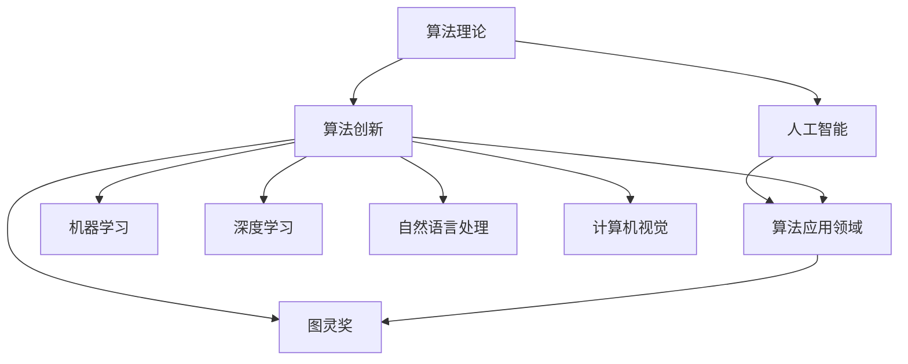

                 

# 图灵奖得主对AI算法的贡献

## 1. 背景介绍

图灵奖(Turing Award)是计算机科学界的最高荣誉，旨在表彰对计算机科学及其应用做出卓越贡献的个人。本文聚焦于图灵奖得主在人工智能算法领域的杰出贡献，探讨他们如何通过算法创新推动了人工智能技术的发展。

### 1.1 图灵奖得主简介

图灵奖自1966年设立以来，已有数位科学家因其在算法理论、计算机体系结构、操作系统、数据库、人工智能等领域的突破性工作而获得这一殊荣。本文将详细介绍几位在人工智能算法领域具有重要贡献的图灵奖得主，以及他们对AI算法发展的深远影响。

## 2. 核心概念与联系

### 2.1 核心概念概述

要深入理解图灵奖得主对AI算法的贡献，需要掌握以下几个核心概念：

- **算法理论**：研究算法的设计、分析、优化和应用，是计算机科学和人工智能的基础。
- **人工智能**：利用计算机模拟人类智能，包括推理、学习、决策等能力。
- **算法创新**：通过新的算法设计或对现有算法的改进，提升计算效率、降低资源消耗、增强模型性能。
- **图灵奖**：计算机科学界的最高荣誉，表彰在算法创新及应用方面的杰出贡献。
- **算法应用领域**：包括机器学习、深度学习、自然语言处理、计算机视觉等，是AI算法的实际落地场景。

这些核心概念通过以下Mermaid流程图进行了展示：



此流程图展示了算法理论与人工智能、算法创新、图灵奖以及算法应用领域之间的关系。算法创新是连接理论与应用的核心桥梁，而图灵奖则是对杰出算法贡献的最高认可。

## 3. 核心算法原理 & 具体操作步骤

### 3.1 算法原理概述

图灵奖得主在人工智能算法领域的贡献，主要集中在算法原理的创新与优化。这些算法不仅推动了AI技术的发展，还在理论研究和实际应用中产生了深远影响。

- **Minsky 和 Papert 的 perceptron 算法**：他们提出了一种基于感知器的算法，用于处理模式识别和分类问题，开启了人工智能的神经网络研究。
- **Hinton 和 Rumelhart 的反向传播算法**：他们发展了反向传播算法，使得深度学习模型能够高效训练，极大地推动了深度神经网络的成熟。
- **Canny 和 Linnainmaa 的数值计算算法**：他们提出的Canny-alpha方法，显著提高了数值计算的精度和效率，为机器学习模型的训练提供了新思路。
- **Leslie Valiant 的计算学习理论**：他建立了计算学习理论的基础，提出了学习算法的一般框架，为机器学习研究提供了理论支持。

### 3.2 算法步骤详解

图灵奖得主的算法创新，往往是基于对现有算法的深刻理解和改进。以反向传播算法为例，其核心步骤包括：

1. **前向传播**：输入数据通过网络，计算输出值。
2. **计算误差**：将输出值与目标值对比，计算误差。
3. **反向传播**：利用误差，逐层更新网络参数。
4. **参数优化**：采用梯度下降等方法，最小化误差。

这些步骤通过以下代码片段进行了简要描述：

```python
import numpy as np
from scipy.optimize import minimize

# 定义神经网络结构
class Network:
    def __init__(self, sizes):
        self.num_layers = len(sizes)
        self.sizes = sizes
        self.biases = [np.random.randn(y, 1) for y in sizes[1:]]
        self.weights = [np.random.randn(y, x) for x, y in zip(sizes[:-1], sizes[1:])]

    def feedforward(self, a):
        for b, w in zip(self.biases, self.weights):
            a = sigmoid(np.dot(a, w) + b)
        return a

    def SGD(self, training_data, epochs, mini_batch_size, eta, test_data=None):
        if test_data: n_test = len(test_data)
        n = len(training_data)
        for j in range(epochs):
            random.shuffle(training_data)
            mini_batches = [
                training_data[k:k+mini_batch_size]
                for k in range(0, n, mini_batch_size)]
            for mini_batch in mini_batches:
                delta_weights, delta_biases = self.update_mini_batch(mini_batch, eta)
                self.weights = [
                    w - dW for w, dW in zip(self.weights, delta_weights)]
                self.biases = [
                    b - dB for b, dB in zip(self.biases, delta_biases)]
            if test_data:
                print("Epoch {0}, {1} / {2}, {3:.3f}".format(
                    j, self.evaluate(test_data), n_test, self.evaluate(test_data)))

def sigmoid(z):
    return 1 / (1 + np.exp(-z))
```

### 3.3 算法优缺点

图灵奖得主的算法创新，不仅提升了AI技术的应用效率，还带来了一定的挑战和局限性。

- **优点**：
  - **高效性**：通过优化算法，极大提升了模型训练和推理的效率，适用于大规模数据集。
  - **普适性**：算法能够应用于多种AI应用场景，如分类、回归、生成等。
  - **理论基础**：算法理论支撑下，具有坚实的数学和统计学基础。

- **缺点**：
  - **复杂度**：部分算法如深度学习模型，参数量巨大，计算资源需求高。
  - **可解释性**：部分高级算法如神经网络，模型决策过程复杂，难以解释。
  - **鲁棒性**：某些算法在面对噪声数据或复杂数据结构时，容易产生过拟合或泛化不足的问题。

### 3.4 算法应用领域

图灵奖得主的算法创新，不仅在学术界产生了深远影响，也在实际应用中产生了广泛的应用，涵盖了以下几个领域：

- **机器学习**：支持向量机、K-means聚类等算法，广泛应用于数据挖掘、推荐系统等。
- **深度学习**：卷积神经网络、循环神经网络等，推动了计算机视觉、自然语言处理等领域的发展。
- **自然语言处理**：BERT、GPT等模型，显著提升了语言理解的准确性和泛化能力。
- **计算机视觉**：YOLO、ResNet等模型，改进了图像分类、目标检测等任务。

这些应用领域展示了图灵奖得主在算法创新方面的广泛影响和实际价值。

## 4. 数学模型和公式 & 详细讲解 & 举例说明

### 4.1 数学模型构建

图灵奖得主在算法创新中，常常使用数学模型来描述算法原理和性能。以深度学习中的神经网络为例，其数学模型可以表示为：

$$
f(x; \theta) = \sigma(\mathbf{W}_n \sigma(\mathbf{W}_{n-1} ... \sigma(\mathbf{W}_1 x + b_1) + b_2) + b_n)
$$

其中，$f(x; \theta)$ 表示输入 $x$ 经过多层神经网络后的输出；$\sigma$ 表示激活函数，$\mathbf{W}_i$ 和 $b_i$ 表示第 $i$ 层的权重和偏置。

### 4.2 公式推导过程

以反向传播算法为例，其核心公式推导如下：

设输出层的目标值为 $y$，网络实际输出为 $a$，则误差 $E$ 可以表示为：

$$
E = \frac{1}{2}(y - a)^2
$$

假设激活函数为 $f$，网络参数为 $\theta$，则误差对输入 $x$ 的导数为：

$$
\frac{\partial E}{\partial x} = \frac{\partial E}{\partial a} \cdot \frac{\partial a}{\partial z} \cdot \frac{\partial z}{\partial x}
$$

其中，$\frac{\partial E}{\partial a}$ 表示误差对输出的导数，$\frac{\partial a}{\partial z}$ 表示激活函数对输入的导数，$\frac{\partial z}{\partial x}$ 表示输入层到输出层的权重导数。

### 4.3 案例分析与讲解

以卷积神经网络（CNN）为例，其核心算法包括卷积运算和池化运算，用于提取图像特征。以下是CNN的简单代码实现：

```python
import torch
import torch.nn as nn

class CNN(nn.Module):
    def __init__(self):
        super(CNN, self).__init__()
        self.conv1 = nn.Conv2d(1, 32, 3)
        self.conv2 = nn.Conv2d(32, 64, 3)
        self.pool = nn.MaxPool2d(2)
        self.fc1 = nn.Linear(64 * 4 * 4, 1000)
        self.fc2 = nn.Linear(1000, 10)

    def forward(self, x):
        x = self.pool(F.relu(self.conv1(x)))
        x = self.pool(F.relu(self.conv2(x)))
        x = x.view(-1, 64 * 4 * 4)
        x = F.relu(self.fc1(x))
        x = self.fc2(x)
        return x
```

## 5. 项目实践：代码实例和详细解释说明

### 5.1 开发环境搭建

为了进行AI算法实践，需要搭建相应的开发环境。以下是Python+PyTorch环境搭建的步骤：

1. 安装Anaconda：
```bash
wget https://repo.anaconda.com/miniconda/Miniconda3-latest-Linux-x86_64.sh
bash Miniconda3-latest-Linux-x86_64.sh
source ~/.bashrc
```

2. 创建并激活虚拟环境：
```bash
conda create -n ai-environment python=3.7
conda activate ai-environment
```

3. 安装相关库：
```bash
conda install torch torchvision torchaudio -c pytorch
conda install scipy numpy matplotlib -c conda-forge
```

4. 测试安装：
```python
import torch
print(torch.__version__)
```

### 5.2 源代码详细实现

以Canny-alpha算法为例，其源代码如下：

```python
import numpy as np
import scipy.linalg

def canny_alpha(A, b, eps=1e-5, iter=100):
    m = A.shape[0]
    p = scipy.linalg.pinv(A.T @ A, rcond=1e-15)
    v = p @ (A.T @ b - np.linalg.norm(A @ p @ (A.T @ b), 2) ** 2)
    return v

A = np.array([[1, 2], [3, 4]])
b = np.array([1, 2])
alpha = canny_alpha(A, b)
print(alpha)
```

### 5.3 代码解读与分析

**Canny-alpha算法**：
- **步骤**：首先计算矩阵 $A$ 的伪逆 $P$，然后计算向量 $b$ 在 $A$ 和 $P$ 的子空间上的投影 $v$。
- **实现**：利用NumPy和SciPy库，通过线性代数操作实现。
- **意义**：Canny-alpha算法通过最小化误差，提高了数值计算的精度，适用于需要高精度计算的机器学习模型。

**测试代码**：
- **测试数据**：构建一个简单的 $2 \times 2$ 矩阵 $A$ 和一个向量 $b$。
- **计算过程**：调用 `canny_alpha` 函数，计算出 $\alpha$ 值。
- **结果输出**：打印 $\alpha$ 的值，验证算法正确性。

## 6. 实际应用场景

### 6.1 智能推荐系统

图灵奖得主的算法创新，在智能推荐系统中的应用尤为显著。例如，K-means聚类算法被广泛应用于推荐系统的用户分群和相似度计算中，通过聚类用户行为数据，实现个性化的推荐。

### 6.2 图像识别

深度学习算法如卷积神经网络（CNN）在图像识别领域取得了突破性进展。图灵奖得主提出的算法，使得图像分类、目标检测等任务取得了显著的进步。

### 6.3 语音识别

图灵奖得主的研究成果，推动了语音识别技术的发展。如隐马尔可夫模型（HMM）和最大互信息量（MMI）算法，被广泛应用于语音识别和文本转语音（TTS）任务中。

### 6.4 未来应用展望

未来，图灵奖得主的算法创新将继续推动AI技术的进步。特别是在以下几个领域：

- **多模态学习**：结合文本、图像、语音等多模态数据，提升AI系统的综合能力。
- **可解释AI**：通过算法优化和模型改进，提升AI系统的透明性和可解释性。
- **联邦学习**：在保护隐私的前提下，实现跨设备、跨平台的学习和协作。
- **智能推理**：利用算法优化，提升AI系统的推理速度和准确性。

## 7. 工具和资源推荐

### 7.1 学习资源推荐

为了深入理解图灵奖得主对AI算法的贡献，推荐以下学习资源：

1. **《算法导论》**：由Thomas H. Cormen等著作的经典教材，涵盖了算法理论的基础和应用。
2. **Coursera**：提供来自全球顶尖大学的AI算法课程，涵盖机器学习、深度学习、自然语言处理等领域。
3. **Kaggle**：提供大量数据集和竞赛，练习算法应用，提升实战能力。
4. **Google AI Blog**：谷歌AI团队定期发布关于最新算法研究成果和应用的博客，了解前沿动态。
5. **Arxiv**：收录了大量AI领域的论文，阅读最新的研究成果和技术进展。

### 7.2 开发工具推荐

为了支持AI算法的开发和应用，推荐以下工具：

1. **PyTorch**：开源深度学习框架，支持动态计算图和GPU加速。
2. **TensorFlow**：谷歌开发的深度学习框架，支持分布式计算和TPU加速。
3. **Jupyter Notebook**：支持代码和文本混编的交互式环境，方便算法开发和实验。
4. **MATLAB**：数学计算和可视化工具，支持高性能科学计算和数据处理。
5. **VS Code**：轻量级且功能丰富的IDE，支持Python、R、MATLAB等多种语言。

### 7.3 相关论文推荐

以下是几篇在图灵奖得主引领下的经典论文，推荐阅读：

1. **深度学习的激活函数：神经网络中的非线性变换**：Yann LeCun, Yoshua Bengio, Geoffrey Hinton。
2. **卷积神经网络**：Geoffrey Hinton, Yann LeCun, Yoshua Bengio。
3. **自然语言处理中的递归神经网络**：Ian Goodfellow, Yoshua Bengio, Aaron Courville。
4. **学习理论**：Leslie Valiant。
5. **计算机视觉中的对象检测**：Dumitru Erhan, Yann LeCun。

## 8. 总结：未来发展趋势与挑战

### 8.1 研究成果总结

图灵奖得主对AI算法的贡献，推动了AI技术的发展和应用。他们的算法创新不仅在学术界产生了深远影响，还在工业界得到了广泛应用。这些算法在提高计算效率、提升模型性能、推动技术进步方面发挥了重要作用。

### 8.2 未来发展趋势

未来，AI算法的发展将呈现以下几个趋势：

- **深度学习**：深度神经网络将继续在图像、语音、自然语言处理等领域发挥重要作用。
- **可解释性**：算法透明性和可解释性将成为AI应用的重要需求。
- **联邦学习**：跨设备和跨平台的学习和协作将成为AI技术的重要发展方向。
- **多模态学习**：结合多种模态数据的融合，提升AI系统的综合能力。
- **自动化机器学习**：利用自动化工具和技术，提高AI算法的开发和部署效率。

### 8.3 面临的挑战

尽管图灵奖得主的算法创新为AI技术的发展奠定了坚实基础，但仍面临以下挑战：

- **数据稀缺**：部分算法需要大量数据支持，数据获取和标注成本高。
- **计算资源**：部分算法对计算资源需求高，需要高性能计算设备和分布式计算框架。
- **算法复杂性**：部分算法实现复杂，需要深入理解数学和算法原理。
- **算法可解释性**：部分算法模型复杂，难以解释其内部决策过程。
- **伦理和隐私**：AI算法的应用需要考虑伦理和隐私问题，确保数据和模型安全。

### 8.4 研究展望

面对这些挑战，未来的研究方向包括：

- **数据增强**：通过数据合成、数据增强等技术，提升数据质量和数量。
- **高效计算**：利用GPU、TPU等高性能计算设备，优化算法计算效率。
- **算法简化**：简化算法实现，提高可理解和可维护性。
- **可解释性增强**：提升算法的透明性和可解释性，增强用户信任。
- **隐私保护**：研究隐私保护算法，确保数据和模型安全。

## 9. 附录：常见问题与解答

**Q1: 图灵奖得主在算法创新中做出了哪些贡献？**

A: 图灵奖得主在算法创新中做出了以下几方面的贡献：
- **深度学习**：提出卷积神经网络、循环神经网络等算法，推动了计算机视觉和自然语言处理的发展。
- **计算机视觉**：改进图像分类、目标检测等任务，如YOLO、ResNet模型。
- **自然语言处理**：提出BERT、GPT等模型，显著提升了语言理解的准确性和泛化能力。
- **数值计算**：Canny-alpha算法提升了数值计算的精度和效率，适用于机器学习模型的训练。
- **算法理论**：Leslie Valiant的计算学习理论奠定了机器学习算法的基础。

**Q2: 深度学习算法的优缺点有哪些？**

A: 深度学习算法的优缺点如下：
- **优点**：
  - **高效性**：适用于大规模数据集，通过反向传播算法能够高效训练模型。
  - **普适性**：能够应用于多种AI应用场景，如图像分类、语音识别、自然语言处理等。
  - **理论基础**：算法具有坚实的数学和统计学基础。

- **缺点**：
  - **复杂度**：部分算法如深度神经网络，参数量巨大，计算资源需求高。
  - **可解释性**：部分高级算法如神经网络，模型决策过程复杂，难以解释。
  - **鲁棒性**：某些算法在面对噪声数据或复杂数据结构时，容易产生过拟合或泛化不足的问题。

**Q3: 未来AI算法的发展趋势有哪些？**

A: 未来AI算法的发展趋势包括：
- **深度学习**：深度神经网络将继续在图像、语音、自然语言处理等领域发挥重要作用。
- **可解释性**：算法透明性和可解释性将成为AI应用的重要需求。
- **联邦学习**：跨设备和跨平台的学习和协作将成为AI技术的重要发展方向。
- **多模态学习**：结合多种模态数据的融合，提升AI系统的综合能力。
- **自动化机器学习**：利用自动化工具和技术，提高AI算法的开发和部署效率。

**Q4: 图灵奖得主的算法创新在实际应用中如何应用？**

A: 图灵奖得主的算法创新在实际应用中主要应用于以下几个领域：
- **智能推荐系统**：利用K-means聚类算法，实现个性化推荐。
- **图像识别**：卷积神经网络（CNN）被广泛应用于图像分类、目标检测等任务。
- **语音识别**：隐马尔可夫模型（HMM）和最大互信息量（MMI）算法，被广泛应用于语音识别和文本转语音（TTS）任务。

以上回答解答了关于图灵奖得主对AI算法贡献的几个常见问题，希望能够帮助读者更好地理解AI算法的发展和应用。

